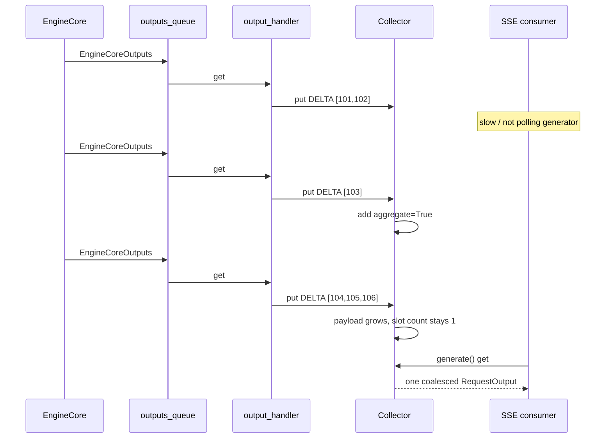

> 源码基线：[`vllm-project/vllm@a447955a`](https://github.com/vllm-project/vllm/commit/a447955acad919a6902d65f0af2d4f76c0335ed3)。下文把 `main` 已合入实现称为“代码事实”，仓库测试实际断言称为“测试事实”；容量估算与改进方案属于基于代码的推断。开放 PR 只作为计划信息，不当作当前行为。

## 本篇在课程路线中的位置

第 15 章从 HTTP disconnect 追到了 Scheduler terminal 与 KV 安全释放。本章沿相反方向研究正常输出：**EngineCore 生成得比 HTTP 客户端读取更快时，token 暂存在哪里，`RequestOutputCollector` 到底限制了什么，又没有限制什么？** 这是 Serving 阶段的第二个边界，也是后续性能与故障诊断的入口。

## 前置知识回顾

- `EngineCoreOutput` 已越过 GPU/Scheduler 提交边界；这里处理的是 Host 侧 token、logprobs 和文本，不再是 device logits tensor。
- `AsyncLLM.generate()` 是每个请求的 async generator；`completion_stream_generator()` 把它转换为 OpenAI SSE chunk。
- 断连会关闭 generator 并 abort；今天讨论的是连接仍在、但消费者很慢的情况。

## 本篇要回答的核心问题

1. `EngineCoreOutputs` 如何穿过跨进程队列、批处理 output handler 和每请求 collector，最终成为 SSE？
2. 为什么 collector 只有一个槽，仍不能称为“有界内存背压”？
3. `DELTA`、`CUMULATIVE`、`FINAL_ONLY` 在生产者领先时分别如何保留语义？
4. output handler 崩溃时，未发送 chunk、异常和 `[DONE]` 如何收敛？

## 组件在全局架构中的位置

[`EngineCoreOutputs`](https://github.com/vllm-project/vllm/blob/a447955acad919a6902d65f0af2d4f76c0335ed3/vllm/v1/engine/__init__.py) 是 `msgspec.Struct(array_like=True)`：`outputs` 逻辑 shape 为 `[num_reqs]`，每个 [`EngineCoreOutput`](https://github.com/vllm-project/vllm/blob/a447955acad919a6902d65f0af2d4f76c0335ed3/vllm/v1/engine/__init__.py) 携带 `new_token_ids: list[int]`、可选 Host logprobs、finish metadata 等。生成路径上没有固定 dtype/device 的 tensor；序列长度可变，speculative decoding 时一次可返回多个 accepted tokens。

```mermaid
flowchart LR
    EC["EngineCoreOutputs<br/>msgpack / Host objects"] --> Z["AsyncMPClient<br/>ZMQ PULL"]
    Z --> AQ["outputs_queue<br/>asyncio.Queue"]
    AQ --> OH["AsyncLLM.output_handler"]
    OH --> OP["OutputProcessor.process_outputs<br/>detokenize + RequestOutput"]
    OP --> RC["RequestOutputCollector<br/>one pending object"]
    RC --> GEN["AsyncLLM.generate<br/>get / yield"]
    GEN --> MERGE["merge_async_iterators"]
    MERGE --> CSG["completion_stream_generator<br/>JSON + data: ..."]
    CSG --> SR["StreamingResponse<br/>text/event-stream"]
```

这里存在三个速率：Core 到达速率、API 进程处理速率、网络消费速率。当前实现分别用跨进程接收队列、output-handler 分片和单槽合并吸收速率差；三者都不是端到端容量证明。

## 完整调用链

[`AsyncMPClient._ensure_output_queue_task`](https://github.com/vllm-project/vllm/blob/a447955acad919a6902d65f0af2d4f76c0335ed3/vllm/v1/engine/core_client.py) 创建 socket-reader task：`recv_multipart(copy=False) → decoder.decode → outputs_queue.put_nowait(outputs)`。`outputs_queue` 构造时没有 `maxsize`，所以 reader 不因 API output handler 变慢而等待。

[`AsyncLLM._run_output_handler`](https://github.com/vllm-project/vllm/blob/a447955acad919a6902d65f0af2d4f76c0335ed3/vllm/v1/engine/async_llm.py) 持续 `await engine_core.get_output_async()`。一个 `EngineCoreOutputs` 内可能有许多请求，它按 `VLLM_V1_OUTPUT_PROC_CHUNK_SIZE` 切片，并在片间 `await asyncio.sleep(0)`，目的是避免单次 Host 处理长期霸占 event loop；这改善公平性，但没有削减 payload。

随后 [`OutputProcessor.process_outputs`](https://github.com/vllm-project/vllm/blob/a447955acad919a6902d65f0af2d4f76c0335ed3/vllm/v1/engine/output_processor.py) 按 internal request ID 找到 `RequestState`，更新 detokenizer/logprobs，再由 `make_request_output()` 构造 Host `RequestOutput` 并调用 `state.queue.put()`。这个 `put()` 同步且不阻塞。

前台 [`AsyncLLM.generate`](https://github.com/vllm-project/vllm/blob/a447955acad919a6902d65f0af2d4f76c0335ed3/vllm/v1/engine/async_llm.py) 优先 `get_nowait()`，空槽才 `await get()`；取得对象后槽立刻清空，直到 `out.finished` 才结束。OpenAI Completion 路由经过 [`OpenAIServingCompletion._create_completion`](https://github.com/vllm-project/vllm/blob/a447955acad919a6902d65f0af2d4f76c0335ed3/vllm/entrypoints/openai/completion/serving.py) 与 `merge_async_iterators()`，`completion_stream_generator()` 把每个 `CompletionOutput` 序列化为 `data: {json}\n\n`，最后发送 `data: [DONE]\n\n`；[`create_completion`](https://github.com/vllm-project/vllm/blob/a447955acad919a6902d65f0af2d4f76c0335ed3/vllm/entrypoints/openai/completion/api_router.py) 用 `StreamingResponse(media_type="text/event-stream")` 交给 ASGI。

## 关键类型、字段和状态生命周期

| 边界 | 输入/输出与所有权 | 前置/后置条件 | 失败方式 |
| --- | --- | --- | --- |
| `AsyncMPClient.outputs_queue` | API 进程拥有；元素是 decoded `EngineCoreOutputs` | socket reader `put_nowait`，output handler `await get` | 无 `maxsize`；handler 落后时对象数可增长 |
| `RequestState.make_request_output` | token IDs、detokenizer、logprobs 状态 → `RequestOutput` | DELTA 只取未发送 span；FINAL_ONLY 未结束时返回 `None` | interval/offset 错误会重复或漏 token |
| `RequestOutputCollector.output` | 单个 `RequestOutput | Exception | None` | `put` 非阻塞；`get` 取走并清 Event | 单槽限制对象数，不限制对象内部 bytes |
| `RequestOutput.add` | 同 request 的后续输出 | 按 `CompletionOutput.index` 合并或替换 | index/顺序错误会污染 `n>1` choice |
| SSE generator | `RequestOutput` → Python `str` JSON event | 每次 `yield` 后等待上层再次迭代 | HTTP 已 200 后只能流内报错，不能改状态码 |

生命周期是：Core 创建 batch 输出；socket task decode 后暂存；output handler 将其拆成 request-local 对象；collector 在消费者落后时持有或改写同一个对象；`generate()` 取得所有权并清槽；SSE 序列化后，由响应栈发送，局部引用随后释放。collector、output handler 与 `generate` 运行在同一 API asyncio loop，代码没有把 collector 定义成跨线程队列。

## 逐函数源码解读

### 1. `RequestOutputCollector.put`：compaction，不是 flow control

槽为空时直接保存并 `ready.set()`。槽非空且两者都是 `RequestOutput` 时，调用 [`RequestOutput.add`](https://github.com/vllm-project/vllm/blob/a447955acad919a6902d65f0af2d4f76c0335ed3/vllm/outputs.py)：

- `DELTA`：同 index 的 `text` 拼接、`token_ids/logprobs` extend，累计 logprob 与 finish metadata 取最新值；新 index append。
- `CUMULATIVE`：同 index 直接替换为最新完整 snapshot，不同 index 仍保留。
- `FINAL_ONLY`：OutputProcessor 在结束前不创建 output，collector 通常只看到终态。

因此槽数最多一个，但 DELTA 槽内列表和字符串会继续长大。生产者从不等待消费者，故不存在“容量满→减速上游”的反馈边。

### 2. `stream_interval`：降频，不是限额

`RequestState.from_new_request()` 取 `max(request.stream_interval, engine_default)`。interval 大于 1 时，首 token 仍立即发送；之后只有 finish 或新增 token 数达到 interval 才创建 output。它减少 detokenize/JSON/event-loop 次数，但消费者若持续停顿，后续多个 chunk 仍会在 collector 内合并，最终 payload 仍覆盖这段时间产生的全部 DELTA。

### 3. `get/get_nowait`：原子转移 pending ownership

两者都先读 `self.output`，再设为 `None` 并清除 Event；`generate()` 的 nowait fast path减少高负载下 task switch。由于 API loop 内没有 `await` 插在 collector 的 put/get 状态修改中间，这个转移不会被同 loop task打断。它不是通用线程安全承诺。

### 4. 错误优先级：Exception 覆盖未消费数据

output handler 捕获任意异常后调用 `OutputProcessor.propagate_error()`；collector 的 `put(Exception)` 无条件替换当前 pending output。下一次 `get` 直接 raise，`AsyncLLM.generate` 对 engine-dead 保留原错误，对其他意外错误清理请求并转成生成错误；SSE 层输出 error event，最后仍发送 `[DONE]`。这条路径选择 fail-fast：未发送的普通 chunk 可以被异常覆盖，不能把失败流误认为完整成功流。

## 具体示例与 shape/状态演算

设单请求 `R` 使用 `DELTA`、`stream_interval=1`，网络消费者暂停三次 Core 回传。speculative decoding 使三次 `new_token_ids` 长度分别为 2、1、3：

| 时刻 | 新 Host payload | collector 槽内 `token_ids` | 槽内 text | 节点数 |
| --- | --- | --- | --- | ---: |
| T0 | 空 | `None` | — | 0 |
| T1 | `[101,102]` | `[101,102]` | `"AB"` | 1 |
| T2 | `[103]` | `[101,102,103]` | `"ABC"` | 1 |
| T3 | `[104,105,106]` | `[101..106]` | `"ABCDEF"` | 1 |
| T4 | HTTP 恢复并 `get()` | `None` | — | 0 |

若每 token 还带 top-k logprobs，槽内不仅有 6 个 token ID，还累计 6 组候选字典。静默时间为 `T`、期间生成 `g(T)` 个 token 时，pending bytes 至少随 `g(T)` 线性增长；跨请求总量近似是所有慢请求 pending payload 之和。字符串反复 `+=` 还可能带来额外复制成本——这是复杂度推断，仓库没有给出内存曲线。

## 为什么这样设计及替代方案

从第一性原理看有三个硬约束：token 不能无声丢失；一个慢客户端不应让共享 output handler 阻塞所有请求；GPU/Core 不应直接受单个 TCP 窗口控制。单槽无损合并满足这三点，并降低 Python 对象与 coroutine 唤醒次数，所以它是合理的吞吐优先设计；但“无损 + 上游不停 + 下游任意慢”不可能同时保证有限内存。

| 方案 | 延迟/吞吐 | 内存与并发 | 正确性/维护 |
| --- | --- | --- | --- |
| 当前单槽合并 | 快 producer 不等待；SSE 恢复后收到大 chunk | 节点少，payload 无硬上限；请求间较隔离 | 语义清晰，缺少 byte/age guard |
| `asyncio.Queue(maxsize=N)` 并 `await put` | 真正施加压力 | 若共享 output handler 被一个请求卡住，会产生全局 head-of-line | 需要每请求 dispatcher，任务数与取消复杂度上升 |
| 每请求 byte/age budget，超限 abort | 保持 Core 吞吐，及时释放慢请求 | 可给出可运营上限与公平性 | 必须定义错误码、日志、指标和代理重试语义 |
| 增大 `stream_interval` | 减少 Host/SSE 调度开销 | 不能约束无限停顿，且增加可见 token 延迟 | 最容易维护，只是调参而非容量协议 |

此路径位于 CUDA Graph 之外，不直接改变 graphability；但若采用全局阻塞背压，Scheduler request mix 与 batch cadence 会间接受网络慢客户端影响，吞吐和 graph replay 命中都更难预测。

## 性能、并发、正确性与边界条件

- `outputs_queue` 无界、collector 单槽：前者可能增长对象数，后者可能增长单对象 payload；只观察 queue length 会漏掉第二类压力。
- `n>1` 依赖 output index：DELTA 对同 index 追加，不同 index 并存；CUMULATIVE 用最新 snapshot 替换同 index，不能整对象覆盖。
- `FINAL_ONLY` 把全量文本保存在 detokenizer/RequestState，collector 不积中间对象，但最终对象仍与输出长度同阶。
- `VLLM_V1_OUTPUT_PROC_CHUNK_SIZE` 保护 event-loop 响应性，不是 socket、queue 或 request payload 的容量参数。
- SSE 的异步迭代会随下游发送暂停，但这个暂停没有反向传播到 `RequestOutputCollector.put()`。
- 当前没有 per-request buffered bytes、oldest-pending age 或 coalesced chunk count 指标，运维无法直接区分“正常大 chunk”和“慢消费者积压”。

## 测试证据与未覆盖风险

[`test_request_output_collector`](https://github.com/vllm-project/vllm/blob/a447955acad919a6902d65f0af2d4f76c0335ed3/tests/v1/engine/test_output_processor.py) 连续 put 3 个 DELTA，其中最后一个 finished；测试断言文本、token IDs、logprobs 全部合并，cumulative logprob 与 finish reason 取最后值。这证明无损 coalescing 与终态传播。

同文件的 `test_cumulative_output_collector_n` 让第一次输出含 index 0/1，第二次含 index 0/2；断言 index 0 被最新 cumulative snapshot 替换，1 保留、2 新增。`test_incremental_detokenization` 覆盖 DELTA/FINAL_ONLY × interval 1/5/10，重建后的 token/text 等于 golden；请求级 interval 测试还确认只能提高、不能低于 engine default。

[`test_abort_final_output`](https://github.com/vllm-project/vllm/blob/a447955acad919a6902d65f0af2d4f76c0335ed3/tests/v1/engine/test_async_llm.py) 明确允许 final abort 与前一 DELTA coalesce，验证 `finished=True, finish_reason="abort"`。这些都是语义测试，不是背压实验。

缺口是：没有让 SSE consumer 停顿数十秒并持续生成的 E2E；没有断言 `outputs_queue` 或 collector 的 byte 上限；没有 logprobs×长输出×`n>1` 内存曲线；没有证明异常覆盖 pending chunk 后的 SSE 序列；也没有多慢客户端对正常请求 P99 的隔离基准。开放 [PR #36130](https://github.com/vllm-project/vllm/pull/36130) 截至本基线仍未合入，它提议给 collector 增加 request/stall watchdog，但针对“没有新输出”的 engine stall，不等价于“输出持续产生、网络消费很慢”的 backlog budget。

## 与前后章节的连接

第 03 章已指出跨进程队列没有有界应用层背压；本章把压力继续追到每请求 collector 与 SSE，并区分“队列节点数”和“payload bytes”。第 15 章解释慢连接最终断开后的 abort；本章解释它在断开之前为何可能积累 Host 状态。

下一章将研究多 prompt × `n>1` 的 fan-in：`merge_async_iterators` 如何维持来源 index、关闭剩余 iterator，以及一个慢或失败的 child 是否影响其他流的公平性与终态。

## 本篇结论、知识债与理解检查

结论：**`RequestOutputCollector` 是 lossless compactor，不是 bounded backpressure queue。** 它把“很多 pending chunk”压成“一个会变大的对象”，让 Core 与网络速率解耦并避免单请求 head-of-line，却把无限慢消费者问题转化成 payload 内存、复制成本和尾延迟。

知识债：需要给 `outputs_queue`、collector payload、ZMQ/SSE buffer 建立同一套 bytes/age 可观测性；通过真实慢读 socket 测试量化 logprobs、长输出、`n>1` 和取消风暴；再决定 per-request budget 超限时是 abort、降级 logprobs，还是施加隔离后的异步背压。

三个理解检查问题：

1. 为什么 `output` 字段最多只有一个对象，仍不能推出 collector 是 O(1) 内存？
2. 若把 collector 换成 `Queue(maxsize=1)` 并让共享 output handler `await put()`，哪个请求会拖住哪些请求？
3. CUMULATIVE 模式为什么要按 choice index 替换，而不能简单丢弃前一个 `RequestOutput`？

## 课程账本增量

- 完成：第 16 章，`EngineCoreOutputs → AsyncMPClient.outputs_queue → output_handler → OutputProcessor → RequestOutputCollector → AsyncLLM.generate → completion_stream_generator → SSE`。
- 新确认不变量：单槽限制 pending 对象数而非 bytes；DELTA 合并、CUMULATIVE 按 index 替换；exception 优先覆盖 pending data；stream interval 只降频。
- 新增风险：缺少真实慢读、byte/age budget、跨三层 buffer 指标与异常序列 E2E。
- 下一章：`merge_async_iterators` 的多 prompt × `n>1` fan-in、公平性、关闭与失败收敛。
