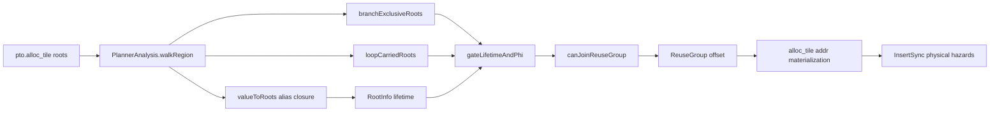
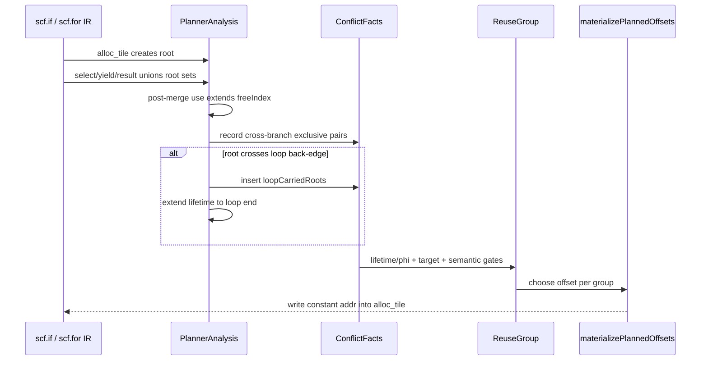

> 本文代码事实基于 PTOAS 默认分支提交 [`fc8db5ef`](https://github.com/hw-native-sys/PTOAS/commit/fc8db5ef72ce7b9bc0b4f6cb33ebc4e95e6779e4)。引入 modern planner 的设计背景见已合入 [PR #913](https://github.com/hw-native-sys/PTOAS/pull/913)。文中把“当前代码”“lit 测试”“设计文档”和“硬件推断”分开陈述。

## 本篇在 PTO 课程路线中的位置

课程 16 说明地址被 PlanMemory 复用后，异步 pipe 的物理 ownership 还要由 InsertSync 延长；课程 17 又说明 `freeIndex == allocIndex` 只是 touching，A3 target hazard 与 semantic no-alias 仍可否决共址。本篇继续留在 **PTOAS local-memory allocator**：只回答一个控制流问题——两个静态生命周期重叠的 Tile，什么时候能因为运行时互斥而共享同一段 UB？

它位于 `Tile IR → PTOAS PlanMemory → alloc_tile(addr) → InsertSync → EmitC/device` 链路中间。上游输入是带 `scf.if/for/while`、`pto.alloc_tile` 和 Tile alias 的 MLIR；下游消费者是已写入字节地址的 `pto.alloc_tile` 以及后续同步分析。

## 前置知识

modern planner 的基本单位不是 SSA 名字，而是 allocation **root**。`pto.alloc_tile` 创建 root；`subview/bitcast/reshape/multi_tile_get` 等值只携带 root 集。每个 `RootInfo` 记录 address space、对齐后字节数、`allocIndex/freeIndex` 和访问统计。候选 root 加入一个 `ReuseGroup` 前，必须逐一通过 lifetime/phi、target hazard、semantic no-alias 三道 hard gate；cost 只在 gate 通过后排序。

这里还要区分两个“同时”：

- **静态同时 live**：线性 walk 后两个区间重叠；这是保守分析事实。
- **运行时同时存在**：某条真实控制流路径上，两个 payload 都必须保留；这才决定能否共址。

`phi family` 的价值，就是证明某些“静态重叠”并不对应“运行时共存”。

## 今日核心问题

1. `scf.if` 两个分支 yield 出来的 root 为何可以共享地址，而且 `arith.select` 产生的多 root alias 为什么仍能安全闭包？
2. 同样的分支一旦成为 `scf.for/scf.while` 的 loop-carried state，为什么必须取消这个豁免？

## PTO 全栈中的位置



图中 `branchExclusiveRoots` 只提供“允许越过 lifetime overlap”的证据；它不分配地址，也不替代后续 target/semantic gate。`loopCarriedRoots` 则是明确的否决证据。

## 概念和精确语义

设计文档 [`ptoas-largest-first-fit-four-gates-memplan-design.md`](https://github.com/hw-native-sys/PTOAS/blob/fc8db5ef72ce7b9bc0b4f6cb33ebc4e95e6779e4/docs/designs/ptoas-largest-first-fit-four-gates-memplan-design.md) 用“同一个 phi family 的 yield source”描述互斥复用。当前实现没有维护宽泛的 `familyId`，而是维护更直接的对称关系：

```cpp
DenseMap<Value, RootList> branchExclusiveRoots;
DenseSet<Value> loopCarriedRoots;
```

对一个有结果的 `scf.if`，`recordIfBranchExclusivity` 按**同一 result 位置**配对 then/else yield，只保留定义在各自 region 内的 root，再为两边 root 做笛卡尔积。由此得到的事实是：`thenRoot ↔ elseRoot` 运行时不可能来自同一次 `if` 执行。

必要条件可以写成：

\[
share(a,b) = sameSpace \land (\neg overlap(a,b) \lor exclusive(a,b))
\land \neg targetHazard \land \neg semanticNoAlias
\]

而 `exclusive(a,b)` 还隐含 `a,b ∉ loopCarriedRoots`。因此它不是“分支里的 Tile 都可复用”，而是“同一结果位、对向分支、本地定义、未跨 back-edge 的 root pair 可以越过 lifetime overlap”。

非法或不能获得豁免的组合包括：同一分支中的两个 root；不同 `scf.if` 的 root；某一侧从外层捕获而非分支内创建的 root；没有作为对应 result yield source 的临时值；任一 root 进入 loop-carried closure；以及 target/semantic gate 拒绝的 pair。

## 真实文件、类型、API 逐段解读

核心实现集中在 [`PTOPlanMemoryModern.cpp`](https://github.com/hw-native-sys/PTOAS/blob/fc8db5ef72ce7b9bc0b4f6cb33ebc4e95e6779e4/lib/PTO/Transforms/PTOPlanMemoryModern.cpp)。

### 1. `valueToRoots`：alias 不是单 root 假设

`addRoot` 为无地址 `pto.alloc_tile` 建立 `RootInfo`，并令 `valueToRoots[allocResult]={root}`。随后：

- `subview/bitcast/reshape/multi_tile_get` 继承 source 的完整 root set；
- `arith.select` 取 true/false 两侧 root 的 union；
- `RegionBranchOpInterface` 把 entry operand、terminator operand 和 successor input 连起来；
- `scf.if` result 因两个 yield 最终得到两侧 root 的 union。

这是 alias closure 的关键：后续 `%merged` 被 `TSTORE` 读取时，`markUse(%merged)` 会同时延长所有可能 source root 的 `freeIndex`。如果只记一个 root，另一条分支的 payload 会被当作提前死亡，形成真实地址碰撞。

### 2. `recordIfBranchExclusivity`：只记可证明的 cross pair

函数先从 then/else yield 的 root set 中筛选 `isRootDefinedInRegion`，再执行：

```text
for thenRoot in thenLocalRoots:
  for elseRoot in elseLocalRoots:
    addBranchExclusivePair(thenRoot, elseRoot)
```

这个 pair map 比“整个 if 内所有 root 属于一个 family”更精确。同一 then 分支里的 `%a`、`%b` 可能同时被写入和读取，绝不能因为都参与一个 merged value 就共址；它们只分别与 else 分支的 `%c` 互斥。

### 3. `gateLifetimeAndPhi`：豁免嵌在 lifetime gate

`lifetimesStrictlyOverlap` 把端点相等视为不严格重叠；如果真的重叠，`gateLifetimeAndPhi` 唯一的放行路径是 `areBranchExclusive`。后者首先检查 `loopCarriedRoots`：任一侧命中就直接 `false`，之后才查询 pair map。

最后，`canJoinReuseGroup` 会把新 root 与 group 的**每个成员**执行 `canShare`。因此一个 root 即使与成员 A 互斥，只要与成员 B 真正共存，就不能借 A 的证明混入整个 group。

### 4. `finalizeFor/WhileLoopLiveness`：back-edge 是动态时间维度

`scf.for` 将 `initArg` 与 body `yielded` 的 root union 同时赋给 iter arg 和 loop result，并把其中每个 root 加入 `loopCarriedRoots`；其区间扩展到整个 loop。`scf.while` 更保守地收集 init、result、两个 region 的 block argument 与 terminator operand，同样扩展到完整 region-branch cycle。

这不是性能 heuristic，而是正确性 hard gate：线性 IR 只出现一次 loop body，运行时却可能执行多次。上一迭代选择的 branch root 会成为下一迭代的 incoming state；“then 与 else 在单次迭代互斥”无法证明“第 i 次的 then 与第 i+1 次的 else 不共存”。

## 对象与状态生命周期

以一个 `16×16xf16` Vec Tile 为例，每个 root 的原始 payload 是 `16×16×2=512 B`；A3 Vector UB 的具体对齐由 `MemSpec` 应用，当前 lit 结果也是 512 B 步进。



root 的 owner 始终是原始 `pto.alloc_tile`；alias value 只持有可能 root 集，不拥有新内存。分析状态活到 pass 结束；最终持久化的是 `alloc_tile` 上的常量地址。地址可在互斥路径复用，但 payload 只在实际执行的那条路径上有效。后续某个 merged alias 的最后消费结束后，才允许逻辑复用；异步设备访问是否完成仍属于 InsertSync 的职责。

## 端到端调用链

完整链为：

`PlanMemoryModernPass::runOnOperation` → `runModernPlanMemory(func)` → `PlannerAnalysis::walkRegion` → root/alias/lifetime/control-flow facts → `chooseReuseGroupByCost` → `canJoinReuseGroup` → `canShare` → `gateLifetimeAndPhi` → group packing → `materializePlannedOffsets` → `AllocTileOpAddPlannedAddressPattern`。

`runModernPlanMemory` 先按 address space 分组，再按配置做 stable order 或 largest-first。每个 `ReuseGroup` 的大小取成员最大 `totalBytes`；所有成员得到相同 group base。若 packed footprint 超过该 memory space capacity，pass 直接报 overflow，而不是放松 gate。物化后还运行 `verifySemanticNoAliasRanges`，最后拒绝仍未获得地址且仍有 use 的 `alloc_tile`。

## 具体 shape、Tile 和状态演算

### 例 1：select closure 既要复用，也要保留同分支并存

直接测试 [`plan_memory_five_gates_phi_family_select.pto`](https://github.com/hw-native-sys/PTOAS/blob/fc8db5ef72ce7b9bc0b4f6cb33ebc4e95e6779e4/test/lit/pto/plan_memory_five_gates_phi_family_select.pto) 的 then 分支创建 `%a/%b`，通过 `arith.select` 得到 `%selected`；else 分支创建 `%c`。三者都是 `!pto.tile_buf<vec,16x16xf16>`。

1. `%a`、`%b` 各 512 B；同一 then 路径中两次 `TLOAD` 都可能发生，故不能共址。
2. `%selected` 的 root set 是 `{a,b}`；`%merged` 的 root set 是 `{a,b,c}`。
3. post-if `TSTORE(%merged)` 把 a、b、c 的静态生命周期都延长到 join 之后，于是区间看起来重叠。
4. exclusivity 只记录 `(a,c)` 与 `(b,c)`，不记录 `(a,b)`。
5. FileCheck 期望 `a@0 B`、`b@512 B`、`c@0 B`。静态总分配从 1536 B 压到 1024 B；任一路径的真实峰值恰好也是 1024 B（then 同时保留 a/b，else 只需 c）。

基本测试 [`plan_memory_five_gates_phi_family.pto`](https://github.com/hw-native-sys/PTOAS/blob/fc8db5ef72ce7b9bc0b4f6cb33ebc4e95e6779e4/test/lit/pto/plan_memory_five_gates_phi_family.pto) 更简单：then/else 各一个 512 B Tile，两者都得到地址 0，footprint 从 1024 B 降为 512 B。

### 例 2：进入 loop-carried closure 后必须是 0/512/1024

[`plan_memory_loop_backedge_liveness.pto`](https://github.com/hw-native-sys/PTOAS/blob/fc8db5ef72ce7b9bc0b4f6cb33ebc4e95e6779e4/test/lit/pto/plan_memory_loop_backedge_liveness.pto) 的第三个函数让 `%init` 作为 `scf.for iter_args` 输入，每轮用 `scf.if` 在 `%then/%else` 中产生 `%next`，再 yield 给下一轮。

单看某一轮，then/else 互斥；但动态序列可以是：第 0 轮产生 then payload → 第 1 轮先读取 carried（仍是旧 then payload）→ 第 1 轮 else 分支写新 payload。若 then 与 else 都是地址 0，第二次写就可能覆盖尚未消费完的 carried。因此 root union `{init,then,else}` 全部进入 `loopCarriedRoots`，branch-exclusive pair 被否决。FileCheck 要求三者分别为 `0/512/1024 B`，总 footprint 1536 B。

注意：这条测试验证的是**规划后地址拓扑**，不是设备异步完成时序。它证明 allocator 没有做不合法共址；若后续存在跨 pipe 访问，仍需同步 pass 证明完成顺序。

## 为什么这样设计及替代方案

第一性原理约束只有一句：同一物理字节在任一真实执行时刻只能有一个未结束的 payload owner。普通 interval allocator 用线性区间近似这个约束，安全但会把 join 后的 alias use 同时算到两侧；branch pair 则以最小控制流事实修复这份过度保守。loop back-edge 引入动态实例后，有限的静态 pair 不足以区分迭代编号，所以 fail closed 是最简单可辩护的选择。

替代方案有三种：

- **永不做 branch reuse**：实现和维护成本最低，正确性直观，但例 1 多占 512 B，可能挤掉更大 Tile 或显式 multibuffer。
- **先把两侧结果 copy 到统一 join buffer**：地址证明简单，却新增最多 512 B 搬运，并延长 MTE/Vector 流水；吞吐和延迟都可能变差。
- **完整 path-sensitive、iteration-sensitive allocator**：可区分 `(root,iteration)`，理论复用最多，但需要 CFG dataflow、循环不变量和 alias provenance 的组合证明，编译时间、验证与维护成本显著上升。

当前“精确 cross-pair + loop deny-set + pairwise group check”处在中间点：吃到常见 `scf.if` 收益，同时把循环复杂性显式挡在 gate 外。

## 访存、计算、流水、并行和硬件约束

branch reuse 不减少 `TLOAD/TSTORE` 的 GM 字节数，也不改变 Tile 的 shape、dtype、layout 或指令计算量；它只降低 local address envelope。较小 UB footprint **可能**为更大 tiling、double buffering 或更多临时 Tile 留空间，这是基于固定片上容量的工程推断，本文没有 device benchmark 证明吞吐提升。

地址共享也不意味着两个分支并行：`scf.if` 语义保证一次执行只进入一个 region；公开代码没有在这里证明具体 Ascend 分支指令或 speculative execution 细节，因此不外推微架构。若上层未来把 branch 转成“两侧都执行再 predicated select”，该变换必须保留 alias 安全，不能无条件沿用原 pair 事实。

对 loop，no-exemption 会提高 footprint，却避免跨迭代 owner 碰撞。它还提高 graphability：地址在编译期仍是常量，控制流只选择 payload，不需要运行时 allocator。但更保守的静态地址会降低容量利用率；是否值得做 loop-aware 优化，必须由真实 UB pressure 与设备 stall 数据驱动。

## 测试证据与未覆盖风险

**测试事实：**

- `phi_family.pto`：两个对向分支各 load 一个 `16×16xf16` Tile，验证两者都是 addr 0。
- `phi_family_select.pto`：then 内 a/b 同时存在、else 内 c，验证 `0/512/0`，同时守住 alias union 与“同分支不可误复用”。
- `loop_backedge_liveness.pto`：覆盖 loop invariant、普通 carried yield、branch-produced carried root；最后一例验证 `0/512/1024`。
- [`plan_memory_modern_region_branch_alias.pto`](https://github.com/hw-native-sys/PTOAS/blob/fc8db5ef72ce7b9bc0b4f6cb33ebc4e95e6779e4/test/lit/pto/plan_memory_modern_region_branch_alias.pto)：覆盖 `scf.execute_region` result alias 与 `scf.while` before/after back-edge，验证它们不与仍活跃 scratch 共址。

这些是 `ptoas → pto-plan-memory → FileCheck` 的 compiler tests，验证地址常量与无 `memref.alloc` 回退；它们不执行真机数值，也不测 InsertSync event topology、UB peak 性能或不同分支概率。

**当前未覆盖风险：**嵌套 `if` 的 family 组合；branch yield 前经过多层 `subview→bitcast→reshape` 的直接 closure 矩阵；一侧 yield 外层捕获 root 的负例；phi exemption 与 A3 target/semantic gate 同时命中的交叉测试；循环 zero-trip、early exit 与 nested while/if；predication/CFG lowering 后的地址等价性；设备 poison/delay 检验跨迭代低概率覆盖。

**文档/PR 事实：**设计文档把 phi family 作为 gate 概念，[PR #913](https://github.com/hw-native-sys/PTOAS/pull/913) 引入 modern planner 及相关用例；最终行为仍以本文基线的主干代码和测试为准。

## 与前后章节的连接

向前看，课程 17 的 touching 是“时间端点相接”；本篇的 branch-exclusive 是“区间重叠但路径互斥”。两者都是 lifetime gate 的放行理由，却都不能越过 target/semantic gate。向后看，root pair 最终变成同一物理地址后，课程 15–16 的 InsertSync 仍要处理真实跨 pipe RAW/WAR/WAW；控制流互斥证明与设备完成证明是两套不同的责任。

下一章将研究 **modern PlanMemory 的地址空间容量、alignment、largest-first/group cost 与 fragmentation**：为什么“安全可复用”还不等于“应该复用”，以及 512 B/更大 Tile、multibuffer slot 和 `reserve_buffer` 如何共同决定 packed footprint。

## 本篇结论、知识债与理解检查

结论：`phi family` 不是把一个 `if` 里的 Tile 全放到同一地址，而是为同一 result 位的对向、本地 root 建立精确互斥 pair；alias closure 保证 merged/select/view 的所有可能 root 都参与 lifetime 和 gate；一旦 root 进入 `for/while` back-edge，单迭代互斥不再能证明跨迭代不共存，因此 `loopCarriedRoots` 必须 fail closed。最终 group 仍要逐成员通过 target 与 semantic gate。

知识债：嵌套控制流与多层 view closure 的直接负例、branch/target/semantic 三 gate 组合矩阵、lowering 后 CFG 等价性、UB footprint/编译耗时基准，以及真机跨迭代 poison/delay 验证。

三个理解检查问题：

1. 为什么 `arith.select(%a,%b)` 之后，`%a/%b` 不能因为共同成为一个结果的候选 root 而共址？
2. `scf.if` 的 then/else root 已记录为互斥，为什么它们被 `scf.for iter_args` 携带后仍要分别分配地址？
3. 如果 pair 通过 branch-exclusive gate，但某个 PTO op 的 semantic no-alias 明确禁止 input/output 共址，最终 planner 应该怎样处理？

## 课程账本增量

- 完成章节：课程 18，PTOAS modern PlanMemory 的 branch-exclusive root pair、alias closure 与 loop-carried no-exemption。
- 新增调用链：`walkRegion → valueToRoots union → recordIfBranchExclusivity/finalizeLoopLiveness → gateLifetimeAndPhi → canJoinReuseGroup → materializePlannedOffsets`。
- 新增不变量：branch 豁免只覆盖同一 `scf.if` result 位的对向、本地 root；同分支 root 不互斥；任一 loop-carried root 否决豁免；reuse group 必须逐成员通过全部 hard gate。
- 测试锚点：`phi_family` 的 `0/0`、`phi_family_select` 的 `0/512/0`、loop-carried branch roots 的 `0/512/1024`，以及 `scf.while` region-branch alias no-reuse。
- 下一章：Largest-First-Fit、reuse cost、alignment/capacity 与 fragmentation 的边界。
