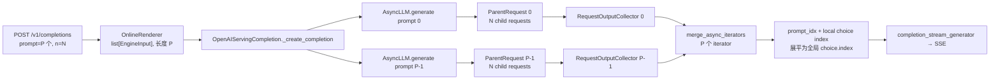
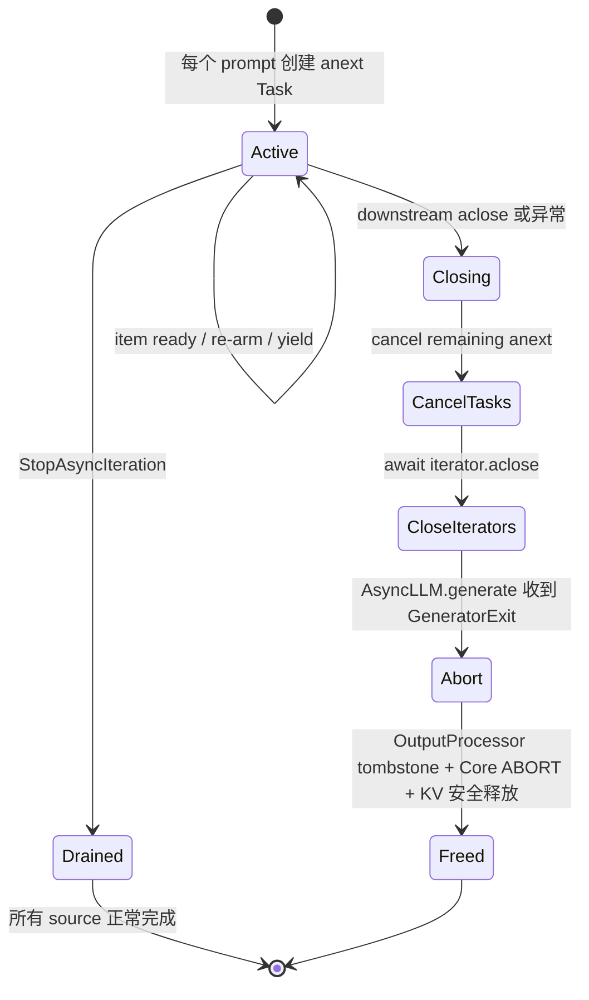

> 源码基线：[`vllm-project/vllm@d1e5e66e`](https://github.com/vllm-project/vllm/commit/d1e5e66ee30ba4bc020ac8e14b05e7a8c41b9302)。本文只把已合入代码当作当前事实；PR 描述中的设备实验会单独标注。

## 本篇在课程路线中的位置

第 15 章解释 HTTP disconnect 如何变成 EngineCore ABORT，第 16 章解释单个 `RequestOutputCollector` 如何把 Core 输出送到 SSE。本章继续向“一个 HTTP 请求内存在多条生成流”推进：Completion API 允许 `prompt` 是列表，也允许 `n>1`。

最容易产生的误解是：`merge_async_iterators` 会直接合并 `num_prompts × n` 个 child。当前代码并非如此。它采用两级 fan-in：**prompt 内的 n 个 sampling child 先由 `ParentRequest` 收敛成一个 `AsyncLLM.generate` stream；prompt 之间再由 `merge_async_iterators` 合并。**

## 前置知识回顾

- 每次 `AsyncLLM.generate()` 对外暴露一个 `AsyncGenerator[RequestOutput, None]`，背后由一个 `RequestOutputCollector` 驱动。
- `OutputProcessor` 持有 request state；generator 被 `aclose()` 或取消时，`AsyncLLM.generate` 捕获 `GeneratorExit/CancelledError` 并执行 `abort(internal=True)`。
- collector 的“单槽”只压缩 pending 对象数，不建立端到端网络背压。

## 本篇要回答的核心问题

1. `prompt=[p0,p1]` 且 `n=2` 时，到底创建几个 EngineCore request、几个 collector、几个 async iterator？
2. 乱序完成的 prompt/choice 如何映射为稳定的 OpenAI `choice.index`？
3. `FIRST_COMPLETED` 是否等价于公平调度？慢 prompt 会不会阻塞快 prompt？
4. 客户端关闭、某一 prompt 失败或某个 iterator 自然结束时，剩余 request 与 KV 由谁回收？

## 组件在全局架构中的位置



这条链完全位于 API/frontend 进程的 Host Python/AsyncIO 控制面。`EngineInput`、`RequestOutput`、token ID 列表与 logprobs 是 Host 对象，没有 GPU `shape/dtype/device` 契约；设备 tensor 与 KV block 仍由更下游的 Scheduler/Worker 管理。这里的并发假设是**同一 event loop 内协作式并发**，不是多个线程同时修改 `awaits`。

## 完整调用链

公开入口从 [`completion.api_router.create_completion`](https://github.com/vllm-project/vllm/blob/d1e5e66ee30ba4bc020ac8e14b05e7a8c41b9302/vllm/entrypoints/openai/completion/api_router.py) 开始：

```text
create_completion
→ OpenAIServingCompletion.create_completion
→ render_completion_request
→ OnlineRenderer.render_completion              # P 个 EngineInput
→ OpenAIServingCompletion._create_completion
   → for prompt_idx, engine_input in enumerate(engine_inputs)
      → EngineClient.generate(... request_id-item ...)
         → AsyncLLM.generate
         → AsyncLLM.add_request
            → n == 1: 一个 RequestState + 一个 Core request
            → n > 1: ParentRequest + N 个 child Core requests
         → 一个 RequestOutputCollector / prompt
→ merge_async_iterators(generator_0, ..., generator_P-1)
→ completion_stream_generator
→ choice.index = output.index + prompt_idx * n
→ StreamingResponse / SSE
```

[`CompletionRequest`](https://github.com/vllm-project/vllm/blob/d1e5e66ee30ba4bc020ac8e14b05e7a8c41b9302/vllm/entrypoints/openai/completion/protocol.py) 的 `prompt` 可为 `str`、token ID 列表、`list[str]` 或二维 token ID 列表，`n: int = 1`。Renderer 把它正规化为长度 P 的 `list[EngineInput]`；Serving 对每个元素分别调用一次 Engine client。源码中的 TODO 也明确承认：当前 `AsyncLLM.generate` 还不能一次承接多 prompt，所以 API server 必须发送多条消息再重新 multiplex。

## 关键类型、字段和状态生命周期

### 1. `ParentRequest`：prompt 内的 n-way fan-in

[`ParentRequest`](https://github.com/vllm-project/vllm/blob/d1e5e66ee30ba4bc020ac8e14b05e7a8c41b9302/vllm/v1/engine/parallel_sampling.py) 在 `AsyncLLM.add_request` 发现 `SamplingParams.n>1` 时创建。它持有：

- `request_id/external_req_id`：父请求的内部/外部身份；
- `sampling_params`：仍保留原始 n；
- `child_requests: set[str]`：尚未完成的 child identity；
- `output_aggregator[n]`：只在 `FINAL_ONLY` 下保存最终结果；
- `max_num_generation_tokens`：跨 child 统计最大生成长度。

child ID 为 `f"{index}_{parent_request_id}"`。每个 child 的 `SamplingParams.n` 被改成 1；若父 seed 非空，则 child seed 为 `seed + index`。每个 child 有独立 `RequestState` 和 EngineCore request，但同一 prompt 的 child 共享同一个 collector。

流式 DELTA/CUMULATIVE 模式下，`ParentRequest.get_outputs` 每次只返回当前 child 的 `CompletionOutput`，并在 child 首次终态时从集合删除 ID；重复终态被抑制。只有集合为空，父 `RequestOutput.finished` 才为 true。`FINAL_ONLY` 则要等全部 child 完成，才一次返回按 local index 排列的 n 个输出。

### 2. `merge_async_iterators`：prompt 间的 P-way fan-in

[`merge_async_iterators`](https://github.com/vllm-project/vllm/blob/d1e5e66ee30ba4bc020ac8e14b05e7a8c41b9302/vllm/utils/async_utils.py) 接收 `P` 个 `AsyncGenerator[T, None]`，返回 `AsyncGenerator[tuple[int,T], None]`。它的关键 Host 状态是：

```python
awaits: dict[Task[T], tuple[prompt_idx, iterator]]
```

初始化时每个 active iterator 只创建一个 `anext(it)` task。`asyncio.wait(..., FIRST_COMPLETED)` 返回 ready tasks；取出 `(i,it)` 后，代码先为该 source 安排下一次 `anext(it)`，再 `yield (i,item)`。因此 merge 层的并发 task 数上界是 active prompt 数 P，而不是 P×n，也不会对同一个 source 同时发出两个 `anext`。

source 自然结束时，`StopAsyncIteration` 被消费，不再安排 task；所有 source 完成后 `awaits` 为空，merged generator 正常结束。外层提前关闭或任一非终止异常逃逸时进入 `finally`，取消剩余 `anext` 并对 iterator 调用 `aclose()`。

### 3. 展平状态：`prompt_idx × n → choice.index`

[`completion_stream_generator`](https://github.com/vllm-project/vllm/blob/d1e5e66ee30ba4bc020ac8e14b05e7a8c41b9302/vllm/entrypoints/openai/completion/serving.py) 持有三个长度为 `P×n` 的数组：`previous_text_lens`、`previous_num_tokens`、`has_echoed`；另有长度 P 的 `num_prompt_tokens`。每个局部输出用下式定位：

```text
global_choice_index = output.index + prompt_idx * num_choices
```

这使到达顺序与公开 index 解耦。谁先产生 token 谁先进入 SSE，但同一个 `(prompt_idx, local_choice)` 永远落到固定槽位。

## 逐函数源码解读

### `_create_completion`：P 个 prompt 仍是 P 次 admission

Serving 循环创建 `request_id_item = f"{request_id}-{i}"`，为每个 prompt 单独计算 max tokens、复制 sampling params 并取得 `engine_client.generate` 返回的 async-generator 对象。这里要注意 Python async generator 是 lazy 的：创建对象尚未执行 `AsyncLLM.generate` 函数体；merge 首次迭代、为 P 个 source 创建 `anext` task 后，P 次 admission 才开始并发推进。

因此当前接口仍没有 batch admission 的原子性。若一个 prompt 的 admission 抛错，merge 会关闭其他已经启动的 prompt generator；但若异常发生在该 prompt 的 `AsyncLLM.add_request` 内部、collector 尚未返回给 `generate` 的局部变量 `q`，其已注册或已发送的前序 child 是否全部回滚，需要专门的故障注入验证。这里是基于控制流的风险推断，不是已经复现的泄漏事实。

### `AsyncLLM.add_request`：n 个 child 是真实调度实体

[`AsyncLLM.add_request`](https://github.com/vllm-project/vllm/blob/d1e5e66ee30ba4bc020ac8e14b05e7a8c41b9302/vllm/v1/engine/async_llm.py) 先建立一个 collector。`n==1` 时直接加入；`n>1` 时循环复制 `EngineCoreRequest`，为每个 child 注册 `OutputProcessor.RequestState` 后分别 `add_request_async`。所以显存/KV admission、preemption 和完成时间都按 child 独立发生；`ParentRequest` 只是 Host 输出聚合器，不是 Scheduler group。

### `ParentRequest.get_outputs`：完成条件是 child set 归零

streaming 时不能等齐所有 child，否则一个慢 sample 会制造 prompt 内 head-of-line。当前实现让任意 child 的 chunk 立即进入共享 collector，同时以 `child_requests` set 提供唯一 parent finished 判定。代价是输出天然乱序，必须携带 local index。

### `merge_async_iterators`：及时性不等于强公平

每个 prompt 都有一个 pending `anext`，所以慢 prompt 不会阻止快 prompt 被等待；这提供 work-conserving 的及时性。但当多个 task 同时 ready 时，`done` 是集合，代码没有 round-robin、配额或稳定 tie-break。一个 source 每次 yield 后立即被重新 arm，持续 ready 的 source 可能在 event-loop 调度上占优势；当前实现不承诺严格公平，只承诺不为未完成 source 建立超过一个 read-ahead。

### 关闭与失败：`aclose` 是资源协议的一部分



多 prompt 中一个 iterator 抛出普通异常时，merge 不做“局部失败、其他继续”，而是让整个 merged stream 失败；`completion_stream_generator` 将其转为流内 error event，随后发送 `[DONE]`。merge 的 `finally` 关闭其他 prompt generator，后者再触发 `AsyncLLM.generate` 的 internal abort。也就是说，HTTP Completion 请求的失败域是整个 P-prompt call。

单 prompt 有 fast path，避免 task/dict/wait 的额外 AsyncIO 边界。这个优化曾遗漏关闭底层 generator；已合入的 [PR #44726](https://github.com/vllm-project/vllm/pull/44726) 为 fast path 增加 `try/finally + aclose()`。这是一个重要教训：生成器 wrapper 不只是数据适配器，也继承底层资源的关闭责任。

## 具体示例与 shape/状态演算

设请求为 `prompt=[p0,p1]`、`n=2`、sampling streaming，P=2、N=2：

1. Renderer 产生 `engine_inputs[2]`。
2. Serving 创建两个外层 generator：G0、G1，以及两个 collector：C0、C1。
3. G0 内建立 Parent0 和 child `0_R0/1_R0`；G1 内建立 Parent1 和 child `0_R1/1_R1`。因此 EngineCore 中共有 4 个独立 request。
4. merge 只持有两个 task：`anext(G0)`、`anext(G1)`。
5. 假设到达顺序为 `R1.child0 → R0.child1 → R1.child1 → R0.child0`，SSE 的全局 index 依次为 `2,1,3,0`；顺序乱，但映射稳定。
6. `previous_num_tokens` shape 为 Python `list[int]`，长度 4，槽位 `[p0c0,p0c1,p1c0,p1c1]`；例如四个 chunk 后可能为 `[1,1,1,1]`。`num_prompt_tokens` 长度 2，只按 prompt 累计一次。
7. 若客户端此时断开，StreamingResponse 关闭 completion generator，merge 关闭 G0/G1；每个 G 的 abort 会由 OutputProcessor 将父 collector identity 扩展到其未完成 child，并把对应 ABORT 发给 EngineCore。GPU 已在途 step 的 KV 仍遵循 deferred free fence，而不是在 `aclose` 返回瞬间无条件复用。

本例中“4 个 Core request、2 个 collector、2 个 merge task、1 个 SSE stream”是理解资源规模的最短公式。

## 为什么这样设计及替代方案

从第一性原理看，fan-in 必须同时满足：每条独立生成流可推进、公开 index 稳定、终态不重复、外层关闭能回收所有 child。当前两级设计用现有单请求接口满足这些不变量，且 P=1 有低开销 fast path。

替代方案一是“每个 child 一个 producer task + 一个中心 `asyncio.Queue`”。它更容易实现 round-robin、队列容量和显式统计，但会增加 P×n 个 producer/task、额外 queue node 与结构化取消代码；若共享有界 queue 被慢 SSE 填满，还要决定是否允许反压进入共享 output handler。

替代方案二是让 Engine API 原生接收 `list[EngineInput]`，一次 batch admission 并直接返回 `(prompt_idx,choice_idx)`。这可减少 P 次 Python/Core 消息和二次 multiplex，适合 P 很大时；但它必须定义 partial validation、单 prompt 失败、按 prompt cancel、DP routing 与协议兼容，维护成本明显更高。当前源码 TODO 已指出这个方向，但它仍是计划，不是当前事实。

| 设计 | 首 token 延迟 | Host/消息成本 | 公平/背压 | 失败与维护 |
| --- | --- | --- | --- | --- |
| 当前两级 fan-in | P=1 fast path 最低；ready 即转发 | P 个 generator/collector，P×n Core child | work-conserving，无严格公平/容量承诺 | 复用现有接口；call 级 fail-fast |
| producer + queue | 多一次 queue hop | P×n tasks/queue writes | 可实现配额与 maxsize | 取消、堵塞和异常聚合更复杂 |
| Core 原生 multi-prompt | 可减少 P 次 admission 开销 | 协议最紧凑 | 可在 Core 定义策略 | partial failure/cancel 与兼容成本最高 |

## 性能、并发、正确性与边界条件

- **延迟**：`FIRST_COMPLETED` 避免等待最慢 prompt；单 prompt fast path 删除 task/wait 开销。只有 profile 证明 P-way frontend 调度已进入 `T_prepare/T_return` 预算，才值得改写为 native batch。
- **吞吐**：n 个 child 是独立 Scheduler request，能够共同进入物理 batch，也会各自消耗 KV 与 request metadata；frontend 合并不会减少设备计算。
- **内存**：merge 自身约为 O(P) task/state，但每 prompt collector 仍可能增长，Core request/KV 规模为 O(P×n)。因此 O(P) merge 不能推出整个 call O(P) 内存。
- **并发**：同一 source 最多一个 pending `anext`，限制 read-ahead；不同 source 的 ready 顺序不稳定，不应把 SSE interleaving 当作可复现协议。
- **正确性**：全局 choice index 由二维坐标计算，不依赖完成顺序；parent finished 必须以所有 child 首次终态为准。
- **失败**：一个 source 的异常结束整个 HTTP call；cleanup 用 `contextlib.suppress(BaseException)`，优先避免清理异常遮蔽原异常，但也意味着 close 失败没有独立可观测性。
- **边界**：0 个 iterator 没有公开调用场景，因为 renderer 至少应产出一个输入；beam search 走不同路径且 streaming 被显式拒绝，本文的 P×n 演算只针对 sampling。

## 测试证据与未覆盖风险

[`tests/utils_/test_async_utils.py`](https://github.com/vllm-project/vllm/blob/d1e5e66ee30ba4bc020ac8e14b05e7a8c41b9302/tests/utils_/test_async_utils.py) 创建 3 个无限 async generator，取消 merged consumer 后逐个确认 iterator 已耗尽；它验证 multi-source 取消能传播。新增的 single-fast-path 测试消费一个 item 后显式 `aclose()`，断言底层 generator 的 `finally` 已执行。

[PR #44726](https://github.com/vllm-project/vllm/pull/44726) 还记录了一次 TinyLlama 设备实验：旧 fast path 关闭后 0.5–3 秒仍有 1 个 unfinished request，修复后为 0。它是 PR 中报告的实验事实，不等同于主干 CI 的跨层证明。

[`tests/v1/engine/test_parallel_sampling.py`](https://github.com/vllm-project/vllm/blob/d1e5e66ee30ba4bc020ac8e14b05e7a8c41b9302/tests/v1/engine/test_parallel_sampling.py) 验证 streaming child 可乱序返回、已完成 child 不重复、只有 child set 清空 parent 才 finished；`FINAL_ONLY` 则等待 n 个槽位全部填满。

[`tests/entrypoints/openai/completion/test_completion.py`](https://github.com/vllm-project/vllm/blob/d1e5e66ee30ba4bc020ac8e14b05e7a8c41b9302/tests/entrypoints/openai/completion/test_completion.py) 分别覆盖单 prompt `n=3` 的 streaming，以及 P=2、n=1 的 batch streaming；P=2、n=2 只覆盖 non-stream beam search。换言之，当前没有一个 sampling E2E 同时覆盖 P>1、n>1、streaming、乱序完成与稳定 index。

[`tests/v1/engine/test_async_llm.py`](https://github.com/vllm-project/vllm/blob/d1e5e66ee30ba4bc020ac8e14b05e7a8c41b9302/tests/v1/engine/test_async_llm.py) 在 100 个并发请求中混入 `n=3` 并取消部分 task，断言其他请求结果不受影响且 unfinished request 归零；但它没有经过单个 HTTP call 的 P-way outer merge。

最高风险因此是：缺少 P=2、n=2 的真实断连和单 prompt 异常注入；没有严格公平/饥饿测试；没有 `aclose` 失败、pending `anext` task 归零与 event-loop warning 断言；没有 P 大时 admission 中途失败的原子回滚；也没有跨 collector、Core request 与 KV block 的统一资源归零测试。

## 与前后章节的连接

第 16 章的 collector 是每个 prompt 的内层出口，本章证明外层 merge 只读取这些出口，不改变其容量性质。第 15 章的 abort 则是 fan-in 关闭后的最终资源协议。三章合在一起形成：`Core outputs → per-prompt compaction → cross-prompt merge → SSE → disconnect → all-child abort`。

下一章进入 Serving 的错误终态：HTTP 200 已发送后，`GenerationError/Exception → SSE error event → [DONE]` 如何与取消、metrics 和客户端重试语义区分。

## 本篇结论、知识债与理解检查

结论：**多 prompt × `n>1` 是两级而非一次性 fan-in。** P×n 个 child 是真实 EngineCore 调度实体；每 prompt 的 n 个 child 先由 `ParentRequest` 和共享 collector 收敛，P 个 generator 再由 `merge_async_iterators` 及时转发。全局 index 稳定，但交错顺序与严格公平不属于接口承诺。

知识债：补 P=2、n=2 sampling streaming 的 index golden、disconnect/单源异常资源归零 E2E、P 大时 admission rollback、pending task/iterator close 可观测性，以及持续 ready source 的公平性与 Host 开销基准。

三个理解检查问题：

1. P=3、n=4 时，为什么 EngineCore request 是 12 个，而 `merge_async_iterators` 的 pending task 上界只有 3？
2. 若 prompt 2 的 local choice 3 先返回，它的全局 `choice.index` 是多少？为什么到达顺序不会改变答案？
3. 为什么给 merge 增加 `Queue(maxsize=1)` 不能自动得到安全的端到端背压？

## 课程账本增量

- 完成：第 17 章，`CompletionRequest → P 个 EngineInput/generator → prompt 内 ParentRequest n-way fan-in → prompt 间 merge_async_iterators P-way fan-in → flattened choice index → SSE`。
- 新确认不变量：P×n 是 Core request 规模，merge task 为 P；同一 source 只有一个 pending `anext`；parent finished 以 child set 归零；全局 index 由二维坐标确定；outer source failure 关闭整个 call。
- 新增风险：缺少 P>1×n>1 sampling streaming、断连、单源异常、admission rollback、公平性和 task/KV 归零 E2E。
- 下一章：Serving 流内错误终态与 `[DONE]`、取消、metrics、客户端重试的边界。
