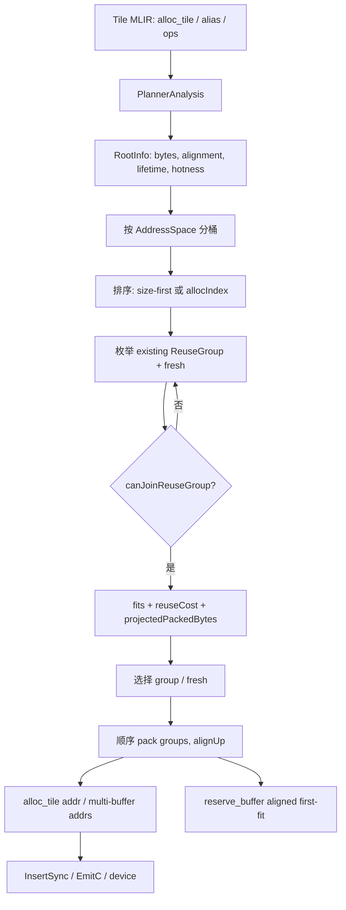

> 本文代码事实基于 PTOAS 默认分支提交 [`cd429fc8`](https://github.com/hw-native-sys/PTOAS/commit/cd429fc8aae0d28c14528b50c95168b6142b6f9e)。modern planner 来自已合入 [PR #913](https://github.com/hw-native-sys/PTOAS/pull/913)；reuse cost、hot scratch 与 Cube order 的直接演进见提交 [`b6fd4721`](https://github.com/hw-native-sys/PTOAS/commit/b6fd4721f22067a59183d8b8ccb85e6e944dd47b)、[`9498ff26`](https://github.com/hw-native-sys/PTOAS/commit/9498ff268bd0330e84dd826ed244774107855533) 和 [`f98f08d6`](https://github.com/hw-native-sys/PTOAS/commit/f98f08d64eb8cda2f19b4a2a5a7b914dc1d11252)。文中严格区分当前代码、测试、设计说明和硬件推断。

## 本篇在 PTO 课程路线中的位置

课程 16–18 已经回答“两个 root **能否**共享物理字节”：跨 root async WAR 交给 InsertSync，touching 仍要经过 target/semantic hard gate，互斥 branch 可以豁免静态重叠，但 loop back-edge 必须 fail closed。

本篇今天继续留在 **PTOAS modern PlanMemory**，只推进一个层次：

> 当多个候选都安全时，planner 为什么选择复用某个旧地址、开一个 fresh 地址，或因容量不足被迫接受高代价复用？

这把 correctness 和 performance 正式分开。前者由 `canShare` 决定，后者由 item 顺序、`reuseCost`、alignment、capacity 和确定性 tie-break 决定。

## 前置知识

planner 的 item 是 allocation root，不是每个 SSA value。`pto.alloc_tile` 或 `alloc_multi_tile` 形成 `RootInfo`；view/alias 通过 `valueToRoots` 回到 root。一个候选加入 `ReuseGroup` 前，必须与组内每个 member 两两通过：

```text
lifetime/phi gate
AND target-hazard gate
AND semantic-no-alias gate
```

这些 gate 是硬约束，容量不足也不能放松。通过 gate 只表示共址不会破坏已建模语义，不表示它对 PIPE_V/MTE overlap、bank pattern 或后续同步数量有利。

另一个版本前提是：[`tools/ptoas/ptoas.cpp`](https://github.com/hw-native-sys/PTOAS/blob/cd429fc8aae0d28c14528b50c95168b6142b6f9e/tools/ptoas/ptoas.cpp) 当前仍默认 `legacy`；只有显式选择 `--plan-memory-impl=modern` 才进入本文路径，而且未显式设置 `--plan-memory-order-by-size` 时，modern 会自动把它视为 true。

## 今日两个核心问题

1. “Largest-First-Fit”在当前代码中究竟控制什么？为什么它并不是简单的 first compatible group？
2. `reuseCost` 为什么可以被容量压力推翻，却绝不能推翻 correctness gate？

## PTO 全栈中的位置



上游输入是静态 local Tile shape、dtype、address space、访问序和 alias facts；下游消费者是写入常量地址的 `pto.alloc_tile`、multi-tile slot 地址，以及按物理区间工作的 InsertSync。

## 概念和精确语义

### 1. `RootInfo` 的物理大小

[`PTOPlanMemoryModern.cpp`](https://github.com/hw-native-sys/PTOAS/blob/cd429fc8aae0d28c14528b50c95168b6142b6f9e/lib/PTO/Transforms/PTOPlanMemoryModern.cpp) 先计算 Tile 静态 payload：

\[
rawBytes = \prod_i shape_i \times elementBytes
\]

普通 Tile：

\[
slotBytes = alignUp(rawBytes, alignmentBytes)
\]

multi-buffer：

\[
totalBytes = slotBytes \times slotCount
\]

`ReuseGroup.sizeBytes` 是组内 member 的 `totalBytes` 最大值，不是求和；因为 members 共享同一 base，运行时 payload 不应同时存在。较小 member 加入较大 group 时会产生 group 内 slack，但不会再增加该 group 的 packed footprint。

当前 target 表由代码直接给出：

| AddressSpace | A2/A3 capacity | A5 capacity | alignment |
| --- | ---: | ---: | ---: |
| VEC | 196608 B | 253952 B | 256 B |
| MAT | 524288 B | 524288 B | 256 B |
| LEFT / RIGHT | 65536 B | 65536 B | 4096 B |
| ACC | 131072 B | 262144 B | 4096 B |
| BIAS | 65536 B | 65536 B | 256 B |
| SCALING | 196608 B | 253952 B | 256 B |

这里是 compiler contract；公开源码没有证明这些数字对应哪一块具体 SRAM bank 的微架构切片，后者不能擅自外推。

### 2. Largest-first 只负责“谁先选”

`runModernPlanMemory` 先按 `AddressSpace` 分桶。对非 Cube local space：

```text
totalBytes 降序
→ allocIndex 升序
→ stableOrder 升序
```

但 `MAT/LEFT/RIGHT/ACC` 被 `isCubeLocalSpace` 排除，即使 `orderBySize=true` 也按 `allocIndex/stableOrder`。这是当前代码事实：Cube operand 地址模式比“大块先放”更敏感，因此提交 `f98f08d6` 保留计算流附近的原始分配顺序。具体 bank 冲突改善仍属于设计动机，仓库没有真机 trace 证明收益幅度。

所以 largest-first 解决的是**顺序偏置**：如果先处理很多小 root，它们可能过早占据最有价值的 group；大 root 后到时只能扩张 group 或开新尾部。大块先参与 group construction，通常更容易把小块吸收到已有大 group。

### 3. 当前实现不是 literal first-fit

对每个 `RootInfo`，`chooseReuseGroupByCost` 会遍历所有 existing groups：

1. `canJoinReuseGroup` 与组内每个 member 做 hard-gate 检查；
2. 假设加入该 group，调用 `getProjectedPackedBytes` 重算整个顺序 packed footprint；
3. 计算 `fits = projectedBytes <= capacity`；
4. 累加 pair reuse cost 和 hot-cluster cost；
5. 用 `(fits, cost, projectedBytes, groupIndex)` 选最好 candidate。

然后 planner 还会把 **fresh group** 加入比较。fresh 的基础 cost 是 1；existing group 的真正零代价复用仍可胜出，而 PIPE_V/MTE 共址产生正代价时，容量充足便可能选择 fresh。

这已经不是“遇到第一个合法 group 就停止”。更准确的名称是：

> **largest-first item ordering + cost-ranked reuse-group packing**。

## 真实文件、类型、API 或指令逐段解读

### `getRootPairReuseCost`

当前只对两类近邻访问增加 pair penalty：

- 连续/近邻 `PIPE_V → PIPE_V` 且共址后形成 read/write、write/read 或 write/write dependency：基础 10；
- `PIPE_MTE3 → PIPE_MTE2`，前者读 store source、后者写 load destination，并因复用共址：基础 20。

任一 op 在 loop 中，penalty 乘 4。这里的 lookahead 均为 1，`opIndex` 来自被记录的 memory/pipe access 序，而不是把 `arith.constant` 等结构性 op 也算进去。

这些数字来自 heuristic，不是硬件周期。它们只能排序候选，不能宣称“20 就比 10 慢两倍”。

### `getHotClusterReuseCost`

`RootInfo` 记录 `accessCount/writeAccessCount/loopAccessCount/pipeVAccessCount/mteAccessCount`。在 loop 内有多次访问，或即使没有显式 loop 但有重复 PIPE_V/MTE 访问，root 会被视为 hot。

hot root 加入已有 hot group时，cost 包括：

```text
6 + min(rootHotness, memberHotness)
+ 双方都在 loop 时 12
+ exact co-location 的粗粒度 bank-risk 4
```

最后一项只知道“加入 group 会同 base”，尚未拥有 subview 的精确 `offset % bankModulo`；因此它是最强共址信号的代理，不是完整 bank-conflict model。

### `getProjectedPackedBytes`

group 尚未写入最终 offset 时，函数从 cursor=0 依次模拟：

```text
cursor = alignUp(cursor, group.alignment)
cursor += group.size
```

若当前 root 加入较小 group，group 的 size/alignment 都取 max，后续所有 group 的 projected base 可能整体右移。若开 fresh，则 append 到尾部。由此产生的不是普通 malloc 式任意 hole，而是**固定 group 顺序上的 padding 与 tail growth**。

### 当前代码里“fragmentation”到底是哪一种

这个词很容易被说得过宽。按当前 modern 实现，应拆成四层：

1. **slot rounding waste**：例如 VEC 中 raw payload 为 4100 B，会先向 256 B 对齐成 4352 B；multi-buffer 的每个 slot 都承担一次这种取整。它是真正进入 capacity 公式的浪费。
2. **reuse-group slack**：一个 4096 B root 加入 8192 B group 后，两者共享 group base，group footprint 仍为 8192 B。运行较小 root 时有 4096 B 暂时未用，但物理布局中没有可再分配的独立 hole。
3. **ordering/tail growth**：root 加入早期 group并把它从 4096 B 扩成 8192 B，会推高后续全部 group 的 projected base。largest-first 与 projected-bytes tie-break 主要控制这一项。
4. **arbitrary-hole fragmentation**：需要维护不连续 occupied intervals，再寻找能容纳新对象的洞。普通 root group packing并不这样做；它最终从 0 开始顺序 pack。

进一步看，当前同一 AddressSpace 的 `MemSpec.alignmentBytes` 固定，而 `slotBytes` 已是 alignment 的整数倍，`totalBytes=slotBytes×slotCount` 也仍是整数倍。因此顺序 group 之间通常不会额外留下 alignment gap；主要浪费发生在 raw→slot 的取整和 group max slack。这里修正了一个常见直觉：**largest-first 的收益不一定表现为“填掉很多洞”，更多时候是减少后到大 root 对 packed tail 的抬升，并稳定 offset 选择。**

`planReserveBufferBase` 确实实现了 merged-interval + aligned first-fit，但在 ordinary modern roots 本身形成连续前缀时，它往往只能使用尾部；只有 occupied interval 真正不连续时才会命中中间 hole。仓库中名为 `fragmentation_*.py` 的 samples 默认并不显式选择 modern planner，也没有 exact address FileCheck，因此不能用文件名替代这个结论的直接测试。

### pressure override

fresh 与 reuse 都 fit 时，planner 通常按 cost 比较。但若：

\[
freshSlack < pressureReserve
\]

其中：

\[
pressureReserve=max(totalBytes, alignmentBytes)
\]

则直接选择已经 fit 的 best reuse group。含义是：不能为了避开性能 penalty，把尾部余量压到连“当前 root 大小或一个 alignment 单位”都放不下；未来 root 仍可能需要这段容量。

### materialize 与 overflow

group 选完后才真正顺序 pack：写入 `group.offsetBytes`，multi-buffer 用：

\[
slotOffset_i=groupBase+i\times slotBytes
\]

若任何 group end 超过 address-space capacity，pass 报错并停止，不回滚到更激进策略，也不放松 gate。单 Tile 通过 64-bit constant 写回 `alloc_tile addr`；multi-tile 写入 address array。materialize 后还运行 `verifySemanticNoAliasRanges`。

### 关键接口契约：输入、输出与失败边界

| 接口/对象 | 输入与表示 | 输出与所有权 | 前置/后置条件 | 失败方式 |
| --- | --- | --- | --- | --- |
| `RootInfo` | 静态 Tile shape、element type、`AddressSpace`、slot count，以及 analysis walk 得到的 op/access index；此阶段只是 host compiler 数据，没有 device tensor | 保存 `rawBytes/slotBytes/totalBytes/alignmentBytes`、lifetime、alias roots 与 hotness；由 pass 内 `PlannerAnalysis` 持有 | shape/dtype 必须能给出静态字节数；同一 root 的 views 必须经 `valueToRoots` 闭包归并 | unsupported space、非法 multi-buffer、容量或地址算术问题进入 pass diagnostic；当前乘加缺少完整 checked-overflow 证据 |
| `canJoinReuseGroup(info, group)` | 一个未放置 root 与已有 group members；比较的是 root 级语义，不是实际 payload tensor | 纯判定，不改 IR、不转移 payload ownership | 必须对每个 member 依次通过 lifetime/phi、target、semantic 三 gate；返回 true 只说明“允许考虑共址” | 任一事实未知或 gate 不通过即拒绝该 group；不能因 capacity 紧张降级为允许 |
| `chooseReuseGroupByCost` | 当前 root、全部合法/非法 existing groups、该 space capacity，以及此前构造的 access/hotness 状态 | 返回 existing group index 或 fresh 选择；更新的是 compiler 规划状态，不分配运行时内存 | 只在 `canJoinReuseGroup` 成功的候选上比较；优先 fit，再比较 cost、projected bytes 与稳定顺序 | 所有 existing 不 fit 时仍可尝试 fresh；若最终布局超限，由 pack/materialize fail closed |
| `buildSlotOffsets` / materialize | 已冻结的 group 顺序、base、slotBytes、slotCount | 生成常量 byte offsets 并写回 `alloc_tile`/multi-tile；后续 InsertSync 与 codegen 消费 | offset 属于各自 address space，必须满足 alignment，最后一个 slot end 不超过 capacity | overflow、越界或 semantic range overlap 报编译错误，不产生可执行产物 |

shape/dtype/device 关系也要说清：planner 处理的是**静态 local Tile capacity**，字节数来自 element type，而不是一次请求的 dynamic valid shape；address space 决定目标设备 memory class 及 alignment/capacity。它不读取或搬运 tensor 数据，也不拥有 GM/local allocation。PTOAS pass 在单个 MLIR module 的 host 编译线程中顺序构造状态，没有运行时多线程共享；真正的异步并发发生在生成代码的 MTE/Vector/Cube pipes，必须由 materialized address 后的 InsertSync 重新证明 happens-before。

后置条件因此不是“设备现在已安全执行”，而是更窄的两条：每个 local allocation 已得到本 space 内对齐且容量合法的 byte offset；被允许共址的 roots 已通过 planner 所建模的语义 gate。若 alias provenance、动态 subview 范围或硬件 hazard 没有进入这些 facts，planner 本身无法凭地址结果弥补。

## 对象、Tile、Buffer 与 IR 生命周期

以一个 root 为例：

1. `pto.alloc_tile` 被 `PlannerAnalysis` 收集，建立 `RootInfo`；此时没有物理地址。
2. walk 访问 op，更新 `allocIndex/freeIndex` 与 hotness counters；alias value 归约到该 root。
3. root 进入自己的 address-space bucket，并按 size 或 allocIndex 排队。
4. 它作为当前 item 与所有 `ReuseGroup.members` 做 pairwise gate；选择 existing 或 fresh。
5. group construction 结束后，root 获得 `offsets`；multi-buffer 每 slot 一个 offset。
6. rewrite 把 offset 写回 IR。此后 `RootInfo/ReuseGroup` 只是 pass 内分析对象，可以销毁；常量地址成为后续 InsertSync 和 codegen 的事实。
7. 运行时 Tile payload 在自己的 lifetime 内占用该物理区间；另一 member 只有在 hard gate 证明不共存时才可覆盖它。

这里有两个不同的“空闲”：SSA lifetime 结束表示可以成为复用候选；设备异步读写完成仍由后续同步 pass 保证。课程 16 已说明，两者不能混为一谈。

## 端到端调用链或指令链

```text
ptoas CLI
→ createPlanMemoryModernPass(orderBySize)
→ runModernPlanMemory
→ PlannerAnalysis.walkRegion
→ rootsBySpace
→ stable_sort
→ chooseReuseGroupByCost
→ canJoinReuseGroup
→ getProjectedPackedBytes / reuseCost
→ buildSlotOffsets
→ materializePlannedOffsets
→ verifySemanticNoAliasRanges
→ InsertSync
→ EmitC/device code
```

`reserve_buffer(auto=true)` 是后续的独立阶段：它先收集已规划 root 的 occupied intervals，合并区间，再用 aligned first-fit 寻找真实 hole。也就是说，普通 root packing 主要是 group 顺序与尾部布局；真正扫描任意空洞的是 reserve-buffer 分配，不能把两套“first-fit”混成一个算法。

## 具体 shape、Tile 和状态演算

用直接 lit [`plan_memory_pipev_reuse_cost_state_update.pto`](https://github.com/hw-native-sys/PTOAS/blob/cd429fc8aae0d28c14528b50c95168b6142b6f9e/test/lit/pto/plan_memory_pipev_reuse_cost_state_update.pto)：

```text
src0, src1, tmp0, tmp1
shape = 32×32
dtype = f32
location = VEC
rawBytes = 32×32×4 = 4096 B
alignment = 256 B
slotBytes = 4096 B
A3 VEC capacity = 196608 B
```

IR 是：

```text
TADD(src0, src1) → tmp0
TMUL(src0, src1) → tmp1
```

逐步看：

| item | 安全候选 | 性能/容量判断 | 结果 |
| --- | --- | --- | --- |
| `src0` | 无 existing group | 首个 fresh cost=0 | group0，起点 0 |
| `src1` | 与仍 live 的 `src0` 冲突 | 必须 fresh | group1，起点 4096 |
| `tmp0` | 不能覆盖仍被下一条 TMUL 读取的 src | fresh fit | group2，起点 8192 |
| `tmp1` | 与已死亡 `tmp0` 可能安全共址 | 连续 PIPE_V/hot co-location 为正 cost；fresh cost=1 且容量充足 | group3，起点 12288 |

FileCheck 直接断言 `tmp0=8192`、`tmp1=12288`。最终 footprint：

\[
4\times4096=16384 B
\]

剩余：

\[
196608-16384=180224 B
\]

因此 cost model 用更多 UB 换取更少的物理共址。若场景已逼近容量，fresh 后的 slack 小于 4096 B，pressure override 会优先选一个 legal reuse group；性能 hint 被容量推翻，但 hard gate 仍不能被推翻。

再看 alignment：假设已有 group size=4096/alignment=256，后面是 LEFT group alignment=4096。由于 address space 先分桶，它们根本不会被放在同一 cursor 中；所谓跨 space padding不存在。fragmentation 必须在每个独立 space 内计算，不能把 VEC、LEFT、ACC 容量相加。

## 为什么这样设计及替代方案

第一性原理目标不是“地址越少越好”，而是：

\[
\text{correctness gates 全通过}
\quad\land\quad
peakBytes \le capacity
\]

在此基础上，尽量保留 PIPE overlap 并保持 compile time、IR 可解释性和地址确定性。

### 当前 group packing

优点是 deterministic、实现局部、candidate cost 可解释；复杂度大致为 root×group×group-members，再叠加 access-pair cost。缺点是 greedy：前面形成的 group 不回滚，无法保证全局最小 footprint 或最低同步成本。

### 纯 definition-order first-fit

实现和编译时间最小，但强烈依赖 IR 生成顺序；小 buffer 先占位可能让大 buffer 尾部膨胀，也更容易把 hot scratch 压在低地址。维护简单，性能稳定性较差。

### 传统 interval linear scan / hole best-fit

可以显式维护 active/free interval，对真实 hole 做 best-fit，碎片利用更直接；但 PTOAS 还有 phi-family、target hazard、semantic no-alias 和异步物理依赖，不能只凭 `lastUse` 释放。若把 gate 与 alias closure 完整接入，状态机与回滚成本明显上升。

### 全局 graph coloring / ILP

可联合优化 footprint、sync penalty 与 bank objective，但 compile time、求解稳定性和调试成本过高；heuristic weight 仍需真机校准。对当前 experimental modern planner，尚无证据证明全局求解收益值得这份复杂度。

所以当前设计的合理边界是：hard gate 保正确，greedy 保可维护，cost 只做可逆的性能排序。

## 访存、计算、流水、并行和硬件约束

- PlanMemory 不改变 GM 搬运字节数或算术量；它改变 local address alias，从而影响 InsertSync 依赖与 pipeline overlap。
- fresh group 增加 local footprint，不增加 Tile payload 的逻辑字节；代价是更高峰值和更少 admission headroom。
- exact co-location 可能导致相同 bank pattern是代码中的保守启发式；具体 bank 数、端口映射与 stall 周期未由公开材料确认。
- alignment 是硬 ABI：VEC/MAT 256 B，LEFT/RIGHT/ACC 4096 B。错误 base 不是“慢一点”，而是非法规划。
- capacity 是每个 address space 独立上限。[`plan_memory_modern_bias_capacity_invalid.pto`](https://github.com/hw-native-sys/PTOAS/blob/cd429fc8aae0d28c14528b50c95168b6142b6f9e/test/lit/pto/plan_memory_modern_bias_capacity_invalid.pto) 的 `1×262144×f32` 需要 1048576 B，而 BIAS 只有 65536 B，直接报 `8388608 bits > 524288 bits`。
- modern 不做容量 overflow 后的策略回滚。若所有 legal packing 仍超限，编译失败比静默共享非法地址正确。

## 测试证据与未覆盖风险

当前直接证据：

1. [`plan_memory_order_by_size_noreuse.pto`](https://github.com/hw-native-sys/PTOAS/blob/cd429fc8aae0d28c14528b50c95168b6142b6f9e/test/lit/pto/plan_memory_order_by_size_noreuse.pto)：8 KiB、8 KiB、32 KiB 三个 VEC Tile；modern/by-size 断言 32 KiB destination 位于 offset 0，验证 largest-first order。
2. [`plan_memory_order_by_size_reuse.pto`](https://github.com/hw-native-sys/PTOAS/blob/cd429fc8aae0d28c14528b50c95168b6142b6f9e/test/lit/pto/plan_memory_order_by_size_reuse.pto)：32 KiB、32 KiB、128 KiB，断言 largest destination 位于 offset 0。
3. `plan_memory_pipev_reuse_cost_state_update.pto`：断言两个 4096 B PIPE_V output 分别位于 8192/12288，验证 cost state 随新 group 更新，而不是继续复用同址。
4. `plan_memory_modern_bias_capacity_invalid.pto`：验证 BIAS capacity 的 fail-closed overflow。
5. [exact-capacity sample](https://github.com/hw-native-sys/PTOAS/blob/cd429fc8aae0d28c14528b50c95168b6142b6f9e/test/samples/planmemory/plan_memory_peak_exact_capacity.py) 构造 24×8192 B=196608 B 的 A3 VEC 边界；fragmentation samples 构造 22/23 个 live slot 与后续短命 temp。

这些证据分三层，不能混用。lit 的 exact offset 只证明当前 compiler 在给定 IR 和 flag 下产生确定布局；capacity-invalid 只证明静态上限会拒绝明显越界；sample 能提供接近真实的形状组合，却没有自动断言最终 peak、选择了哪个 group 或运行时速度。它们都没有证明 cost weight 对目标设备最优，也没有证明减少 footprint 一定降低 latency：共址可能增加 RAW/WAR/WAW 同步，分散地址又可能压缩 admission headroom。真正闭合性能结论至少需要同一 kernel、同一编译基线下同时记录 `planned peak bytes`、生成的 barrier/event topology、各 pipe stall 和端到端 latency，并用 cost on/off 或固定地址 golden 做隔离对照。

需要指出一个测试注释问题：`order_by_size_reuse` 声称 32+32+128 KiB “exceeds UB budget”，但按当前 `getMemSpec` 正好是 192 KiB，也就是 196608 B。它能证明地址顺序，却不能单独证明“容量超限迫使复用”。

覆盖缺口：

- sample 文件主要生成 IR，缺少像 lit 那样对每个 hole、padding、peak 和失败位置做 exact FileCheck；
- 没有真机对照 `reuseCost on/off` 的 barrier/event 数、PIPE_V/MTE stall、UB peak 与 kernel latency；
- penalty 10/20/6/12/4、lookahead=1、pressure reserve 没有 workload sweep；
- Cube 关闭 size-first 的收益只有设计动机和地址稳定性代码，没有 L0/L1 bank trace；
- `rawBytes` shape 连乘、`slotBytes×slotCount`、`cursor+size` 的 uint64 overflow 缺少显式 checked arithmetic；
- 当前 cost 用 whole-root prospective co-location，subview 精确 interval 与 `offset % bankModulo` 尚未建模。

## 与前后章节的连接

课程 17–18 的 hard gate 回答 `canShare`；本篇回答 legal candidates 的 `chooseWhere`。它又回连课程 15–16：更激进共址可能使 InsertSync 生成更多或更强依赖，因此 PlanMemory 的 footprint 与 synchronization 不是两个独立优化。

下一章将顺着 materialized address 进入 **ReserveBuffer**：普通 root pack 完后，`pto.reserve_buffer(auto=true)` 如何合并 occupied interval、做 aligned first-fit，以及 manual base、level2/level3 和 overlap verifier 的边界。

## 本篇结论、知识债、三个理解检查问题和下一章

结论：

1. Largest-first 只改变 item 顺序；当前 placement 是遍历全部 legal group 后的 cost-ranked 选择。
2. hard gate 决定正确性，reuse cost 决定性能偏好；capacity pressure 可以推翻偏好，不能推翻 gate。
3. 当前普通 root 主要按 group 顺序 pack；真正扫描任意 hole 的 aligned first-fit 位于后续 `reserve_buffer`。
4. fresh group 是用 UB footprint 换 pipeline freedom，必须同时观察 peak bytes 与设备 stall，不能只看地址是否更分散。

知识债包括：penalty/pressure 的真机标定、Cube order 的 bank trace、subview interval、checked arithmetic、fragmentation exact golden，以及 legacy/modern 在同一 kernel 上的 `UB peak + event topology + latency` 三联对照。

理解检查：

1. 为什么 `canShare(a,b)=true` 仍不足以直接让 a、b 共址？
2. `tmp1` 明明能安全复用 `tmp0`，为何测试仍把它放到 12288；什么情况下这个选择会反转？
3. 为什么不能把 VEC 的剩余 4 KiB 拿去填 LEFT 的 alignment hole？

下一章：**ReserveBuffer 的真实 Hole-Fit——occupied interval 合并、alignment、level 语义与 overlap verifier。**

## 课程账本增量

- 新增课程 19，PTOAS 基线 `cd429fc8`。
- 新覆盖 `MemSpec/RootInfo/ReuseGroup`、`getRootPairReuseCost`、`getHotClusterReuseCost`、`getProjectedPackedBytes`、`chooseReuseGroupByCost`、`buildSlotOffsets` 与 modern CLI default。
- 新确认：VEC 等非 Cube space 才使用 size-first；placement 不是 literal first-fit；fresh cost=1；容量紧张时 pressure override 优先 legal reuse；overflow 不放松 gate。
- 新增知识债：exact fragmentation golden、uint64 checked arithmetic、penalty calibration、Cube bank trace 与 subview interval。
