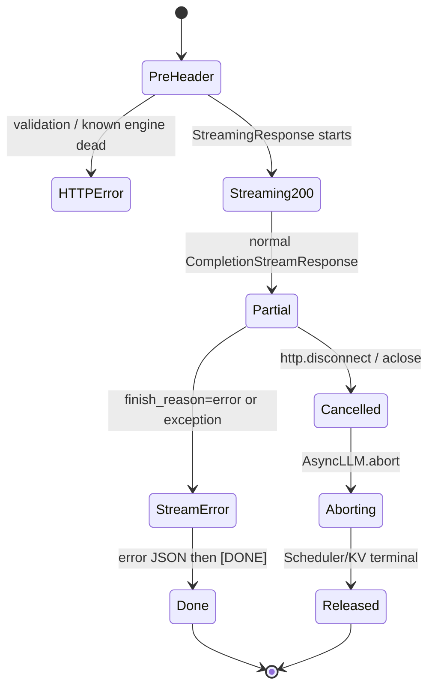

> 本文基于 vLLM 默认分支 commit [`6ec92bcb`](https://github.com/vllm-project/vllm/commit/6ec92bcbc8ef9af25cb4834ba3d922115792fbeb)。文中的“代码事实”均以该提交为准；测试结论、PR 计划和设计推论会分别标注。

## 本篇在课程路线中的位置

第 15 章解释 disconnect 如何触发 abort，第 16 章解释慢消费者为何仍会累积 bytes，第 17 章把多 prompt 与 `n>1` 的两级 fan-in 串到一个 SSE 流。本章继续 Serving，但只回答一个问题：

> `StreamingResponse` 已经发送 HTTP 200 和部分 token 后，vLLM 怎样表达失败？客户端又凭什么区分“成功结束”和“失败后结束”？

它位于 `Serving → 测试、性能与故障诊断` 的边界。这里没有新的 GPU tensor；核心对象都是 Host 侧 Python object、JSON string 与 ASGI body bytes。

## 前置知识回顾

上一章已经确认：`P×n` 个 Core child 先由 `ParentRequest` 收敛为 P 个 prompt stream，再由 `merge_async_iterators` 合成一个公开 stream。任一 source 抛异常会关闭整个 merge，并把 close 继续传到其他 `AsyncLLM.generate`。本章关心的是这份异常到达最外层 generator 后，HTTP 协议还能做什么。

必须先分开两种“终止”：

- **连接仍存活**：服务端还能写 SSE frame，应该给客户端结构化失败信息。
- **客户端已断连或协程被取消**：网络已没有可靠消费者，重点是 abort 和资源释放，而不是再写一个错误 frame。

## 本篇要回答的核心问题

1. 为什么流开始前的错误能返回 HTTP 4xx/5xx，而流开始后的错误只能放进 HTTP 200 的 body？
2. `finish_reason="error"`、普通 Python exception 与 `CancelledError` 分别如何收敛？
3. 为什么 `[DONE]` 只代表“不会再有 event”，不能代表请求成功？

## 组件在全局架构中的位置

```mermaid
flowchart LR
    C[OpenAI Client] --> R[create_completion route]
    R --> S[OpenAIServingCompletion]
    S --> A[AsyncLLM.generate]
    A --> O[OutputProcessor / RequestOutputCollector]
    O --> E[EngineCore]
    S --> SR[Starlette StreamingResponse]
    SR --> C

    E -. FinishReason.ERROR .-> O
    O -. RequestOutput .-> S
    A -. exception / cancellation .-> S
```

公开入口是 [`completion/api_router.py`](https://github.com/vllm-project/vllm/blob/6ec92bcbc8ef9af25cb4834ba3d922115792fbeb/vllm/entrypoints/openai/completion/api_router.py) 的 `POST /v1/completions`。它拿到普通结果就返回 `JSONResponse`；拿到 async generator 则立即构造 `StreamingResponse(media_type="text/event-stream")`。从这里开始，HTTP status 与 SSE 内部终态成为两套不同状态。

## 完整调用链

### 路径 A：响应头发送前失败

`create_completion → handler.create_completion → render_completion_request` 会完成模型、参数和 prompt 校验。[completion serving](https://github.com/vllm-project/vllm/blob/6ec92bcbc8ef9af25cb4834ba3d922115792fbeb/vllm/entrypoints/openai/completion/serving.py) 还会先检查 `engine_client.errored`；注释明确说明，这个 preflight 是为了尽量避免“明知 engine 已死仍先返回成功 status”。

若此时得到 `ErrorResponse` 或异常处理器接住 `VLLMClientError/VLLMServerError`，HTTP status 仍可设置为 400/404/500。2026-07-29 合入的 [PR #49665](https://github.com/vllm-project/vllm/pull/49665) 把 validation 与 server error 纳入统一的 `VLLMError` hierarchy，使边界分类更明确。

### 路径 B：响应头发送后出现 request-level error

```text
EngineCoreOutput(finish_reason=ERROR)
→ OutputProcessor 形成 RequestOutput(finish_reason="error")
→ completion_stream_generator
→ _raise_if_error(...)
→ GenerationError(status_code=500)
→ _convert_generation_error_to_streaming_response(...)
→ data: {"error": {..., "code": 500}}
→ data: [DONE]
```

[`FinishReason.ERROR`](https://github.com/vllm-project/vllm/blob/6ec92bcbc8ef9af25cb4834ba3d922115792fbeb/vllm/v1/engine/__init__.py) 的注释把它定义为 retryable request-level internal error，并要求转换成 500。注意这里的 `500` 是 JSON 字段，不是第二个 HTTP status。

### 路径 C：output pipeline 抛出意外异常

`AsyncLLM.output_handler` 捕获异常后调用 [`OutputProcessor.propagate_error`](https://github.com/vllm-project/vllm/blob/6ec92bcbc8ef9af25cb4834ba3d922115792fbeb/vllm/v1/engine/output_processor.py)，把同一个异常投入所有 active request queue。对应 `AsyncLLM.generate` 取到异常后，对可恢复的未知错误先 `abort`，再包装成 `EngineGenerateError`。最外层 `completion_stream_generator` 的 `except Exception` 记录 server log，调用 `create_streaming_error_response`，仍然发送 error frame 与 `[DONE]`。

`EngineDeadError` 是例外：engine 已进入 shutdown，不再额外 abort；但只要连接还能写，Serving 仍可把异常编码为流内 error。

### 路径 D：disconnect / cancellation

`asyncio.CancelledError` 不属于普通 `Exception` 分支。它沿 generator close 传播到 [`AsyncLLM.generate`](https://github.com/vllm-project/vllm/blob/6ec92bcbc8ef9af25cb4834ba3d922115792fbeb/vllm/v1/engine/async_llm.py)，由后者执行 `abort(request_id, internal=True)` 后重新抛出。因此断连路径通常没有 error frame，也没有 `[DONE]`；其正确终态是资源最终释放。

## 关键类型、字段和状态生命周期



关键对象的 owner 与失效点如下：

| 对象/字段 | 创建与 owner | 变化与消费 | 终止 |
| --- | --- | --- | --- |
| `RequestOutput.finish_reason` | `OutputProcessor` 在 API process 形成 | normal 为 `None/stop/length`；error 触发 `_raise_if_error` | terminal output 消费后失效 |
| SSE chunk | Serving generator 创建；Host string，随后编码为 ASGI bytes | 依次被 `StreamingResponse` 拉取 | socket 写出或连接取消 |
| `ErrorResponse.error.code` | `create_error_response` 创建 | 客户端解析 body | 只描述 payload，不改变已提交的 200 |
| `RequestResponseMetadata.final_usage_info` | request middleware 持有，初始 `None` | normal stream 尾部赋最终 usage | error 提前跳出时没有 canonical final usage |
| request queue/state | `OutputProcessor` 持有 | output、exception 或 cancel 改变 | terminal 删除；cancel 先 tombstone 再远端 abort |

接口前置条件是 response iterator 仍可被拉取；后置条件是存活连接收到唯一的协议尾部。错误 payload 没有 tensor 的 shape/dtype/device；它是单个 JSON object。并发假设则是一个公开 SSE stream 可能合并多个 request，但一处未处理异常会使整个 HTTP call 进入失败终态。

## 逐函数源码解读

[`GenerateBaseServing._raise_if_error`](https://github.com/vllm-project/vllm/blob/6ec92bcbc8ef9af25cb4834ba3d922115792fbeb/vllm/entrypoints/generate/base/serving.py) 只识别 `finish_reason == "error"`，记录 request ID 后抛 `GenerationError("Internal server error")`。这样不会把 engine 内部细节直接暴露给客户端。

`_convert_generation_error_to_streaming_response` 固定 `err_type="InternalServerError"`，保留 exception 的 `status_code`。共享的 [`create_error_response`](https://github.com/vllm-project/vllm/blob/6ec92bcbc8ef9af25cb4834ba3d922115792fbeb/vllm/entrypoints/serve/exception_handling/error_response.py) 再完成 exception class → OpenAI error type/status 的映射和 message sanitization。

`completion_stream_generator` 的关键结构可简化为：

```python
try:
    async for request_output in result_generator:
        _raise_if_error(request_output.finish_reason, request_id)
        yield normal_sse_chunk(request_output)
except GenerationError as exc:
    yield error_sse(exc)
except Exception as exc:
    log_server_trace(exc)
    yield error_sse(exc)
yield "data: [DONE]\n\n"
```

最后一行不在两个 `except` 内，所以连接存活的两类 error 都会继续得到 `[DONE]`。反过来，`CancelledError`/generator close 会越过这里，因此不能把“每个请求一定有 `[DONE]`”写成系统不变量。

## 具体示例与状态演算

假设 `stream=true`、1 个 prompt、`n=1`：

| 时刻 | Engine/API 状态 | wire 上可见内容 | 客户端状态 |
| --- | --- | --- | --- |
| T0 | route 返回 `StreamingResponse` | `HTTP/1.1 200 OK` | `STREAMING` |
| T1 | token ID `100`，text=`"Hello"`，`finish_reason=None` | normal data frame | 已持有部分文本 |
| T2 | terminal output，`finish_reason="error"` | `data: {"error":{"type":"InternalServerError","code":500,...}}` | `FAILED_AFTER_PARTIAL` |
| T3 | generator 尾部 | `data: [DONE]` | 关闭 parser，但不得改判 success |

这里的三个数字很重要：HTTP status 只有一个 200；error object 内有一个 500；终止 frame 是一个 `[DONE]`。客户端若只检查前者或最后一个，都会把失败误报成成功。

若 T1 后客户端断开，则没有 T2/T3 的可靠 wire 记录；状态转为 `CANCELLED → aborting → released`。这与“server failure after partial output”是不同的外部语义。

## 为什么这样设计及替代方案

第一性原理约束是：HTTP response header 只能提交一次，而低 TTFT 要求在完整生成前就提交。于是“真实 streaming、晚期异常仍改 HTTP status、已输出 token 可回滚”三者不能同时成立。

- **当前方案：流内 error + `[DONE]`**。不缓存完整输出，TTFT 与吞吐友好，只增加常数级 frame；代价是客户端必须解析 error，HTTP 200 不再等价于业务成功。
- **先完整生成再返回**。能在失败时返回真实 500，也不会泄露 partial output；但失去 streaming TTFT，占用更多 Host memory，慢请求更难并发。
- **异常时直接断 TCP，不发 `[DONE]`**。客户端容易感知 transport failure，但拿不到结构化分类，也无法区分 server crash、网络抖动和代理超时。
- **扩展为显式 SSE event type、sequence ID 与 resume token**。可改善重试/续传，但需要稳定协议、输出日志或确定性 replay，增加存储、正确性与维护成本。

当前设计是最小可行的 in-band 失败协议，却不是 exactly-once 协议。

## 性能、并发、正确性与边界条件

- **延迟/吞吐**：error 编码和两个小 frame 相比推理成本很低；不做全量 buffering，保住首 token 延迟。
- **并发**：P-way fan-in 中一个 source error 终止整条公开 stream；其他 source 必须 close/abort，不能留成 orphan。
- **正确性**：客户端状态机必须令 `error` 优先于 `[DONE]`；`[DONE]` 只表示 EOF marker。
- **重试**：vLLM 的 completion streaming path 没有 resume cursor。已收到 partial output 后盲目重试会重复内容，并可能因 sampling 得到不同续写。只有调用方能丢弃整个 partial result，或在外层提供幂等语义时，整请求重放才是可辩护的。
- **metrics**：Engine metric [`vllm:request_success`](https://github.com/vllm-project/vllm/blob/6ec92bcbc8ef9af25cb4834ba3d922115792fbeb/vllm/v1/metrics/loggers.py) 按 `finished_reason` 分 label，包含 `error`；名字叫 success 不等于只能统计成功。HTTP instrumentator 则围绕最终 HTTP status 分组。基于其实现与测试，可以推断晚期 SSE error 仍会落在 2xx HTTP bucket；当前仓库缺少直接 streaming regression test，因此这一点应作为待测推论，而不是本文宣称的实验事实。
- **usage**：error 可能发生在 final usage 赋值前。客户端不能把最后一个已见 usage delta 当成完整计费事实，服务端也需要单独的 error/finish reason 观测面。

## 测试证据与未覆盖风险

[completion error tests](https://github.com/vllm-project/vllm/blob/6ec92bcbc8ef9af25cb4834ba3d922115792fbeb/tests/entrypoints/openai/completion/test_completion_error.py) 提供两项直接证据：

1. non-stream 输入一个 `finish_reason="error"` 的 mock output，断言抛 `GenerationError`；
2. stream 先输入 token `100`、text `"Hello"`，再输入 error terminal，断言 body 含 `"Internal server error"` 且最后一项严格为 `data: [DONE]\n\n`。

第二项验证了“错误后仍有 DONE”，但它直接迭代 generator，没有经过真实 ASGI/HTTP transport。其注释说“returns 500”，测试实际上没有断言 HTTP status；也没有断言 partial chunk 必须先于 error、error JSON 的 exact type/code、final usage 为空，或其他 fan-in child/KV 最终归零。

[HTTP status metrics test](https://github.com/vllm-project/vllm/blob/6ec92bcbc8ef9af25cb4834ba3d922115792fbeb/tests/entrypoints/serve/exception_handling/test_http_status_metrics.py) 用真实 ASGI middleware 验证 response-header 前的 4xx/5xx 分组，却没有“先发 200、body 中再失败”的 streaming case。

仍需一条端到端测试同时断言：`200 → partial data → error(code=500) → [DONE]`、HTTP metric=2xx、engine finish label=error、`final_usage_info is None`、其他 child abort 且 KV/connector refs 归零。还应覆盖 proxy 中途断流、error frame 写失败和 client parser 忽略 error 的兼容风险。

## 与前后章节的连接

第 15 章给出取消的资源终态；第 16 章说明 pending chunk 可被 exception 覆盖；第 17 章说明一个 source failure 如何关闭整个 fan-in。本章把三者收束为：

`仍可写网络 → 结构化 error + DONE`，`不可写网络 → cancel + abort + release`。

下一章进入故障诊断：追踪 `output_handler failure → propagate_error → EngineDeadError/EngineGenerateError → health/readiness`，并区分 request-level 可恢复错误与 EngineCore fail-stop。

## 本篇结论、知识债、三个理解检查问题和下一章

结论只有一句：**HTTP 200 是 streaming transport 已建立，不是生成成功证明；error event 才决定失败，而 `[DONE]` 只关闭事件流。**

知识债：

- 缺少真实 ASGI late-error 的 status/body/metrics 联合测试；
- 缺少 `P>1 × n>1` 单 child error 时所有 task、request、KV 引用归零的 E2E；
- 缺少 final usage、partial token 与客户端 retry policy 的稳定协议说明；
- `vllm:request_success{finished_reason="error"}` 的命名容易造成 dashboard 误聚合。

理解检查：

1. 为什么 `ErrorResponse.error.code=500` 不能让已经发送的 HTTP 200 变成 500？
2. 为什么 disconnect 不应该强求 error frame 和 `[DONE]`，它的正确性指标是什么？
3. 客户端收到 partial token、error event、`[DONE]` 后，为什么不能只凭 `[DONE]` 判成功并自动续接重试？

下一章：**EngineCore 故障广播与健康状态——`output_handler → propagate_error → EngineDeadError → /health/readiness` 的 fail-stop 边界。**

## 课程账本增量

- 新增章节 18，源码基线 `6ec92bcb`。
- 新覆盖 `create_completion` route、`_raise_if_error`、`_convert_generation_error_to_streaming_response`、`create_error_response`、`FinishReason.ERROR` 与 HTTP/engine metrics 分层。
- 新确认不变量：存活连接的 GenerationError/普通 Exception 以 error frame 后接 `[DONE]`；cancel/disconnect 不保证任何 wire terminal；`[DONE]` 不蕴含 success。
- 新增知识债：真实 ASGI late-error、P×n cleanup、final usage 与两层 metrics 的联合断言。
