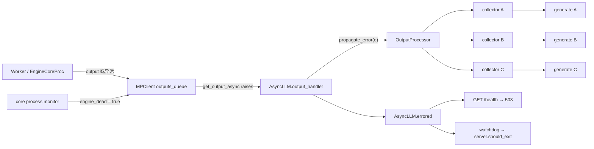
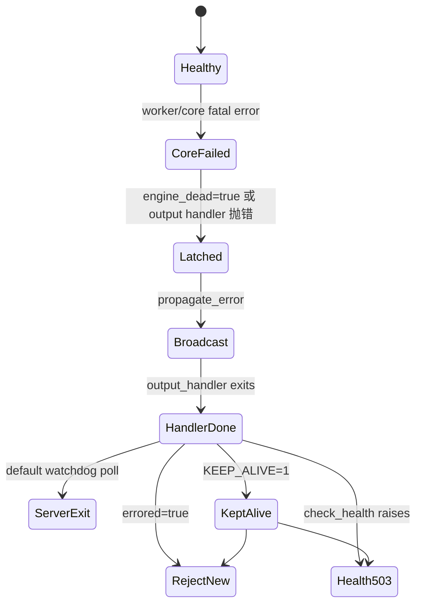

> **源码基线**：本文以 vLLM 默认分支 commit [`99013d77`](https://github.com/vllm-project/vllm/commit/99013d77d332a2d21d7214b57fa495f2bad2b448) 为准。下文把“当前代码事实”“测试事实”“未合入方案”和“工程推断”明确分开。

## 本篇在课程路线中的位置

第 15～18 章已经走完 Serving 的正常输出、断连取消、慢消费者和流内错误。那些章节都隐含一个前提：EngineCore 仍能处理控制消息。本章撤掉这个前提，只研究一个边界清晰的问题：**EngineCore 发生不可恢复错误后，前端如何让所有在途请求、后续 admission、健康检查和 HTTP server 收敛到一致失败状态。**

它位于 `Serving → 测试、性能与故障诊断` 的交界处。重点不是某个 CUDA 异常本身，而是 fatal failure 穿过进程边界后的状态协议。

## 前置知识回顾

- `AsyncLLM.output_handler` 持续从 `EngineCoreClient.get_output_async()` 收取 Host 输出，再交给 `OutputProcessor`。
- 每个公开 `generate()` 调用通过一个 `RequestOutputCollector` 等待自己的 output；collector 是单槽 lossless coalescer。
- 普通 disconnect 会执行 `abort`，因为 EngineCore 尚活着；HTTP 200 后的普通生成错误则转为 SSE error payload。

本章的差异是：`EngineDeadError` 表示共享 EngineCore 已不可信。此时再发 per-request ABORT 没有意义，清理由全局 shutdown 负责。

## 本篇要回答的核心问题

1. 一个 Worker/EngineCore fatal error，为什么能让 A、B、C 三个并发请求全部失败，而不是只让最先读 output 的请求失败？
2. `engine_dead`、`output_handler.done()`、`AsyncLLM.errored` 与 `EngineDeadError` 分别承担什么职责？
3. `/health=200` 究竟证明了什么；它能否证明 GPU/NCCL 仍在前进？
4. 默认 server watchdog 与 `VLLM_KEEP_ALIVE_ON_ENGINE_DEATH` 怎样改变 HTTP 进程的终态？

## 组件在全局架构中的位置



这里有两个不同的广播：Executor/EngineCore 内部如何让 fatal error 到达 client，不是本章主角；本章关注 client 已观察到失败之后，`OutputProcessor` 如何把一个异常复制到所有活跃 request queue。

## 完整调用链

从公开 HTTP 健康端点到状态源的链路是：

`build_and_serve → build_app → register_api_routers → register_vllm_serve_api_routers → register_instrumentator_api_routers → GET /health → app.state.engine_client.check_health() → AsyncLLM.errored → EngineDeadError`

对应源码见 [`app.py`](https://github.com/vllm-project/vllm/blob/99013d77d332a2d21d7214b57fa495f2bad2b448/vllm/entrypoints/launchers/app.py)、[`routers.py`](https://github.com/vllm-project/vllm/blob/99013d77d332a2d21d7214b57fa495f2bad2b448/vllm/entrypoints/launchers/api_server/routers.py) 和 [`health.py`](https://github.com/vllm-project/vllm/blob/99013d77d332a2d21d7214b57fa495f2bad2b448/vllm/entrypoints/serve/instrumentator/health.py)。

生成请求的 fatal path 则是：

`Worker/EngineCoreProc failure → MPClient output exception 或 process monitor → get_output_async raises → AsyncLLM._run_output_handler catches → OutputProcessor.propagate_error → RequestOutputCollector.put(Exception) → generate raises EngineDeadError → Serving error handling/watchdog`

注意双路检测：[`MPClient.start_engine_core_monitor`](https://github.com/vllm-project/vllm/blob/99013d77d332a2d21d7214b57fa495f2bad2b448/vllm/v1/engine/core_client.py) 观察子进程退出并置 `resources.engine_dead=True`；output socket/task 也可把异常放进 `outputs_queue`。`_format_exception()` 在 latch 已置位时把运输层异常规范化为 `EngineDeadError`。两路最终汇入同一个单向状态，而不是让上层猜测 ZMQ、EOF 或子进程 exit code。

## 关键类型、字段和状态生命周期

| 状态/对象 | 形态与位置 | 所有者 | 创建与变化 | 消费/终点 |
| --- | --- | --- | --- | --- |
| `resources.engine_dead` | Host `bool`，无 tensor/device | MPClient 共享资源 | 初始化为 false；core monitor 发现异常退出后置 true | `_format_exception`、`ensure_alive`、`AsyncLLM.errored`；本进程内不回退 |
| `outputs_queue` | Host `asyncio.Queue[EngineCoreOutputs \| Exception]` | AsyncMPClient | socket reader 投递 output/异常 | `get_output_async()` 取出；Exception 被 raise |
| `output_handler` | Host `asyncio.Task` | AsyncLLM | 首次启动后循环收 output；fatal exception 后结束 | `is_running = task is None or not task.done()` |
| collector 单槽 | `RequestOutput \| Exception \| None` | 每个 request state | 正常 output 合并；Exception 覆盖尚未消费的正常 output | `get()` 遇 Exception 直接 raise；request generator close |
| `EngineDeadError` | Host Python exception | failure path | core 不可恢复时构造/规范化 | 所有在途 `generate()`、新 admission、`check_health()` |

这个路径不传 GPU tensor，所以不存在 shape/dtype/device 契约；它传的是 Host 异常与单调布尔状态。它的关键前置条件是“failure 可能破坏共享 GPU/KV/collective 状态”，后置条件是“所有活跃消费者得到失败、后续请求不得进入 Core”。并发假设是 event loop 串行修改 `request_states`，core monitor 可从独立监控路径置共享 latch。

## 逐函数源码解读

### 1. `MPClient`：把运输故障规范化为引擎死亡

[`core_client.py`](https://github.com/vllm-project/vllm/blob/99013d77d332a2d21d7214b57fa495f2bad2b448/vllm/v1/engine/core_client.py) 的 monitor 发现 EngineCore 子进程意外退出后先置 `engine_dead`，再触发 client shutdown。与此同时，output queue 也可能先收到 socket exception。`get_output_async()` 看到 `Exception` 就 raise；若 latch 已经为 true，`_format_exception()` 返回语义稳定的 `EngineDeadError(suppress_context=True)`。

这一步把“连接重置”“EOF”“子进程退出”等实现细节收敛成公开协议：**EngineCore 已不可继续服务**。

### 2. `AsyncLLM._run_output_handler`：从单点异常到全局广播

[`async_llm.py`](https://github.com/vllm-project/vllm/blob/99013d77d332a2d21d7214b57fa495f2bad2b448/vllm/v1/engine/async_llm.py) 中的 handler 在无限循环外包一层 `try/except Exception`。任何普通 fatal exception 都会被记录，然后调用：

```python
output_processor.propagate_error(e)
```

函数随后退出，task 进入 done。这个 done 状态本身又成为 `is_running=False` 的证据；即使失败未恰好来自 process monitor，前端也不会继续伪装健康。

### 3. `propagate_error` 与 collector：异常优先于积压数据

[`output_processor.py`](https://github.com/vllm-project/vllm/blob/99013d77d332a2d21d7214b57fa495f2bad2b448/vllm/v1/engine/output_processor.py) 遍历当前 `request_states`，把同一个异常放入每个 queue。collector 的 `put()` 规则是：新 item 为 Exception 时，覆盖尚未消费的正常 output 并唤醒 waiter；`get()` 再把它 raise。

因此这是 fail-stop notification，不是尽量冲刷完旧 token。fatal failure 后，未交付 chunk 的可信边界不再成立，错误优先能让所有请求尽快看到一致终态。当前函数本身不删除 `request_states`；默认 server shutdown 会结束整体生命周期，而 keep-alive 模式下的长期 retention 仍是待验证风险。

### 4. `generate` 与 admission：为什么不再 abort

`AsyncLLM.generate()` 单独捕获 `EngineDeadError`，记录后直接 re-raise，并明确不调用 abort；Core 已死，shutdown 才是资源回收者。与此同时，`add_request()` 开头检查 `self.errored`，为 true 就在建立 request state 和发送 ADD 前拒绝。

`errored` 不是一个重复状态变量，而是组合判断：

```text
resources.engine_dead OR output_handler is done
```

它同时覆盖“monitor 已确认 core 死亡”和“输出主循环已经异常退出”。

### 5. `/health` 与 watchdog：503 和进程退出是两层动作

[`health.py`](https://github.com/vllm-project/vllm/blob/99013d77d332a2d21d7214b57fa495f2bad2b448/vllm/entrypoints/serve/instrumentator/health.py) 调用 `check_health()`：正常返回空 body 200，只把 `EngineDeadError` 映射为 503；render-only server 没有 engine client，固定返回 200。

[`launcher.py`](https://github.com/vllm-project/vllm/blob/99013d77d332a2d21d7214b57fa495f2bad2b448/vllm/entrypoints/launchers/launcher.py) 另有每 5 秒轮询一次的 watchdog。默认情况下，一旦 `engine.errored and not engine.is_running`，它设置 `server.should_exit=True`。`VLLM_KEEP_ALIVE_ON_ENGINE_DEATH=1` 只禁止这个 server exit；它不会恢复 Core、开放 admission 或让 `/health` 回到 200。



## 具体示例与 shape/状态演算

设 TP=2，有三个并发请求 A/B/C，各有一个 collector；rank 0 的 model forward 在前 10 次成功调用后抛异常。

| 时刻 | 状态变化 | A/B/C 的可观察结果 |
| --- | --- | --- |
| t0 | 三个请求已 admission，`request_states=3` | 都可能已有 partial token |
| t1 | rank 0 forward 失败，step 的共享完成度未知 | 不能把其他 rank 的部分结果提交为成功 |
| t2 | output path 或 process monitor 让 `get_output_async()` raise | 单个 `output_handler` 离开正常循环 |
| t3 | `propagate_error(e)` 向 3 个 collector 各 put 一次 | pending 正常 chunk 被异常覆盖 |
| t4 | 三个 `generate()` 分别从 queue 读到异常 | A/B/C 都 raise `EngineDeadError`，均不发 ABORT |
| t5 | 新请求 D 到达 | `add_request()` 在 admission 前拒绝 |
| t6 | HTTP server 尚存活时 `/health` | 返回 503；默认 watchdog 随后请求 server 退出 |

这里的“3”是 request-state fan-out 数，不是 batch tensor 第一维；异常链路没有 shape、dtype 或 device。TP=2 只用来说明任一 rank 的未知副作用会污染共享 step 可信度，不能把另一 rank 看成独立成功。

## 为什么这样设计及替代方案

从第一性原理出发，硬约束不是“Python 抛了异常”，而是：fatal error 发生时，KV 写入、collective、RNG/token commit 可能处于未知完成度。没有事务日志和跨 rank commit protocol，就无法证明某个请求或某个 rank 可安全重试。于是最小可证设计是：**锁死 engine 状态、广播失败、关闭 admission、由进程级恢复重建全部共享状态。**

替代方案有三类：

- 把错误降级为 per-request `EngineGenerateError`：隔离性更好，但只适合已证明不污染共享状态的请求局部错误；误判会带来静默 KV/collective 错误。
- 原地重启失败 Worker 并 replay 当前 step：可减少全局中断，却需要 KV、RNG、scheduler commit、connector side effect 和 collective membership 的事务化恢复，维护和验证成本最高。
- 保持当前 fail-stop，但把探针拆成 `/livez`（HTTP 进程）、`/readyz`（Engine admission）和 `/progressz`（forward progress）：不改变推理正确性，却能让编排系统更精确地决定摘流、重启或留存诊断现场。

当前官方 [Kubernetes 文档](https://github.com/vllm-project/vllm/blob/99013d77d332a2d21d7214b57fa495f2bad2b448/docs/deployment/k8s.md) 和 [Helm 文档](https://github.com/vllm-project/vllm/blob/99013d77d332a2d21d7214b57fa495f2bad2b448/docs/deployment/frameworks/helm.md) 都把 `/health` 同时用于 liveness 与 readiness。这是当前配置事实。工程上可推断：默认 fail-stop 时它同时完成摘流和重启；若启用 keep-alive 以保留现场，用同一 503 路径作 liveness 仍会触发容器重启，抵消 keep-alive 的诊断价值。

## 性能、并发、正确性与边界条件

- 广播复杂度是 O(R)，R 为 `request_states` 中活跃请求数；fatal path 优先低延迟收敛，不为高频路径优化。
- Exception 覆盖 pending chunk，牺牲尚未消费的 partial output，换取“错误先于不再可信的数据”。已发送到网络的 token 无法撤回，客户端仍需处理 partial failure。
- 5 秒是 watchdog 的轮询周期，不是从 GPU 故障到进程完全退出的严格 SLA；event-loop 调度和 Uvicorn shutdown 另有耗时。
- `check_health()` 只检查 fail-stop 状态。EngineCore 进程仍活着、output handler 仍等待时，即使 GPU/NCCL 已死锁，当前 `/health` 仍可能是 200。
- render-only server 的 `/health=200` 只表示其没有本地 engine 需要检查，不能外推到远端 EngineCore 的 forward progress。

## 测试证据与未覆盖风险

**测试事实一**：[`test_async_llm.py::test_check_health`](https://github.com/vllm-project/vllm/blob/99013d77d332a2d21d7214b57fa495f2bad2b448/tests/v1/engine/test_async_llm.py) 在真实 `AsyncLLM` 上验证健康时返回，并通过 patch `errored=True` 验证 `EngineDeadError`；它没有杀死真实 Core。

**测试事实二**：[`test_basic.py`](https://github.com/vllm-project/vllm/blob/99013d77d332a2d21d7214b57fa495f2bad2b448/tests/entrypoints/serve/instrumentator/test_basic.py) 验证 live server 的 `/health=200`，并用 `AsyncMock.check_health` 抛 `EngineDeadError` 验证 route 返回 503；没有覆盖 Uvicorn watchdog 的退出时序。

**测试事实三**：[`test_forward_error.py::test_async_llm_model_error`](https://github.com/vllm-project/vllm/blob/99013d77d332a2d21d7214b57fa495f2bad2b448/tests/v1/shutdown/test_forward_error.py) 让 Llama forward 在 10 次调用后失败，覆盖 TP=1/2，并发启动 3 个请求；断言三者都收到 `EngineDeadError`、`async_llm.errored` 为 true、新请求被拒绝，并检查 shutdown 后 GPU memory 回落。这是全局 fan-out 与 admission closure 的直接集成证据。

仍未覆盖：真实 ASGI 请求同时观察 partial SSE、503 与 server exit 的顺序；keep-alive 模式下 `request_states` 是否长期保留；DP/Ray/external launcher 多 manager 的一致传播；活进程但 GPU/NCCL 不前进；watchdog poll 与 socket linger 竞争。

**未合入方案**：PR [#45453](https://github.com/vllm-project/vllm/pull/45453) 曾提出独立的 decode forward-progress health endpoint，但已于 2026-06-26 关闭且未合并。它只能作为缺口和设计方向的证据，不能当作当前功能。

## 与前后章节的连接

上一章解释了 HTTP 200 后单请求错误如何编码进 SSE；本章说明 EngineCore fatal error 为什么不是普通单请求错误，而是全 request fan-out、admission closure 和 server lifecycle 的共同终态。下一章将研究相邻但不同的失败：进程没有退出、Python 也未立刻抛错，model execution 却不再前进。

## 本篇结论、知识债、三个理解检查问题和下一章

结论只有一句：**vLLM 当前把 EngineCore fatal failure 视为共享状态失真，通过双路检测、单向 latch、O(R) 异常广播、关闭 admission、health 503 与默认 server exit 构成 fail-stop 协议。**

知识债集中在 alive-but-stalled 检测、keep-alive 状态回收、DP/Ray/external manager 一致性，以及真实 Uvicorn/Kubernetes 端到端故障注入。

理解检查：

1. 为什么 `EngineDeadError` 路径不应像 disconnect 那样再发送 per-request ABORT？
2. 为什么 `output_handler.done()` 也必须令 `errored=True`，不能只依赖 `engine_dead`？
3. 启用 `VLLM_KEEP_ALIVE_ON_ENGINE_DEATH=1` 后，为什么 `/health` 仍应返回 503；若它同时是 liveness probe 会发生什么？

下一章：**前向没有崩、但也不再前进——Engine iteration timeout、`execute_model` timeout 与 Worker/process watchdog 如何把 hang 变成 fail-stop。**

## 课程账本增量

- 章节：19
- 源码基线：`99013d77`
- 新确认主链：`Core failure → MPClient latch/queue → output_handler → all collectors → EngineDeadError → /health/watchdog`
- 新确认边界：engine health 不等于 forward progress；keep-alive 不等于恢复 serving；readiness 与 liveness 不应被概念性合并
- 新增知识债：alive-but-stalled、keep-alive retention、真实 server/编排器故障时序
- 下一章：execution timeout 与 worker watchdog
