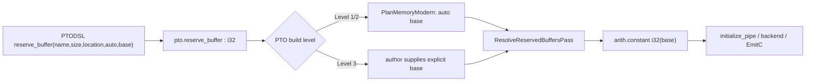
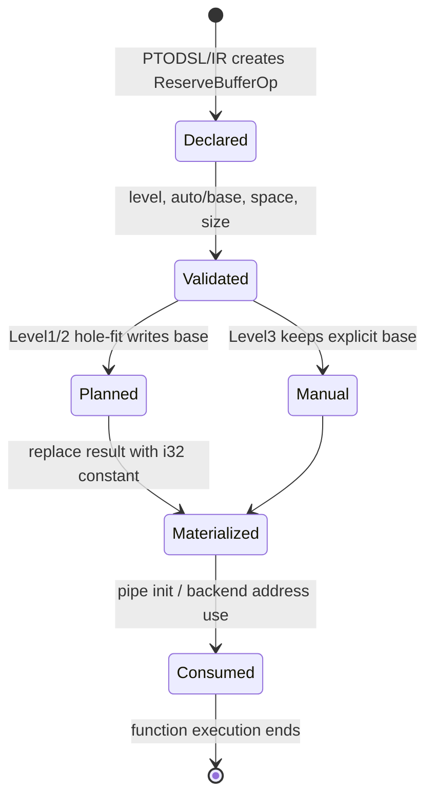

> 本文的 PTOAS 代码事实基于默认分支提交 [`cc519bc9`](https://github.com/hw-native-sys/PTOAS/commit/cc519bc92db73b2a2cdfd7c409fe7dfdf72d85e4)。该提交合入于 2026-08-29；正文以已合入代码和测试为准。文中“建议”“反例推导”会与代码/测试事实明确分开。

## 本篇在 PTO 课程路线中的位置

课程 16–19 已依次讲清：SSA lifetime 不等于异步设备访问完成、modern PlanMemory 的 hard gates、branch-exclusive phi family，以及 legal group 之后的 cost/capacity placement。本篇继续沿内存规划链只研究一个问题：普通 `alloc_tile` 地址确定后，`pto.reserve_buffer(auto=true)` 如何取得本地 FIFO/consumer slot 的物理字节区间。

它位于：

```text
ReuseGroup / fresh group 打包
→ 已规划 Tile 区间
→ ReserveBuffer aligned hole-fit
→ base 地址物化
→ pipe 初始化与 EmitC
```

这里最容易混淆三种责任：allocator 防止布局重叠、Level contract 决定谁有权写地址、semantic verifier 检查某条指令禁止别名的 operands。三者不是同一个证明。

## 前置知识

- A3 `VEC` 的 modern `MemSpec` 容量为 196608 B，A5 为 253952 B；`MAT` 为 524288 B，本文涉及的对齐均为 256 B。[pipeline 配置](https://github.com/hw-native-sys/PTOAS/blob/cc519bc92db73b2a2cdfd7c409fe7dfdf72d85e4/tools/ptoas/ptoas_pipeline.cpp)
- 普通 Tile 先被归入 `ReuseGroup`，再以半开区间 `[begin,end)` 物化地址；端点相接不算重叠。
- `reserve_buffer` 不是带 shape/dtype/layout 的 Tile。它请求的是某个 local address space 中的一段明确字节数，结果是 `i32` 地址。

## 今日两个紧密问题

1. `auto=true` 的 `ReserveBufferOp` 如何在已经占用的 Tile 区间中做 aligned first-fit？
2. 为什么“PlanMemory 成功 + `verifySemanticNoAliasRanges` 成功”仍不等价于“所有 reserve buffer 两两不重叠”？

第二问不是旁支：如果不区分 placement-time 账本和 post-pass verifier，就会把一个局部语义检查误当成全局内存安全网。

## PTO 全栈中的位置



上游 [PTODSL `reserve_buffer`](https://github.com/hw-native-sys/PTOAS/blob/cc519bc92db73b2a2cdfd7c409fe7dfdf72d85e4/ptodsl/ptodsl/_ops_simt.py) 只接受 `vec` 或 `mat`，将 `size` 视为字节数，并返回一个 surface value。IR 定义见 [`ReserveBufferOp`](https://github.com/hw-native-sys/PTOAS/blob/cc519bc92db73b2a2cdfd7c409fe7dfdf72d85e4/include/PTO/IR/PTOOps.td)：`name/size/location/auto/base? → addr:i32`。

下游 [`PTOResolveReservedBuffersPass`](https://github.com/hw-native-sys/PTOAS/blob/cc519bc92db73b2a2cdfd7c409fe7dfdf72d85e4/lib/PTO/Transforms/PTOResolveReservedBuffersPass.cpp) 把 marker 的结果替换为 `arith.constant i32(base)` 后删除 op；若是 `import_reserved_buffer`，则按 peer function 与 name 找到同一 reserve 的 base。也就是说，地址一旦 resolve，后续看到的是普通整数常量，不再看到“这段地址占多少字节”的 allocator 元数据。

## 概念和精确语义

### `size`、`base` 与所有权

关键接口可概括为：

| 项 | 语义 |
| --- | --- |
| `size` | 正整数 byte count；无 shape/dtype/device tensor |
| `location` | local `VEC` 或 `MAT` address space |
| `auto=true` | Level 1/2 由 PlanMemory 填 `base` |
| `auto=false` | Level 3 由作者显式提供 `base` |
| result | `i32` local byte address；不拥有独立运行时 allocation |

前置条件是 base 非负、按该 space 的 256 B alignment 对齐，且 `[base,base+size)` 不越容量；失败方式是 verifier/pipeline diagnostic，而不是运行时返回空指针。

### Level 不是“优化强度”，而是地址所有权边界

[`validateReserveBufferLevelRules`](https://github.com/hw-native-sys/PTOAS/blob/cc519bc92db73b2a2cdfd7c409fe7dfdf72d85e4/tools/ptoas/ptoas_pipeline.cpp) 建立了清晰契约：

- Level 1/2：只允许 `auto=true` 且输入 IR 不得预填 `base`；PlanMemory 是地址 owner。
- Level 3：要求 `auto=false` 且必须显式 `base`；kernel author 是地址 owner，PlanMemory 不替他重排。
- Level 1/2 的 `auto=false` 即使地址对齐、未越界，也会被拒绝，避免“部分手写、部分自动”破坏 allocator 的全局视图。

这解释了 2026-03-24 合入的 [PR #343 / commit `87f2eace`](https://github.com/hw-native-sys/PTOAS/commit/87f2eacea8e965da239ed0b601d13acc3ef37deb)：显式地址在跳过 local planning 时仍需 resolve，而 PlanMemory 路径必须拒绝 manual reserve。它修的是两个 pipeline 模式的责任一致性。

## 真实文件与函数逐段解读

### 1. 从已规划 Tile 构造 `occupied`

在 [`PTOPlanMemoryModern.cpp`](https://github.com/hw-native-sys/PTOAS/blob/cc519bc92db73b2a2cdfd7c409fe7dfdf72d85e4/lib/PTO/Transforms/PTOPlanMemoryModern.cpp) 中，ordinary roots 已经拥有 offsets。planner 按 address space 收集：

```text
[root.offsets.front(), root.offsets.front() + root.totalBytes)
```

`VEC` 与 `MAT` 分开记账；两个 address space 即使数值地址相同也不 alias。当前 group pack 通常生成连续低地址前缀，但 `planReserveBufferBase` 仍实现了通用的 internal-hole first-fit。

### 2. 对齐、排序、合并、first-fit

核心伪代码是：

```text
need = alignUp(reserve.size, alignment)
sort occupied by begin
merge overlap-or-touching intervals
cursor = 0
for [begin,end) in merged:
    cursor = alignUp(cursor, alignment)
    if cursor + need <= begin:
        return cursor
    cursor = max(cursor, end)
cursor = alignUp(cursor, alignment)
if cursor + need > capacity: fail
occupied.push([cursor,cursor+need))
return cursor
```

两个细节值得单独看：

- reserve 的实际 payload 仍是原始 `size`，但 auto placement 用向上对齐后的 `need` 占位，保证下一对象的 base 仍然合法。
- `<=` 允许新段恰好填满 gap；所有区间采用半开语义，所以 `[4096,8192)` 与 `[8192,...)` 合法相接。

### 3. Resolve 只消费地址，不再负责分配

`ResolveReservedBuffersPass` 要求 `base` 已经存在，随后产生 `arith.constant`。它不重新读取 Tile liveness，不重做 hole search，也不维护运行时 free list。ReserveBuffer 生命周期因此是“编译期 marker → 固定地址常量 → kernel/pipe 消费”；它不会像动态 allocator 那样在执行中释放或复用。

## 对象与地址生命周期



所有权随阶段变化：IR op 持有 name/size/location；PlanMemory 持有 `occupied` 临时账本；resolve 后调用者只持有地址值。正因为 allocator metadata 会消失，物化前必须闭合全局布局证明，不能期待 runtime 替它检查。

## 具体 shape、Tile 与状态演算

虽然 ReserveBuffer 没有 shape，我们可以把它和真实 Tile 区间放进一个 A3 `VEC` 例子。容量 196608 B、alignment 256 B。假设 ordinary Tile 规划后形成：

```text
T0 = [0, 4096)
T1 = [8192, 196608)
```

中间只有一个 4096 B hole。现在有两个 `auto=true` reserve：

```text
R0.size = 1024 B
R1.size = 1024 B
```

对 R0：

| 步骤 | cursor | 当前区间 | 结论 |
| --- | ---: | --- | --- |
| 初始 | 0 | `[0,4096)` | gap 不够，推进到 4096 |
| 对齐 | 4096 | `[8192,196608)` | `4096+1024<=8192`，取 base=4096 |

到这里出现一个重要的**当前代码事实**：尾部分配分支会把新区间 push 回 `occupied`，但 internal-hole 的 early return 分支直接返回 base，没有登记 `[4096,5120)`。

因此，若 R1 随后看到同一份 `occupied`，它会重复计算并再次得到 base=4096。两个 result 最终都可能被 resolve 成相同 `i32` 常量。

必须谨慎界定这段结论：

- 这是根据当前函数控制流构造的反例，不是仓库现有测试复现结果。
- 当前 modern group packing 通常形成连续低地址前缀，auto reserve 多数走 tail 分支；因此不能据此断言默认生产 workload 已发生重叠。
- 但只要 `occupied` 将来或在某条路径上真的包含 internal hole，该函数就不满足“连续分配多个 reserve 时保持两两不重叠”的通用 allocator 不变量。

## 为什么这样设计及替代方案

### 当前 sort+merge+first-fit

收益是确定性强、逻辑直观、能复用 Tile 之间的真实 hole；编译期复杂度约为每个 reserve 重新排序一次，即 $O(R\cdot N\log N)$。ReserveBuffer 数量通常不大，运行时没有搜索、分配或锁开销。

### 替代 1：只做 tail append

若 ordinary root 永远构成连续前缀，tail-only 是最小可证明设计：维护 `high_watermark`，逐个对齐追加。它不会发生 internal-hole 登记遗漏，维护成本最低；代价是未来出现合法 gap 时不能利用，会增加 VEC/MAT footprint。

### 替代 2：完整 interval-set allocator

维护有序、合并后的 interval set，每次 placement 统一执行 `commit(base,need)`。它能支持 hole reuse、避免重复排序，并可在插入时拒绝 overlap；但数据结构和 checked arithmetic 更复杂。

### 最小修正建议

这是基于代码的工程建议，不是已合入计划：让所有成功路径都经过同一个 `commitPlacement(base)`，统一执行 checked `base+need` 与 `occupied.push_back`；再增加一个事后 generic interval verifier。这样不会依赖“当前根布局恰好无洞”这一隐含前提。

## 访存、流水、并行和硬件约束

Hole-fit 本身发生在 host 编译期，不产生 GM/UB 搬运，也不改变算子 FLOPs。它影响的是：

- **本地容量**：reserve 占用会减少 Tile 可用的 VEC/MAT headroom；[PR #601](https://github.com/hw-native-sys/PTOAS/pull/601) 曾专门让 auto reserve 的对齐容量提前参与 PlanMemory capacity accounting，避免 ordinary buffers 先吃满 UB 后 reserve 无洞可放。
- **地址稳定性**：固定 `i32 base` 便于 pipe 初始化和静态 codegen，但也意味着运行时无法修复冲突。
- **并发正确性**：两个 logical pipes 若共享同一 reserve 字节且生命周期重叠，flag/event 只能排序控制流，不能凭空提供两份 payload storage。
- **graphability**：地址静态化天然利于整图复用；前提是 capacity、address-space 与 overlap 在编译期已证明。

公开代码只给出容量、alignment 和 pipe usage contract；具体 bank/port 映射与冲突周期没有足够设备证据，本文不作微架构断言。

## 测试证据与未覆盖风险

当前直接 lit tests 验证了：

- [`level12_auto_base_reject`](https://github.com/hw-native-sys/PTOAS/blob/cc519bc92db73b2a2cdfd7c409fe7dfdf72d85e4/test/lit/pto/reserve_buffer_level12_auto_base_reject.pto)：Level 1/2 的 auto buffer 不允许预填 base。
- [`level12_manual_base_reject`](https://github.com/hw-native-sys/PTOAS/blob/cc519bc92db73b2a2cdfd7c409fe7dfdf72d85e4/test/lit/pto/reserve_buffer_level12_manual_base_reject.pto)：Level 1/2 拒绝 manual buffer。
- [`level3_auto_reject`](https://github.com/hw-native-sys/PTOAS/blob/cc519bc92db73b2a2cdfd7c409fe7dfdf72d85e4/test/lit/pto/reserve_buffer_level3_auto_reject.pto)：Level 3 拒绝 auto。
- [`level3_manual_base`](https://github.com/hw-native-sys/PTOAS/blob/cc519bc92db73b2a2cdfd7c409fe7dfdf72d85e4/test/lit/pto/reserve_buffer_level3_manual_base.pto)：显式 VEC base=0 被 resolve 成 `arith.constant 0 : i32`。
- [`nested_resolve_reserved_buffers`](https://github.com/hw-native-sys/PTOAS/blob/cc519bc92db73b2a2cdfd7c409fe7dfdf72d85e4/test/lit/pto/nested_resolve_reserved_buffers.pto)：一个 4096 B auto reserve 在嵌套 backend module 中得到 base=0，并删除 marker。

它们没有直接覆盖：带 internal hole 的 auto placement、同一 hole 中连续两个 reserve、alignment 恰好填满 gap、reserve-vs-reserve post-check，以及 reserve-vs-Tile 的通用 overlap audit。

更关键的是，[`verifySemanticNoAliasRanges`](https://github.com/hw-native-sys/PTOAS/blob/cc519bc92db73b2a2cdfd7c409fe7dfdf72d85e4/lib/PTO/Transforms/Utils.cpp) 并非通用 overlap verifier。它遍历 op 的 semantic no-alias operand pairs，再解析这些 Tile/view 的物理半开区间。`ReserveBufferOp` 返回 `i32`，不是 Tile range；两个 reserve 也不会自然组成某条 TPOP/TMATMUL 的 no-alias operand pair。因此它不能兜底发现上述重复 base。

`plan_memory_fragmentation_hole_fit.py` 等 sample 名称也不能作为 ReserveBuffer 证明：它们面向 ordinary Tile reuse，并未建立多个 auto reserve 的 exact address golden。

## 与前后章节的连接

- 课程 19 讲的是“一个 root 应进入哪个 legal group”；本篇讲所有 group 已物化后，非 Tile 的持久字节区如何避开它们。
- 课程 15–16 的 InsertSync 能处理跨 op 的物理 RAW/WAR/WAW，但同步不能修复两个同时需要独占 payload 的 reserve 被错误规划到同一区间。
- 下一章将研究 `ReserveBuffer/import_reserved_buffer → initialize_pipe → backend helper`，把固定 local base、peer name binding、flag/base allocation 与多 pipe ABI 串成真实通信链。

## 本篇结论

1. `ReserveBufferOp` 是编译期 local byte-range 声明，最终退化为 `i32 base`；它不是有 shape/dtype 的 Tile，也没有运行时 allocator 生命周期。
2. Level 1/2 与 Level 3 的本质差异是地址 owner：前者由 PlanMemory 全权规划，后者由作者完全显式承担。
3. modern planner 的 aligned first-fit 会排序合并普通 Tile 区间，但当前 internal-hole success path 没有把新 reserve 区间登记回 `occupied`；这是一个在“输入确有内洞”前提下成立、尚无直接测试覆盖的潜在正确性缺口。
4. `verifySemanticNoAliasRanges` 只验证 op semantic no-alias pairs，不能替代 allocator 的全局 interval integrity check。

## 知识债

- 用 exact FileCheck 构造真实 modern pipeline internal hole，并验证两个 auto reserve 的 base 是否重叠。
- 为 `base+alignedSize`、capacity subtraction、累计 reserve size 增加 checked arithmetic/overflow 证据。
- 建立通用 `(address space, begin, end, owner)` post-plan verifier，覆盖 Tile、ReserveBuffer 与 imported peer contract。
- 验证 legacy planner 与 modern planner 在多 reserve、容量压力、hole placement 上的 parity。
- 用设备 poison/delay 测试确认多 pipe buffer 冲突会以何种方式表现，不能只依赖终值 happy path。

## 三个理解检查问题

1. 为什么 `size=1000`、alignment=256 的 auto reserve 应占用 1024 B 的规划区间，但 Level 3 的语义 payload 仍是 1000 B？
2. 为什么 event/barrier 能解决先读后写的 ownership handoff，却不能让两个并发 consumer 安全共享同一 payload 字节？
3. 如果 `occupied` 始终是 `[0,H)` 连续前缀，tail-only allocator 比通用 first-fit 少了什么能力，又多了什么可证明性？

## 下一章

**从地址到通信 ABI：`ReserveBuffer/import_reserved_buffer → initialize_pipe → backend helper`。**重点追踪 local consumer buffer、peer name 绑定、flag/base 分配以及多 pipe ID 如何共同保证两端引用同一段物理 storage。

## 课程账本增量

- 章节：20
- PTOAS 基线：`cc519bc92db73b2a2cdfd7c409fe7dfdf72d85e4`
- 新覆盖：`ReserveBufferOp`、PTODSL `reserve_buffer`、`planReserveBufferBase`、Level rules、`PTOResolveReservedBuffersPass`、`verifySemanticNoAliasRanges`
- 新不变量：每次成功 placement 都必须把对齐后的半开区间提交到 allocator 账本；Level 1/2 只有 PlanMemory 可写 base；semantic no-alias verifier 不能替代全局布局 verifier
- 新待验证推断：当前 root pack 通常产生连续前缀，使 internal-hole 登记缺口可能处于 dormant 状态；需要构造可达 pipeline case 验证
- 下一章：Reserve/import/initialize pipe 的跨函数、跨 backend 地址与 flag ABI
