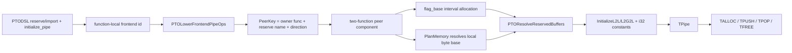

> 源码基线：PTOAS [`cc519bc9`](https://github.com/hw-native-sys/PTOAS/commit/cc519bc92db73b2a2cdfd7c409fe7dfdf72d85e4)，默认分支 `main`。本文以当前代码和测试为事实来源；凡涉及真实片上互连如何解释 peer local address，均明确标为推断。

## 本篇在 PTO 课程路线中的位置

上一章已经追完 `reserve_buffer → PlanMemory → ResolveReservedBuffers → i32 base`，回答了“FIFO 的本地字节区间放在哪里”。但一条跨 Cube/Vector 的 Pipe 还缺另一半：双方如何确认自己属于同一条逻辑 Pipe，又如何从仅有 16 个 hardware flag ID 中取得不冲突的 ready/free 同步通道？

本章位于：

```text
ReserveBuffer placement
→ frontend pipe lowering
→ peer component + flag allocation
→ EmitC TPipe template
→ TPUSH/TPOP/TFREE
```

它连接课程 04/10 的 ISA Ring ownership 与课程 15–20 的 compiler 地址、同步和内存规划。

## 前置知识

- `ReserveBufferOp` 请求的是某个 local address space 中的**字节区间**，结果为 `i32 base`；它不是 Tile，也没有 dtype/layout。
- `TPipe` 同时管理 payload entry 与 ready/free credit；数据可见性和 slot 复用是两条不同的状态链。
- `PlanMemory` 决定地址能否复用，`InsertSync` 解决普通指令间的 RAW/WAR/WAW；Pipe 自己的生产消费协议则由 `TPipe` 的 flag 资源承担。

## 今日两个紧密关联的核心问题

1. `id`、`peer_func + name`、`base`、`flag_base` 分别表示什么，为什么不能互换？
2. 多条 Pipe 共享函数时怎样避让 flag；为什么不相交的函数对又可以复用相同 flag ID？

## PTO 全栈中的位置

上游是 PTODSL 或手写 PTO IR：一端 `reserve_buffer("fifo")`，另一端 `import_reserved_buffer("fifo", peer_func=...)`，两端各有本函数内的 `aic/aiv_initialize_pipe`。下游是 EmitC：内部 init op 被改写为具体 `TPipe<...>(gm, c2vBase, v2cBase)`，`tpush/tpop/tfree` 再复用同一个模板 token。



## 概念与精确语义：其实有四套身份

### 1. `frontend id`：只在一个函数内找 handle

[`PTOAssignDefaultFrontendPipeIdPass.cpp`](https://github.com/hw-native-sys/PTOAS/blob/cc519bc92db73b2a2cdfd7c409fe7dfdf72d85e4/lib/PTO/Transforms/PTOAssignDefaultFrontendPipeIdPass.cpp) 会把省略的 `id` 补成 `0`。随后 [`PTOLowerFrontendPipeOpsPass.cpp`](https://github.com/hw-native-sys/PTOAS/blob/cc519bc92db73b2a2cdfd7c409fe7dfdf72d85e4/lib/PTO/Transforms/PTOLowerFrontendPipeOpsPass.cpp) 在**同一个 function** 中用它把 `talloc_to_* / tpush_to_* / tpop_from_* / tfree_from_*` 绑定到对应 init。

因此同一函数内多个 Pipe 必须使用不同 `id`；但 Cube 端 `id=0`、Vector 端 `id=7` 完全可以属于同一条跨函数 Pipe。`id` 不是 module-global identity，更不是 hardware flag ID。

### 2. `PeerKey`：跨函数逻辑身份

[`PTOResolveReservedBuffersPass.cpp`](https://github.com/hw-native-sys/PTOAS/blob/cc519bc92db73b2a2cdfd7c409fe7dfdf72d85e4/lib/PTO/Transforms/PTOResolveReservedBuffersPass.cpp) 将地址来源规范化为：

```text
local reserve： (current function, reserve name, direction)
peer import：    (peer_func,       import name,  direction)
```

例如 Vector 函数拥有 `reserve_buffer("c2v_fifo")`，Cube 函数通过 `peer_func=@vector_kernel` import。同名、同 owner、同方向使两端进入同一个 connected component。普通 component 必须恰好包含两个 init op、两个不同函数；两端还必须同意 `dir_mask / slot_size / slot_num / local_slot_num / globalOnly`。缺一端或参数不一致都会在编译期失败。

PTODSL 的 [`import_reserved_buffer`](https://github.com/hw-native-sys/PTOAS/blob/cc519bc92db73b2a2cdfd7c409fe7dfdf72d85e4/ptodsl/ptodsl/_ops_simt.py) 接收函数对象时会提取 symbol；若 peer 是 `@pto.simt`，必须先解析到唯一 materialized specialization。零个 specialization 无法引用，多个 specialization 则因歧义拒绝，而不是猜一个名字。相关修复见 [`6dfd047c`](https://github.com/hw-native-sys/PTOAS/commit/6dfd047c366cddc4e2d459c004ba45e82bc8dfa5)。

### 3. `base`：payload 的 local byte address

`reserve_buffer` 的 owner 获得规划后的 local base；`import_reserved_buffer` 查到 peer function 内同名 reserve，并被替换成**同一个数值的** `arith.constant i32`。marker 随后被删除。

代码事实是“两端 IR 得到相同整数”。基于 operand 名 `c2v_consumer_buf/v2c_consumer_buf` 和 peer import 关系，可以合理推断：该数值代表 consumer local FIFO 的地址坐标，producer 用它描述 peer destination；它并不表示两颗 core 共享一段普通本地 SRAM。公开代码没有给出互连寻址的微架构细节，所以这句话只能作为硬件映射推断。

### 4. `flag_base`：同步资源区间，不是字节地址

每个 component 还要取得一段 hardware flag ID：

- 总 ID 范围为 `[0,16)`；
- `flag_base` 必须按 2 对齐；
- 单向 C2V/V2C 占 `[B,B+2)`，即 ready/free 两个逻辑 flag；
- `DIR_BOTH` 占 `[B,B+4)`，等价于两个方向各一对；
- 显式 `flag_base` 仍会做范围、对齐和冲突检查；缺省值由 pass 自动 first-fit。

关键约束不是“整个 module 的 flag 永不重复”，而是：候选区间不得与 component **任一参与函数** 已占区间相交。两组完全不共享函数的 kernel pair 不会同时存在于同一函数实例的 Pipe 状态里，因此可以复用相同 ID。

## 真实文件、类型与逐段解读

[`PTOOps.td`](https://github.com/hw-native-sys/PTOAS/blob/cc519bc92db73b2a2cdfd7c409fe7dfdf72d85e4/include/PTO/IR/PTOOps.td) 把公开层和内部层分开：

- `AicInitializePipeOp/AivInitializePipeOp` 暴露 `id, dir_mask, slot_size, slot_num, local_slot_num, nosplit` 及 GM/local consumer buffer；
- `ReserveBufferOp/ImportReservedBufferOp` 只产生 `i32 addr`；
- `InitializeL2LPipeOp/InitializeL2G2LPipeOp` 产生统一 `!pto.pipe` handle，并新增 compiler-resolved `flag_base`；
- `TPushOp/TPopOp/TFreeOp` 只消费 handle，不再各自复制地址和 flag 配置。

流水线顺序也不可颠倒。[`ptoas_pipeline.cpp`](https://github.com/hw-native-sys/PTOAS/blob/cc519bc92db73b2a2cdfd7c409fe7dfdf72d85e4/tools/ptoas/ptoas_pipeline.cpp) 先串行执行 default-id 与 frontend lowering，再由 `PTOInferValidatePipeInit` 统一 `nosplit`，之后 PlanMemory 放置地址，最后 `PTOResolveReservedBuffers` 在 symbolic reserve/import 尚存在时组 peer component、分配 flag，并把地址 marker 物化为常量。若先擦掉 marker，跨函数身份证据也会一起丢失。

最终 [`PTOToEmitC.cpp`](https://github.com/hw-native-sys/PTOAS/blob/cc519bc92db73b2a2cdfd7c409fe7dfdf72d85e4/lib/PTO/Transforms/PTOToEmitC.cpp) 构造：

```cpp
TPipe<flagBase, Direction, slotSize, slotNum, localSlotNum, nosplit>
```

`InitializeL2LPipeOp` 传 `nullptr` 作为 GM 参数，并按方向把 local address 放入 `c2vBuf` 或 `v2cBuf`；`InitializeL2G2LPipeOp` 则同时传 GM slot pointer。后续 `TPUSH/TPOP/TFREE` 从 pipe handle 的 defining init 恢复同一个模板 token。这证明 `flag_base` 已变成 compile-time type/config，而 `base` 仍是构造时 value operand。

## 对象生命周期与端到端调用链

```mermaid
sequenceDiagram
  participant V as vector_kernel
  participant C as cube_kernel
  participant P as PTOAS module passes
  participant E as EmitC
  V->>V: reserve_buffer("c2v", 4096, VEC)
  C->>C: import_reserved_buffer("c2v", @vector_kernel)
  V->>P: aiv_initialize_pipe id=7
  C->>P: aic_initialize_pipe id=0
  P->>P: normalize PeerKey(@vector_kernel,"c2v",C2V)
  P->>P: validate two peers; choose flag_base=0
  P->>P: materialize both address operands as i32 base
  P->>E: InitializeL2LPipe(handle, base, flag_base=0)
  E->>E: TPipe<0,DIR_C2V,512,8,2,true>(nullptr,base,0)
  C->>E: TPUSH(handle, Acc/Tile)
  V->>E: TPOP(handle) then TFREE(handle)
```

symbolic `reserve/import` 活到 resolve pass；之后失效并被常量替代。`!pto.pipe` handle 从 internal init 创建，被 transfer ops 借用，直到函数结束。`TPOP` 返回的 entry 在匹配 `TFREE` 前仍由 consumer 持有；本章只解释 handle 的配置来源，entry 的借用/失效规则留到下一章。

## 具体状态演算：三条 Pipe 为什么得到 0、2、4

设同一对 `cube_kernel/vector_kernel` 有三条单向 Pipe，`slot_size` 分别为 512、1024、2048 B，`slot_num=8`。它们的 payload 分别需要 4096、8192、16384 B local storage；但每条的 flag 宽度都只是 2，与 payload 字节数无关。

| stable order | frontend id | payload base（示意） | flag width | 分配结果 |
| ---: | ---: | ---: | ---: | --- |
| 1 | 0 | `0` | 2 | `[0,2)` |
| 2 | 1 | `4096` | 2 | `[2,4)` |
| 3 | 2 | `12288` | 2 | `[4,6)` |

即使源码书写顺序是 `id=0,2,1`，component 也会按 frontend id 等稳定键分配，结果仍是 0、2、4。直接测试 [`resolve_reserved_buffers_globaltensor_frontend_id_order_a5.pto`](https://github.com/hw-native-sys/PTOAS/blob/cc519bc92db73b2a2cdfd7c409fe7dfdf72d85e4/test/lit/pto/resolve_reserved_buffers_globaltensor_frontend_id_order_a5.pto) 正是以源码顺序 0、2、1 检查最终 `flag_base=0,4,2`。

若第四条是 `DIR_BOTH` 且共享这两个函数，它需要宽度 4，first-fit 得到 `[6,10)`；若实现要求偶数 base，6 已满足。若另一组 `cube2/vector2` 与前述函数集合完全不相交，它可以重新使用 `[0,2)`。反过来，9 条单向 Pipe 都共享同一函数时需要 18 个 ID，必然超过 16；仓库的 overflow lit 正是这个构造。

## 为什么这样设计，以及替代方案

第一性原理上，一条 Pipe 必须同时满足四个互不等价的不变量：本函数 data op 找到正确 handle、两端认出同一个 peer contract、payload 字节不重叠、同步 flag 不冲突。把它们压成一个整数会丢失信息。

- **用裸 `id` 跨函数配对**：实现最简单，但多个函数都可合法拥有 `id=0`，而同一 peer 两端也可使用不同 id；会误配或误拒绝。
- **所有 flag module-global 唯一**：证明简单，却会让互不相交的 kernel pair 浪费同一批 16-ID 资源，降低可编译的多 Pipe 数。
- **全部由作者显式填 `flag_base`**：适合低层手调和兼容旧 IR，但把区间着色、双向宽度和冲突责任推给用户，维护成本高。
- **把 flag 与 buffer 一起交给内存 allocator**：看似统一，实际两个资源域的单位、容量和冲突图都不同；payload 按 byte/address space 规划，flag 按参与函数集合着色，强行合并只会模糊正确性。

当前方案把动态工作前移到编译期，运行时没有 flag allocator，也不需要通过表查 `TPipe` 类型；这有利于稳定代码生成和 graph replay。代价是新增 Pipe 会增加模板实例、编译时间和 16-ID 压力，且函数参与图必须在 whole-module 阶段可见。

## 访存、流水、并行与硬件约束

`slot_size × slot_num` 决定 payload capacity 和并发在途 entry 数；`flag width` 只由方向决定。增大 slot 并不会消耗更多 flag，却会增加 local/GM footprint。反过来，许多很小的 Pipe 可能内存充足，却先耗尽 flag ID。

共享函数的 Pipe 必须使用不相交 flag 区间，否则一个 Pipe 的 ready/free 事件可能被另一个 Pipe 错认，形成数据未就绪、过早覆盖或死锁。完全不共享函数的 component 复用 ID 是安全的静态着色结论；是否存在更细的“同函数但控制流互斥”复用机会，当前实现没有尝试，保守策略换取了简单的并发正确性。

## 测试证据与未覆盖风险

**测试事实：**

- [`test_jit_compile.py`](https://github.com/hw-native-sys/PTOAS/blob/cc519bc92db73b2a2cdfd7c409fe7dfdf72d85e4/ptodsl/tests/test_jit_compile.py) 检查唯一 SIMT specialization 被写入 `peer_func`，多 specialization 明确报歧义。
- [`fixpipe_frontend_emitc_peer_key_different_id_scalar8_a5.pto`](https://github.com/hw-native-sys/PTOAS/blob/cc519bc92db73b2a2cdfd7c409fe7dfdf72d85e4/test/lit/pto/fixpipe_frontend_emitc_peer_key_different_id_scalar8_a5.pto) 用 Cube `id=0`、Vector `id=7` 仍成功生成，验证跨函数配对不依赖 id 相等。
- [`resolve_reserved_buffers_reject_incomplete_peer_group_a5.pto`](https://github.com/hw-native-sys/PTOAS/blob/cc519bc92db73b2a2cdfd7c409fe7dfdf72d85e4/test/lit/pto/resolve_reserved_buffers_reject_incomplete_peer_group_a5.pto) 只有一端 init，期望完整 peer pair 错误。
- [`resolve_reserved_buffers_reject_non_peer_init_a5.pto`](https://github.com/hw-native-sys/PTOAS/blob/cc519bc92db73b2a2cdfd7c409fe7dfdf72d85e4/test/lit/pto/resolve_reserved_buffers_reject_non_peer_init_a5.pto) 以普通 `i32` 作 local address 且无显式 flag，验证 provenance 不足时 fail closed。
- [`resolve_reserved_buffers_reject_flag_id_overflow_a5.pto`](https://github.com/hw-native-sys/PTOAS/blob/cc519bc92db73b2a2cdfd7c409fe7dfdf72d85e4/test/lit/pto/resolve_reserved_buffers_reject_flag_id_overflow_a5.pto) 构造 9 条共享同一函数对的单向 Pipe，验证 18>16 时拒绝。
- [`nested_resolve_reserved_buffers.pto`](https://github.com/hw-native-sys/PTOAS/blob/cc519bc92db73b2a2cdfd7c409fe7dfdf72d85e4/test/lit/pto/nested_resolve_reserved_buffers.pto) 验证 nested backend module 中 reserve 被物化为 base 0 常量并删除 marker。

**覆盖缺口：**目前没有一条设备 E2E 同时断言“多 local peer Pipe 的 exact base、exact flag interval、TPUSH/TPOP 数据与结束后 flag 余额归零”；也缺成功 `DIR_BOTH` 的 4-ID golden、两组不相交函数复用 flag 0 的直接 lit、显式/自动 flag 混排，以及 graph replay/cancellation 后 stale credit 的故障注入。现有 FileCheck 能证明生成拓扑，不能证明设备上的低概率串线或死锁不存在。

## 与前后章节的连接

课程 20 证明了 payload base 的 allocator contract；本章增加 peer identity 和 flag interval，最终让 EmitC 得到完整 `TPipe` 类型与构造参数。下一章将沿这个 handle 继续追 `TALLOC → TPUSH → TPOP → TFREE`，重点解释 `nosplit/split` 推断、borrowed entry 的所有权转移，以及 `PTOVerifyTFree` 如何阻止 use-after-free 和多 outstanding pop。

## 本篇结论

1. `frontend id` 是函数内 handle 索引；跨函数身份是 `(owner function, reserve name, direction)`，两者不能替代。
2. `base` 属于 payload byte-address domain；`flag_base` 属于 16-ID synchronization domain。前者进入构造 value，后者进入 `TPipe` 模板类型。
3. flag allocation 本质是基于参与函数集合的 interval coloring：共享任一函数就必须避让，参与集合不相交即可复用。

### 知识债

- valid `DIR_BOTH` exact 4-ID、disjoint-component reuse 与 explicit/auto 混排 golden；
- local peer Pipe 的 device E2E、结束/异常后的 flag 与 entry 余额；
- peer local address 的真实互连解释、A2/A3 L2G2L 与 A5 L2L 的设备级对照；
- 上章 internal-hole 记账缺口与多 reserve/pipe 组合 verifier。

### 三个理解检查问题

1. 为什么 Cube `id=0` 与 Vector `id=7` 仍可配成一条 Pipe，而同一函数内两个省略 id 的 Pipe 会冲突？
2. 两条 `slot_size` 相差 16 倍的单向 Pipe，为什么仍各占两个 flag ID？
3. 两组 kernel pair 都使用 `flag_base=0` 的充分条件是什么？“源码上不会同时调用”是否足够？

### 下一章

**`TPipe` entry 的借用生命周期：`nosplit/split → TALLOC/TPUSH → TPOP/TFREE → PTOVerifyTFree`。**

## 第三次七章知识图谱回顾（课程 15–21）

- **15：依赖变同步对象**——`BaseMemInfo → RAW/WAR/WAW → SyncOperation → event ID`。
- **16：SSA 生命周期不等于设备完成**——物理地址复用后的 async WAR 必须被 event 延长。
- **17–18：可复用先过 hard gate**——touching、target hazard、branch exclusivity 与 loop back-edge 分别守住不同反例。
- **19：安全之后才谈 placement**——reuse cost、capacity pressure 与 fragmentation 不能越过 correctness gate。
- **20：Tile 地址图之外的保留区**——ReserveBuffer 以 byte interval 进入同一容量账本，并暴露 hole-fit 记账风险。
- **21：地址落地后还要跨函数配对**——peer symbol 决定逻辑组件，payload base 与 flag interval 分属两个资源域，最后共同物化为 `TPipe` ABI。
- **当前主线**：课程已经从“依赖是否存在”推进到“物理字节由谁占有、何时交接、用哪组 flag 证明交接完成”；下一步应把 compiler handle 与 ISA entry 生命周期闭合。

## 课程账本增量

- 新增覆盖：`import_reserved_buffer` SIMT symbol resolution、frontend `id`、`PipePeerKey`、peer component、16-ID aligned flag allocation、`InitializeL2L/L2G2L → TPipe<...>` EmitC。
- 新增不变量：跨函数 pairing 不依赖 id 相等；普通 peer component 必须是两个 init/两个函数；单向宽 2、双向宽 4；flag 冲突按参与函数检测。
- 新增风险：缺少 local multi-pipe device E2E、成功 DIR_BOTH/disjoint reuse golden 与异常后 flag 清零证明。
- 下一章：`TPipe` entry borrow/return 与 `PTOVerifyTFree`。
