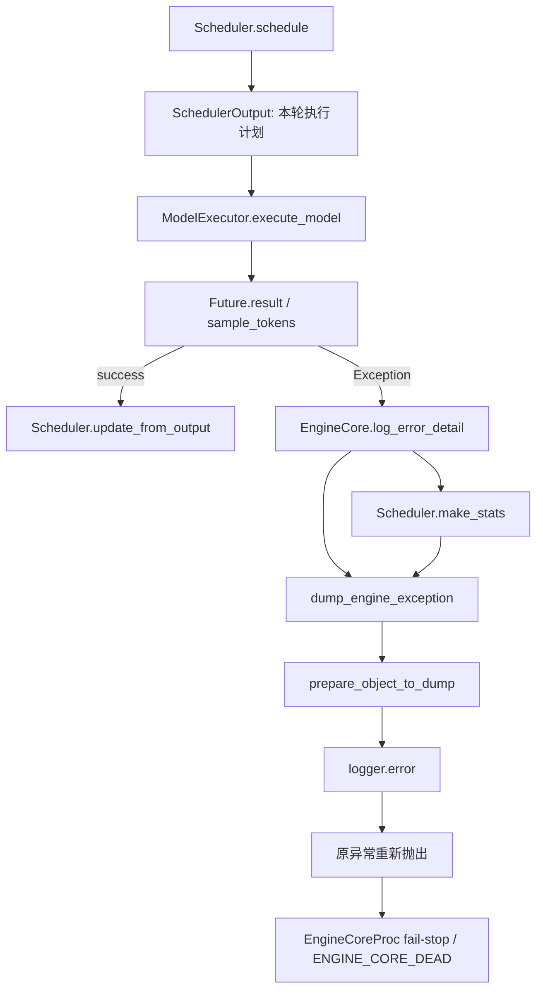
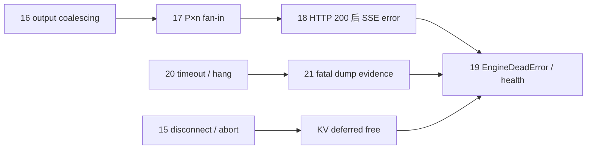

## 本篇在课程路线中的位置

第 19 章解释 EngineCore 死亡如何广播，第 20 章解释 Multiproc timeout 如何把 hang 收敛成 fatal exception。本章只研究下一步：exception 已经进入 `EngineCore.log_error_detail` 时，vLLM 留下什么证据？

基于主干 [`c92b29a1`](https://github.com/vllm-project/vllm/commit/c92b29a1d40644da710209f862b1be0ebd5c2e74)，结论是：当前 fatal dump 是 **best-effort 的进程内日志**，保存本轮 `SchedulerOutput` 执行计划和可选的聚合 `SchedulerStats`；它不是 Scheduler/request/KV 的原子快照，也不是可重放 crash capsule。

## 前置知识回顾

一次 V1 迭代的事务边界是：

`schedule → execute_model → future.result → update_from_output`

`SchedulerOutput` 表示“准备让设备做什么”；只有 `ModelRunnerOutput` 返回并进入 `update_from_output()`，Host Scheduler 才消费结果、推进 token 状态并确认某些 KV 写完成。timeout 或 CUDA exception 落在两者之间时，本轮 completion unknown，因此第 20 章得出必须 fail-stop 的结论。本章关心的是：在进程退出前，能否保存足以解释这个 unknown 的证据。

## 本篇要回答的核心问题

1. normal step 与 pipeline batch queue 的异常如何汇入同一个 dump 点？
2. `SchedulerOutput` 暴露哪些 request/token/block 信息，又刻意隐藏什么？
3. `Scheduler.make_stats()` 为什么不是纯读取？
4. 为什么日志能辅助定位，却不能证明设备到底执行到哪一步？

## 组件在全局架构中的位置



这里没有跨进程 dump 服务，也没有单独的文件 writer。`SchedulerOutput`、统计对象和 logger 都在 EngineCore 进程内；如果进程被 `SIGKILL`、native crash 直接终止，或日志 sink 本身不可用，这条链可能根本来不及完成。

## 完整调用链

普通路径见 [`EngineCore.step`](https://github.com/vllm-project/vllm/blob/c92b29a1d40644da710209f862b1be0ebd5c2e74/vllm/v1/engine/core.py)：先产生 `SchedulerOutput`，以 `non_block=True` 发起执行，再在 `capture_iteration_details` 与 `log_error_detail` 两个 context manager 内等待 `future.result()`；若需要，随后调用 `sample_tokens()`。两者任一抛出 `Exception`，都进入 dump。只有 context 正常退出后，才处理 abort 并调用 `scheduler.update_from_output()`。

开启 pipeline batch queue 时，同一份 `SchedulerOutput` 会和两个 future 一起进入 deque。同步 dispatch 异常在 `execute_model()` 外层立即 dump；异步异常则在对应 tuple 出队、`future.result()` 时 dump。这个配对很重要：即使队列里有多轮在途，错误日志仍引用触发该 future 的那一轮计划，而不是“当前最新一轮”。

[`log_error_detail`](https://github.com/vllm-project/vllm/blob/c92b29a1d40644da710209f862b1be0ebd5c2e74/vllm/v1/engine/core.py) 捕获 `Exception`，调用：

```python
dump_engine_exception(config, scheduler_output, scheduler.make_stats())
raise err
```

它明确不捕获 `BaseException`。已合入的 [PR #19626](https://github.com/vllm-project/vllm/pull/19626) 说明，这是为了不把 `SystemExit`、`KeyboardInterrupt` 等外部终止信号伪装成 `execute_model` 错误。dump 内部再用 `contextlib.suppress(Exception)` 防止诊断代码覆盖原始异常，因此错误的因果主线始终是原 exception。

## 关键类型、字段和状态生命周期

### `SchedulerOutput`：计划，不是完成事实

[`SchedulerOutput`](https://github.com/vllm-project/vllm/blob/c92b29a1d40644da710209f862b1be0ebd5c2e74/vllm/v1/core/sched/output.py) 是 Host 侧 dataclass，没有统一 `shape/dtype/device`。它包含：

- 新请求的 prompt 长度、sampling/pooling 参数、Host `block_ids` 与已计算 token 数；
- cached request 的新 block、token 长度和 output token 数；
- 每请求本轮 token budget、speculative draft token、encoder input、finished request；
- KV/EC connector metadata、待清零 block、CoW copy 等可选元数据。

它由 `Scheduler.schedule()` 创建，EngineCore 与 Worker/Executor 在本轮共享语义所有权，成功后由 `update_from_output()` 消费。异常时对象仍可被格式化，但它只能证明 Scheduler **发出了什么计划**。它不能证明某个 GPU kernel 是否启动、某个 rank 是否完成 collective、block 中是否写入部分 KV。

### `NewRequestData` / `CachedRequestData`：局部脱敏

这两个类型实现 `anon_repr()`。`NewRequestData` 把 `prompt_token_ids`、`prefill_token_ids` 改成长度，把 `prompt_embeds` 改成 shape；`CachedRequestData` 把新增与全量 token IDs 改成每组长度。request ID、block ID、sampling 参数、LoRA 信息以及 `mm_features` 仍会保留。

需要特别注意：`SchedulerOutput` 自身没有 `anon_repr()`，所以递归 formatter 会继续展开其他字段。`scheduled_spec_decode_tokens` 是普通 `dict[str, list[int]]`，当前会记录具体 speculative token IDs；connector metadata 也取决于其自身类型是否提供脱敏表示。因此“prompt 已脱敏”不等于“整个 dump 不含敏感数据”。这是当前代码事实，不是漏洞定性；生产日志仍需要按潜在敏感数据管理。

### Tensor：只读 metadata

[`prepare_object_to_dump`](https://github.com/vllm-project/vllm/blob/c92b29a1d40644da710209f862b1be0ebd5c2e74/vllm/logging_utils/dump_input.py) 对 `torch.Tensor` 只输出：

`Tensor(shape=..., device=..., dtype=...)`

这样既避免输出 prompt/embedding 内容，也避免 CUDA runtime 已损坏时去读取 device data。代价是丢失数值范围、NaN 位置、checksum 与精确输入，无法据此重放 kernel。

### `SchedulerStats`：聚合观测，而且会消费状态

[`Scheduler.make_stats`](https://github.com/vllm-project/vllm/blob/c92b29a1d40644da710209f862b1be0ebd5c2e74/vllm/v1/core/sched/scheduler.py) 在 `log_stats=False` 时直接返回 `None`；开启时记录 running/waiting/skipped 数、KV usage、prefix cache 与 eviction 等统计。

它不是纯 getter：`make_prefix_cache_stats()` 会取出并重置阶段统计，connector prefix stats 被替换为空对象，`drain_events()` 会消费 eviction events。由于随后 Engine 将 fail-stop，这通常不会改变继续服务的正确性；但它意味着 fatal dump 是一次有副作用的观测，也不能和另一消费者同时获得完全相同的统计窗口。

## 逐函数源码解读

[`dump_engine_exception`](https://github.com/vllm-project/vllm/blob/c92b29a1d40644da710209f862b1be0ebd5c2e74/vllm/logging_utils/dump_input.py) 有两层防线：外层 suppress 保证“任何 dump 故障都不覆盖业务故障”；内层 `_dump_engine_exception` 先直接打印 `VllmConfig`，再格式化 scheduler output，最后可选打印 stats。没有写盘、fsync、schema version 或原子 rename。

`prepare_object_to_dump()` 的优先级是 container → Enum → Tensor metadata → `anon_repr` → `__dict__` → JSON/repr。这个顺序让少数关键类型能自定义脱敏，但默认策略仍是递归展开字段。普通 dict 的实现先构造 set 再 join，set 本身也转 list，因此字段顺序不保证稳定；这进一步说明输出面向人工排障，而不是机器严格解析。

原始功能来自已合入的 [PR #13407](https://github.com/vllm-project/vllm/pull/13407)。PR 明确选择“写日志而非 pickle”，目标是在生产 crash 时获得线索，同时隐藏 Tensor 内容与 prompt token。本文对隐私和可重放性的判断，以当前合入代码为准，不把 PR 动机当成额外保证。

## 具体示例与 shape/状态演算

设 block size 为 16，本轮有两个请求：

| 请求 | 调度前状态 | 本轮计划 | dump 可见 |
| --- | --- | --- | --- |
| `A` | 新请求，prompt 128 token | prefill 64 token，blocks `[7,8,9,10]` | request ID、prompt 长度 128、64、block IDs、sampling 参数 |
| `B` | 已运行，已计算 80 token | decode 1 token，新 block `[31]` | request ID、token 长度、1、new block ID |

所以 `total_num_scheduled_tokens=65`。假设 `future.result()` 抛出 CUDA error，且故障前 stats 为 running=1、waiting=3、KV usage=0.72：

1. `update_from_output()` 尚未运行，Host 不会把这 65 token 当成已完成；
2. formatter 不输出 A 的 128 个 prompt token 值，只输出长度；
3. 日志能把错误关联到 blocks `7..10,31` 和当轮配置；
4. 日志不能回答 block 31 是否已经被某个 rank 写入、KV refcount/free list 是什么、logits 是否含 NaN、哪个 stream 最后前进；
5. 若启用统计，prefix/eviction 统计在构造 `SchedulerStats` 时已被 drain/reset。

这就是证据边界：**Host intent 可见，device completion 不可知。**

## 为什么这样设计及替代方案

当前方案的优势是失败路径短、没有大 Tensor D2H、没有额外持久化协议，并保证原异常优先。对于偶发 shape、配置、block mapping 或 batch composition 问题，日志往往足够，正常路径开销也接近零。

替代方案一是把完整 request/KV/Tensor pickle 到磁盘。它更接近重放，但会增加 crash path 的显存读取、同步、I/O 和隐私风险；CUDA runtime 已坏时还可能二次失败。默认开启并不合理。

替代方案二是维护 bounded structured ring buffer：每轮只保存 schema-versioned、deterministic、脱敏的 request hash、token counts、block摘要、rank/step 与状态转换，由独立 supervisor 在 Core 死亡后持久化。它更适合自动关联与跨进程保全，但增加常驻内存、协议演进和运维复杂度。这里属于基于现有缺口的设计推断，不是当前 vLLM 计划。

第一性原理上，fatal diagnostics 必须同时满足：不掩盖原错误、数据有界、默认不泄露内容、在设备失效时不依赖设备读取。完整可重放与这四条存在天然张力，所以更稳妥的方向是“默认最小证据 + 明确授权的更深采集”，而不是无条件全量 dump。

## 性能、并发、正确性与边界条件

- 延迟：递归字符串化与日志 I/O 只在 exception path 发生，但超大 connector metadata 仍可能放大退出延迟和日志量。
- 并发：batch queue 通过 tuple 保持 future 与 `SchedulerOutput` 配对；dump 本身没有跨进程一致性屏障。
- graphability：此路径位于 Host exception handling，不进入 CUDA Graph；它也无法捕获 graph 内部精确 node 进度。
- 正确性：dump 失败被抑制，原 exception 重新抛出；但 `raise err` 会重抛该对象，诊断目的仍以原错误为准。
- 丢失窗口：`SIGKILL`、进程 segfault、机器掉电、logger backpressure 或日志截断都可能让证据不完整。
- 隐私：prompt/prefill token 与 Tensor 内容有定点保护，request ID、block ID、sampling/mm/connector 元数据及 speculative token 仍需审计。

## 测试证据与未覆盖风险

直接测试 [`tests/test_logger.py::test_prepare_object_to_dump`](https://github.com/vllm-project/vllm/blob/c92b29a1d40644da710209f862b1be0ebd5c2e74/tests/test_logger.py) 覆盖 string、list、dict、set、tuple、Enum 与自定义 dataclass 的递归格式化。dict 断言接受两种 key 顺序，验证当前输出并非 deterministic serialization。

测试尚未直接覆盖：Tensor 内容确实不泄露；`NewRequestData/CachedRequestData.anon_repr()` 的所有字段；spec token 与 connector metadata 的隐私矩阵；dump 自身异常不会覆盖原异常；normal/batch-queue fatal path 与 matched `SchedulerOutput`；`make_stats()` 的 drain/reset 副作用；真实 CUDA crash、SIGKILL 和日志 sink 失败。因而可以说“基本 formatter 有单测”，不能说“fatal evidence contract 已被端到端证明”。

## 与前后章节的连接

第 20 章让 hang 变成 exception；本章说明 exception 到达后只能保存 Host 计划和聚合状态。第 19 章随后接管原异常，把 Engine 标为 dead 并广播给请求。三章连起来是：

`progress deadline → fatal exception → best-effort evidence → fail-stop broadcast`

下一章将转向 fatal-path 测试：哪些 fake runner / multiprocess failure injection 真正断言了 error propagation，为什么 KV、connector 与 device cleanup 仍缺少可证明的资源归零测试。

## 本篇结论、知识债、三个理解检查问题和下一章

结论：`log_error_detail` 保存的是失败迭代的输入计划，不是执行完成事实；`anon_repr` 和 Tensor metadata 提供局部脱敏，`make_stats` 提供聚合但有消费副作用；所有 dump 都是 best-effort，不能替代外部 supervisor 或设备级 trace。

知识债：deterministic/versioned 诊断格式、字段级隐私测试、独立持久化、rank/stream progress、KV block refcount/free-list 摘要、dump 大小上限，以及 fatal 后全资源归零证明。

理解检查：

1. 为什么 dump 中出现 block 31 不能证明 block 31 已完成写入？
2. `anon_repr()` 已隐藏 prompt token 后，为什么整个 `SchedulerOutput` 仍不能视为无敏感数据？
3. 为什么 `Scheduler.make_stats()` 的结果不能称为 Scheduler 原子快照？

下一章：**fatal-path 测试矩阵——ModelRunner exception、Worker death 与 timeout 各自证明了什么，KV/connector/device cleanup 还缺哪一层断言。**

## 课程账本增量

- vLLM 基线：`c92b29a1d40644da710209f862b1be0ebd5c2e74`
- 新覆盖：`EngineCore.log_error_detail`、`dump_engine_exception`、`_dump_engine_exception`、`prepare_object_to_dump`、`NewRequestData.anon_repr`、`CachedRequestData.anon_repr`、fatal path 中的 `Scheduler.make_stats`
- 新不变量：dump 发生在 `update_from_output` 之前；dump failure 不覆盖原 exception；token/Tensor 脱敏是字段级而非对象级；fatal stats 可能 drain/reset 统计
- 修正旧预期：当前实现没有完整 Scheduler/request/KV snapshot，只有本轮计划与聚合 stats

## 第 15–21 章知识图谱回顾



这七章把 Serving 末端与 Engine 故障面接起来：正常取消依赖 per-request abort 与 KV fence；慢消费者和多流合并决定输出面资源；HTTP 200 后只能用 payload 表达错误；真正的 Engine fatal 则先由 timeout/exception 建立 fail-stop，再尽力留证，最后统一广播。后续路线因此转向测试与可验证诊断，而不是继续增加错误分支。
