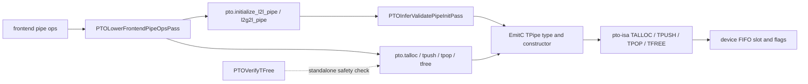
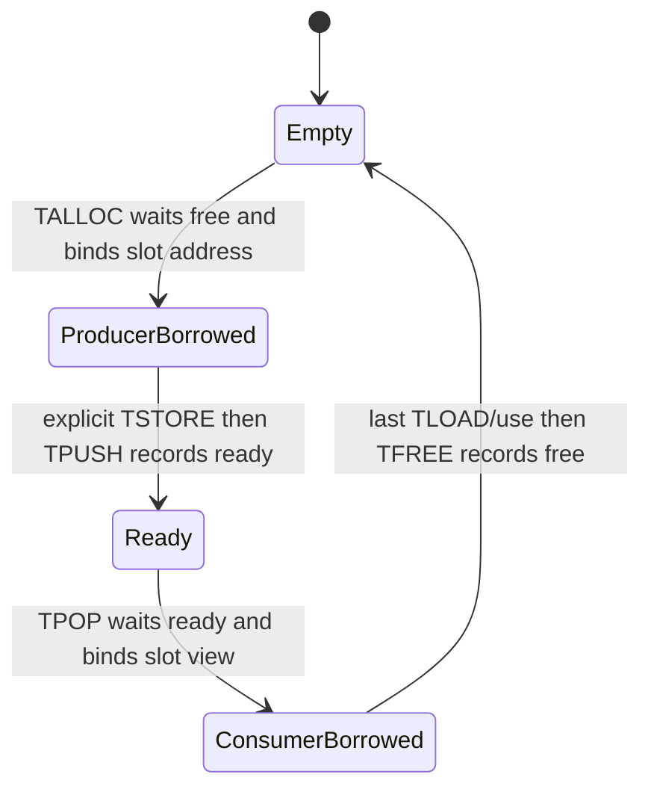

> 本文基于 PTOAS [`5eb87c21`](https://github.com/hw-native-sys/PTOAS/commit/5eb87c21ab9479d834e66968f63f0b1def292764) 与 pto-isa [`96ba706c`](https://github.com/hw-native-sys/pto-isa/commit/96ba706ce1697dd5febe107ee41a72b26e687b42)。代码与测试事实以这两个已合入 commit 为准；旧设计文字、历史 PR 与硬件实现推断会另行标注。

## 本篇在 PTO 课程路线中的位置

课程 21 已把 `reserve/import → peer component → payload base + flag_base → TPipe<...>` 讲到 handle 创建。今天继续追 handle 指向的**一个 FIFO entry 如何换手**：生产者何时取得可写槽位，消费者何时只借到一个 view，哪一步才归还空间，以及 compiler 到底证明了多少。

这一章位于：

```text
ReserveBuffer/flag ABI
  → TPipe entry ownership（本篇）
  → 控制流、取消与跨 dispatch 余额
```

## 前置知识

`TPipe<FlagID, Direction, SlotSize, SlotNum, LocalSlotNum, IsNoSplit>` 同时编码 payload ring 与同步协议。课程 10 已讨论批量 credit；本篇只看单个 logical entry，并坚持三个边界：

1. SSA value 活着，不等于 FIFO slot 仍归消费者；
2. `TPUSH/TPOP` 的同步动作，不等于一定搬了 payload；
3. IR 中显式存在 `TFREE`，不等于默认 pipeline 已证明所有路径余额闭合。

## 今日核心问题

1. Tile entry 与 GlobalData entry 的 `TPOP → TFREE` 为什么不是同一种物理动作？
2. `split/nosplit` 改变地址视图后，什么保持不变？
3. `PTOVerifyTFree` 能证明 matching free 与 use-after-free 吗？为什么当前默认编译仍允许它声称“不支持”的多 outstanding pop？

## PTO 全栈中的位置



上游是 frontend 的 `id` 与 entry type；下游是 pto-isa 模板重载。关键事实是：[`PTOLowerFrontendPipeOpsPass.cpp`](https://github.com/hw-native-sys/PTOAS/blob/5eb87c21ab9479d834e66968f63f0b1def292764/lib/PTO/Transforms/PTOLowerFrontendPipeOpsPass.cpp) 会先创建 `DeclareTileOp` 或 `DeclareGlobalOp`，再以 destination-style 的 `TPopOp` 把该对象绑定到当前 slot。内部 `pto.tpop` 本身不是“返回一个全新 owning buffer”，它把既有 descriptor/Tile 变成一次受 pipe 协议约束的借用。

## 概念和精确语义

### GlobalData：四步所有权交接

pto-isa 的 [`TALLOC`](https://github.com/hw-native-sys/pto-isa/blob/96ba706ce1697dd5febe107ee41a72b26e687b42/docs/isa/TALLOC_zh.md)、[`TPUSH`](https://github.com/hw-native-sys/pto-isa/blob/96ba706ce1697dd5febe107ee41a72b26e687b42/docs/isa/TPUSH_zh.md)、[`TPOP`](https://github.com/hw-native-sys/pto-isa/blob/96ba706ce1697dd5febe107ee41a72b26e687b42/docs/isa/TPOP_zh.md) 与 [`TFREE`](https://github.com/hw-native-sys/pto-isa/blob/96ba706ce1697dd5febe107ee41a72b26e687b42/docs/isa/TFREE_zh.md) 给出完整协议：



- `TALLOC` 只根据 producer index 选择 slot 并把地址赋给 `GlobalTensor`；不写数据，也不通知消费者。
- `TPUSH(GlobalData)` 只 commit ready；它不隐式 `TSTORE`。
- `TPOP(GlobalData)` 只等待 ready、选择 consumer slot 并重绑 descriptor；它不隐式 `TLOAD`，也不释放空间。
- `TFREE(GlobalData)` 才通知 producer 此 slot 可复用。传入的 descriptor 用于选择正确重载，当前实现不读写其 tensor 内容。

因此 GlobalData entry 的最小正确序列是：

```text
TALLOC → 写完所有子区域 → TPUSH
TPOP   → 读完所有子区域 → TFREE
```

把 `TFREE` 放在最后一次 `TLOAD` 前面，会让 producer 获得覆盖该物理区间的资格；即使 descriptor 的 SSA use 仍合法，也已经形成潜在 read-after-reuse。

### TileData：相同 API，代际动作不同

Tile entry 的 `TPUSH` 会把 producer Tile 放入 FIFO，`TPOP` 会把当前 slot 数据装入 consumer Tile。这里 `TFREE(Pipe&)` 的真实效果有代际差异：

- A2/A3 的 TileData 路径在 `TPOP` 内部按 `SyncPeriod` 发 free-space 通知，因此显式 `TFREE` 是 API 对称用的空操作；
- A5 的 TileData `TFREE` 会释放 `TPOP` 使用的 slot；
- GlobalData 在两类路径中都必须把释放点放在最后一次数据读取之后。

所以“所有 `TFREE` 都是设备释放指令”是错的；更准确的说法是：**PTOAS 保留统一的显式生命周期边界，而 pto-isa 按 entry kind 与架构决定这个边界映射成真实 release 还是 no-op。**

### 四个接口的 contract 放在一张表里

| 接口 | 输入与结果 | shape/dtype/device | 所有权前置条件 | 后置条件与失败方式 |
| --- | --- | --- | --- | --- |
| `TALLOC(pipe, GlobalData)` | 输入 pipe 与可重绑 descriptor；无新 payload | descriptor 保留静态 shape/stride/dtype，地址落在 pipe GM backing | 当前 producer index 对应 slot 最终可获得 free credit；`SlotSize` 足以容纳 logical entry | descriptor 指向 producer slot，producer index 前进；不满足 GlobalData/direction contract 会在模板 `static_assert` 或上层 verifier 失败，运行时 credit 不到则等待 |
| `TPUSH(pipe, entry)` | Tile 或已分配 GlobalData | Tile 路径按 location/layout 选择搬运；GlobalData 只使用 transaction descriptor | producer 已完整写好本 entry，split 与 peer component 的 nosplit 分类一致 | ready 被记录、producer 交出 slot；过早 push 会让 consumer 看见未完成 payload，类型/方向不合法则编译失败 |
| `TPOP(pipe, entry)` | pipe 与 destination-style Tile/descriptor | Tile 落在 Vec/Mat/Ctrl 等本地位置；GlobalData 保持 GM shape/stride，可因 split 呈现 half-view | 对应方向最终会有 ready；destination type 能表达该 entry | 等待 ready 后 consumer index 前进，entry 进入借用态；ready 永不到会 stall，错误 split/shape 可能造成两端解释不一致 |
| `TFREE(pipe, entry?)` | Tile 路径只需 pipe，GlobalData 还带 descriptor | 不改变数据 shape/dtype，作用是同步/所有权 | borrowed entry 的全部语义读取已经提交且按架构完成；不得重复归还 | slot 最终重新可分配；GlobalData 提前 free 可形成 producer 覆盖与 consumer 读取的竞争，漏 free 可在 ring wrap 后令 producer 永久等待 |

这里的 `device` 不是“descriptor 自己搬到设备上”：PTOAS IR 的 Tile/descriptor 是编译期对象，生成后的 C++ intrinsic 才在 AICore 上执行。pipe backing 的 owner 仍是调用方传入或 ReserveBuffer 物化的内存，四个接口只转移 slot 的访问资格，不延长 backing allocation 的生命。

### 正确性不变量不是“调用次数相等”这么简单

对一个方向的深度 `N` ring，任意时刻每个 slot 只能有一个 owner；producer 不得越过尚未收到 free 的 slot，consumer 不得越过尚未收到 ready 的 slot。若只在程序退出时检查 `push_count == pop_count == free_count`，仍可能遗漏中途的错误顺序，例如 `TFREE → 最后一次 TLOAD` 或 `TPUSH → 最后一次 TSTORE`。因此证明至少包含三层：

1. **余额**：生产、消费与归还的累计次数不越界；
2. **顺序**：同一个 entry 必须遵守 allocate/write/commit/wait/read/free；
3. **完成性**：异步读写的设备完成点不得晚于对应的 commit/free ownership handoff。

当前 `PTOVerifyTFree` 主要检查第二层中 consumer SSA use 的局部顺序，并不覆盖第一层跨函数余额，也没有单独构造第三层的设备 event 证明。

## 真实文件、类型与 pass 逐段解读

### 1. Frontend result 如何变成 borrowed entry

[`PTOOps.td`](https://github.com/hw-native-sys/PTOAS/blob/5eb87c21ab9479d834e66968f63f0b1def292764/include/PTO/IR/PTOOps.td) 定义内部四个 op：`TAllocOp`、`TPushOp`、`TPopOp`、`TFreeOp`。Tile `tfree` 不带 entry operand；GlobalData `tfree` 带与 `tpop` 绑定的 descriptor。

Lowering 的关键伪代码是：

```text
frontend pop(type)
  entry = type is tensor_view ? DeclareGlobalOp : DeclareTileOp
  TPopOp(entry, pipe, split)
  replace frontend result with entry

frontend free(entry?)
  TFreeOp(global ? entry : none, pipe, split)
```

对象的 SSA owner 是 `Declare*Op`，FIFO owner 则由 `TPOP/TFREE` 协议决定。这正是“SSA 生命周期”和“entry 借用生命周期”不能混为一谈的地方。

### 2. split/nosplit：slot 容量不随视图减半

[`ptoas-tpush-tpop-design.md`](https://github.com/hw-native-sys/PTOAS/blob/5eb87c21ab9479d834e66968f63f0b1def292764/docs/designs/ptoas-tpush-tpop-design.md#L447-L480) 明确：`SLOT_SIZE` 永远是**切分前完整 logical entry** 的字节数；`split` 只影响 TALLOC/TPUSH/TPOP/TFREE 的执行和 subblock 地址视图，不改变 ring 的 slot stride。单向 pipe 默认 8 slots，`DIR_BOTH` 每方向 4 slots。

当前代码还修正了同一文档较早的一条旧结论。文档第 443–445 行说同一 logical pipe 可任意混用 split；但 [`PTOInferValidatePipeInitPass.cpp`](https://github.com/hw-native-sys/PTOAS/blob/5eb87c21ab9479d834e66968f63f0b1def292764/lib/PTO/Transforms/PTOInferValidatePipeInitPass.cpp) 已经：

- 拒绝同一 peer component 同时出现 `split=0` 与任意非零 split；
- 根据 uses 推导 `nosplit`；
- 拒绝显式 `nosplit` 与 use 不一致，或 peer 两端显式值冲突。

它仍把非零的 1/2/3/4 都归为 `split` 类，并不要求每条 op 使用完全相同的非零枚举。现行代码行为优先于滞后的设计文字。

### 3. `PTOVerifyTFree` 的实际算法

[`PTOVerifyTFreePass.cpp`](https://github.com/hw-native-sys/PTOAS/blob/5eb87c21ab9479d834e66968f63f0b1def292764/lib/PTO/Transforms/PTOVerifyTFreePass.cpp) 对 kernel/section 内每个 `TPopOp` 做三件事：

1. 在**同一 block 的后续 op** 中找第一个相同 pipe handle 的 `TFreeOp`；没有就报 `requires an explicit matching tfree`。
2. 从该 pop 到 free 之间，若嵌套或顶层出现同 pipe 的另一个 pop，报 `multiple outstanding pops ... not supported`。
3. 收集 borrowed entry 的 uses；若 use 不能映射回 pop 所在 parent block，或位于 free 之后，报错。

这能证明一个保守的单-block性质：

```text
同一 pipe 最多一个 outstanding pop
且 free 位于 borrowed entry 的最后一次 SSA use 之后
```

但它不能证明：producer 侧 `TALLOC/TPUSH` 余额、跨 block/CFG 的 path balance、GlobalData free operand 与 pop entry 身份、pop/free 的 split 一致、额外 free、跨函数 producer/consumer 次数相等。

还要注意它寻找“matching”的定义非常窄：只比较 pipe handle，不比较 entry identity。若有 `pop(entry0), free(entry1)`，只要 pipe 相同且位置关系满足，算法就可能把它当作匹配；若两个 branch 各自 free，同 block 的线性扫描又不能表达“每条实际路径恰好一次”。这不是实现 bug 的直接结论，而是当前 pass 明确选择的证明域：同 block、单 outstanding、借用值不越过 free。超出证明域的正确性需要其他 pass 或测试承担。

更关键的是，当前默认 [`ptoas_pipeline.cpp`](https://github.com/hw-native-sys/PTOAS/blob/5eb87c21ab9479d834e66968f63f0b1def292764/tools/ptoas/ptoas_pipeline.cpp#L1420-L1423) 接入了 frontend lowering、`PTOInferValidatePipeInitPass` 与 sync lowering，却没有加入 `createPTOVerifyTFreePass()`。该 pass 已注册为 `--pto-verify-tfree`，但不是标准 `ptoas` 主链的自动保证。

## 对象生命周期与端到端调用链

以 GlobalData C2V 为例：

```text
pto.talloc_to_aiv result
  → DeclareGlobalOp descriptor
  → TAllocOp binds producer slot i
  → partition_view/TSTORE writes slot i
  → TPushOp commits ready(i)
  → peer TPopOp binds consumer descriptor to slot i
  → partition_view/TLOAD consumes slot i
  → TFreeOp returns free credit for slot i
  → producer may reuse slot i after ring wrap
```

descriptor 不拥有 GM，真正长期 owner 是 pipe backing allocation；entry 只在 `TALLOC→TPUSH` 或 `TPOP→TFREE` 区间持有排他访问资格。正常完成后 descriptor 可失效，slot 则回到 ring 继续复用。

## 具体 shape、slot 与状态演算

直接使用 [`tpush_tpop_globaltensor_loop_nosplit_a3.pto`](https://github.com/hw-native-sys/PTOAS/blob/5eb87c21ab9479d834e66968f63f0b1def292764/test/lit/pto/tpush_tpop_globaltensor_loop_nosplit_a3.pto) 的参数：

```text
entry shape = 4 × 128 × 128 × f32
entry bytes = 4 × 128 × 128 × 4 = 262144 B
direction   = C2V
slot_num    = 8
ring bytes  = 8 × 262144 = 2097152 B
split       = 0, inferred IsNoSplit=true
```

只演算 slot 0 与 slot 1：

| 时刻 | producer index | consumer index | slot 0 | slot 1 |
| --- | ---: | ---: | --- | --- |
| 初始 | 0 | 0 | Empty | Empty |
| `TALLOC(0)` | 1 | 0 | ProducerBorrowed | Empty |
| 四次 `TSTORE 1×128×128` | 1 | 0 | ProducerBorrowed/full payload | Empty |
| `TPUSH(0)` | 1 | 0 | Ready | Empty |
| `TALLOC(1); TPUSH(1)` | 2 | 0 | Ready | Ready |
| `TPOP(0)` | 2 | 1 | ConsumerBorrowed | Ready |
| 四轮 `TLOAD/TADDS/TSTORE` | 2 | 1 | ConsumerBorrowed | Ready |
| `TFREE(0)` | 2 | 1 | Empty | Ready |

若改成 `split=1`，[`tpush_tpop_globaltensor_split_half_slot_a3.pto`](https://github.com/hw-native-sys/PTOAS/blob/5eb87c21ab9479d834e66968f63f0b1def292764/test/lit/pto/tpush_tpop_globaltensor_split_half_slot_a3.pto) 证明 consumer descriptor 可以是 `4×64×128xf32`，但 `TPipe` 的 slot size 仍是 262144 B。也就是说，两个 vector subblock 看见的是完整 entry 的不同 half-view，而不是 ring 突然拥有 16 个 131072 B slots。

从第一性原理看，每个方向、每个 slot 在任意时刻必须恰处于四态之一。教学上可写成：

```text
Empty + ProducerBorrowed + Ready + ConsumerBorrowed = SlotNum
```

这是所有权守恒的抽象，不是源码公开了四个同名硬件计数器；真实实现用 ring index 与稀疏 ready/free flag 批量表达状态。

## 为什么这样设计及替代方案

### 显式 `TFREE` vs 自动插在 last use

自动根据 SSA last use 插 free 看似省事，但 last use 只是编译器观察到的最后一次提交，不一定等于异步 `TLOAD` 真正完成；遇到 branch、loop、view alias 与跨 block 时还需要 path-sensitive liveness。显式 free 把协议终点交给 kernel 作者或上层 lowering，延迟更可控、跨架构 ABI 统一，代价是易漏写、写早或路径不平衡。

### 单 outstanding verifier vs FIFO-aware verifier

当前 verifier 禁止同 pipe 上 `pop0, pop1, free0, free1`，证明简单，却牺牲 pipeline overlap。FIFO-aware 方案可以维护一个 outstanding queue，把每个 `TFREE` 配给队首 pop，并检查各 entry 的 last use；吞吐更好，但需要处理 CFG merge、循环迭代、异常边以及 GlobalData operand identity，维护成本明显更高。

理想分层不是让 verifier 模拟硬件，而是：

- op verifier 检查 type、direction、split 枚举；
- component pass 检查 peer、slot、nosplit contract；
- lifecycle pass 检查 producer/consumer 的路径余额与 borrow-after-free；
- 设备 E2E 用 delay/poison 验证真实 ready/free 与 payload 可见性。

## 访存、流水、并行和硬件约束

- GlobalData 把 payload 搬运与 queue commit 解耦，可在一个 entry 内循环 `TSTORE/TLOAD` 多个子区域；代价是 free 点必须覆盖最后一个异步 reader。
- `SlotNum=8` 不表示每次都做 flag wait/record；A2/A3 `SyncPeriod=(SlotNum<=2)?SlotNum:SlotNum/2`，以稀疏 credit 降低同步开销。
- `nosplit` 让完整 entry 被消费；split 让两个 vector subblock取得不同地址视图。两者不能在同一个 peer component 内混用，否则 producer/consumer 对 slot 内容的解释不一致。
- A2/A3 TileData `TFREE` 是 no-op，不代表 free-credit 不存在，而是通知已折叠进 `TPOP`；GlobalData 因为 caller 决定最后一次 `TLOAD`，不能提前折叠。
- 公开源码能确认 index、地址和 flag 协议；具体硬件 queue、interconnect 与 flag 微架构未公开，本文不从模板代码反推周期级实现。

## 测试证据与未覆盖风险

### 已有测试实际证明什么

- [`tpush_tpop_frontend_mixed_split_a5.pto`](https://github.com/hw-native-sys/PTOAS/blob/5eb87c21ab9479d834e66968f63f0b1def292764/test/lit/pto/tpush_tpop_frontend_mixed_split_a5.pto)：producer 用 `split=1`、consumer 用 `split=0`，标准 `ptoas` 必须报 peer split conflict；证明 nosplit/split 分类已接入默认 pipeline。
- [`tpush_tpop_frontend_nosplit_a5.pto`](https://github.com/hw-native-sys/PTOAS/blob/5eb87c21ab9479d834e66968f63f0b1def292764/test/lit/pto/tpush_tpop_frontend_nosplit_a5.pto)：两端显式 `nosplit=true` 且 data ops 用 `split=0`，FileCheck 确认 `TPipe<..., true>` 与 `TILE_NO_SPLIT`。
- 两个 GlobalTensor lit 分别确认 full-slot loop 与 half-view split 的 EmitC shape、stride、slot size 及四条 intrinsic 链；它们是 codegen golden，不是设备并发/死锁测试。
- [`issue489_interleaved_tpop_tfree_a3.pto`](https://github.com/hw-native-sys/PTOAS/blob/5eb87c21ab9479d834e66968f63f0b1def292764/test/lit/pto/issue489_interleaved_tpop_tfree_a3.pto) 在同一 pipe 上连续两个 `TPOP`、再两个 `TFREE`，并让 pop 用 split=1、free 用 split=2；默认 `ptoas` 仍成功生成代码。它直接证明 `PTOVerifyTFree` 的 single-outstanding 与 split/entry matching 不是默认主链保证。

### 未覆盖风险

1. 仓库未找到直接以 `--pto-verify-tfree` 运行的 lit；pass 自身的 missing free、use-after-free、nested-region negative case 缺少回归证据。
2. 没有 `if` 一边 free、另一边漏 free，或 loop zero-trip/多迭代的路径余额测试。
3. 没有 producer 多一次 `TALLOC`、consumer 少一次 `TPOP` 的跨函数 balance verifier。
4. GlobalData free 是否携带原 pop descriptor、额外 free、非零 split 之间错配均未由当前 pass 检查。
5. FileCheck 不能证明 stall、deadlock、early-exit 后 flag 归零，也不能证明下一次 dispatch 安全复用同一 `FlagID`。

## 与前后章节的连接

课程 20–21 解决的是“slot 在哪里、peer 是谁、用哪些 flag”；本章解决“某一 slot 当前归谁”。它也补上课程 16 的同一原则：物理地址能否复用，不由 SSA last use 单独决定。下一章将把线性序列推进到 `scf.if/scf.for` 与 early-exit：当 control-flow path 不同，entry 余额如何合流，取消时谁负责最后一次归还。

## 本篇结论、知识债与理解检查

结论只有四条：

1. GlobalData 的 `TALLOC/TPUSH/TPOP/TFREE` 是“bind → commit → bind → release”，payload 读写必须显式发生。
2. TileData 与 GlobalData 共享 API，不共享完全相同的 release 时机；A2/A3 Tile `TFREE` 是 no-op，GlobalData 不是。
3. split 改变 view/执行方式，不改变 full-entry `SLOT_SIZE`；当前代码拒绝 nosplit 与 split 混用，但允许不同非零 split 枚举共存。
4. `PTOVerifyTFree` 只证明保守的同 block、单 outstanding、last-use-before-free，而且当前未接入默认 pipeline。

仍欠：verifier direct lit、FIFO-aware pairing、CFG/path balance、producer 侧余额、GlobalData operand identity、default-pipeline policy，以及 early-exit/下一 dispatch 的设备归零测试。

理解检查：

1. 为什么 `TPOP(GlobalData)` 之后 descriptor 仍能被 SSA 使用，却不代表可以把 `TFREE` 提前到第一次 `TLOAD` 后？
2. `4×64×128xf32` 的 split consumer 为什么仍占用 262144 B slot，而不是 131072 B？
3. 一个 lit 经标准 `ptoas` 编译成功，为什么不能推出 `PTOVerifyTFree` 已验证它？

下一章：**TPipe 控制流余额——`if/loop/early-exit` 下的 path-sensitive free、取消与跨 dispatch flag 归零。**

## 课程账本增量

- PTOAS 基线：`5eb87c21ab9479d834e66968f63f0b1def292764`
- pto-isa 基线：`96ba706ce1697dd5febe107ee41a72b26e687b42`
- 新覆盖：`TAllocOp/TPushOp/TPopOp/TFreeOp`、`PTOLowerFrontendPipeOpsPass`、`PTOInferValidatePipeInitPass`、`PTOVerifyTFreePass`、A2/A3 `TALLOC_IMPL/TPOP_IMPL/TFREE_IMPL`
- 新不变量：full-entry slot 容量不随 split 缩小；GlobalData slot 在最后一次读取完成前不得 free；borrow lifetime 不由 descriptor SSA lifetime代替；默认 pipeline 保证与可选 pass 保证必须分开记录
- 最高知识债：控制流路径余额、默认接入策略、producer/consumer 跨函数 balance 与设备 early-exit 恢复
- 下一章：TPipe control-flow balance 与 cancellation ownership
