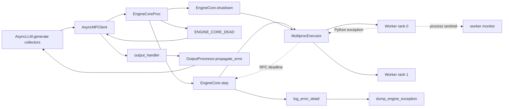
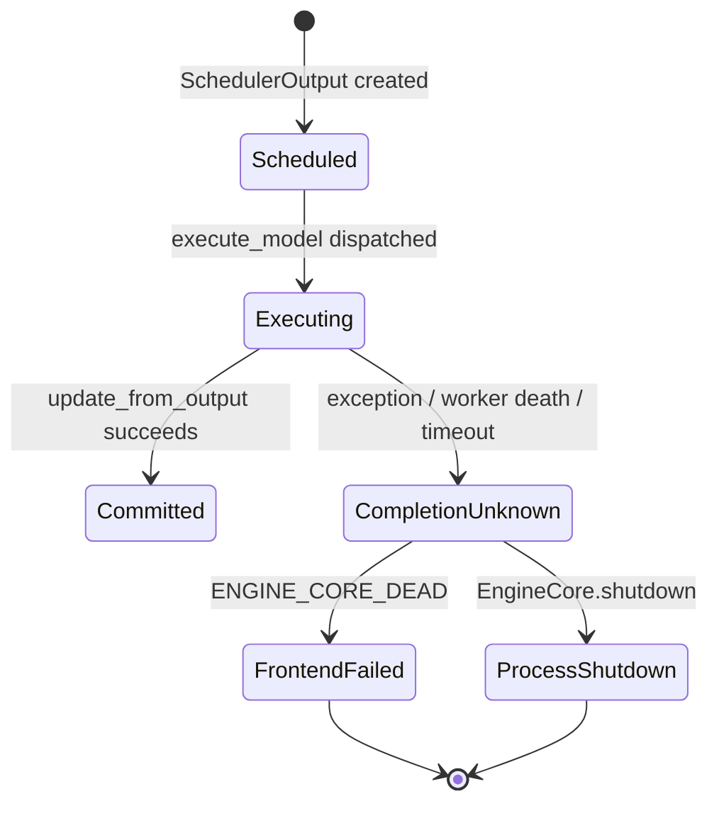

## 本篇在课程路线中的位置

前两章已经确认：V1 遇到执行超时或不可恢复异常时必须 fail-stop；fatal dump 保存的是出错迭代的执行计划，不是完整资源快照。本篇继续进入测试与故障诊断，但只回答一个边界清晰的问题：

> ModelRunner exception、Worker death 和 RPC timeout 的现有测试，各自证明到哪一层？“所有请求都收到 EngineDeadError”能否推出 KV、connector 与 device resource 已经归零？

分析基于 vLLM 主干 [`8600db5d`](https://github.com/vllm-project/vllm/commit/8600db5dff18054f7a4314f6f8bba4259e3e2a98)，时间为 2026-09-01。下文将当前代码事实、测试事实和仍待验证的设计建议分开陈述。

## 前置知识回顾

一次 V1 iteration 不是“forward 成功就结束”，而是：

`Scheduler.schedule → execute_model → future.result → Scheduler.update_from_output`

只有最后一步成功执行，Scheduler 才把本轮 token、KV 与请求状态提交。若异常发生在 `future.result()`，设备侧可能已经部分执行，而主进程没有可靠 completion proof。于是“只 abort 当前请求并继续服务”不安全，EngineCore 必须整体退出。

上一章还说明，`dump_engine_exception` 记录 `SchedulerOutput` 和可选统计；它不能替代 Scheduler request table、KV free list、connector job 或各 Worker request state 的一致性审计。

## 本篇要回答的核心问题

把 fatal 正确性拆成五层，现有测试才容易读懂：

| 层次 | 要证明的终态 |
|---|---|
| F1 故障检测 | exception、进程退出或 deadline expiry 被可靠观察 |
| F2 请求收敛 | 全部在途请求失败，后续 admission 被拒绝 |
| F3 进程收敛 | EngineCore、Worker、MQ/socket 与监控线程退出或关闭 |
| F4 逻辑资源收敛 | Scheduler request、KV block ref、connector job、Worker request state 回到基线 |
| F5 设备资源收敛 | CUDA/HIP allocation、collective 与 context 不再持有本次 Engine 的资源 |

关键区别是：F2 是 API 语义，F4 是内部所有权语义，F5 是设备进程语义。它们有关联，但不能互相替代。

## 组件在全局架构中的位置

三类故障在入口不同，但最终都要汇入 EngineCoreProc 的 fatal boundary，再通过 `ENGINE_CORE_DEAD` 让前端请求收敛，并执行全 Engine shutdown。

## 完整调用链

### ModelRunner exception

`WorkerProc._execute_worker_rpc` 捕获 Worker 方法异常并编码失败响应；parent executor 在 `collective_rpc` 看到非 success status 后抛出 `RuntimeError`。异常继续穿过：

`future.result → log_error_detail → EngineCoreProc.run_busy_loop → _send_engine_dead → process_output_sockets → AsyncMPClient.validate_alive → AsyncLLM.output_handler → OutputProcessor.propagate_error`

[EngineCore.step](https://github.com/vllm-project/vllm/blob/8600db5dff18054f7a4314f6f8bba4259e3e2a98/vllm/v1/engine/core.py#L597-L627) 在 `update_from_output` 之前等待 future，因此失败 iteration 不会被 Scheduler 提交。[EngineCoreProc 的 fatal handler](https://github.com/vllm-project/vllm/blob/8600db5dff18054f7a4314f6f8bba4259e3e2a98/vllm/v1/engine/core.py#L1340-L1395) 发送 dead sentinel，并在 `finally` 中调用 shutdown。

### Worker death

[multiprocess Worker monitor](https://github.com/vllm-project/vllm/blob/8600db5dff18054f7a4314f6f8bba4259e3e2a98/vllm/v1/executor/multiproc_executor.py#L299-L338) 等待每个子进程的 sentinel。任一 Worker 退出后，它设置 `is_failed`，关闭整组 Worker，并触发一次性 `failure_callback`。EngineCoreProc 把 callback 转为 `EXECUTOR_FAILED` 输入，随后抛出 fatal exception，进入相同的 dead broadcast。

这里没有“只补一个 rank”的恢复协议：tensor-parallel collective 的参与者集合已经破坏，剩余 Worker 也必须终止。

### RPC timeout

[MultiprocExecutor.execute_model](https://github.com/vllm-project/vllm/blob/8600db5dff18054f7a4314f6f8bba4259e3e2a98/vllm/v1/executor/multiproc_executor.py#L340-L364) 把默认 300 秒 timeout 交给 `collective_rpc`；后者计算共享 absolute deadline，并用剩余时间等待每个 rank 的响应。等待超时抛出 `TimeoutError`，再沿 `future.result` 进入 fatal boundary。

这条链只说明“代码会这样收敛”。是否真的在 alive-but-stalled Worker 下广播到所有 collector、杀死子进程并回收资源，还需要 E2E 测试证明。

## 关键类型、字段和状态生命周期

最重要的对象不是 exception，而是发生 exception 时仍被多个 owner 持有的状态：

- `SchedulerOutput`：Scheduler 创建、EngineCore 持有，成功后由 `update_from_output` 消费；fatal dump 可记录它，但不会把它变成已提交结果。
- `RequestOutputCollector`：前端每个请求一个。fatal 时由 `propagate_error` 写入异常，使 consumer 结束；这证明 F2，不证明 Core 进程内部状态已逐项释放。
- Worker request state、block table 与 sampler/input batch row：由 Worker/ModelRunner 进程持有。正常 finish/abort 可显式移除；Worker 被 `SIGKILL` 时只能由进程销毁回收地址空间，不可能再发出逻辑 cleanup acknowledgement。
- KV block：由 Scheduler/KV manager 的引用关系决定逻辑可复用性；进程退出后的显存释放是另一层结果。
- `engine_dead`：frontend shared latch。一旦设置，后续调用立即失败，不尝试把 Engine 复活。

## 逐函数源码解读

### 1. `log_error_detail`：保留证据，不执行恢复

[`log_error_detail`](https://github.com/vllm-project/vllm/blob/8600db5dff18054f7a4314f6f8bba4259e3e2a98/vllm/v1/engine/core.py#L507-L520) 捕获异常，调用 `dump_engine_exception`，随后原样抛出。它刻意不调用 per-request finish/free：设备 completion 未知时，局部恢复没有足够证据。

### 2. `_send_engine_dead`：best-effort 的最后广播

[`_send_engine_dead`](https://github.com/vllm-project/vllm/blob/8600db5dff18054f7a4314f6f8bba4259e3e2a98/vllm/v1/engine/core.py#L1638-L1651) 把 `ENGINE_CORE_DEAD` 交给 output thread，并最多等待五秒。output thread 向全部 socket 发送 sentinel；如果自身也已故障，frontend 的 process monitor 仍可由 EngineCore 进程退出推导 engine death。因此这是两条检测路径，不是 exactly-once 消息协议。

### 3. `output_handler`：把 Engine fatal 扇出给请求

[`AsyncLLM.output_handler`](https://github.com/vllm-project/vllm/blob/8600db5dff18054f7a4314f6f8bba4259e3e2a98/vllm/v1/engine/async_llm.py#L780-L826) 遇到输出通道异常后调用 `OutputProcessor.propagate_error`。所有 active collector 都得到相同 fatal cause；`engine_dead` latch 又保证新请求被拒绝。

### 4. Worker monitor：检测退出，不检测前进

monitor 观察 OS process sentinel，所以能检测 crash、`SIGKILL` 和非零退出；alive-but-stalled Worker 不会触发 sentinel，只能依赖 RPC deadline。两套机制覆盖不同 failure detector，不能相互替代。

## 具体示例与 shape/状态演算

考虑 TP=2、block size=16，三个并发请求 `R0/R1/R2`。为便于演算，假设每个请求当前需要两个 KV blocks，共六块；两个 rank 各持有对应层的 KV tensor。第十一次 forward 时 rank 0 抛出 Python exception。

| 时刻 | frontend | Scheduler/KV | Worker | 可证明状态 |
|---|---|---|---|---|
| T0 | 3 collectors | 3 running、6 block refs | 两 rank 各有 3 request states | 正常执行 |
| T1 | 等待输出 | 本轮已 schedule，尚未 commit | rank 0 exception | device completion 不可信 |
| T2 | 3 个 collector 收到 `EngineDeadError` | 不再接受下一轮 | executor 开始关闭全部 rank | F1、F2 |
| T3 | 新 `R3` 被拒绝 | Core 进程退出 | Worker 地址空间销毁 | F3、粗粒度 F5 |

这个例子中的“六块”是教学假设，不是测试 hard-code。真正缺失的断言是：退出前是否观测到 `scheduler_requests=0`、`allocated_kv_blocks=0`、`connector_pending_jobs=0` 和 `worker_request_states=0`。进程已经销毁后，显存下降只能说明地址空间被回收，不能倒推出正常 cleanup path 曾逐项运行。

## 为什么这样设计及替代方案

### 当前方案：Engine fail-stop

优点是正确性边界简单：不猜测部分执行到了哪里，也不复用可能被设备继续写入的 KV；代价是所有并发请求一起失败，冷启动增加可用性损失。

### 替代一：只 abort 出错请求

它延迟最低，但要求证明 collective、RNG、KV write 与 connector transfer 都尚未产生不可回滚副作用。普通 Python exception、timeout 和 rank death 都无法普遍提供这份证明，因此不可作为通用策略。

### 替代二：shutdown 前生成资源 census

可在 test/debug 模式让 Scheduler、KV manager、connector 与存活 Worker 返回计数，再执行终止。这会显著增强 F4 证据，但 fatal path 更复杂；而被 `SIGKILL` 的进程、native crash 或卡死设备无法应答，所以 census 必须允许 partial result，不能成为 shutdown 前置条件。

第一性原理上，合适的测试目标不是强迫所有故障走同一 cleanup choreography，而是让每一层 owner 给出它在该故障模型下能够给出的最强证据。

## 性能、并发、正确性与边界条件

- fatal broadcast 应与 active request 数近似线性，但不能在任一慢 consumer 上阻塞 Engine 终止。
- GPU memory 不能断言绝对为零：CUDA/HIP runtime、测试进程和其他 Engine 可能保留基线。应比较启动前 baseline 或使用明确容差。
- prefix cache 可能有合法持久块；资源测试应关闭 prefix caching，或断言 free-list/refcount 恢复到测试前快照。
- Worker death 后无法要求 victim 进程报告 request state 已清空；合理断言是进程已消失、父进程持有的 IPC/actor refs 已清除、设备内存回到基线。
- timeout 测试必须缩短专用 timeout，并用“存活但故意不响应”的 Worker；sleep 发生在调用前或错误线程上，只会测到普通 exception/进程退出。
- fatal tests 应使用独占 GPU 或按 PID 归因，否则 NVML 总显存容易受到其他任务干扰。

## 测试证据与未覆盖风险

| 故障注入 | 直接测试证据 | 已证明 | 尚未证明 |
|---|---|---|---|
| ModelRunner exception | [`test_forward_error.py`](https://github.com/vllm-project/vllm/blob/8600db5dff18054f7a4314f6f8bba4259e3e2a98/tests/v1/shutdown/test_forward_error.py#L25-L152) | TP=1/2；三个 async 请求全得 `EngineDeadError`；engine 标记 errored；新请求失败；GPU memory 降到阈值以下 | Scheduler/KV/connector/Worker state 精确归零 |
| Worker death | [Ray V2 worker death test](https://github.com/vllm-project/vllm/blob/8600db5dff18054f7a4314f6f8bba4259e3e2a98/tests/distributed/test_ray_v2_executor.py#L249-L283)；[FT E2E worker kill](https://github.com/vllm-project/vllm/blob/8600db5dff18054f7a4314f6f8bba4259e3e2a98/tests/v1/fault_tolerance/test_fault_tolerance_e2e.py#L320-L378) | callback、`is_failed/shutting_down`；FT survivor unhealthy、victim dead、dead instance 拒绝 retry | 默认 MP 全链 collector fanout；KV/connector refs；GPU baseline；所有 backend parity |
| RPC timeout | [`test_multiproc_executor_timeout.py`](https://github.com/vllm-project/vllm/blob/8600db5dff18054f7a4314f6f8bba4259e3e2a98/tests/v1/executor/test_multiproc_executor_timeout.py) | stale deadline clamp、positive/None timeout、FIFO future drain、recv timeout 单元语义 | 真实 Worker withheld response；`TimeoutError → ENGINE_CORE_DEAD`；进程与资源收敛 |

forward-error 测试中的 [`wait_for_gpu_memory_to_clear`](https://github.com/vllm-project/vllm/blob/8600db5dff18054f7a4314f6f8bba4259e3e2a98/tests/utils.py#L1572-L1640) 默认容许约 2 GiB 平台基线（部分 ROCm 环境更高）。这是有价值的 F5 smoke proof，却不是 allocator exact-zero proof。

timeout 单测来自已合入 [PR #41357](https://github.com/vllm-project/vllm/pull/41357)（commit [`48aa8d8d`](https://github.com/vllm-project/vllm/commit/48aa8d8d7529d2314858d8487cc0a21789fc7ec1)）：它修复 stale absolute deadline 变成无界等待的 bug，并明确采用 fake clock、无真实 Worker 的单元测试。因此不能把该 PR 的测试外推成完整 hang recovery 证据。

建议的最小跨层测试矩阵是：

1. 记录 frontend active collectors、Scheduler requests、KV free-list/refcount、connector pending jobs、child PIDs 与 GPU baseline；
2. 分别注入 forward exception、Worker `SIGKILL`、alive Worker withheld response；
3. 断言所有可达层进入 fatal terminal state，新请求失败；
4. 对仍存活 owner 获取 shutdown 前 census，对被杀 owner 断言进程消失；
5. shutdown 后比较 parent-owned refs、子进程集合和设备显存基线。

这是测试设计建议，不是当前主干已经提供的功能。

## 与前后章节的连接

上一章回答“fatal dump 里有什么”；本章回答“现有测试实际证明了什么”。两者共同说明：日志、API error、进程退出和资源释放属于四类不同证据。

下一章应转向 shutdown ownership 本身：沿 `EngineCore.shutdown → Executor.shutdown → Worker termination → Scheduler/KV/connector cleanup` 追踪谁拥有最后一次释放权，以及哪些 owner 能在 fatal 退出前返回 acknowledgement。

## 本篇结论、知识债、三个理解检查问题和下一章

结论只有一句：

> “所有请求都失败”证明了服务语义收敛；“进程退出、显存下降”证明了地址空间收敛；二者都不能单独证明 KV、connector 和 Worker state 走过精确的逻辑释放路径。

当前最高知识债：

- 缺少真实 alive Worker withheld-response 的 MP E2E；
- 缺少统一的 fatal resource census 与 owner-specific assertion；
- 缺少各 Executor backend 的 F1–F5 parity；
- 缺少 prefix cache、KV connector 与 speculative decode 打开时的资源基线测试。

理解检查：

1. 为什么 `EngineDeadError` 扇出成功不能推出 KV block refcount 已归零？
2. 为什么 Worker `SIGKILL` 测试不应等待 victim 返回 cleanup acknowledgement？
3. 若 timeout 后 GPU memory 回到 baseline，但 connector pending job 仍由父进程持有，这次测试通过了 F1–F5 中哪些层？

下一章：**Shutdown 所有权链——EngineCore、Executor、Scheduler 与 Connector 谁负责最后一次释放。**

## 课程账本增量

- 章节：22
- 源码基线：`8600db5dff18054f7a4314f6f8bba4259e3e2a98`
- 新增不变量：fatal correctness 必须按 F1–F5 分层；process teardown 不能反证 logical cleanup；被杀 owner 无法提供 acknowledgement
- 新增覆盖：forward-error shutdown tests、Worker monitor/death tests、multiprocess timeout unit tests、frontend fatal fanout
- 下一步：追踪 shutdown ownership 与可观测 acknowledgement
