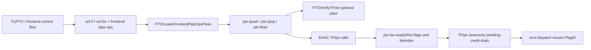
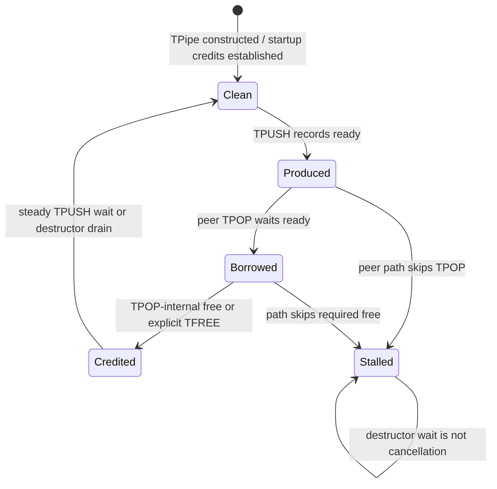

> 本文基于 PTOAS [`bdcb319d`](https://github.com/hw-native-sys/PTOAS/commit/bdcb319d6ad43fe4a562e8911e05aebca228b848) 与 pto-isa [`99ee5208`](https://github.com/hw-native-sys/pto-isa/commit/99ee520889019a883c7a58302548eb3b0af253a6)。代码与测试事实以这两个已合入 commit 为准；历史 PR、设计建议与硬件映射推断会明确标注。

## 本篇在 PTO 课程路线中的位置

课程 22 讲清了单条直线上的 `TALLOC/TPUSH → TPOP/TFREE` 借用协议。今天把问题推进到控制流：`if` 可能不执行，`for` 可能零次或多次执行，kernel 结束时析构还会等待残余 free credit。真正要证明的不再是“文本中出现过一次 `TFREE`”，而是：

> 对每条真实执行路径，生产者提交了多少 entry，消费者取得并归还了多少 entry；函数退出后，同一 flag 能否被下一次 dispatch 当成干净初态。

路线位置是：

```text
entry 的线性借用
  → path-sensitive credit balance（本篇）
  → 跨函数 peer verifier / cancellation protocol
```

## 前置知识

`TPipe` 用 ready flag 告诉消费者“数据可见”，用 free flag 告诉生产者“空间可复用”。为了减少同步，free credit 会按 `SyncPeriod` 批量通知；因此函数结束时可能存在“消费者已发出、生产者尚未等待”的残余 credit。课程 10 已说明析构 drain 用来清空这种残余状态，本篇进一步回答：它能清账，但能不能替不平衡路径兜底？

## 今日两个核心问题

1. `scf.if`、零次/多次 `scf.for` 下，什么样的 `TPUSH/TPOP/TFREE` 布局才天然配平？
2. `TPipe::~TPipe()` 是 cancellation/reset，还是只对**已经存在**的 free credit 做最终 acknowledgement？

## PTO 全栈中的位置



上游控制流决定某条 pipe op 是否动态执行；下游 `tileIndex` 与 flag 不认识 SSA branch，只看实际发生的 wait/record。若两个 peer function 对条件或 trip count 的解释不同，编译期文本仍可能合法，但设备会在 `TPOP`、稳态 `TPUSH` 或析构 drain 中等待一个永远不会到达的 flag。

## 概念和精确语义

### 1. 路径余额不是函数级调用次数

对同一方向、同一 dispatch 的动态路径 `π`，定义：

- `Pπ`：完成 `TPUSH`、发布 ready 的 logical entry 数；
- `Cπ`：成功 `TPOP` 的 entry 数；
- `Fπ`：消费者实际发出的 free-credit 数。

正常完成首先要求 `Pπ = Cπ`。free 采用批量协议时，不要求每个 entry 都产生一个物理 flag，但要求发送与等待遵守同一 `SyncPeriod` 状态机，退出时的 pending credit 能被精确 drain。

这说明三种控制流并不等价：

| 形态 | 动态效果 | 是否天然安全 |
| --- | --- | --- |
| `if cond { push }` 与 peer 的 `if cond { pop; free }` | false 路径双方增量均为 0 | 只有两端 `cond` 一致才安全 |
| `for 0..N { push }` 与 peer 同 trip count 的 `pop/free` | 零次路径双方为 0；每次迭代增量配平 | trip count 与 split/lane 解释一致时安全 |
| producer 无条件 push，consumer 条件 pop | 某些路径 `Pπ > Cπ` | 不安全；析构不能凭空制造 free |

### 2. `scf.if`：把完整 transaction 放进同一分支

真实样例 [`qk_pv_online_phase.pto`](https://github.com/hw-native-sys/PTOAS/blob/bdcb319d6ad43fe4a562e8911e05aebca228b848/test/samples/Qwen3_14BPrefillA3/kernels/qk_pv_online_phase.pto) 中，一个 `scf.if` 分支把 `tpop_from_aic` 与对应 `tfree_from_aic` 放在一起；未选中的分支既不借 entry，也不归还 entry。这种局部结构让 consumer 侧 branch delta 要么是完整的 `(pop=1, free=1)`，要么是 `(0,0)`。

但这仍没有证明 producer peer 采用同一个条件。PTOAS 的 peer component 能把两个函数配对、分配同一 payload/flag ABI，却没有对两个函数的 branch predicate 做等价性证明。

### 3. `scf.for`：需要“每迭代净变化为零”

[`DeepseekV4FlashDsparkA5/qk_pv.pto`](https://github.com/hw-native-sys/PTOAS/blob/bdcb319d6ad43fe4a562e8911e05aebca228b848/test/samples/DeepseekV4FlashDsparkA5/kernels/qk_pv.pto) 在外层 `scf.if` 内循环执行 `TPOP → compute → TFREE`。若 loop 零次执行，两个操作都不发生；若执行 `N` 次，每轮 consumer 借入并归还一个 entry。

因此 loop 的局部证明应是：

```text
balance_before_iteration == balance_after_iteration
```

而不只是“循环体文本里各有一个 pop/free”。如果 `TFREE` 只在内层条件的一侧，或 producer/consumer 的 `N` 不同，循环会把一次差额放大成 `N` 次。

## 真实文件、类型与 pass 逐段解读

### `PTOVerifyTFree` 的证明域仍是单 block

[`PTOVerifyTFreePass.cpp`](https://github.com/hw-native-sys/PTOAS/blob/bdcb319d6ad43fe4a562e8911e05aebca228b848/lib/PTO/Transforms/PTOVerifyTFreePass.cpp) 对每个 `TPopOp`：

1. 只在 **同一 block 后方**寻找相同 pipe handle 的第一个 `TFreeOp`；
2. 拒绝匹配点之前同 pipe 的第二个 outstanding pop；
3. 把 nested use 提升到 pop 所在 block 的顶层祖先，检查 borrowed entry 不越过 free。

所以它能接受“pop/free 同在某个 `if` branch block”或“同在 loop body block”的局部结构，却不会计算 then/else 合流余额，也不会比较 peer function 的动态次数。若 pop 在父 block、free 只在一个分支内，它反而找不到 matching free——这是保守限制，不是 path-sensitive 证明。

而且 [`ptoas_pipeline.cpp`](https://github.com/hw-native-sys/PTOAS/blob/bdcb319d6ad43fe4a562e8911e05aebca228b848/tools/ptoas/ptoas_pipeline.cpp) 仍未把该 pass 接入默认主链。代码搜索也没有找到直接运行 `--pto-verify-tfree` 的 lit；因此当前标准编译成功，不能推出控制流余额已被验证。

### A2/A3 析构：等“应当已经发出”的残余 credit

[`a2a3/TPush.hpp`](https://github.com/hw-native-sys/pto-isa/blob/99ee520889019a883c7a58302548eb3b0af253a6/include/pto/npu/a2a3/TPush.hpp) 的析构调用：

```text
drainCount = countPendingFreeCredits(prod.tileIndex)
repeat drainCount times: prod.allocate()
```

`prod.allocate()` 是 wait，不是 reset。`countPendingFreeCredits` 用 producer 的实际 `tileIndex` 计算：消费者按协议应发送的 credit 数，减去稳态 `TPUSH` 已等待的 credit 数。历史 [PR #240](https://github.com/hw-native-sys/pto-isa/pull/240) 修复了旧版“固定等待 `SyncPeriod` 次”的错误：后者会多等不存在的通知并造成 `running-stalled`。

这也给出反证：若 consumer 因另一条路径少执行了 pop/free，公式算出的 credit 并不存在，析构就会阻塞。析构是**对正常协议尾账的精确 barrier**，不是 cancellation。

### A5：初始 credit 与 drain 分两种协议

[`a5/TPush.hpp`](https://github.com/hw-native-sys/pto-isa/blob/99ee520889019a883c7a58302548eb3b0af253a6/include/pto/npu/a5/TPush.hpp) 区分 local no-split 与 GM/split：

- local no-split 使用启动窗口，析构按 `numPopFree - numPushWait` drain；
- GM/split 构造时 consumer 预发 `SyncPeriod` 个 free credit，析构时 producer 再等待同样数量，闭合本次对象生命周期。

[`a5/TFree.hpp`](https://github.com/hw-native-sys/pto-isa/blob/99ee520889019a883c7a58302548eb3b0af253a6/include/pto/npu/a5/TFree.hpp) 还显示 Tile/GlobalData 的 `TFREE_IMPL` 都可能真实发送 free。注意 [`docs/isa/system/ops/TPOP.md`](https://github.com/hw-native-sys/pto-isa/blob/99ee520889019a883c7a58302548eb3b0af253a6/docs/isa/system/ops/TPOP.md) 仍声称 A5 `TFREE_IMPL(pipe)` 是 no-op；这与当前头文件不一致，本文以代码为准，并把文档更新列为知识债。

## 对象与状态生命周期



`tileIndex` 属于本次 `TPipe` 对象；flag 是设备同步状态，会影响随后复用同一 `FlagID` 的对象。正常析构消费残余 credit 后，本地对象失效、flag 回到可复用基线。异常路径没有 epoch/generation，也没有公开的 `cancel/reset(pipe)`；所以不能把“C++ 作用域结束”当成设备协议自动回滚。

## 具体 credit 演算

取 A2/A3 C2V、`SlotNum=8`、`SyncPeriod=4`。

### 正常 6-entry 分支

producer 与 consumer 都执行 6 次：

| 项目 | 次数 |
| --- | ---: |
| ready / successful pop | 6 / 6 |
| consumer free notifications | `floor(6/4)=1` |
| steady producer waits | 0（尚未到 index 8） |
| destructor drain | 1 |

析构等待的一个 flag 确实已经存在，清账后下一 dispatch 可以复用该 ID。

若 producer 仍执行 6 次，而 consumer 的条件为 false、只执行 2 次，则 consumer 发出 0 个批量 free credit；producer 析构仍按自身 `tileIndex=6` 等待 1 次，最终 stall。把析构改成“不等待”也不正确：它会把迟到或残留 flag 留给下一 dispatch，制造跨请求串扰。

### 40-entry 回归

[A2/A3 `tpushpop_cv_nosplit`](https://github.com/hw-native-sys/pto-isa/blob/99ee520889019a883c7a58302548eb3b0af253a6/tests/npu/a2a3/src/st/testcase/tpushpop_cv_nosplit/tpushpop_cv_nosplit_kernel.cpp) 固定验证：

```text
free notifications = 40 / 4 = 10
steady waits       = indices 8,12,...,36 = 8
pending drain      = 10 - 8 = 2
```

对应 [`main.cpp`](https://github.com/hw-native-sys/pto-isa/blob/99ee520889019a883c7a58302548eb3b0af253a6/tests/npu/a2a3/src/st/testcase/tpushpop_cv_nosplit/main.cpp) 连续 dispatch 80 次，专门检测 stale credit 或过量等待。这证明正常完成路径的跨 dispatch drain；它没有故障注入不对称 branch。

## 为什么这样设计及替代方案

### 当前方案：显式 transaction + 精确 drain

优点是运行时状态小、同步稀疏、正常路径开销可预测，析构只清理已经由协议产生的 credit。代价是跨核两端必须共享控制流契约；一处漏 pop/free 可能表现为设备永久等待，而不是可诊断异常。

### 替代一：component-level path verifier

最小充分的静态方案不是把 `TFREE` 自动插到函数尾，而是对每个 peer component 做数据流分析：

- branch 合流要求所有 successor 的 `(push,pop,free)` delta 相同；
- loop 要求每次迭代净余额为零，或显式把协议状态作为 loop-carried state；
- 每个 `func.return` 要求本地 borrow 归零；
- producer/consumer 的符号计数与 predicate provenance 必须可证明一致，否则 fail closed。

它提高正确性和诊断性，但跨函数 predicate 等价、动态 trip count 与 split lane 会增加编译器维护成本。

### 替代二：运行时 cancel/reset

一个真正的 cancel 需要先让所有 producer/consumer 停止，再用 generation/epoch 区分旧 ready/free 与新 dispatch，最后安全回收 backing buffer。只“清 flag”可能把仍在飞行的 payload 当成新数据；因此没有 quiescence 证明时，reset 比 stall 更危险。当前公开代码没有这套协议。

## 访存、流水、并行和硬件约束

- credit batching 减少跨核同步，但把错误检测推迟到 ring wrap 或析构；小测试可能输出正确，连续 dispatch 才卡死。
- branch 两端一致时，跳过整个 transaction 可减少无效搬运；条件不一致时，吞吐优化直接变成协议错误。
- loop 内完整 `pop/use/free` 缩短 borrow 区间，有利于 ring 复用；把 free 提到异步读完成前仍会形成 read-after-reuse。
- 析构中的 wait 是设备同步工作，会进入尾延迟；但删除它会破坏 flag reuse 正确性。优化方向应是减少残余 credit 或证明可复用，而不是无条件省略 drain。
- 公开源码能证明 index、flag 和 wait/record 关系；超时、硬件强制取消以及 flag 物理存储细节未公开，本文不推断周期级实现。

## 测试证据与未覆盖风险

当前证据分三层：

1. **PTOAS 真实样例**：`qk_pv_online_phase` 与 `DeepseekV4FlashDsparkA5/qk_pv` 展示 branch/loop 内完整 pop/free 的生成形态，但不是 lifecycle negative test。
2. **PTOAS lit**：[`issue564_k_loop_mte1_mte2_wait_regression.pto`](https://github.com/hw-native-sys/PTOAS/blob/bdcb319d6ad43fe4a562e8911e05aebca228b848/test/lit/pto/issue564_k_loop_mte1_mte2_wait_regression.pto) 覆盖嵌套控制流的 InsertSync set/wait 回归；它验证 event topology，不验证 peer credit balance。
3. **pto-isa 设备回归**：depth 8、40 transfers、80 dispatch 证明 A2/A3 正常路径 drain=2，历史 PR 还报告过真机 stall 修复；没有覆盖 consumer 少一次、branch predicate 不同、loop trip count 不同。

仍未覆盖：

- `PTOVerifyTFree` 的 direct lit 与默认 pipeline policy；
- then/else、zero-trip、dynamic trip 的 component-level exact balance；
- producer/consumer 跨函数 predicate/trip-count 等价；
- early return、设备 fault 或 host cancel 后的 bounded recovery；
- A5 GM/split 与 local no-split 的连续 dispatch 故障矩阵；
- `DIR_BOTH` 一侧提前停止时，四个 flag ID 是否全部回到基线；
- stale `TPOP.md` 与 A5 `TFree.hpp` 的文档一致性。

## 与前后章节的连接

课程 21 解释 flag ID 如何分配，课程 22 解释一个 entry 何时借出与归还，本章把它们合成“路径上的信用守恒”。下一章将沿最重要的缺口继续：设计一个 component-level abstract state，讨论 branch merge、loop summary、cross-function predicate provenance 与 diagnostic，明确哪些情况必须拒绝而不能猜测。

## 本篇结论、知识债与理解检查

结论：

1. 安全条件是每条动态路径和两个 peer 的 entry/credit 余额一致，不是源文件里的静态调用次数相同。
2. `if` 跳过完整 transaction、loop 每轮净余额为零，是最容易证明的结构；不对称条件会在 wait 或析构处暴露。
3. 析构只消费按协议已产生的 pending free credit；它不创建 credit、不回滚 payload，也不是 cancellation。
4. 当前 `PTOVerifyTFree` 仍是可选、单-block、单 outstanding 的局部检查；跨函数、分支合流和循环计数尚无统一证明。

最高知识债：component-level path analysis、跨 peer predicate/trip-count 证明、A5/DIR_BOTH 故障注入、early-exit recovery，以及 A5 `TFREE` 文档修正。

理解检查：

1. 为什么 producer/consumer 都在各自函数中写了一个 `if`，仍不能仅凭语法证明安全？
2. `SlotNum=8, SyncPeriod=4, transfers=6` 时为什么析构要等 1 个 credit；consumer 只处理 2 个时又为什么必然卡住？
3. 若新增 `resetFlag()`，为什么必须先证明没有 in-flight payload，不能把它当作普通异常清理？

下一章：**TPipe component-level balance verifier——branch merge、loop summary 与跨函数 predicate provenance。**

## 课程账本增量

- PTOAS 基线：`bdcb319d6ad43fe4a562e8911e05aebca228b848`
- pto-isa 基线：`99ee520889019a883c7a58302548eb3b0af253a6`
- 新覆盖：`scf.if/scf.for` 中的 pipe transaction、`countPendingFreeCredits`、A2/A3 与 A5 `TPipe` constructor/destructor credit protocol、PR #240 连续 dispatch 回归
- 新不变量：析构 drain 只能消费已产生 credit；branch 两端需相同 transaction delta；loop 每迭代余额应归零；下一 dispatch 安全依赖前一 dispatch 的 flag baseline
- 待验证推断：component-level path verifier 可以用 branch merge equality 与 zero-net loop summary 保守覆盖大多数结构化控制流
- 下一章：跨函数 path-sensitive balance verifier 的最小状态与 fail-closed 策略
