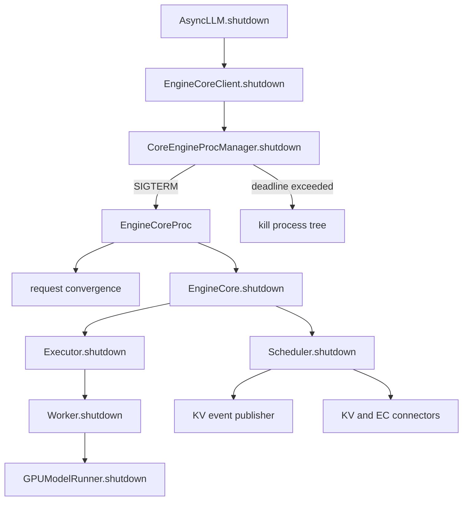

> 源码基线：[`80389cfe`](https://github.com/vllm-project/vllm/commit/80389cfedd5040e382d64a64b1782f66de1a38bf)，本文只描述该提交已经合入的行为。PR 的设计意图会单独标注，不把它当成当前代码事实。

## 本篇在课程路线中的位置

第 22 章把 fatal 正确性拆成故障检测、请求收敛、进程收敛、逻辑资源收敛和设备资源收敛五层，并发现“请求都报错了”不能证明资源已经归零。本篇继续追问一个更基础的问题：资源究竟归谁释放？

位置是：

`fatal-path evidence → shutdown ownership → owner-specific resource census`

只讨论 V1 Python EngineCore 主链，不展开 Rust frontend、Ray actor 和每一种第三方 KV Connector 的内部实现。

## 前置知识回顾

正常请求完成时，`Scheduler._free_request()` 会先通知 KV/EC Connector，再释放 encoder cache，最后立即或延迟归还 KV blocks。fatal failure 则把 Engine 置为 fail-stop；此时不能假设每个正常完成回调都跑过。

因此 shutdown 至少要回答三份互不等价的证明：

1. 请求不再产生新状态；
2. 各资源 owner 获得关闭机会；
3. owner 卡死时，外层仍能终止整个进程树。

## 本篇要回答的核心问题

1. `AsyncLLM.shutdown()` 到 GPU memory 回收的真实调用链是什么？
2. Scheduler、Executor、Worker 和 ModelRunner 各自只释放什么，谁也不能代替谁？
3. `--shutdown-timeout` 到期后得到的是资源 acknowledgement，还是仅得到进程退出？

## 组件在全局架构中的位置



这里存在两个控制面：EngineCore 内部按 owner 顺序清理；进程管理器在外部持有 deadline 和强制终止权。后者不是某个缓存的 owner，却是整个进程树的最终 liveness owner。

## 完整调用链

公开入口 [`AsyncLLM.shutdown()`](https://github.com/vllm-project/vllm/blob/80389cfedd5040e382d64a64b1782f66de1a38bf/vllm/v1/engine/async_llm.py#L259-L275) 依次关闭 Prometheus、Renderer、EngineCore client，最后取消 `output_handler`。把 output handler 放在 EngineCore shutdown 之后，允许它在 Core 收敛期间继续消费 abort/terminal outputs。

多进程模式下，[`MPClient.shutdown()`](https://github.com/vllm-project/vllm/blob/80389cfedd5040e382d64a64b1782f66de1a38bf/vllm/v1/engine/core_client.py#L685-L696) detach finalizer，只执行一次 `engine_manager.shutdown(timeout)`，然后关闭 IPC 背景资源。进程管理器调用通用 [`shutdown(processes, timeout)`](https://github.com/vllm-project/vllm/blob/80389cfedd5040e382d64a64b1782f66de1a38bf/vllm/v1/utils.py#L596-L652)：先发 SIGTERM，共享一个绝对 deadline 等待全部 EngineCore；仍存活的进程由 `kill_process_tree` 强制终止。

EngineCore 的 signal handler只把状态从 `RUNNING` 改为 `REQUESTED`，并投递 `WAKEUP` 唤醒空闲循环。真正的 [`_handle_shutdown()`](https://github.com/vllm-project/vllm/blob/80389cfedd5040e382d64a64b1782f66de1a38bf/vllm/v1/engine/core.py#L1492-L1538) 在主循环线程执行：

- `shutdown_timeout == 0`：调用 `Scheduler.finish_requests(None, FINISHED_ABORTED)`，拒绝新 ADD，再等待剩余 work 消失；
- `shutdown_timeout > 0`：停止 admission，但继续执行已有请求；
- `has_work() == False`：退出 busy loop。

注意：EngineCore 自己没有启动倒计时器。deadline 由父进程管理器执行；到期后 EngineCore 可能在任意清理阶段被杀死。

`run_engine_core()` 的 `finally` 无论正常退出还是 Python exception 都调用 [`EngineCore.shutdown()`](https://github.com/vllm-project/vllm/blob/80389cfedd5040e382d64a64b1782f66de1a38bf/vllm/v1/engine/core.py#L764-L780)。其顺序是：

```text
structured output backend
→ model_executor.shutdown()
→ scheduler.shutdown()
→ distributed environment / cached memory
```

## 关键类型、字段和状态生命周期

### 请求与 KV block

立即关闭不是直接丢弃 `Scheduler.requests`。[`finish_requests()`](https://github.com/vllm-project/vllm/blob/80389cfedd5040e382d64a64b1782f66de1a38bf/vllm/v1/core/sched/scheduler.py#L2425-L2486) 先从 waiting/running 队列批量移除请求，再逐个调用 `_free_request()`：通知 Connector、释放 encoder cache，并根据 device fence 决定立刻归还或延迟归还 KV blocks。

`Scheduler.has_requests()` 还会把“已 finish 但等待 Connector cleanup 的请求”和 `has_pending_push_work()` 计入 work，因此 clean exit 可以继续给异步传输完成机会。

### Worker 与设备对象

UniProc Executor 直接调用 `worker.shutdown()`；Multiproc Executor 则关闭每个 worker 的 death pipe。子进程收到 EOF 后关闭消息队列，使 busy loop 退出，并在 `finally` 调用自己的 [`WorkerProc.shutdown()`](https://github.com/vllm-project/vllm/blob/80389cfedd5040e382d64a64b1782f66de1a38bf/vllm/v1/executor/multiproc_executor.py#L816-L825)。

GPU Worker 依次关闭 KV/EC transfer group、profiler、weight transfer、elastic EP，再调用 ModelRunner。[`GPUModelRunner.shutdown()`](https://github.com/vllm-project/vllm/blob/80389cfedd5040e382d64a64b1782f66de1a38bf/vllm/v1/worker/gpu/model_runner.py#L2050-L2079) 先同步 accelerator，然后解除 CUDA Graph、KV cache、attention group、workspace、model weights 的 Python/框架引用，最后 `gc.collect()` 与 `empty_cache()`。

这些接口没有输入 Tensor，也没有 shape/dtype 输出；它们操作的是 owner 已持有的 host 对象和 device tensors。前置条件是进程仍可执行 Python/CUDA runtime；后置条件是引用已释放到 allocator 可回收状态，而不是物理显存一定立刻归零。

## 逐函数源码解读

### `EngineCore.shutdown()`：编排者，不是所有资源的 owner

它不遍历 Scheduler request registry，也不直接清 KV tensor。它只把关闭请求交给 Executor 与 Scheduler，然后销毁当前进程的 distributed state。这样的边界避免 EngineCore 知道每个 backend 的内部资源。

### `Executor.shutdown()`：backend 分叉点

抽象基类默认用 `collective_rpc("shutdown")`，但具体 backend 可以改变协议：UniProc 是普通函数调用；Multiproc 不广播 shutdown RPC，而是关闭 death pipe并等待 worker 自行退出。若 worker 超过 `VLLM_WORKER_SHUTDOWN_TIMEOUT_SECONDS`，父进程升级为 SIGTERM，再等待 4 秒，最终 SIGKILL。

因此“Worker shutdown 被调用”只在 graceful path 上成立；SIGKILL 路径只能依赖 OS/driver 回收进程资源。

### `Scheduler.shutdown()`：关闭服务对象，不清空全部逻辑状态

当前实现只关闭 KV event publisher、KV Connector 和 EC Connector。`KVCacheManager` 没有在此处收到统一 `shutdown()`，`requests` 也没有被强制清空。正常路径依赖之前的 `finish_requests()`；残余 Python 对象最终随 EngineCore 进程退出释放。

这正是第 22 章“进程退出不等于证明 F4”的根因：最终结果通常安全，但没有 owner-specific 的逻辑余额证据。

## 具体示例与状态演算

假设 TP=2，Scheduler 中有：

- 请求 A：RUNNING，占 3 个 KV blocks，最新 GPU step 尚未提交；
- 请求 B：WAITING，尚未分配 block；
- A 的 Connector save 仍在后台执行。

收到 SIGTERM 且 `shutdown_timeout=0`：

| 阶段 | A | B | KV free blocks | Connector | 进程状态 |
| --- | --- | --- | --- | --- | --- |
| 初始 | RUNNING | WAITING | 少 3 | save pending | RUNNING |
| `finish_requests` | FINISHED_ABORTED | FINISHED_ABORTED | 仍少 3 | finish hook | SHUTTING_DOWN |
| GPU fence 返回 | registry 可删除 | 已删除 | 归还可安全 blocks | 可能仍 pending | SHUTTING_DOWN |
| transfer 完成 | 已删除 | 已删除 | 恢复逻辑余额 | drained | SHUTTING_DOWN |
| `has_work=False` | — | — | — | — | 开始 teardown |
| 两个 Worker exit | — | — | device refs 清理 | worker side closed | EngineCore exit |

`finish_requests` 后不能立刻归还 A 的 3 个 blocks，因为尚未完成的 GPU step 可能继续写这些物理地址。[`test_abort_mid_prefill_defers_free`](https://github.com/vllm-project/vllm/blob/80389cfedd5040e382d64a64b1782f66de1a38bf/tests/v1/core/test_deferred_block_free.py#L344-L378) 直接验证了这一 fence 不变量。

如果外层 deadline 先到，表格后半段不会获得逐项确认：进程树被杀，device context 最终由 runtime/driver 回收，但 A 的正常 Connector completion callback 可能从未执行。

## 为什么这样设计及替代方案

当前设计把释放职责放在最了解资源的 owner 中，把最终终止权放在进程管理器中。优点是 backend 可扩展、fatal path 有上界，而且 SIGKILL 能处理 Python deadlock、NCCL hang 之外仍可被 OS 终止的情形。代价是进程退出成为粗粒度 barrier，不能回答哪个逻辑资源完成了最后一次释放。

更强的替代设计是结构化 shutdown transaction：每个 owner 返回 `drained/abandoned/failed` 与有限的资源 census，EngineCore 聚合后再发 teardown acknowledgement。它能让测试精确断言 KV blocks、Connector refs、Worker tasks 和 graph pools，但增加协议版本、超时组合和 backend 维护成本；对已经 fail-stop 的 Engine，不应为了等待 acknowledgement 而取消外层 kill deadline。

最小可行增强不是让 EngineCore亲自释放所有对象，而是保留 owner 边界，同时增加可选、有限、无阻塞的关闭摘要。

## 性能、并发、正确性与边界条件

- `shutdown_timeout>0` 提升已接收请求的完成率，但会继续占用 GPU、KV 和 Connector 资源；它是可用性策略，不是资源释放保证。
- ModelRunner 在删除 tensors 前同步 accelerator，避免 device work 仍引用待释放内存；代价是关闭延迟可能被长 kernel 或 hang 放大。
- 多个 EngineCore process 共用一个绝对 deadline，避免每个 rank 重新获得完整 timeout，导致总关闭时间随 rank 数线性增长。
- ROCm 在“请求立即 abort 且外层 timeout 也为 0”时额外给 EngineCore 15 秒清理窗口，代码注释明确指出强杀可能留下驻留 VRAM；这是平台特例，不应外推为 CUDA 保证。
- SIGKILL、native crash、driver hang 都可能跳过 Python `finally`。任何需要持久化的状态都不能只依赖 `shutdown()`。

## 测试证据与未覆盖风险

当前直接证据包括：

- [`test_engine_core_process_shutdown_timeout`](https://github.com/vllm-project/vllm/blob/80389cfedd5040e382d64a64b1782f66de1a38bf/tests/v1/engine/test_startup_watch_processes.py#L26-L66) 验证 EngineCore manager 的 timeout 选择与二次 shutdown 幂等；
- [`test_multiproc_executor_worker_termination_timeout`](https://github.com/vllm-project/vllm/blob/80389cfedd5040e382d64a64b1782f66de1a38bf/tests/v1/executor/test_executor.py#L72-L89) 用 fake clock 验证 worker 在 grace 内退出时不 terminate，超时则升级；
- deferred-free 测试验证 abort 不能越过 device fence 复用 KV blocks；
- 合入设计 [PR #36666](https://github.com/vllm-project/vllm/pull/36666) 说明 shutdown state machine 的目标和边界；[PR #43154](https://github.com/vllm-project/vllm/pull/43154) 解释 Worker cleanup grace 的 profiler/ROCm 动机。

仍缺一条真实 MP E2E 同时断言：两请求 terminal、Scheduler registry 清空、block pool 回到基线、Connector ref 为零、两个 Worker graceful exit、device memory 回落。现有单元测试还没有证明 Executor、Scheduler 任一步骤抛异常时，后续 owner 仍在 `finally` 中获得关闭机会；`EngineCore.shutdown()` 当前也没有逐阶段 `try/finally` 隔离。

## 与前后章节的连接

第 22 章说明现有 fatal tests 能证明 F1–F3，却普遍缺 F4–F5。本篇找到了原因：最后的成功屏障是进程退出，而非资源 census。下一章应把这条 owner 链转成可执行的故障注入矩阵，尤其检查某个 owner shutdown 抛异常时是否阻断后续 owner。

## 本篇结论、知识债、三个理解检查问题和下一章

结论：vLLM shutdown 不是一个函数，而是分层 ownership protocol。Scheduler 负责请求和逻辑缓存收敛，Worker/ModelRunner 负责设备侧对象，Connector 负责自己的异步任务，进程管理器负责 deadline 与强制终止。正常关闭尽量逐项释放；fatal 兜底只保证进程最终消失，不能反推每个 cleanup callback 都执行。

知识债：owner-specific census、shutdown 阶段异常隔离、跨 backend acknowledgement parity、真实 Connector pending transfer E2E，以及 SIGTERM→SIGKILL 期间 GPU/NCCL progress 的可观测性。

理解检查：

1. 为什么 `Scheduler.finish_requests()` 不能在 GPU step 未完成时立即复用全部 KV blocks？
2. Multiproc Executor 为什么不需要通过正常 RPC 命令 Worker shutdown？
3. 为什么“进程 exit code=0”仍不足以证明 Connector refs 和 block pool 精确归零？

下一章：**Shutdown 故障注入——Executor、Scheduler、Connector 任一 cleanup 抛异常时，后续 owner 是否还能执行，以及怎样建立 bounded acknowledgement。**

## 课程账本增量

- 新增调用链：`AsyncLLM.shutdown → MPClient → CoreEngineProcManager → EngineCore state machine → Executor/Worker/ModelRunner → Scheduler/Connector → process exit`。
- 新增不变量：资源由最内层 owner 释放；外层只编排与设置 deadline；force-kill 是 liveness 兜底，不是逻辑 cleanup 证明。
- 新增文件：`async_llm.py`、`core_client.py`、`engine/utils.py`、`core.py`、`scheduler.py`、`multiproc_executor.py`、`gpu_worker.py`、`gpu/model_runner.py`、`v1/utils.py`。
- 源码基线：[`80389cfe`](https://github.com/vllm-project/vllm/commit/80389cfedd5040e382d64a64b1782f66de1a38bf)。
