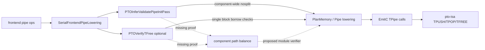
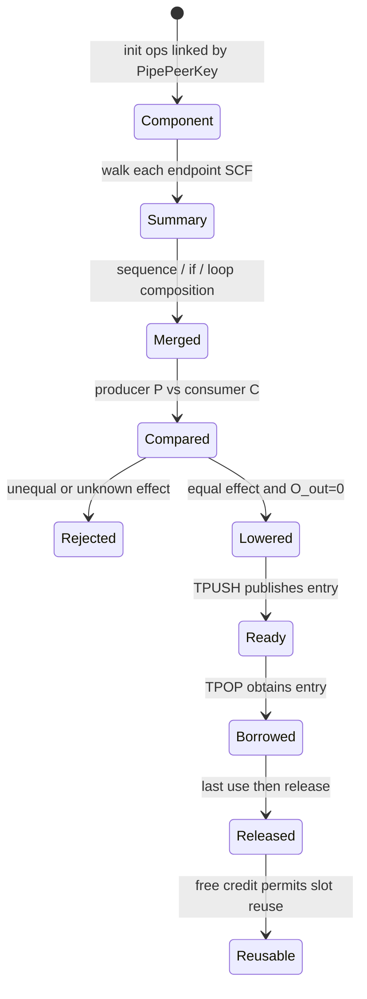

> 本文基于 PTOAS [`bdcb319d`](https://github.com/hw-native-sys/PTOAS/commit/bdcb319d6ad43fe4a562e8911e05aebca228b848) 与 pto-isa [`f7f4e64a`](https://github.com/hw-native-sys/pto-isa/commit/f7f4e64a910aaf9673fcd5e3c5bd8389afa6ebbc)。前者截至本次分析仍是 PTOAS 默认分支最新提交；后者是 pto-isa 默认分支最新提交。文中严格区分已合入代码、测试事实与本文提出的 verifier 设计。

## 本篇在 PTO 课程路线中的位置

课程 21 建立了跨函数 pipe identity，课程 22 解释了 entry 的线性借用，课程 23 又证明析构只 drain 已产生的 free credit，不能修复 producer/consumer 的路径失配。今天补上 compiler proof 的中间空层：

```text
PipePeerKey / component
  → 每个 endpoint 的控制流效应摘要
  → 跨 endpoint 的 push/pop 等价证明
  → backend TPipe / ready-free flags
```

本篇不是宣布新 verifier 已经落地，而是回答：**现有两个 pass 分别证明了什么？为什么它们之间仍有一条跨函数死锁通道？一个最小 verifier 至少需要哪些状态和拒绝规则？**

## 前置知识

一个 C2V entry 的正常生命周期是：

```text
Cube TPUSH 发布 ready
→ Vector TPOP 等待并取得 entry
→ Vector 完成最后一次读取
→ TFREE 或 TPOP 内部路径归还 free credit
→ producer 允许复用 slot
```

`split/nosplit`、`slot_size` 和 `direction` 是静态 ABI；实际执行了多少次 transaction，则由 `scf.if/scf.for` 的动态路径决定。静态类型一致，不等于动态次数一致。

## 今日核心问题

1. `PTOInferValidatePipeInitPass` 已经找到 peer component，为什么仍不能证明跨函数余额？
2. `PTOVerifyTFree` 已经要求 `TPOP` 后有 `TFREE`，为什么不对称 branch 仍可能通过？
3. 不引入昂贵全程序定理证明器时，怎样用保守的 effect summary 把最危险的错误挡在 EmitC 之前？

## PTO 全栈中的位置



代码事实：默认 [`ptoas_pipeline.cpp`](https://github.com/hw-native-sys/PTOAS/blob/bdcb319d6ad43fe4a562e8911e05aebca228b848/tools/ptoas/ptoas_pipeline.cpp) 会运行 `createPTOInferValidatePipeInitPass()`，但没有接入 `createPTOVerifyTFreePass()`。即便手动启用后者，它仍是 `func::FuncOp` pass；跨函数 component 余额天然不在它的观察域内。

## 概念和精确语义

### 1. 要证明的是动态 transaction 守恒

对一个 logical component、一个 direction 和一条 dispatch 路径 `π`，定义：

- `Pπ`：producer 完成的 logical `TPUSH` 数；
- `Cπ`：consumer 完成的 logical `TPOP` 数；
- `Rπ`：consumer 完成的 release 数；
- `Oπ`：函数出口仍被 consumer 持有的 entry 数。

正常终态至少需要：

[
P_pi=C_pi,qquad C_pi=R_pi,qquad O_pi=0
]

A2/A3 TileData 的 `TFREE` 是 API no-op，并不删除第二个等式；只是 release 动作折叠在 `TPOP` 内。GlobalData 与 A5 TileData 则有显式 release 边界。最新 [TPUSH 文档](https://github.com/hw-native-sys/pto-isa/blob/f7f4e64a910aaf9673fcd5e3c5bd8389afa6ebbc/docs/isa/TPUSH_zh.md)、[TPOP 文档](https://github.com/hw-native-sys/pto-isa/blob/f7f4e64a910aaf9673fcd5e3c5bd8389afa6ebbc/docs/isa/TPOP_zh.md) 和 [TFREE 文档](https://github.com/hw-native-sys/pto-isa/blob/f7f4e64a910aaf9673fcd5e3c5bd8389afa6ebbc/docs/isa/TFREE_zh.md) 已明确区分这两类所有权路径。

### 2. effect 不能只是一组总计数

只存 `(P,C,R)` 仍不够。以下序列总数相同，却会先等待不存在的 ready：

```text
consumer: TPOP, TFREE
producer: TPUSH
```

跨核并发允许 consumer 先等待，最终 producer 会唤醒它，所以这段本身并非错误；但对**同一 endpoint 内的借用安全**，还需追踪 `O` 的前缀最小值与峰值，拒绝额外 free、use-after-free 或超出所支持 outstanding 模型的路径。跨 endpoint 的关键则是所有出口的总 transaction 等价，而不是强迫源码顺序一致。

因此可用摘要：

[
E=(P,C,R,O_{out},O_{min},O_{max})
]

序列组合时相加 transaction，并把第二段的 outstanding 区间按第一段出口平移。它比“看到一对 op”更接近真实 FIFO 状态，却仍是有限数据流域。

## 真实文件、类型、API 或指令逐段解读

### 1. Component 已经存在，但只服务于 `nosplit`

[`PTOInferValidatePipeInitPass.cpp`](https://github.com/hw-native-sys/PTOAS/blob/bdcb319d6ad43fe4a562e8911e05aebca228b848/lib/PTO/Transforms/PTOInferValidatePipeInitPass.cpp) 为 local pipe 建立 `PipePeerKey {ownerFunc, reserveName, dirMask}`，为 GlobalTensor pipe 使用 frontend id 与有效 direction。相同 key 形成边，DFS 得到 connected component。

随后 `resolveNoSplitComponent` 检查：

- 单个 init 是否同时出现 `split=0` 与非零 split；
- peer 是否对 `nosplit` 有冲突的显式或推断值；
- 缺省时怎样统一写回 `nosplit` attribute。

关键边界是：component 只活在 pass 内；写回 IR 的主要是 `nosplit`，没有持久化 component identity，也没有计算 `TPUSH/TPOP/TFREE` 的控制流效应。课程 21 的 peer graph 已经找到了“谁和谁通信”，但没有回答“各自通信多少次”。

### 2. `PTOVerifyTFree` 是 block-local borrow checker

[`PTOVerifyTFreePass.cpp`](https://github.com/hw-native-sys/PTOAS/blob/bdcb319d6ad43fe4a562e8911e05aebca228b848/lib/PTO/Transforms/PTOVerifyTFreePass.cpp) 对每个 `TPOP`：

1. 从同一 block 的后续 op 中找相同 pipe handle 的第一个 `TFREE`；
2. 在二者之间递归查找同 pipe 的第二个 `TPOP`，拒绝多 outstanding；
3. 把 nested use 提升到 parent block，确认 borrowed tile 的最后使用不晚于 `TFREE`。

这能拒绝 missing free、当前模型不支持的重叠 borrow 和明显 use-after-free；但它既不枚举 CFG 的所有出口，也不查看 producer function，更不比较 branch predicate 与 loop trip count。

[`Passes.td`](https://github.com/hw-native-sys/PTOAS/blob/bdcb319d6ad43fe4a562e8911e05aebca228b848/include/PTO/Transforms/Passes.td) 也把两者定义为不同粒度：前者是 `ModuleOp` pass，后者是 function pass。问题不是少写一条 if，而是分析域不同。

### 3. 最小实现应共享 component analysis

本文建议抽取 `PipeComponentAnalysis`，让 nosplit resolver、ReserveBuffer/flag resolver 与 balance verifier 共用同一 identity 结果。否则多个 pass 各自复制 `PipePeerKey`，未来 GlobalTensor、`DIR_BOTH` 或 import 规则变化时很容易产生“两个 pass 认出的 component 不同”的漂移。

这是**设计建议**，不是当前代码事实。

## 对象/Tile/Buffer/IR 生命周期

以一个 `Tile<16×16×f32>` 为例，语义 payload 为 1024 B。设 C2V `SlotSize=1024`、`SlotNum=8`、`split=0`：



compiler 侧的 component 与 effect summary 只在编译期间存在；runtime 侧的 payload 从 ready 到 release 独占一个 FIFO slot。二者的连接点是：静态证明保证进入 runtime 的每条可达路径不会凭空少掉 peer transaction。

## 端到端调用链或指令链

真实链条是：

```text
aic/aiv_initialize_pipe + frontend id
→ SerialFrontendPipeLowering 生成 pto.initialize_l2l_pipe 与 pipe handle
→ PTOInferValidatePipeInitPass 通过 reserve/import key 连接 peer
→ LoweringSyncToPipe / PlanMemory / ResolveReservedBuffers
→ EmitC 生成同一 TPipe<flag,direction,slot,...>
→ Cube TPUSH
→ Vector TPOP → compute → TFREE
→ pto-isa ready/free flag 与 ring index 推进
```

拟议 verifier 应位于 frontend lowering 与 component 形成之后、PlanMemory/EmitC 破坏高层 control-flow provenance 之前。若它晚到只剩 C++ 文本，就会重演课程 14 的脆弱 parser 问题。

## 具体 shape、Tile 和状态演算

考虑如下简化 IR：

```text
cube_kernel:
  for i = 0..4:
    TPUSH(pipe, acc16x16f32, split=0)

vector_kernel(enabled):
  if enabled:
    for i = 0..4:
      tile = TPOP(pipe, split=0)
      use(tile)
      TFREE(pipe, split=0)
  else:
    do nothing
```

两端 shape/dtype/location 合法：producer 是 `Acc 16×16×f32`，consumer 是 `Vec 16×16×f32`；一个完整 entry 为 `16×16×4=1024 B`，8 slots 占 8192 B transport capacity。所有 data op 都是 `split=0`，所以现有 component pass 可推得一致的 `nosplit=true`。

消费者 true branch 内每个 `TPOP` 后都有同 block `TFREE`，因此手动启用局部 verifier 也看不到 producer 数量问题。

effect 演算：

| endpoint/path | P | C | R | Oout |
| --- | ---: | ---: | ---: | ---: |
| cube loop，固定 4 次 | 4 | 0 | 0 | 0 |
| vector，enabled=true | 0 | 4 | 4 | 0 |
| vector，enabled=false | 0 | 0 | 0 | 0 |

- `enabled=true`：跨端 `P=C=4`，consumer 借用归零；
- `enabled=false`：`P=4,C=0`，四个 ready entry 无消费者。

由于 4 小于 `SlotNum=8`，producer 主循环未必立刻因 ring wrap 阻塞；但 A2/A3 的正常退出 drain 会按已生产数量等待应当由 consumer 产生的 free credit。缺失 consumer 不是“少处理一点数据”，而是协议终态不存在。具体阻塞点依 target/protocol 而异；**余额不成立**才是架构层事实。

最小 branch 规则应把 vector 的两个出口摘要 `(C,R)=(4,4)` 与 `(0,0)` 判为不相等。由于 producer 是无条件 4 次，直接拒绝，无需理解 `enabled` 的业务含义。

## 为什么这样设计及替代方案

### 保守 MVP：不同 branch effect 直接拒绝

优点是确定、诊断清晰、编译成本线性。规则可以是：

- sequence：组合摘要；
- `scf.if`：所有 successor 的 effect 必须相等；
- `scf.for`：body 的本地借用净额必须为零；constant trip count 直接乘；
- return：`Oout=0`；
- component：producer `P` 与 consumer `C` 的符号表达式必须相等。

它会拒绝一部分其实安全的代码，例如两端使用同一 `enabled` 同步跳过 transaction。下一阶段可引入 predicate provenance：只有能证明两个 endpoint 的 predicate 来自同一 dispatch 参数、经过等价变换，才允许不等 branch effect 成为同一个分段函数。

### 替代一：只增强 `PTOVerifyTFree`

维护成本低，但 function pass 看不到 peer，无法证明 `P=C`。它适合继续承担借用局部正确性，不应承担 component 守恒。

### 替代二：编译器自动补 `TPUSH/TPOP/TFREE`

不可取。补一个 `TFREE` 可能提前释放仍在读取的数据；补一个 `TPOP` 会消费不存在或不该消费的 payload。compiler 不掌握业务 payload 和取消语义，不能靠“凑数”修复协议。

### 替代三：runtime timeout/reset

watchdog 能把永久 hang 变成报错，却不能判定迟到 ready/free 属于旧 dispatch 还是新 dispatch。安全 reset 需要 quiescence、generation/epoch 与 backing ownership 回收；它是静态 verifier 的补充，不是替代品。

### 替代四：一开始就做 SMT predicate equivalence

表达力最强，但编译时、诊断稳定性与维护成本都高。先覆盖 constant trip count、同构 SCF 与显式共享参数，能拦住最常见错误并留下清晰升级路径。

## 访存、计算、流水、并行和硬件约束

balance verifier 不改变 payload 访存量，也不插 barrier；它的性能价值是让错误在编译期失败，而不是占住 Cube/Vector 核和 flag 资源后才 hang。摘要按 operation/SCF region 传播，状态规模约为“pipe component 数 × control-flow 节点数”。

严格 fail-closed 会限制某些数据依赖的可变流水深度。若未来要支持 producer/consumer 以不同 chunk 组合但总量相等，summary 可保留 affine symbolic count，而不是要求每个 loop 逐字同构。无论如何，`SlotNum` 只提供有限弹性，不会把长期 count mismatch 变成合法程序。

硬件细节边界：公开代码足以证明 ready/free 协议和等待条件；具体某个 target 在 mismatch 时首先卡在第几条指令，需要设备 trace，本文不作臆测。

## 测试证据与未覆盖风险

当前直接测试能够证明：

- [mixed split A5 negative lit](https://github.com/hw-native-sys/PTOAS/blob/bdcb319d6ad43fe4a562e8911e05aebca228b848/test/lit/pto/tpush_tpop_frontend_mixed_split_a5.pto) 用 producer `split=1`、consumer `split=0`，验证 peer component 会报 `conflicting pipe split usage`；
- [GlobalTensor nosplit conflict](https://github.com/hw-native-sys/PTOAS/blob/bdcb319d6ad43fe4a562e8911e05aebca228b848/test/lit/pto/tpush_tpop_globaltensor_nosplit_conflict_invalid.pto) 验证 global-only pipe 的两端也不能对完整 entry/split entry 有冲突解释；
- [GlobalTensor loop nosplit A3](https://github.com/hw-native-sys/PTOAS/blob/bdcb319d6ad43fe4a562e8911e05aebca228b848/test/lit/pto/tpush_tpop_globaltensor_loop_nosplit_a3.pto) 以 `[4,128,128]xf32`、`slot_size=262144` 检查 full-slot `TALLOC/TSTORE/TPUSH → TPOP/TLOAD/TFREE` 的 EmitC shape/stride/template；
- [PR #507](https://github.com/hw-native-sys/PTOAS/pull/507) 是现有 nosplit inference/validation 的直接历史背景。

这些是 FileCheck/diagnostic 事实，不是 device balance E2E。源码搜索没有找到针对 `PTOVerifyTFree` 三条错误诊断的 direct lit，也没有 branch 两端 count mismatch、zero-trip mismatch、symbolically equal trip count 或跨函数 predicate provenance 测试。

仍未覆盖的风险包括：`DIR_BOTH` 两方向摘要混淆、函数调用/递归、`scf.while`、early return、多 outstanding FIFO-aware pairing、GlobalData async last-use，以及 A2/A3/A5 对同一失配的设备终态差异。

## 与前后章节的连接

向前看，课程 21 的 component identity 是本章分析 key；课程 22 的 borrow checker 给出 `Oout=0`；课程 23 的 destructor 反例说明为什么必须在 lowering 前证明 count。向后看，最合适的下一步不是继续纸面扩展 verifier，而是利用 pto-isa 最新 CPU_SIM 的 host FIFO 模型，构造 matched、missing-pop 和连续 dispatch 场景，验证静态摘要对应的动态状态，并明确模拟器不能替代哪些真机证据。

## 本篇结论、知识债、三个理解检查问题和下一章

结论只有一句：

> PTOAS 已经知道“哪些 init 属于同一个 pipe”，也有一个可选 pass 知道“局部 pop 后是否及时 free”；但当前默认编译链没有证明“两个 endpoint 在每条动态路径上完成同样多的 transaction”。

知识债：

- 抽取共享 `PipeComponentAnalysis`，避免 peer identity 多份实现漂移；
- 为 branch/loop/return 定义可组合的 effect domain 与稳定诊断；
- 为跨函数 predicate/trip-count 建立 provenance，unknown 时 fail closed；
- 补齐 direct lit、CPU_SIM fault injection 与 A2/A3/A5 device E2E；
- 决定 `PTOVerifyTFree` 的 default/profile policy，并升级到 FIFO-aware pairing。

理解检查：

1. 为什么 component-wide `nosplit=true` 仍不能推出 producer/consumer 次数相等？
2. 为什么 `enabled=false` 时 producer 只 push 4 次、未填满 8-slot ring，也仍然不是安全退出？
3. branch 两臂 effect 不同时，什么证据足以允许 verifier 放行，而不是一律拒绝？

下一章：**CPU_SIM TPipe FIFO 状态机——用 matched flow、missing pop 与连续 dispatch 故障注入检验静态余额模型。**

## 课程账本增量

- 新覆盖：`PTOInferValidatePipeInitPass` 的 component DFS、`resolveNoSplitComponent`、`PTOVerifyTFree` 的三层 block-local 检查、默认 pipeline 插入边界。
- 新不变量：component identity、局部 borrow safety 与跨 endpoint transaction equality 是三份独立证明；任一缺失都不能由另外两份推出。
- 新设计结论：最小可用方案是 module-level effect analysis，branch 等效合并、loop body 本地借用净零、跨 peer 符号计数相等、unknown fail closed。
- 新测试缺口：现有 lit 覆盖 split/nosplit 与 EmitC ABI，不覆盖 path balance，也缺 `PTOVerifyTFree` direct diagnostics。
- 下一步：转向 pto-isa CPU_SIM，把本章静态反例映射为可观测 FIFO 状态与超时边界。

