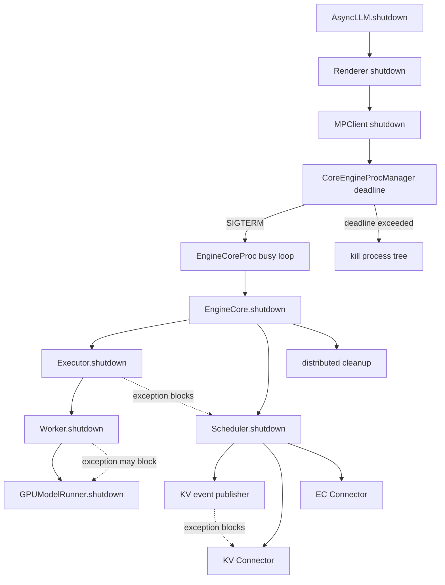

> 源码基线：[`0e14198a`](https://github.com/vllm-project/vllm/commit/0e14198a63c03f899a10f3e782e88eca7f11265b)，提交时间为 2026-09-03（北京时间）。该提交只改动 kernel microbenchmark 技能说明，本文相关 shutdown 源码与逐文件核对时的上一提交一致。本文以已合入代码为事实边界；改进方案属于基于代码证据的推导，不代表上游计划。

## 本篇在课程路线中的位置

第 23 章已经明确：Scheduler、Connector、Worker、ModelRunner 各自拥有不同资源，父进程管理器只负责 deadline 与强制终止；“进程退出”也不是逐资源归零回执。本篇继续沿同一条链追问：如果某个 owner 的 `shutdown()` 自己抛异常，排在它后面的 owner 还有没有机会释放？

位置是：

`shutdown ownership → cleanup fault isolation → owner-specific resource census`

本篇只讨论 Python V1 主链及一个 KV offload 反例，不扩展到 Ray/external launcher 的全部实现。

## 前置知识回顾

一次可验证的 shutdown 至少有三层结果：

1. **request convergence**：停止 admission，已有请求完成或 abort；
2. **resource teardown**：逻辑 KV、Connector、CUDA Graph、weights、IPC 等 owner 获得释放机会；
3. **process convergence**：超时后由父进程终止残余进程。

前两层可以失败，第三层仍可能成功。因此，`exitcode` 或显存回落不能证明正常 cleanup 全部执行过。

## 本篇要回答的核心问题

1. 当前 shutdown 链在哪些位置是 fail-fast，第一次异常会跳过哪些后续 owner？
2. 为什么“捕获所有异常继续执行”也不总是正确？
3. 如何设计不延长 kill deadline、又能表达 `drained / abandoned / failed / blocked` 的 bounded acknowledgement？

## 组件在全局架构中的位置



实线是正常调用链，虚线标出当前串行代码的异常截断点。父进程的 deadline 可以终止整个 Core 进程，却无法让同一进程中被跳过的 owner 重新获得 cleanup 机会。

## 完整调用链

公开入口 [`AsyncLLM.shutdown()`](https://github.com/vllm-project/vllm/blob/0e14198a63c03f899a10f3e782e88eca7f11265b/vllm/v1/engine/async_llm.py#L259-L274) 顺序调用 Prometheus、Renderer、EngineCore client，最后才取消 `output_handler`。这里没有 `try/finally`：Renderer 抛错会阻止 Core shutdown；Core client 抛错则会跳过 handler cancellation。

多进程 client 进入 [`MPClient.shutdown()`](https://github.com/vllm-project/vllm/blob/0e14198a63c03f899a10f3e782e88eca7f11265b/vllm/v1/engine/core_client.py#L685-L696)，先等待 `CoreEngineProcManager.shutdown(timeout)`，成功后才执行 socket、task、coordinator 等 background cleanup。进程管理器最终调用通用 [`shutdown(procs, timeout)`](https://github.com/vllm-project/vllm/blob/0e14198a63c03f899a10f3e782e88eca7f11265b/vllm/v1/utils.py#L598-L646)：向所有 Core 进程发 SIGTERM，用一个共享绝对 deadline join，超时后 `kill_process_tree`。

Core 进程收到信号后由 [`EngineCoreProc._handle_shutdown()`](https://github.com/vllm-project/vllm/blob/0e14198a63c03f899a10f3e782e88eca7f11265b/vllm/v1/engine/core.py#L1492-L1538) 完成 request convergence；随后 `run_engine_core()` 的 `finally` 调用 [`EngineCore.shutdown()`](https://github.com/vllm-project/vllm/blob/0e14198a63c03f899a10f3e782e88eca7f11265b/vllm/v1/engine/core.py#L764-L780)：

```text
structured_output_manager.clear_backend
→ model_executor.shutdown
→ scheduler.shutdown
→ gc.unfreeze
→ cleanup_dist_env_and_memory
```

五段也是直接串行调用。`model_executor.shutdown()` 抛错时，Scheduler、Connector、GC unfreeze 和 distributed cleanup 全部跳过；若 Core 原本正在传播一次 model execution exception，`finally` 中的新 cleanup exception 还可能遮蔽原异常。

Executor 内部仍有一层进程兜底。[`MultiprocExecutor.shutdown()`](https://github.com/vllm-project/vllm/blob/0e14198a63c03f899a10f3e782e88eca7f11265b/vllm/v1/executor/multiproc_executor.py#L451-L535) 关闭 death pipe，先给 Worker grace period，再升级为 SIGTERM、四秒后 SIGKILL；之后才关闭 response/broadcast MQ。若其中一次 MQ shutdown 抛错，剩余 MQ 不再处理。

每个 Worker 离开 busy loop 后在 `finally` 调用 [`WorkerProc.shutdown()`](https://github.com/vllm-project/vllm/blob/0e14198a63c03f899a10f3e782e88eca7f11265b/vllm/v1/executor/multiproc_executor.py#L816-L824)，再进入 [`GPUWorker.shutdown()`](https://github.com/vllm-project/vllm/blob/0e14198a63c03f899a10f3e782e88eca7f11265b/vllm/v1/worker/gpu_worker.py#L1432-L1459)。KV transfer、EC transfer、profiler、weight transfer、elastic EP、ModelRunner 和 CuMem pool 同样没有逐项隔离。尤其 [`GPUModelRunner.shutdown()`](https://github.com/vllm-project/vllm/blob/0e14198a63c03f899a10f3e782e88eca7f11265b/vllm/v1/worker/gpu/model_runner.py#L2050-L2070) 开头的 `torch.accelerator.synchronize()` 如果抛错或卡住，后面的 graph、KV tensor、workspace、model ref 释放均不会发生。

## 关键类型、字段和状态生命周期

这些接口都返回 `None`，没有 token tensor，因此不存在普通推理接口的 shape/dtype；它们消费的是 owner 持有的 Python、IPC 与 device resource：

| 接口 | 所在进程与所有权 | 输入/输出 | 成功后置条件 | 主要失败方式 |
| --- | --- | --- | --- | --- |
| `AsyncLLM.shutdown(timeout)` | API/frontend | `float | None → None` | Core 与 frontend task 获得关闭机会 | 前序 hook 抛错截断后续步骤 |
| `EngineCore.shutdown()` | EngineCore | 无参数、无返回 | Executor、Scheduler、distributed state 释放 | Executor 异常跳过 Scheduler；cleanup 异常遮蔽原异常 |
| `MultiprocExecutor.shutdown()` | EngineCore，管理 Worker process/MQ | 无参数、无返回 | Worker 退出，MQ 关闭 | 某个 pipe/MQ 抛错；Worker 只能被强杀 |
| `Scheduler.shutdown()` | EngineCore，持有 publisher 与 Connector | 无参数、无返回 | publisher、KV/EC Connector 关闭 | publisher 异常会跳过两个 Connector |
| `GPUWorker.shutdown()` | Worker，持有 device runtime | 无参数、无返回 | transfer、ModelRunner、CuMem pool 清理 | CUDA/NCCL/插件 shutdown 抛错或 hang |

并发假设也很关键：EngineCore 的 teardown 发生在 busy loop 退出后，正常路径不再有新调度；但 Connector 或 device 上可能仍有异步工作。父进程能杀进程，不能安全地“杀掉”同一 Python 进程里卡在 CUDA/C 扩展中的单个调用。

## 逐函数源码解读

### `Scheduler.shutdown()`：三个独立 owner 被写成一条异常链

[`Scheduler.shutdown()`](https://github.com/vllm-project/vllm/blob/0e14198a63c03f899a10f3e782e88eca7f11265b/vllm/v1/core/sched/scheduler.py#L2741-L2751) 依次关闭 `kv_event_publisher`、`connector`、`ec_connector`，没有 exception aggregation。三者通常拥有不同线程、socket 或后台 job；publisher 失败并不能从所有权上证明 KV Connector 也必须跳过。

### `MultiConnector.shutdown()`：独立子 owner 的 best effort

仓库中已经存在更强的局部模式。[`MultiConnector.shutdown()`](https://github.com/vllm-project/vllm/blob/0e14198a63c03f899a10f3e782e88eca7f11265b/vllm/distributed/kv_transfer/kv_connector/v1/multi_connector.py#L272-L283) 对每个 connector 分别 `try/except`，全部尝试后重抛最后一个异常。这样既不静默失败，也不会让 connector A 阻止独立的 connector B。

### KV offload tier：依赖关系要求 fail closed

2026-09-01 合入的 [PR #52290](https://github.com/vllm-project/vllm/pull/52290) 把 [`TieringManager.shutdown()`](https://github.com/vllm-project/vllm/blob/0e14198a63c03f899a10f3e782e88eca7f11265b/vllm/v1/kv_offload/tiering/manager.py#L926-L952) 改为：尝试所有 secondary tier；任一失败则重抛，并**不**关闭 primary tier。

这不是遗漏。secondary 可能仍注册或访问 primary mmap；此时 `munmap` primary 会把“资源未释放”升级为 use-after-unmap 风险。它给出核心规则：

> 独立 sibling 应尽量全部执行；下游依赖 owner 只有在前置 quiescence 被证明后才能释放。

## 具体示例与 shape/状态演算

假设 TP=2，有两个 Worker、三个请求和一个 KV Connector。shutdown 前：

```text
R0 持有 8 blocks，R1 持有 12 blocks，R2 持有 4 blocks
Connector 有 1 个 pending transfer
Worker0/1 各持有 KV tensors 与 CUDA Graph pool
```

`shutdown_timeout=0` 时，Scheduler 先把三项请求标成 `FINISHED_ABORTED`，逻辑上开始归还 24 blocks。随后进入资源 teardown。注入：`model_executor.shutdown()` 在 Worker 已退出、关闭第一个 response MQ 时抛 `RuntimeError`。

| 阶段 | 当前代码结果 | 能证明什么 |
| --- | --- | --- |
| request convergence | 三个 request 已 abort | 不再继续生成 |
| Worker termination | 两个 Worker 可能已退出 | device address space 最终可由 OS/driver 回收 |
| Executor MQ cleanup | 第一个 MQ 抛错 | 后续 MQ 状态未知 |
| Scheduler shutdown | 未调用 | pending Connector transfer 没有 shutdown 回执 |
| distributed cleanup | 未调用 | process group/缓存依赖进程退出兜底 |
| 父进程 deadline | 到期可 kill Core | 只保证 process convergence |

这个例子说明：外层最终“成功停机”与内层“正常释放”可以同时一真一假。

## 为什么这样设计及替代方案

当前 fail-fast 写法简单，能保留第一次 cleanup error，也避免在依赖状态未知时盲目释放下游资源；但它把整个 owner DAG 错写成一条链，扩大了故障半径。

另一个极端是对每一步使用 `contextlib.suppress(Exception)`。它能提高退出概率，却会隐藏泄漏，并可能像 primary mmap 一样破坏依赖安全。

更稳妥的最小设计是 **dependency-aware best effort**：

1. 为 cleanup 建立小型依赖 DAG，而不是固定线性序列；
2. 独立 sibling 全部尝试并聚合异常；
3. 前置 quiescence 失败时，将依赖步骤记为 `blocked`，不要强行执行；
4. 从最外层传递同一个绝对 deadline，每一步只看到 `deadline - now`；
5. 返回结构化 `ShutdownReport`，至少记录 `drained / abandoned / failed / blocked` 与 owner 名；
6. 父进程继续保留 SIGTERM/SIGKILL，作为阻塞调用的唯一硬边界。

不能承诺“任一 cleanup hang 时后续 owner 仍执行且总时限固定”。任意 C/CUDA 调用可能不可抢占；若要两者兼得，必须把 cleanup 放入可终止的独立进程，或要求每个实现原生支持 cooperative deadline。线程 timeout 本身不能终止卡住的 native call。

## 性能、并发、正确性与边界条件

- shutdown 不在请求热路径，但会影响 rolling restart、GPU 重新 admission 和故障恢复时间；串行给每个 owner一个完整 timeout 会把总延迟放大为 timeout 之和。
- 共享绝对 deadline 能限制总 wall time，却不能保证每个 owner都获得公平预算；报告必须区分“尝试失败”和“因预算耗尽未尝试”。
- `torch.accelerator.synchronize()` 提供释放前 device quiescence，但在 device hang 时会吞掉全部剩余预算。
- 强杀能回收进程级 CUDA context，却不会生成 Connector job、KV refcount 或业务 accounting 的正常终态。
- graphability 与本路径无直接关系；但 CUDA Graph pool 属于 ModelRunner 持有资源，前序 cleanup 异常会导致它只能依赖进程退出回收。
- shutdown 应当幂等；当前若方法在部分清理后抛错，再次调用是否安全，取决于每个子 owner，而非顶层接口统一保证。

## 测试证据与未覆盖风险

当前直接测试证明了几个局部不变量：

- [`test_multiproc_executor_worker_termination_timeout`](https://github.com/vllm-project/vllm/blob/0e14198a63c03f899a10f3e782e88eca7f11265b/tests/v1/executor/test_executor.py#L72-L89) 用 fake clock 验证：Worker 在 6 秒 grace 内于第 5 秒退出则不发 TERM，第 7 秒才退出则会发 TERM。它证明 deadline 升级，不证明 cleanup exception 隔离。
- [`test_background_resources_passes_worker_shutdown_timeout`](https://github.com/vllm-project/vllm/blob/0e14198a63c03f899a10f3e782e88eca7f11265b/tests/v1/engine/test_core_engine_actor_manager.py#L104-L112) 验证环境值 `7` 被传给 manager；没有检查 manager 抛错后 socket/task 是否继续清理。
- [`TestShutdownDrain`](https://github.com/vllm-project/vllm/blob/0e14198a63c03f899a10f3e782e88eca7f11265b/tests/v1/kv_offload/tiering/p2p/test_manager.py#L873-L951) 验证两个 transfer ID `42/43` 能通过 wait-cancel drain；模拟 0.05 秒超时后会 immediate-cancel，且 control/data 各关闭一次。这证明单个 owner 内已有 bounded drain 模式。
- [`TestMockObjTierShutdown`](https://github.com/vllm-project/vllm/blob/0e14198a63c03f899a10f3e782e88eca7f11265b/tests/v1/kv_offload/tiering/test_obj_tier.py#L589-L604) 验证 in-flight transfer 状态清空与重复 shutdown 不抛错。

但没有直接测试注入 `Executor.shutdown`、`kv_event_publisher.shutdown`、KV Connector、EC Connector 或 `GPUModelRunner.shutdown` 异常，并断言所有独立 sibling 仍被调用、依赖 owner 正确标记 `blocked`、原始 fatal exception 不被覆盖、总耗时不超过同一 deadline。PR #52290 也没有随合入提交增加针对 secondary failure 的直接单测。

测试框架中的 [`VllmRunner.__exit__`](https://github.com/vllm-project/vllm/blob/0e14198a63c03f899a10f3e782e88eca7f11265b/tests/conftest.py#L1363-L1389) 会捕获 engine shutdown exception、记录“GPU memory may leak”，再执行全局 cleanup。这是测试夹具的兜底证据，不是生产 owner 链已经隔离的证明。

## 与前后章节的连接

第 23 章回答“谁拥有最后一次释放”；本章说明 owner 的释放调用本身也需要故障域和依赖图。下一章将把抽象的 `ShutdownReport` 落到可观测性：哪些 resource census 能在进程还活着时采集，哪些只能由父进程确认，以及如何避免 fatal dump 再次产生副作用。

## 本篇结论、知识债、三个理解检查问题和下一章

结论：当前 V1 shutdown 的硬 liveness 边界在父进程；进程内多数 cleanup 仍是串行 fail-fast。上游已经在 `MultiConnector` 和 KV offload tier 中局部采用异常聚合，但后者也证明“继续执行所有步骤”并非普遍正确。合理契约应是 dependency-aware best effort：独立 sibling 继续、依赖步骤 fail closed、异常聚合、共享绝对 deadline，最终由进程终止兜底。

知识债：顶层 cleanup exception isolation、原异常保留、全链绝对 deadline、结构化 `ShutdownReport`、hang 场景的进程级故障注入，以及 TP/PP/Ray/external launcher parity。

理解检查：

1. 为什么 `model_executor.shutdown()` 抛错后，即使 Core 进程最终退出，也不能声称 Scheduler/Connector 正常释放？
2. 为什么 secondary tier shutdown 失败时，跳过 primary mmap cleanup 反而是正确的 fail-closed？
3. 为什么给每个 `shutdown()` 套一个线程 timeout，不能可靠地解决卡在 CUDA/C 扩展里的调用？

下一章：**Shutdown resource census——在进程退出前证明 request、KV block、Connector job、Worker state 与 device allocation 到达何种终态。**

## 课程账本增量

- 新增章节：24。
- 新覆盖：`AsyncLLM.shutdown` 的前端 fail-fast、`EngineCore.shutdown` 的异常截断与原异常遮蔽、`Scheduler.shutdown` sibling ownership、`MultiConnector.shutdown` exception aggregation、`TieringManager.shutdown` dependency-safe skip、P2P shutdown bounded drain。
- 新确认不变量：独立 cleanup owner 应全部获得尝试；依赖资源只能在前置 quiescence 成功后释放；硬 deadline 必须由可终止的外层进程边界执行。
- 新知识债：缺 owner DAG、结构化回执和 cleanup fault-injection matrix。
- 下一章：Shutdown resource census。
