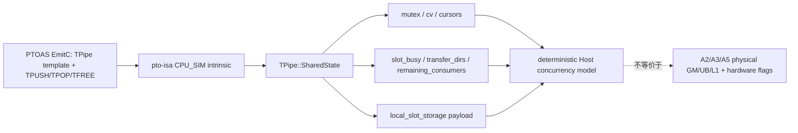
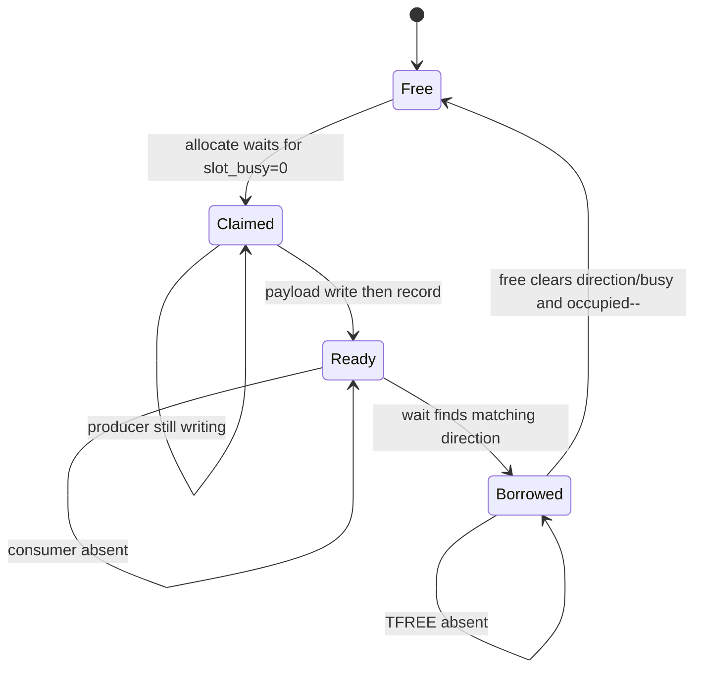

> 本文基于 pto-isa 默认分支 [`c0e28cfb`](https://github.com/hw-native-sys/pto-isa/commit/c0e28cfb2a293e87161edcb64bed26e31301dd9c)，提交时间为 2026-09-03 14:34（北京时间）。其中直接相关修复是已合入的 [`1ba4d1f5`](https://github.com/hw-native-sys/pto-isa/commit/1ba4d1f5356deb202815078087124dd32a478c29)。本文把源码、回归和 Issue 复现分别标为代码事实、测试事实和历史故障证据；CPU_SIM 到真机的映射只作有边界的推断。

## 本篇在 PTO 课程路线中的位置

第 24 章为跨 endpoint balance verifier 推导了静态条件：producer 的 publish 数必须与 consumer 的 pop/release 数在每条动态路径上匹配。今天转到 pto-isa 的 CPU_SIM，观察不匹配在运行时究竟变成什么状态。

位置是：

`component effect equality → CPU_SIM FIFO 动态状态 → fault injection → A2/A3/A5 device evidence`

本章只讲一个问题：**TileData TPipe 的控制面和数据面如何共同组成一个可复用 slot 的生命周期。**

## 前置知识

TPipe 不是普通队列。对一个 entry 而言至少有三次所有权变化：producer 取得空 slot 并写数据，`TPUSH` 发布 ready；consumer 的 `TPOP` 等待并借用该 slot；`TFREE` 才解除借用，让 producer 再次使用它。

课程 23 已说明析构 drain 不能凭空补齐缺失 transaction；课程 24 又说明 `nosplit` 一致、局部 `TPOP→TFREE` 正确，也不能推出两端动态次数相等。CPU_SIM 的价值，是把这些抽象守恒映射为 mutex、condition variable、cursor 和 per-slot 状态。

## 今日核心问题

1. producer、consumer 和 slot 的最小状态机是什么？
2. matched flow、missing pop/free 与连续传输分别如何改变 `occupied` 和 slot ownership？
3. 为什么最新修复必须让 FIFO 控制状态与 TileData payload 共享同一个 `SharedState` 生命周期？

## PTO 全栈中的位置



上游生成的 `TPipe<FlagID, Direction, SlotSize, SlotNum, ...>` 决定静态容量和方向；CPU_SIM 用 Host 线程执行同一 intrinsic 语义。它应复现可观察的 FIFO 顺序、数据值、等待与释放，不必复刻目标芯片内部 scratch bytes。

## 概念和精确语义

在 [`TPush.hpp`](https://github.com/hw-native-sys/pto-isa/blob/c0e28cfb2a293e87161edcb64bed26e31301dd9c/include/pto/cpu/TPush.hpp#L475-L511) 中，每个 pipe identity 对应一个 `SharedState`：

- `next_producer_slot`：下一次生产应尝试的逻辑槽位；
- `next_c2v_consumer_slot` / `next_v2c_consumer_slot`：双向 pipe 的独立消费游标；
- `occupied`：已经 publish、尚未完成最后 release 的 entry 数；
- `slot_busy[i]`：slot 已被 producer claim，直到最后 consumer free；
- `transfer_dirs[i]`：该 slot 当前装的是 C2V、V2C，还是空；
- `remaining_consumers[i]` / `consumers_claimed[i]`：split/no-split 多 lane 的领取与最终释放；
- `popped_slots*`：允许多个 pop 尚未 free 时，保证后续 pop 不重复借用同一 slot；
- `local_slot_storage[i]`：CPU_SIM TileData 的 canonical payload bytes。

一个普通单 consumer entry 的状态转换是：



前置条件：`SlotSize` 必须覆盖要搬运的完整 byte region；Tile shape、dtype、location 与 split lane 必须匹配 overload。后置条件：`TPUSH` 之后 payload 对 consumer 可见；`TPOP` 之后 consumer 拥有借用；只有 `TFREE` 后 slot 才可复用。CPU_SIM 的等待没有内建超时，错误 balance 可能表现为永久阻塞。

## 真实文件、类型、API 或指令逐段解读

### 1. `allocate`：容量还够不代表游标 slot 可写

[`Producer::allocate`](https://github.com/hw-native-sys/pto-isa/blob/c0e28cfb2a293e87161edcb64bed26e31301dd9c/include/pto/cpu/TPush.hpp#L617-L652) 在 `cv.wait` 中同时检查：

```text
occupied < SlotNum
AND slot_busy[next_producer_slot] == 0
AND transfer_dirs[next_producer_slot] == None
```

第二、三个条件很重要。`DIR_BOTH` 或多 lane 场景可能乱序释放：队列总体尚有空位，不代表生产游标指向的物理 slot 已安全归还。直接只看 `occupied` 会覆盖仍被另一方向或 lane 使用的数据。

### 2. `record`：写完数据才 publish

[`Producer::record`](https://github.com/hw-native-sys/pto-isa/blob/c0e28cfb2a293e87161edcb64bed26e31301dd9c/include/pto/cpu/TPush.hpp#L654-L682) 在锁内写入 `transfer_dirs` 和 `remaining_consumers`，推进 producer cursor，再执行 `occupied++`，随后 `notify_all`。split V2C 必须等所有 active producer lanes 写完，才把 slot 标成可消费，避免 consumer 读到 half-written entry。

这给出 happens-before：payload 写发生在 publish 之前；consumer 在同一 `SharedState` 的 mutex/cv 条件满足后读取。这里证明的是 Host simulator 的并发语义。

### 3. `wait`：按方向找 ready slot，并登记借用

[`Consumer::wait`](https://github.com/hw-native-sys/pto-isa/blob/c0e28cfb2a293e87161edcb64bed26e31301dd9c/include/pto/cpu/TPush.hpp#L719-L813) 不只是读取 `next_consumer_slot`。`DIR_BOTH` 会寻找 `transfer_dirs` 与期望方向一致的 slot，并排除已经 pop、尚未 free 的 slot；成功后把 slot 放入 pending FIFO。这样连续两次 `TPOP` 可以借用不同 entry，后续 `TFREE` 仍能释放正确的那个。

### 4. `free`：release 才关闭 transaction

[`Consumer::free`](https://github.com/hw-native-sys/pto-isa/blob/c0e28cfb2a293e87161edcb64bed26e31301dd9c/include/pto/cpu/TPush.hpp#L815-L861) 先保存 `wasPendingSlotTracked`，再从 pending FIFO 取出真正的 slot。最新修复特别调整了这个顺序：若先清标记再判断，就可能错误推进共享 consumer cursor。

最后一个 consumer release 时才清空 `transfer_dirs`、`slot_busy`，执行 `occupied--` 并唤醒 producer。`TPOP` 只取得数据，不等价于 slot 已空。

## 对象/Tile/Buffer/IR 生命周期

最新修复的关键，是 TileData payload 与上述状态现在都由 `SharedState` 持有。[`GetSharedState`](https://github.com/hw-native-sys/pto-isa/blob/c0e28cfb2a293e87161edcb64bed26e31301dd9c/include/pto/cpu/TPush.hpp#L531-L564) 优先通过 injected/shared-storage hook，以 task、block、FlagID、direction、slot 参数形成共享 identity；没有 hook 才退回 static storage。

旧 CPU_SIM 路径会因构造 `TPipe` 时传入非空 GM workspace，改用这块外部内存保存 TileData payload；但 ready/free、slot selection 仍来自 Host `SharedState`。故控制面说“slot 1 ready”，数据面地址却由另一套 pointer/lifetime 假设决定。Issue [#281](https://github.com/hw-native-sys/pto-isa/issues/281) 的保存输入复现出现相同输入多次输出不同，而真实 A2/A3 通过。

当前实现的 [`popTileFromVecFiFo`](https://github.com/hw-native-sys/pto-isa/blob/c0e28cfb2a293e87161edcb64bed26e31301dd9c/include/pto/cpu/TPush.hpp#L863-L877) 明确从 `local_slot_storage[slotIndex]` 取值；外部 GM workspace 对 CPU_SIM TileData 只是目标侧参数。GlobalData pipe 仍是另一套公开契约，不受此结论影响。

## 端到端调用链或指令链

```text
producer Tile<Mat/Acc>
→ TPUSH overload
→ Producer::allocate claim slot
→ copy TileData into local_slot_storage[slot]
→ Producer::record publish direction/consumer count
→ Consumer::wait find matching ready slot
→ copy local_slot_storage[slot] into Tile<Vec/Mat>
→ consumer compute
→ TFREE → Consumer::free
→ clear busy/direction, occupied--, notify producer
```

`reset_for_cpu_sim()` 会重置 cursor、occupancy、payload、per-lane claim 与 busy state；它是测试隔离工具，不是业务取消协议。运行中的不匹配不能靠另一个线程随意 reset，否则可能把仍在访问的 payload 判成 free。

## 具体 shape、Tile 和状态演算

设 `Pipe = TPipe<6, DIR_C2V, 64×128×4, SlotNum=4>`，每个 `float32` entry 为 32768 B。producer 连续生成 10 个 Tile，consumer 延迟 10 ms 后启动；第 `k` 个 Tile 填值 `k×1000+i+1`。

| 时刻 | producer 动作 | consumer 动作 | `occupied` | slot 状态 |
| --- | --- | --- | ---: | --- |
| 0 | publish entry 0 | 未启动 | 1 | `[R,F,F,F]` |
| 1 | publish entry 1..3 | 未启动 | 4 | `[R,R,R,R]` |
| 2 | 尝试 entry 4，等待 | 未启动 | 4 | producer 被容量/slot gate 阻塞 |
| 3 | 等待并 pop slot 0 | 借用 entry 0 | 4 | `[B,R,R,R]` |
| 4 | 仍不能复用 slot 0 | `TFREE(slot 0)` | 3 | `[F,R,R,R]` |
| 5 | publish entry 4 到 slot 0 | 继续 pop/free | 4 | 环绕开始 |
| 6 | 10 次 publish 完成 | 10 次值序列均匹配 | 0 | 全部 slot free |

这是现有 [`cube_to_vector_multicore_stream_float_64x128`](https://github.com/hw-native-sys/pto-isa/blob/c0e28cfb2a293e87161edcb64bed26e31301dd9c/tests/cpu/st/testcase/tpushpop_cv/main.cpp#L70-L127) 的核心行为：10 次传输跨过 4-slot 环两轮以上，验证 producer 阻塞后能被每次 release 唤醒，并且 FIFO 值没有被覆盖。

若 consumer 少一次 `TPOP`，最后 `occupied=1`；若做了 `TPOP` 却少一次 `TFREE`，最后同样有一个 `slot_busy=1`，且借用记录未闭合。下一 dispatch 复用同一 pipe state 时，可用深度减少；继续生产最终会阻塞在 `allocate`。这正对应上一章静态 effect 中的 `P-C=1` 或 `C-R=1`。当前测试没有故意让线程永久挂住的 negative case，因此这段是由等待谓词推导的运行时结果，不冒充已执行测试。

## 为什么这样设计及替代方案

### 方案 A：Host `SharedState` 同时拥有 control 与 TileData payload

优点是 identity、lifetime 和 happens-before 都集中在一个对象，结果确定，边界检查容易；缺点是不能观察真实 GM/UB/L1 地址与性能。对功能 simulator，这是更稳健的抽象层次。

### 方案 B：继续使用外部 GM workspace

它更像部分 target 实现，但必须额外证明 producer/consumer 获得同一 allocation、相同 slot address、足够 lifetime、无 alias，并把外部 payload 的读写纳入同一同步关系。旧实现只凭 non-null pointer 选择后端，维护成本和错误面都更大。

### 方案 C：无界 Host queue

实现最简单，也能验证值顺序，却会抹掉有限 `SlotNum`、release-before-reuse 和 backpressure；missing `TFREE` 不再暴露。它不适合检验 compiler balance proof。

当前设计以 byte array 加 `memcpy` 访问，还避免未对齐 `uint64_t` 的未定义行为，并在越界时抛 `out_of_range`。这是 CPU_SIM 正确性收益，不代表真机允许任意未对齐/越界 Tile。

## 访存、计算、流水、并行和硬件约束

- Host payload copy 是逐元素/byte-storage 语义模型，不能用于估算 NPU DMA 带宽、bank conflict 或 pipe latency。
- `SlotNum=4` 允许 producer 最多领先 consumer 四个未释放 entry；它是有界并发窗口，不是修复 count mismatch 的缓冲。
- mutex/cv 建立 CPU 线程可见性；真机依靠 target-specific flag、GM/UB/L1 与 pipeline 指令，不能把 Host 锁直接解释成硬件实现。
- `DIR_BOTH` 共享 slot array，但用独立方向 cursor 和 `transfer_dirs` 过滤，避免一侧只等待错误方向的头部而产生 head-of-line blocking。
- split producer 只有所有 active lanes 完成才 publish；split consumer 只有最后 consumer release 才让 slot free。这是 payload 完整性与复用安全的共同条件。

## 测试证据与未覆盖风险

当前直接测试事实：

- [`tpushpop_cv`](https://github.com/hw-native-sys/pto-isa/blob/c0e28cfb2a293e87161edcb64bed26e31301dd9c/tests/cpu/st/testcase/tpushpop_cv/main.cpp) 的单 Tile 与 10-entry/4-slot 多线程流验证 matched C2V 值和跨环 FIFO 顺序；
- [`tile_flow_keeps_non_null_gm_workspace_out_of_cpu_data_plane`](https://github.com/hw-native-sys/pto-isa/blob/c0e28cfb2a293e87161edcb64bed26e31301dd9c/tests/cpu/st/testcase/tpushpop/main.cpp#L653-L697) 用 `16×16×f32`、2 slots、`DIR_BOTH` 完成 C2V，再把每个值加一完成 V2C，并断言填充 `0xa5` 的 GM workspace 完全未改；
- 同文件的 [unaligned/overflow tests](https://github.com/hw-native-sys/pto-isa/blob/c0e28cfb2a293e87161edcb64bed26e31301dd9c/tests/cpu/st/testcase/tpushpop/main.cpp#L699-L756) 验证未对齐 `uint64_t` 正确搬运，以及 31 B slot 容纳 32 B Tile 时诊断包含 slot、element size 和 region end；
- 相关合入提交记录 `tpushpop` 21/21 与 `tpushpop_fixpipe` 通过；Issue #281 则提供三个 PyPTO-Lib CSA/SWA case 的 CPU_SIM 非确定性和真实 A2/A3 对照。

尚未覆盖：missing pop/free 的 bounded-time negative test；连续两个 dispatch 在不调用 test-only reset 时的归零断言；`SharedState` 的只读 snapshot；多 task/block 同 FlagID 的隔离；CPU_SIM 与 A2/A3/A5 对 slot/flag trace 的差分测试；异常退出时等待线程如何收敛。尤其不能由 21 个 CPU tests 推出真机 timing、memory placement 或 deadlock parity。

## 与前后章节的连接

向前看，本章把 PTOAS 拟议 effect `P/C/R` 映射为 `record/wait/free` 和 `occupied/slot_busy`：静态 mismatch 会减少动态可用深度并最终阻塞。它还补充了一个更细的不变量：即使 transaction 次数匹配，payload address identity/lifetime 与 control-state identity 不一致，仍可能错值。

向后看，下一章应把 simulator 变成故障注入工具：为 wait 加测试级 deadline，导出有限 census，分别制造 missing pop、missing free、方向错误和跨 dispatch 残留，并与 PTOAS effect diagnostic 对齐。

## 本篇结论、知识债、三个理解检查问题和下一章

结论：

1. CPU_SIM TPipe 的完成条件不是“consumer 读到了值”，而是最后一次 release 让 slot 回到可复用状态。
2. `occupied` 是 publish-to-final-free 的计数；`TPOP` 不递减它，避免读取尚未结束时被覆盖。
3. 控制面与 payload 可以物理分离，但必须共享 identity、lifetime 和 ordering proof；当前 CPU_SIM 选择由 `SharedState` 统一拥有 TileData。
4. CPU_SIM 能验证 FIFO、值、split/direction 与 backpressure 语义，不能替代真机存储层次和时序证据。

知识债：test-only timeout/cancellation；结构化 FIFO census；missing pop/free negative matrix；连续 dispatch 无 reset；多 task/block isolation；A2/A3/A5 slot/flag trace parity；GlobalData 与 TileData 两套 simulator contract 的并列测试。

理解检查：

1. 为什么 consumer 已经 `TPOP` 成功，producer 仍不能覆盖该 slot？
2. `occupied < SlotNum` 时，为什么 `allocate` 还必须检查当前 cursor 的 `slot_busy` 与 `transfer_dirs`？
3. 如果重新启用外部 GM workspace 作为 CPU_SIM TileData payload，需要额外证明哪三类条件？

下一章：**CPU_SIM TPipe 故障注入协议——bounded wait、FIFO census 与跨 dispatch 残留检测。**

## 课程账本增量

- 主仓：pto-isa `c0e28cfb`；直接相关修复 `1ba4d1f5`。
- 新覆盖：CPU `TPipe::SharedState/GetSharedState/reset_for_cpu_sim`、`Producer::allocate/record`、`Consumer::wait/free`、host byte slot storage 与 tpushpop tests。
- 新不变量：publish 后到 final free 前 `occupied` 不减；slot 复用同时要求容量、busy 与 direction 为空；control/payload 必须共享 identity/lifetime/ordering proof；test reset 不是取消。
- 新测试事实：10-entry/4-slot 跨环流、non-null GM workspace 不进 TileData data plane、unaligned byte access 和 undersized slot fail-fast。
- 新知识债：negative hang 测试、bounded diagnostics、无 reset 连续 dispatch、多 scope isolation 和真机 trace parity。
- 下一章：为 CPU_SIM 引入测试级 bounded wait/census 设计，并将动态故障与 PTOAS 静态 effect diagnostic 对齐。
