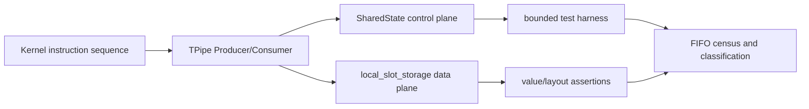
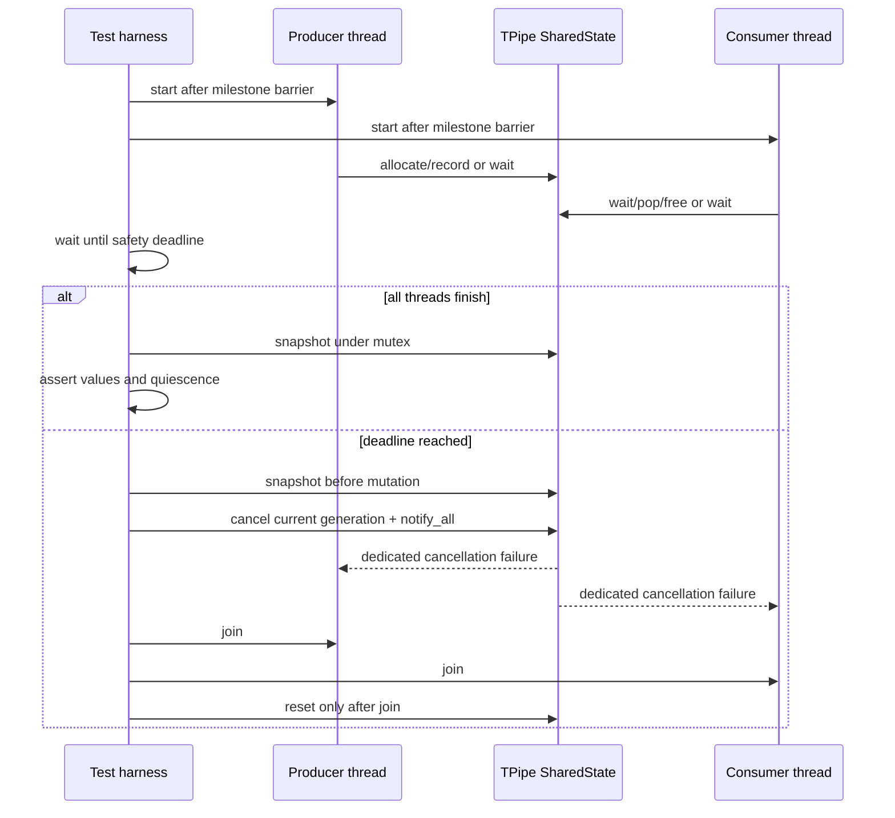

## 本篇在 PTO 课程路线中的位置

第 25 章已经把 `TPUSH/TPOP/TFREE` 的抽象语义落到 CPU_SIM 的共享状态：生产者经历 `allocate → record`，消费者经历 `wait → free`，一个 slot 从 publish 到最后一个 consumer 释放前始终占用。本篇不再重复正常 FIFO，而是回答一个更尖锐的问题：**协议写错以后，测试怎样既确认“确实卡住”，又能保存可解释证据并正常退出？**

课程位置是：

```text
CPU_SIM FIFO 正常状态机
→ bounded fault injection + FIFO census
→ A2/A3/A5 ready/free flag 的设备证据对齐
```

分析基于 pto-isa 默认分支 [`a8040450`](https://github.com/hw-native-sys/pto-isa/commit/a8040450238f162985d8b596fbebeb54bfba2bf5)。本篇只选 pto-isa：问题发生在 CPU_SIM 的动态状态与测试 harness，暂时不需要引入 PTOAS。

## 前置知识

先保留三个已经证明的事实：

1. `record()` 才发布 entry，并设置 `transfer_dirs`、`commit_seq`、`remaining_consumers`，随后增加 `occupied`。
2. `TPOP` 只是取得一份 pending borrow；最后一次 `TFREE` 才清除方向和 busy 状态、减少 `occupied`，允许 slot 复用。
3. `DIR_BOTH` 必须按 C2V/V2C 方向和 split lane 配对；只比较总 push/pop 次数不足以证明安全。

所以负向测试需要观察的不是一个 `done` 布尔值，而是“谁在等什么、哪些 slot 仍由谁持有”。

## 今日两个核心问题

1. 为什么给 `cv.wait` 粗暴改成 `wait_for(100ms)` 不是可靠修复？
2. 一份最小但有解释力的 FIFO census 应包含哪些字段，怎样区分死锁、资源残留和 payload 错误？

## PTO 全栈中的位置

上游的 PTOAS 或手写 kernel 生成 `TALLOC/TPUSH/TPOP/TFREE` 序列；CPU_SIM 在 Host 线程上执行同一接口，用 mutex、condition variable 和 byte storage 模拟跨核 FIFO。下游测试既要验证输出值，也要验证协议终态。



这里有两条互不替代的证据链：control plane 回答“entry 是否被正确发布、领取、释放”，data plane 回答“被传递的逻辑 Tile 是否按正确 layout 到达”。

## 概念和精确语义

### 无限等待是协议语义，不是测试语义

当前 [`include/pto/cpu/TPush.hpp`](https://github.com/hw-native-sys/pto-isa/blob/a8040450238f162985d8b596fbebeb54bfba2bf5/include/pto/cpu/TPush.hpp) 中，生产者 `allocate()` 和消费者 `wait()` 都使用带 predicate 的 `cv.wait`：

- producer 等 `occupied < SlotNum`，并确认目标 slot 未 busy、方向为空；
- consumer 等到与目标 direction/lane 匹配的已提交 slot；
- `DIR_BOTH` no-split 路径还借助 `commit_seq` 选择该方向最早的 entry。

真实协议允许 peer 任意慢，因此“超过固定毫秒数就让 ISA 调用失败”会把调度抖动误判成协议错误。deadline 属于测试 supervisor 的存活预算，不应悄悄改变成功路径语义。

### Census 不是 reset，也不是全零

当前 `SharedState` 已有足够多的原始字段：`occupied`、`slot_busy`、`transfer_dirs`、`remaining_consumers`、`consumers_claimed`、producer masks、pending queues 与 `commit_seq`。但仓库没有不可变的 snapshot API，也没有 waiter 原因与 generation。

正常 quiescent 终态应满足：

```text
occupied == 0
all slot_busy == 0
all transfer_dirs == None
all remaining_consumers == 0
all claimed/allocated/done masks == 0
all popped_not_freed counters == 0
all commit_seq == 0
active_waiters == 0               # 当前尚无此字段
```

反而不应要求 cursor、`next_commit_seq` 或 payload bytes 回到零：cursor 是合法环位置，sequence 是历史单调量，已释放 slot 的旧字节不再具有语义。把“quiescent”误写成“整块内存全零”，既增加成本，也会制造假失败。

## 真实文件、类型、API 或指令逐段解读

### `SharedState`：当前已有的证据

`SharedState` 把控制和 Host payload 的生命周期绑定在同一个 identity 下。`GetSharedState()` 的 key 包含 task cookie、block index、`FlagID/DirType/SlotSize/SlotNum/LocalSlotNum`；这使同一逻辑 pipe 的多个 endpoint 共享状态，也说明跨 dispatch 隔离必须显式证明。

`record()` 写入 `commit_seq` 后发布，`FindOldestTransferSlot()` 据此保持按方向的 FIFO；final `free()` 把对应 sequence 清零。于是 snapshot 中“`direction != None` 且 `commit_seq != 0`”是已发布但尚未完全释放的强证据。

### `reset_for_cpu_sim()`：只能在 quiescence 后调用

当前 reset 在锁内清零 cursor、slot metadata、pending queues、payload storage 和 producer/consumer masks，然后 `notify_all()`。它没有 cancellation token，也没有 generation/epoch。

因此它是**测试隔离工具，不是取消协议**。若某线程仍在旧 predicate 上等待，reset 后它可能继续等；更危险的是，旧线程醒来后可能消费下一次 dispatch 发布的新 entry。安全顺序只能是：先让所有旧线程离开等待并 `join`，再 reset。仅仅 `notify_all` 不会令不满足 predicate 的 wait 返回。

### 现有测试证明了什么

[`tpushpop_cv/main.cpp`](https://github.com/hw-native-sys/pto-isa/blob/a8040450238f162985d8b596fbebeb54bfba2bf5/tests/cpu/st/testcase/tpushpop_cv/main.cpp) 用 4 slots 传 10 entries，两个线程最终 `join`，证明正常 backpressure 能跨环推进。

[`tpushpop/main.cpp`](https://github.com/hw-native-sys/pto-isa/blob/a8040450238f162985d8b596fbebeb54bfba2bf5/tests/cpu/st/testcase/tpushpop/main.cpp) 有一个方向匹配测试：consumer 先等待，sleep 30 ms 后确认尚未完成，再发布匹配数据并 join。这证明“没有匹配方向时暂时阻塞”，却不能构造永久 missing peer；否则测试自身也无法结束。另一些 `DIR_BOTH` 测试在正常流程后直接检查 `occupied/popped_not_freed/slot_busy/direction/remaining_consumers`，已经是 census 的雏形，但读取接口和故障退出协议尚未封装。

## 对象与状态生命周期

最小 test-only 设计需要给状态增加三类观测，而不改变公开 ISA：

- `generation`：标识当前 dispatch；旧 waiter 发现 generation 变化时必须失败退出，不能进入新一轮。
- `cancel_requested`：仅测试 harness 可设置；wait predicate 变为“正常条件或本代被取消”，取消后抛出专用测试异常。
- waiter census：记录 `producer_capacity`、`producer_slot`、`consumer_direction`、`consumer_lane` 等等待原因及数量。

snapshot 必须在 mutex 下复制成值对象，离锁后再格式化；否则打印线程本身会与状态修改竞争。



## 端到端调用链或指令链

以 missing free 为例：

```text
TPUSH
→ Producer::allocate 等空 slot
→ copy payload
→ Producer::record 发布 C2V entry
→ TPOP
→ Consumer::wait 领取 slot 并放入 pending queue
→ 故意省略 TFREE
→ 下一轮 producer 绕回该 slot
→ cv.wait 永久等待 slot_busy 清零
→ harness snapshot/cancel/join/reset
```

这条链能把静态 effect 的 `pop-release = 1` 映射成动态 `popped_not_freed = 1`。missing pop 则表现为 `push-pop > 0`：已发布 entry 的 `remaining_consumers` 一直非零，最终 producer 因 FIFO 满而等待。

## 具体 shape、Tile 和状态演算

选 `Tile<Vec,float,16,16>`：256 个 `float`，每个 entry 为 1024 B；设 `SlotNum=2`、C2V。

### Case A：missing pop

生产者连续发布 E0、E1，consumer 不执行 `TPOP`，第三次 `TPUSH` 到达 capacity gate：

| 字段 | slot 0 | slot 1 | 解释 |
| --- | ---: | ---: | --- |
| `slot_busy` | 1 | 1 | 两个物理槽都不可复用 |
| `transfer_dirs` | C2V | C2V | 两个 entry 均已发布 |
| `remaining_consumers` | 1 | 1 | 都尚未被最终释放 |
| `commit_seq` | 1 | 2 | 发布顺序明确 |
| `occupied` | \- | 2 | 达到 FIFO 深度 |

预期分类是 `PROTOCOL_BLOCKED(producer_capacity)`，不是普通 timeout。

### Case B：missing free

为让状态最清楚，可用 `SlotNum=1`：producer 发布 E0，consumer 成功 pop，但故意不 free。此时值可能完全正确，却有：

```text
occupied=1, slot_busy[0]=1, direction[0]=C2V,
remaining_consumers[0]=1, popped_not_freed=1
```

下一次 producer 等待同一 slot。它与 missing pop 的表面症状都是卡住，但 pending borrow 能定位责任边界。

### Case C：方向错误

`DIR_BOTH` 中只发布 V2C，却启动等待 C2V 的 consumer。总 push 数和总 pop 期待数都可能各为 1，标量 balance 看不出问题；snapshot 必须同时记录实际 `V2C` entry 与 `consumer_direction=C2V` waiter。这也反推 PTOAS 的静态 effect 必须按 direction/lane 分区。

## 为什么这样设计及替代方案

### 方案一：测试级 cooperative cancel + snapshot

优点是失败时仍能读取进程内状态，并让线程走可控异常路径后 join；维护成本是 CPU_SIM 测试代码需要 generation 与 waiter bookkeeping。它是诊断最强的最小方案。

### 方案二：子进程 hard timeout

把故障 case 放进子进程，超时后 kill，完全不改 intrinsic wait，适合作为防止 CI 永久挂起的最后保险。但进程被杀后，若没有提前导出 snapshot，只得到“未完成”，定位力弱。两者应分层：cooperative cancel 给证据，外层进程 deadline 保证最坏情况下仍终止。

### 不推荐：sleep 后断言 `done == false`

它依赖机器负载，只证明某时间窗内没完成；而且留下 joinable thread 时，测试无法安全销毁。milestone/barrier 应先证明线程已经进入目标操作，deadline 只承担安全阀角色，不能被解释为硬件或 ISA 的延迟上限。

## 访存、计算、流水、并行和硬件约束

这些字段是 Host 模型的诊断状态，不应直接冒充 A2/A3/A5 硬件寄存器。CPU_SIM 可证明 FIFO 次序、Host payload、backpressure 与 endpoint 配对；它不能证明 GM/UB/L1 真实地址、flag 到达时序或设备 pipeline overlap。

census 复制成本是 `O(SlotNum + lane state)`，只应在测试检查点或失败路径执行，不放入 steady-state 每次 push/pop。snapshot 在同一 mutex 下取得会短暂阻塞参与线程，但换来一致切面；逐字段无锁打印虽便宜，却可能组合出从未真实存在的状态。

## 测试证据与未覆盖风险

当前代码/测试事实：

- 正常 4-slot、10-entry 多线程流能结束并保持 FIFO 值顺序。
- consumer 可在错误方向上阻塞，匹配 entry 到来后继续。
- 正常 `DIR_BOTH` 流结束后已有部分字段归零断言。
- 最新 [`06c68ccf`](https://github.com/hw-native-sys/pto-isa/commit/06c68ccfc93d084c2ef84f106898cb1ef2b13c88) 修复 V2C 窄 Vec view 的 CPU_SIM payload 排布，并增加 `(parentCols,windowCols,rows,offset)` 为 `(64,32,16,0)`、`(64,32,16,32)`、`(128,32,8,64)` 的行保持测试。

最后一项很重要：它属于 `DATA_MISMATCH`，线程会正常结束，control census 也可能 quiescent。它与 Issue [#289](https://github.com/hw-native-sys/pto-isa/issues/289) 所强调的“完成但数值错误”证据类型一致，但该 Issue 的完整 HCA 根因仍未闭合，不能把这次 layout 修复宣称为全部根因。

建议把测试结果固定成五类：

1. `PASS`：线程结束、数值正确、状态 quiescent；
2. `DATA_MISMATCH`：线程结束，但 shape/layout/value 断言失败；
3. `PROTOCOL_BLOCKED`：deadline 命中，snapshot 显示不满足的配对或资源条件；
4. `RESIDUAL_STATE`：线程结束，但仍有 entry/borrow/waiter；
5. `HARNESS_UNKNOWN`：取消也不能使线程退出，交给外层进程强制终止。

当前未覆盖：仓库尚无 integrated bounded cancel、immutable snapshot、generation 或完整 waiter census；也没有 missing pop/free 负向矩阵和“同 key、无 reset、连续两次 dispatch”的隔离测试。

## 与前后章节的连接

第 24 章的 component-level verifier 讨论静态路径 effect；第 25 章给出正常动态状态机；本篇用故障分类把二者接起来：

- `push-pop > 0` 对应未消费的 published entry；
- `pop-free > 0` 对应 pending borrow；
- direction/lane 不相等说明标量 effect 过粗；
- payload layout 错误不属于 balance proof，必须保留独立数值测试。

下一章将把这些 Host 证据投影到 A2/A3/A5：哪些字段能对应 ready/free flag、GM/UB/L1 slot，哪些只能保留为模拟器诊断抽象。

## 本篇结论、知识债、理解检查和下一章

结论只有一句：**timeout 只能告诉我们进度没有发生；可终止的取消协议加一致的 FIFO census，才能告诉我们为什么没有发生。**

知识债：实现 test-only generation/cancel、wait-site census 与 immutable snapshot；补 missing pop/free、错误方向、split lane、`DIR_BOTH` 矩阵；补同 task/block/key 无 reset 连续 dispatch；验证取消过程中没有旧 waiter 跨代消费；把 CPU_SIM census 与 A2/A3/A5 flag/slot trace 做语义对齐。

三个理解检查：

1. 为什么 `notify_all()` 不能代替 cancellation？
2. 正常 dispatch 后为什么不应要求 payload bytes 和 cursor 归零？
3. 若总 push/pop 数相同，为什么 `DIR_BOTH` 仍可能永久等待？

下一章：**A2/A3/A5 TPipe 故障证据对齐——ready/free flag、GM/UB/L1 slot 与 CPU_SIM census 的可比边界。**

## 课程账本增量

- 源码基线：pto-isa [`a8040450`](https://github.com/hw-native-sys/pto-isa/commit/a8040450238f162985d8b596fbebeb54bfba2bf5)。
- 新覆盖：`SharedState` 的 wait/reset/snapshot 边界，`commit_seq`、pending borrow、direction/lane 与跨 dispatch identity。
- 新确认不变量：reset 只能在所有参与线程 join 后执行；quiescence 是控制字段集合而非整块内存清零；balance failure 与 payload mismatch 是不同证据类型。
- 直接测试事实：现有测试覆盖正常跨环、暂时方向阻塞和部分终态字段；`06c68ccf` 用三个窄 view case 固定 payload layout。
- 待验证设计：test-only generation/cancel、wait-site census、子进程外层 deadline 与无 reset 连续 dispatch。
- 下一章：A2/A3/A5 ready/free flag 与 slot trace parity。
