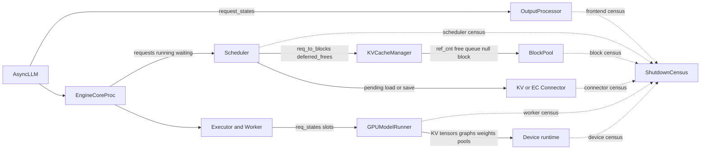
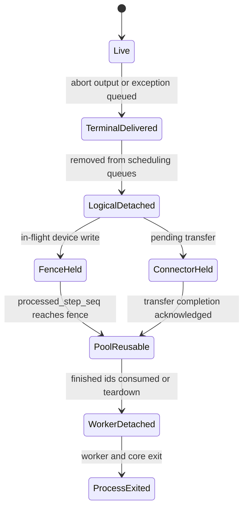

> 源码基线：[`6cbb3c15`](https://github.com/vllm-project/vllm/commit/6cbb3c154ef1449d2b3c9131a237f36faa695734)，提交时间为 2026-09-05（北京时间）。该提交优化 GDN CUDA Graph capture metadata，与本文 shutdown 路径无直接修改；所有结论均按该 commit 的已合入代码逐文件核对。本文提出的 `ShutdownCensus` 是基于不变量的设计推导，不代表上游已有实现或计划。

## 本篇在课程路线中的位置

第 23 章已经划清释放所有权，第 24 章又说明 cleanup 可能被前序异常截断。本篇进入下一层：即使每个 `shutdown()` 都返回，怎样证明资源真的到了可接受终态？

课程位置是：

`shutdown ownership → cleanup fault isolation → owner-specific resource census`

本篇只聚焦 V1 Python 主链的五类余额，不把“进程退出后 OS 最终回收地址空间”混入进程内证明。

## 前置知识回顾

此前确认了两个容易混淆的事实：

1. `shutdown_timeout=0` 仍会先走 `Scheduler.finish_requests(None, FINISHED_ABORTED)`；
2. 父进程最终等待的是 EngineCore/Worker 退出，不是 KV refcount、Connector job 或 Worker slot 的逐项回执。

所以 census 不能只有一个 `success: bool`。最少要回答：谁拥有资源、什么计数表示可复用、异步写是否已经静默，以及证据是在对象仍存活时采集还是只能靠进程死亡推断。

## 本篇要回答的核心问题

1. 前端 collector、Scheduler request、KV block、Connector job 和 Worker/device state 各自怎样才算“归零”？
2. 为什么异常已投递、`requests == 0`、`KV usage == 0`、显存下降和进程退出不能互相替代？
3. 当前代码已经暴露了哪些可核对字段，哪几层仍只能得到弱证据？

## 组件在全局架构中的位置



这里有三个进程边界：API/frontend、EngineCore、Worker。一个统一 census 必须让各 owner 在自身进程尚可响应时生成局部快照，再由父层聚合；Core 已被 `SIGKILL` 后，Python dict 的精确余额不可能补采。

## 完整调用链

公开入口 [`AsyncLLM.shutdown()`](https://github.com/vllm-project/vllm/blob/6cbb3c154ef1449d2b3c9131a237f36faa695734/vllm/v1/engine/async_llm.py) 先关闭 renderer，再调用 `engine_core.shutdown(timeout)`，最后取消 `output_handler`。它没有遍历 `OutputProcessor.request_states` 做 abort 或清空。

多进程 Core 收到 shutdown 后进入 [`EngineCoreProc._handle_shutdown()`](https://github.com/vllm-project/vllm/blob/6cbb3c154ef1449d2b3c9131a237f36faa695734/vllm/v1/engine/core.py)。立即模式调用：

```text
Scheduler.finish_requests(None, FINISHED_ABORTED)
→ _send_abort_outputs
→ has_work() 持续检查
→ 无剩余工作后退出 busy loop
→ EngineCore.shutdown
→ Executor.shutdown
→ Scheduler.shutdown
→ distributed cleanup
```

[`Scheduler.finish_requests()`](https://github.com/vllm-project/vllm/blob/6cbb3c154ef1449d2b3c9131a237f36faa695734/vllm/v1/core/sched/scheduler.py) 先从 `running/waiting` 移除请求，再调用 `_free_request`。后者先通知 Connector 与 encoder cache；只有 Connector 不要求延迟时才进入 `_free_blocks`。若 device 上仍有会写该请求状态块的 step，`pop_blocks_for_free()` 先删除 request-to-block 账本，把 block 放入 `deferred_frees`，直到对应 `sched_step_seq` 的输出被处理后才归还 `BlockPool`。

Worker 的正常释放不是 Core dict 删除的自动副作用。[`GPUModelRunner.finish_requests()`](https://github.com/vllm-project/vllm/blob/6cbb3c154ef1449d2b3c9131a237f36faa695734/vllm/v1/worker/gpu/model_runner.py) 消费 `SchedulerOutput.finished_req_ids`，按一致顺序执行 `_remove_request`，依次移除 model-specific state、`req_states`、pooling、PP、encoder、prompt-logprob 与 LoRA 状态。停机最终还会调用 `GPUModelRunner.shutdown()`：先 `torch.accelerator.synchronize()`，再断开 graph、KV cache、model 等引用并 `empty_cache()`。

## 关键类型、字段和状态生命周期

| 层次 | 当前可观察字段 | 强终态 | 不能由它证明的事 |
| --- | --- | --- | --- |
| frontend | `request_states`、`parent_requests`、`external_req_ids`、collector queue | 三个 registry 一致为空；每个 collector 收到唯一终态 | `queue.put(exception)` 只保证唤醒，不保证 registry 已删 |
| Scheduler | `requests`、`running`、`waiting`、`skipped_waiting`、`deferred_frees` | 所有 request container 为空，deferred fence 已排空 | `requests==0` 不证明 Worker 已消费 finished IDs |
| KV pool | 每块 `ref_cnt`、free queue、request block table、prefix hash | 非 null block 无活跃 ref，free queue 成员关系一致 | hash 仍在不一定是泄漏；cached block 可以同时可驱逐且 free |
| Connector | request 延迟释放、收发完成集合、实现私有 task/transfer | 无 request-owned job，线程/transport 已静默 | `Scheduler.shutdown()` 返回值为 `None`，没有统一 job 余额 |
| Worker/device | `req_states`、slot mapping、KV tensors、graphs、allocator pools | 无活跃 slot；device 静默；owner ref 已断开 | `empty_cache()` 或显存下降不证明正常逐项 cleanup |

[`OutputProcessor.propagate_error()`](https://github.com/vllm-project/vllm/blob/6cbb3c154ef1449d2b3c9131a237f36faa695734/vllm/v1/engine/output_processor.py) 是最典型的弱终态：它只对每个 `RequestState.queue` 执行 `put(e)`；真正删除 `request_states` 的是 `_finish_request()` 或 `abort_requests()`。因此“所有 generator 都被异常唤醒”和“frontend registry 为零”是两个独立断言。

KV 层也不能只看 prefix hash。[`BlockPool`](https://github.com/vllm-project/vllm/blob/6cbb3c154ef1449d2b3c9131a237f36faa695734/vllm/v1/core/block_pool.py) 的 free queue 同时容纳普通 free block 与 `ref_cnt==0` 的 cached block；后者在再次分配时才驱逐 hash。另有一个 `null_block` 被永久移出 free queue。因此若 `num_gpu_blocks=17`，无请求占用时预期 free count 是 16，而不是 17；`reset_prefix_cache()` 也把“仅 null block 被使用”作为成功条件。

## 逐函数源码解读

### `finish_requests`：terminal status 不等于物理 block 已可复用

Scheduler 将请求状态改为 finished 并从可调度队列移除，但 `_free_request_blocks` 会比较该请求最新 scheduled step 与 `processed_step_seq`。若 GPU 仍可能写入，block 进入 `deferred_frees`。这是 2026-06-16 合入的 [修复提交 `d467a2a7`](https://github.com/vllm-project/vllm/commit/d467a2a7f2f088dd360c7bef2f3cf5c59a1ffde8) 所建立的安全边界：逻辑取消必须早于物理复用，但不能驱使物理复用越过 device completion fence。

### `_free_request`：Connector 可以延长 request 的“尸体期”

Connector 的 `request_finished` 返回 `delay_free` 时，Scheduler 已把请求标成 finished，却不会立刻执行 `_free_blocks`。[`Scheduler.has_requests()`](https://github.com/vllm-project/vllm/blob/6cbb3c154ef1449d2b3c9131a237f36faa695734/vllm/v1/core/sched/scheduler.py) 还会把 delayed cleanup 和 pending push work 视为工作，使 Core 继续给后台线程让出进度。于是 `Request.is_finished()` 与 `request_id not in scheduler.requests` 仍不是同一时刻。

### `GPUModelRunner.shutdown`：释放引用，不生成余额证明

[`GPUModelRunner.shutdown()`](https://github.com/vllm-project/vllm/blob/6cbb3c154ef1449d2b3c9131a237f36faa695734/vllm/v1/worker/gpu/model_runner.py) 的顺序很合理：先 synchronize，随后清 graph manager、KV cache、attention groups、encoder runner、model state 和 model，最后 GC 与 accelerator cache。它解决“同进程重建 Engine 时引用仍把显存挂住”的问题，但接口返回 `None`，也没有在删除前记录 active request/slot/tensor bytes。因此它是 teardown 动作，不是 census 回执。

## 具体示例与 shape/状态演算

设 block size 为 16 tokens，BlockPool 有 17 个物理块，其中 1 个是 null block；可分配块共 16 个。两个请求均为 `bf16` KV，设备 tensor 的具体 layout 由 attention backend 决定，本例只跟踪逻辑 block ID：

- `R0` prompt 33 tokens，占 3 blocks；最新 step sequence 为 2，仍在执行；
- `R1` 占 2 blocks，Connector 正在异步保存并要求 delayed free；
- frontend 有两个 collectors，Worker 有两个 request slots。

初始 free count 为 `16 - 3 - 2 = 11`。



| 时刻 | frontend states | Scheduler requests | deferred blocks | Connector-held blocks | free blocks | 能证明什么 |
| --- | ---: | ---: | ---: | ---: | ---: | --- |
| shutdown 前 | 2 | 2 | 0 | 0 | 11 | 两请求均活跃 |
| abort 已发送 | 2 或稍后由 generator 清理 | 1 | 3 | 2 | 11 | 不再调度；五块都尚不可复用 |
| step 2 completion | 不独立保证 | 1 | 0 | 2 | 14 | `R0` 三块安全归还 |
| Connector ack | 不独立保证 | 0 | 0 | 0 | 16 | Scheduler/KV 逻辑余额闭合 |
| ModelRunner teardown | 取决于 frontend 自身 | 0 | 0 | 0 | 16 | Worker 引用被断开并尝试回收 device memory |

这个演算最重要的地方是顺序：把 free count 在第一行就恢复到 16 会让 `R0` 的旧 GPU write 与新请求重用发生竞态；只看到最后 free count 为 16，又不能反推出 frontend collectors 已删除或 Worker slot 是通过正常 `finished_req_ids` 路径释放。

## 为什么这样设计及替代方案

当前分散字段的优点是热路径便宜：每个 owner只维护执行本身需要的账本，不为 shutdown 引入跨进程统计协议。代价是故障时只能拼接日志，无法判断“未采样”“余额未闭合”还是“owner 已死亡”。

把 `torch.cuda.memory_allocated()` 当统一指标更简单，却混淆 allocator cache、模型权重、KV tensor 和 request ownership；进程退出后数值归零也丢失了清理路径证据。

更小而可实施的替代是只在 quiescing 阶段生成不可变 `ShutdownCensus`：

```text
frontend = {active_states, parents, external_ids, terminal_deliveries}
scheduler = {requests, running, waiting, skipped, deferred_frees}
kv = {usable_total, free_count, live_ref_blocks, request_tables}
connector = {pending_loads, pending_saves, stopped}
worker = {active_slots, in_flight_batches, device_synchronized, teardown_done}
```

每项还要携带 `owner/rank/monotonic_timestamp/status`，其中 `status` 至少区分 `observed`、`unavailable`、`timed_out`。父进程不能在 Worker 被杀后伪造一个全零快照；它只能记录 `process_exited`，并把缺失的进程内 census 标成 unavailable。

## 性能、并发、正确性与边界条件

- census 不应扫描或复制 KV tensor 内容；计数 `ref_cnt`、block IDs 与 task 数即可，否则 shutdown 延迟与日志量会随显存容量增长。
- 快照只能在 admission 关闭后采集，否则前端与 Core 的计数天然跨时刻；跨进程需要 epoch 或 shutdown generation，不能假设多个 RPC 是原子的。
- `free_count` 是必要非充分条件：还应验证非 null block 的 `ref_cnt`、free queue membership 和 request table 之间守恒，避免重复入队或孤儿 block 被计数掩盖。
- device synchronize 是“无后续写”的强证据，但可能 hang；超时后的状态应是 `completion_unknown`，不能写成安全复用。
- prefix cache hash 可以在 request ref 归零后保留，这是正常可驱逐缓存，不应被 census 误报为泄漏。
- CUDA Graph、allocator reserved bytes 和模型权重属于 Engine 生命周期，不应要求在正常 request drain 时归零；只有 full shutdown 才要求 owner ref 断开。

## 测试证据与未覆盖风险

直接测试 [`tests/v1/core/test_deferred_block_free.py`](https://github.com/vllm-project/vllm/blob/6cbb3c154ef1449d2b3c9131a237f36faa695734/tests/v1/core/test_deferred_block_free.py) 给出了最强局部证据：33-token prompt 在 block size 16 下占 3 blocks；abort 发生于多个 in-flight steps 时，`deferred_frees` 保持 1 项、free count 不变，只有 newest fence 的 output 被处理后队列清空并恢复初始 free count。双请求测试还验证两个 deferred entry 能在同一 fence 后一起归还。

[`tests/v1/core/test_prefix_caching.py`](https://github.com/vllm-project/vllm/blob/6cbb3c154ef1449d2b3c9131a237f36faa695734/tests/v1/core/test_prefix_caching.py) 覆盖 cached block 的 refcount/free queue 行为，说明“仍有 prefix hash”不能直接等价成“仍被请求占用”。

但当前没有一条测试从 `AsyncLLM.shutdown()` 开始，同时断言：两个 collector 收到唯一终态并从 registry 删除、Scheduler 五个 container 为空、Connector job 为零、BlockPool 守恒、各 rank Worker slot 为零、device synchronize 成功且 allocator 到预期基线。现有 ModelRunner exception E2E 的显存阈值只提供粗粒度设备证据；也没有测试证明 `propagate_error()` 后 frontend registry 自动归零，因为代码本身没有执行这个后置条件。

## 与前后章节的连接

第 24 章要求结构化 `ShutdownReport`；本章给出了 report 中真正可验证的 payload，并指出哪些项必须在进程仍活着时采集。下一章将进入 fault injection：让某个 owner 抛错或 hang，检查 census 是否保留已观测项、正确标记 unavailable，并且不延长父进程 kill deadline。

## 本篇结论、知识债、三个理解检查问题和下一章

结论：shutdown 的资源正确性是一个向量，不是单个布尔值。当前 V1 已有足以构造 Scheduler/KV 局部 census 的账本，却没有统一聚合接口；frontend error delivery、Connector teardown、Worker state 和 device allocation 尤其缺少强回执。最严格的原则是：只报告 owner 实际观测到的终态，进程退出只能证明隔离边界关闭，不能补写进程内余额。

知识债：不可变 census schema、跨进程 generation、BlockPool 守恒检查、Connector 通用 pending-job 接口、各 rank Worker slot/flight 统计、device quiescence 状态，以及 SIGTERM/SIGKILL 下的 partial report 持久化。

理解检查：

1. `OutputProcessor.propagate_error()` 已唤醒所有 generator，为什么 `request_states` 仍可能非空？
2. 为什么 17-block pool 在无请求时 free count 应是 16？prefix hash 未清空是否一定表示泄漏？
3. 若 `requests==0` 但 `deferred_frees` 非空，立刻复用这些 blocks 会破坏哪条正确性不变量？

下一章：**Shutdown census fault injection——在 Executor、Connector 或 device synchronize 失败时，怎样保留 partial evidence、标记 completion unknown，并遵守同一个 kill deadline。**

## 课程账本增量

- 新增章节：25。
- 新覆盖：`OutputProcessor.request_states/propagate_error/_finish_request`、`EngineCoreProc._handle_shutdown`、`Scheduler.finish_requests/_free_request/_free_request_blocks/deferred_frees`、`BlockPool.ref_cnt/free_block_queue/null_block`、`GPUModelRunner.finish_requests/_remove_request/shutdown`。
- 新确认不变量：异常投递不等于 frontend registry 清空；finished status 不等于 block 可复用；无请求时 free count 要扣除 null block；prefix hash 与 request ownership 不等价；进程退出不能伪造进程内 census。
- 新知识债：统一 `ShutdownCensus`、跨进程 generation、Connector job 和 Worker/device 强回执、全链故障注入。
- 下一章：shutdown census fault injection。
