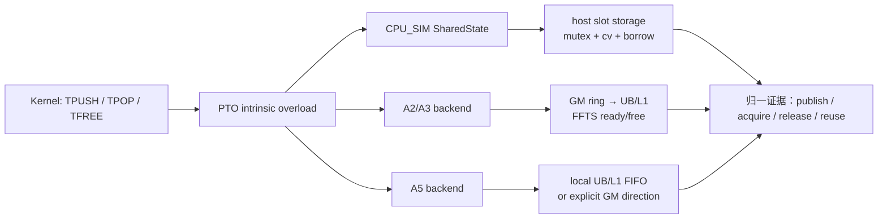
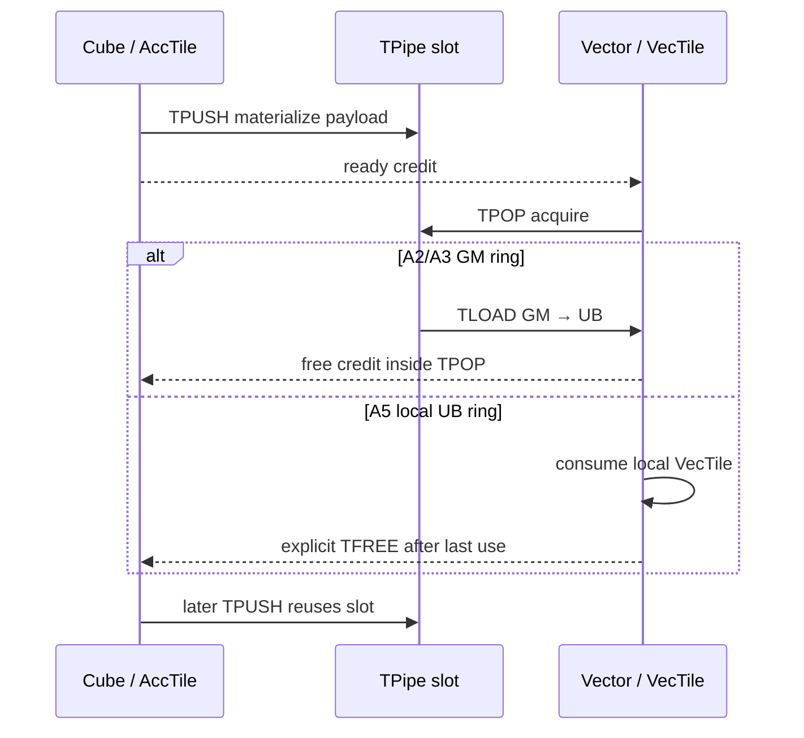

## 本篇在 PTO 课程路线中的位置

第 25 章建立了 CPU_SIM `TPipe` FIFO 状态机；第 26 章又为 missing pop/free、方向错误推导了 bounded wait、snapshot-before-cancel 和 FIFO census。本篇回答下一层问题：**这些主机状态如何与 A2/A3、A5 真机的 ready/free flag 和 GM/UB/L1 slot 对齐？**

课程位置：

```text
CPU_SIM bounded fault evidence
→ A2/A3/A5 语义归一与可比边界（本篇）
→ DIR_BOTH early-exit / cross-dispatch generation
```

分析基于 pto-isa 默认分支 [`a8040450`](https://github.com/hw-native-sys/pto-isa/commit/a8040450238f162985d8b596fbebeb54bfba2bf5)。本篇只选择 pto-isa，因为差异发生在 ISA backend 和设备测试；不需要引入 PTOAS lowering。

## 前置知识

CPU_SIM 把协议状态显式保存在 `SharedState`：slot 是否 `occupied/busy`、提交方向、pending borrow、commit sequence 和 waiter 都能被主机读取。一个 slot 从 `record` 发布到最后一次 `free` 前不可复用。

但硬件 backend 没有同构的 C++ 状态表。它们把协议编码进：

- payload 所在的 GM、UB 或 L1 地址；
- `FlagID` 派生的 ready/free 同步 ID；
- `prod.tileIndex`、`cons.tileIndex` 和 `SyncPeriod`；
- 不同 pipeline 上的 `set/wait` 操作。

因此要比较的是抽象所有权事件，而不是要求三个 backend 暴露同名字段。

## 今日 1–2 个核心问题

1. A2/A3 和 A5 的 TileData 路径究竟在何时交还 FIFO slot？
2. CPU_SIM 的 `occupied/busy/waiter` 应怎样映射到真机证据，哪些字段根本不能一一对应？

## PTO 全栈中的位置

上游 kernel 只写 `TPUSH → TPOP → TFREE`，模板参数给出 `Direction`、`SlotSize`、`SlotNum`、`LocalSlotNum` 和 split 方式。下游 backend 决定 payload 是经 GM 中转还是直接进入消费者本地存储，以及 ready/free 用哪条设备 pipeline 发送。



## 概念和精确语义

跨后端可移植的最小状态不是 `occupied=true/false`，而是四个事件：

1. `publish(seq, direction)`：生产数据完成到足以通知消费者；
2. `acquire(seq)`：消费者等到 ready，并取得正确 payload；
3. `release(seq)`：消费者最后一次使用之后，发出可复用许可；
4. `reuse(seq + SlotNum)`：生产者收到足够 free credit 后覆盖环形槽位。

三种 backend 的落地并不相同：

| 维度 | CPU_SIM TileData | A2/A3 TileData | A5 本地 TileData |
|---|---|---|---|
| payload | Host `SharedState` slot storage | GM ring，中转到 UB/L1 | C2V 进入 UB；V2C 进入 L1 |
| ready | `record` + condition variable | `ffts_cross_core_sync` / `wait_flag_dev` | `set_intra_block` / `wait_intra_block` |
| release 点 | 显式 `TFREE`，最后一个 borrow 才释放 | `TPOP` 内部在稀疏周期发送 free；TileData `TFREE` 空操作 | 本地路径 `TPOP` 不释放；显式 `TFREE` 发送 free |
| 可观测状态 | slot、方向、borrow、waiter | 公开代码只有 cursor/静态规则；flag 动态值不可直接 census | 同左；另有构造/析构 credit 协议 |

这张表给出本篇最关键的反例：**“删除一条 `TFREE`”在 CPU_SIM 和 A5 本地 FIFO 上会留下 borrow/free 缺口，但在 A2/A3 TileData 上不会，因为它本来就是 no-op。** 同一源码操作不是同一物理故障。

## 真实文件、类型、API 或指令逐段解读

### `RingFIFO` 只描述地址盒子

[`include/pto/common/fifo.hpp`](https://github.com/hw-native-sys/pto-isa/blob/a8040450238f162985d8b596fbebeb54bfba2bf5/include/pto/common/fifo.hpp) 保存：

- `GM_SLOT_BUFFER`：全局内存 ring；
- `C2V_CONSUMER_BUF`：vector 侧 UB 基址；
- `V2C_CONSUMER_BUF`：cube 侧 L1 基址；
- `SLOT_SIZE/SLOT_NUM/LOCAL_SLOT_NUM`。

它没有动态 owner 字段。`tileIndex % SlotNum` 选择物理 slot，正确性依赖同步协议保证覆盖前已收到 release。

### A2/A3：TileData 的 release 已合并进 `TPOP`

[`a2a3/TPush.hpp`](https://github.com/hw-native-sys/pto-isa/blob/a8040450238f162985d8b596fbebeb54bfba2bf5/include/pto/npu/a2a3/TPush.hpp) 中：

- C2V ready 使用 `FlagID`，free 使用 `FlagID+1`；
- `DIR_BOTH` 的 V2C ready/free 再使用 `FlagID+2/+3`；
- `shouldWaitFree(i)` 在启动窗口 `i < SlotNum` 时不等，之后每 `SyncPeriod` 消费一次 credit；
- `shouldNotifyFree(i)` 每 `SyncPeriod` 产生一次 credit。

[`a2a3/TPOP_IMPL`](https://github.com/hw-native-sys/pto-isa/blob/a8040450238f162985d8b596fbebeb54bfba2bf5/include/pto/npu/a2a3/TPop.hpp) 的顺序是 `wait ready → 从 GM load 到消费者本地 tile → 条件性 free → cons.tileIndex++`。而 [`a2a3/TFree.hpp`](https://github.com/hw-native-sys/pto-isa/blob/a8040450238f162985d8b596fbebeb54bfba2bf5/include/pto/npu/a2a3/TFree.hpp) 对 TileData 直接返回；只有 GlobalData view 必须显式 `TFREE`。

所以 A2/A3 的 GM slot lifetime 到 `TPOP` 搬运结束为止，后续计算持有的是 UB/L1 本地副本，不再借用 GM ring。公开头文件能证明 free 调用位于 load 之后；具体设备 pipeline 的完成顺序仍应由 ISA/设备 trace 验证，不能只靠 C++ 行序推断。

### A5：先区分 local direction 和 GM direction

[`a5/TPush.hpp`](https://github.com/hw-native-sys/pto-isa/blob/a8040450238f162985d8b596fbebeb54bfba2bf5/include/pto/npu/a5/TPush.hpp) 把方向细分为 `DIR_C2V/DIR_V2C` 本地 FIFO 与 `DIR_C2V_GM/DIR_V2C_GM` GM FIFO。

- C2V local：`TMOV` 把 Acc 数据放到 vector UB ring；
- V2C local：`TINSERT` 把 vector 数据组合进 cube L1 ring；
- GM direction：仍使用 `GM_SLOT_BUFFER` 和显式地址计算。

consumer `pop()` 对本地 Vec/Mat FIFO 返回 `false`，使 [`a5/TPOP_IMPL`](https://github.com/hw-native-sys/pto-isa/blob/a8040450238f162985d8b596fbebeb54bfba2bf5/include/pto/npu/a5/TPop.hpp) 不发送 free；[`a5/TFREE_IMPL`](https://github.com/hw-native-sys/pto-isa/blob/a8040450238f162985d8b596fbebeb54bfba2bf5/include/pto/npu/a5/TFree.hpp) 才在最后一次使用后释放。GM TileData `pop()` 则返回 `true`，允许 `TPOP` 内部发送 free。

A5 还有第二层差异：split 模式会对 vector subcore 使用 `FlagID + 16` 的 intra-block ID；local no-split 与其他模式采用不同的构造/析构 credit 平衡。前者依赖启动窗口并在析构时计算残余 credit；后者构造时预置 `SyncPeriod` 个 free，析构时再消费对应 credit。因此只看最终 `prod.tileIndex == cons.tileIndex` 仍不足以证明 flag 已回到可复用基线。

## 对象/Tile/Buffer/IR 生命周期

以 C2V 为例，生产者的 `AccTile`、传输 slot 和消费者 `VecTile` 是三个不同 owner：



CPU_SIM 则把 payload 和控制状态都放入共享 Host slot；它需要显式 `TFREE` 结束 borrow，目的是保守模拟“消费者仍在持有 entry”。这更接近 A5 local lifetime，不是 A2/A3 TileData 的逐句模拟。

## 端到端调用链或指令链

真实 kernel 的公共链路是：

```text
Cube/Vector 产生 Tile
→ TPUSH_IMPL: wait free → materialize → publish ready
→ TPOP_IMPL: wait ready → acquire/materialize consumer Tile
→ consumer compute/store
→ TFREE_IMPL（是否真正发 free 由 backend/path 决定）
→ producer 在环绕点收到 free 后复用 slot
→ TPipe destructor drain residual credits
```

故障定位必须回答“卡在哪一个抽象事件”：没有 publish、没有 acquire、没有 release，还是析构在等待不存在的 residual credit。仅有 `aclrtSynchronizeStream` 超时只能证明设备未收敛，不能区分四者。

## 具体 shape、Tile 和状态演算

采用 A2/A3 与 A5 都有的 `tpushpop_dir_both` 测试：`M=128, K=64, N=128, f32, FIFO_DEPTH=2, TILE_UP_DOWN`。

流程是：两个 vector subcore 各产生 `C[M/2,K]=[64,64]`，V2C 合成 `[128,64]`；Cube 与 `D[64,128]` 做 matmul 得到 `E[128,128]`；再 C2V 拆成两个 `[64,128]` 给 vector。

### A2/A3

- C2V 一个完整 `E` slot 为 `128×128×4 = 65536 B`，位于 GM；
- 每个 vector 通过 `TPOP` 把自己的 `64×128×4 = 32768 B` 半区搬入 UB；
- 当 consumer index 命中 `SyncPeriod` 边界时，free credit 已在 `TPOP` 内发送；后续显式 `TFREE` 不改变状态；
- `DIR_BOTH` 的两条 GM ring 通过 `entryOffset` 分开，否则同一个 modulo slot 会互相覆盖。

### A5 local

- C2V payload 直接 materialize 到 UB，单个 vector lane 的逻辑条目为 `32768 B`；
- `TPOP` 取得 UB slot，但返回 `reqFree=false`；
- vector 做完后调用 `TFREE`，才在 free flag 上归还 capacity；
- V2C 同理，但 payload 位于 L1，两个 subcore 的输入由 `TINSERT` 组合。

若故障注入“vector 在 `TPOP` 后 early-exit”：

| backend | 直接结果 | 应观察的故障证据 |
|---|---|---|
| CPU_SIM | pending borrow 未释放，`occupied` 不降 | slot + direction + borrow owner + waiter |
| A2/A3 TileData | GM slot 已在 `TPOP` 内归还；丢失的是后续业务计算，不是 FIFO free | 输出 poison/缺失；不能期待 free stall |
| A5 local | free credit 不产生，生产者在容量耗尽后等待 | ready/free flag trace、停顿 pipeline、最后成功 seq |

这说明跨后端 fault matrix 应注入抽象故障“禁止 release event”，而不是机械删除同一行源码。A2/A3 要在 `TPOP` 内的 free 分支阻断；A5 local/CPU_SIM 才是跳过 `TFREE`。

## 为什么这样设计及替代方案

A2/A3 经 GM 中转，`TPOP` 把数据复制到消费者本地后即可尽早归还 GM slot，缩短 ring 占用；代价是 release 与 acquire 绑定，kernel 不能把 GM view 借用延长到任意后续点。

A5 local FIFO 避免 GM round trip，减少全局访存，但消费者直接占用 UB/L1 slot，必须把 release 延迟到最后一次使用。显式 `TFREE` 增加编程和 verifier 负担，却表达了真实 local SRAM ownership。

替代方案一是强制所有 backend 都让 `TFREE` 生效，接口最统一，但 A2/A3 会把本可提前复用的 GM slot 无谓延长到计算尾部。替代方案二是让 CPU_SIM 按 target 精确复制每个 backend 的细节，能提高故障复现忠实度，却会失去一个可移植的参考语义并增加维护分叉。

更小而可靠的方案是保留统一源码 API，同时让测试 harness 按抽象事件注入，并输出统一 trace：

```text
generation, direction, seq, payload_domain,
publish_observed, acquire_observed, release_observed,
blocked_site, terminal_reason
```

backend-specific adapter 负责把 CPU slot、A2/A3 FFTS flag、A5 intra-block flag 转成这些事件。无法读取的项必须是 `unknown`，不能补零。

## 访存、计算、流水、并行和硬件约束

- A2/A3 TileData 路径增加 GM store/load 流量，但可以在本地副本形成后较早复用 GM slot。
- A5 local 路径省去 GM 往返，却用 `SlotNum × SlotSize` 的 UB/L1 容量换流水并发；missing free 会直接耗尽稀缺本地 SRAM ring。
- `SyncPeriod` 决定 credit 粒度。历史 [Issue #172](https://github.com/hw-native-sys/pto-isa/issues/172) 在 A3 Flash Attention、`SlotNum=8` 上显示，把周期从 8 改为 4 可恢复大序列约 10% 的性能；这是特定硬件和 workload 的实验事实，不是通用最优值。
- 每 tile 全量记录 trace 会扰动同步热路径。建议编译期 debug 开关和有界 device ring，只记录状态转换与 sequence，性能评测仍使用无插桩版本。
- `FlagID` 只有有限域，`DIR_BOTH` 占用两组 ready/free；split subcore 又引入 target-specific ID 映射。不同 pipe 复用 ID 前必须先证明上一 generation 已 drain。

## 测试证据与未覆盖风险

当前直接证据分三层：

1. [`A2/A3 tpushpop_dir_both`](https://github.com/hw-native-sys/pto-isa/blob/a8040450238f162985d8b596fbebeb54bfba2bf5/tests/npu/a2a3/src/st/testcase/tpushpop_dir_both/tpushpop_dir_both_kernel.cpp) 与 [`A5 对应测试`](https://github.com/hw-native-sys/pto-isa/blob/a8040450238f162985d8b596fbebeb54bfba2bf5/tests/npu/a5/src/st/testcase/tpushpop_dir_both/tpushpop_dir_both_kernel.cpp) 都覆盖 `128×64×128, f32` 的双向数值结果；A5 代码显式 `TFREE`，A2/A3 没有。
2. [`A2/A3 no-split 回归`](https://github.com/hw-native-sys/pto-isa/blob/a8040450238f162985d8b596fbebeb54bfba2bf5/tests/npu/a2a3/src/st/testcase/tpushpop_cv_nosplit/main.cpp) 以 depth 8、40 transfers、连续 80 dispatch 检测 stale/过量 credit；当前 `countPendingFreeCredits(40)` 应为 2。
3. [PR #240 的验证记录](https://github.com/hw-native-sys/pto-isa/pull/240) 报告 Qwen A2/A3 原失败路径从析构固定等待 4 个 credit 改为只等待 2 个后，单次与连续三次通过，并对 `SlotNum=1..64、transfer=0..1024` 做账本穷举。它是历史实验记录；本文没有把它冒充为本次重新上板结果。

现有 NPU ST 的主要断言仍是 `aclrtSynchronizeStream` 返回和最终 tensor golden。尚未直接覆盖：missing ready/free 的 bounded negative test、每个 flag 的 set/wait 序列、early-exit 后 residual credit、同 `FlagID` 无 reset 跨 dispatch、A2/A3 与 A5 的归一 trace parity，以及真实 timeout 时区分“等待 ready”和“等待 free”。

## 与前后章节的连接

- 第 25～26 章给 CPU_SIM 建立状态机和 census；本篇限定了哪些状态可迁移到真机。
- 第 21～24 章的 flag allocation 与 component balance 只证明静态身份/路径数量；本篇说明动态执行仍需 generation 和设备事件证据。
- 下一章把 `DIR_BOTH + early-exit + cross-dispatch` 放进同一故障矩阵，并在正常新章节后追加课程 22～28 的第四次知识图谱回顾。

## 本篇结论、知识债、三个理解检查问题和下一章

结论：CPU_SIM、A2/A3 与 A5 可以共享 `publish/acquire/release/reuse` 不变量，不能共享逐字段实现。尤其是 TileData `TFREE`：A2/A3 为 no-op，A5 local 与 CPU_SIM 才真正延长 slot borrow。跨后端测试必须注入抽象事件缺失，并允许无法观测的状态为 `unknown`。

知识债：A2/A3/A5 device trace adapter、ready/free flag 的 generation 标识、GM/local 路径联合矩阵、故障时 bounded termination、插桩开销测量，以及 A5 GM TileData 与 GlobalData 的 release 组合测试。

理解检查：

1. 为什么 A2/A3 在 `TPOP` 后继续计算时，GM slot 可以复用而消费者结果仍然正确？
2. A5 local 路径中 `TPOP` 已返回，为何生产者仍可能因缺少 `TFREE` 而阻塞？
3. 如果设备只能报告“stream timeout”，至少还要记录哪些 sequence/flag 事件，才能判断缺的是 ready 还是 free？

下一章：**DIR_BOTH early-exit 与跨 Dispatch generation——如何防止一侧残余 ready/free credit 污染下一次同 FlagID 执行。**

## 课程账本增量

- 章节：27
- 日期：2026-09-06
- 选定仓库：pto-isa
- 源码基线：`a8040450238f162985d8b596fbebeb54bfba2bf5`
- 新覆盖：A2/A3 与 A5 `TPush.hpp/TPop.hpp/TFree.hpp`、`RingFIFO`、两端 `tpushpop_dir_both`、A2/A3 depth-8 repeated-dispatch 回归
- 新确认不变量：跨后端只比较 publish/acquire/release/reuse；A2/A3 TileData release 位于 `TPOP`，A5 local/CPU_SIM 位于显式 `TFREE`；计数相等不证明 flag generation 已清空
- 待验证推断：头文件中 pipeline 行序对应的设备完成关系，需要 device flag/slot trace 证实
- 下一章：DIR_BOTH early-exit、generation 与跨 dispatch 残余检测
