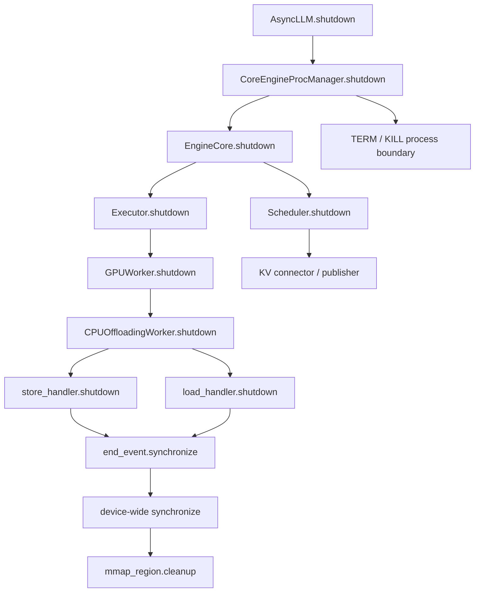
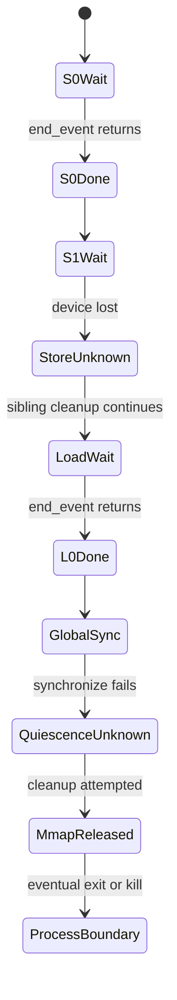

> 源码基线：[vLLM `f4eccdad`](https://github.com/vllm-project/vllm/commit/f4eccdadefc6501fafeb1a0bf7f171ff24f984b0)。它是截至 2026-09-06 课程研究时默认分支的最新提交；该提交本身与 shutdown 无关。本文以已经合入的代码和测试为事实依据，设计建议会明确标为推导。

## 本篇在课程路线中的位置

第 23～25 章依次回答了“谁拥有资源”“cleanup 抛错后谁还会运行”和“正常终态应该数什么”。本篇向前一步：主动在 Executor、KV offload 与 device synchronize 上制造失败，检验 census 是否仍有解释力。

课程位置是：

```text
shutdown ownership
→ owner-specific resource census
→ fault injection / partial evidence（本篇）
→ durable ShutdownReport wire protocol
```

核心结论先说：**容器长度归零只证明本地 bookkeeping 被删除，不能证明设备操作已经完成。** 一旦等待设备事件失败，正确状态不是简单的 `0` 或 `clean`，而是 `completion_unknown`。

## 前置知识回顾

上一章把终态拆成 frontend request、Scheduler/KV、Connector、Worker/device 与 process 五层。还确认了两个容易混淆的事实：BlockPool 的无请求基线未必是“全部 block 都 free”；request 完成也不等于最新 device step 已经越过 fence。

本篇继续坚持同一原则：census 必须和 owner、generation、观察时刻以及证据强度绑定。否则 `transfers == 0` 可能表示“全部完成”，也可能只是“异常分支执行了 `clear()`”。

## 本篇要回答的核心问题

1. CPU KV offload 的某个 `end_event.synchronize()` 失败后，哪些 sibling cleanup 仍会执行？
2. `torch.accelerator.synchronize()` 也失败或永久阻塞时，哪些资源可以宣称已安全释放？
3. 如何让 fault injection 输出 partial evidence，而不是用最后一个异常覆盖已获得的事实？

## 组件在全局架构中的位置

正常关闭从前端进入 Core 进程，再逐层走向资源 owner。CPU KV offload 位于 Worker 内：GPU/CPU block copy 已经被排队时，handler 持有 transfer event、临时 tensor view 与 buffer pool；共享 mmap region 由 `CPUOffloadingWorker` 统一持有。



图中箭头不代表所有阶段都必然执行。[`EngineCore.shutdown`](https://github.com/vllm-project/vllm/blob/f4eccdadefc6501fafeb1a0bf7f171ff24f984b0/vllm/v1/engine/core.py) 仍是串行 fail-fast：若 Executor 抛错，后面的 Scheduler 与 distributed cleanup 会被跳过。进程管理器最终可以终止进程，但“进程退出”不是各 owner 正常完成清理的替代证明。

## 完整调用链

公开入口侧，`AsyncLLM.shutdown()` 请求 Core 结束并关闭进程管理器；Core 的 shutdown state machine 先停止接纳工作，在需要时把请求标记为 aborted，待 `has_work()` 为假后退出 busy loop。随后资源路径可概括为：

```text
AsyncLLM.shutdown
→ CoreEngineProcManager.shutdown
→ EngineCore.shutdown
→ MultiprocExecutor / UniProcExecutor.shutdown
→ GPUWorker.shutdown
→ KV offload handler / GPUModelRunner.shutdown
→ Scheduler.shutdown
→ process join，必要时 TERM/KILL
```

[`MultiprocExecutor._ensure_worker_termination`](https://github.com/vllm-project/vllm/blob/f4eccdadefc6501fafeb1a0bf7f171ff24f984b0/vllm/v1/executor/multiproc_executor.py) 先等待 graceful exit，再 TERM，再等待固定的一段时间，最后 KILL。外层 [`_shutdown_subprocesses`](https://github.com/vllm-project/vllm/blob/f4eccdadefc6501fafeb1a0bf7f171ff24f984b0/vllm/v1/utils.py) 会为自己管理的一组进程计算 monotonic deadline。**代码事实：**两层各自管理时间；当前不存在贯穿 frontend、Core、Executor 和 Worker cleanup 的同一个绝对 deadline。

## 关键类型、字段和状态生命周期

[`SingleDirectionOffloadingHandler`](https://github.com/vllm-project/vllm/blob/f4eccdadefc6501fafeb1a0bf7f171ff24f984b0/vllm/v1/kv_offload/cpu/gpu_worker.py) 的关键状态包括：

- `_transfers`：尚待确认完成的 transfer FIFO，每项关联 `end_event`；
- `_transfer_events`：可复用 event；
- `src_tensors` / `dst_tensors`：copy 使用的 tensor view；
- buffer pool：为传输复用的 host/device 缓冲。

`shutdown() -> None` 不接收 shape、dtype 或 device 参数；它消费的是对象此前积累的状态。copy 实现把 block 视作 byte view，因此测试以 page size 和 tensor 数覆盖布局：64 个 GPU block、256 个 CPU block、每页 512/1024 bytes、4 个 tensor，并检查 3 个 mapping。底层 KV 的逻辑 dtype 可以是 `bf16` 等，但 shutdown 关心的是 event 和 byte-addressed storage 的生命周期，而不是元素语义。

成功路径为：等待每个 `end_event`，清空 event/pool/tensor 引用，随后 mmap owner 解除映射。失败路径则不同：第一个 event wait 抛错后，handler 清空剩余 `_transfers` 并保存异常；其他局部容器也会被清空，最后重新抛出原异常。

因此生命周期有三种不可合并的终态：

| 状态 | 可证明的事实 | 不能证明的事实 |
|---|---|---|
| `completed_observed` | 对应 event wait 成功返回 | 其他 transfer 也完成 |
| `metadata_cleared` | Python 队列和引用已删除 | DMA/设备 kernel 已结束 |
| `completion_unknown` | 等待失败，无法取得完成证据 | 操作一定失败或一定仍在运行 |

## 逐函数源码解读

### `SingleDirectionOffloadingHandler.shutdown`

代码在 FIFO 中逐个等待 transfer。若某个 event 抛错，它会记录异常并直接清空尚未遍历的 transfer，避免后续 cleanup 再依赖可能损坏的设备上下文；然后释放 Python 侧 pool 和 tensor 引用，最后重新抛错。

这是一个重要但有限的保证：原始设备错误不会被后续 cleanup 覆盖，本地对象也不会无限保留引用。但跳过的 event 没有完成证明，所以不能把空队列解释成 quiescent。

### `CPUOffloadingWorker.shutdown`

worker 分别在两个 `try` 中关闭 store 与 load handler；一个失败不会阻止另一个获得清理机会。任一 handler 失败时，它还会尝试一次 device-wide `torch.accelerator.synchronize()`，再执行 `mmap_region.cleanup()` 并将字段设为 `None`。

**代码事实：**即使 device-wide synchronize 也抛错，当前实现记录 warning 后仍继续解除 mmap。

**基于证据的推断：**这是偏向“进程正在退出，尽量释放 host backing”的 fail-open 选择；它不能证明未完成 DMA 不再访问这块内存。若进程随后被隔离和终止，OS/driver 可提供最终回收边界，但不是正常 completion acknowledgement。

### `GPUModelRunner.shutdown`

[`GPUModelRunner.shutdown`](https://github.com/vllm-project/vllm/blob/f4eccdadefc6501fafeb1a0bf7f171ff24f984b0/vllm/v1/worker/gpu/model_runner.py) 首先调用 `torch.accelerator.synchronize()`，然后才断开 CUDA Graph、KV cache、attention group、model state 与 weights 的引用并清 allocator cache。同步若抛错，后面的引用清理不会执行；同步若卡在 native 调用里，Python 层也没有机会生成报告。

### `GPUWorker.shutdown` 与 `Scheduler.shutdown`

[`GPUWorker.shutdown`](https://github.com/vllm-project/vllm/blob/f4eccdadefc6501fafeb1a0bf7f171ff24f984b0/vllm/v1/worker/gpu_worker.py) 和 [`Scheduler.shutdown`](https://github.com/vllm-project/vllm/blob/f4eccdadefc6501fafeb1a0bf7f171ff24f984b0/vllm/v1/core/sched/scheduler.py) 顶层仍是串行调用。它们没有统一的 `ShutdownReport`，也不区分“未尝试”“尝试失败”“已观察完成”。这解释了为什么仅在函数末尾采一次 census 会丢失关键过程证据。

## 具体示例与 shape/状态演算

考虑一个缩小的教学例子：store 方向有 `S0、S1、S2` 三个 1024-byte block transfer，load 方向有 `L0`；每个 block 在 copy 层被看成 `int8[1024]` byte view，源位于 GPU，目标位于 CPU mmap/pinned region。真实 KV layout 由 backend 决定，这里只讨论 shutdown 状态。



逐步状态如下：

| 时刻 | store queue | load queue | 可发布证据 |
|---|---:|---:|---|
| 初始 | 3 | 1 | 四项 pending |
| `S0` wait 返回 | 2 | 1 | `S0=completed_observed` |
| `S1` wait 抛错并 clear | 0 | 1 | `S1=completion_unknown`，`S2=not_observed` |
| sibling `L0` 返回 | 0 | 0 | `L0=completed_observed` |
| global sync 失败 | 0 | 0 | `device_quiescence=unknown` |
| mmap cleanup | 0 | 0，mmap=None | `release_attempted`，不能写 `safe_to_reuse` |

最终四个本地计数都可能是零，但证据并不等价于“四次 copy 均完成”。这正是 fault injection 对 census 的价值：它迫使 schema 同时保存数量、状态、错误和观察来源。

## 为什么这样设计及替代方案

当前实现选择“保留首个错误、继续独立 sibling cleanup、最终让进程边界兜底”，维护成本较低，也避免单个 store handler 失败后完全跳过 load handler。

纯 fail-fast 的替代方案能避免在依赖未满足时继续释放 backing memory，却会跳过无依赖资源；无条件 best-effort 又可能把依赖关系错误地当作 sibling。更可靠的最小设计是 cleanup DAG：

1. **record before destroy**：清队列前冻结 transfer ID、方向、最后已观察 event 和 generation；
2. 独立 sibling 全部尝试，异常聚合而不覆盖 root cause；
3. backing resource 只有在 quiescence 被确认后才标记 `safe_released`，否则为 `release_attempted/completion_unknown`；
4. 所有阶段共享 `deadline = started_at + budget`，只消费 `remaining`，不能进入子层后重新获得完整预算；
5. kill 前把 partial report 送到进程外 owner；收不到回执时由进程管理器补写 `killed_without_final_ack`。

这是设计推导，不是当前 vLLM 已实现接口。尤其要注意：给 native synchronize 外面套同进程 Python future 并不能可靠抢占已卡住的 C/CUDA 调用；严格的时间上界仍需要进程级 TERM/KILL。

## 性能、并发、正确性与边界条件

- **延迟：**逐 event 等待能给出细粒度证据，但可能串行拉长 shutdown；device-wide sync 更粗，却能覆盖未逐项观察的工作。
- **吞吐：**正常 steady state 不应持续生成重型 census；可在 shutdown/fatal 路径冻结紧凑摘要，避免污染热路径。
- **显存与 host memory：**删除 tensor 引用只改变可达性，真正释放仍受 stream、allocator pool、CUDA Graph 和 driver 生命周期影响。
- **并发：**snapshot 与 clear 必须受同一 owner 的锁或停止接纳屏障保护，否则报告会混入 shutdown 后新任务。
- **graphability：**shutdown 不在 CUDA Graph 内，但 captured graph 持有的静态 buffer 引用必须在设备 quiescent 后断开。
- **正确性：**`completion_unknown` 不是泄漏结论，也不是成功结论；它是在现有证据下拒绝做更强断言。
- **进程边界：**抛错可以由 Python 捕获，native hang 只能由外层监督者有界处理；SIGKILL 后只能证明进程消失，不能补造逐资源 completion。

## 测试证据与未覆盖风险

直接相关测试位于 [`tests/v1/kv_offload/cpu/test_gpu_worker.py`](https://github.com/vllm-project/vllm/blob/f4eccdadefc6501fafeb1a0bf7f171ff24f984b0/tests/v1/kv_offload/cpu/test_gpu_worker.py)：

- `test_worker_shutdown_releases_region_and_runs_both_handlers` 验证 store、load、region 的调用顺序以及 mmap 字段清空；
- handler 参数化失败测试验证一个方向抛错后另一个方向仍运行，并记录异常；
- `test_handler_shutdown_skips_transfers_after_event_sync_failure` 让第一个 event 抛 `device lost`，验证后续 event 未等待，但 transfer/event/pool/tensor 容器被清空且原错误上抛；
- `test_worker_syncs_before_cleanup_after_handler_failure` 同时覆盖 device sync 成功和失败，验证两种情况下 region cleanup 都会执行。

这些测试来自已合入的 [PR #51622](https://github.com/vllm-project/vllm/pull/51622)（merge commit [`0fec3d65`](https://github.com/vllm-project/vllm/commit/0fec3d652babd3a4a2919ff7b19a35701b298426)）。它们强力证明了 Python 控制流和局部引用收敛，但都是 mock/unit evidence。

仍未覆盖：真实 GPU DMA 未完成时解除 mmap、event 或 device sync 永久挂起、TP/PP 多 rank 的 partial ack、从 `AsyncLLM.shutdown` 到 KILL 的单一绝对 deadline、Connector pending job 与 KV block 守恒联合断言，以及 SIGKILL 前报告是否已经持久化。Executor 的 fake-clock 测试只验证 graceful timeout 后进入 terminate，尚未证明全链共享预算。

## 与前后章节的连接

- 第 24 章提出 sibling cleanup 与依赖 cleanup 必须分开；本篇用 store/load sibling 和 mmap dependency 给出具体反例。
- 第 25 章定义五层 census；本篇增加 `observed/unknown/not_attempted` 状态，使“零”不再丢失语义。
- 下一章将把这些状态落到跨进程 `ShutdownReport`：每个 rank 如何携带 generation、owner、deadline 与 partial acknowledgement，强杀前由谁持久化。

## 本篇结论、知识债、三个理解检查问题和下一章

本篇最重要的结论是：**shutdown 的正确性不能用一张最终计数表表达，而应是一条带证据等级的终态链。** 只有 event/device fence 成功才能支持 completion；`clear()` 只支持 metadata cleared；process exit 只支持隔离终止。

知识债包括：统一 `ShutdownReport` schema、跨 rank generation、可中断或进程隔离的 device wait、Connector/Executor fault matrix、真实 DMA 故障 E2E，以及 kill 前的 durable partial report。

理解检查：

1. 为什么 `_transfers == 0` 与 `device_quiescent == true` 不是同一个不变量？
2. store handler 失败后继续关闭 load handler 是合理的；为什么同样逻辑不能无条件推出 mmap 可以安全解除？
3. 若 Worker 卡在 native synchronize，为什么把下一层 timeout 调小不能保证 frontend 总 shutdown 时间？

下一章：**ShutdownReport wire protocol——用 generation、rank-scoped partial ack 与单一绝对 deadline，把 Core 内证据安全送到进程外。**

## 课程账本增量

- 章节：26
- 日期：2026-09-06
- 当前阶段：测试、性能与故障诊断 / shutdown fault injection
- 源码 commit：`f4eccdadefc6501fafeb1a0bf7f171ff24f984b0`
- 覆盖文件与符号：`EngineCore.shutdown`、`MultiprocExecutor._ensure_worker_termination`、`GPUWorker.shutdown`、`GPUModelRunner.shutdown`、`SingleDirectionOffloadingHandler.shutdown`、`CPUOffloadingWorker.shutdown`、`_shutdown_subprocesses`
- 新确认不变量：metadata 清空不推出设备完成；event wait 失败后的未观察 transfer 必须标记 `completion_unknown`；进程退出不能补写资源级成功
- 测试证据：CPU KV offload handler/worker shutdown fault injection；MP termination fake-clock 边界
- 最高知识债：跨进程、跨 rank、可持久化的结构化 shutdown acknowledgement
- 下一章：ShutdownReport wire protocol
