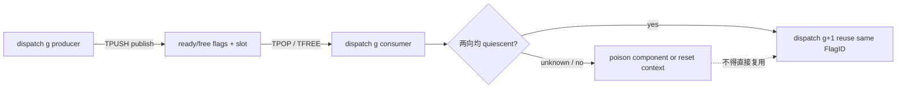
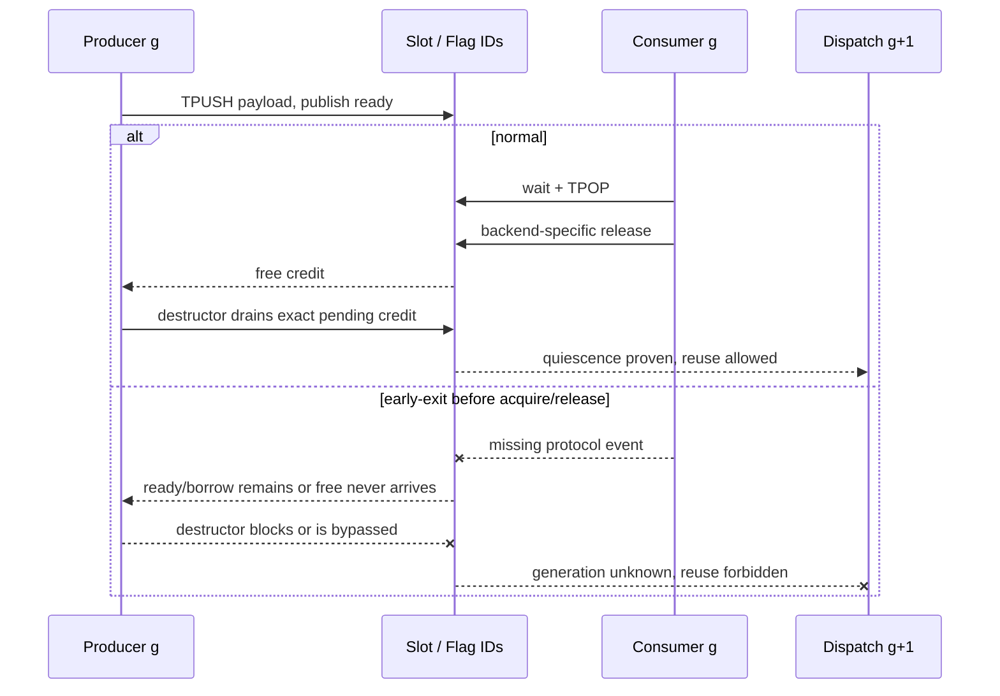

## 本篇在 PTO 课程路线中的位置

第 25～27 章依次建立了 CPU_SIM FIFO 状态机、bounded fault evidence，以及 A2/A3/A5 的 `publish → acquire → release → reuse` 对齐。本篇收束这条 TPipe 主线：**上一轮 dispatch 异常退出后，下一轮为什么不能只凭相同 `FlagID` 继续运行？**

课程位置：

```text
backend-specific release point
→ DIR_BOTH 双信用协议
→ cross-dispatch temporal identity（本篇）
→ 回到 ISA layout / TMOV 合法矩阵
```

分析基于 pto-isa 默认分支 [`a8040450`](https://github.com/hw-native-sys/pto-isa/commit/a8040450238f162985d8b596fbebeb54bfba2bf5)。本篇仍只选 pto-isa：问题发生在 `TPipe` 的设备同步、CPU_SIM 共享状态和直接测试，不需要引入 PTOAS lowering。

## 前置知识

对一条方向为 $d$ 的 FIFO transaction，可以把生命周期写成：

\[
\text{free slot}\xrightarrow{allocate/write/publish}
\text{ready}\xrightarrow{wait/pop}
\text{borrowed}\xrightarrow{release}
\text{free slot}
\]

正常路径上，稀疏 credit batching 不要求每个 entry 都发一次 free flag；但生产者实际消费的 credit 与消费者实际产生的 credit 最终必须配平。析构只 drain **已经按协议产生、尚未被稳态等待消费** 的 credit，不会替缺失的 `TPOP/TFREE` 创造 credit。

## 今日两个核心问题

1. `DIR_BOTH` 为什么不是“一条带方向位的协议”，而是共享一个 `TPipe` 对象的两套 ready/free 信用？
2. 如果 dispatch $g$ 在一侧 early-exit，怎样证明 dispatch $g+1$ 不会消费旧 payload 或旧 credit？

结论先说：**当前实现有空间身份，没有显式时间身份。** `FlagID`、ring base 和 slot index 能回答“是哪条 pipe、哪个槽”，不能回答“属于哪一次 dispatch”。因此安全复用的最小条件不是“重新构造了 `TPipe`”，而是上一代已经被证明 quiescent；若证明失败，必须 poison 该上下文并拒绝复用。

## PTO 全栈中的位置



上游是 kernel/PTOAS 为 peer component 选择的 `flag_base` 与 payload base；本层把它们实例化为 `TPipe<FlagID, DirType, SlotSize, SlotNum,...>`。下游消费者不是某个普通 C++ 对象，而是 Cube/Vector pipeline 上的 `wait_flag_dev`、`ffts_cross_core_sync`，或 A5 的 `wait_intra_block/set_intra_block`。这些同步原语看不到 Python 请求或 graph replay 的逻辑代数。

## 概念和精确语义

### `DIR_BOTH` 使用四个 flag identity

A2/A3 [`TPush.hpp`](https://github.com/hw-native-sys/pto-isa/blob/a8040450238f162985d8b596fbebeb54bfba2bf5/include/pto/npu/a2a3/TPush.hpp) 定义 `FlagID+1/+2/+3`，并将两向映射为：

| 方向 | ready | free | producer → consumer |
| --- | --- | --- | --- |
| C2V | `FlagID` | `FlagID+1` | Cube → Vector |
| V2C | `FlagID+2` | `FlagID+3` | Vector → Cube |

因此 `DIR_BOTH` 要求 `FlagID+3 < 16`。A5 [`TPush.hpp`](https://github.com/hw-native-sys/pto-isa/blob/a8040450238f162985d8b596fbebeb54bfba2bf5/include/pto/npu/a5/TPush.hpp) 保留同一逻辑映射，只是同步原语换成 intra-block flag，payload 可落在 UB/L1 local FIFO 或 GM FIFO。

两向 ready/free 互相独立。当前代码还为 A2/A3 `DIR_BOTH` 的 V2C payload 设置 `SlotNum × SlotSize` 的 entry offset，使 C2V/V2C 占用两个空间上不重叠的 ring。直接并发回归 [`tpushpop_dir_both_concurrent`](https://github.com/hw-native-sys/pto-isa/blob/a8040450238f162985d8b596fbebeb54bfba2bf5/tests/npu/a2a3/src/st/testcase/tpushpop_dir_both_concurrent/tpushpop_dir_both_concurrent_kernel.cpp) 正是用两向重叠执行与双侧结果检查，避免顺序执行掩盖 ring alias。

空间隔离仍不等于时间隔离：下一次 dispatch 复用的是同一组有限 flag ID。

### 跨代安全条件

把一次 dispatch 的代数记为 $g$，方向为 $d\in\{C2V,V2C\}$。可复用条件至少是：

\[
Q(g,d)=
(P_{ready}=C_{ready})\land
(P_{free}=C_{free})\land
(B=0)\land(I=0)\land(W=0)
\]

其中 (B) 是已借用未释放 entry，(I) 是 in-flight 搬运，(W) 是仍可能醒来的 waiter。`DIR_BOTH` 的组件终态为：

\[
Q(g)=Q(g,C2V)\land Q(g,V2C)
\]

注意这不是要求 flag 寄存器“数值为零”。不同 backend 未公开同构计数器；需要的是没有一项旧 signal、旧 payload ownership 或旧执行者能影响新一代。

## 真实文件、类型与函数逐段解读

### 1. A2/A3：析构只按 producer 正常计数 drain

`SyncPeriod = SlotNum <= 2 ? SlotNum : SlotNum / 2`。`shouldWaitFree` 让最初 `SlotNum` 个 push 使用初始容量，此后周期性等待；`shouldNotifyFree` 周期性产生 free credit。

`countPendingFreeCredits(prod.tileIndex)` 只由 producer 已 push 数量推导：

```cpp
pending = notifiedFreeCount - waitedFreeCount;
for (...) prod.allocate();
```

这是一个正常路径收尾公式。若 consumer 在 `TPOP` 前退出，本应产生的 free credit 根本不存在，析构的 `prod.allocate()` 只能等待，不能取消 transaction。若强制终止绕过析构，旧 ready/ownership 更没有被证明消失。

### 2. A5：构造/析构因 FIFO 路径而不同

A5 的 `uses_local_no_split_credit_protocol` 区分 local no-split 与 GM/split：后者构造时先发初始 credit、析构时固定回收；前者使用 startup window，再按 `prod.tileIndex` 计算 drain。无论哪条路径，析构仍是假设 peer 遵循协议后的账本平衡，不是 rollback。

A5 TileData 的显式 [`TFREE`](https://github.com/hw-native-sys/pto-isa/blob/a8040450238f162985d8b596fbebeb54bfba2bf5/include/pto/npu/a5/TFree.hpp) 会执行真正的 `cons.free()`；而 A2/A3 TileData 在 [`TPOP`](https://github.com/hw-native-sys/pto-isa/blob/a8040450238f162985d8b596fbebeb54bfba2bf5/include/pto/npu/a2a3/TPop.hpp) 内完成 free 通知，TileData `TFREE` 是 no-op。故障注入必须阻断抽象 `release`，不能机械地在三个 backend 都删同一条源码语句。

### 3. CPU_SIM：共享状态明确跨对象存在

CPU_SIM [`TPush.hpp`](https://github.com/hw-native-sys/pto-isa/blob/a8040450238f162985d8b596fbebeb54bfba2bf5/include/pto/cpu/TPush.hpp) 的 `GetSharedState()` 以：

```text
task cookie + block index + FlagID + DirType + SlotSize + SlotNum + LocalSlotNum
```

定位共享存储；没有 dispatch generation。`SharedState` 保存 `occupied`、`slot_busy`、方向标签、`commit_seq`、pending slots 和 payload storage。`commit_seq` 只给同一状态内的提交排序，`reset_for_cpu_sim()` 还会把它重置为 1；它不是跨 dispatch fence。

更关键的是，`reset_for_cpu_sim()` 会直接清空 busy/direction/borrow 状态并 `notify_all()`。若旧线程没有先停止并 `join`，它可能在 reset 后继续运行。因此 reset 是测试隔离工具，不是 cancellation API。

## 对象、slot 与 flag 的生命周期



`TPipe` C++ 对象销毁，只代表本 core 的局部控制流到达作用域末尾；flag、GM/UB/L1 payload 和另一个 core 的执行状态不由该对象独占。生命周期终点必须由两端协议共同证明。

## 具体 shape、slot 与状态演算

设：

- `Tile = 16×16×f32`，每 entry 为 $16×16×4=1024$ B；
- `SlotNum=2`，故 `SyncPeriod=2`；
- `TPipe<0, DIR_BOTH, 1024, 2>`；
- C2V flags 为 0/1，V2C flags 为 2/3；两个方向各有 2×1024 B ring。

dispatch $g=7$：

| 步骤 | C2V | V2C | 结果 |
| --- | --- | --- | --- |
| 1 | Cube 写 C2V slot 0，publish ready 0 | 空 | C2V slot 0 已发布 |
| 2 | Vector 在 `TPOP` 前 early-exit | Vector→Cube 正常完成一项 | 两向终态不对称 |
| 3 | producer 离开作用域 | — | free 1 未产生；正常析构可能等待 |

如果外层强杀了这一轮并立即以相同参数启动 $g=8$，新 Vector 看到的 ready 0 本身不携带 `g=7` 标签。它可能消费旧 signal/旧 1024 B payload；反过来，错误残留的 free credit 也可能使新 producer 过早覆盖尚未完成的 slot。具体设备 flag 在强杀后的保存行为，公开代码没有给出，必须记为 **unknown**；但“无法区分新旧”已足以否定无条件复用。

CPU_SIM 中反例更直接：静态 `SharedState` 仍含 `transfer_dirs[C2V]`、非零 `occupied` 与 `commit_seq`。不 reset，新 consumer 会把旧 entry 当作最早匹配项；并发 reset，又可能让旧 waiter 跨代醒来。

## 为什么这样设计及替代方案

当前设计把 generation 排除在热路径之外，收益是 flag 数少、模板与指令简单、正常 dispatch 没有额外比较。代价是异常恢复只能依赖外层 quiescence/context reset。

可选设计：

| 方案 | 正常路径成本 | 恢复能力 | 主要问题 |
| --- | --- | --- | --- |
| 严格 quiescence 后复用 | 最低 | 合作式故障可恢复 | native hang 时只能丢弃 context |
| 每 entry 携带 generation | 多一份元数据与校验 | 可拒绝旧 payload | flag 本身仍需处理，不能凭 tag 释放旧 DMA |
| 每 dispatch 换 FlagID | 低 | 隔离直接 | A2/A3 只有 16 个 ID，无法长期轮换 |
| 重建 stream/device context | 高 | 最强隔离 | 恢复延迟与资源成本大 |

最小可辩护方案是：正常路径继续零额外开销；supervisor 为 component 维护 generation 与 `ACTIVE/QUIESCENT/POISONED` 状态。只有收到两向 quiescence evidence 才允许 `g+1` 复用原 flag/ring；early-exit、timeout 或 evidence 缺失就标记 `POISONED`，停止复用并升级到 context 级回收。generation 是拒绝旧证据的标签，不是把未完成 DMA 变安全的魔法。

## 访存、流水、并行与硬件约束

- `DIR_BOTH` 的四个 flag 允许两向并行，不应为了容易收尾而强制串行；并发测试正说明顺序依赖会掩盖 alias 和信用错误。
- 两向各自获得 `SlotNum` credit 时，payload 必须有两个不重叠的 ring；空间容量与信用容量必须一致。
- 给每 entry 写 generation 会增加 metadata 搬运、比较和 graph state，且真实收益只出现在异常路径。若硬件 flag 不能携带 epoch，仅校验 payload header 仍挡不住旧 free signal。
- ACL Graph replay 会反复复用同一地址和 flag identity，因而更依赖 replay 边界的 quiescence，而不是更少依赖。

## 测试证据与未覆盖风险

**测试事实：**

- A2/A3 与 A5 的 `tpushpop_dir_both` 使用 `128×64×128, f32, FIFO_DEPTH=2`，验证正常 V2C→compute→C2V 的双向数值。
- A2/A3 `tpushpop_dir_both_concurrent` 让两向同时持有 entry，并同时检查 Vector 与 Cube 输出；它验证空间 ring/并发路径，不验证跨 dispatch generation。
- A2/A3 [`tpushpop_cv_nosplit`](https://github.com/hw-native-sys/pto-isa/blob/a8040450238f162985d8b596fbebeb54bfba2bf5/tests/npu/a2a3/src/st/testcase/tpushpop_cv_nosplit/main.cpp) 的 depth-8、40-transfer case 连续 dispatch 80 次，证明**正常配平路径**的精确 drain 不积累 stale credit。
- CPU_SIM TPipe 测试会在 case 前调用 `reset_for_cpu_sim()`；这提供测试隔离，却没有证明 same-key、no-reset 的异常恢复。

**未覆盖：**missing C2V acquire、missing A5/CPU_SIM release、仅一向完成、旧 producer 延迟到下一代、同 FlagID graph replay、真实 device timeout 后的 flag/slot snapshot。当前仓库也没有 production generation/cancel API。

最小负向矩阵应记录 `{generation, direction, event, slot, seq, flag_id, core}`，在 $g$ 注入缺失事件，保存 snapshot，再尝试 $g+1$。期望不是“侥幸算对”，而是 bounded 地拒绝复用或证明旧执行者已终止；任何缺失字段都保留为 `unknown`。

## 与前后章节的连接

课程 22 的 entry 线性借用回答单 transaction；23～24 把它提升为控制流与 peer component effect；25～27建立动态状态和 backend 证据。本章再加入时间轴，得到完整判定：

```text
空间 identity（component / ring / slot / flag）
+ 路径 balance（push / pop / release）
+ 时间 identity（generation / quiescence）
= 可安全跨 dispatch 复用
```

下一章离开故障协议，回到 ISA 基础知识债：补全 `TMOV` 在 A2/A3 与 A5 上的 ND/NZ/ZN、Mat/Left/Right 合法矩阵。

## 本篇结论、知识债与理解检查

结论：

1. `DIR_BOTH` 是四个 flag 组成的两套独立信用协议，必须同时 quiescent 才能复用 component。
2. `TPipe` 析构只平衡正常协议已产生的 pending credit；early-exit 后不能当作 cancel 或 reset。
3. 当前实现没有显式 dispatch generation；证据缺失时应 poison/隔离，不能把“重新构造对象”解释为协议清零。

仍欠缺：device trace adapter、generation/cancel 实现、parent-owned snapshot、missing ready/free 真机负向矩阵、旧 waiter/旧 DMA 跨代隔离、ACL Graph replay 证据，以及 A5 GM/GlobalData 的同类测试。

三个理解检查问题：

1. 为什么 C2V 已完成不能推出整个 `DIR_BOTH` pipe 可以复用？
2. `commit_seq` 能保证 CPU_SIM 同方向 FIFO 顺序，为什么仍不能充当 dispatch generation？
3. 如果 payload header 带 generation，但 free flag 不带，旧 free credit 仍可能造成什么错误？

下一章：**TMOV 代际合法矩阵——A2/A3 与 A5 的 ND/NZ/ZN、Mat/Left/Right 迁移边界。**

## 第四次七章知识图谱回顾（课程 22–28）

- 22：从 `TALLOC/TPUSH/TPOP/TFREE` 建立 entry borrow 与 last-use。
- 23：证明析构 drain 只结算正常 credit，不能修复 branch/loop 不对称。
- 24：把局部 borrow、component identity、跨 endpoint effect equality 分成三份 verifier 责任。
- 25：在 CPU_SIM 落地 `allocate/record/wait/free`、payload 与 slot reuse 状态机。
- 26：加入 bounded wait、snapshot-before-cancel、join-before-reset 和 quiescence census。
- 27：用 `publish/acquire/release/reuse` 对齐 A2/A3、A5、CPU_SIM 的不同 release 点。
- 28：补上 generation 这条时间轴，明确“证据未知就隔离”是跨 dispatch 复用的正确性边界。

至此，TPipe 主线已经连通 `compiler component → entry ownership → control-flow balance → backend flag/slot → fault evidence → temporal isolation`。实现层最大的剩余债不是再解释一个 API，而是把 component verifier、device trace 与 generation-aware supervisor 真正接起来。

## 课程账本增量

- 源码基线：pto-isa [`a8040450`](https://github.com/hw-native-sys/pto-isa/commit/a8040450238f162985d8b596fbebeb54bfba2bf5)。
- 新覆盖文件：CPU_SIM、A2/A3、A5 的 `TPush.hpp`，两代 `TPop/TFree.hpp`，`tpushpop_dir_both_concurrent` 与 repeated-dispatch 回归。
- 新覆盖符号：四 flag mapping、A2/A3 `countPendingFreeCredits/~TPipe`、A5 `uses_local_no_split_credit_protocol/~TPipe`、CPU_SIM `GetSharedState/reset_for_cpu_sim/commit_seq`。
- 新确认不变量：两向 quiescence 合取；空间身份不等于时间身份；generation 不替代 DMA/worker quiescence；证据未知必须阻止复用。
- 直接测试事实：正常并发覆盖空间隔离，80 次正常 dispatch 覆盖精确 drain；尚无 same-key/no-reset early-exit 与旧执行者跨代测试。
- 下一章：`TMOV` 代际合法矩阵。
