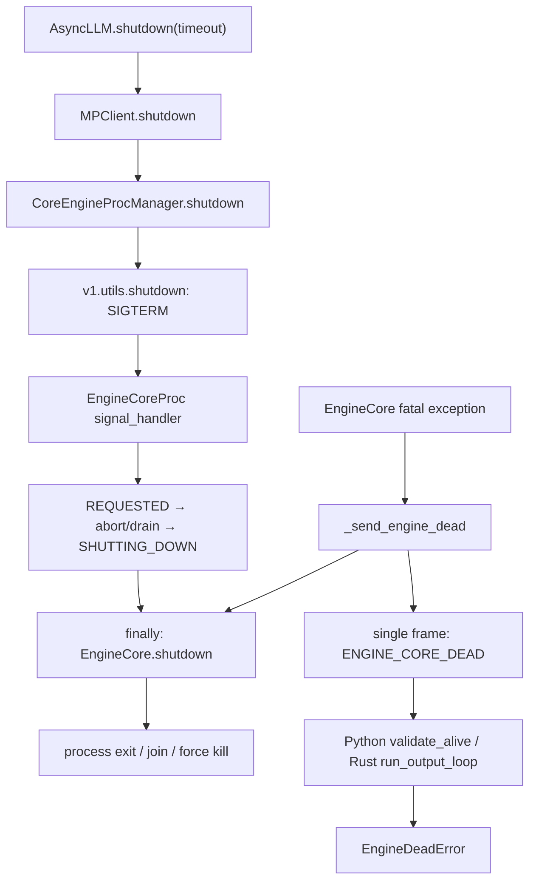
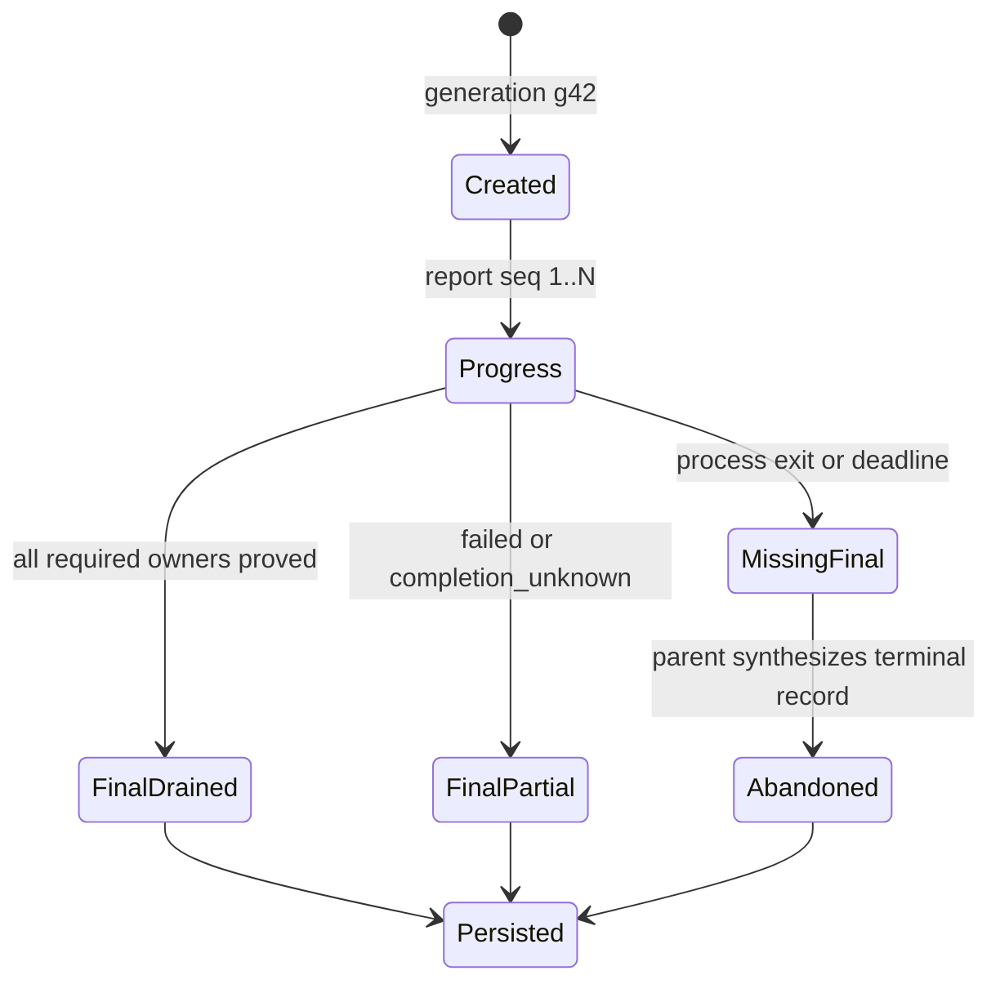

> 源码基线：[`vllm-project/vllm@199cb9b9`](https://github.com/vllm-project/vllm/commit/199cb9b964822e59ab9b58d88e7be31eb419a2ae)，默认分支最新提交时间为 2026-09-07。本文先陈述已合入代码和测试事实；`ShutdownReport` 数据结构与协议均是基于这些事实推导的设计，不是当前 vLLM 已有 API。

## 本篇在课程路线中的位置

第 25 章建立了五层 resource census，第 26 章又证明 `metadata_cleared`、`completed_observed` 与 `completion_unknown` 不能互相替代。现在的问题是：即使 EngineCore 内部知道这些事实，如何在它被强杀前，把证据可靠地送到进程外？

本章位于：

```text
owner-specific census
→ fault injection / completion_unknown
→ ShutdownReport wire protocol
→ kill 前持久化与跨 backend E2E
```

## 前置知识回顾

关闭正确性至少包含三层：请求不再执行、逻辑 owner 不再持有资源、设备操作已经完成。进程退出只说明隔离边界消失；`dict.clear()` 只说明 Host metadata 断引用；只有成功观察对应 event/fence，才能把设备完成状态写成 `completed_observed`。

另一个前提来自第 2 章：[`EngineCoreRequest`](https://github.com/vllm-project/vllm/blob/199cb9b964822e59ab9b58d88e7be31eb419a2ae/vllm/v1/engine/__init__.py) 和 `EngineCoreOutputs` 是跨进程 wire 对象，`array_like=True` 使字段位置成为兼容性约束；Rust frontend 也在解码同一协议。

## 本篇要回答的核心问题

1. 当前 clean shutdown 与 fatal shutdown，进程外分别能观察到什么？
2. 一个最小但不撒谎的 `ShutdownReport`，必须携带哪些 identity、状态和 deadline 信息？

成功条件不是“最终收到一个 success”，而是：每条报告都能回答**哪次 shutdown、哪个 rank、哪个 owner、截至哪一步、凭什么得出该状态**；缺失或过期证据不能被升级为成功。

## 组件在全局架构中的位置

当前有两条互补但不等价的关闭观测链：



注意 fatal 箭头的顺序：[`run_engine_core`](https://github.com/vllm-project/vllm/blob/199cb9b964822e59ab9b58d88e7be31eb419a2ae/vllm/v1/engine/core.py) 在 `except` 中先调用 `_send_engine_dead()`，之后才进入 `finally` 执行 `engine_core.shutdown()`。所以 `ENGINE_CORE_DEAD` 不是 teardown acknowledgement。

## 完整调用链

正常入口从 [`AsyncLLM.shutdown`](https://github.com/vllm-project/vllm/blob/199cb9b964822e59ab9b58d88e7be31eb419a2ae/vllm/v1/engine/async_llm.py) 进入 `MPClient.shutdown(timeout)`；后者把 timeout 交给 `CoreEngineProcManager.shutdown`，再进入 [`vllm.v1.utils.shutdown`](https://github.com/vllm-project/vllm/blob/199cb9b964822e59ab9b58d88e7be31eb419a2ae/vllm/v1/utils.py)：先向所有存活 Core 发 SIGTERM，用同一个 `time.monotonic()` deadline 依次 `join(remaining)`，预算耗尽后 `kill_process_tree`。

Core 内的 signal handler 只把 `shutdown_state` 改为 `REQUESTED` 并唤醒 input queue。[`_handle_shutdown`](https://github.com/vllm-project/vllm/blob/199cb9b964822e59ab9b58d88e7be31eb419a2ae/vllm/v1/engine/core.py) 决定立即 abort 还是继续 drain；`has_work()==False` 后 busy loop 退出；`finally` 再按 `structured output → model_executor → scheduler → distributed env/memory` 的顺序 teardown。

fatal 路径不同：`_send_engine_dead` 把固定 bytes 放入 `output_queue`，最多等待 output thread 5 秒。`process_output_sockets` 用 4 秒 ZMQ linger 向每个 frontend 发送单帧后退出。Python [`BackgroundResources.validate_alive`](https://github.com/vllm-project/vllm/blob/199cb9b964822e59ab9b58d88e7be31eb419a2ae/vllm/v1/engine/core_client.py) 只把 `engine_dead=True` 并抛出无字段的 `EngineDeadError`；[Rust `run_output_loop`](https://github.com/vllm-project/vllm/blob/199cb9b964822e59ab9b58d88e7be31eb419a2ae/rust/src/engine-core-client/src/transport.rs) 也把同一 sentinel 映射为 `Error::EngineCoreDead`。

## 关键类型、字段和状态生命周期

### 当前代码事实

`EngineCoreOutputs` 已携带 `engine_index`、request outputs、scheduler stats、timestamp 和 utility output。普通输出经 msgpack 编码，发送前由 output thread 写入 `engine_index`；fatal sentinel 绕过这个结构，因此没有 rank、phase、error cause 或 cleanup evidence。

`BackgroundResources.engine_dead` 是单向 bool latch。它适合阻止后续请求，却无法表达：DP=2 时哪个 Core 失败、另一 Core 是否完成 teardown，或某个 Worker 是 `failed` 还是 `completion_unknown`。

Elastic EP 还有一个名为 [`SHUTDOWN_COMPLETE`](https://github.com/vllm-project/vllm/blob/199cb9b964822e59ab9b58d88e7be31eb419a2ae/vllm/distributed/elastic_ep/elastic_state.py) 的 notification，但它位于 scale-down 状态机的 rank removal 完成点，不是通用 EngineCore resource census。

### 基于证据推导的最小协议

建议把报告设计为小型 CPU msgpack control envelope；它不含 Tensor，因而没有 shape/dtype/device 数据，owner 是 EngineCore，持久化 owner 是 parent collector：

```python
ShutdownReport(
    schema_version: int,
    shutdown_generation: str,
    engine_index: int,
    report_seq: int,
    phase: str,
    owners: list[OwnerReport],
    remaining_budget_ms: int,
    primary_error: ErrorSummary | None,
    final: bool,
)

OwnerReport(
    owner: str,  # scheduler / connector / executor / worker:rank / device
    state: str,  # not_started / running / drained / failed /
                # blocked_by_dependency / completion_unknown /
                # abandoned_by_deadline
    evidence: dict[str, int | bool | str],
)
```

四个字段不可删：

- `shutdown_generation` 防止旧 EngineCore 的迟到帧污染重启后的新实例；`request_id` 和 PID 都不能独立解决 PID reuse 与重启 ABA。
- `engine_index`/worker rank 使 DP/TP partial ack 可归因；aggregate 不能因 rank 0 成功就覆盖 rank 1 缺失。
- `report_seq` 处理 ZMQ 重连、重复与乱序；同一 generation/rank 只接受更大的序号，状态只能按允许的偏序前进。
- `final` 区分 progress snapshot 与正常终态。进程退出但没有 final report，collector 必须补成 `abandoned_by_deadline` 或 `completion_unknown`，不能补成 `drained`。

## 逐函数源码解读

`EngineCoreProc._handle_shutdown` 只管理请求收敛，不产生 teardown 结果。它在 abort 模式调用 `Scheduler.finish_requests` 并发出 abort outputs；在 drain 模式等待 `has_work()` 归零。这个边界最多证明 request-processing complete。

`EngineCore.shutdown` 是事实产生者，却返回 `None` 且串行 fail-fast。若 `model_executor.shutdown()` 抛错，后面的 `scheduler.shutdown()` 可能没有执行；当前接口无法携带 sibling 成败，也无法表示 dependency-safe skip。

`EngineCoreProc._send_engine_dead` 是 fatal detector 的通知，不接收异常参数，也不携带 `engine_index`。其 5 秒 thread join 和 4 秒 socket linger 只是 best effort 传输窗口；sender thread 仍存活时会记录 fatal log，但没有第二条 durable channel。

`CoreEngineProcManager.shutdown` 通过 [`get_engine_process_shutdown_timeout`](https://github.com/vllm-project/vllm/blob/199cb9b964822e59ab9b58d88e7be31eb419a2ae/vllm/v1/engine/utils.py) 保留外层 remaining budget；只有 ROCm 且 request/process timeout 都为 0 时增加 15 秒 cleanup grace。真正共享 deadline 目前只存在于同一层 generic process manager，尚未下传到 Scheduler、Connector、Executor 和 Worker。

## 具体示例与状态演算

设 DP=2，每个 EngineCore 下有 TP=2 Workers，shutdown generation=`g42`，parent 总预算 5000 ms。rank 0 正常完成；rank 1 的 Worker 1 卡在 native device synchronize：

| 时刻 | rank 0 最新报告 | rank 1 最新报告 | parent 可下结论 |
| ---: | --- | --- | --- |
| 0 ms | `seq=1, phase=request_drain` | 同左 | 只知关闭已开始 |
| 800 ms | Scheduler `drained` | Scheduler `drained` | 请求层已收敛 |
| 3200 ms | Workers 0/1 `completed_observed` | Worker 0 完成；Worker 1 `running` | 全局仍非成功 |
| 5000 ms | `final=true` | 无 final，随后 SIGKILL | rank 1=`abandoned_by_deadline`；device=`completion_unknown` |

聚合规则是：

```text
global_drained
iff every expected rank has final report
and every required owner has drained/completed_observed evidence
```

不能使用“收到报告的 rank 都成功”作为条件，因为这会把 missing rank 从分母中删除。



报告必须在危险动作之前发送 progress snapshot：例如 device synchronize 前先记录“metadata 已清、completion 尚未观察”。若 native call 永久卡住，parent 至少保有最后一份不撒谎的证据。

## 为什么这样设计及替代方案

最简单替代是扩展 `ENGINE_CORE_DEAD` 为 `ENGINE_CORE_DEAD:<rank>:<cause>`。它能改善归因，却仍只有 fatal 事件，不能表达正常 shutdown、owner progress、partial completion 或 schema evolution。

另一个方案是把 `shutdown_report` 直接追加到 `EngineCoreOutputs`。优点是复用 msgpack/ZMQ 和 Python decoder；代价是 `array_like` positional compatibility 与 Rust decoder必须同步验证，而且普通 output channel 在 sender thread、socket或进程损坏时正是最脆弱的通道。

更稳妥的最小方案是 tagged control envelope，仍复用现有 socket，但在 Python/Rust 双向 golden fixtures 中冻结 version/kind/字段默认值；parent 每收到 progress 就立即写入自己的内存或 durable sink。注意“durable”必须由 parent 完成：让即将被 SIGKILL 的 child 在最后一刻写文件，不能建立可靠保证。

deadline 也不能直接跨主机传一个裸 `time.monotonic()` 值。Python 已明确说明 EngineCore event timestamp 不应跨进程比较；跨机更不能假设 clock epoch 相同。parent 应持有唯一总 deadline，并向 child 传递**剩余预算与 generation**；child在本地换算为 monotonic deadline，逐层只传递更小的 remaining budget，不为每个 owner 重开一个完整 timeout。

## 性能、并发、正确性与边界条件

报告只含少量 Host metadata，正常推理热路径不发送；成本主要在 shutdown 的序列化与持久化，不影响 CUDA Graph。为了避免报告本身拖过 deadline，应限制 owner 数、错误文本长度和 snapshot 频率，禁止附带完整 traceback、Tensor 或 dump。

并发上，Core main thread 产生事实，output thread 负责发送，parent collector 按 `(generation, engine_index, report_seq)` 去重。正确性边界包括：sender 卡住、ZMQ linger 到期、parent 先退出、Rust schema 不匹配、report 重复/乱序、Worker ack 在 Executor aggregate 前丢失。任何一项发生都只能降低证据等级，不能猜测成功。

2026-08-28 提交的开放 Issue [`#54184`](https://github.com/vllm-project/vllm/issues/54184) 还报告过 process sentinel readiness 在 `exitcode is None` 且进程仍存活时被解释为死亡。它是 Issue 证据，不是已合入结论；但它进一步说明 process sentinel 是“需要检查状态的触发器”，不是资源终态证明。

## 测试证据与未覆盖风险

当前测试能证明：

- [`test_engine_core_process_shutdown_timeout`](https://github.com/vllm-project/vllm/blob/199cb9b964822e59ab9b58d88e7be31eb419a2ae/tests/v1/engine/test_startup_watch_processes.py) 覆盖 ROCm `0/0 → 15s`、外层剩余 7 秒保持 7 秒、正 request timeout 但外层预算为 0 时不续杯，并验证 manager shutdown 幂等。
- 同文件的 clean ROCm 测试只在 `SHUTTING_DOWN + no work + timeout=0 + exit code 0` 时期待 `shutdown → gc.freeze`；它验证控制流，不验证 owner census。
- [`test_background_resources_passes_worker_shutdown_timeout`](https://github.com/vllm-project/vllm/blob/199cb9b964822e59ab9b58d88e7be31eb419a2ae/tests/v1/engine/test_core_engine_actor_manager.py) 验证环境变量 timeout 透传。
- [`test_shutdown_timeout`](https://github.com/vllm-project/vllm/blob/199cb9b964822e59ab9b58d88e7be31eb419a2ae/tests/entrypoints/launchers/test_dp_supervisor.py) 用两个延迟 10 秒退出的 mock child 证明 supervisor 等待 drain 且最终进程都消失。

这些测试都没有验证 `generation × rank × owner` 报告矩阵。最小新增测试应覆盖：Python/Rust golden decode、重复/乱序 seq、旧 generation 迟到、一个 DP rank 缺 final、Worker native hang 后 parent 生成 `abandoned_by_deadline`，以及 report sender 本身失败时仍按总 deadline force-kill。

## 与前后章节的连接

本章把第 26 章的 `completion_unknown` 从进程内判断变成可传输状态，也回扣第 2 章的 Python↔Rust wire compatibility。下一章应继续验证最后一个薄弱点：progress report 如何在 child 被 SIGKILL 前进入 parent-owned durable sink，以及 collector 失败时怎样保留“证据缺失”本身。

## 本篇结论、知识债、三个理解检查问题和下一章

结论只有一句：**`ENGINE_CORE_DEAD`、process exit 和 owner cleanup report 是三种不同事件；可靠 shutdown 必须用 generation/rank/sequence 标识 partial evidence，并由 parent 对 missing final 作失败终态。**

仍欠缺：实际 `ShutdownReport` schema、Python/Rust 兼容实现、Worker→Executor→Core 分层聚合、parent durable sink、跨机 deadline clock-domain 方案，以及真实 GPU/Ray/MP 故障矩阵。

理解检查：

1. 为什么 fatal sentinel 已送达仍不能把 device state 标为 `completed_observed`？
2. DP=2 时只收到 rank 0 的 final success，为什么 aggregate 不能忽略 rank 1？
3. 为什么跨机协议应传 remaining budget，而不是裸 `time.monotonic()` deadline？

下一章：**Kill 前的最后一份证据——progress snapshot、parent-owned durable sink 与重复/乱序/缺失报告故障注入。**

## 课程账本增量

- 新增源码基线：`199cb9b9`。
- 新覆盖：`EngineShutdownState`、`run_engine_core`、`_handle_shutdown`、`_send_engine_dead`、`process_output_sockets`、`EngineCoreOutputs`、`BackgroundResources.validate_alive`、`CoreEngineProcManager.shutdown/monitor_engine_liveness`、generic process `shutdown`、Rust `run_output_loop`、EEP `SHUTDOWN_COMPLETE`。
- 新确认不变量：fatal sentinel 先于 teardown；clean shutdown 没有结构化 final ack；missing rank/final 必须成为显式失败终态；同层 process join 共享 deadline，但 owner 层尚未共享；child 不能独自保证 kill 前持久化。
- 新知识债：schema、双语言 golden、rank/worker aggregation、durable collector、clock-domain、真实 fault injection。

