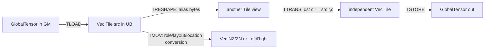
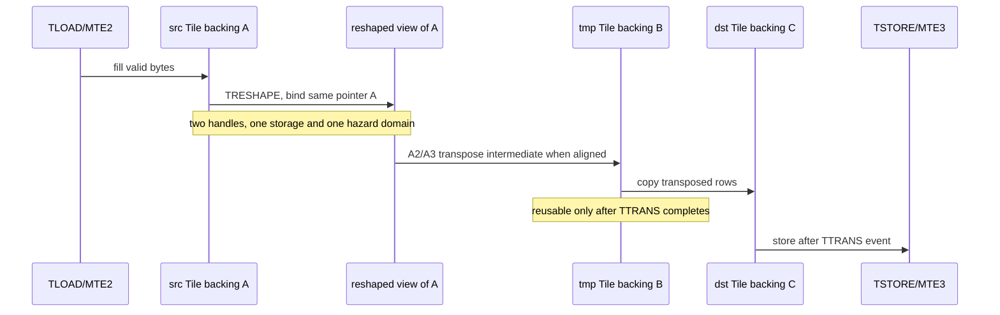

## 本篇在 PTO 课程路线中的位置

课程 29 已经建立 `TMOV` 的代际矩阵：A5 的 `Vec ND→NZ/ZN` 是真实物理重排，不能拿 A2/A3 的 generic `Vec→Vec` copy 代替。但“shape 变了”仍可能来自三种完全不同的动作：只换一个 view、执行数学转置、或者换 storage representation。

本篇因此只回答一个边界问题：**当 Tile 的 shape/layout 看起来发生变化时，字节到底有没有移动，逻辑坐标有没有改变，谁拥有 backing storage？** 课程位置是：

```text
TMOV 代际合法矩阵 → TRESHAPE/TTRANS/TMOV 三分法 → partial-valid 与组合合法性
```

源码基线是 pto-isa [`82eadca4`](https://github.com/hw-native-sys/pto-isa/commit/82eadca42893031d4d30cef5e0a2931cac70b8a9)。本文以该 commit 的实现和测试为代码事实；两处历史 alias 修复只用于解释设计意图。

## 前置知识

- Tile 的 static shape 是容量盒子，dynamic valid shape 是本次运算的语义前缀。
- `BLayout/SLayout` 决定逻辑坐标如何落到物理字节；相同 shape 不保证相同 physical layout。
- `TASSIGN` 给 Tile 绑定片上地址；handle 自身不等于那段存储的唯一 owner。
- Event 是 producer 到 consumer 的精确依赖边，不是全局完成屏障。

## 今日两个核心问题

1. `TRESHAPE` 为什么是 alias，而不是“廉价的 transpose”或隐式 copy？
2. `TTRANS` 与 `TMOV` 都可能改变物理排列，它们分别承诺保持什么、改变什么？

## PTO 全栈中的位置



上游给出 Tile type、shape、valid shape、layout 和地址；下游可能是 `TSTORE`、Vector 算子或 `TMATMUL`。三条边的根本差异不是函数名，而是它们对 `(logical coordinates, physical bytes, storage identity)` 的 contract。

## 概念和精确语义

| 指令 | 逻辑坐标 | 物理字节 | storage identity |
| --- | --- | --- | --- |
| `TRESHAPE(dst, src)` | 用 `dst` 的 type/shape 重新解释线性字节 | 不搬运 | `dst.data()==src.data()`，共享 backing |
| `TTRANS(dst, src, tmp)` | `dst[c,r]=src[r,c]` | 写入独立 `dst` | src/dst 不应重叠；A2/A3 某些路径使用 `tmp` |
| `TMOV(dst, src)` | 通常保持有效域中的逻辑值 | copy 或 layout/role repack | destination 获得独立表示，且 location/layout 受 target 分派 |

所以：

- `TRESHAPE` 改的是**解释**；
- `TTRANS` 改的是**数学坐标映射**；
- `TMOV` 改的是**承载同一逻辑值的物理表示或位置**。

这个三分法比“是否改变 shape”更稳定。`TTRANS` 的 destination shape 自然交换，`TMOV` 也可能同 shape 却重排，`TRESHAPE` 可以变 shape 却一字节不搬。

## 真实文件、类型、API 或指令逐段解读

### 1. 公共 wrapper：依赖先闭合，再进入 target 实现

[`include/pto/common/pto_instr.hpp`](https://github.com/hw-native-sys/pto-isa/blob/82eadca42893031d4d30cef5e0a2931cac70b8a9/include/pto/common/pto_instr.hpp) 中两者都先 `PtoWaitEvents(events...)`，再调用 `MAP_INSTR_IMPL`：

```cpp
TRESHAPE(dst, src, events...) -> wait -> TRESHAPE_IMPL(dst, src)
TTRANS(dst, src, tmp, events...) -> wait -> TTRANS_IMPL(dst, src, tmp)
```

输入输出都是 local Tile；wrapper 返回 `RecordEvent`，供后续 consumer 建依赖。它只等待显式输入事件，不会替调用者证明未列出的 alias 或并发访问安全。

### 2. `TRESHAPE`：同一地址的第二种类型视图

[`A2/A3 TReshape.hpp`](https://github.com/hw-native-sys/pto-isa/blob/82eadca42893031d4d30cef5e0a2931cac70b8a9/include/pto/npu/a2a3/TReshape.hpp) 检查：

- source/destination `Loc` 相同；
- `sizeof(dtype) × Numel` 相同；
- 不能跨越 boxed 与 `SLayout::NoneBox` 边界。

随后 manual mode 用 `TASSIGN_IMPL(dst, reinterpret_cast<uintptr_t>(src.data()))`，auto mode 用 `__cce_alias`。[`A5 TReshape.hpp`](https://github.com/hw-native-sys/pto-isa/blob/82eadca42893031d4d30cef5e0a2931cac70b8a9/include/pto/npu/a5/TReshape.hpp) 直接复用该实现。

[`CPU TReshape.hpp`](https://github.com/hw-native-sys/pto-isa/blob/82eadca42893031d4d30cef5e0a2931cac70b8a9/include/pto/cpu/TReshape.hpp) 在 `__CPU_SIM` 下同样把 `dst.data()` 指向 `src.data()`。这与 [`TRESHAPE 中文说明`](https://github.com/hw-native-sys/pto-isa/blob/82eadca42893031d4d30cef5e0a2931cac70b8a9/docs/isa/TRESHAPE_zh.md) 仍写的“CPU 模拟按字节拷贝”不一致；当前源码和直接 alias 测试应作为事实。历史提交 [`79505654`](https://github.com/hw-native-sys/pto-isa/commit/79505654ab9c19e5dd42d41740d67ffdd4f47d13) 正是修复 CPU_SIM backing storage alias，auto-mode 提交 [`b22b57bf`](https://github.com/hw-native-sys/pto-isa/commit/b22b57bf1f6673d751bb9e3ba99c4494c1a92588) 则让 IR 显式表达 alias。

还有一处 backend 差异：CPU 实现额外限制 dtype 必须相同、同为浮点或同为整数；A2/A3 可见检查主要是总字节相等。跨 target 代码不能据此把任意等宽 bitcast 当成统一合法 contract。

### 3. `TTRANS`：真正生成新的矩阵

普通二维路径在 [`A2/A3 TTrans.hpp`](https://github.com/hw-native-sys/pto-isa/blob/82eadca42893031d4d30cef5e0a2931cac70b8a9/include/pto/npu/a2a3/TTrans.hpp) 中要求 1/2/4-byte element、src/dst element width 相同、source row-major，并读取 `src.GetValidRow/Col()`。

A2/A3 对齐路径先以 Vector transpose 写 `tmp`，`pipe_barrier(PIPE_V)` 后再 UB→UB copy 到 `dst`；`tmpStride=ceil(validRow/Y)×Y`，其中 8-bit 的 `Y=32`，16/32-bit 的 `Y=16`。stride 不满足实现条件时会走直接 tail/scalar 路径，`tmp` 可能不参与。

[`A5 TTrans.hpp`](https://github.com/hw-native-sys/pto-isa/blob/82eadca42893031d4d30cef5e0a2931cac70b8a9/include/pto/npu/a5/TTrans.hpp) 同样读取 source valid shape，但要求 source 与 destination row width 都满足 32-byte 对齐，并按宽高选择 row-wise scatter 或 column-wise gather。普通二维分支没有读取 `tmp`；A5 测试 kernel 甚至把 `tmp` 绑定到地址 0，说明此参数在该分支只是跨 target 公共 ABI。卷积 layout 分支另有专门语义，不在本篇展开。

## 对象、Tile 与 Buffer 生命周期



`TRESHAPE` 后，`src` 与 `view` 都能修改同一段 A；任一 handle 离开作用域都不代表 backing A 可以复用。编译器的 liveness/alias analysis 必须把它们合并到同一 storage family。`TTRANS` 完成后，destination C 独立存在；A2/A3 的 scratch B 只在指令期间被占用，必须等该调用完成才能交给别的算子。

失败方式也不同：错误 reshape 往往是静默 alias/坐标解释错误；错误 transpose 更常表现为 shape、alignment 或 UB capacity 失败；错误 `TMOV` 则可能命中错误 target 分支，得到数值看似相同但 physical layout 不被下游接受。

## 端到端指令链

一个真实的二维链是：

```text
GM ND → TLOAD(src Vec ND) → TRESHAPE(view, src)
      → TTRANS(dst, view, tmp) → TSTORE(GM, dst)
```

若下游不是普通转置输出，而是 Cube operand，则分叉为：

```text
src logical values → TMOV(Mat→Left/Right 或 A5 Vec ND→NZ/ZN) → TMATMUL/TSTORE
```

前一链交换 `(r,c)`；后一链通常保持 `(r,c)` 的逻辑值，只换 physical representation。把二者互换会同时破坏数学语义和 consumer ABI。

## 具体 shape、Tile 和状态演算

取完整有效的 `half[16,32]` ND Vec Tile：512 elements，共 1024 B。

### `TRESHAPE` 到 `half[8,64]`

row-major source `(2,3)` 的线性 element offset 是：

```text
2 × 32 + 3 = 67，byte offset = 67 × 2 = 134 B
```

同一字节在 `[8,64]` view 中是 `(1,3)`，因为 `1×64+3=67`。没有复制，也没有把矩阵内容做 transpose；只是用另一组坐标读取 134 B。

### `TTRANS` 到 `half[32,16]`

现在 source `(2,3)` 的值必须写到 destination `(3,2)`。A2/A3 的 `Y=16`：

```text
tmpStride = ceil(16/16) × 16 = 16 elements
tmp footprint used by this valid domain = 32 × 16 × 2 = 1024 B
```

`srcStride=32` 是 32 B block 的 2 倍，`dstStride=16` 也满足 16-element 对齐，因此走 tmp transpose + UB copy 路径。A5 则可用 gather/scatter 直接写独立 destination。

### partial-valid 陷阱

若同一 static source 只有 valid `[8,16]`，每行后 16 个元素是 padding。把 backing bytes alias 成 `[8,64]` 并不会压紧八行有效值：原 `(1,0)` 位于 linear offset 32，而不是 16。因此“有效元素总数同为 128”不足以推出 reshape 后存在一个等价矩形 valid region。`TRESHAPE` 不做 compaction；调用者必须证明线性有效字节本来就是连续的，或先用真正的数据搬运整理。

## 为什么这样设计及替代方案

`TRESHAPE` 采用 alias 的收益是零数据流量、零 scratch、容易融合；代价是 alias set 扩大，in-place 写、liveness 和 valid-region 证明更难。替代方案是显式 copy：所有权更清晰，却增加 UB 带宽、延迟和 event 边。

`TTRANS` 使用独立 destination，维护成本和 UB 占用更高，但它兑现了真正的数学 permutation。试图把 transpose 表达成 reshape 只在退化 shape 或下游恰好重新解释坐标时成立，不能作为一般优化。

`TMOV` 由 target 分派 layout/location conversion，使下游硬件能直接消费；替代方案是在每个 consumer 内临时转换，会重复流量、扩大 consumer 复杂度并削弱流水复用。是否值得预先 repack，应比较复用次数、UB/L0 占用和 MTE/Vector overlap，而不是只比较一次指令数。

## 访存、计算、流水、并行和硬件约束

- `TRESHAPE` 理论上不产生 payload movement，但会制造 RAW/WAR/WAW alias；graphability 依赖编译器保留 alias provenance。
- `TTRANS` 至少读写有效元素各一次。A2/A3 对齐路径还经过 tmp，增加 local traffic 与 scratch footprint；它换取规则的 subtile transpose 和 burst copy。
- A5 普通路径以 register gather/scatter 处理 1/2/4-byte element，并对 16/32-bit index 范围做 compile-time guard；这属于源码事实。具体 bank conflict 和周期没有公开 trace，不能由循环结构直接定量推出。
- `TTRANS` 的 source valid `[R,C]` 对应 destination valid `[C,R]`。destination capacity 与 row stride 必须覆盖这个区域；区外元素仍不能假设被清零。
- `TMOV` 的 pipe/location 与 layout 合法性继续遵循课程 29 的 target-conditioned matrix；`TRESHAPE` 不能跨 location，`TTRANS` 的普通路径则要求 local row-major Tile。

## 测试证据与未覆盖风险

直接测试给出三类证据：

1. [`CPU TRESHAPE test`](https://github.com/hw-native-sys/pto-isa/blob/82eadca42893031d4d30cef5e0a2931cac70b8a9/tests/cpu/st/testcase/treshape/main.cpp) 使用 `float[2,16]→float[1,32]`，断言 pointer 相等，并从 src/dst 两侧写入验证双向可见；它直接证明 alias，不只证明数值相等。
2. [`A2/A3 TTRANS test`](https://github.com/hw-native-sys/pto-isa/blob/82eadca42893031d4d30cef5e0a2931cac70b8a9/tests/npu/a2a3/src/st/testcase/ttrans/main.cpp) 覆盖 float/half/int8、对齐与非对齐、如 capacity `64×128`/valid `27×77` 的 tail；[`golden generator`](https://github.com/hw-native-sys/pto-isa/blob/82eadca42893031d4d30cef5e0a2931cac70b8a9/tests/npu/a2a3/src/st/testcase/ttrans/gen_data.py) 只在 valid transpose 区保留值，区外期望零是 harness 先清 destination 的结果，不是 ISA 自动清零承诺。
3. [`A5 TTRANS kernel`](https://github.com/hw-native-sys/pto-isa/blob/82eadca42893031d4d30cef5e0a2931cac70b8a9/tests/npu/a5/src/st/testcase/ttrans/ttrans_kernel.cpp) 明确串联 `TLOAD event → TTRANS event → TSTORE`，并用不同 src/dst capacity 验证 valid transpose。

仍未覆盖：TRESHAPE 的 NPU 直接 alias/negative matrix、partial-valid reshape 的 padding poison、跨 dtype parity、src/dst/Tmp overlap 的拒绝、A2/A3 与 A5 对同一 shape 的 scratch/stall 对照，以及 `TRESHAPE→TTRANS→TMOV→consumer` 的组合 E2E。

## 与前后章节的连接

向前，课程 29 的 `TMOV` 矩阵现在有了坐标系：它不是 view，也不是普通数学 transpose。向后，下一章应把本篇暴露的 partial-valid 风险变成可执行 contract：哪些 reshape 能保持连续有效域，哪些必须先 compact；同时建立 alias、overlap、dtype 和 target 的 negative tests。

## 本篇结论、知识债、三个理解检查问题和下一章

结论只有三句：

1. 判断 layout/shape 算子先问三个问题：逻辑坐标是否改变、字节是否移动、storage identity 是否改变。
2. 当前主干 `TRESHAPE` 是 backing alias；它不 compact padding，也不能代替 transpose。
3. `TTRANS` 兑现 `dst[c,r]=src[r,c]`，`TMOV` 则兑现 target-specific representation/location contract；两者都可能搬字节，但不共享数学语义。

知识债：同步 TRESHAPE 文档与 CPU_SIM 实现；补 NPU alias/negative tests；定义 dynamic valid reshape 的连续性条件；补 src/dst/tmp no-overlap verifier；量化 A2/A3 tmp 与 A5 gather/scatter 的设备代价。

理解检查：

1. 为什么 `half[16,32] valid[8,16] → half[8,64]` 即使有效元素数相等，也不能直接把 destination valid 设为 `[2,64]`？
2. A5 普通 `TTRANS` 的 `tmp` 参数未被读取，为什么仍不能把公共 API 中的 `tmp` 删掉？
3. 一个操作保持每个 `(r,c)` 的逻辑值，却改变 ND→ZN physical offset，它更接近 `TTRANS` 还是 `TMOV`？为什么？

下一章：**Partial-valid layout 变换——用 padding poison 与 negative matrix 定义 TRESHAPE/TTRANS/TMOV 的组合合法性。**

## 课程账本增量

- 源码基线：pto-isa [`82eadca4`](https://github.com/hw-native-sys/pto-isa/commit/82eadca42893031d4d30cef5e0a2931cac70b8a9)；alias 相关历史提交 [`79505654`](https://github.com/hw-native-sys/pto-isa/commit/79505654ab9c19e5dd42d41740d67ffdd4f47d13)、[`b22b57bf`](https://github.com/hw-native-sys/pto-isa/commit/b22b57bf1f6673d751bb9e3ba99c4494c1a92588)。
- 新覆盖文件：common wrapper、CPU/A2A3/A5 `TReshape.hpp` 与 `TTrans.hpp`，CPU alias test，A2/A3/A5 TTRANS kernel/main/golden。
- 新覆盖符号：`TRESHAPE_IMPL`、`TTRANS_IMPL`、`TTransOperation`、`TTransTile`、`PtoWaitEvents`、`__cce_alias`。
- 新确认不变量：reshape 共享 storage identity；transpose 交换逻辑坐标并生成独立 destination；move 保持逻辑值但可改变 representation/location；valid-element count 相等不等于有效字节连续。
- 直接测试事实：CPU reshape 双向写验证 alias；A2/A3 与 A5 transpose 覆盖 dynamic valid/tail；A5 普通二维路径保留 tmp operand 但不消费其 storage。
- 新知识债：文档同步、NPU alias/negative matrix、partial-valid padding poison、overlap verifier 与设备 traffic/stall 对照。
- 下一章：**Partial-valid layout 变换——用 padding poison 与 negative matrix 定义 TRESHAPE/TTRANS/TMOV 的组合合法性。**
