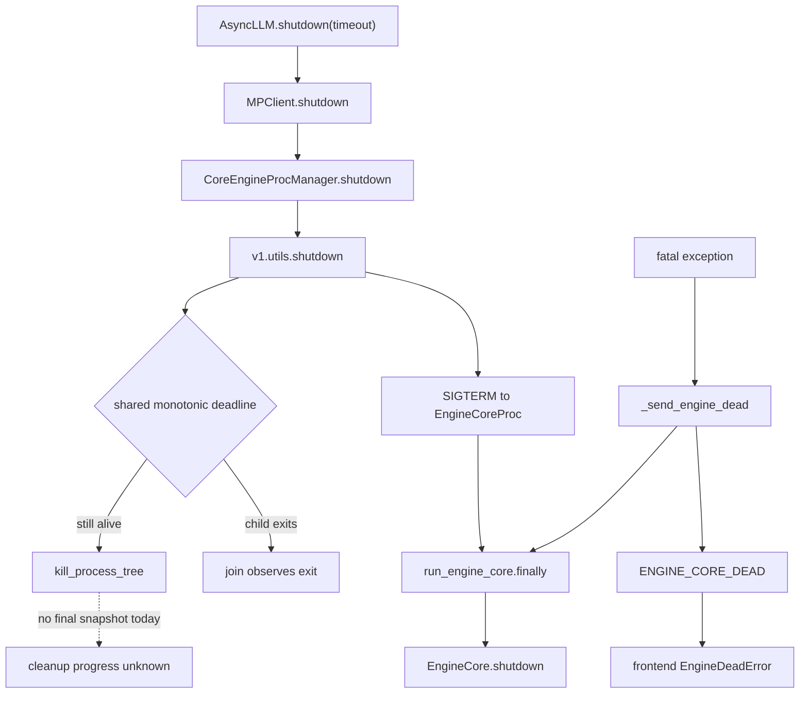
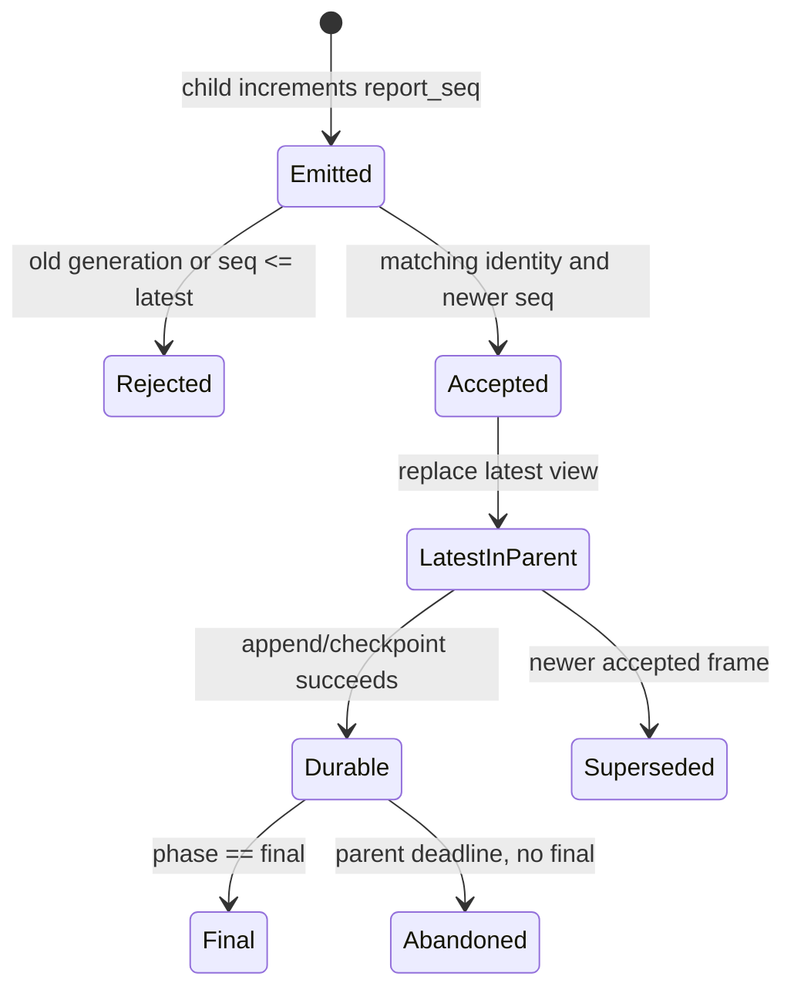

> 源码基线：[`vllm-project/vllm@a97dacb7`](https://github.com/vllm-project/vllm/commit/a97dacb7106ee49f39f3d1fc6ae1800ff724e01d)，默认分支最新提交时间为 2026-09-09。该提交更新 EC Connector 文档，与本文 shutdown 路径无直接修改。本文先陈述已合入代码与测试事实；`ShutdownProgress`、collector 和 durable sink 都是由事实推导出的设计，不是当前 vLLM API。

## 本篇在课程路线中的位置

第 27 章定义了 `shutdown_generation + engine_index/rank + report_seq`，解决“这是谁的哪一份报告”。本章继续追问更苛刻的问题：如果 child 卡在 native cleanup 中，parent 到期后只能 `SIGKILL`，最后一份有效证据应由谁持有？

```text
completion_unknown
→ generation/rank-scoped ShutdownReport
→ record-before-destroy + parent-owned durable sink
→ Worker→Executor→Core 实际接线与跨 backend E2E
```

## 前置知识回顾

关闭过程中的三个事实不能混写：Host metadata 已断引用、device completion 已被观察、进程已退出。`SIGKILL` 只能建立隔离边界；它不会执行 Python `finally`，也不能把未知的 GPU/NCCL 状态补写成成功。

第 27 章还确认：fatal `ENGINE_CORE_DEAD` 是无字段的单帧 sentinel，而且发送早于 `EngineCore.shutdown()`。因此它证明的是“Core 已报告 fatal”，不是“cleanup 已完成”。

## 本篇要回答的核心问题

1. 为什么把 final report 写在 child 的 `finally` 末尾，仍然会在最需要它时丢失？
2. 如何用最小 progress snapshot，让 parent 在重复、乱序、旧 generation 和缺失 final 下仍能给出不撒谎的结论？

核心安全条件是：**强杀发生前，parent 已接收并保存 child 最近一次不可变快照；强杀后只允许把缺失的终态标成 `abandoned_by_deadline/completion_unknown`，不得推断成功。**

## 组件在全局架构中的位置

当前控制链已有有界等待，却没有与之平行的证据链：



建议增加的不是另一条业务输出，而是一条低容量控制面：child 在危险步骤前后发 `ShutdownProgress`，parent collector 先更新内存中的 latest view，再按 durability 策略落盘。即使随后 child 被杀，证据 owner 仍然活着。

## 完整调用链

正常入口是 [`AsyncLLM.shutdown`](https://github.com/vllm-project/vllm/blob/a97dacb7106ee49f39f3d1fc6ae1800ff724e01d/vllm/v1/engine/async_llm.py#L268-L280)：关闭 Prometheus、Renderer，再调用 `engine_core.shutdown(timeout)`。[`MPClient.shutdown`](https://github.com/vllm-project/vllm/blob/a97dacb7106ee49f39f3d1fc6ae1800ff724e01d/vllm/v1/engine/core_client.py#L740-L751) 把 timeout 交给 engine manager，随后清理自己的 ZMQ/task 资源。

对本地 Core，[`CoreEngineProcManager.shutdown`](https://github.com/vllm-project/vllm/blob/a97dacb7106ee49f39f3d1fc6ae1800ff724e01d/vllm/v1/engine/utils.py#L241-L254) 计算 process timeout，调用 [`v1.utils.shutdown`](https://github.com/vllm-project/vllm/blob/a97dacb7106ee49f39f3d1fc6ae1800ff724e01d/vllm/v1/utils.py#L598-L652)。后者先向所有仍存活进程发 terminate，再用同一个 `time.monotonic()` deadline 顺序 join；到期仍存活者进入 `kill_process_tree`。

child 收到 SIGTERM 后把 `shutdown_state` 置为 `REQUESTED` 并唤醒 busy loop；[`run_engine_core`](https://github.com/vllm-project/vllm/blob/a97dacb7106ee49f39f3d1fc6ae1800ff724e01d/vllm/v1/engine/core.py#L1283-L1385) 最终在 `finally` 调用 `EngineCore.shutdown()`。该函数按 `structured_output_manager → model_executor → scheduler → gc/distributed cleanup` 串行执行。任一步永久阻塞，child 就到不了末尾。

DP serving 外面还有一层 [`DPSupervisor._shutdown_children`](https://github.com/vllm-project/vllm/blob/a97dacb7106ee49f39f3d1fc6ae1800ff724e01d/vllm/entrypoints/launchers/dp_supervisor.py#L525-L568)：它转发 shutdown signal，以 `shutdown_timeout + 5s` 等待全部 child，最后强杀残留进程。这里同样只检查 `is_alive()`，没有消费 per-rank cleanup snapshot。

## 关键类型、字段和状态生命周期

以下是**建议协议**的最小 envelope；它不承载 prompt、token 或 tensor payload：

```python
class ShutdownProgress(msgspec.Struct, array_like=True):
    schema_version: int
    shutdown_generation: str
    engine_index: int
    rank: int
    report_seq: int
    phase: str          # started | completed | failed | final
    owner: str          # scheduler | executor | device | ...
    status: str         # in_progress | completed_observed | completion_unknown
    evidence: dict[str, int | bool | str]
    cause: str | None
```

它位于 Host 控制面，没有 tensor shape、dtype 或 device allocation。`evidence` 只能放有界 census，例如 `unfinished_requests=0`、`deferred_frees=2`、`device_fence_observed=false`；不能放原始输入和完整 tensor，也不能无限增长。

把它真正接成接口时，至少要把下列契约写死，而不能只约定字段名：

| 接口 | 输入与输出 | 所有权与前后条件 | 并发/进程假设 | 失败语义 |
| --- | --- | --- | --- | --- |
| child `emit` | 输入是一个 owner 的阶段结果与有界 census；输出是 Host 上的 msgpack/bytes frame，无 tensor、shape、dtype 或 device payload | 发送前由 child 持有；只有 parent 接受后才完成证据所有权转移；`report_seq` 必须先递增再发布 | 每个 rank 可独立生产；若 Worker 多线程上报，必须先在 rank 内串行化 sequence | 序列化失败、队列满或 child 先死都只能得到“未观察”，不得合成 completed |
| parent `accept` | 输入一帧；输出 `accepted/rejected` 以及该 identity 的 latest view | 前置条件是 generation 与 expected set 已冻结；后置条件是 latest sequence 和 owner state 都不回退 | 不同 rank 可并发到达，但各 `(generation, engine_index, rank)` 必须独立比较 | 旧代、重复、乱序、非法状态回退均拒绝并计入 protocol violation |
| parent `checkpoint` | 输入 latest map、expected set 与 deadline cause；输出明确的 durability ACK | checkpoint 由不会随 child 一起被 kill 的 parent 拥有；只有 durable ACK 才能宣称 L2 | 可批量合并普通 progress，但 `failed/final` 与 kill-before-checkpoint 需要优先刷写 | 磁盘满、只读或 ACK 超时应记录 `persistence_unknown`，不能反向阻塞到无限 teardown |

因此这里的“shape”是协议集合的基数，而不是张量维度：若 expected ranks 为 \(R\)，每个 rank 有 \(O\) 个固定 owner，latest view 的状态量应被约束为 \(O(R\times O)\)，而不是随请求数、token 数或日志长度增长。这样控制通道才不会在大批请求退出时反过来成为新的 shutdown 背压源。

单帧生命周期如下：



真正的所有权转移发生在 `Accepted`：从此 parent 即使杀掉 child，也仍持有这份证据。若要求 parent 自身崩溃后也可恢复，则还必须到达 `Durable`；只放 parent 内存只抗 child crash，不抗 supervisor crash。

这里还需要区分“状态推进”和“事实累积”。`owner=executor, phase=started` 之后收到 `owner=scheduler, phase=completed` 的迟到帧，不能让 latest view 从 executor 退回 scheduler；但迟到帧可以进入审计历史。更稳妥的 snapshot 不是只保存一个字符串，而是保存各 owner 的单调证据集合：`scheduler=completed` 一旦建立不可撤销，`executor=started` 则可被同 owner 的 `completed/failed` 加强。任何状态都不能从 `completion_unknown` 凭计时或进程退出自动跃迁为 `completed_observed`。

因此 `report_seq` 解决 transport 顺序，owner 状态机解决语义顺序，两者不能相互替代。即使 sequence 完全有序，一个错误 producer 仍可能发送 `completed → started`；collector 必须拒绝这种状态回退，并把它记录为 protocol violation。

## 逐函数源码解读

### 1. `_send_engine_dead`：故障通知不是进度快照

[`_send_engine_dead`](https://github.com/vllm-project/vllm/blob/a97dacb7106ee49f39f3d1fc6ae1800ff724e01d/vllm/v1/engine/core.py#L1630-L1642) 把 sentinel 放入 output queue，并最多等待 output thread 5 秒。output thread 对 sentinel 直接 `socket.send` 后退出；普通 `EngineCoreOutputs` 才会被编码并补写 `engine_index`。所以 fatal 帧无法回答 cleanup 执行到哪一步，也没有 sequence 可用于去重。

### 2. `run_engine_core`：必须 record before destroy

fatal 分支先 `_send_engine_dead()`，之后 `finally` 才 `engine_core.shutdown()`。若 `model_executor.shutdown()` 卡死，任何“写在全部 cleanup 之后”的 final 都不会出现。

最小改法不是预先声称成功，而是在每个可能阻塞的 owner 前记录 `started`，成功返回后再记录 `completed`：

```text
emit(executor, started)
try executor.shutdown()
except: emit(executor, failed); continue_or_stop_by_dependency
else: emit(executor, completed)
```

这样缺 final 仍然是失败，但 parent 至少能定位 blocked owner。`started` 不是 completion evidence；它只把“未知发生在哪里”缩小到一个边界。

### 3. generic `shutdown`：deadline owner 正好也是 collector owner

generic manager 已持有进程集合、共享 deadline 和 force-kill 权，因此它最适合拥有 latest snapshot 与缺失集合。若 collector 放回 child，同一 `SIGKILL` 会同时删除执行者和证据；若每个 owner 自己设 timeout，预算又会层层叠加。

### 4. `dump_engine_exception`：有价值，但不是 durable protocol

[`dump_engine_exception`](https://github.com/vllm-project/vllm/blob/a97dacb7106ee49f39f3d1fc6ae1800ff724e01d/vllm/logging_utils/dump_input.py#L19-L83) 用 exception-free 包装把 SchedulerOutput 和 stats 写到 logger，并把 tensor 降为 shape/device/dtype。它适合还原触发 fatal 的 batch，却没有 generation、rank、owner phase、ACK 或落盘承诺；日志成功也不能证明后续 cleanup。

## 具体示例与状态演算

设 generation=`g42`，`engine_index=0`，expected ranks 为 `{0,1}`，parent 总预算 5 秒。rank 0 卡在 executor device synchronize，rank 1 正常完成；同时网络中出现重复帧和旧实例迟到帧。

| 到达 parent 的事件 | 是否更新 latest | 原因 |
| --- | --- | --- |
| `g42/r0/seq1 core.started` | 是 | 当前 generation 的首帧 |
| `g42/r1/seq1 core.started` | 是 | rank 独立维护 sequence |
| `g41/r0/seq99 final` | 否 | 旧 generation，seq 再大也无效 |
| `g42/r0/seq2 scheduler.completed` | 是 | 新 seq |
| `g42/r0/seq3 executor.started` | 是 | record-before-destroy |
| `g42/r1/seq2 scheduler.completed` | 是 | 新 seq |
| `g42/r1/seq3 executor.completed` | 是 | 新 seq |
| `g42/r1/seq3 executor.completed` | 否 | duplicate，不覆盖 |
| `g42/r1/seq4 final` | 是 | rank 1 terminal |
| 5 秒 deadline 到达 | 合成 rank 0 终态 | 保留 seq3，标记 `abandoned_by_deadline` |

聚合结果必须是失败：rank 1 的 final 不能代表 rank 0。rank 0 可报告“最后观察到 `executor.started`；device completion unknown；随后被 force-kill”，却不能写“executor failed”或“资源已释放”，因为这两者都未被观察。

## 为什么这样设计及替代方案

**只看 exit code** 最便宜，但无法区分正常清理、cleanup 抛错和强杀；它只回答进程结局。**child 自己写最终 JSON** 在正常路径简单，却恰好覆盖不了 native hang/SIGKILL。**parent 持有 append-only WAL** 能跨 child crash，并保留历史，但每帧 `fsync` 会放大 shutdown latency 与磁盘抖动。

较平衡的方案是：控制帧保持小且有界；parent 先原子更新 latest view；在 owner phase 变化、`failed/final` 和 kill 前做 checkpoint。若产品要求 supervisor crash 后也能审计，再选择 JSONL/WAL 或外部 collector，并明确 `fsync`/ACK 的 durability 等级。不能把“写入用户态 buffer”描述成 durable。

可以把可靠性分成三级。L0 是 child 已调用 send，只能证明发送意图；L1 是 parent 已接受并更新内存，可承受 child crash；L2 是 parent 收到 durable sink 的提交确认，可承受 parent crash。文章所说的“kill 前最后证据”最低需要 L1；若线上事故要求重启后取证，则 final、failed 和 kill 前 checkpoint 应达到 L2。每一级都必须在字段中显式标记，不能让下游观察者靠日志是否出现来猜。

报告通道也不应阻塞 teardown：满队列时可覆盖同 identity 的旧 progress，但不能丢 `failed/final` 而伪装成功。child 不应无限等待 durable ACK；deadline owner 可以在 kill 前等待有限 ACK，并把未确认状态写成 `persistence_unknown`。

另一个诱人的替代是让 parent 在强杀前通过 RPC 主动查询 census。它在健康路径能减少持续上报，却无法处理 child 主线程已卡在不可抢占 native call 的情况；查询本身会与故障共享同一失效域。push 式 record-before-destroy 的价值恰在于：最后一帧在进入风险区之前就已离开 child。

## 性能、并发、正确性与边界条件

- **延迟**：每 owner 两个小帧通常远小于 device cleanup；同步刷盘必须按可靠性目标配置，不能默认每帧 `fsync`。
- **吞吐/背压**：按 `(generation, engine_index, rank)` 合并 progress，只保留 latest 可把内存界定为 `O(expected_ranks)`；terminal 帧需要独立优先级。
- **并发**：不同 rank 的 sequence 不可互相比大小。parent receive order 可用于本机审计；跨 host 不能直接比较 child 的裸 `time.monotonic()`。
- **正确性**：`completed_observed` 必须来自对应 owner 成功返回或明确 fence；计数清零、进程退出、后续 rank 成功都不能替代它。
- **隐私与大小**：只发送 schema 化的计数、枚举和截断 cause；复用 crash dump 的 raw repr 会重新引入敏感字段与无界 payload。
- **Ray/external launcher**：parent identity 和 transport 会变化，但 expected-set、generation、latest-seq、missing-final 四个不变量不应变化。

## 测试证据与未覆盖风险

当前 [`test_startup_watch_processes.py`](https://github.com/vllm-project/vllm/blob/a97dacb7106ee49f39f3d1fc6ae1800ff724e01d/tests/v1/engine/test_startup_watch_processes.py#L26-L116) 验证 process-timeout 选择、幂等 shutdown 与 clean ROCm 路径是否执行 cleanup；它没有 progress frame 或 durable acknowledgement。

[`test_dp_supervisor.py`](https://github.com/vllm-project/vllm/blob/a97dacb7106ee49f39f3d1fc6ae1800ff724e01d/tests/entrypoints/launchers/test_dp_supervisor.py#L888-L927) 让两个 mock child 在 SIGTERM 后 drain 10 秒，断言 supervisor 等待足够久且进程最终消失；另一个场景直接 SIGKILL 单 child 并断言所有进程退出。它验证的是 liveness/timeout，不验证“kill 前最后一份 owner evidence”。

最小新增故障矩阵应固定 expected ranks 与 generation，覆盖：duplicate、乱序、旧 generation、高 seq 旧实例、某 rank 缺 final、collector 写失败、child 在 `started` 后 hang、parent 在 checkpoint 前后崩溃。断言不仅是“测试结束”，还包括 latest snapshot 不回退、missing rank 不被删除、unknown 不升级、kill 前 accepted snapshot 可恢复。

一个足够小的单测可以使用内存 collector：先注入 `g42/r0/seq3 executor.started`，再注入 `seq2 scheduler.completed`、重复 `seq3` 和 `g41/seq99 final`，断言 latest sequence 仍为 3、scheduler 的已完成事实保留、当前代没有 final。随后触发 fake deadline，断言合成终态引用原 seq3、状态为 abandoned，并记录 kill reason。集成测试再用独立 child 在收到信号后卡住，证明 parent 在实际强杀之后仍能读回相同 snapshot。两层测试分别隔离协议逻辑与 OS 进程边界。

仍未覆盖的硬风险包括：真实 CUDA/NCCL native hang、control channel 本身阻塞、跨节点 parent 同时故障、Ray actor kill、磁盘满/只读、schema 升级时 Python/Rust 双向兼容。

## 与前后章节的连接

第 25 章回答 census 应数什么，第 26 章定义证据强度，第 27 章定义 wire identity；本章补上“证据存活得比被观察进程更久”。下一章应进入实际接线：从 Worker/ModelRunner 的 device evidence 向 Executor、EngineCore 聚合，并为 MP、Ray 与 external launcher 建立相同 terminal contract。

## 第四次七章知识图谱回顾（第 22–28 章）


这七章把“Core 死了”拆成一条可审计链：故障触发、owner 清理、资源 census、device completion 强度、跨 rank 报告、kill 前证据保全。已经闭合的是语义边界；最大缺口是这些建议类型尚未进入真实 Worker→Executor→Core 代码，也没有跨 backend 故障注入证明。

路线因此从协议推导转向实现落点：先建立最小 schema/collector/golden，再回访 alive-but-stalled Worker、Connector 和真实 device fence。

## 本篇结论、知识债、三个理解检查问题和下一章

结论只有一句：**final report 不能由可能被强杀的 child 独占；child 负责生成阶段证据，parent 负责接受、排序、持久化并在 deadline 后诚实合成缺失终态。**

知识债：实际 `ShutdownProgress` schema；独立控制通道及有界背压；parent WAL/checkpoint 与 durability 等级；Python/Rust golden；Worker→Executor→Core 聚合；MP/Ray/external launcher expected-set；真实 GPU/NCCL hang、磁盘故障和 supervisor crash 矩阵。

理解检查：

1. 为什么收到 `executor.started` 后 child 被杀，只能定位 blocked site，不能证明 executor failed？
2. 为什么旧 generation 的 `seq=99` 不能覆盖当前 generation 的 `seq=3`？
3. parent 内存中的 latest snapshot 与 `fsync` 后的 durable snapshot，分别能抵抗哪一层故障？

下一章：**Worker→Executor→Core 的 ShutdownProgress 聚合——device fence、rank expected-set 与 MP/Ray/external launcher terminal contract。**

## 课程账本增量

- 新覆盖：`DPSupervisor._shutdown_children`、`_join_processes_with_timeout`、`v1.utils.shutdown`、`run_engine_core` fatal/finally 顺序、`_send_engine_dead`、`dump_engine_exception`。
- 新不变量：record-before-destroy；parent-owned latest view；generation 先于 sequence 判定；expected-rank 全量终态；deadline 只能合成 unknown/abandoned，不能合成 success。
- 测试缺口：尚无 progress frame、durable ACK、乱序/重复/旧代/缺 final 和 kill-before-checkpoint 的直接测试。
- 路线调整：结束 shutdown 语义设计段，下一章进入跨层聚合接口与 backend parity。
