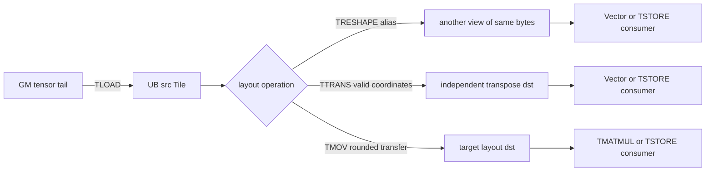
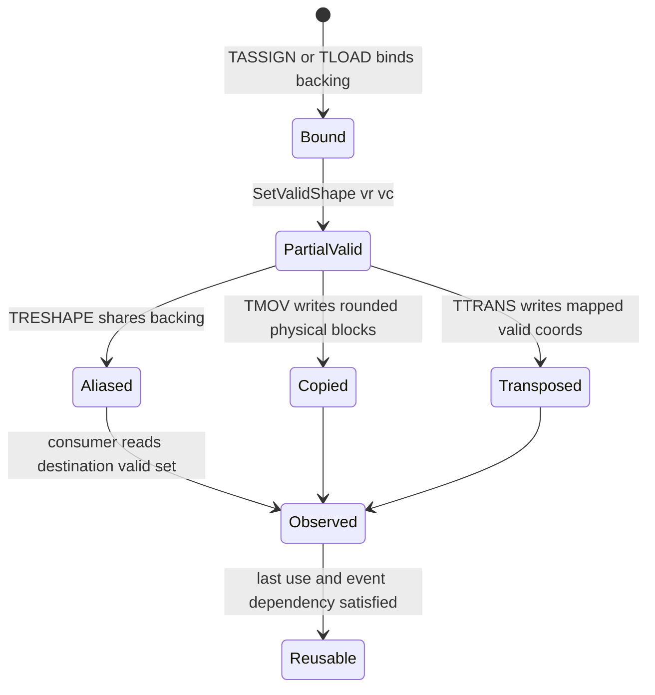

## 本篇在 PTO 课程路线中的位置

课程 30 已把三个动作分开：`TRESHAPE` 共享 backing storage，`TTRANS` 产生独立的转置结果，`TMOV` 执行 target-specific representation/location conversion。但只看 full Tile，这三种 contract 都显得很整齐；真正容易出错的是 capacity 大于 valid shape 的 tail Tile。

本篇只研究一个问题：**padding 可以被实现触碰到什么程度，以及它在什么条件下会从“无语义字节”变成下游可见数据？** 课程位置是：

```text
TRESHAPE/TTRANS/TMOV 职责三分
  → partial-valid 的读取集合与 padding poison
  → A5 fractal tail 的 consumer contract
```

源码基线是 pto-isa [`e131fa0b`](https://github.com/hw-native-sys/pto-isa/commit/e131fa0b0c5aa052c0926cfeca4369096898ce2b)。本文以该 commit 的规范、头文件和测试为事实；历史提交 [`507f8dc5`](https://github.com/hw-native-sys/pto-isa/commit/507f8dc5583841642ff1b9ca655d8ddba640cb4a) 只用来确认 `TTRANS` 从 static extent 改为读取 runtime valid shape 的演进，不把提交说明中的“all ST”当作今天组合场景的完整证明。

## 前置知识

- `Tile<..., Rows, Cols, ..., RowValid, ColValid, ...>` 同时携带 capacity shape 与 valid shape；源码只要求 `ValidRow <= Rows`、`ValidCol <= Cols`。[`pto_tile.hpp`](https://github.com/hw-native-sys/pto-isa/blob/e131fa0b0c5aa052c0926cfeca4369096898ce2b/include/pto/common/pto_tile.hpp#L1421-L1471)
- dynamic valid shape 可由构造参数或 `SetValidShape` 写入，但它是 Tile handle 的元数据，不是 backing storage 内的一段 header。[`pto_tile.hpp`](https://github.com/hw-native-sys/pto-isa/blob/e131fa0b0c5aa052c0926cfeca4369096898ce2b/include/pto/common/pto_tile.hpp#L1629-L1676)
- 对 ND row-major Tile，valid region 是左上角矩形；当 `validCol < capacityCol` 时，每个有效行之后都有 padding hole。
- padding 没有业务语义，并不等于实现绝不能读取或写入它；正确性要求是 padding 不能被冒充为有效结果。

## 今日两个核心问题

1. 为什么 `src.valid_numel == dst.valid_numel` 仍不足以证明 partial-valid `TRESHAPE` 合法？
2. 如何用 padding poison 区分“物理 burst 触碰 padding”与“下游把 padding 当数据消费”？

## PTO 全栈中的位置



上游决定 capacity、valid shape、layout、location 和 backing address；指令实现决定实际读取/写入哪些物理字节；下游 consumer 决定哪些结果坐标会进入计算。只有把三者放在同一张图里，才能定义组合是否合法。

## 概念和精确语义

先定义三个集合：

- `Vsrc`：source 的语义有效坐标；
- `Rop`：当前指令可能读取的物理 offset；
- `Cdst`：后续 consumer 会当作有效值读取的 destination 坐标。

padding safety 不是简单的 `Rop` 不得碰 padding，而是：

> 每个进入 `Cdst` 的值，都必须能追溯到 `Vsrc` 中有定义的值，或追溯到规范明确规定的 padding fill。

对 ND source capacity `[Rs, Cs]` 与 destination capacity `[Rd, Cd]`，`TRESHAPE` 不搬字节。destination 坐标 `(i,j)` 读取线性 offset：

\[
k=i\cdot C_d+j
\]

它对应 source 坐标：

\[
\phi(i,j)=\left(\left\lfloor k/C_s\right\rfloor,\ k\bmod C_s\right)
\]

因此最小安全条件不是 valid 元素个数相等，而是：

\[
\phi(C_{dst})\subseteq V_{src}
\]

如果 `validCol == Cs`，source 有效字节恰好是一个连续前缀，检查可以简化；如果 `validCol < Cs`，有效行之间有洞，flatten 后的连续 destination 前缀很容易踩洞。

这也给出四层不能互相替代的合法性：

1. **type legality**：dtype、location、layout、TileType 和 static capacity 满足指令重载；
2. **storage legality**：地址对齐、总字节数、别名方向和 backing lifetime 合法；
3. **value-domain legality**：指令实际生成的每个逻辑值都有定义，dynamic valid 没有越过 source 已初始化域；
4. **composition legality**：下游读取的每个值，都能沿 alias/copy/rearrangement 链回溯到已定义 source 或规定 fill。

现有 `static_assert` 大多守住前两层；`GetValidRow/Col` 帮单条 `TTRANS/TMOV` 收紧第三层；今天真正缺的是第四层。只验证某条指令的局部输出，无法证明下一条指令不会重新解释它的 padding。反过来，看到物理 burst 覆盖 valid rectangle 之外，也不能跳过前三层直接判定错误：硬件搬运粒度可以大于语义粒度，关键仍是多出来的字节是否变得可观察。

## 真实文件、类型、API 或指令逐段解读

### 1. `TRESHAPE`：byte-size legal 不等于 valid-domain legal

英文规范明确说：A2/A3/A5 只保证 source valid region 内的元素，padding 可能可访问也可能不可访问；CPU simulation 的直接内存 reinterpretation 会保留全部字节。[`treshape.md`](https://github.com/hw-native-sys/pto-isa/blob/e131fa0b0c5aa052c0926cfeca4369096898ce2b/docs/isa/tile/ops/layout-and-rearrangement/treshape.md#L7-L15) 规范同时要求 source/destination location 相同、总字节数相同，并拒绝 boxed 与 non-boxed 的互转。[约束](https://github.com/hw-native-sys/pto-isa/blob/e131fa0b0c5aa052c0926cfeca4369096898ce2b/docs/isa/tile/ops/layout-and-rearrangement/treshape.md#L60-L87)

实现与这组结构约束一致：CPU 路径检查 location、总字节数、dtype category 和 boxed mode；`__CPU_SIM` 直接让 `dst.data()` 指向 `src.data()`。[`cpu/TReshape.hpp`](https://github.com/hw-native-sys/pto-isa/blob/e131fa0b0c5aa052c0926cfeca4369096898ce2b/include/pto/cpu/TReshape.hpp#L35-L61) A2/A3 手工 Tile 用 `TASSIGN_IMPL` 绑定同一地址，自动 Tile 用 `__cce_alias`；A5 复用这份实现。[`a2a3/TReshape.hpp`](https://github.com/hw-native-sys/pto-isa/blob/e131fa0b0c5aa052c0926cfeca4369096898ce2b/include/pto/npu/a2a3/TReshape.hpp#L40-L54)

但这些检查没有验证 `phi(Cdst) ⊆ Vsrc`，也不会把 source valid shape 自动传播给 destination。于是当前 API 能接受“总字节完全相等，但 destination valid view 把 source padding 纳入读取集合”的组合。

还有一个文档边界：当前中文 [`treshape_zh.md`](https://github.com/hw-native-sys/pto-isa/blob/e131fa0b0c5aa052c0926cfeca4369096898ce2b/docs/isa/tile/ops/layout-and-rearrangement/treshape_zh.md#L9-L73) 尚未包含英文版的 valid-region/padding 段落。本文把英文现行规范与实现作为证据，不把双语差异自行解释成另一套语义。

### 2. `TTRANS`：只遍历 source valid rectangle

CPU implementation 取得 `src.GetValidRow/Col()`，只执行 `dst(c,r)=src(r,c)` 的有效循环。[`cpu/TTrans.hpp`](https://github.com/hw-native-sys/pto-isa/blob/e131fa0b0c5aa052c0926cfeca4369096898ce2b/include/pto/cpu/TTrans.hpp#L338-L346) A2/A3 与 A5 wrapper 同样读取 source runtime valid shape，再交给各自 transpose implementation。[A2/A3](https://github.com/hw-native-sys/pto-isa/blob/e131fa0b0c5aa052c0926cfeca4369096898ce2b/include/pto/npu/a2a3/TTrans.hpp#L1114-L1133) [A5](https://github.com/hw-native-sys/pto-isa/blob/e131fa0b0c5aa052c0926cfeca4369096898ce2b/include/pto/npu/a5/TTrans.hpp#L821-L842)

这比 reshape 强：value mapping 已定义。但当前通用 wrapper 没有找到 runtime 断言来证明 `dst.valid == [src.validCol, src.validRow]`，也没有普适的 src/dst overlap verifier。测试 kernel 让两块 UB 地址分离并正确交换 valid shape，只能证明这些用例的构造正确，不能提升为所有调用点的静态保证。

### 3. A2/A3 generic `TMOV`：语义取交集，物理按 32 B 取整

generic Vec-to-Vec 路径用 source/destination valid row、col 的最小值限定逻辑拷贝范围；但每行 `blockLen` 是 `ceil(validCol * sizeof(T) / 32)`。[`a2a3/TMov.hpp`](https://github.com/hw-native-sys/pto-isa/blob/e131fa0b0c5aa052c0926cfeca4369096898ce2b/include/pto/npu/a2a3/TMov.hpp#L78-L148)

因此 `half` 的 5 个有效列只有 10 B，物理搬运仍可能覆盖一个 32 B block，即这一行 16 个 `half`。这是实现粒度事实，不等于“后 11 个值有效”。只要 destination valid shape 与 consumer 都不观察这些字节，语义仍可正确；若后接不安全的 reshape，则原本不可观察的 padding 会被重新命名为 valid data。

## 对象、Tile 与 Buffer 生命周期



`src` handle 在 `TLOAD` 后持有 UB 地址与 valid metadata。`TRESHAPE` 新建的 `dst` handle 获得同一 backing identity，但保留自己的类型与 valid metadata；任一 alias 在 last use 前都阻止这段 UB 被安全复用。`TTRANS/TMOV` 则写入 destination backing，待对应 pipeline dependency 完成后才可由 consumer 读取。padding 的“失效点”不是某条指令结束，而是所有可能把它纳入有效读取集合的 alias/consumer 都结束。

从接口契约看，三条路径还承担不同的前置、后置条件：

- `TRESHAPE(dst, src)` 的输入是两个已经分配或可绑定的 Tile handle。调用前要证明同 location、等总字节和允许的 type mode；调用后只新增 alias 关系，不产生“dst 数据已完成”的异步事件。失败通常是编译期 `static_assert`，而 dynamic valid 映射错误当前可能静默通过。
- `TTRANS(dst, src, tmp)` 要求 source 的 valid rectangle 已对执行 pipe 可见，destination backing 可写且足够容纳交换后的 rectangle。后置条件只定义交换后的有效坐标；若调用者把 destination valid 设得更大，新增区域不会自动获得语义。它与前后 MTE/Vector 操作之间仍要遵守 event 依赖。
- `TMOV(dst, src)` 的具体合法组合由 target 和 TileType/layout 分派。generic Vec 路径只对 valid 交集负责，destination 更大的 valid metadata不会让未复制区域自动初始化；layout-changing 路径还可能要求 fractal 对齐。调用失败既可能是编译期不匹配，也可能表现为调用者把 unspecified 区域交给后续计算。

并发方面，这些 handle 都不是带锁容器。两个执行流若对同一 backing 一读一写，不能因为它们拥有不同 C++ Tile 变量名就视为独立；必须由 compiler alias analysis 与 Record/Wait 或等价同步建立 happens-before。尤其 `TRESHAPE` 会隐藏“变量不同但地址相同”，因此 PlanMemory 也不能在一个 alias 的语义 last use 之前回收该物理区。

## 端到端调用链或指令链

考虑一条真实可组成的链：

```text
GlobalTensor tail
  → TLOAD(src ND, valid 3×5)
  → TMOV(tmp ND, logical intersection; 32 B row burst)
  → TRESHAPE(view 2×32, alias tmp bytes)
  → Vector consumer / TSTORE(read view valid 1×15)
```

`TLOAD` 决定 source 的 tail；`TMOV` 可能把每行 padding 一并带到 `tmp`；`TRESHAPE` 没有新增流量，却改变了 destination 坐标到这些字节的解释；最后一个 consumer 才让污染成为可观察错误。单测若只比较 `TMOV` 的 3×5 valid rectangle，链条会通过；只测 full-shape reshape也会通过；组合测试才会暴露不变量破坏。

## 具体 shape、Tile 和状态演算

取 ND `half` Tile：

```text
capacity = [4, 16]      64 elements = 128 B
valid    = [3, 5]       15 semantic elements
location = UB
layout   = ND row-major
```

16 个 `half` 恰好一行 32 B。有效坐标写入 `100*r+c`，其余位置写入 source poison `S`（例如检查 raw bits 的 quiet-NaN pattern），得到：

| source row | offset | 物理内容 |
| --- | --- | --- |
| 0 | `0..15` | `0,1,2,3,4,S,...,S` |
| 1 | `16..31` | `100,101,102,103,104,S,...,S` |
| 2 | `32..47` | `200,201,202,203,204,S,...,S` |
| 3 | `48..63` | 全部 `S` |

现在 `TRESHAPE` 成 `[2,32]`，并令 destination valid 为 `[1,15]`。两边 valid numel 都是 15，但 destination 读取 offset `0..14`：

| destination offset | 映射回 source | 结果 |
| --- | --- | --- |
| `0..4` | row 0, col `0..4` | 5 个正确值 |
| `5..14` | row 0, col `5..14` | 10 个 padding poison |
| source `16..20,32..36` | 未被 destination 读取 | 10 个有效值丢失 |

所以“相同 valid numel”失败得很具体：valid set 是带 stride 的二维集合，不是连续数组前缀。

这个反例还有两个有用的对照。若 source valid 改为 `[3,16]`，其定义域是连续 offset `0..47`，那么 destination `[2,32] valid[1,15]` 虽然只消费其中一小段，却不会读取 padding；它是 value-safe，但可能不是业务想要的 reshape。若 source 仍为 `[3,5]`，先把 15 个值 compact 到容量 `[1,16] valid[1,15]`，再 alias 为兼容 view，则映射可以成立，代价是一次显式搬运。由此可见 verifier 要回答“会不会读未定义值”，而不是替 caller 猜测“这个 shape 是否符合模型意图”。

相反，若执行 `TTRANS`，destination capacity 仍足以容纳结果并设 valid `[5,3]`，它读取 source 的 15 个有效坐标，写入 `dst[c,r]`，不会把每行尾部 poison 当作矩阵元素。若 destination 预先填另一种 poison `D`，测试应分别断言：15 个 valid 坐标等于转置结果；其他坐标是否保持 `D` 只能作为实现观测，除非规范承诺 padding 不被触碰。

## 为什么这样设计及替代方案

`TRESHAPE` 的价值就是零搬运 alias：没有 UB copy、没有额外 event、不会增加 pipeline stage。代价是 caller/compiler 必须证明 view 的读取集合安全。

可以比较三种策略：

| 策略 | 正确性 | 流量/并行 | 维护成本 |
| --- | --- | --- | --- |
| 保持当前低层 alias，由 caller 证明 `phi(Cdst) ⊆ Vsrc` | 最高性能，但证明责任分散 | 0 B；无新同步 | 容易漏检 dynamic valid 组合 |
| compiler/verifier 计算 mapped read set，无法证明则拒绝 | fail closed，最清晰 | 合法 case 仍为 0 B | 需处理 layout 与 dynamic valid |
| 先 compact/repack 有效值，再 reshape | contract 直观 | 额外读写、UB 容量和 event | 实现简单但可能破坏流水收益 |

最小可辩护设计是第二种：static shape/valid 尽量编译期证明；dynamic valid 在 runtime 或 IR verifier 上检查。只有证明失败且业务确实需要 flatten tail 时，才显式插入 compact copy。poison test 是验证手段，不是语义定义。

这里不宜把“始终先清零全部 capacity”当作默认修复。清零确实能让许多错误从随机值变成零，却会增加写流量和同步，还可能掩盖调用者错误扩大 valid region 的事实；对于 reduce、softmax 或 matmul，零也未必是正确的代数单位。更稳妥的顺序是先拒绝无法证明的组合，再由确实需要 padding 值的具体 consumer 明确选择 `zero`、负无穷、最大整数或其他 fill policy。fill 因而是算子语义的一部分，不能由通用 reshape 擅自决定。

## 访存、计算、流水、并行和硬件约束

- `TRESHAPE` 本身不产生设备搬运，但扩大 alias lifetime，可能推迟 UB 地址复用；这是 ownership 成本而非带宽成本。
- A2/A3 generic `TMOV` 的 32 B block rounding 是当前代码事实。对 5 列 `half`，逻辑 10 B/row，物理至少按一个 32 B block组织；是否形成实际 stall、与其他 MTE 流量如何重叠，需要 device trace，本文不猜周期。
- `TTRANS` 的 A2/A3 与 A5 路径按 source valid rows/cols工作；row-wise 或 col-wise 选择影响 gather/scatter 访问形态，但不改变数学映射。
- padding poison 可能使用 NaN，但数值比较会受 NaN 语义影响；验证应比较 raw bits 或同时检查 `isnan` 与坐标，避免测试本身漏报。
- 对 graph/capture 场景，地址与 capacity 通常稳定，dynamic valid 仍可变化。把合法性留给数据相关 host branch 会损害 graphability；static proof 或 device-side bounded check更合适。

## 测试证据与未覆盖风险

**现有测试事实：**

- CPU `TRESHAPE` 测试只覆盖 full-valid `float[2,16] → [1,32]`，通过 `dst.data()==src.data()` 与双向写证明 alias；没有 partial-valid/padding case。[测试](https://github.com/hw-native-sys/pto-isa/blob/e131fa0b0c5aa052c0926cfeca4369096898ce2b/tests/cpu/st/testcase/treshape/main.cpp#L22-L45)
- A2/A3 `TTRANS` generator 用随机 static buffer，golden 只转置 valid rectangle，并把输出外部置零；case 包含 `float[64,128] valid[27,77]`、`int8[64,64] valid[22,63]` 等 tail。[generator](https://github.com/hw-native-sys/pto-isa/blob/e131fa0b0c5aa052c0926cfeca4369096898ce2b/tests/npu/a2a3/src/st/testcase/ttrans/gen_data.py#L21-L83) kernel 把 source valid 交换后设置给 destination。[kernel](https://github.com/hw-native-sys/pto-isa/blob/e131fa0b0c5aa052c0926cfeca4369096898ce2b/tests/npu/a2a3/src/st/testcase/ttrans/kernel.cpp#L40-L64)
- A5 测试同样显式构造 dynamic valid，并在该 kernel 内断言 src/dst UB 地址不同；这证明测试 fixture 不重叠，不是通用 `TTRANS` overlap verifier。[A5 kernel](https://github.com/hw-native-sys/pto-isa/blob/e131fa0b0c5aa052c0926cfeca4369096898ce2b/tests/npu/a5/src/st/testcase/ttrans/kernel.cpp#L35-L56)

**建议的 padding-poison matrix，尚未合入：**

| 组合 | 当前检查 | 期望的负向/不变量测试 |
| --- | --- | --- |
| `TRESHAPE` location 不同、总 byte 不等、boxed mode 不兼容 | compile-time reject | 保留 compile-fail diagnostic |
| `TRESHAPE` 满足 byte size，但 `phi(Cdst) ⊄ Vsrc` | 未见 valid-set 检查 | runtime/verifier fail closed，或必须先 compact |
| `TTRANS` destination valid 未交换 | 未见通用 runtime check | poison dst 后拒绝或证明 consumer 不读错域 |
| `TTRANS` src/dst backing overlap | 测试 fixture 分离 | negative alias test；不要只比较最终部分值 |
| `TMOV` dst valid 大于 src valid | 实现复制交集 | 交集外保持 unspecified，consumer 不得宣称有效 |
| `TMOV → TRESHAPE` 暴露 rounded padding | 单指令测试不足 | E2E consumer 必须命中 source poison 并失败 |

一个可复现的 fixture 应把证据分成三份，而不是只做最终 `allclose`：

1. source valid 写坐标编码值，source padding 写 sentinel `S`；
2. destination 全区先写另一 sentinel `D`，这样能区分“从 source 搬来的 padding”和“根本没被写过”；
3. 执行单指令后先按规范只比较 valid result，再接一个真正的 consumer，把它声明的 valid region `TSTORE` 回 GM，并按 raw bits 检查是否出现 `S` 或 `D`；
4. 对预期非法的动态组合，要求 verifier 给出 source/destination capacity、valid shape 和第一个越界映射 offset，不能把结果留给随机数值失败；
5. 对允许触碰 padding 的组合，不断言 padding byte-for-byte 保持不变，只断言它没有进入 consumer-visible result。

这里还要区分测试的失败类别：compile-fail 证明静态组合不可构造；runtime diagnostic 证明动态 valid 不满足条件；value mismatch 证明未定义字节已经泄漏；padding changed 仅是实现观测，除非规范承诺保持，否则不应单独导致失败。这样同一套测试才能跨 CPU_SIM、A2/A3 和 A5 比较语义，而不强迫不同 backend 具有相同的内部搬运轨迹。

还缺 CPU_SIM/A2/A3/A5 同一 raw-bit fixture、浮点/整数 poison、ND 与 NZ/ZN tail、src/dst/tmp overlap，以及真实 device trace。尤其不能因为 destination padding 恰好保持初值，就反推 ISA 承诺“padding 不写”。

## 与前后章节的连接

课程 29 说明 `TMOV` 的合法性依赖 target 与展开后的 layout；课程 30 说明 reshape、transpose、move 的职责不同。本章再加一维：**合法性必须覆盖 consumer 的读取集合，而不只是 producer 的指令签名。** 下一章将把这个集合证明落到 A5 `ND→NZ/ZN` 的 fractal tail，检查 rounded block、padding ownership 与 `TMATMUL` consumer 如何闭合。

## 本篇结论、知识债、三个理解检查问题和下一章

结论只有四条：

1. partial-valid Tile 是二维有效集合；`valid_numel` 相同不能替代 offset mapping 证明。
2. `TRESHAPE` 的零成本来自 alias，安全条件是 destination consumed offsets 映射回 source valid offsets。
3. `TMOV` 可以因 32 B burst 触碰 padding；只要 padding保持不可观察，这不自动构成语义错误。
4. 最有效的测试不是要求所有 padding 不变，而是用不同 poison 分开 source padding、destination padding与有效结果，追踪哪一类字节进入 consumer。

知识债：实现 static/dynamic valid-set verifier；统一中英文 `TRESHAPE` valid-region说明；补 CPU/NPU poison E2E、overlap negative matrix；验证 A5 ND→NZ/ZN tail 的 padding fill 与 `TMATMUL` 消费边界；用 device trace量化 rounded transfer，而不是从头文件猜 stall。

理解检查：

1. 为什么 `[4,16] valid[3,5] → [2,32] valid[1,15]` 即使 valid numel 相同仍不安全？
2. 若 `TMOV` 把一整块 32 B padding 复制到 destination，什么额外条件会让它从实现细节升级为 correctness bug？
3. 为什么对 destination padding 做“必须保持 sentinel”断言可能比规范更强？应该怎样拆分断言？

下一章：**A5 ND→NZ/ZN partial-valid tail——fractal rounding、padding ownership 与 `TMATMUL` consumer E2E。**

## 课程账本增量

- 基线：pto-isa `e131fa0b`。
- 新覆盖：`Tile::GetValidRow/GetValidCol/SetValidShape`、CPU/A2A3/A5 `TRESHAPE/TTRANS`、A2/A3 generic `TMOV`、CPU reshape alias test、A2/A3/A5 dynamic-valid transpose tests。
- 新不变量：合法组合必须证明 `mapped consumer read set ⊆ source valid set ∪ specified fill set`；物理 padding access 与语义 padding observation必须分开。
- 已证测试边界：现有 `TTRANS` 覆盖 dynamic tail，CPU `TRESHAPE` 只覆盖 full-valid alias；未发现跨三指令的 padding poison 或通用 overlap negative matrix。
- 下一步：在 A5 fractal layout 上把抽象 read-set 证明连接到真实 `TMOV→TMATMUL` consumer。
