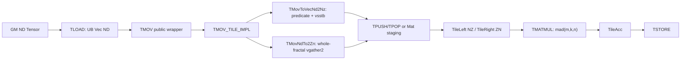
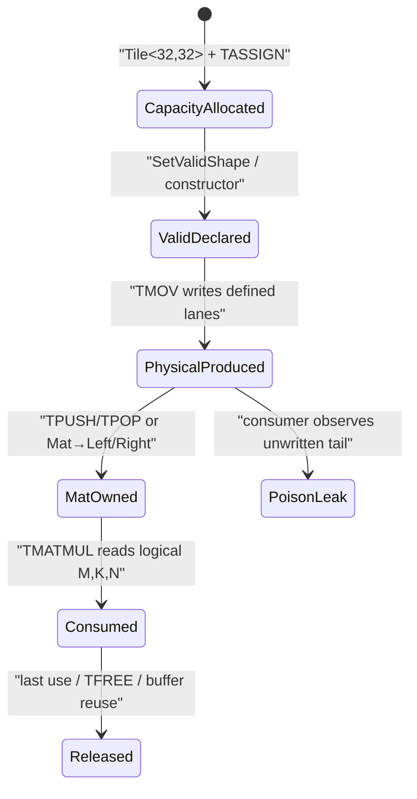

## 本篇在 PTO 课程路线中的位置

课程 31 建立了一个判定式：partial-valid 变换只有在 `mapped consumer read set ⊆ source valid set ∪ specified fill set` 时才安全。本篇把它落到 A5 最容易被“自动补齐”直觉误导的链路：`ND → NZ/ZN → TMATMUL`。

本章源码基线是 pto-isa [`bf80e5d5`](https://github.com/hw-native-sys/pto-isa/commit/bf80e5d50ebfbf8ee361c985781a951127909341)，即 2026-09-11 默认分支最新合入代码。直接相关演进是 ND→NZ 循环重写 [`1cac07f6`](https://github.com/hw-native-sys/pto-isa/commit/1cac07f6e5efac7609a2b022b78cc48076411ce3) 与 ND→ZN 实现/测试提交 [`5e98634a`](https://github.com/hw-native-sys/pto-isa/commit/5e98634aadfef35468b9bf8ae96fe8e2d531973c)。最新基线是同步合并提交，不据其宽泛 diff 推导本章结论。

课程位置：

```text
partial-valid read-set
  → A5 fractal producer 的 tail/fill contract
  → TMATMUL consumer 的运行时有效域
  → producer-consumer 组合验证
```

## 前置知识

- A5 `TileLeft` 展开为 `BLayout::ColMajor + SLayout::RowMajor`，即 NZ；`TileRight` 是 `BLayout::RowMajor + SLayout::ColMajor`，即 ZN。[`pto_tile.hpp`](https://github.com/hw-native-sys/pto-isa/blob/bf80e5d50ebfbf8ee361c985781a951127909341/include/pto/common/pto_tile.hpp#L1760-L1805)
- `Rows/Cols` 是 capacity，`GetValidRow/GetValidCol` 返回静态或运行时 valid metadata；`SetValidShape` 只改 handle 元数据，不初始化 padding。[`pto_tile.hpp`](https://github.com/hw-native-sys/pto-isa/blob/bf80e5d50ebfbf8ee361c985781a951127909341/include/pto/common/pto_tile.hpp#L1626-L1676)
- 对 B16（`half`/`bfloat16_t`），32 B 的 `C0/K0` 是 16 个元素；B8 为 32，B32 为 8。

## 今日两个核心问题

1. A5 `TMOV` 的 ND→NZ 与 ND→ZN 是否以同一种方式支持非对齐 valid tail？
2. `TMATMUL` 已接收未对齐的 `m/k/n`，是否就能证明任意 ND 输入都能安全走到 Cube？

短答案：**不能。ND→NZ 有显式谓词 tail；ND→ZN 当前公开合法域只含完整 fractal。`TMATMUL` 不负责修补上游未生成的物理块。**

## PTO 全栈中的位置



公开 `TMOV` 先等待依赖，再经 `MAP_INSTR_IMPL` 进入后端实现；`TMATMUL` 同样先 `PtoWaitEvents`，再映射到后端。[`pto_instr.hpp: TMOV`](https://github.com/hw-native-sys/pto-isa/blob/bf80e5d50ebfbf8ee361c985781a951127909341/include/pto/common/pto_instr.hpp#L1766-L1771) [`pto_instr.hpp: TMATMUL`](https://github.com/hw-native-sys/pto-isa/blob/bf80e5d50ebfbf8ee361c985781a951127909341/include/pto/common/pto_instr.hpp#L926-L940)

## 概念和精确语义

### ND→NZ：valid 尺寸驱动几何，padding 不被承诺填充

`TMovToVecNd2Nz` 以 destination 的 `validRow/validCol` 计算：

```text
alignRow   = ceil(validRow / 16) * 16
virtualRow = alignRow                  // RowPlusOne 时再 +1
repeat     = ceil(validCol / (CCE_VL / sizeof(T)))
```

每个 column group 重新从 base 定位；每一行 `vlds` 后用只覆盖剩余列数的 predicate 执行 `vsstb`。源码还要求 `srcValidRow > 0` 且 `srcValidRow <= dstValidRow`，这是 [`1cac07f6`](https://github.com/hw-native-sys/pto-isa/commit/1cac07f6e5efac7609a2b022b78cc48076411ce3) 明确加入的边界。[`TMovNd2NzLoop`](https://github.com/hw-native-sys/pto-isa/blob/bf80e5d50ebfbf8ee361c985781a951127909341/include/pto/npu/a5/TMov.hpp#L475-L550)

因此代码事实是：row tail 被 `ceil16` 后用于物理 stride，column tail 被 predicate 截断；未激活的 destination lanes 没有“自动写零”后置条件。另一个尚未闭合的接口缺口是：分支使用 `dst.GetValidCol()` 决定读取列数，却没有对 `src.GetValidCol()` 做对称检查。安全调用者至少要证明 requested destination valid columns 不越过 source 的有效/已填充范围。

### ND→ZN：当前是整 fractal 转置，不是 tail kernel

规范把 `[K,N]` 变成 `[K/K0,N/16,16,K0]`，并明确要求 `K % K0 == 0`、`N % 16 == 0`。[`TMOV.md`](https://github.com/hw-native-sys/pto-isa/blob/bf80e5d50ebfbf8ee361c985781a951127909341/docs/isa/TMOV.md#L42-L70)

实现与之吻合：

```text
kFractals = validRow / K0
nFractals = validCol / 16
for kf in kFractals:
  for nf in nFractals:
    vgather2 one complete K0×16 source slice
    vsts one complete 16×K0 destination fractal
```

这里是整数向下取整，没有 `ceil`、tail predicate 或 fill；静态断言检查 capacity `Rows/Cols` 的整除性，却没有对 dynamic valid 值做运行时整除断言。[`GenerateNd2ZnGather`](https://github.com/hw-native-sys/pto-isa/blob/bf80e5d50ebfbf8ee361c985781a951127909341/include/pto/npu/a5/TMov.hpp#L553-L647)

所以必须区分两句话：

- 规范事实：非整 fractal 的 ND→ZN 不在公开合法域。
- 代码观察：若 capacity 对齐、dynamic valid 不对齐，当前实现会向下截掉尾 fractal，而不是 fail fast。本文不把域外行为升级成“支持部分尾块”。

## 真实文件、类型、API 与逐函数解读

`TMOV_TILE_IMPL` 根据 `SrcTileData::Loc` 和展开后的 layout 分派。`Vec RowMajor/NoneBox → Vec ColMajor/RowMajor` 进入 ND→NZ；`Vec RowMajor/NoneBox → Vec RowMajor/ColMajor` 进入 ND→ZN。它不会修改 destination valid metadata；valid shape 在 Tile 构造或 `SetValidShape` 时已由调用者拥有。[`TMOV_TILE_IMPL`](https://github.com/hw-native-sys/pto-isa/blob/bf80e5d50ebfbf8ee361c985781a951127909341/include/pto/npu/a5/TMov.hpp#L750-L805)

`TMATMUL_IMPL` 只取：

```text
m = aMatrix.GetValidRow()
k = aMatrix.GetValidCol()
n = bMatrix.GetValidCol()
```

检查三者位于 `[1,4095]` 后直接调用 `mad(c,a,b,m,k,n,...)`；layout/type 静态检查确认 Left/Right/Acc 角色，但不重新验证 `bMatrix.GetValidRow()==k`，也不追溯 Right tile 是如何生成的。[`TMatmul.hpp`](https://github.com/hw-native-sys/pto-isa/blob/bf80e5d50ebfbf8ee361c985781a951127909341/include/pto/npu/a5/TMatmul.hpp#L98-L147) 规范仍要求 A/B/C 的有效维度相等，并明确“不得假设 valid-region repair”。[`tmatmul.md`](https://github.com/hw-native-sys/pto-isa/blob/bf80e5d50ebfbf8ee361c985781a951127909341/docs/isa/tile/ops/matrix-and-matrix-vector/tmatmul.md#L85-L98)

## 对象与状态生命周期



所有权边界有三层：Tile handle 持有 valid metadata；UB/L1 backing 持有 capacity bytes；producer 只定义它实际写入的 lanes。只有 consumer 的读取集合不越过定义集合，或越过部分由明确 fill 值覆盖，组合才成立。`TMATMUL(m,k,n)` 是消费边界，不是 producer 的补写动作。

## 具体 shape、Tile 和状态演算

取 B16 capacity 均为 `32×32`，逻辑 GEMM 为：

```text
A: [M,K] = [17,19]
B: [K,N] = [19,13]
C: [M,N] = [17,13]
```

每个 Tile capacity 为 `32×32×2 = 2048 B`，`K0=C0=16`。

| 路径 | 实现计算 | 结果 |
|---|---|---|
| A 的 ND→NZ | `alignRow=32`，17 行、19 列受 predicate 控制 | 323 个逻辑元素被定义；其余 lanes 保留旧值 |
| B 的 ND→ZN | `kFractals=19/16=1`，`nFractals=13/16=0` | 不执行任何 fractal 搬运；这是域外输入 |
| TMATMUL | `m=17,k=19,n=13` | 数学域是 221 个输出、每个 19 项乘加，但它不能恢复缺失的 Right layout |

再看两个单尾巴：`[K,N]=[19,16]` 只生成前 16 个 K rows；`[32,13]` 因 `nFractals=0` 仍不生成。由此可见“capacity 已对齐”不等于“dynamic valid tail 已实现”。

当前可辩护的做法有两类：

1. 保持 ND→ZN 在整 fractal 合法域，把输入显式扩成 `K'=32,N'=16`，所有扩展 A/B lanes 填零，并让 Cube 计算扩展域；最终只 store `17×13`。这增加计算和搬运，但零是乘加的中性元。
2. 不使用这条 ND→ZN producer，改走已有且经验证的 Mat staging/`TLOAD → TMOV(rightTile, matTile)` 路径，并为该路径单独证明 partial-valid contract。

不能做的是只把 metadata 写成 `19×13`，然后期待 `TMOV` 或 `TMATMUL` 猜出 padding 值。

## 为什么这样设计及替代方案

整 fractal ND→ZN 用固定 `vgather2 + vsts`，没有每块 tail 分支，索引生成简单、吞吐可预测，也利于编译和维护；代价是调用者承担对齐或选路。

若要真正支持任意 tail，有两种设计：

- **producer-owned zero fill**：按 `ceil(K/K0)×ceil(N/16)` 生成完整 fractal，越界 lane 写零。正确性最容易组合，额外成本是 padding 初始化、更多 gather/store 和 UB 带宽。
- **consumer-owned mask**：producer 可留下 poison，Cube 必须被证明只在 `m/k/n` 内取数。写流量更少，但需要 target-specific 的 `mad` 读取/屏蔽证据、跨版本测试和更强 verifier；当前公开源码不足以确认物理读是否触碰 tail，因此本文只把它列为待验证方案。

最小、可审计的近期改进不是立即实现所有 tail，而是 fail closed：对 ND→ZN 的 runtime valid 也断言 `K%K0==0 && N%16==0`；对 ND→NZ 补齐 source/destination valid-column 关系检查。这样维护成本低，并把 silent truncation 变成可定位错误。

## 访存、计算、流水、并行和硬件约束

- ND→NZ 的 `vlds/vsstb` 属于 Vector 路径；`alignRow` 和可选 `RowPlusOne` 决定 scatter stride，后者用于规避 UB bank conflict。谓词减少语义写集合，但不能仅凭源码等同为同量级物理 transaction。
- ND→ZN 每个完整 fractal搬运 `K0×16×sizeof(T)` 字节，恰为 B8/B16/B32 各 512 B；不完整 fractal 当前不进入循环。
- 显式把 `[17,19]×[19,13]` pad 到 `[17,32]×[32,16]`，乘加数从 `17×13×19=4199` 增至 `17×16×32=8704`，约 2.07 倍；换来的是无歧义的零填充组合语义。
- `TMOV → TPUSH/TPOP → TMOV Left/Right → TMATMUL` 跨 Vector、MTE/L1 与 Cube，需要现有 event/flag 保序；valid metadata 不构成硬件同步。

## 测试证据与未覆盖风险

当前直接证据很清楚，也很有限：

- ND→NZ 真机测试只有 `hifloat8` 的 `32×32、32×64、64×64`，generator 明确要求 rows 对 16、cols 对 32 对齐，并逐字节比较完整 NZ payload。[kernel](https://github.com/hw-native-sys/pto-isa/blob/bf80e5d50ebfbf8ee361c985781a951127909341/tests/npu/a5/src/st/testcase/tmov_nd2nz/tmov_nd2nz_kernel.cpp#L17-L76) [golden](https://github.com/hw-native-sys/pto-isa/blob/bf80e5d50ebfbf8ee361c985781a951127909341/tests/npu/a5/src/st/testcase/tmov_nd2nz/gen_data.py#L18-L47)
- ND→ZN 覆盖 B8/B16/B32 的 12 个 full-fractal shape，并用 raw integer bits 比较整个输出；所有 shape 都满足 `K%K0==0,N%16==0`。[kernel](https://github.com/hw-native-sys/pto-isa/blob/bf80e5d50ebfbf8ee361c985781a951127909341/tests/npu/a5/src/st/testcase/tmov_nd2zn/tmov_nd2zn_kernel.cpp#L17-L90) [golden](https://github.com/hw-native-sys/pto-isa/blob/bf80e5d50ebfbf8ee361c985781a951127909341/tests/npu/a5/src/st/testcase/tmov_nd2zn/gen_data.py#L18-L85)
- `tpushpop_vc` 确有完整 consumer 链：Vector `TADD→TMOV(NZ)→TPUSH`，Cube `TPOP→TMOV Left`；右侧 `TLOAD→TMOV Right`，随后 `TMATMUL→TSTORE`。case13 使用 `float M=128,K=64,N=64`，以 `0.001` 容差比较最终矩阵，但仍是全对齐场景。[kernel](https://github.com/hw-native-sys/pto-isa/blob/bf80e5d50ebfbf8ee361c985781a951127909341/tests/npu/a5/src/st/testcase/tpushpop_vc/tpushpop_vc_kernel.cpp#L303-L434) [host test](https://github.com/hw-native-sys/pto-isa/blob/bf80e5d50ebfbf8ee361c985781a951127909341/tests/npu/a5/src/st/testcase/tpushpop_vc/main.cpp#L153-L221)

仍缺：ND→NZ dynamic tail raw-bit poison、ND→ZN 域外 fail-fast、`M/K/N` 分别取 `1、15、16、17、31、32、33` 的组合矩阵，以及真正的 `TMOV producer → TMATMUL consumer` padding poison E2E。建议 E2E 先把 A/B capacity 填 `NaN`，只写 valid 值；若选择 producer-owned fill，则检查 rounded tail 被改成 `+0`，再比较 C 的 valid 区。另需独立检查 C padding 未被误 store，不能只看数值容差。

## 与前后章节的连接

课程 29 证明同名 `TileLeft/TileRight` 在代际间不等价；课程 30 区分 view、transpose 与物理 move；课程 31 给出 read-set 判定。本篇进一步说明：**单个 consumer 支持动态尺寸，不代表任意 producer 都能生成对应物理表示。** 下一章应回到验证层，把这份契约变成可执行的 A5 poison/fail-closed matrix，而不是继续扩展更多指令名。

## 本篇结论、知识债与理解检查

结论：

1. A5 ND→NZ 的 tail 由 `ceil16` 几何与 column predicate实现，但 padding 没有隐式零填充承诺。
2. A5 ND→ZN 当前是 full-fractal kernel；dynamic valid 非整除会被向下截断，且属于规范域外行为。
3. `TMATMUL` 的 `m/k/n` 定义逻辑消费域，不修复上游 layout，也不能单独证明 padding 不被物理读取。
4. 在缺少硬件 mask 证据时，producer-owned zero fill 或整 fractal fail-closed 是最小可证明设计。

知识债：runtime alignment verifier、ND→NZ valid-column 对称检查、raw-bit tail poison、producer→consumer E2E、Mat staging partial-valid 对照、`mad` device read/mask trace，以及 zero-fill 的周期/带宽成本。

三个理解检查：

1. 为什么 `Tile<half,32,32>` 的 capacity 合法，仍不能让 `valid=[19,13]` 的 ND→ZN 成为合法调用？
2. 若 B 的 K-tail 是零，但 A 的 K-tail 是 poison，把 `k` 从 19 改成 32 是否仍正确？为什么？
3. 一个 E2E 只比较 C 的 `17×13` 有效区，还需要什么证据才能区分“Cube 正确 mask”与“producer 恰好留下了零”？

下一章：**A5 fractal-tail 验证协议——把 runtime alignment fail-closed、source/destination poison、neutral fill 与 `TMATMUL` consumer matrix 落成可执行测试。**

## 课程账本增量

- 章节：32
- 基线：pto-isa `bf80e5d50ebfbf8ee361c985781a951127909341`
- 新覆盖：A5 `TMovNd2NzLoop/TMovToVecNd2Nz/GenerateNd2ZnGather/TMovNdTo2Zn/TMOV_TILE_IMPL`，`TMATMUL_IMPL/mad(m,k,n)`，ND→NZ/ZN raw-byte tests 与 `tpushpop_vc` consumer chain。
- 新不变量：producer 合法域、defined physical lanes 与 consumer logical read-set 必须组合证明；capacity alignment 不能替代 dynamic-valid alignment；metadata 不产生 fill。
- 待验证：ND→NZ tail 真机行为、ND→ZN runtime reject、Cube mask/physical read、producer-owned zero-fill 成本。

