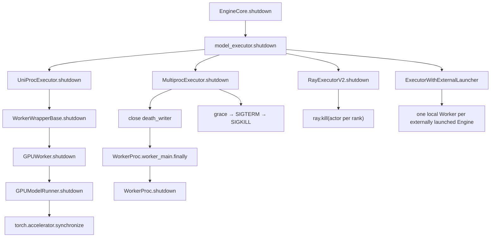

> 源码基线：[`vllm-project/vllm@84030bbe`](https://github.com/vllm-project/vllm/commit/84030bbe3d74d99bad477a3d2e37a973ccd8865c)，默认分支截至 2026-09-11 的最新提交；它修复 deferred KV free 下的 zero-progress preemption cascade，与本文 shutdown 聚合路径无直接修改。代码搜索没有发现已合入的 `ShutdownProgress` 或 `ShutdownReport` 类型。本文会把“当前代码事实”和“建议契约”分开陈述。

## 本篇在课程路线中的位置

第 28 章解决了“child 被强杀后，最近证据不能随 child 一起消失”，并把 latest snapshot 的所有权交给 parent。本章向下接到 Worker 的 device fence，向上接到 EngineCore，回答一个边界更窄的问题：**谁有资格断言所有执行 rank 都完成了 cleanup？**

```text
parent-owned durable evidence
→ Worker device-fence progress
→ Executor expected-set 聚合
→ EngineCore backend-neutral terminal contract
```

## 前置知识回顾

关闭证据有强弱顺序：`metadata_cleared < completed_observed`；进程退出属于隔离证据，不自动升级 device completion。`record-before-destroy` 在危险操作前发 `started`，成功返回后发 `completed`。若执行卡死，最后可诚实保留的是“卡在哪”，不是虚构的 final。

第 27–28 章还确定了 identity：`shutdown_generation + engine/rank + report_seq`。但只有 identity 仍不够；聚合者必须先知道**本次本应收到谁**，否则收到一个成功报告就可能误判全局成功。

## 本篇要回答的核心问题

1. `UniProcExecutor.shutdown()`、`MultiprocExecutor.shutdown()`、Ray V2 和 external launcher 返回时，分别证明了什么？
2. 如何定义 expected worker set，使一个 rank 缺失 final 时不会被其他 rank 的成功遮蔽？
3. Worker 的 `torch.accelerator.synchronize()` 证据怎样经过 Executor 到达 EngineCore，同时保持有界、可去重且不依赖业务数据面？

## 组件在全局架构中的位置

当前 backend 共享 `Executor` 抽象，却没有共享相同强度的 terminal result：



图中的调用名都来自当前代码。关键差异是：UniProc 的异常和返回值仍在同一调用栈；MP parent 主要观察 `BaseProcess.is_alive()`；Ray V2 观察 actor 被终止；external launcher 的每个 Executor 只拥有一个本地 Worker，整个 TP world 的 ownership 位于外部 launcher。

这也给出一条所有权原则：**能枚举资源实例的一层，才有资格定义 expected set；能观察危险操作返回的一层，才有资格生成 completion evidence。** Executor 能枚举自己创建的 Worker handle，但只有 Worker 能观察本 rank 的 device fence。EngineCore 位于两者之上，可以消费 aggregate，却不能根据 backend 已经“看不见”某个 child 来补写 Worker 内事实。external launcher 又多一层：单个 Executor 甚至不能枚举全局 TP peers，因此 global aggregate 必须继续上移。

## 完整调用链

[`EngineCore.shutdown`](https://github.com/vllm-project/vllm/blob/84030bbe3d74d99bad477a3d2e37a973ccd8865c/vllm/v1/engine/core.py#L756-L772) 先清 structured-output backend，再调用 `model_executor.shutdown()`，随后才调用 `scheduler.shutdown()`。Executor 选择发生在 [`Executor.get_class`](https://github.com/vllm-project/vllm/blob/84030bbe3d74d99bad477a3d2e37a973ccd8865c/vllm/v1/executor/abstract.py#L48-L93)：`uni`、`mp`、`ray` 和 `external_launcher` 进入不同实现。

### UniProc：调用返回可观察，但仍不是结构化回执

[`UniProcExecutor.shutdown`](https://github.com/vllm-project/vllm/blob/84030bbe3d74d99bad477a3d2e37a973ccd8865c/vllm/v1/executor/uniproc_executor.py#L152-L155) 直接调用 `driver_worker.shutdown()`；[`WorkerWrapperBase.shutdown`](https://github.com/vllm-project/vllm/blob/84030bbe3d74d99bad477a3d2e37a973ccd8865c/vllm/v1/worker/worker_base.py#L242-L245) 再调用真实 Worker。GPU 路径最终进入 [`GPUModelRunner.shutdown`](https://github.com/vllm-project/vllm/blob/84030bbe3d74d99bad477a3d2e37a973ccd8865c/vllm/v1/worker/gpu/model_runner.py#L2146-L2176)：先 `torch.accelerator.synchronize()`，再清 KV cache、attention groups、model state 和模型引用。

因此，同步调用正常返回至少说明该 fence 被当前进程观察到；抛错则会沿栈上传。但接口返回 `None`，没有 owner census，也没有 `generation/rank/seq`。

### Multiproc：自然退出路径与升级信号是两条链

[`MultiprocExecutor.shutdown`](https://github.com/vllm-project/vllm/blob/84030bbe3d74d99bad477a3d2e37a973ccd8865c/vllm/v1/executor/multiproc_executor.py#L502-L533) 先关闭每个 worker handle 的 `death_writer`。child 的 death-pipe monitor 因 EOF 设置 `shutdown_requested` 并关闭消息队列；busy loop 退出后，[`WorkerProc.worker_main`](https://github.com/vllm-project/vllm/blob/84030bbe3d74d99bad477a3d2e37a973ccd8865c/vllm/v1/executor/multiproc_executor.py#L852-L977) 在 `finally` 调用 `worker.shutdown()`。

parent 同时运行 [`_ensure_worker_termination`](https://github.com/vllm-project/vllm/blob/84030bbe3d74d99bad477a3d2e37a973ccd8865c/vllm/v1/executor/multiproc_executor.py#L451-L500)：默认等待 `VLLM_WORKER_SHUTDOWN_TIMEOUT_SECONDS=5` 秒，残留进程收 TERM，再等 4 秒，仍存活便 `kill()`。这条路径统计的是 alive process；当前函数在发 KILL 后没有读取 per-rank cleanup result，也没有在这里再次 join 并生成 terminal evidence。

更细看通信顺序，child 的 [`WorkerProc.shutdown`](https://github.com/vllm-project/vllm/blob/84030bbe3d74d99bad477a3d2e37a973ccd8865c/vllm/v1/executor/multiproc_executor.py#L816-L825) 先 shutdown broadcast/response MQ，之后才进入真实 `worker.shutdown()` 和 distributed environment destroy。于是即便把 Worker cleanup 改成“返回一个 dict”，该值也没有现成的 response MQ 可走。这不是少一个字段，而是**回执通道的生命周期短于被观察操作**；修复必须调整 ordering 或增加不依赖业务 MQ 的 sideband。

### Ray V2 与 external launcher：expected set 的 owner 不同

Ray V2 虽继承 MP 的 MessageQueue 数据面，但 [`RayExecutorV2.shutdown`](https://github.com/vllm-project/vllm/blob/84030bbe3d74d99bad477a3d2e37a973ccd8865c/vllm/v1/executor/ray_executor_v2.py#L554-L580) 会锁住幂等入口、等待 monitor thread，然后逐 actor 执行 `ray.kill()`，最后关闭 MQ。actor 的 [`run()`](https://github.com/vllm-project/vllm/blob/84030bbe3d74d99bad477a3d2e37a973ccd8865c/vllm/v1/executor/ray_executor_v2.py#L221-L234) 在正常展开时会于 `finally` 调用自身 `shutdown()`，但强制 kill 不提供“该 finally 已完整返回”的证明，executor 也没有收集结构化 final；actor 不可调用只证明隔离。

[`ExecutorWithExternalLauncher`](https://github.com/vllm-project/vllm/blob/84030bbe3d74d99bad477a3d2e37a973ccd8865c/vllm/v1/executor/uniproc_executor.py#L161-L207) 继承 UniProc：每个 torchrun 进程创建一个 Executor/Worker，`rpc_rank=0`，而 distributed `rank` 来自 `RANK` 环境变量。单个 Executor 可证明本地 Worker，却无法独自量化整个外部 world；global expected set 必须由 launcher/supervisor 冻结并聚合。

## 关键类型、字段和状态生命周期

下面是**建议契约**，不是当前 API。帧只含 Host 控制数据：无 tensor shape，`dtype/device` 不适用，编码后应有固定大小上限。

```python
class WorkerShutdownProgress(msgspec.Struct, array_like=True):
    generation: str
    backend: str
    rpc_rank: int
    global_rank: int
    report_seq: int
    owner: str              # gpu_model_runner / connector / worker
    phase: str              # started / completed / failed
    device_completion: str  # observed / unknown / not_applicable
    terminal: bool
    error_digest: str | None
```

生命周期应是：Executor 在破坏通信资源前冻结 `expected_workers`；Worker 在 fence 前发 `started`，fence 返回后发 `completed_observed`，每帧由 parent collector 按 identity/sequence 更新 latest view；Executor 到 deadline 后为缺失 final 的 rank合成 `abandoned_by_deadline`；EngineCore 只消费聚合结果，不自行猜测 backend 细节。

接口边界也应明确：当前 `GPUModelRunner.shutdown()` 无输入、返回 `None`，调用线程与模型所在 Worker 同进程；MP 中它发生在业务 busy loop 退出之后，因此不再接受新 RPC，但 device 上仍可能有异步工作，首个 `synchronize()` 正是完成性栅栏。正常返回只能证明该 Worker 的调用链走完；抛异常会中止当前串行清理，native 调用永久阻塞则只能由进程级 deadline 截断。建议的 progress frame 属于 parent-owned Host 控制数据，Worker 只生成，collector 持有 latest view，EngineCore 只读聚合结果。

建议 reducer 使用单向状态机：`PENDING → STARTED → COMPLETED|FAILED`。只有同一 `(generation, global_rank, owner)` 下更大的 `report_seq` 才能前进；terminal 之后的旧帧不得回退状态。deadline 到来时，`PENDING` 表示从未观察到 owner 启动，`STARTED` 表示已进入但完成性未知，两者都可被聚合层标为 `abandoned_by_deadline`，却不能改成 `FAILED`——“明确失败”需要 child 返回异常证据，“未知”则是证据缺失。这个区分决定后续能否安全复用 CUDA context、共享内存或 KV backing。

```mermaid
sequenceDiagram
    participant EC as EngineCore
    participant EX as Executor parent
    participant W0 as Worker rank 0
    participant W1 as Worker rank 1
    participant PC as Parent collector

    EC->>EX: shutdown(generation, remaining_budget)
    EX->>EX: freeze expected={0,1}
    W0->>PC: seq=6 device_sync started
    W1->>PC: seq=4 device_sync started
    W0->>PC: seq=7 completed_observed, terminal=true
    Note over W1: synchronize 永久阻塞
    EX->>W1: TERM, then KILL at deadline
    EX->>PC: close generation; missing_final={1}
    PC-->>EX: rank0=completed, rank1=abandoned/unknown
    EX-->>EC: aggregate terminal=false
```

## 逐函数源码解读

`Executor.shutdown()` 的基类实现只是 `collective_rpc("shutdown")`。它展示了最直观方案，却被各主要 backend 覆盖：原因正是普通 RPC 可能与将被关闭的业务 MQ、actor 或 worker 一起失效。

MP 的 `collective_rpc` 已有一个值得复用的正确做法：先计算绝对 `deadline = monotonic() + timeout`，逐 queue dequeue 时只传剩余预算。可是 shutdown 没走这条 RPC，也没有复用 response aggregation；因此“统一剩余预算”与“统一 rank 终态”仍是两项未完成工作。

`WorkerProcHandle` 持有 process、rank 和 response MQ；`RayWorkerHandle` 明确持有 `rank/local_rank/node_id/run_ref`；`WorkerWrapperBase` 同时区分 `rpc_rank` 和 `global_rank`。这些现有 identity 足以构造 expected set，缺的是把它冻结到 generation，并让 final 走一条在业务 MQ teardown 之前仍可用的有界控制通道。

冻结动作必须先于第一项破坏性 cleanup。若一边关闭 Worker、一边从“当前仍存活的 handles”推导 expected set，恰好先退出的健康 rank 反而会从集合中消失，最后可能只剩挂住的 rank；此时集合相等也毫无意义。正确做法是从初始化成功并已纳入本 Engine generation 的 handle 快照构造 `E`，之后只允许状态变化，不允许成员因退出而删除。启动未完成的 Worker 则应有单独的 admission/initialization terminal，不应假装它执行过正常 shutdown。

`GPUWorker.shutdown` 当前按 Connector、profiler、weight transfer、elastic EP、model runner、CuMem pool 串行关闭。`GPUModelRunner.shutdown` 的 synchronize 是 device completion 的关键观察点；若它抛错或卡住，后续断引用不能倒推出 fence 成功。近期已合入的 [PR #51622](https://github.com/vllm-project/vllm/pull/51622) 在 CPU KV offload 中区分了 event wait 与本地 metadata cleanup，但没有提供跨 rank transport，这正是本章接口要补的层次。

## 具体示例与 shape/状态演算

设 `TP=2, PP=1`，MP Executor 在一个节点创建两个 Worker：

为让 device 所有权具体化，假设每个 rank 的某个后端持有两个教学用 `torch.float16` CUDA KV tensor，shape 均为 `[16, 2, 16, 64]`：每个 tensor 是 65,536 个元素、128 KiB。这个 shape 只是演算，不是 vLLM 的统一 ABI；真实布局由 attention backend 和 KV cache layout 决定。关键点是这些 tensor 不进入 progress frame：Worker 只报告“对应 fence 是否被观察到”和 census 摘要，避免诊断协议反向延长 GPU allocation 生命周期。

| 时刻 | expected | rank 0 latest | rank 1 latest | 可得结论 |
| --- | --- | --- | --- | --- |
| T0 | `{0,1}` | 无 | 无 | 不能判定 |
| T1 | `{0,1}` | `sync started, seq=6` | `sync started, seq=4` | 两 rank 都进入危险区 |
| T2 | `{0,1}` | `terminal completed, seq=7` | 仍为 seq=4 | 仅 rank 0 完成 |
| T3 | `{0,1}` | 同上 | process 被 KILL | rank 1 被隔离，device completion 未知 |
| close | `{0,1}` | final | missing final | aggregate 失败且保留 partial evidence |

令 `F` 为收到 terminal final 的 rank 集合，则成功条件不是“至少收到一个成功”，而是：

$$
F = E \quad\land\quad \forall r\in E,\;state_r=completed\_observed
$$

本例 `E={0,1}`、`F={0}`，所以必须失败。即使 rank 1 的 OS exit code 是 0，或 Ray actor 已不可访问，也不能补写 `completed_observed`。重复收到 rank 0 的 seq=7 应幂等；迟到的 seq=6 必须丢弃；旧 generation 的 seq=100 也不能覆盖当前报告。

## 为什么这样设计及替代方案

**替代一：shutdown 使用同步 collective RPC。** 优点是复用现有队列与返回列表；缺点是一个 rank 卡死会让 RPC 无 final，而且 teardown 正在关闭同一 MQ，证据与被清理资源形成循环依赖。

**替代二：把 process exit / `ray.kill` 成功当 final。** 实现最简单，退出延迟也低，但它只证明隔离，无法区分 fence 成功、Python cleanup 抛错和 SIGKILL 跳过 `finally`，正确性最弱。

**建议：独立、低容量的 progress push + parent reducer。** Worker 不等待 ACK 才继续 cleanup；parent 以 `O(rank × owner)` 保存 latest view，按剩余预算关闭 generation。代价是一条额外控制通道、schema 版本和 Python/Rust golden；收益是 MP、Ray 与 external launcher 可以共享同一 terminal 语义，而不强行共享进程模型。

这里的 sideband 也不应被设计成无限可靠日志。它的最小职责是保住每个 owner 的 latest progress 与 terminal：中间帧可按 key 合并，terminal 必须占有保留容量；parent 收到后立即更新内存 latest view，需要抗 parent crash 时再批量 checkpoint。若每帧都同步 fsync，关闭延迟会被磁盘尾延迟主导；若完全不持久化，则只能抗 child crash。durability 等级应由部署要求选择，不能混入“Worker 是否完成 device fence”这一事实判断。

## 性能、并发、正确性与边界条件

- 延迟与吞吐：帧只在 shutdown owner 边界产生，不进入 token 热路径；正常推理吞吐不变，关闭延迟主要仍由 device sync 和 deadline 决定。
- 显存与 graphability：报告不携带 tensor，不持有 CUDA allocation；shutdown 位于 capture/replay 之外，不改变 graph key 或地址稳定性。
- 并发：多个 Worker 可乱序上报；collector 必须以 `(generation, global_rank, owner)` 分桶并只接受更大 `report_seq`。
- 预算：子层接收 `remaining_budget`，不能各自重新获得完整 timeout；否则 Worker、Executor、Core 的串行 timeout 会累加。
- backpressure：控制通道必须有界。拥塞时允许合并同 owner 的中间 progress，但 terminal 或 `failed` 不应被无声覆盖。
- external launcher：本地 expected set 与 global expected set 是两层。前者由单 Executor 完成，后者由 torchrun-compatible supervisor 量化；裸 `time.monotonic()` 不能跨主机比较，只传剩余预算。
- 失败语义：发送失败表示 evidence delivery unknown，不等于 cleanup failed；持久化 ACK 失败也不能擦除 parent memory 中已接收的 latest view。

## 测试证据与未覆盖风险

当前测试能证明的范围很清楚：

- [`test_multiproc_executor_worker_termination_timeout`](https://github.com/vllm-project/vllm/blob/84030bbe3d74d99bad477a3d2e37a973ccd8865c/tests/v1/executor/test_executor.py#L72-L89) 用 fake clock 构造“5 秒退出”和“7 秒退出”，验证 6 秒 grace 内前者不 TERM、后者会 TERM。它不启动 GPU，也不验证 KILL 后 final。
- [`test_multiproc_executor_shutdown_cleanup`](https://github.com/vllm-project/vllm/blob/84030bbe3d74d99bad477a3d2e37a973ccd8865c/tests/distributed/test_multiproc_executor.py#L280-L309) 创建 TP=1 executor，断言进程不再 alive、`shutting_down=True`，并重复 shutdown 验证幂等；没有 owner/device census。
- [`test_ray_v2_executor_shutdown`](https://github.com/vllm-project/vllm/blob/84030bbe3d74d99bad477a3d2e37a973ccd8865c/tests/distributed/test_ray_v2_executor.py#L269-L283) 创建 TP=2，shutdown 后断言两个 actor 调用抛 `RayActorError`、MQ 被清空。它证明 actor 隔离和 Host queue cleanup，不证明两个 `GPUModelRunner.shutdown` 都到达 fence 后。
- PR #51622 的单元测试证明 CPU offload handler 在 event sync failure 后仍清本地容器；这支持 `completion_unknown` 分类，但不是 Executor aggregate 的测试。

最小新增故障矩阵应包含：MP rank 1 fence 永久挂起；Ray actor 在 `started` 后死亡；external world 缺一个 launcher rank；重复、乱序、旧 generation；控制通道满；parent checkpoint 失败。每项都同时断言 expected/final/missing 集合和总 deadline，而不只断言“进程最后消失”。

## 与前后章节的连接

第 28 章把快照所有权移到 parent，本章定义 parent 应如何按 rank 聚合；二者合起来，才把 Worker 内的 device evidence 接到了 Core 外的 durable evidence。下一章应把契约落到最难的 MP 反例：一个 alive Worker 卡在 native synchronize，另一个正常 final，验证 progress、TERM/KILL ordering 和缺失 final 的合成。

## 本篇结论、知识债、三个理解检查问题和下一章

结论只有一句：**Executor 的 terminal success 必须量化冻结的 expected worker set；backend 资源已消失不是 device cleanup 已完成。** UniProc 可直接观察同步调用，MP/Ray 主要拥有隔离权，external launcher 还把 global expected-set ownership 放到了进程外，因此需要 backend-neutral envelope，而不是让 EngineCore猜测。

这条结论可以直接被下一章的单-rank hang 实验证伪：只要没有 final 的 rank 仍被报告为 completed，本章契约就失败。

仍欠缺：实际 schema 与版本协商、独立控制通道、MP/Ray/external launcher adapter、Worker owner census、单一剩余预算、Python/Rust golden、KILL 前 checkpoint，以及真实 CUDA/NCCL hang E2E。

理解检查：

1. 为什么 rank 1 进程 exit code 为 0，也不能替代它缺失的 `completed_observed` final？
2. external launcher 中 `rpc_rank=0` 为什么不足以作为全局 report identity？
3. 若 progress 与业务 RPC 共用即将 shutdown 的 MQ，会形成什么所有权循环？

下一章：**Multiproc 单 Rank native hang 故障注入——progress snapshot、共享 deadline 与 grace→TERM→KILL 的可观测顺序。**

## 课程账本增量

- 章节：第 29 章。
- 新覆盖：`Executor.get_class/shutdown`、`UniProcExecutor.shutdown`、`ExecutorWithExternalLauncher`、`MultiprocExecutor.shutdown/_ensure_worker_termination`、`WorkerProc.worker_main/shutdown`、`RayExecutorV2.shutdown`、`WorkerWrapperBase.shutdown`、`GPUWorker.shutdown`、`GPUModelRunner.shutdown`。
- 新不变量：expected set 必须先于 teardown 冻结；成功要求 expected ranks 全部具有 `completed_observed` final；process/actor death 只提供 isolation evidence；external launcher 的 local/global aggregate 分层。
- 测试结论：现有 MP/Ray 测试覆盖 deadline 升级、进程/actor 消失、MQ 清理和幂等，不覆盖 per-rank device final。
- 新知识债：backend adapter、控制通道、schema/golden、rank hang fault matrix、跨层绝对预算与 durable ACK。
