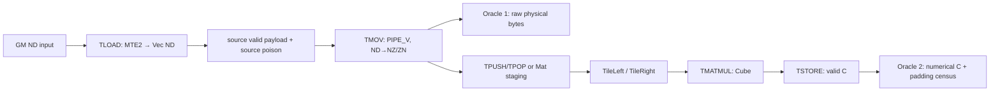
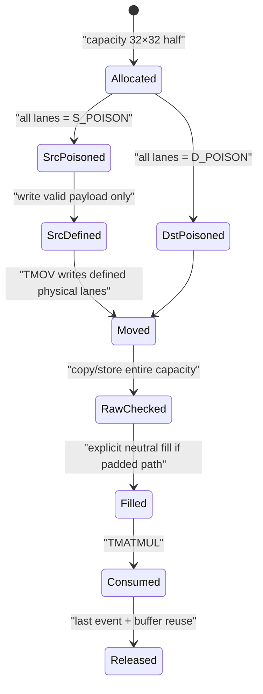

## 本篇在 PTO 课程路线中的位置

课程 31 给出 partial-valid 组合判定式：

```text
mapped consumer read set ⊆ source valid set ∪ specified fill set
```

课程 32 随即发现 A5 的契约断层：ND→NZ 能以 predicate 处理部分 tail，却不承诺自动清零 padding；ND→ZN 只生成完整 `K0×16` fractal，dynamic valid 非整除属于规范域外，当前实现还会向下截断而不是 fail fast。

本篇不再扩大语义面，而是把这些结论变成可执行的验证协议。课程位置是：

```text
producer/consumer 契约断层
→ fail-closed + poison + neutral fill
→ TMATMUL consumer matrix
→ 未来 verifier/lowering contract
```

源码基线为 pto-isa [`37ea0a0a`](https://github.com/hw-native-sys/pto-isa/commit/37ea0a0a3c79f5bcec19d23c6dcf8a7d9346dfdb)。最新提交修改 A2/A3 `TTRANS` 与 CI，没有直接改变本文 A5 `TMOV/TMATMUL` 路径；直接相关实现仍来自 ND→ZN 提交 [`5e98634a`](https://github.com/hw-native-sys/pto-isa/commit/5e98634aadfef35468b9bf8ae96fe8e2d531973c) 与 ND→NZ 循环重写 [`1cac07f6`](https://github.com/hw-native-sys/pto-isa/commit/1cac07f6e5efac7609a2b022b78cc48076411ce3)。

## 前置知识

- B16 的 `K0=32B/2B=16`，ZN 的内层盒子是 `16×16`；B8/B32 的 `K0` 分别为 32/8。
- capacity shape 决定 Tile 资源盒子和静态合法性；`GetValidRow/GetValidCol` 决定本次运行的语义域；修改 valid metadata 不会写任何 byte。
- `TMATMUL(m,k,n)` 消费 Left/Right 的逻辑区域，但不会回头修补 producer 没生成的 ZN fractal。
- padding 只有两种合法来源：consumer 被证明不读，或某个 owner 以指定中性值写过。不能用“通常 allocator 是零”替代契约。

## 今日两个核心问题

1. 怎样把“static capacity 非法”“dynamic valid 非法”“合法变换的物理 bytes 错误”和“consumer 观察了 poison”拆成互不替代的测试？
2. 对 `half A[17,19] × B[19,13]`，最小可证明策略是直接支持 tail，还是先 fail closed，再提供显式 zero-pad 路径？

结论先行：**当前最小充分方案是四层验证，并让 ND→ZN 对非整 fractal dynamic valid fail closed；真正的任意 tail 支持应等到 raw-bit producer test 与 Cube read/mask 证据齐全后再开放。**

## PTO 全栈中的位置



上游输入是 GM 中的 ND payload；A5 `TMOV_TILE_IMPL` 根据 `TileType/BLayout/SLayout` 选择 ND→NZ 或 ND→ZN；下游消费者是 Mat staging、TPipe 或 `TMATMUL`。测试不能只守在最终 C：producer bytes 和 consumer value 是两份独立证据。

## 概念和精确语义

### 四层测试分别证明什么

| 层级 | 输入 | Oracle | 证明 | 不能证明 |
|---|---|---|---|---|
| L0 compile-time | 非法 static capacity/layout/dtype | 编译失败与稳定 diagnostic | type contract 被拒绝 | dynamic valid 行为 |
| L1 runtime negative | capacity 合法、dynamic valid 非整 fractal | `PTO_ASSERT`/launcher 非成功 | 域外输入 fail closed | 合法 producer bytes |
| L2 raw-bit producer | 合法 shape，source/dst 使用不同 poison | 整个 destination physical image | mapping、defined lanes、未定义区边界 | Cube 实际读取集合 |
| L3 consumer E2E | zero-filled rounded envelope → `TMATMUL` | C valid value + C padding census | producer/consumer 可组合 | 单独定位错误在哪层 |

这四层不能互相替代。L3 通过可能只是 destination 预先为零，L2 通过也不代表 Cube 不读 padding，L1 的 assert 更不证明合法输入的 layout 正确。

### 为什么 destination 必须 poison，而不能继续清零

当前 [`tmov_nd2zn/main.cpp`](https://github.com/hw-native-sys/pto-isa/blob/37ea0a0a3c79f5bcec19d23c6dcf8a7d9346dfdb/tests/npu/a5/src/st/testcase/tmov_nd2zn/main.cpp) 在 launch 前执行：

```cpp
aclrtMemset(dstDevice, outputSize, 0, outputSize);
```

对现有 full-fractal case，这不会造成错误，因为所有 bytes 都应被覆盖。但若未来直接加入 `valid=[19,13]` 的 tail case，当前 ND→ZN 会计算：

```text
kFractals = 19 / 16 = 1
nFractals = 13 / 16 = 0
```

循环一次也不执行。若 golden 又把缺失 tail 当零，测试会“全绿”，实际只验证了 `memset`。因此 L2 必须先写非零 destination poison，并按集合比较：defined lanes 必须等于 golden；undefined lanes 只能检查“未被误纳入 valid”，不能偷偷把旧值当语义承诺。

## 真实文件、类型、API 或指令逐段解读

[`TMovNdTo2Zn`](https://github.com/hw-native-sys/pto-isa/blob/37ea0a0a3c79f5bcec19d23c6dcf8a7d9346dfdb/include/pto/npu/a5/TMov.hpp#L630-L680) 对 dtype、static `Rows%K0`、static `Cols%16` 使用 `static_assert`；随后直接把 runtime `validRow/validCol` 交给 `GenerateNd2ZnGather`。这里缺少等价的 dynamic assertion。

[`GenerateNd2ZnGather`](https://github.com/hw-native-sys/pto-isa/blob/37ea0a0a3c79f5bcec19d23c6dcf8a7d9346dfdb/include/pto/npu/a5/TMov.hpp#L560-L630) 以整数除法得到 fractal 数量；每个完整 fractal 用 `vgather2` 完成内部转置，再用 `vsts` 写出 512 B。无 `ceil`、tail predicate 或 neutral fill，所以当前代码事实不是“支持但 padding 未定义”，而是“规范域外、实现静默截断”。

建议的最小 runtime gate 是伪代码：

```cpp
PTO_ASSERT(validRow > 0 && validCol > 0, "ND->ZN valid shape must be non-zero");
PTO_ASSERT(validRow % k0 == 0, "ND->ZN validRow must be divisible by K0");
PTO_ASSERT(validCol % 16 == 0, "ND->ZN validCol must be divisible by 16");
PTO_ASSERT(validRow <= src.GetValidRow() && validCol <= src.GetValidCol(),
           "ND->ZN destination valid region exceeds source-defined region");
```

这是本文建议，不是 `37ea0a0a` 已有代码。diagnostic 应登记到现有 [`debug_zh.md`](https://github.com/hw-native-sys/pto-isa/blob/37ea0a0a3c79f5bcec19d23c6dcf8a7d9346dfdb/docs/coding/debug_zh.md) 的 `PTO_ASSERT/FIX-A05` 体系，而不是依赖一个 target-specific 模糊 crash。

ND→NZ 的 [`TMovToVecNd2Nz`](https://github.com/hw-native-sys/pto-isa/blob/37ea0a0a3c79f5bcec19d23c6dcf8a7d9346dfdb/include/pto/npu/a5/TMov.hpp#L485-L555) 已检查 `srcValidRow>0` 与 `srcValidRow<=dstValidRow`，并以 column predicate 写 tail；但它用 destination `validCol` 决定访问列数，仍欠 source/destination valid-column 对称检查。L1 matrix 必须把 row 与 column 两类越界分开。

## 对象、Tile 与 Buffer 生命周期



建议使用三个互不相同的 raw pattern：valid payload 由坐标编码，例如 `bits=0x0400+r*37+c`；source padding 用 `S_POISON=0x7e01`；destination 初值用 `D_POISON=0x7d01`。这样可以区分“错误读取 source padding”“目标未写”“写到了错误 offset”。做 consumer E2E 时再把 padding poison 设为 half NaN；任何未经 mask/fill 的乘加更容易传播为 NaN，但最终仍应逐元素与 fp32 reference 比较，不能只检查 `isfinite`。

## 端到端指令链

推荐把验证拆成两个真实 kernel，而不是一个巨型 case：

```text
producer kernel:
GM ND → TLOAD(Vec ND) → TMOV(Vec NZ/ZN) → TSTORE/raw alias → full-byte compare

consumer kernel:
GM A/B → TLOAD → explicit zero-fill rounded envelope
→ TMOV/Mat staging → TileLeft/TileRight → TMATMUL
→ TSTORE C valid → torch/numpy golden + C-padding census
```

producer kernel 固定 layout 责任；consumer kernel固定组合正确性。现有 ND→ZN kernel 已让 `ZnTile` 与 `NdTile` 共享 `0x10000` backing，再以 ND view store raw bytes，这是很好的 physical-image test 入口。不要在同一 case 中同时更改 layout、dtype、TPipe 和 matmul，否则失败时无法归因。

## 具体 shape、Tile 和状态演算

取 `half` capacity `32×32`，逻辑矩阵：

```text
A: [M,K] = [17,19]
B: [K,N] = [19,13]
C: [M,N] = [17,13]
Kp=32, Np=16
```

直接 ND→ZN 必须在 L1 被拒绝，因为 `19%16!=0` 且 `13%16!=0`。显式 padded 路径则由调用方拥有 fill：

- A 定义 `17×19=323` 个值，再把每行 `c=19..31` 的 221 个 half 写 `+0`，额外 442 B；
- B 定义 `19×13=247` 个值，在 `32×16` envelope 中补 265 个 half，即 530 B；
- Cube 以 `m=17,k=32,n=16` 运行，乘加从数学需要的 `17×13×19=4199` 增至 `17×16×32=8704`，约 2.07 倍；
- 只把 C 的 `17×13` 作为语义输出，C 其余 capacity 仍由独立 poison census 约束。

这一成本不是“tail 支持必然代价”，而是选择 producer-owned neutral fill 后的明确代价。若未来证明 Cube 对 `m=17,k=19,n=13` 的物理读取被可靠 mask，可减少补零和冗余计算；当前公开材料没有这份 device trace，不能先假设。

### 最小 matrix

对每种 element width，令 `K0=32/sizeof(T)`：

| 类别 | `validK` | `validN` | 预期 |
|---|---:|---:|---|
| aligned | `K0`、`2K0` | 16、32 | L2 raw bytes 完全匹配 |
| K-tail | `K0-1`、`K0+1` | 16 | L1 fail closed |
| N-tail | `K0` | 15、17 | L1 fail closed |
| 双 tail | `K0+3` | 13 | L1 fail closed；padded L3 正确 |

额外加入 `valid=0`、valid 超 capacity、source valid 小于 destination valid，以及 ND→NZ 的 source column 不足。static capacity/layout/dtype 非法则放在 L0 compile-fail suite，不能与 runtime matrix 混写。

## 为什么这样设计及替代方案

**只做最终数值 E2E** 最省代码，却会把 producer、fill、Cube mask 和 store 的错误互相抵消，维护成本最终最高。

**立即实现任意 ND→ZN tail** 可以提升表达力，但需要 `ceil` fractal、边界 gather predicate、目标 neutral fill、更多分支和 B8/B16/B32 parity；没有 raw-byte与 consumer trace 时，扩展合法域缺少证明。

**先 fail closed，再提供显式 padded E2E** 是当前最小方案：代码增量小，非法输入不再静默截断，调用方可以用可见成本换取正确性。它不阻碍未来优化；当 trace 证明 consumer mask 且 microbenchmark 显示 zero-fill/冗余 MMA 已成为瓶颈时，再引入 masked-tail producer。

## 访存、计算、流水、并行和硬件约束

- 每个 ZN fractal 恒为 512 B；L2 应按 raw bytes 比较，不经过 float 转换，避免 NaN canonicalization 与低精度容差吞掉 layout 错误。
- source fill、ND→NZ/ZN 都走 Vector/UB 路径；进入 Mat/Left/Right 与 Cube 前仍需正确 event。poison 只增强 oracle，不提供同步。
- producer-owned fill 会增加 UB 写带宽并可能拉长 Vector→Cube critical path；测试应分别报告 fill bytes、TMOV bytes、MMA ops，不用单个 E2E latency猜瓶颈。
- `aclrtSynchronizeStream` 只证明整条 stream 结束，不能定位哪条依赖缺失。需要保留现有 explicit flag/auto-sync 两种构建，并让同一 poison matrix 跑两遍。
- dynamic assertion 应发生在任何 gather/store 前；若先产生部分写再 assert，negative test 虽失败，buffer 已处于不可复用的半提交状态。

## 测试证据与未覆盖风险

当前 [`tmov_nd2zn`](https://github.com/hw-native-sys/pto-isa/tree/37ea0a0a3c79f5bcec19d23c6dcf8a7d9346dfdb/tests/npu/a5/src/st/testcase/tmov_nd2zn) 覆盖 hifloat8/half/int32 三种 width、`32×32/32×64/64×64/128×128` 共 12 个 full-fractal case；generator 用 `reshape→transpose→flatten` 生成 raw-bit golden，并明确要求整除。它扎实证明 aligned mapping，却完全没有 dynamic tail、negative diagnostic 或 poison destination。

当前 [`tmov_nd2nz`](https://github.com/hw-native-sys/pto-isa/tree/37ea0a0a3c79f5bcec19d23c6dcf8a7d9346dfdb/tests/npu/a5/src/st/testcase/tmov_nd2nz) 只有三个 hifloat8 aligned shape，同样先清零 destination。当前 [`tpushpop_vc`](https://github.com/hw-native-sys/pto-isa/tree/37ea0a0a3c79f5bcec19d23c6dcf8a7d9346dfdb/tests/npu/a5/src/st/testcase/tpushpop_vc) 的真实 consumer chain 使用 `float 128×64×64` 全对齐 case，最终以 `0.001` 容差比矩阵；它证明完整链能跑通，不证明 tail ownership。

尚未覆盖：device assertion 的稳定 exit/diagnostic 语义、B8/B16/B32 dynamic negative parity、destination poison raw image、NaN payload 的 exact-bit 保留、explicit/auto sync parity、C padding overwrite、真实 Cube physical read/mask trace，以及 neutral fill 对 Vector/Cube overlap 的周期影响。

## 与前后章节的连接

前两章把 valid-set 和 A5 producer/consumer 断层讲清；本章给出能证伪结论的四层 protocol。下一章不应继续停留在 ISA 伪代码，而应进入 PTOAS verifier：静态 layout/capacity、dynamic valid guard 和 fill ownership 分别应该在哪个 IR 层表达，怎样避免 EmitC 后才暴露非法组合。

## 本篇结论、知识债、理解检查与下一章

本篇结论：**正确的 tail 测试不是多加几个 shape，而是把 reject、physical mapping、padding ownership 与 consumer observation 分成四个 oracle。当前 A5 ND→ZN 应先对 dynamic 非整 fractal fail closed；显式 zero-pad 是可证明的兼容路径，但其带宽与 2.07 倍示例计算量必须被如实计账。**

知识债：实际补入 runtime `PTO_ASSERT`、compile-fail harness、raw-bit poison golden、padded `TMATMUL` E2E、source/destination valid-column verifier、auto/explicit sync parity、Cube read mask trace 与 fill 性能测量。

三个理解检查问题：

1. 为什么把 destination 初始化为 0，会让一个“什么都没写”的 ND→ZN tail kernel看起来正确？
2. L2 已证明每个 aligned ZN byte 都正确，为什么仍需 L3 `TMATMUL` E2E？
3. 若未来 device trace 证明 Cube 完全 mask `K/N` tail，哪几类 fill 可以删除，哪一层测试仍必须保留？

下一章：**从 ISA 合法域到 PTOAS Verifier——让 layout、dynamic valid guard 与 fill ownership 在 EmitC 前闭合。**

## 课程账本增量

- 章节：33
- 基线：pto-isa `37ea0a0a3c79f5bcec19d23c6dcf8a7d9346dfdb`
- 新覆盖：A5 `TMovNdTo2Zn/GenerateNd2ZnGather/TMovToVecNd2Nz/TMOV_TILE_IMPL`，ND→ZN/ND→NZ host、kernel 与 golden，`debug_zh.md` assertion taxonomy
- 新不变量：reject、physical mapping、padding ownership 与 consumer observation 必须分层取证；destination zero-init 不能充当 tail oracle；dynamic gate 必须先于任何部分写
- 建议的最小实现：ND→ZN runtime fail-closed + poison raw-byte test + explicit padded `TMATMUL` E2E
- 下一章：PTOAS 在 EmitC 前表达 layout、dynamic valid guard 与 fill ownership
