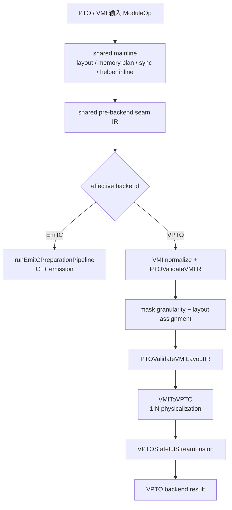
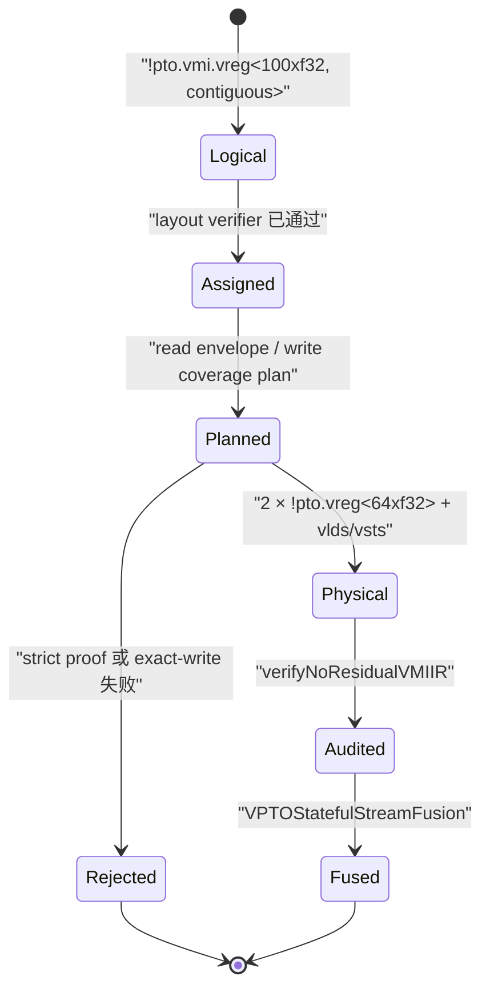

## 本篇在 PTO 课程路线中的位置

课程 31–33 一直在追问同一个问题：partial-valid Tile 经过 layout 变换后，padding 何时会被下游观察？我们最终把 ISA 侧验证拆成 static reject、dynamic fail-closed、raw-bit poison 与 consumer E2E 四层。

今天向上进入 PTOAS，但只研究一条边界清晰的主线：**VMI logical memory access 如何物理化为 VPTO load/store，以及 compiler 在哪里允许扩大读集合、又在哪里拒绝扩大写集合。**课程位置是：

```text
A5 fractal-tail producer/consumer contract
→ VMI semantic footprint 与 VPTO physical footprint
→ load-safety / exact-store legality
→ shared pre-backend verifier debt
```

源码基线为 PTOAS [`566d6af8`](https://github.com/hw-native-sys/PTOAS/commit/566d6af8c017e7f44402fb2c4e8d204d8f195b9a)，默认分支为 `master`。最新提交改动的是 shared-producer rematerialization 计划，不直接改变本文访存路径；直接相关合入提交是 [`2e8fe288`](https://github.com/hw-native-sys/PTOAS/commit/2e8fe28801f3fb4929a8390d3db9ecb001232d54)，它为 `vmi-to-vpto` 引入 `load-safety=policy|warn|error`。

## 前置知识

- VMI 的 `!pto.vmi.vreg<NxT, layout>` 表达逻辑 lane、dtype 与 layout；VPTO 需要把它物理化成一个或多个 target register value。
- logical valid/active lane 是语义集合；physical chunk 是指令真正读写的粒度。两者可能不同。
- padding 被 load 触碰、padding 被后续计算观察、padding 被写成 neutral value，是三个不同事件。
- UB-backed 只说明 address space；裸 `!pto.ptr<T, ub>` 本身没有静态 allocation extent。

## 今日两个紧密关联的核心问题

1. 当逻辑值只需要 100 个 `f32` lane，而 VPTO 物理载体必须读两个 64-lane chunk 时，额外 28 lane 的读取由谁证明安全？
2. 为什么同样的 physical-footprint 扩大，load 可以由策略放行，store 却必须在 lowering 前拒绝？

## PTO 全栈中的位置

上游是已经形成 VMI op/type、完成 layout assignment 的 MLIR；下游是 VPTO physical registers 与 `vlds/vsts` 等指令，再进入 stateful stream fusion 和设备产物。当前真实 pipeline 不是“一套 verifier 同时守住 VPTO 与 EmitC”，而是先走 shared mainline，再在 VPTO backend 内单独运行 VMI semantic pipeline：



[`ptoas_pipeline.cpp`](https://github.com/hw-native-sys/PTOAS/blob/566d6af8c017e7f44402fb2c4e8d204d8f195b9a/tools/ptoas/ptoas_pipeline.cpp) 的 `appendVMISemanticPipeline` 依次加入 `PTOValidateVMIIR`、layout passes、`PTOValidateVMILayoutIR`、`VMIToVPTO` 和 `VPTOStatefulStreamFusion`。官方 [`vmi-implementation-manual.md`](https://github.com/hw-native-sys/PTOAS/blob/566d6af8c017e7f44402fb2c4e8d204d8f195b9a/docs/designs/vmi-implementation-manual.md) 明确写明：这段 pipeline 只用于 VPTO，EmitC 不运行它。

因此，“在 EmitC 前闭合”目前是我们要提出的跨 backend 设计要求，不是已有代码事实。

## 概念和精确语义

设一次访问的逻辑地址集合为 `S`，选中物理指令后的真实访问集合为 `P`。

对 load，允许出现：

```text
P_load = S_load ∪ E
```

其中 `E` 是额外读取的 padding/对齐区。语义正确至少要求 `E` 不进入 logical result；内存安全的严格条件则是：

```text
candidate physical read envelope ⊆ proven readable envelope
```

当前 `load-safety=error` 执行这个严格模型。`warn` 和默认 `policy` 在证明失败时仍允许生成 full-chunk read，只改变 diagnostic 强度。设计文档甚至明确记录：越过 UB 末端可能 trap/hang，默认 policy 接受这一风险。这是**编译策略**，不是硬件安全证明。

对 store，副作用不可在事后“忽略”。正确 lowering 必须同时满足：

```text
P_write 不包含任何 semantic inactive byte
且每个 semantic active byte 恰好被写一次
```

可简写为 `P_write = S_write`。aligned `vsts + mask` 能表达任意 lane 集；unaligned store 只能写低位连续 prefix，因此只能覆盖 Dense/Prefix。若 VMI mask 是任意 Predicate，就不存在精确指令形式，必须拒绝。

最后要强调：`E` 能被读取不代表 `E` 已被定义。若后续 layout conversion 或 `TMATMUL` 把它映射进 consumer read set，仍须由 producer/fill owner 写入规定的 neutral value。`load-safety` 不能偿还课程 33 的 fill ownership 知识债。

把接口契约摊平后，合法性不是一个布尔开关，而是四层判定：

| 层次 | 前置条件 | 成功后的后置条件 | 典型非法组合 |
| --- | --- | --- | --- |
| VMI semantic | source/destination address space、shape、dtype 与 op 定义相容 | logical lane 与 mask 含义稳定 | 非 UB load、value/mask lane 或 dtype 不一致 |
| layout-assigned VMI | 每个 VMI data/mask 都有可支持 layout | logical lane 可映射到确定 part/chunk/lane | layout 缺失、producer/consumer layout 不可物化 |
| memory plan | alignment、coverage、read envelope/write footprint 可判定 | 已选 candidate 不改变逻辑访问集合 | strict load 无 readable proof；store 无 exact coverage |
| physical VPTO | 1:N types 与所有 users 同步转换 | 无残余 VMI op/type，可交给 VPTO fusion | 只转 producer、`unpack`/function ABI 仍含 VMI |

其中 dynamic valid 只会缩小本次语义集合，不会自动扩大 allocation，也不会改变 physical register width。若 `valid=37` 而 carrier 仍是 64 lanes，compiler 仍需分别回答：额外 27 lane 的地址可不可读、值有没有定义、后续会不会观察。把三问压成一句“tail supported”正是 silent corruption 的来源。

## 真实文件、类型、API 与指令逐段解读

### 1. 两个 verifier 管什么

[`PTOValidateVMIIR.cpp`](https://github.com/hw-native-sys/PTOAS/blob/566d6af8c017e7f44402fb2c4e8d204d8f195b9a/lib/PTO/Transforms/PTOValidateVMIIR.cpp) 中：

- `PTOValidateVMIIRPass` 调用 `validateVMIProducerBoundaryIR`，检查 producer-boundary semantic IR；
- `PTOValidateVMILayoutIRPass` 调用 `validateVMILayoutAssignedIR`，确保 layout assignment 后的 IR 满足阶段不变量。

它们位于 layout assignment 前后，却不是本文全部物理访存证明。是否能用目标指令精确实现，还要等 `VMIToVPTO` 的 preflight 与 pattern plan。

### 2. load plan 的输入输出

[`VMIToVPTOMemoryInternals.cpp`](https://github.com/hw-native-sys/PTOAS/blob/566d6af8c017e7f44402fb2c4e8d204d8f195b9a/lib/PTO/Transforms/VMIToVPTO/VMIToVPTOMemoryInternals.cpp) 的核心接口是：

```cpp
FailureOr<int64_t> verifyFullOrSafeReadVRegChunks(
    Operation *op, VMIVRegType type, Value source, Value offset,
    PatternRewriter &rewriter, VMILoadSafetyPolicy loadSafety);
```

输入不是 runtime tensor，而是 MLIR op/type/SSA value：`type` 给出 shape、dtype、layout，`source/offset` 给出 UB address provenance。输出是每个 physical part 的 lane 数；失败则 pattern 不发射。

函数先调用 `checkFullDataPhysicalChunks`。该函数在 [`VMIToVPTOConversionInternals.cpp`](https://github.com/hw-native-sys/PTOAS/blob/566d6af8c017e7f44402fb2c4e8d204d8f195b9a/lib/PTO/Transforms/VMIToVPTO/VMIToVPTOConversionInternals.cpp) 中要求 layout 已分配，并逐 part/chunk/lane 调用 `isPaddingLane`。没有 padding且地址 32 B 对齐时直接通过；否则选择：

- aligned：`computeSafeFullReadProof(source type, constant offset, result type)`；
- unaligned：`computeSafeStatefulReadProof(source, offset, result type)`。

证明成功后继续；失败后交给 `applyLoadSafetyPolicy`：`error` 返回 failure，`warn` 发 warning 后返回 physical lane 数，`policy` 发 remark 后返回 physical lane 数。

[`OneToNVMILoadOpPattern`](https://github.com/hw-native-sys/PTOAS/blob/566d6af8c017e7f44402fb2c4e8d204d8f195b9a/lib/PTO/Transforms/VMIToVPTO/VMIToVPTOPatternInternals1.cpp) 消费该结果，建立 `LoadPhysicalPlan`，再按 part 发射 `VldsOp`。这是一条 `1 logical value → N physical values` 的类型与 op 同步转换。

### 3. store plan 为什么更严格

[`OneToNVMIStoreOpPattern`](https://github.com/hw-native-sys/PTOAS/blob/566d6af8c017e7f44402fb2c4e8d204d8f195b9a/lib/PTO/Transforms/VMIToVPTO/VMIToVPTOPatternInternals2.cpp) 的 `StorePhysicalPlan` 保存 `lanesPerPart`、`fullPhysicalChunks` 与 footprint 是否不宽于 contiguous form。aligned contiguous path 对 full chunk 建 all-true mask；tail chunk 则由 `getContiguousActiveDataLanes` 生成 prefix mask，再发射 `VstsOp`。

任意 predicate 的 unaligned masked store 在 conversion preflight 就被拒绝。[`VMIToVPTOPatternInternals8.cpp`](https://github.com/hw-native-sys/PTOAS/blob/566d6af8c017e7f44402fb2c4e8d204d8f195b9a/lib/PTO/Transforms/VMIToVPTO/VMIToVPTOPatternInternals8.cpp) 的诊断说明：它需要 per-lane write predicate，而 exact unaligned form 只能写 contiguous low-bit prefix。

### 4. Pass 后置条件

[`VMIToVPTOPatternInternals9.cpp`](https://github.com/hw-native-sys/PTOAS/blob/566d6af8c017e7f44402fb2c4e8d204d8f195b9a/lib/PTO/Transforms/VMIToVPTO/VMIToVPTOPatternInternals9.cpp) 的 `runOnOperation` 顺序是：验证输入 IR → preflight supported ops → 解析 policy → 运行 partial 1:N conversion → `verifyNoResidualVMIIR`。

后置条件不是“尽量转一些”，而是 Module 中不能残留任何 VMI op/type。失败时 pass 终止，不能把半物理化 IR 交给下游。编译过程没有运行时并发或设备 tensor ownership；对象所有权属于 `ModuleOp` 和 `PatternRewriter`，旧 op 在 replacement 成功后失效。

这一放置顺序也解释了 verifier 为什么不能简单前移或后移。太早时 layout、part 数、alignment candidate 尚未确定，无法计算 physical envelope；太晚到 VPTO emission 之后，logical mask/valid provenance 已被拆成多个物理值，诊断只能说某条 `vlds/vsts` 不合法，却很难指出原始 VMI op 的哪一项契约失败。当前做法把 semantic/layout stage invariant 放在前面，把 target instruction representability 放在 `VMIToVPTO` preflight，方向是合理的；缺口在于这套后半段只覆盖 VPTO。

## 对象与中间状态生命周期



以 load 为例，VMI value 最初由 `pto.vmi.vload` 创建，layout pass补全 representation；type converter 把它映射成有序 physical value list；各 consumer 的 operand 也同步变成同一 list。原 VMI op 与测试中的 `pto.vmi.unpack` 必须被 replacement/折叠消除。若 load pattern 因严格证明失败而没有生成，`unpack` 会成为 materialization bridge，最终被 residual audit 捕获，而不是悄悄流入 VPTO。

## 端到端调用链或生成链

一条真实生成链是：

```text
compilePTOASModule
→ runMainLoweringPipeline
→ finishVPTOMainPipeline / runVPTOBackendPipeline
→ appendVMISemanticPipeline
→ PTOValidateVMIIR
→ VMILayoutAssignment
→ PTOValidateVMILayoutIR
→ VMIToVPTOPass::runOnOperation
→ verifySupportedVMIToVPTOOps
→ OneToNVMILoadOpPattern::buildPhysicalPlan
→ verifyFullOrSafeReadVRegChunks
→ applyLoadSafetyPolicy
→ VldsOp × N
→ verifyNoResidualVMIIR
→ VPTOStatefulStreamFusion
```

store 与它共享前半段，在 `OneToNVMIStoreOpPattern` 分叉；unaligned arbitrary-predicate case 会在 `verifySupportedVMIToVPTOOps` 阶段终止。

## 具体 shape、dtype、location 与状态演算

直接相关 lit 用例是：

```text
source   : !pto.ptr<f32, ub>
offset   : -1 element
logical  : !pto.vmi.vreg<100xf32, contiguous>
physical : 2 × !pto.vreg<64xf32>
```

逻辑 payload：

```text
100 × 4 B = 400 B
```

physical carrier：

```text
2 × 64 × 4 B = 512 B
padding = 28 lanes = 112 B
```

相对 `%src`，两块 full-chunk read 的总 candidate envelope 是 128 个元素，从 offset `-1` 起，即：

```text
element interval [-1, 127)
byte interval    [-4, 508)
```

裸 `!pto.ptr` 没有静态长度，compiler 不能证明这一 envelope 可读：

| 模式 | 结果 | 证据强度 |
| --- | --- | --- |
| `error` | pattern failure，最终 residual VMI diagnostic | 只有证明成功才生成 |
| `warn` | 生成两块 physical read，同时 warning | 明知未证明仍放行 |
| `policy` | 生成两块 physical read，同时 remark | 默认接受环境风险 |

为了看清“padding 存在”与“读取不安全”并非同义，可以构造一个静态正例。设 source 为 `memref<160xf32, vec>`，offset 为常量 32，结果仍是 `vreg<100xf32>`：

```text
semantic interval = [32, 132)  → 100 elements
physical interval = [32, 160)  → 128 elements
readable interval = [0, 160)
```

这里仍然多读 28 lane，但 `physical ⊆ readable`，所以 strict proof 可以成功。逻辑 result 只定义前 100 lane；末尾 28 lane 即使地址安全也不能被 consumer 当成数据。若 source 只有 `memref<150xf32>`，semantic 区间仍合法，physical 区间却超过末端 10 个元素：这正是 strict 模式必须拒绝、而 policy 模式选择承担风险的边界。这个正反例是根据当前 `computeSafeFullReadProof` 的 envelope 算法推导，不是新增的设备测试事实。

再看 store。假设 `mask={0,2,63}`，destination 是 dynamic offset，无法证明 32 B 对齐。若使用 unaligned prefix store：

```text
prefix length = 64  → 错写 lanes 1,3..62
prefix length = 3   → 漏写 lane 63，且错写 lane 1
```

不存在一个 prefix 能等于 `{0,2,63}`，所以不能靠“多写再忽略”修复。当前 preflight 正确地 fail closed。

反过来，若 destination 可证明 32 B 对齐，`vsts` 的 per-lane mask 可以精确表达 `{0,2,63}`；若 mask 是 `{0,1,2}`，即使地址不对齐，prefix store 也有机会用 byte count 精确裁剪。由此可见，合法性键至少是：

```text
(direction, dtype, layout, alignment, coverage kind, physical footprint)
```

只按 op 名或 logical shape 选择指令会丢失决定安全性的关键维度。

## 为什么这样设计及替代方案

当前默认 policy 的现实动机来自 `si16→ui8` dynamic-offset 分块：逻辑 64 lane 被物理化为 128-lane carrier，offset 虽可证明 32 B 对齐，但 source 是裸 UB pointer，strict proof 永远拿不到静态 extent。拒绝会留下 `pto.vmi.unpack` 并使整个 conversion 失败。相关提交记录，放行后恢复 `vlds → vcvt{part=EVEN} → vsts{PK_B16}`，全活跃 `expand_load` 也从 `vgather2_bc + vsel` 简化为单条 `vlds`。

替代设计有三种：

1. **全局 strict error。**正确性边界最强，但 dynamic raw pointer 大量误拒，lowering coverage 与维护成本差。
2. **exact fallback。**用 naturally aligned 小块、gather/scalar 序列只读语义集合；安全，但增加指令、寄存器、调度与实现矩阵，可能破坏流水。
3. **显式 guard/fill contract。**allocation owner 为 UB 尾部保留 guard bytes，并在 consumer 可能观察 padding 时填 neutral value；load 可稳定 full-chunk，代价是容量、初始化带宽及跨层 ABI。

我的判断是第三种最适合长期闭合，但必须把 `readable guard` 与 `defined fill` 分成两个属性：前者只保证不 fault，后者才允许 consumer 读出确定值。默认 `policy` 在没有这两个 owner 证据时继续编译，适合 bring-up，不应被上层当成端到端 correctness certificate。

## 访存、计算、流水、并行和硬件约束

- full-chunk load 减少 fallback 指令和显式 lane materialization，通常更利于连续 vector pipeline；这是从当前 IR 序列作出的性能推断，不是设备 benchmark。
- 100-lane 例子为得到 400 B 逻辑数据读取 512 B，物理读放大为 `1.28×`。若 source 靠近 UB 边界，112 B extra footprint 还可能跨出 allocation。
- exact masked store 保住相邻 buffer、复用 slot 和其他线程可见状态。一次 silent over-write 可能破坏 PlanMemory 已证明不重叠的对象，后续 barrier 也无法修复。
- `vlds/vsts` 是当前 VPTO IR 事实；其最终映射到哪条具体 A5 load/store engine、如何与其他 pipe overlap，本文没有 device trace，属于待验证硬件映射。
- compiler pass 在单个 Module 上运行，不处理 runtime race；但它生成的 physical memory footprint 会成为设备并发与 alias correctness 的前置条件。

## 测试证据与未覆盖风险

[`vmi_to_vpto_load_safe_tail_memref_negative_offset.pto`](https://github.com/hw-native-sys/PTOAS/blob/566d6af8c017e7f44402fb2c4e8d204d8f195b9a/test/lit/vmi_new/vmi_to_vpto_load_safe_tail_memref_negative_offset.pto) 用同一 IR 验证四件事：`error` 失败；`warn` 成功且出现 warning；默认成功且出现 remark；非法 option `foo` 直接失败。它固定的是**编译器 policy 分流不变量**，没有在 NPU 上执行负 offset load。

[`vmi_to_vpto_memory_alignment_safety_invalid.pto`](https://github.com/hw-native-sys/PTOAS/blob/566d6af8c017e7f44402fb2c4e8d204d8f195b9a/test/lit/vmi_new/vmi_to_vpto_memory_alignment_safety_invalid.pto) 在 strict 模式放入两种 unaligned load 和两种 unaligned masked store，断言前者留下两条 residual VMI error，后者得到两条“requires proven store alignment”精确诊断。它验证读写失败类别没有混淆。

直接相关提交报告 `test/lit/vmi_new + test/lit/vpto` 为 `1127/1127` 通过；这是该提交的测试记录，不是本文在真实 A5 设备上的复测。

仍未覆盖：

- 默认 policy 的 out-of-envelope load 是否在真实设备 trap/hang，以及 failure diagnostic；
- allocator guard bytes、readable envelope 与 policy option 的跨层绑定；
- extra lanes 是否被后续 conversion 错误观察的 poison E2E；
- EmitC backend 对同一 logical footprint 的 parity；
- exact fallback 与 full-chunk policy 的 bandwidth、cycle、register pressure 对比；
- dynamic range proof：`offset∈[lo,hi]` 时自动推出 readable envelope。

### 事实、设计文本与本文推断的边界

- **代码事实：**默认 option 是 `policy`；proof 失败会 remark 后放行；unaligned arbitrary-predicate store 被拒绝；VMI semantic pipeline 不运行于 EmitC。
- **测试事实：**lit 只校验 compiler exit code、diagnostic 与 residual 数量；相关提交记录了 1127 项 lit 通过。它们没有证明真实设备访问安全或性能收益。
- **设计文档事实：**当前 policy 明确接受 UB 尾部越界可能造成的 trap/hang；strict envelope 模型对应 `load-safety=error`。
- **本文推断：**full-chunk path通常比 exact fallback 更利于流水，需设备 benchmark 才能量化；shared `MemoryAccessPlan` 是建议的跨 backend 收敛点，当前主干没有该统一对象。

这一区分很重要：compiler “成功生成代码”只说明选项允许该 candidate，不等于 runtime “成功执行”，更不等于数值 consumer “没有观察未定义 padding”。三层成功应分别报告，不能让一个绿色 lit 替代后两层证据。

## 与前后章节的连接

本篇修正了一个容易犯的推理跳跃：课程 33 的 “fill ownership” 不能直接下沉成 `load-safety`。正确分层是：

```text
address readable proof
≠ padding value defined proof
≠ consumer does not observe padding proof
```

当前 VPTO path 已实现第一项的三档 policy，并对 store 保持 exact footprint；后两项仍需 layout/valid-set analysis 和 consumer E2E。更重要的是，VMIToVPTO 不运行于 EmitC，因此 backend-independent 的 dynamic valid、guard 与 fill owner 契约若要全栈成立，应在 shared seam 前形成统一 IR contract；VPTO/EmitC 各自只验证目标指令能否精确实现它。

## 本篇结论、知识债、理解检查与下一章

### 结论

1. `VMIToVPTO` 不是机械改名，而是 logical VMI value 到 physical VPTO value list 的 1:N 物理化；layout、alignment、coverage 和 footprint 共同决定合法性。
2. load 的 extra read 可在 policy 下放行，但这只改变 compiler acceptance，不证明 memory safe，更不产生 neutral fill。
3. store 的 extra write 会改变可观察状态；aligned arbitrary mask、unaligned Dense/Prefix 与 unaligned Predicate 必须分流，最后一种当前必须拒绝。
4. `verifyNoResidualVMIIR` 给出 pass 的全有或全无后置条件；它防止半转换 IR 流入下游。
5. VMI semantic pipeline 是 VPTO-only。跨 backend 的 valid/guard/fill ownership 需要 shared pre-backend contract，不能假定 EmitC 自动继承。

### 新知识债

- 为 `!pto.ptr` 增加可传播的 allocation extent/guard provenance，支持 dynamic offset range proof；
- 区分 `readable_guard_bytes` 与 `defined_fill`，明确各自 owner 和失效点；
- 在 shared seam 前建立 backend-independent `MemoryAccessPlan` 或 verifier，并给 EmitC/VPTO 做 parity lit；
- 增加 policy→真实 A5 fault、padding poison→consumer、exact fallback→性能的三类 E2E；
- 验证 VMI layout conversion 是否在所有路径都保证 extra physical lane 不进入 semantic result。

### 三个理解检查问题

1. `load-safety=policy` 成功生成 `vlds` 后，为什么仍不能断言这次 load 在真实设备必定成功？
2. 为什么 unaligned prefix store 能实现 `{0,1,2}`，却不能实现 `{0,2,63}`？
3. 如果 allocator 已保证尾部 128 B 可读，但没有初始化，哪些证明已经成立，哪些仍未成立？

### 下一章

**Shared seam 的 MemoryAccessPlan——把 `semantic footprint / physical envelope / readable guard / defined fill` 变成 VPTO 与 EmitC 共用的 IR contract，并审计现有 `PTOAddressAnalysis` 能提供哪些事实。**

## 课程账本增量

- 日期：2026-09-13
- 课程：34
- 主仓库：PTOAS `566d6af8`
- 核心链：`VMI vload/vstore → layout assignment → safety/coverage plan → 1:N VPTO values → vlds/vsts → residual audit`
- 新不变量：load over-read acceptance、memory readability、padding definedness 是三份证明；store physical write set 必须与 semantic active set精确一致；VPTO-only legalizer 不能替代 shared backend contract。
- 测试事实：tri-mode load policy 与非法 option lit；strict alignment negative matrix；相关提交记录 1127/1127 lit 通过。
- 新风险：默认 policy 可能接受真实越过 UB allocation 的 read；EmitC parity 与 allocation/fill owner 均未闭合。
- 下一章：Shared seam `MemoryAccessPlan` 与 `PTOAddressAnalysis`。
