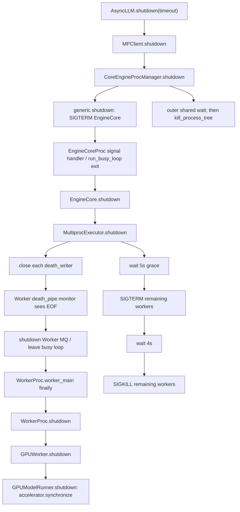

> 源码基线：[`vllm-project/vllm@e52be1a6`](https://github.com/vllm-project/vllm/commit/e52be1a62d3879b1202f4f355d3c3472b560c6f2)，即默认分支截至 2026-09-13 的最新提交。该提交迁移 DSv4 TileLang kernel，与 shutdown 无直接修改；本文以已合入代码为事实基线。代码中仍没有 `ShutdownProgress`/`ShutdownReport` 类型，文中的 progress frame 和测试 oracle 均明确标为建议设计。

## 本篇在课程路线中的位置

第 29 章已经证明：Executor 只有冻结 expected rank set，并收到每个 rank 的 device-completion final，才能宣称聚合成功。本章只推进一步：**TP=2 时若 rank 1 永久卡在 native cleanup，当前 Multiproc 路径在什么时刻发 TERM、何时发 KILL，父进程最终究竟知道什么？**

```text
rank-scoped shutdown ack
→ 单 rank native hang 故障注入
→ deadline / TERM / KILL 可观测顺序
→ 下一章统一 Core 与 Worker 的剩余预算
```

## 前置知识回顾

证据强度不能混用：Host 容器清空是 `metadata_cleared`；device fence 正常返回才是 `completed_observed`；进程被杀只证明 fault containment。`started` 能定位阻塞点，却不能冒充 `failed` 或 `completed`。另外，最终聚合必须量化 `expected={0,1,...}`，不能让一个成功 rank 遮蔽缺席者。

## 本篇要回答的核心问题

1. 从 `AsyncLLM.shutdown()` 到 Worker 的 `torch.accelerator.synchronize()`，完整控制链如何前进？
2. 当前两层 timeout 为什么可能互相截断，而不是组成一条总 deadline？
3. 怎样构造不依赖真实坏 GPU、但能验证 `grace→TERM→KILL` 顺序和 partial evidence 的测试？

## 组件在全局架构中的位置



同一关闭动作实际有两个 supervisor：EngineCore 外层的 process manager 管 EngineCore child，EngineCore 内层的 `MultiprocExecutor` 管 Worker children。外层使用 `time.monotonic()` 和一个共享截止时刻；内层 grace loop 使用 `time.time()`，随后固定再等 4 秒。它们没有共享同一个 remaining budget。

## 完整调用链

公开入口 [`AsyncLLM.shutdown`](https://github.com/vllm-project/vllm/blob/e52be1a62d3879b1202f4f355d3c3472b560c6f2/vllm/v1/engine/async_llm.py) 先关闭 metrics/renderer，再把 `timeout` 交给 `engine_core.shutdown()`。[`MPClient.shutdown`](https://github.com/vllm-project/vllm/blob/e52be1a62d3879b1202f4f355d3c3472b560c6f2/vllm/v1/engine/core_client.py) 令 `CoreEngineProcManager` 停止 EngineCore。

[`vllm.v1.utils.shutdown`](https://github.com/vllm-project/vllm/blob/e52be1a62d3879b1202f4f355d3c3472b560c6f2/vllm/v1/utils.py) 对所有 EngineCore 先并行 `terminate()`，再以 `deadline=time.monotonic()+timeout` 共享等待；仍存活者交给 `kill_process_tree()`。EngineCore 的 signal handler 只把 `shutdown_state` 改为 `REQUESTED` 并唤醒 busy loop；[`run_engine_core`](https://github.com/vllm-project/vllm/blob/e52be1a62d3879b1202f4f355d3c3472b560c6f2/vllm/v1/engine/core.py) 的 `finally` 才调用 `EngineCore.shutdown()`。

[`EngineCore.shutdown`](https://github.com/vllm-project/vllm/blob/e52be1a62d3879b1202f4f355d3c3472b560c6f2/vllm/v1/engine/core.py) 调 `model_executor.shutdown()`。[`MultiprocExecutor.shutdown`](https://github.com/vllm-project/vllm/blob/e52be1a62d3879b1202f4f355d3c3472b560c6f2/vllm/v1/executor/multiproc_executor.py) 关闭每个 `death_writer`；child monitor 收到 EOF，设置 `shutdown_requested` 并关闭 MQ，使 busy loop退出。`worker_main.finally` 进入 `WorkerProc.shutdown()`：它先关闭 RPC/response MQ，之后才调用真实 `Worker.shutdown()`。

GPU 路径由 [`GPUWorker.shutdown`](https://github.com/vllm-project/vllm/blob/e52be1a62d3879b1202f4f355d3c3472b560c6f2/vllm/v1/worker/gpu_worker.py) 依次处理 connector、profiler、weight transfer、elastic EP、model runner 和 CuMem pool。[`GPUModelRunner.shutdown`](https://github.com/vllm-project/vllm/blob/e52be1a62d3879b1202f4f355d3c3472b560c6f2/vllm/v1/worker/gpu/model_runner.py) 的第一条危险操作是 `torch.accelerator.synchronize()`；若它永久不返回，后面的 KV cache、model、graph 引用与 allocator cleanup 都不会执行。

## 关键类型、字段和状态生命周期

### death-pipe 的生命周期

`make_worker_process()` 为每个 rank 创建 `death_reader/death_writer`。child 持有 reader，Executor parent 持有 writer。正常关闭时 parent 关闭 writer；reader 看到 EOF，只负责请求 busy loop 停止。它既不携带 rank cleanup 结果，也没有 acknowledgement。随后 child 在 `finally` 关闭 reader，执行 cleanup，最终由进程退出结束生命周期。若 KILL 先到，Python `finally` 不再是可依赖的后置条件。

### 两个关键接口

| 接口 | 输入/输出 | 所有权与并发 | 前/后置条件 | 失败方式 |
|---|---|---|---|---|
| `_ensure_worker_termination(worker_procs)` | `list[BaseProcess] → None`；无 tensor、shape、dtype/device | EngineCore 内 Executor 持有 child handle；对剩余 rank 批量发信号 | 调用前已通过 death pipe 请求退出；返回只保证函数完成，不保证所有 child 已 reap | wall-clock 回拨可延长 grace；`kill()` 后不再 join；无 per-rank result |
| `GPUModelRunner.shutdown()` | 无参数、返回 `None`；操作当前 accelerator，无显式 shape/dtype | 每个 Worker 独占本 rank model/KV/graph 引用 | `synchronize()` 返回后才可安全断开相关引用 | native call 抛错则后续清理被跳过；永久挂起只能由进程边界打断 |

`VLLM_WORKER_SHUTDOWN_TIMEOUT_SECONDS` 默认是 5 秒。内层算法是：最多等 5 秒自然退出，仍活着则全部 TERM，再等固定 4 秒，最后对余者 KILL。注意它没有在 KILL 后 `join()`，因此“函数返回”和“OS 已完成 reap”也不是同一事实。

## 逐函数源码解读

`MultiprocExecutor.collective_rpc()` 已经展示了正确的预算形态：只创建一次 monotonic deadline，每读取一个 rank 的 MQ 都计算 `deadline-now`。但 `_ensure_worker_termination()` 重新从 `time.time()` 开始计时；TERM 后又获得新的 4 秒。当前代码因此存在三个不同概念：RPC deadline、Worker 5+4 秒升级窗口、EngineCore 外层 process deadline。

`WorkerProc.signal_handler()` 收到 TERM 后设置 event 并抛 `SystemExit`。若 Python 主线程能重新获得解释器控制，`finally` 仍会再次进入 `worker.shutdown()`；若主线程卡在不返回的 native call，Python handler 未必有机会执行。最终 KILL 不可捕获，也不会执行 finally。

一个容易误读的注释写着 “SystemExit is raised on SIGTERM or SIGKILL”；按 POSIX 语义，代码只为 SIGTERM/SIGINT 注册 handler，SIGKILL 无法捕获。本文以可执行语义而非注释推断终态。

## 具体例子与状态演算

设 TP=2，`expected={rank0,rank1}`，默认内层 grace=5 秒；为了看清内层状态，先假设外层给足 12 秒预算。两个 Worker 都在 `t=0` 收到 death-pipe EOF：

```mermaid
sequenceDiagram
    participant E as MultiprocExecutor
    participant R0 as Worker rank 0
    participant R1 as Worker rank 1
    participant S as Parent progress sink
    E->>R0: close death_writer
    E->>R1: close death_writer
    R0->>S: model_runner_sync started
    R1->>S: model_runner_sync started
    R0->>S: model_runner_sync completed; final
    Note over R1: synchronize() 永久挂起
    Note over E: t≈5s grace expires
    E->>R1: SIGTERM
    Note over R1: native call 未返回，progress 不前进
    Note over E: t≈9s TERM wait expires
    E-xR1: SIGKILL
    E->>S: synthesize missing final
```

建议的 parent snapshot 在 KILL 前为：

```text
expected  = {0, 1}
final     = {0}
started   = {(1, model_runner_sync)}
completed = {(0, model_runner_sync)}
missing   = {1}
```

rank 0 可记 `COMPLETED`。rank 1 的设备完成事实不可知，应为 `abandoned_by_deadline + completion_unknown`；`exitcode=-SIGKILL` 只是额外的 isolation evidence。全局 aggregate 必须失败或降级，不能因 `alive_count==0` 变成 success。

若调用者不传 timeout，外层 generic process manager 默认只等 5 秒。它可能在内层刚准备 TERM Worker 时便直接 `kill_process_tree(EngineCore pid)`，连内层固定 4 秒窗口都走不完。这正是“各层都有 timeout”不等于“端到端有 deadline”。

## 为什么这样设计及替代方案

当前 death pipe + process escalation 的优点是简单：正常路径给 cleanup 机会，异常路径保证服务最终退出；它也不要求业务 MQ 在 teardown 期间仍健康。但替代设计的取舍如下：

- **同进程 thread timeout**：看似能快速返回，却留下仍在访问 CUDA context 的线程；释放显存或复用设备会破坏正确性。
- **只 TERM、不 KILL**：保留 Python finally 的可能性，却无法对 native hang 给出时间上界。
- **立即 KILL**：尾延迟最短，但丢失 connector flush、device fence、diagnostic snapshot 和 allocator cleanup。
- **cooperative cancel + process deadline**：响应式 owner 可优雅退出，native hang 仍由外层 kill；维护成本较高，但能同时保留 liveness 与 partial evidence。

最小改进不是增加另一个 timeout，而是让外层创建唯一 monotonic deadline，逐层只传 `remaining_budget`；progress 使用独立、有界、parent-owned sideband。每个危险 owner 在调用前写 `started`，返回后写 `completed`，parent 在任何 KILL 之前先 checkpoint latest snapshot。

## 性能、并发、正确性与边界条件

关闭不是 hot path，因此每个 rank 多写少量固定大小 progress frame 的吞吐代价可忽略；更重要的是状态必须有界为 `O(rank × owner)`，不能把日志流当协议。所有活跃 rank 应并行进入 grace、并行 TERM/KILL，不能逐 rank 各消耗 5+4 秒。

`time.time()` 会受系统时钟调整影响，存活性计时应使用 monotonic clock。多进程只能传剩余预算或 duration，不能跨主机比较裸 monotonic timestamp。KILL 后还需 join/reap 并记录 exitcode，否则可能留下短暂 zombie 或把“信号已发送”误报为“进程已消失”。CUDA Graph、NCCL、KV transfer 或异步 DMA 的 metadata 即使随进程消失，其设备完成状态仍可能未知。

## 测试证据与未覆盖风险

当前直接测试 [`test_multiproc_executor_worker_termination_timeout`](https://github.com/vllm-project/vllm/blob/e52be1a62d3879b1202f4f355d3c3472b560c6f2/tests/v1/executor/test_executor.py) 使用 `_FakeClock` 和 `_FakeProcess`：`timeout=6, exits_at=5` 断言不 TERM；`timeout=6, exits_at=7` 断言会 TERM。它验证了 grace 边界，却没有 `kill()`、join、两个 rank、真实 child、progress snapshot 或 native hang。

可执行的下一层测试应放在独立子进程中，而不是用测试线程伪装可取消性：rank 0 正常结束；rank 1 在注入点写出 `model_runner_sync.started` 后永久阻塞，并可选择忽略 TERM。parent 断言事件偏序，而非脆弱的精确毫秒值：

```text
rank1.started < grace_expired < term_sent
term_sent < kill_sent < reaped
checkpoint(latest rank1.started) < kill_sent
final={0}, missing={1}
```

还应覆盖：TERM 后能退出、TERM 后仍挂起走 KILL、sideband 满/断开、parent checkpoint 失败、KILL 前 engine 被外层抢先终止。真正 CUDA/NCCL hang 仍需硬件隔离测试；纯 CPU subprocess 只能证明控制协议，不能证明 driver/device 最终状态。

## 与前后章节的连接

本章把第 29 章的抽象 expected-set 落到一个可复现时间线，并发现预算断层：Worker 层理论上需 9 秒，默认 EngineCore 外层却可能只给 5 秒。下一章应把 `AsyncLLM/MPClient → EngineCore manager → MultiprocExecutor` 改写为一条 remaining-budget contract，再对 graceful、TERM、KILL 三条路径做 golden timeline。

## 本篇结论、知识债、三个理解检查问题和下一章

结论只有三条：death-pipe EOF 是退出请求，不是 cleanup ack；TERM/KILL 是时间上界和隔离证据，不是 device completion；当前外层 monotonic 5 秒与内层 wall-clock 5+4 秒不能合成为可靠的端到端承诺。

知识债：实际 `ShutdownProgress` schema、独立 sideband、KILL 前 parent checkpoint、KILL 后 join/reap、内外层唯一 deadline、Python/Rust golden，以及真实 CUDA/NCCL native hang 测试。

理解检查：

1. rank 1 被 SIGKILL 后 `is_alive()==False`，为什么 aggregate 仍不能标记 `COMPLETED`？
2. 为什么用线程包住 `torch.accelerator.synchronize()` 再超时返回，会制造比等待更危险的资源复用？
3. 外层只剩 2 秒预算时，内层为什么不能重新获得完整的 5 秒 grace 和 4 秒 TERM window？

下一章：**一条 deadline 穿过三层——`AsyncLLM/MPClient → EngineCore → MultiprocExecutor` 的 remaining-budget contract 与 golden timeline。**

## 课程账本增量

- 第 30 章锁定 MP 单 rank native hang；新增覆盖 `_ensure_worker_termination` 的 wall-clock grace、固定 TERM window、KILL 后未 join，以及外层 monotonic deadline 的预算冲突。
- 新确认：默认内层最长约 9 秒，默认外层可能 5 秒即 kill EngineCore tree；progress 必须在 parent KILL 前持久化。
- 测试缺口从“没有 per-rank final”收窄为可执行矩阵：正常退出、TERM 退出、忽略 TERM 后 KILL、sideband/checkpoint failure 与外层 deadline 抢先。
