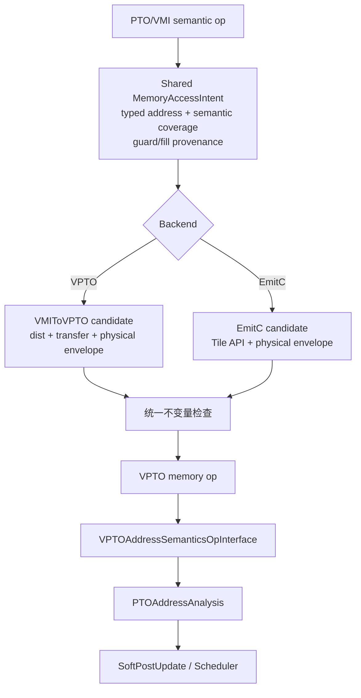
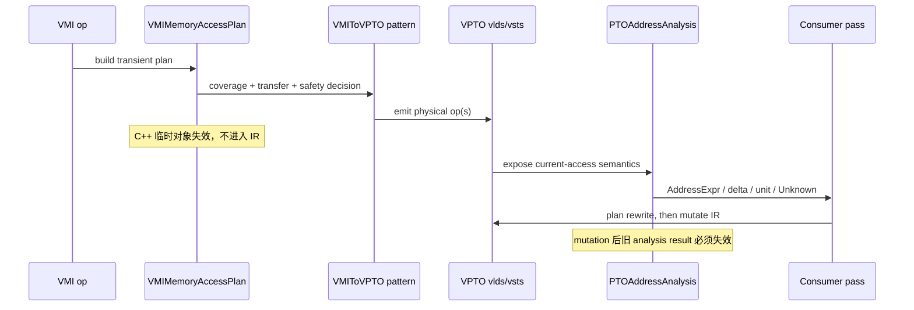

## 本篇在 PTO 课程路线中的位置

课程 31–33 从 ISA 侧建立了 partial-valid、physical padding 与 consumer read-set；课程 34 向上追到 `VMIToVPTO`，确认 load 可以按 policy 扩大读集合，而 store 必须精确覆盖语义写集合。

今天只回答一条紧接着的问题：**shared seam 若要让 VPTO 与 EmitC 遵守同一份访存契约，现有 `PTOAddressAnalysis` 能提供什么，不能提供什么？**课程位置是：

```text
VMI→VPTO 的 backend-local access plan
→ typed address facts 的能力边界
→ shared intent + backend candidate 两阶段 MemoryAccessPlan
→ VPTO / EmitC parity verifier
```

源码基线为 PTOAS [`566d6af8`](https://github.com/hw-native-sys/PTOAS/commit/566d6af8c017e7f44402fb2c4e8d204d8f195b9a)，默认分支 `master`。最新提交修改 VPTO rematerialization，不直接改变本文路径。地址分析的直接实现提交是 [`e033698c`](https://github.com/hw-native-sys/PTOAS/commit/e033698cb83ddf97f51bba41465548f8d5435d1b)，配套设计提交为 [`0796c496`](https://github.com/hw-native-sys/PTOAS/commit/0796c4962db90a710c5296387d4bcd3513d57269)；上一章的 load policy 来自 [`2e8fe288`](https://github.com/hw-native-sys/PTOAS/commit/2e8fe28801f3fb4929a8390d3db9ecb001232d54)。

## 前置知识

- `semantic footprint` 是程序要求读取或写入的逻辑元素集合。
- `physical envelope` 是某个具体 target 指令真正触碰的字节区间。
- `readable guard` 证明物理读不会越过仍然存活的 allocation；它不说明读出的 padding 有定义。
- `defined fill` 说明哪些非语义 lane 已由谁写成何值，以及该证据何时失效。
- `Unknown` 是合法的分析结果，不应被翻译为“安全”。

## 今日两个紧密关联的核心问题

1. `PTOAddressAnalysis` 能否独立证明一次 load/store 安全？
2. 既然仓库已有 `VMIMemoryAccessPlan`，shared seam 还缺的究竟是什么？

先给结论：前者不能；后者不是再创建一份平行 plan，而是把现有 backend-local plan **演进为两阶段合同**——shared 阶段保存语义意图与 provenance，backend 阶段再填具体候选的 physical envelope，并统一验证。

## PTO 全栈中的位置



当前代码只完整拥有图中右侧 VPTO 链。[`ptoas_pipeline.cpp`](https://github.com/hw-native-sys/PTOAS/blob/566d6af8c017e7f44402fb2c4e8d204d8f195b9a/tools/ptoas/ptoas_pipeline.cpp) 在 shared mainline 后才进入 `appendVMISemanticPipeline`，其中 `VMIToVPTO → VPTOStatefulStreamFusion` 仅由 VPTO backend 执行。`PTOAddressAnalysis` 消费的又是已经物理化的 VPTO op interface，所以它不能自动成为 EmitC 之前的共同 verifier。

## 概念和精确语义

### 1. 地址表达式只回答“在哪里”

[`PTOAddressAnalysis.h`](https://github.com/hw-native-sys/PTOAS/blob/566d6af8c017e7f44402fb2c4e8d204d8f195b9a/include/PTO/Analysis/PTOAddressAnalysis.h) 中的 `PTOAddressExpr` 只有五类事实：

```text
currentBase
rootOrBase
elementOffset
optional typed op offset + unit
elementBytes
```

它可以回答：

- 当前地址沿 `pto.addptr` 可归一到哪个 root；
- pointer offset 与 op offset 在循环中每次变化多少 byte；
- byte delta 能否精确换算成 element/block/alignment unit；
- 两个同 root、同 element type 的地址差是否可证明；
- block argument 的 ABI alignment 加上 offset remainder 后，地址是否满足指定对齐。

它不回答：访问是 read 还是 write、覆盖多少 lane、allocation 有多大、两 root 是否 no-alias、padding 是否初始化、consumer 会不会观察 extra lane。配套设计文档 [`vpto-address-analysis-design-zh.md`](https://github.com/hw-native-sys/PTOAS/blob/566d6af8c017e7f44402fb2c4e8d204d8f195b9a/docs/designs/vpto-address-analysis-design-zh.md) 也明确把 alias、disjointness、memory dependence 排除在职责之外。

因此：

```text
address delta known
≠ candidate envelope in bounds
≠ padding value defined
≠ access conflict free
```

### 2. 完整计划必须把四份证据分开

对每个 backend candidate，最小不变量是：

```text
Read safety:      Pread ⊆ ReadableGuard
Definedness:      ConsumerRead ⊆ SemanticRead ∪ DefinedFill
Write precision:  Pwrite = SemanticWrite
Lifetime:         guard/fill owner 活到 candidate 完成
```

其中 `Pread/Pwrite` 只有 target 指令选定后才确定。若在 shared seam 过早固定一条物理指令，会把 target layout、dist 与 alignment 偏好泄漏到上层；若等到 backend 内部才首次构造语义 coverage，EmitC 与 VPTO 又可能各自漂移。

更稳妥的模型是一个对象的两阶段状态：

```text
MemoryAccessPlan
  intent:    typed address + Dense/Prefix/Predicate + logical count
             allocation/guard provenance + optional defined fill
  candidate: target + register transfer + physical envelope + alignment
  proof:     proven / rejected / unknown(reason)
```

shared seam 只冻结 `intent`；VPTO 或 EmitC 填充 `candidate` 后，统一检查上述不变量。它不是第二套地址求解器：root、typed offset、range/no-wrap、difference 与 alignment 仍复用 `PTOAddressAnalysis/PTOValueEvolutionAnalysis`。

把现有查询逐项摊开，更容易看出证明边界：

| 查询 | 输入 | 可产生的事实 | 不能顺带推出 |
| --- | --- | --- | --- |
| `getAddresses(op)` | 实现 address-semantics interface 的 VPTO op | root、addptr 累积 offset、op offset/unit、element bytes | 读写方向、访问长度、allocation size |
| `getDeltaBytes(address, loop)` | AddressExpr 与结构化 `scf.for` | 每次迭代的数学 byte step，或 `Unknown(reason)` | 全循环所有访问均在界内 |
| `getDeltaInUnit(...)` | byte delta 与目标 unit bytes | 可精确表示的指令 advance | 向下取整后的“近似合法” advance |
| `getDifferenceBytes(a,b)` | 两个当前地址表达式 | 同 root 下的 point-value byte difference | 不同 root no-alias、两个访问区间不重叠 |
| `isKnownAddressAligned` | pointer、element offset、dtype、边界 | 有限递归内可证明的 remainder=0 | pointer 指向的对象足够大、仍存活 |

这里的前置条件也不能省略。`getAddresses` 遇到不实现 interface 的 op 会返回 `UnsupportedOperation`；element width 未知会返回 `UnknownElementSize`；单位换算不能整除时必须是 `InexactUnitConversion`。调用者只能在结果为 `Known` 时选择依赖该事实的优化，不能把“查不到”降级成零 offset、默认 32 B 对齐或同 root。

### 3. Plan 不是一个 `safe` 布尔值

一个布尔量无法表达四种常见状态：地址计算已知但 allocation 未知、allocation 可读但 padding 未定义、padding 已定义但 candidate 会越界写、所有证明齐全但 owner 在执行前失效。建议 plan 至少经历：

```text
IntentOnly
→ CandidateSelected(target, physical envelope)
→ Proven | Rejected | Unknown(reason)
→ Materialized
```

`Materialized` 的前置条件必须是所需证明全部为 `Proven`，或调用者显式选择像 `load-safety=policy` 这样的风险策略。生成 op 后再改变 layout、address、allocation placement 或 fill owner，旧 certificate 立即失效，必须重新选择 candidate；不能只更新一半字段。store 则没有 policy 放宽：无法证明 `Pwrite = SemanticWrite` 就不得进入 `Materialized`。

## 真实文件、类型、API 或指令逐段解读

### `VPTOAddressSemanticsOpInterface`：事实入口

[`PTOAddressAnalysis.cpp`](https://github.com/hw-native-sys/PTOAS/blob/566d6af8c017e7f44402fb2c4e8d204d8f195b9a/lib/PTO/Analysis/PTOAddressAnalysis.cpp) 的 `getAddresses` 先要求 op 实现 `VPTOAddressSemanticsOpInterface`。接口给出 current access 的 base、可选 offset、offset unit 与 element-width 来源。analysis 沿 `AddPtrOp` 累积 element offset；遇到 element width 改变或无法继续解释的 pointer，就保守停止并把当前 SSA value 当新 root。

`getKnownAddressRemainderBytes` 把 base remainder 与 `offset × elementBytes` 合成。实现最多递归追八层 cast/addptr；pointer block argument 被假定满足 address-space ABI alignment。这个假定可证明对齐 remainder，却仍不能推出 allocation extent。

`getDeltaBytes/getDeltaInUnit` 借助 `PTOValueEvolutionAnalysis` 处理 IV、loop-carried recurrence、cast、range 与 no-wrap。非仿射、可能回绕、不同 root 或不能整除目标 unit 时返回带原因的 `Unknown`。

### 当前 `VMIMemoryAccessPlan`：已有，但位置与证据仍窄

[`VMIToVPTOConversionInternals.cpp`](https://github.com/hw-native-sys/PTOAS/blob/566d6af8c017e7f44402fb2c4e8d204d8f195b9a/lib/PTO/Transforms/VMIToVPTO/VMIToVPTOConversionInternals.cpp) 已定义：

```text
VMIMemoryAccessPlan
  direction
  segments[address, coverage, transfer, readSafety]
  valueType
  paddingValue
  layoutSupport
```

这比名字暗示的更重要：`Dense/Prefix/Predicate` 与 `Identity/LaneExpand/Compact/Interleave/...` 已被拆开，说明仓库正在从“按 op 名选指令”转向“按访问语义选 candidate”。但它仍是 converter 内部 C++ 临时对象，不会作为 IR contract 穿过 shared seam。

[`VMIToVPTOMemoryInternals.cpp`](https://github.com/hw-native-sys/PTOAS/blob/566d6af8c017e7f44402fb2c4e8d204d8f195b9a/lib/PTO/Transforms/VMIToVPTO/VMIToVPTOMemoryInternals.cpp) 的 `buildReadAccessPlan/buildWriteAccessPlan` 当前主要支持 identity memref layout。`computeSafeFullReadProof` 能对 static memref、constant offset 和 contiguous physical footprint 建 readable/candidate interval；stateful path还能组合 offset range与 32 B remainder。`paddingValue` 字段虽存在，[`vmi-implementation-manual.md`](https://github.com/hw-native-sys/PTOAS/blob/566d6af8c017e7f44402fb2c4e8d204d8f195b9a/docs/designs/vmi-implementation-manual.md) 明确标为尚未 materialize；subview/affine lane map、true masked non-faulting load、scratch/guarded fallback 也未实现。

## 对象与中间状态生命周期



这条生命周期揭示了缺口：语义 plan 在物理 op 生成时已经消失，地址 analysis 随后又从物理 op 重建另一份地址事实。两者没有共同携带 allocation owner、guard 或 fill provenance，EmitC 更不会经历这条链。

从所有权看，至少有四个不同 owner：allocation planner 拥有 backing extent 与复用时刻；producer/fill op 拥有 padding 的定义状态；VMI op 拥有 semantic coverage；backend legalizer 拥有具体指令的 physical envelope。任何一层提前销毁自己的证据，后层都只能得到 `Unknown`。例如 PlanMemory 把同一 UB 地址复用给新对象后，旧 guard certificate 即使数值区间不变也已失效；它绑定的是 allocation generation，不只是 `base=0x400` 这样的数值地址。

因此可复用的 contract 应携带 `root identity + generation/lifetime region`，而非只携带 begin/end。view 可以继承 root、缩小可见范围；phi 需要保留可能 root 集合；loop-carried pointer 还要证明每次 advance 不越过 owner 的范围。任一分支无法确定 owner 时，应合成为 `Unknown(provenance)`，不能选取“看起来最大的” extent。

## 端到端调用链或指令链

```text
compilePTOASModule
→ shared mainline / seam IR
→ runVPTOBackendPipeline
→ appendVMISemanticPipeline
→ VMIToVPTOPass
→ buildReadAccessPlan / verifyFullOrSafeReadVRegChunks
→ vlds / vldus / vsts / vstus
→ VPTOStatefulStreamFusion
→ prepareVPTOForEmission
→ VPTOSoftPostUpdate（可选）
→ PTOAddressAnalysis::getAddresses/getDeltaInUnit
→ VPTO Scheduler
→ VPTO emission
```

EmitC 从 shared mainline 转入自己的 preparation 与 emission，不运行 `VMIToVPTO`，也不消费这个内部 plan。这就是 parity 不能靠“两个 backend 最终都能编译”来证明的原因。

## 具体 shape、dtype、location 与状态演算

直接相关的 [`address_analysis.pto`](https://github.com/hw-native-sys/PTOAS/blob/566d6af8c017e7f44402fb2c4e8d204d8f195b9a/test/lit/vpto/address_analysis.pto) 有一个极小例子：

```text
root:    %src : !pto.ptr<f32, ub>
loop:    iv = 0, 1
ptr:     iter_arg，每轮 addptr +1 element
offset:  2 × iv elements
load:    pto.vlds → !pto.vreg<64xf32>
```

`f32` 每元素 4 B。第 `i` 轮有效地址为：

```text
A(i) = root + (i + 2i) × 4 B = root + 12i B
```

所以 analysis 给出 `delta-bytes=12`，能精确换算为 `unit4=3`，但换成 32 B unit 时返回 `unknown(inexact-unit-conversion)`。这足以阻止需要整数个 32 B advance 的错误 post-update candidate。

现在加入 analysis 看不到的 allocation：一条 `vreg<64xf32>` physical read 是 `64×4=256 B`。

| root allocation | 第 0 轮 envelope | 第 1 轮 envelope | 结论 |
| --- | --- | --- | --- |
| 268 B | `[0,256)` | `[12,268)` | 两轮可读 |
| 256 B | `[0,256)` | `[12,268)` | 第 1 轮越界 12 B |

两种情况下 `PTOAddressAnalysis` 都正确报告 12 B delta，因为输入是裸 UB pointer，差别只存在于 allocation provenance。若把这项信息误塞进地址 delta analysis，就会混淆“数学地址”和“对象生命周期”；正确做法是由 `MemoryAccessPlan.intent` 携带 guard owner，再让 candidate envelope 做包含检查。

这个例子还能说明并行与流水上的区别。两次 load 的起点仅相差 12 B，它们的 256 B envelope 大量重叠；地址 delta 已知不表示 scheduler 可以把它们当成独立事务，也不表示第二次能复用第一次的结果。若 op 的 memory effects 表明只读，同址重叠通常不产生写冲突，但仍可能争用同一 load pipe 和 UB bank；若其中一次变为 store，则必须由独立 dependence/alias 分析判断 RAW/WAR/WAW。`PTOAddressAnalysis` 提供的是构造这些判断所需的坐标，不是判断本身。

再接回课程 34 的 `vreg<100xf32>`：semantic payload 是 400 B，两个 64-lane carrier 的 physical envelope 是 512 B。当前 plan 能记录 128-lane footprint，却没有兑现 `paddingValue`。因此 allocation 有 512 B 只证明可读；若 consumer 会观察末尾 112 B，还必须另有 `defined fill`。这正是四份证据不能合并成一个 `safe=true` 的原因。

## 为什么这样设计及替代方案

### 方案 A：每个 backend 各自重算

实现局部、改动小，但 VPTO 的 `Dense/Prefix/Predicate`、read policy 与 EmitC Tile API 容易漂移；同一上层程序可能一个 backend 接受、另一个静默扩大 footprint。

### 方案 B：shared seam 直接固定物理指令

最容易审计，却过早绑定 A5 dist、register width 与 alignment，阻碍 A2/A3、未来 target 或 exact fallback；也会让 target-specific 性能选择污染语义 IR。

### 方案 C：两阶段 plan

shared `intent` 固定“必须做什么”，backend `candidate` 固定“准备怎样做”，最后组合证明。这保留 target 选择空间，又让两 backend 共用 coverage、guard/fill provenance 和失败原因。维护成本是要定义 plan 的失效规则、serialization/IR representation 与 parity golden；但它是最小能闭合四份证据的方案。

## 访存、计算、流水、并行和硬件约束

- 地址分析本身只增加编译时间，不产生设备访存；它允许 SoftPostUpdate 把重复地址算术收敛为递增状态，收益需由实际 emitted sequence 与 cycle test确认。
- 12 B delta 不能编码成 32 B unit时放弃 post-update，会保留更多 address arithmetic，但优先保证地址精确。
- full-chunk tail 可减少 point/gather/fallback 指令，却会放大带宽：100×f32 的例子是 400 B→512 B，即 `1.28×`。
- readable guard 占用 UB 容量，defined fill 还增加初始化带宽；二者必须分别计入 PlanMemory 峰值与流水依赖。
- 当前公开代码能确认 `vlds/vldus/vsts/vstus` 的 VPTO 序列；具体 A5 load/store engine、stall 与重叠周期仍缺 device trace，本文不作微架构断言。

候选选择还会改变 graphability。若同一 semantic intent 因运行时 offset remainder 在 aligned `vlds` 与 stateful `vldus` 之间切换，指令拓扑、临时 alignment state 和同步边都可能变化；图捕获不能只以 logical shape 建 key。更稳妥的做法是把 candidate kind 纳入 specialization key，或在图外完成 guard 后进入固定 candidate。这个结论是基于 IR 拓扑的工程推断，尚无 ACL Graph 回放测试。

从成本看，shared plan 不应强迫所有路径使用最严格 fallback。它应允许 backend 枚举多个等价 candidate：direct dist、stateful full-vector、自然对齐 point sequence、scratch fill/copy/load。筛选顺序先保证 correctness，再比较指令数、物理字节、临时寄存器、barrier 和可捕获性。若 cost model 失败，仍应选择已证明安全的保守 candidate；不能用性能未知作为放宽 footprint 的理由。

## 测试证据与未覆盖风险

[`address_analysis.pto`](https://github.com/hw-native-sys/PTOAS/blob/566d6af8c017e7f44402fb2c4e8d204d8f195b9a/test/lit/vpto/address_analysis.pto) 覆盖 `index/i8/i16/i32` recurrence、signed/unsigned cast、base+offset 双变化、Element/Block/Byte/Alignment unit、opaque leaf、possible-wrap 与 zero-delta。它验证的是 expression、delta、unit 与 `Unknown(reason)`，不验证 allocation bounds。

[`address_semantics_contract.pto`](https://github.com/hw-native-sys/PTOAS/blob/566d6af8c017e7f44402fb2c4e8d204d8f195b9a/test/lit/vpto/address_semantics_contract.pto) 验证 `vlds/vldsx2/vldus/vsts/vstus/plds/...` 的 current access 与 post-update advance 没有混淆，尤其 stateful op 的 current offset 为 none。它不验证 access byte count或 read/write effect。

[`vmi_to_vpto_masked_load_safe_tail_memref.pto`](https://github.com/hw-native-sys/PTOAS/blob/566d6af8c017e7f44402fb2c4e8d204d8f195b9a/test/lit/vmi_new/vmi_to_vpto_masked_load_safe_tail_memref.pto) 用 `memref<128xf32>` 的 100-lane value 验证两次 `vlds`，并用 `memref<136xf32>`、offset 4 验证 stateful `vldus` 路径；两者都检查 VMI 无残留。它证明当前 converter 对已支持 static envelope 的代码形状，不证明 extra lane 有 neutral fill。

[`vmi_to_vpto_memref_layout_invalid.pto`](https://github.com/hw-native-sys/PTOAS/blob/566d6af8c017e7f44402fb2c4e8d204d8f195b9a/test/lit/vmi_new/vmi_to_vpto_memref_layout_invalid.pto) 则让 stride=2 和 `memref.subview` fail closed，说明当前 plan 没有伪装成已支持 affine lane map。

仍未覆盖：shared intent 的 IR 形式、EmitC/VPTO 同输入 parity、guard provenance 穿过 view/phi/loop 的生命周期、`paddingValue` materialization、dynamic offset range与 candidate envelope 联合证明、plan mutation/invalidation、真实 A5 fault/poison 与 exact fallback 性能。

最小新增测试不应只比较最终 op 名。第一组用同一 semantic intent 分别生成 VPTO 与 EmitC，逐项比较 semantic coverage、拒绝原因和声明的 physical envelope；第二组把 allocation 精确放在 candidate 末端、少一个 byte 和多一个 guard block 三个边界，验证 strict 模式的包含关系；第三组在 tail 写入非零 poison，分别让 consumer 忽略和观察 extra lane，证明 readability 与 definedness 不会互相冒充；第四组让 view 经过 `scf.if` phi 与 loop-carried `addptr`，在 owner 相同、owner 不同、可能回绕三种情况下检查 `Known/Unknown`。这些是本文推导出的验证协议，当前仓库尚无对应完整矩阵。

还要防止测试自身制造假证据：destination 预先清零会掩盖 fill 未发生；过大的 memref 会让所有 over-read 都偶然安全；只检查编译成功会漏掉两个 backend footprint 不同；只检查数值输出又可能因为 consumer 恰好没有读取 padding 而通过。oracle 必须同时观察 diagnostic、计划字段、physical bytes 与 consumer 结果。

### 事实、设计与本文推断

- **代码事实：**已有 backend-local `VMIMemoryAccessPlan`；`PTOAddressAnalysis` 接受 VPTO op interface；`paddingValue` 未被使用；EmitC 不运行 VMI pipeline。
- **测试事实：**现有 lit 验证 address delta/unit/Unknown、op address semantics、部分 static/stateful safe-read 与 unsupported memref layout。
- **设计文档事实：**物理访存 legalization 计划要求继续复用 typed address language，并演进现有 plan，不长期保留平行结构。
- **本文建议：**把同一 plan 拆成 shared intent 与 backend candidate 两阶段，是基于上述边界推导的最小收敛方案，当前主干尚未实现。

## 与前后章节的连接

课程 34 证明“load policy 放行”不等于“内存安全”。本章进一步定位了缺证据的原因：地址 analysis 负责数学位置，内部 access plan 负责局部 candidate，却没有一份跨 backend、跨生命周期的 owner contract。

下一章应沿 plan 的第一项 provenance 继续：从 `memref/subview/addptr/phi` 追踪 allocation root、extent、guard 与失效点，再判断 dynamic range proof 能否让 strict load 从 `Unknown` 变成 `Proven`。

## 第五次七章知识图谱回顾（课程 29–35）

```text
29 target-conditioned TMOV layout
→ 30 view / transpose / physical move 三分
→ 31 partial-valid consumer read-set
→ 32 A5 fractal producer-consumer 断层
→ 33 reject / poison / fill / E2E 四层验证
→ 34 VMI logical→physical load/store policy
→ 35 typed address facts→shared ownership contract
```

七章把问题从“哪个指令能搬”推进到“谁证明多读的地址可用、值有定义、写集合精确”。当前 ISA 的 layout/tail 语义已能向 compiler contract 反向提出可执行要求；下一阶段应补 provenance 与跨 backend verifier，而不是继续堆叠 op-name 特判。

## 本篇结论、知识债、理解检查与下一章

### 结论

1. `PTOAddressAnalysis` 精确回答 root、typed offset、byte/unit delta、部分 difference/alignment；它不是 allocation、alias 或 padding analysis。
2. 当前 `VMIMemoryAccessPlan` 已包含 coverage、transfer 与 read safety，但只在 `VMIToVPTO` 内瞬时存在，不能自动约束 EmitC。
3. shared contract 应演进同一 plan：先冻结 semantic intent 与 owner provenance，再由 backend 填 physical candidate，最后组合验证 read、definedness、write 与 lifetime。
4. `Pread⊆guard` 与 `consumerRead⊆semantic∪fill` 是两条不同不变量；guard 可读不能替代 padding 已定义。
5. analysis 在 rewrite 后会失效；plan 必须在 mutation 前完成合法性与候选选择，不能复用旧地址事实。

### 新知识债

- 定义 shared intent 的稳定 IR/interface，以及 VPTO/EmitC candidate adapter；
- 为 allocation extent、guard bytes、fill owner 与 lifetime 建 provenance；
- 让 dynamic offset range、view/phi/loop root closure 与 physical envelope 联合求证；
- materialize `paddingValue` 并增加 raw-bit poison→consumer E2E；
- 建立两 backend 的 accept/reject、diagnostic 与 footprint golden；
- 用 A5 trace 比较 full-chunk、stateful 与 exact fallback 的带宽、周期和寄存器压力。

### 三个理解检查问题

1. 已知循环地址每轮增加 12 B，为什么仍不能判断第二轮 256 B load 安全？
2. `PTOAddressAnalysis` 返回同 root 和精确 byte difference 后，为什么仍不能直接推出两次访问 no-alias？
3. allocator 保证 112 B tail 可读但未初始化时，四条不变量中哪些已成立、哪些仍未成立？

### 下一章

**Allocation provenance 穿过 view/phi/loop——`memref/subview/addptr` 的 root、extent、guard owner 与 dynamic range proof 何时失效。**

## 课程账本增量

- 日期：2026-09-14
- 课程：35
- 主仓库：PTOAS `566d6af8`
- 核心链：`VMI access intent → backend-local VMIMemoryAccessPlan → VPTO op → AddressSemantics → PTOAddressAnalysis → optimization/scheduling consumer`。
- 新不变量：地址数学、allocation guard、physical envelope、defined fill 和 alias 是独立事实；shared plan 应采用 intent/candidate 两阶段，而不是复制第二套地址求解器。
- 测试事实：address analysis 覆盖 typed recurrence/delta/unit/Unknown；address-semantics 覆盖 current/advance 边界；VMI lit覆盖 static/stateful tail与 unsupported memref layout。
- 新风险：plan 不进入 shared IR、`paddingValue` 未兑现、EmitC parity 与 owner lifetime 未闭合。
- 下一章：allocation provenance、view/phi/loop closure 与 dynamic range proof。
