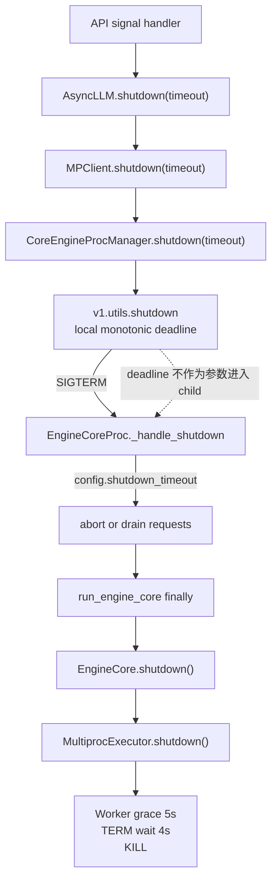
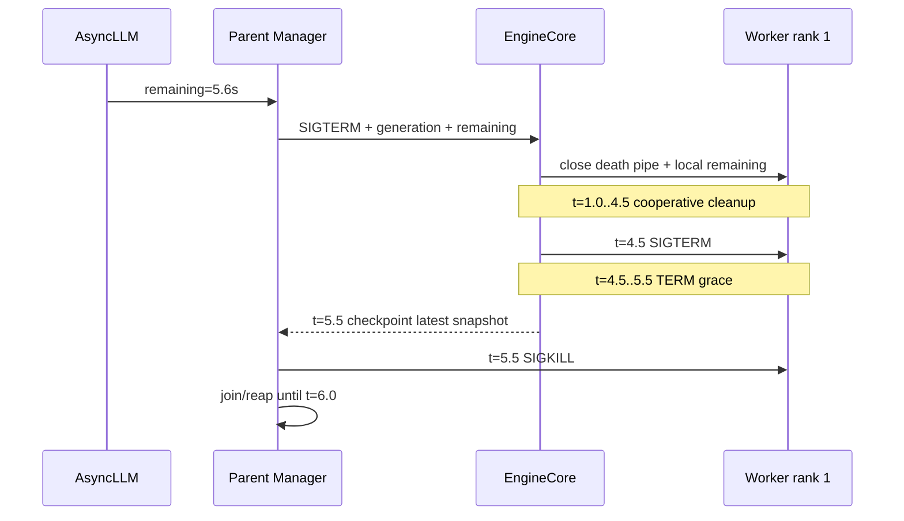

---
layout: post
title: "vLLM 源码课程 31：一个 Timeout 不等于一条 Deadline——跨三层的剩余预算契约"
description: "沿 AsyncLLM/MPClient→EngineCore→MultiprocExecutor 追踪 shutdown_timeout 的真实生命周期，区分请求 drain、进程 grace 与 Worker escalation，并推导单一 remaining-budget contract 和 golden timeline。"
date: 2026-09-14 09:00:00 +0800
category: "vLLM · 源码精讲"
series: "vLLM 源码课程"
tags: [vLLM, Shutdown, Deadline, Timeout, Multiprocessing, Fault Injection, Correctness]
reading_time: 28
mermaid: true
---

> 源码基线：[`vllm-project/vllm@9f03b510`](https://github.com/vllm-project/vllm/commit/9f03b510c33575fe40c320b2d266a289e8a4b83a)，即默认分支截至 2026-09-14 的最新提交。该提交修复 DSv4 kernel bug，与 shutdown 无直接关系；从第 30 章基线 `e52be1a6` 到本提交，本文核对的实现和测试文件 blob 均未变化。本文中的 `ShutdownBudget`、phase reserve 与 golden test 是建议设计，不是当前已合入 API。

## 本篇在课程路线中的位置

上一章已经把 TP=2、单 rank 卡死时的 `grace → SIGTERM → SIGKILL` 展开成真实时间线。本章只回答一个更窄、却决定所有故障证据是否可信的问题：

> 调用者给出的一个 `timeout`，是否真的成为穿过 API、Core 和 Worker 的同一条 deadline？

路线位置是：

```text
单 rank native hang
→ timeout 生命周期与时钟域
→ remaining-budget contract
→ 下一章用 golden timeline 验证跨层 partial order
```

## 前置知识回顾

进程退出只证明隔离，不证明 device cleanup 完成；KILL 前最后一帧若是 `model_runner_sync.started`，终态仍是 `completion_unknown`。因此 deadline 的职责不是“把未知变成成功”，而是保证系统在有限时间内停止等待，并在升级信号前保存尽可能强的 partial evidence。

还要先区分三个量：

- **request drain budget**：允许已接收请求继续执行多久；
- **process grace budget**：SIGTERM 后允许进程自行退出多久；
- **kill/reap reserve**：强杀、确认消失和回收进程表项所需的尾部预算。

三者可以共享同一总预算，但不能被同一个无类型的数字混为一谈。

## 本篇要回答的核心问题

1. `shutdown_timeout` 从公开入口到 Worker 实际如何传递、复制或丢失？
2. 当前哪些地方已有 shared deadline，哪些地方只是重新启动局部 timer？
3. 如何定义一个既跨进程、又不错误比较不同 monotonic clock 的最小契约？

## 组件在全局架构中的位置

当前 MP serving 路径如下。红线不是新调用，而是预算传播在进程边界处中止的位置。



一个值得肯定的局部先例在多 API server 启动器：[`serve.py`](https://github.com/vllm-project/vllm/blob/9f03b510c33575fe40c320b2d266a289e8a4b83a/vllm/entrypoints/cli/serve.py) 先计算 `shutdown_by = time.monotonic() + timeout`，关闭 API servers 后，再把 `max(shutdown_by-now, 0)` 交给 local engine manager 和 coordinator。这已经实现了**同一进程内多个 manager 的预算守恒**；缺口在 child 内部 owner。

## 完整调用链

公开服务入口在 [`launcher.py`](https://github.com/vllm-project/vllm/blob/9f03b510c33575fe40c320b2d266a289e8a4b83a/vllm/entrypoints/launchers/launcher.py)：收到 SIGTERM 后，读取 `engine_client.vllm_config.shutdown_timeout`，在线程池中调用 `engine_client.shutdown(timeout=timeout)`。

1. [`AsyncLLM.shutdown`](https://github.com/vllm-project/vllm/blob/9f03b510c33575fe40c320b2d266a289e8a4b83a/vllm/v1/engine/async_llm.py) 先关 Prometheus 和 renderer，再把**原始 timeout**交给 Core client；前两步消耗的时间没有扣除。
2. [`MPClient.shutdown`](https://github.com/vllm-project/vllm/blob/9f03b510c33575fe40c320b2d266a289e8a4b83a/vllm/v1/engine/core_client.py) 又把同一 duration 原样交给 `CoreEngineProcManager`，manager 返回后才清理 ZMQ、tasks 等 background resources；后半段同样不在这段 timeout 内。
3. [`CoreEngineProcManager.shutdown`](https://github.com/vllm-project/vllm/blob/9f03b510c33575fe40c320b2d266a289e8a4b83a/vllm/v1/engine/utils.py) 调用 `get_engine_process_shutdown_timeout`。一般保持上层剩余值；只有 ROCm 且 request/process timeout 都为 0 时，改成 15 秒资源清理 grace。
4. generic [`v1.utils.shutdown`](https://github.com/vllm-project/vllm/blob/9f03b510c33575fe40c320b2d266a289e8a4b83a/vllm/v1/utils.py) 先向所有 Core 进程发 SIGTERM，随后才创建 `deadline = monotonic() + timeout`；多个 Core 的 `join` 共享该 deadline。到期后对 survivor 调用 `kill_process_tree`，但不再 `join/reap`。
5. Core signal handler 只把 `EngineShutdownState` 从 `RUNNING` 改成 `REQUESTED`。[`_handle_shutdown`](https://github.com/vllm-project/vllm/blob/9f03b510c33575fe40c320b2d266a289e8a4b83a/vllm/v1/engine/core.py) 从 config 再读一次 `shutdown_timeout`：0 就 abort，正数就 drain；它没有建立 local deadline，实际时间上界由 parent 的 KILL 强制执行。
6. busy loop 退出后，`run_engine_core finally → EngineCore.shutdown() → model_executor.shutdown()`。这些接口都没有 timeout 参数。
7. [`MultiprocExecutor._ensure_worker_termination`](https://github.com/vllm-project/vllm/blob/9f03b510c33575fe40c320b2d266a289e8a4b83a/vllm/v1/executor/multiproc_executor.py) 使用 `time.time()` 启动新的默认 5 秒 grace；仍存活则 TERM，再固定等 4 秒，然后 KILL。它既不知道外层还剩多少，也没有在 KILL 后 join。

所以，当前不是“6 秒外层 + 9 秒内层 = 15 秒”。外层 manager 通常会在自己的 6 秒到期时直接杀掉整个 Core process tree，**把内层 9 秒截断**。外层返回近似有界，但 child 无法据此安排 teardown 阶段，也无法保证留下 final evidence。

## 关键类型、字段和状态生命周期

| 状态/对象 | 创建与持有者 | 变化与消费 | 释放/失败语义 |
|---|---|---|---|
| `VllmConfig.shutdown_timeout: int` | CLI/config，默认 0 | launcher、Core 同时读取 | 既表示 drain 意图，又被复用作 process wait |
| `timeout: float | None` | 调用栈上的 duration | AsyncLLM→MPClient→manager 原样传递 | 不是 absolute deadline；前后 sibling cleanup 不扣减 |
| parent local `deadline` | generic process manager | 每个 Core join 前计算 remaining | 仅覆盖该 manager 的 join 循环 |
| `EngineShutdownState` | Core 持有 | RUNNING→REQUESTED→SHUTTING_DOWN | 无 deadline/report 字段 |
| Worker local timer | MultiprocExecutor | wall clock 5s→TERM 4s→KILL | 与 parent deadline、generation 均无关联 |

这些接口不传 tensor，因此 shape/dtype/device 均不适用；关键“数据”是标量 duration、rank/process identity 与 shutdown state。所有权也不同：parent 拥有强制终止权，EngineCore 拥有 request registry，Worker 拥有 device context。只有 parent 能给出硬时间上界，但只有 child 能产出细粒度 cleanup evidence。

建议中的最小接口不能仍叫一个含糊的 `timeout`。它至少要把四件事绑定在一起：本次 `shutdown_generation`、parent 持有的总 deadline、调用点可见的 `remaining_ns`，以及必须为 `checkpoint/kill/reap` 保留的 `reserved_tail_ns`。同进程函数接收只读 budget view，输出 owner-scoped progress；跨进程消息只发送 generation、发送时剩余量和 phase policy，不转移 parent 的强杀所有权。

其前置条件是：remaining 非负、generation 与正在关闭的 Engine 实例匹配、expected rank set 已冻结；后置条件不是“所有清理都成功”，而是每个 owner 恰好得到一种可解释结果：`completed`、`failed`、`abandoned_by_deadline` 或 `completion_unknown`。若 transport 丢帧、child 没有开始、device call 永久阻塞，parent 仍必须在 deadline 前把“缺失到哪一步”固化，并进入 TERM/KILL/reap。这样接口的失败值也是协议的一部分，而不是依赖日志猜测。

并发上，remaining 不能由多个 sibling 各自复制后独占使用。正确做法是由同一个 supervisor 读取一次时间，再为可并行 owner 设置共同截止点；并行执行可以共享 deadline，却不能各自把剩余 5 秒相加成 10 秒。若必须串行关闭，则后一个 owner只能看到前一个消耗后的剩余量。这个区别决定了 budget 是“时间坐标”，不是可重复消费的 semaphore credit。

## 逐函数源码解读

### `AsyncLLM.shutdown`：timeout 不是整函数预算

伪代码是：

```python
shutdown_prometheus()
renderer.shutdown()
engine_core.shutdown(timeout=timeout)
cancel_output_handler()
```

若 renderer 已耗时 400ms，Core 仍收到完整 6s。因此接口的真实后置条件只是“Core manager 最多等待约 timeout”，不是“AsyncLLM 在 timeout 内返回”。

### `get_engine_process_shutdown_timeout`：已有 remaining-budget 意识

函数注释明确允许 `process_timeout` 是 outer manager 算出的 remaining budget，并规定正 request timeout 遇到 0 remaining 时不能凭空续期。测试也锁定 `ROCm, request=7, manager=0 → process=0`。这条不变量是正确的：

\[
B_{child} \le B_{parent,remaining}
\]

但 ROCm `0/0 → 15` 是平台 cleanup 特例，说明 request drain 与 resource teardown 本来就需要不同字段；否则“0”同时意味着立即 abort 和没有清理时间。

### generic `shutdown`：局部 deadline 正确，终态仍不完整

多个 Core 的等待不是每个各等 `timeout`，而是共享：

\[
r_i = \max(D_{manager}-now_i, 0)
\]

这避免 DP=N 时总等待膨胀为 `N×timeout`。问题有三点：deadline 在发完 TERM 后才创建；KILL/reap 没有保留预算；deadline 没传入 Core。[`kill_process_tree`](https://github.com/vllm-project/vllm/blob/9f03b510c33575fe40c320b2d266a289e8a4b83a/vllm/utils/system_utils.py) 只枚举 descendants 并发 SIGKILL，没有 wait，因此 `shutdown()` 返回不能证明 OS 已 reap 全部 child。

### `EngineCore._handle_shutdown`：正 timeout 只是 mode，不是 timer

`shutdown_timeout>0` 时 Core 继续 step，直到 `has_work()==False`。代码没有检查 elapsed，也没有接收 parent remaining。也就是说，parent 才是超时裁判；Core 不知道自己还应给 request、Worker teardown、durable snapshot 各留多少。

### `MultiprocExecutor.shutdown`：重新开表，且时钟可回拨

Worker timer 用 `time.time()`。墙钟被 NTP/管理员调整时，`time.time()-start_time` 可能变小或突增；shutdown interval 应使用 monotonic clock。更大的问题是固定 5+4 秒完全不看 parent remaining：这既可能太长而被父进程突然截断，也可能在上层给 30 秒时过早 KILL，浪费本可用于安全 cleanup 的预算。

## 具体示例与状态演算

设 TP=2，调用者传 `B₀=6s`，rank 1 永久卡在 device synchronize。以下时间只用于演算。

**当前代码：**

| 时刻 | 事件 | 外层/内层状态 |
|---:|---|---|
| 0.0 | `AsyncLLM.shutdown(6)` | 尚未创建 deadline |
| 0.4 | renderer 完成；manager 收到完整 6s | parent deadline=6.4 |
| 1.0 | 请求 drain 完；Executor 开始等 Worker | Worker 新开 5s grace |
| 1.8 | rank 0 正常退出 | rank 1 缺 final |
| 6.0 | Worker grace 到期，向 rank 1 TERM | 内层准备再等到 10.0 |
| 6.4 | parent deadline 到期，KILL Core tree | 内层窗口被截断；无 reap/final |

整次 AsyncLLM 已耗时至少约 6.4 秒；`timeout=6` 并非端到端上界。rank 1 的正确终态是 `abandoned_by_deadline/completion_unknown`。

**建议 contract 的 golden timeline：**

调用者在 t=0 建立权威 deadline `D=6.0`。假设测试策略把剩余 5 秒 teardown budget 划为 cooperative 3.5s、TERM 1.0s、KILL+reap reserve 0.5s——这些数字只是 fixture 参数。



预算守恒写成：

\[
elapsed(t)+remaining(t) \le B_0
\]

每一层只能取 `min(local_cap, remaining-reserved_tail)`，不能因为进入新函数就重新获得默认 5 秒。跨进程不应直接发送裸 `monotonic()` 值：不同主机/运行时的 clock origin 不构成协议。消息发送 relative remaining 与 generation，child 建立自己的 local deadline；parent 仍保留原 deadline 和最终 KILL 权，抵消传输延迟与 child 失联。

## 为什么这样设计及替代方案

**方案 A：维持多个独立 timeout。** 实现简单、owner 自治，但 parent 会在 child 不知情时截断工作，阶段证据不可预测；某些路径又可能没有 parent containment 而无限阻塞。维护者也无法从日志判断 4 秒 TERM window 是完整执行还是只活了 400ms。

**方案 B：只把 absolute wall-clock deadline 序列化。** 跨机方便阅读，却依赖时钟同步；clock skew 会导致过早 KILL 或超时续期，不适合作为正确性边界。

**方案 C：parent-owned absolute monotonic deadline + relative remaining 下传。** 同进程用同一个 monotonic deadline；跨进程传 remaining 和 generation，parent 保留权威强杀。代价是接口、sideband、日志和测试都要携带 budget；收益是延迟上界、phase reserve 和 partial evidence 可以同时证明。这是最小可防御设计。

对吞吐无直接收益；它主要改善关停延迟可预测性与资源复用安全。正常热路径只增加 shutdown 控制面的少量标量和日志，不影响 CUDA Graph。真正的维护成本来自为 MP、Ray、external launcher 建立一致 adapter。

还有一个看似更简单的替代：让 parent 不再等待 child 自清理，收到信号便立即 KILL，再依靠操作系统回收资源。它确实能缩短进程层延迟，却丢失三个重要能力。第一，设备 runtime、共享内存和外部 Connector 不一定随着 Python 引用消失就同步完成；第二，parent 看不到请求、KV block、传输 lease 和 device fence 的最后状态；第三，旧 generation 的迟到 DMA 或远端写入可能污染随后复用的地址。因此“进程没了”只能作为 fault containment 的最低终态，不能替代有预算的 cooperative cleanup。

反过来，把全部 cleanup 都搬到 parent 也不成立。模型权重、CUDA context、NCCL communicator 和 Worker 内部对象由 child 创建并持有，parent 通常既没有合法句柄，也无法安全调用对应析构。合理分工只能是：child 在 remaining 内尽力清理并持续报告，parent 负责计时、保存证据和最终隔离。这个所有权边界正是 deadline 必须跨层传播、却不能把裁决权完全委托给 child 的原因。

## 性能、并发、正确性与边界条件

- **并发：** DP/TP 多 rank 必须冻结 expected set；所有 join 使用同一 remaining，而非每 rank 重置。
- **0 秒：** 表示 request 立即 abort，不应等价于 teardown/reap 也没有预算；两字段应分开。
- **None：** 当前 generic manager转成 5 秒 best-effort；InprocClient 则忽略 timeout，native hang 可阻塞调用线程，必须明确“不提供硬上界”。
- **ROCm：** 15 秒特例是当前代码事实，不是所有平台可复制的常量；应成为 cleanup policy cap，并受 outer remaining 约束。
- **强杀：** KILL 只能升级 isolation state，不能把 `completion_unknown` 改成 success。
- **时钟：** interval 一律 monotonic；跨 clock domain 不比较裸 timestamp。
- **graphability：** shutdown budget 不进入模型 graph；但 KILL 前必须停止 graph replay、保留最后 event observation，避免复用仍可能被旧 DMA 写入的 allocation。

## 测试证据与未覆盖风险

当前直接证据分三层：

1. [`test_engine_core_process_shutdown_timeout`](https://github.com/vllm-project/vllm/blob/9f03b510c33575fe40c320b2d266a289e8a4b83a/tests/v1/engine/test_startup_watch_processes.py) 验证 ROCm `0/0→15`、已有 outer remaining 不被刷新，以及 manager shutdown 幂等。
2. [`test_multiproc_executor_worker_termination_timeout`](https://github.com/vllm-project/vllm/blob/9f03b510c33575fe40c320b2d266a289e8a4b83a/tests/v1/executor/test_executor.py) 用 fake wall clock 验证 timeout=6 时 Worker 在 t=5 退出不 TERM、t=7 仍活则 TERM；未触达后续 4 秒、KILL 或 reap。
3. [serving shutdown E2E](https://github.com/vllm-project/vllm/blob/9f03b510c33575fe40c320b2d266a289e8a4b83a/tests/entrypoints/launchers/test_shutdown.py) 验证 30 秒 drain 可完成请求、0 秒会 abort、短 timeout 最终退出、多 API server child 被清理；断言普遍带 10–15 秒 buffer，没有验证 `elapsed≤B₀` 或跨层 phase partial order。

因此测试尚不能证明：renderer 时间被扣除、Core 收到 remaining、Worker 不刷新预算、KILL 前 checkpoint、KILL 后 join/reap、wall-clock 回拨安全、TP=2 单 rank hang 的 exact timeline。开放中的 [PR #52314](https://github.com/vllm-project/vllm/pull/52314) 计划补充 process-tree KILL 日志，属于 observability 计划且尚未合入；即使合入，也不会自动形成 remaining-budget contract。

最有价值的新 golden 应使用一只 shared fake monotonic clock、两个 fake ranks 和 event log，只断言偏序：

```text
request_sent < core_started < worker_started
< grace_expired < term_sent
< checkpoint_persisted < kill_sent < reaped
<= global_deadline
```

不要断言真实调度下的毫秒精确值；应断言没有 phase 获得新预算、missing rank 保留 unknown、所有 survivor 最终被 reap。

## 与前后章节的连接

第 27–30 章已经定义 generation/rank identity、parent-owned snapshot、expected/final/missing 和 native hang 升级顺序。本章把它们放进同一个时间坐标系：**没有总预算，checkpoint-before-kill 只是愿望；没有 partial report，deadline 只能证明停止等待。**

下一章将把建议 contract 变成 backend-neutral 测试协议：同一组 golden events 如何适配 MP、Ray 和 external launcher，并覆盖 clock jump、late ack、KILL-before-final 与 reap failure。

## 本篇结论、知识债、三个理解检查问题和下一章

结论：

1. 当前 `timeout` 只在部分 parent manager 内形成 shared monotonic deadline；它不是 `AsyncLLM.shutdown` 的整函数预算。
2. Core 用 config timeout 选择 abort/drain，却没有 local deadline；Multiproc Worker 重新启动 wall-clock 5+4 秒，最终由 parent 截断。
3. 最小安全契约是 parent 持有权威 absolute monotonic deadline，同进程传 budget、跨进程传 generation-scoped remaining，并预留 checkpoint、KILL 与 reap 尾部。

知识债：实际 `ShutdownBudget` schema、request-drain/teardown 双字段、独立 sideband、MP/Ray/external adapter、KILL 后 join/reap、Python/Rust golden、clock-jump 与真实 CUDA/NCCL hang E2E。

理解检查：

1. 为什么 parent 6 秒到期时强杀 child，不能证明 child 的 5+4 秒策略提供了 9 秒 graceful cleanup？
2. 为什么跨主机协议应传 remaining duration，而不是直接比较两端 `time.monotonic()`？
3. `shutdown_timeout=0` 为什么可以要求立即 abort request，却仍需要非零 teardown/reap reserve？

下一章：**同一条时间线，三个 backend——MP/Ray/external launcher 的 deadline golden、late ack 与 reap failure matrix。**

## 课程账本增量

- 第 31 章：`API signal → AsyncLLM/MPClient raw duration → parent local deadline → Core drain → Worker fresh 5+4s`。
- 新确认不变量：每层预算不得超过上层 remaining；request drain、resource teardown 与 KILL/reap 必须分型；跨进程 remaining 只作 cooperative hint，parent deadline 保持最终权威。
- 新增测试债：shared fake monotonic golden、clock jump、phase reserve、late/stale generation、KILL-before-final、KILL 后 join/reap。
