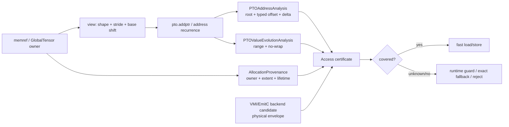
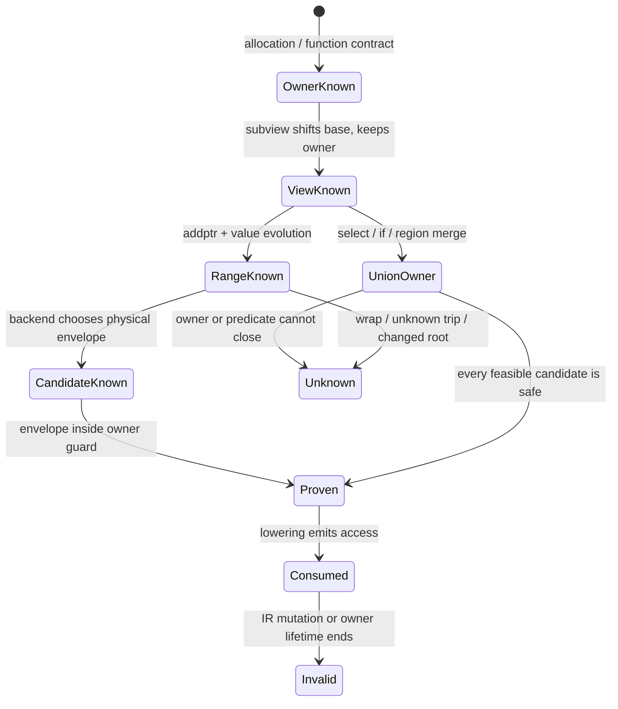

## 本篇在 PTO 课程路线中的位置

上一章把 `semantic footprint`、backend 选择的 `physical envelope` 与 `PTOAddressAnalysis` 能给出的 typed address facts 分开了。本章继续回答缺失的一环：**一个地址表达式经过 `view`、控制流合流和 loop-carried 更新后，谁能证明它仍落在同一块活着的 allocation 内？**

课程位置是：

```text
typed root / offset / delta
→ allocation provenance 穿过 view / phi / loop
→ dynamic range × physical envelope
→ VPTO 与 EmitC 共用的 memory-safety certificate
```

研究基线为 PTOAS [`48b6cf45`](https://github.com/hw-native-sys/PTOAS/commit/48b6cf451632c892f6e206b7bd7332e9041231b8)。该提交更新于 2026-09-14，并新增 dynamic subview 到 EmitC 的回归；地址分析主体与上一章的基线没有语义改动。

## 前置知识

需要记住四个集合，而不是只记一根 pointer：

- `semantic footprint`：指令语义真正要求的元素；
- `physical envelope`：backend 实际可能触碰的字节范围；
- `readable guard`：由 allocation 或显式 guard 保证可读/可写的范围；
- `defined fill`：越过 semantic footprint 后，仍允许 consumer 观察的已定义填充值。

上一章已经确认：`PTOAddressAnalysis` 负责地址数学，`VMIMemoryAccessPlan` 负责单次 VMI 访问的物理候选；二者都没有完整回答 allocation owner 与 lifetime。

## 今日核心问题

只讲一个问题：

> `memref.subview`、`pto.addptr`、分支合流（phi-like value）和 `scf.for iter_args`，分别怎样保留、合并或破坏 allocation provenance？

核心结论先给出：**地址可计算，不代表物理 envelope 被某个仍存活的 owner 覆盖。** 安全性至少需要：

\[
0 \le \min(O),\qquad \max(O)+E_{physical}\le G_{owner}
\]

其中 `O` 是所有可达动态 offset 的集合，`E_physical` 是 backend candidate 的最大访问宽度，`G_owner` 是同一 allocation owner 提供的 guard extent。任一项为 `Unknown`，都不能把 fast path 当成已证明安全。

## PTO 全栈中的位置



上游是 memref、Tile/GlobalTensor descriptor 和控制流；下游消费者是 VPTO legalization、EmitC 生成以及最终 PTO ISA load/store。证书必须位于 shared seam：太早还不知道 backend envelope，太晚则两个 backend 可能各自发明不同的安全规则。

## 概念和精确语义

本文用下面的最小证书描述一条访问。它是**基于当前代码边界提出的设计**，不是已合入类型：

```text
AllocationCertificate {
  owner_id
  root
  base_offset_bytes
  dynamic_offset_range = [min, max]
  allocation_extent_bytes
  readable_or_writable_guard
  lifetime_region
  defined_fill   // 若 consumer 会观察 padding
}
```

四种变换的精确规则如下。

1. `memref.subview`：保留 owner，按照 `Σ(offset_i × source_stride_i × elementBytes)` 平移 base。Subview 的逻辑 extent 可以缩小，但父 allocation 的物理 extent不会随 view 重新分配，也不会因为 result shape 更小就自动获得新的右侧 guard。
2. `pto.addptr`：保留候选 owner并增加 typed offset；它只做 pointer arithmetic，不产生 allocation、不延长 lifetime，也不缩小 physical envelope。
3. phi-like 合流：结果 provenance 是所有可达输入 provenance 的并集。只有所有路径共享兼容的 owner/guard，或能在各自路径谓词下逐一证明安全，才能折叠为一个证书。
4. `scf.for iter_args`：initial value 与每条 backedge 都必须保持 owner 集合；再由 scalar evolution 证明 offset range 与 no-wrap。换根、非仿射 recurrence、未知 trip count 或 possible wrap 都使证书变成 `Unknown`。

这里的“phi”是 SSA 控制流合流的概念称呼，不表示 PTOAS 当前一定有一个名为 `phi` 的 op。

### 为什么需要三值证明，而不是一个 `isSafe` 布尔值

对 compiler 来说，“尚未证明”与“已经证明越界”必须分开：

- `Proven`：所有可达 owner 候选都覆盖 physical envelope，且 lifetime、权限和 no-wrap成立；
- `Disproven`：至少存在一条可达路径，其最小地址小于 allocation起点，或最大末端严格越过guard；
- `Unknown`：动态范围、路径谓词、owner或backend envelope中至少一项无法静态求出。

`Disproven` 应产生确定诊断；`Unknown` 可以转入 runtime guard 或 exact fallback。若把二者都压成 `false`，pass会被迫在“误拒绝合法程序”和“静默放行未证明程序”之间二选一；若把 `Unknown` 当 `true`，则只是把未建模风险伪装成优化机会。

诊断还应携带失败来源，例如 `owner-unknown`、`range-unknown`、`possible-wrap`、`envelope-exceeds-guard` 或 `lifetime-ended`。这不是为了美化报错：不同原因对应不同修复动作——补函数ABI、收紧循环范围、选择更窄candidate、插入runtime guard，或延长buffer lease。只有保留原因，后续pass才不会把所有保守失败都错误地归咎于“动态shape不支持”。

对一个候选 owner `a`，静态读安全可写为：

\[
R_a=[base_a+O_{min},\ base_a+O_{max}+E_{physical})
\subseteq Guard_a
\]

合流值则要求对每个可达候选都成立：

\[
\forall a\in Owners(v),\ Predicate(a)\Rightarrow R_a\subseteq Guard_a
\]

这也解释了为什么“选出一个公共最小extent”虽然保守，却不总正确：不同分支的base和guard属于不同allocation，不能脱离predicate把两个数值范围拼成一块虚构的连续内存。

### extent、guard 与 lifetime 是三件事

`allocation_extent_bytes` 描述物理对象大小；`guard` 描述某次访问被许可的子区间；`lifetime_region` 描述该许可何时仍有效。即使offset和extent均合法，若异步DMA尚未完成而owner已被复用，新请求可能在同一地址读到另一代数据。因此证书还应绑定 generation或等价的ownership epoch。当前公开代码没有这份跨异步执行的代际证书；这里是从buffer复用正确性推导出的要求，而不是现状描述。

## 真实文件、类型、API 或指令逐段解读

### 1. `PTOAddressExpr`：root 是 SSA 锚点，不是 allocation 证明

[`PTOAddressAnalysis.h`](https://github.com/hw-native-sys/PTOAS/blob/48b6cf451632c892f6e206b7bd7332e9041231b8/include/PTO/Analysis/PTOAddressAnalysis.h) 中的 `PTOAddressExpr` 保存 `currentBase`、`rootOrBase`、`elementOffset`、可选 typed unit 和 `elementBytes`。没有 allocation size、owner identity、guard 或 lifetime 字段。

[`getAddresses`](https://github.com/hw-native-sys/PTOAS/blob/48b6cf451632c892f6e206b7bd7332e9041231b8/lib/PTO/Analysis/PTOAddressAnalysis.cpp) 从 memory op 的 base operand 反向穿过 element size 兼容的 `pto.addptr`，累计 offset；不能继续时，当前 SSA value 就成为 `rootOrBase`。所以：

```text
same root  ⇒ 可以尝试比较 offset
same root  ⇏ 已知 allocation extent
different root ⇏ 一定 no-alias
```

对齐推导同样是局部事实：block argument pointer 被当作 base-aligned，兼容 cast/addptr 链最多回溯有限深度，offset remainder 再乘 element bytes。它没有查 allocation 尾部还剩多少字节。

### 2. `memref.subview` EmitC lowering：descriptor 正确，不等于 coverage 已证

[`Subview.cpp`](https://github.com/hw-native-sys/PTOAS/blob/48b6cf451632c892f6e206b7bd7332e9041231b8/lib/PTO/Transforms/PTOToEmitC/Memref/Subview.cpp) 会递归解析 source stride：穿过 `memref.reinterpret_cast`、嵌套 `memref.subview` 与 `memref.cast`；若无法得到精确 stride，就拒绝假装成 compact layout。

随后 `computeTotalOffset` 计算 element-unit 的 `Σ(offset×stride)`，`computeOffsetPointer` 把它加到底层 data pointer，GM 路径再构造带 shape/stride 的 `GlobalTensor`。这是可靠的 descriptor lowering，但生成对象中没有原 allocation extent 或 owner certificate。

最新 [`emitc_memref_cast_from_dynamic_subview.pto`](https://github.com/hw-native-sys/PTOAS/blob/48b6cf451632c892f6e206b7bd7332e9041231b8/test/lit/pto/emitc_memref_cast_from_dynamic_subview.pto) 证明 dynamic view 链能完成 EmitC legalization且不残留 `memref.cast`。这是**测试事实：lowering 形态成立**，不是“所有运行时 offset 都在 allocation 内”的证明。

### 3. Tile `pto.subview` verifier：验证局部 descriptor，不替用户定义 source coverage

[`PTOSubViewInference.cpp`](https://github.com/hw-native-sys/PTOAS/blob/48b6cf451632c892f6e206b7bd7332e9041231b8/lib/PTO/IR/PTOInterfaces/PTOSubViewInference.cpp) 对 TileBuf subview检查 rank、正 size、常量 offset 非负、valid row/col成对出现且不超过结果 size，并核对 result shape、address space、element type 与 config。

它没有强制 result valid shape 必须落在 source valid shape 中；这是 user-controlled subview semantics 的边界。因此 verifier 能证明“结果 descriptor 自洽”，不能单独证明 source allocation 或 source valid/fill 覆盖了后续 physical read set。

### 4. loop recurrence：能证明步长与 no-wrap，不能凭空得到 owner extent

[`PTOAddressAnalysis.cpp`](https://github.com/hw-native-sys/PTOAS/blob/48b6cf451632c892f6e206b7bd7332e9041231b8/lib/PTO/Analysis/PTOAddressAnalysis.cpp) 对 `scf.for` 的 loop-carried pointer要求 yield 链能沿 `pto.addptr` 回到同一 iter_arg；换根则返回 `NonAffineRecurrence`。[`PTOValueEvolutionAnalysis`](https://github.com/hw-native-sys/PTOAS/blob/48b6cf451632c892f6e206b7bd7332e9041231b8/lib/PTO/Analysis/PTOValueEvolutionAnalysis.cpp) 再处理 affine step、range 与可能溢出。

这能回答“每轮加多少、值域是否可算、会不会 wrap”，却没有把最大 offset 与 allocation extent 相乘比较。scalar range proof 与 memory coverage proof仍是两步。

### 5. 为什么 nested `scf.if` 当前保守不改写

[`VPTOSoftPostUpdate.cpp`](https://github.com/hw-native-sys/PTOAS/blob/48b6cf451632c892f6e206b7bd7332e9041231b8/lib/PTO/Transforms/VPTOSoftPostUpdate.cpp) 只处理直接位于 `scf.for` body 的 memory op；嵌套在 `scf.if` 中的 op不会进入候选。nested loop会按 inner-to-outer 规划，但每个候选仍须是对应 loop body 的直接 child。

这不是单纯“分析不够聪明”。分支内的访问次数、地址更新和 owner路径都可能不同；在没有 predicate-aware provenance/effect summary 时，拒绝把它改成统一 post-update pointer 是正确的 fail-closed 行为。

## 对象与证明状态生命周期



证书在 allocation/function boundary 创建；view只派生 base/shape/stride；loop analysis补 range；backend补 envelope；legalizer消费证书后发出访问。IR mutation、buffer复用或 lifetime终止后，旧证书必须失效，不能只按 SSA 指针文本缓存。

## 端到端调用链

一条真实链可以写成：

```text
memref.subview / memref.cast
→ PTOToEmitC Subview::resolveSourceStrides
→ computeTotalOffset / computeOffsetPointer
→ GlobalTensor descriptor
→ PTO/VMI load or store
→ VPTOAddressSemantics selects base/advance operands
→ PTOAddressAnalysis walks pto.addptr
→ PTOValueEvolutionAnalysis proves loop step/range/no-wrap
→ backend physical access plan
→ [当前缺口] allocation owner × extent coverage
→ EmitC or VPTO access
```

前六步在当前代码中可找到直接实现。方括号中的 coverage组合器是本文建议补上的 shared analysis，不应被描述为已合入功能。

如果未来实现该组合器，最重要的接口边界不是“返回一个offset”，而是把证明义务显式交接：Subview lowering提交 `owner candidate + base shift + view strides`；ValueEvolution提交带失败原因的range/no-wrap；backend提交读写方向、segment集合和最宽envelope；verifier只组合事实，不重新猜地址。这样 VPTO 与 EmitC 即使选择不同指令序列，也能共享同一个semantic intent，并分别证明自己的physical candidate。

缓存同样必须有版本边界。`VPTOSoftPostUpdate` 已经采用“整函数先规划、mutation后按顺序块重建fresh analysis”的策略，避免旧地址事实污染新IR。Allocation certificate也应遵循相同原则：任何改变base、stride、控制流、trip count、backend candidate或buffer ownership的rewrite，都使旧证书失效。只以SSA value作为cache key而忽略IR revision，会让一次原本正确的证明被错误复用到修改后的访问。

## 具体 shape、Tile 和状态演算

设 GM 中有一个 contiguous `f32 A[8,64]`：

```text
logical elements = 8 × 64 = 512
allocation extent = 512 × 4 B = 2048 B
row view = [1,64]
physical envelope = 64 × 4 B = 256 B
```

循环第 `r` 轮取得一行：

\[
O(r)=r\times64\times4=256r\ \text{bytes}
\]

当 `r∈[0,7]`：

\[
\max O + E=7\times256+256=2048\le G_{owner}
\]

因此最后一次访问恰好落在 allocation右边界，安全。若上界错误地允许 `r=8`：

\[
8\times256+256=2304>2048
\]

同一条 `addptr` recurrence、相同 256 B load，在 2304 B allocation中可以安全，在 2048 B allocation中越界。`PTOAddressAnalysis` 可以证明 step=256 B，却无法区分二者，因为输入事实中没有 `G_owner`。

直接相关的 [`subview_dynamic_offset_static_valid_regression.pto`](https://github.com/hw-native-sys/PTOAS/blob/48b6cf451632c892f6e206b7bd7332e9041231b8/test/lit/pto/subview_dynamic_offset_static_valid_regression.pto) 使用 `8×64xf32` Tile、动态 `%arg0×64` column offset 和 `1×64` subview。检查项确认 lowering乘以 4 转成 byte offset，并保留 static valid shape；但 `%arg0` 没有 range约束，所以测试没有证明 OOB 被拒绝。

再看分支：若 `%p = select %cond, %A, %B`，A/B 都是 2048 B且 offset range相同，可对两个候选分别证明安全；若 B 只有 1024 B，则 `r=7` 对 A安全、对 B越界。把 select结果当作一个新的 opaque root不会制造 no-alias，也不会消除 B 的风险。需要的是 `owner-set={A,B}` 加 path predicate，而不是更复杂的 pointer字符串。

## 为什么这样设计及替代方案

最小可维护方案是新增 `AllocationProvenanceAnalysis`（名字可调整），消费已有地址与 value-evolution事实，而不把 allocation policy塞回 `PTOAddressAnalysis`：

- Address analysis继续只做 root、offset、difference、alignment；
- provenance analysis追踪 owner、extent、guard、lifetime与控制流候选；
- backend access plan给出 physical envelope；
- shared verifier组合三者，产出 `Proven / Disproven / Unknown`。

替代设计比较：

| 方案 | 正确性 | 性能/图执行 | 显存 | 维护成本 |
| --- | --- | --- | --- | --- |
| 静态 provenance certificate | 可证明时最强；Unknown保守 | fast path零运行时分支，graph-friendly | 无额外 padding | 需跨 view/SCF维护 lattice |
| 每次 runtime bounds check | 动态值也可保护 | 增加分支、同步或设备谓词，可能扩大 graph key | 很低 | backend需一致实现失败语义 |
| 给 allocation统一加 guard padding | 对固定 over-read简单 | fast，但可能掩盖错误 | 按 buffer累计浪费 | owner/reuse仍需证明 |
| 无法证明就 exact masked fallback | 写集合最精确 | tail性能可能显著下降 | 低 | 需维护 fast/exact parity |

合理组合是：静态证书优先；`Unknown` 时选择 runtime guard或 exact fallback；没有可靠 fallback的写路径直接拒绝。

## 访存、计算、流水、并行和硬件约束

Allocation provenance本身不改变算术量，但决定能否使用更宽的 vector/DMA访问。假设 semantic row只有 100 个 `f32`（400 B），backend用两个 256 B segment读取，则 physical envelope为512 B；owner guard必须额外覆盖112 B，而且若 consumer会观察补齐 lanes，还需独立的 defined-fill证明。

静态证书让宽 load与 loop post-update保留流水优势：地址生成可与访存并行，且不增加每轮 predicate。runtime guard则可能引入控制依赖；exact fallback减少无效流量，却会增加指令数或破坏整齐 tile。NPU上具体 MTE、Vector stall和异常粒度没有公开证据，以上性能影响属于基于编译结构的推断，仍需 A5 trace/benchmark确认。

Phi/loop还影响并行合法性：同一 owner上的不重叠 range可以进一步做 dependence分析，但“不同 `rootOrBase`”不能直接推出 no-alias；在 allocation identity未闭合前，不应据此重排两条 DMA或把它们放进无同步流水。

## 测试证据与未覆盖风险

当前直接证据分四层：

1. [`address_analysis.pto`](https://github.com/hw-native-sys/PTOAS/blob/48b6cf451632c892f6e206b7bd7332e9041231b8/test/lit/vpto/address_analysis.pto) 覆盖 direct index、`addptr`、typed recurrence、known range/no-wrap、possible-wrap Unknown和 byte/unit delta；验证地址代数，不验证 allocation bytes。
2. [`soft_postupdate_negative-control-flow.pto`](https://github.com/hw-native-sys/PTOAS/blob/48b6cf451632c892f6e206b7bd7332e9041231b8/test/lit/vpto/soft_postupdate_negative-control-flow.pto) 要求 `scf.if` 内存操作保持不变，验证 pass 不跨未知路径合并访问次数/地址更新。
3. [`soft_postupdate_nested-loop.pto`](https://github.com/hw-native-sys/PTOAS/blob/48b6cf451632c892f6e206b7bd7332e9041231b8/test/lit/vpto/soft_postupdate_nested-loop.pto) 验证 inner-to-outer rewrite；[`soft_postupdate_accum-multilevel-yield.pto`](https://github.com/hw-native-sys/PTOAS/blob/48b6cf451632c892f6e206b7bd7332e9041231b8/test/lit/vpto/soft_postupdate_accum-multilevel-yield.pto) 验证多级 scalar recurrence分解。二者都没有 owner/extent oracle。
4. 最新 dynamic subview测试验证 shape/stride/pointer legalization；提交说明报告 75/75 CTest、1888/1888 lit通过。这是提交记录中的测试结果，本篇没有独立 NPU运行。

一套真正能关闭缺口的test harness还需要同时观察“是否生成fast path”和“运行时是否只触碰许可字节”。静态lit可检查 `Proven/Disproven/Unknown` 诊断及VPTO/EmitC parity；CPU或模拟后端可在allocation两侧放canary，源padding写入NaN/特征bit，destination先填非零poison；真机用最小allocation、guard page或设备可观察的fault机制确认宽load/store没有跨界。只比最终有效元素的torch golden，会漏掉越界读未被consumer观察、越界写随后又被覆盖两类错误。

对于loop，至少应交叉参数化 `trip count × initial offset × step × envelope`，并加入负step、零步长、可能wrap、动态上界和backedge换owner。对于phi，至少覆盖同owner同guard、同owner不同subrange、不同owner均安全、单支不足、不可达危险分支以及predicate无法恢复六种情况。每个case都要固定证据等级，避免以后某次优化把保守的`Unknown`悄悄降格为无检查fast path。

缺失的关键 negative matrix是：

| 场景 | 预期 |
| --- | --- |
| view末端刚好等于 extent | `Proven` |
| view envelope越过1 B | `Disproven` |
| dynamic offset range未知 | `Unknown`，不得走无检查 fast path |
| select两支同 owner/同 guard | 可合并 |
| select两支不同 owner，逐支均安全 | path-sensitive `Proven` |
| 任一支 extent不足 | `Disproven` 或保留 runtime guard |
| loop backedge换 root | `Unknown/NonAffineRecurrence` |
| trip count未知或 offset可能 wrap | `Unknown` |
| IR mutation后复用旧 certificate | 必须拒绝/重新分析 |

此外还没有证明：allocation从哪种 ABI/alloc op导入；dealloc、buffer reuse与异步DMA的 lifetime；subview负 stride；跨函数返回/调用；VPTO和EmitC对同一证书的诊断 parity；真实A5越界 fault与guard padding poison。

## 与前后章节的连接

第35章给出了“地址事实≠访问安全”的分层；本章把 owner/extent沿 view、phi、loop传播的闭合条件具体化。它也回扣第31–33章的 padding poison：即使 physical envelope落在 allocation guard内，padding没有 defined fill时，consumer仍不能把它当有效值。

下一步应把这些事实放到跨 backend的 shared intent上：同一 `MemoryAccessIntent` 同时携带 semantic span、owner certificate与候选 envelope，再检查 VPTO和EmitC是否对相同 case给出相同接受、fallback或拒绝结果。

## 本篇结论

1. `rootOrBase` 是地址分析的SSA锚点，不是 allocation identity；同 root不自带extent，不同root也不自带no-alias。
2. `subview/addptr` 可以保留 owner，但必须显式传播 base shift、extent、guard和lifetime；逻辑 view变小不会自动扩大物理安全边界。
3. phi/loop必须以 owner候选集和动态offset range做证明；`range × physical envelope ≤ guard` 才是 fast path条件。
4. 当前源码与测试能证明 descriptor lowering、recurrence和保守控制流边界，尚不能证明完整 allocation coverage。

## 知识债

- shared `AllocationCertificate` / provenance lattice及其IR承载方式；
- function argument、alloc、GlobalTensor/TileBuf来源的 owner/extent导入；
- select/if/region branch的predicate-aware候选集合；
- loop dynamic range、possible-wrap与physical envelope联合证明；
- dealloc、async DMA、buffer reuse与proof invalidation；
- VPTO/EmitC acceptance与diagnostic golden；
- A5 fault、source/destination poison和fast/exact性能矩阵。

## 三个理解检查问题

1. 为什么 `PTOAddressAnalysis` 已证明 pointer每轮增加256 B，仍不能证明第8轮的256 B load安全？
2. `memref.subview` 的result shape更小后，为什么不能把它直接当作新的allocation extent？
3. 一个select的两支来自不同allocation，但每支都在自己的guard内，这个访问应直接拒绝，还是能做path-sensitive证明？需要保存哪些事实？

## 下一章

**同一访问，两种后端——把 AllocationCertificate 接到 shared `MemoryAccessIntent`，审计 VPTO 与 EmitC 的 candidate、fallback和diagnostic parity。**

## 课程账本增量

- PTOAS基线推进到 `48b6cf45`，新增覆盖 dynamic subview→EmitC回归、Subview lowering、Tile subview inference、ValueEvolution与SoftPostUpdate控制流边界。
- 新确认不变量：`view`平移base但不新建owner；`addptr`不产生coverage；phi合并owner候选；loop需同时证明owner稳定、range/no-wrap与`maxOffset+envelope≤guard`。
- 测试证据明确拆分为地址代数、descriptor lowering、control-flow conservatism和allocation coverage四层；当前前三层有lit，第四层仍缺shared verifier与negative matrix。
- 下一章转向VPTO/EmitC parity，不提前进入pypto-serving。
