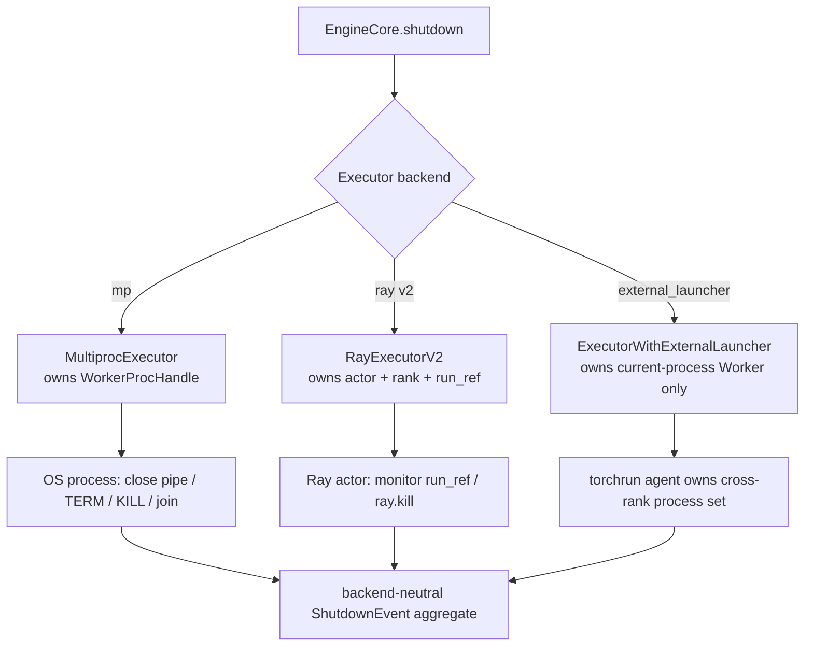

> 源码基线：[`vllm-project/vllm@a7576447`](https://github.com/vllm-project/vllm/commit/a7576447b86454f5c5729958d921271392ced47f)，即默认分支截至 2026-09-15 的最新提交。该提交修复 ROCm/Ray NIXL 初始化，与本文检查的 shutdown 实现无直接关系。本文提出的 `ShutdownEvent`、generation-aware late-ack gate 和 backend golden harness 都是建议设计，不是已合入 API。

## 本篇在课程路线中的位置

第 31 章得到一条时间不变量：parent 持有权威 monotonic deadline，child 只能消费 `remaining`，不能进入新函数就刷新 timeout。本章继续收窄问题：同一套 golden 能否覆盖 MP、Ray 和 `external_launcher`？

答案是：**语义事件可以统一，终止原语不能统一。** 三种 backend 都必须冻结 expected ranks、保存 KILL 前证据、拒绝旧 generation 的迟到回执；但 MP 能 `join` OS child，Ray 只能观察 actor/run ref，external launcher 的本地 Executor 根本不拥有其他 rank。

## 前置知识回顾

`COMPLETED` 必须由执行 cleanup 的 owner 报告；process exit、`ray.kill` 和 torchrun 判定 rank 消失只证明隔离。全局成功条件仍是：

\[
final\_completed = expected
\]

若 deadline 到期时 `final_completed` 不完整，缺失成员不能从集合中删除，而应合成为 `abandoned_by_deadline` 或 `completion_unknown`。

## 本篇要回答的核心问题

1. 三种 backend 中，谁拥有 rank、谁能强杀、谁能证明终态？
2. late ack 在什么条件下仍可接受，什么时候必须作为 stale evidence 丢弃？
3. “KILL 已调用”“actor 不可访问”“torchrun 返回非零”为什么都不等价于 cleanup final？

## 组件在全局架构中的位置

[`Executor.get_class`](https://github.com/vllm-project/vllm/blob/a7576447b86454f5c5729958d921271392ced47f/vllm/v1/executor/abstract.py) 把 `mp`、`ray`、`external_launcher` 分派到三个不同 owner 模型：



共同调用链是 `AsyncLLM/LLMEngine → EngineCore.shutdown → Executor.shutdown → Worker.shutdown → GPUModelRunner.shutdown`。分叉发生在 Executor 如何到达 Worker，以及谁能在 Worker 不返回时隔离它。

## 完整调用链

### MP：一个 Executor 直接拥有全部 child

[`MultiprocExecutor.shutdown`](https://github.com/vllm-project/vllm/blob/a7576447b86454f5c5729958d921271392ced47f/vllm/v1/executor/multiproc_executor.py) 关闭每个 `death_writer`，等待 child；超时后批量 TERM，再等 4 秒，最后 KILL。`WorkerProcHandle` 同时保存 `proc`、`rank`、response MQ 和 death pipe，因此 parent 天然拥有 `expected={0..world_size-1}`。但当前 KILL 后没有 `join`，response MQ 又在 Worker 真正 cleanup 前关闭，故无法得到 post-cleanup final。

### Ray V2：rank identity 明确，但 kill 不是回执

[`RayWorkerHandle`](https://github.com/vllm-project/vllm/blob/a7576447b86454f5c5729958d921271392ced47f/vllm/v1/executor/ray_executor_v2.py) 保存 `actor/rank/local_rank/node_id/run_ref`。`run_ref` 来自 `actor.run.remote()`，monitor 每 5 秒 `ray.wait` 一次；某个 ref ready 后，它把对应 rank 标成 failed，并触发 shutdown。

[`RayExecutorV2.shutdown`](https://github.com/vllm-project/vllm/blob/a7576447b86454f5c5729958d921271392ced47f/vllm/v1/executor/ray_executor_v2.py) 先把 `shutting_down=True`，最多等 monitor thread 10 秒，然后逐 actor 调用 `ray.kill`，最后关闭 MQ。接口没有 timeout、remaining、cleanup RPC 或 final aggregate；kill 异常只写日志。旧版 [`RayDistributedExecutor.shutdown`](https://github.com/vllm-project/vllm/blob/a7576447b86454f5c5729958d921271392ced47f/vllm/v1/executor/ray_executor.py) 更弱：仅在 `forward_dag` 存在时 teardown DAG 并 kill workers，`check_health()` 仍假定 Worker 健康。

Core 本身也可能由 Ray 管理。[`CoreEngineActorManager.shutdown`](https://github.com/vllm-project/vllm/blob/a7576447b86454f5c5729958d921271392ced47f/vllm/v1/engine/utils.py) 接受 `timeout` 却不消费它，直接 `ray.kill` local/remote actors 并移除 placement groups。这说明第 31 章的 remaining-budget contract 在 Ray Core 层也尚未闭合。

### External launcher：每个 rank 都误以为自己是本地唯一 Worker

[`ExecutorWithExternalLauncher`](https://github.com/vllm-project/vllm/blob/a7576447b86454f5c5729958d921271392ced47f/vllm/v1/executor/uniproc_executor.py) 继承 `UniProcExecutor`。torchrun 为每个进程设置 `RANK/LOCAL_RANK`；每个进程只创建一个 `WorkerWrapperBase(rpc_rank=0)`，把全局 `rank` 另行传给 Worker。`shutdown()` 只是当前进程直接调用 `driver_worker.shutdown()`，没有跨 rank fan-out、timeout 或强杀能力。

因此 external launcher 的 final identity 必须使用全局 `RANK`，不能用每个进程里都相同的 `rpc_rank=0`。跨 rank expected-set、deadline 与 KILL/reap 必须由 torchrun/elastic agent 或其上层 supervisor 持有。

## 关键类型、字段和状态生命周期

建议唯一协议对象是固定大小的 `ShutdownEvent`：

| 字段 | 语义 | 接受条件 |
|---|---|---|
| `generation` | 本次 Engine 实例的关闭代次 | 必须等于 collector 当前 active generation |
| `global_rank` | 全局 Worker 身份 | 必须属于冻结的 expected-set |
| `seq` | 同 rank 单调序号 | 必须大于该 rank 已接受序号 |
| `phase` | `started/completed/failed/isolated/reaped` | 只能沿合法偏序推进 |
| `owner` | model runner、Worker、Executor 等 | 证明范围不得越过发出者所有权 |

生命周期是：supervisor 冻结 expected-set 并创建 generation；各 rank 在危险 cleanup 前后写 `started/completed`；collector 去重并 checkpoint latest view；deadline 到期后 backend adapter 产生 `isolated`，若具备可观察的回收屏障再产生 `reaped`；aggregate 最后把仍无 final 的 rank 标成 unknown。

这里没有模型 tensor，shape/dtype/device 不适用；具体状态规模为 `O(rank × owner)`，每个格子只保存最新序号，而不是无限日志。

这里最好不要把所有状态排成一条“越往后越成功”的直线。证据至少有两个正交维度：

\[
cleanup\ evidence \in \{none, started, completed, failed\}
\]

\[
containment\ evidence \in \{alive, isolation\ requested, isolated, reaped\}
\]

例如 `(started, reaped)` 的含义是“已知 cleanup 进入危险操作，随后进程被回收”，不是 completed；`(completed, alive)` 反而可能是正常情况——设备资源已经清完，但进程还在发送最后回执。把两维压成单个枚举，最容易产生的错误就是 `SIGKILL → REAPED → SUCCESS`。

backend adapter 的最小接口也因此不是统一调用一个 `kill()`：

| 操作 | 输入 | 输出 | 失败后必须保留的事实 |
|---|---|---|---|
| `request_cleanup` | generation、rank、remaining | 可选的 delivery evidence | 消息已投递不等于 cleanup started |
| `observe_progress` | rank 最新 `seq` | accepted/duplicate/stale | 最后 durable-accepted frame |
| `isolate` | rank、剩余 reserve | backend-specific ticket | 只提升 containment 维度 |
| `confirm_gone` | ticket、remaining | `isolated/reaped/unknown` | 不得伪造 cleanup completed |
| `checkpoint_terminal` | 全 rank latest view | durable aggregate id | 此后 late frame 不再改写结果 |

MP 的 ticket 可以是 PID/process handle，Ray 是 actor identity 加 `run_ref`，external launcher 则应是 agent 持有的 global-rank process handle。接口的 owner 只能报告自己能观察的事实：Ray Executor不能把远端 GPU fence补成 completed，torchrun agent也不能凭退出码证明 Python finally 走完。

## 逐函数源码解读

MP 的 `_ensure_worker_termination` 已采用“所有 rank 并行等待、并行升级”，但用 `time.time()`，每个阶段重新开窗，KILL 后直接返回。它需要的 adapter 是 `is_alive/terminate/kill/join/exitcode` 加 shared deadline。

Ray V2 的 monitor 已建立 `run_ref→rank` 映射，这是 expected-set 与 isolation evidence 的好基础；但 `run_ref` ready 只说明 actor 的 `run()` 结束，可能正常、异常或被 kill。要证明 cleanup，仍需 actor 在可中断 sideband 上发 owner final。`ray.kill` 后不应由调用点伪造 `completed`。

External launcher 的关键事实是“一个进程一个 Engine/Worker”。本地 `UniProcExecutor.shutdown` 直接同步进入 device cleanup；若 native call 卡死，只能由外层 agent 杀掉整个 rank process。当前 `check_health()` 无条件返回，测试也没有 shutdown-specific rank aggregate。

这三个实现还暴露出不同的“错误返回面”。MP 有 `BaseProcess.exitcode`，但当前 KILL 后未 join，退出码未必已稳定可读；Ray V2 对 `ray.kill` 异常逐 rank记录日志并继续清理 MQ，调用者得不到结构化失败集合；external launcher 的本地 `shutdown()` 若抛错，只会影响当前 rank 的 Python 调用栈，其他 rank 可能仍卡在 collective。共同协议必须把这些差异收敛为 `isolation_requested/isolation_confirmed/reap_unknown`，而不是让上层解析日志文本。

对象释放顺序也不能被 backend 名称掩盖。正确偏序是：先停止新增 RPC，再让 Worker停止设备工作并报告；之后 checkpoint；再隔离 survivor；最后才能销毁承载 progress 的 MQ、Ray runtime或 process group。当前 Ray V2 是先 join monitor、kill actors、再关 MQ，这对避免 monitor 与 Ray teardown 并发是有意设计；但没有独立 sideband 时，业务 MQ 一关，最后证据也随之消失。MP 同样在 Worker termination 后关闭 response MQ，却没有另一条回执通道。因而 sideband 必须由比 Worker寿命更长的 owner持有。

## 具体示例与状态演算

设 TP=2，总 deadline `D=6s`，generation=41；rank 0 在 2 秒完成，rank 1 卡在 device synchronize。rank 1 在 5.4 秒发出 `completed(seq=8)`，但网络到 6.2 秒才交付。

```mermaid
sequenceDiagram
    participant S as Supervisor/Collector
    participant R0 as rank 0
    participant R1 as rank 1
    S->>R0: generation 41, remaining 6s
    S->>R1: generation 41, remaining 6s
    R0-->>S: seq 7 completed at 2.0s
    R1-->>S: seq 8 completed sent at 5.4s
    Note over S: 6.0s deadline; checkpoint
    S-xR1: backend isolation
    Note over S: 6.2s late ack arrives
    S->>S: accept as evidence only if generation active and isolation not terminal-conflicting
```

三种 adapter 的结果不同：

- MP：若 6.0 秒已 KILL 且随后 `join` 得到 `-SIGKILL`，5.4 秒的 completed frame 与 KILL 因果冲突。只有 durable sink 在 KILL 前已接收并确认它，才能计作 cleanup final；6.2 秒首次出现的帧应隔离为 late evidence，不能倒改已发布 aggregate。
- Ray：`ray.kill` 返回或后续 RPC 抛 `RayActorError` 只建立 actor isolation；没有 durable pre-kill ack 时，rank 1 仍是 unknown。
- External：rank 1 的本地进程无法替 rank 0 聚合。只有 torchrun supervisor 按 `generation+global_rank` 收集两份 final；进程退出码不能补写缺失 cleanup final。

这给出一条严格规则：**late ack 是否“在 deadline 前发送”不重要，collector 在 terminal checkpoint 前是否 durable-accept 才重要。** 否则发送者本地时间、网络延迟和 crash recovery 都无法形成可审计事实。

把例子扩成六种 golden 输入，可以看到统一协议真正验证的不是 API 调用次数，而是状态合成：

| 场景 | rank 1 最强 cleanup 证据 | containment | 全局结果 |
|---|---|---|---|
| 正常完成 | `completed(seq=8)` | 不需要强杀 | success |
| cleanup 抛错 | `failed(seq=8,cause)` | 可正常退出 | failed，保留 cause |
| 重复帧 | 两次 `seq=8` | 不变 | 第二帧 duplicate，不改变结果 |
| terminal 后迟到 | checkpoint 时只有 started | 随后 isolated | unknown；迟到帧只作诊断 |
| 旧 generation | generation=40 completed | generation=41 正在关闭 | stale，完全不计入 expected-set |
| 回收确认失败 | completed 缺失 | kill 已请求但无法确认 gone | completion_unknown + containment_unknown |

最后一行尤其重要。MP 的 `kill()` 抛错、Ray 控制面失联、torchrun agent crash 都可能使 supervisor 连“已经隔离”都无法证明。此时不能释放可能被旧执行触碰的共享地址、KV transfer lease 或新 generation 的同名资源；最小安全动作是把该 component 标记为 poisoned，等待更高层重建或人工确认。

## 为什么这样设计及替代方案

替代方案一是为三种 backend 分别设计完整协议。它最贴近 API，却会产生三套状态名、超时和测试，最终无法比较 `RayActorError` 与 `exitcode` 的证据强度。

替代方案二是只统一 `shutdown(timeout)`。签名相同并不能统一所有权：external Executor 没有其他 rank handle，Ray 没有 OS join，MP 没有远端 actor。因此它会制造“接口统一、语义分裂”。

最小设计是统一事件与 aggregate，保留 backend adapter：

```text
common: generation / global_rank / seq / owner / phase / durable checkpoint
MP:     close pipe / TERM / KILL / join
Ray:    cleanup RPC / ray.kill / run_ref or state observation
torchrun: local final / agent TERM-KILL / wait all rank processes
```

这几乎不影响推理热路径；代价是 shutdown 控制面多一个有界 sideband和 adapter。收益是 MP、Ray、torchrun 可以共享同一 golden fixture，减少故障处理的维护分叉。

为什么不直接复用现有业务 RPC/MQ？正常请求通道往往正是故障源：MP Worker可能卡在 collective，Ray actor可能已经不可调度，external rank可能失去 process group；而且现有关闭顺序会主动 teardown这些通道。独立 sideband不要求高带宽，只需固定容量的 latest-state slot 和 parent acknowledgement。若队列满，新的更高 `seq` 可以覆盖同 rank/owner 的旧 progress，但不能覆盖尚未 durable checkpoint 的 terminal frame。这是有界 backpressure 与证据不丢失之间的最小折中。

另一个替代是“等待所有 cleanup RPC 返回，再做 kill”。它在正常路径很整洁，却让一个 native hang阻塞整个 fan-in。正确聚合应持续接收任意 rank progress，同时按共同 deadline推进；慢 rank不会阻止快 rank写 final，也不会让每个 rank串行消费完整预算。这样既保留最大证据，又维持总关闭时间上界。

## 性能、并发、正确性与边界条件

- 所有 rank 并行消费同一 deadline，不能串行地每 rank 各等 6 秒。
- `completed` 与 `isolated/reaped` 是正交证据；后者不能升级前者。
- collector 发布 terminal aggregate 后，不得被迟到帧改写；帧可留作诊断但必须标记 `late_after_terminal`。
- old generation 即使 rank、seq 看似更新，也必须拒绝，防止重启后的 actor/process 污染新实例。
- Ray monitor 的 5 秒 poll 和 10 秒 join 当前都是 fresh local timeout；若纳入总预算，必须取 `min(local_cap, remaining-reserve)`。
- External launcher 中 NCCL/process-group teardown 可能要求所有 rank 协同；单 rank 超时后继续等待 collective 会消耗完整 deadline，应尽早进入 supervisor containment。

对显存和 graph correctness，terminal aggregate 还有直接后果。只有 cleanup completed 或更高层确认整个 device context不可再执行，相关 graph pool、KV block地址和 IPC handle才可安全进入新 generation。若只是 actor handle消失但底层节点/driver状态未知，重新在同一地址接收迟到 DMA 的风险不能由 Host对象销毁排除。这是基于异步设备语义的工程推断，当前测试没有 device trace证明；因此文章只给出 fail-closed策略，不宣称 Ray或 OS 一定会留下设备工作。

## 测试证据与未覆盖风险

当前测试事实分三层：

1. [`test_ray_v2_executor_shutdown`](https://github.com/vllm-project/vllm/blob/a7576447b86454f5c5729958d921271392ced47f/tests/distributed/test_ray_v2_executor.py) 创建 TP=2，调用 shutdown 后断言两个 actor RPC 都抛 `RayActorError`，并验证 MQ 引用清空；它证明 actor 隔离与 Host queue cleanup，不证明 per-rank device final。
2. 同文件的 worker-death 测试外部 kill rank 1，等待 failure callback，断言 `is_failed/shutting_down`；未验证 remaining、late ack、expected/final/missing 或 actor cleanup。
3. [`test_torchrun_example.py`](https://github.com/vllm-project/vllm/blob/a7576447b86454f5c5729958d921271392ced47f/tests/distributed/test_torchrun_example.py) 验证 external launcher 的 TP=2 输出和 KV block 数跨 rank 一致；Buildkite 的 [Torchrun Examples 任务](https://github.com/vllm-project/vllm/blob/a7576447b86454f5c5729958d921271392ced47f/.buildkite/test_areas/distributed.yaml) 覆盖 TP/PP/DP/EP 组合，却没有单 rank hang、late final 或 reap failure。

建议 golden matrix 对每个 adapter运行相同六例：全部 completed；一个 rank failed；deadline 前 completed 但 ack 重复；terminal 后 late ack；旧 generation ack；isolation 成功但 reap/state-confirm 失败。共同断言事件偏序，不断言脆弱的精确毫秒值。真实 CUDA/NCCL hang 仍须在可牺牲的硬件进程中验证；fake clock 只能证明控制协议。

一条可复用断言应写成集合与偏序，而不是 backend 文本：`accepted_final ⊆ expected`、每个 `(generation,rank,owner)` 的 accepted `seq` 单调、`checkpoint_terminal < isolate_survivors`、所有 `completed` 必须早于对应 terminal checkpoint。adapter-specific 断言只负责证明 `confirm_gone`：MP 要看到 join 与稳定 exitcode，Ray 要看到 actor/run-ref 的终止观测，external launcher 要由 agent确认全局 rank process 已退出。若 adapter 无法提供这种观测，测试预期就应是 `containment_unknown`，不能为了让三种 backend 的结果“看起来一致”而降低证据标准。

测试还应模拟 collector自身在 checkpoint 前后崩溃。checkpoint 前恢复时可以继续接收同 generation 的高序号帧；checkpoint 后恢复时，terminal aggregate 必须保持不可变，并把所有迟到帧写入独立诊断区。这个 crash boundary决定 durable sink 是否真正比 child日志更强，也是下一章 wire protocol必须兑现的前置条件。

换言之，测试目标不是“所有进程最终都没了”，而是每个不可逆动作之前都有可恢复、可归属、可判定强度的证据。

## 与前后章节的连接

第 27–31 章依次建立 generation、rank identity、parent-owned snapshot、native-hang escalation 与 remaining budget。本章把它们压缩为一套 backend-neutral golden，并确认 external launcher 的跨 rank owner 必须上移到 torchrun supervisor。

下一章应停止扩展状态名，直接落到 wire 层：固定大小 `ShutdownEvent` 如何通过独立 sideband传输，如何做 backpressure、Python/Rust 编解码 golden，以及 collector crash 后如何恢复 terminal checkpoint。

## 本篇结论

结论：

1. MP、Ray、external launcher 可以共享事件语义，却不能共享强杀与 reap 实现。
2. `ray.kill`、`RayActorError`、OS exitcode 和 torchrun rank failure 都只是 isolation evidence；cleanup final 必须由实际 owner 在 terminal checkpoint 前 durable-accept。
3. external launcher 的 `rpc_rank=0` 是进程内 RPC 身份，不是全局 rank；聚合必须使用 `RANK` 并由外层 supervisor持有 expected-set。

## 知识债

实际 `ShutdownEvent` schema、durable sideband、MP KILL 后 join、Ray cleanup RPC/state confirmation、torchrun supervisor adapter、terminal-after-late policy、Python/Rust golden，以及真实 CUDA/NCCL hang。

## 三个理解检查问题

1. Ray actor 已不可调用，为什么仍不能把该 rank 标成 `COMPLETED`？
2. external launcher 中若两个进程都上报 `rpc_rank=0`，会怎样破坏 expected-set？
3. rank 在 deadline 前发送 completed、但 terminal checkpoint 后才首次到达，为什么不能改写已发布结果？

## 下一章

**ShutdownEvent 走哪条线——独立 sideband、bounded backpressure、Python/Rust wire golden 与 collector crash recovery。**

## 课程账本增量

- 第 32 章：统一 `generation/global_rank/seq/owner/phase`，将 MP process、Ray actor 与 torchrun rank 映射到同一 shutdown evidence lattice。
- 新确认：backend 只能适配 isolation/reap 原语，不能改变 `completed` 的所有权含义；late ack 的判定点是 durable terminal checkpoint，而不是 sender 本地时间。
- 新测试债：六例跨 backend golden、Ray state confirmation、external supervisor expected-set、terminal 后 late frame 与旧 generation。
