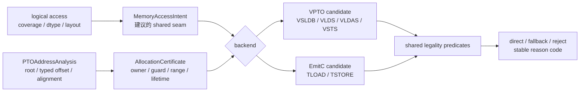
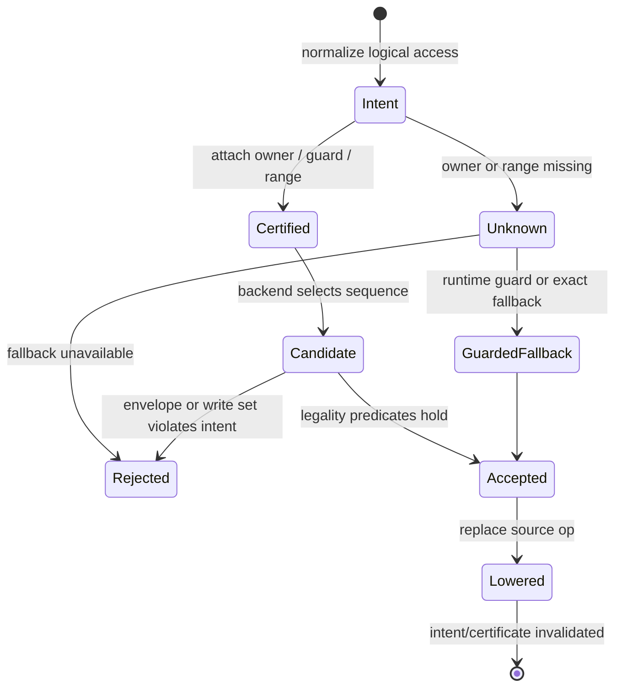

> 本文基于 PTOAS 默认分支提交 [`64a183e0`](https://github.com/hw-native-sys/PTOAS/commit/64a183e02addaed0f5c35d684709dd35c1b2715f)。该提交主要是 const、命名和 `SmallVector` 常量等清理，本文涉及的 VMI/EmitC 主路径没有语义变化。直接相关的 VMI 物理访存工作来自已合入的 [PR #1260](https://github.com/hw-native-sys/PTOAS/pull/1260)。文中“代码事实”“测试事实”和“建议设计”分别标注，后者不是主干已有能力。

## 本篇在 PTO 课程路线中的位置

前两章已经把“地址”和“可访问内存”拆开：`PTOAddressAnalysis` 能求 root、typed offset、difference 与 alignment；`AllocationCertificate` 还必须回答 owner、extent、dynamic range、no-wrap 和 lifetime。今天继续向下游走一步：同一份语义访问进入 VPTO 与 EmitC 时，哪些事实必须共用，哪些物理选择必须允许不同？

课程位置是：

`typed address → allocation provenance → shared MemoryAccessIntent → backend candidate → exact/fallback/reject`

本章只处理这个 shared seam，不扩展到新的 ISA 指令，也不把尚未实现的接口写成当前能力。

## 前置知识

我们沿用四条不变量：

1. load 的物理读集合必须落入可读 guard：`Pread ⊆ readableGuard`；
2. consumer 观察到的 lane 必须来自语义数据或已定义 fill：`consumerRead ⊆ semantic ∪ definedFill`；
3. store 不得污染 inactive byte：`Pwrite = semanticWrite`；
4. owner 必须活到该 backend candidate 真正完成。

这里的 `semantic` 是程序要求的元素集合，`Pread/Pwrite` 是后端最终指令触碰的字节集合。二者相等是特例，不是默认前提。

## 今日两个核心问题

1. 当前 VPTO 与 EmitC 是否已经从同一个 logical memory intent 选择不同实现？
2. 若要建立 parity，应该共享最终物理 plan，还是只共享语义 intent 与 allocation 证书？

先给结论：**当前不是两种后端实现同一 VMI access，而是两条处于不同抽象层的路径。最小可维护设计应共享 `MemoryAccessIntent + AllocationCertificate`，让后端分别产生 candidate，再用同一组安全谓词验证；不应强迫两端生成相同指令。**

## PTO 全栈中的位置



图中 `MemoryAccessIntent` 和 `AllocationCertificate` 的连接是**建议设计**。当前主干只有 VPTO 分支内部的瞬时 `VMIMemoryAccessPlan`；EmitC 没有消费它。

## 概念和精确语义

### `MemoryAccessIntent` 冻结“必须做什么”

建议的 backend-neutral intent 至少包含：

- `direction`：read 或 write；
- typed base、element offset 和 dynamic range；
- `semanticCoverage`：Dense、Prefix 或 Predicate；
- value 的 shape、dtype、layout；
- inactive lane 的语义，以及可选 `paddingValue`；
- 对应的 allocation owner、guard 与 lifetime generation。

它不能包含 `VSLDB`、`TLOAD` 之类的后端指令名，否则“shared”只是把某个后端的决定提前固化。

### `BackendAccessCandidate` 回答“准备怎么做”

每个 candidate 应报告：instruction sequence、required alignment、physical read envelope 或 exact write set、register transfer、scratch/workspace、同步要求、fallback kind 与估价信息。共享 verifier 只检查 candidate 是否兑现 intent，不规定它必须长成什么样。

### parity 不是逐指令相同

真正需要一致的是：相同 intent 与 certificate 得到相同的语义结果和 proof class；后端可以因指令能力不同，一个走 direct、另一个走 exact fallback。若某端缺少 fallback，它可以 fail closed，但 diagnostic 必须能说明是 `fallback_unavailable`，不能伪装成“输入非法”。

### 建议接口的输入、输出与所有权

为了避免“共享 plan”最后又退化为口头约定，可以把接口写成下面四层。这里是**基于当前代码的建议**，不是已有 C++ API：

| 层 | 输入 | 输出 | owner / 有效期 | 失败方式 |
| --- | --- | --- | --- | --- |
| intent builder | logical op、shape/dtype/layout、coverage | `MemoryAccessIntent` | source op；到 op 被替换为止 | 语义或 coverage 无法规范化 |
| certificate builder | typed address、ABI/allocator provenance、range | `AllocationCertificate` | analysis manager；IR mutation 后失效 | `Disproven` 或带 reason 的 `Unknown` |
| backend planner | intent、certificate、target capability | 一个或多个 candidate | backend lowering；不得改写 intent | instruction/alignment/fallback 不可用 |
| shared verifier | intent、certificate、candidate | structured verdict | 一次 lowering decision | physical envelope、exact write 或 lifetime 不成立 |

`MemoryAccessIntent` 的 value 仍是 logical vector/Tile value；shape 与 dtype 来自 type，地址 offset 以 element width 解释。`AllocationCertificate` 不拥有 device memory，只引用 owner identity 与半开 guard interval。backend candidate 可以拥有临时 scratch proposal，但必须把大小、address space 和 lifetime 一并报给 verifier，不能在 codegen 内暗中扩大物理访问。

并发假设也必须写清：证明只对指定 owner generation 和 control-flow path 有效；异步 load/store 的 post-condition 不是“op 已经返回”，而是相关 event/stream completion 后 candidate 的读写效果才完成。若后续 pass 改了 address、predicate、layout 或 schedule，旧 verdict 不能自动继承。

## 真实文件、类型、API 或指令逐段解读

### 1. pipeline 先分叉，再谈 parity

在 [`ptoas_pipeline.cpp`](https://github.com/hw-native-sys/PTOAS/blob/64a183e02addaed0f5c35d684709dd35c1b2715f/tools/ptoas/ptoas_pipeline.cpp) 中，`populateMainLoweringPasses` 是两后端共享的主干；之后 VPTO 进入 `runVPTOBackendPipeline`，其 kernel pipeline 明确追加 `appendVMISemanticPipeline`。这里依次做 VMI normalize、validate、layout assignment、`VMIToVPTO` 和 stateful stream fusion。

EmitC 则进入 `runEmitCPreparationPipeline`，把已经存在的 PTO Tile/native ops 转成 EmitC 表达式。**代码事实：EmitC 不运行 `VMIToVPTO`。** 所以现在不能拿一段 logical VMI load 同时跑两个 backend，再比较它们的 candidate。

### 2. 当前 plan 是 VPTO pass 内部对象

[`VMIToVPTOConversionInternals.cpp`](https://github.com/hw-native-sys/PTOAS/blob/64a183e02addaed0f5c35d684709dd35c1b2715f/lib/PTO/Transforms/VMIToVPTO/VMIToVPTOConversionInternals.cpp) 定义了 `VMIMemoryAccessPlan`。它已经有不错的雏形：

```text
direction
segments[address, coverage, transfer, readSafety]
valueType
paddingValue
layoutSupport
```

但它只在 `VMIToVPTO` 转换期存在；`paddingValue` 也尚未 materialize。它既不是跨 pipeline 的 IR contract，也不能自动约束 EmitC。

### 3. VPTO 如何选 candidate

[`VMIToVPTOMemoryInternals.cpp`](https://github.com/hw-native-sys/PTOAS/blob/64a183e02addaed0f5c35d684709dd35c1b2715f/lib/PTO/Transforms/VMIToVPTO/VMIToVPTOMemoryInternals.cpp) 中，read plan 会计算 full-read safety proof，并要求 identity memref layout；`load-safety=error` 在物理读不可证明时拒绝，`warn` 与默认 `policy` 可以放行并产生 warning/remark。

这段实现也明确列出当前缺口：scratch exact fallback 未实现，guarded control-flow fallback 未实现，而 `pto.vlds` 没有 mask operand，不能假装成真正 non-faulting masked load。

随后 [`VMIToVPTOPatternInternals1.cpp`](https://github.com/hw-native-sys/PTOAS/blob/64a183e02addaed0f5c35d684709dd35c1b2715f/lib/PTO/Transforms/VMIToVPTO/VMIToVPTOPatternInternals1.cpp) 可为连续对齐 block 选择 `VsldbOp`，也可走 `vlds/vldas/vldus`；[`VMIToVPTOPatternInternals2.cpp`](https://github.com/hw-native-sys/PTOAS/blob/64a183e02addaed0f5c35d684709dd35c1b2715f/lib/PTO/Transforms/VMIToVPTO/VMIToVPTOPatternInternals2.cpp) 的 store 则为 tail 构造 contiguous mask，确保只写 active lanes。

### 4. EmitC 接到的是 Tile operation

[`TLoad.cpp`](https://github.com/hw-native-sys/PTOAS/blob/64a183e02addaed0f5c35d684709dd35c1b2715f/lib/PTO/Transforms/PTOToEmitC/LoadStore/TLoad.cpp) 把 `pto.tload` 转成 `TLOAD(...)`，包括可选 L2 bypass template 参数；[`TStore.cpp`](https://github.com/hw-native-sys/PTOAS/blob/64a183e02addaed0f5c35d684709dd35c1b2715f/lib/PTO/Transforms/PTOToEmitC/LoadStore/TStore.cpp) 依据 phase、atomic、relu 与 pre-quant 选择 `TSTORE` 重载。

两者都没有接收 VMI 的 `VMIMemorySafeReadProof` 或 allocation guard。这里的安全性依赖已经成形的 Tile/GlobalTensor descriptor 和 PTO ISA contract。**因此当前只能证明“EmitC 正确保留并发出 Tile op”，不能证明它与 VMI→VPTO 对同一 logical access 作出了等价的 physical-envelope 决策。**

## 对象与证明状态生命周期



这是**建议生命周期**。创建者是 pre-backend shared pass；certificate 由 address facts、ABI/allocator provenance 与 range analysis共同构成；backend candidate 只借用这些事实。源 op 被替换、owner generation 变化或相关 analysis 被 mutation 后，旧 certificate 必须失效，不能继续缓存使用。

一个容易漏掉的细节是 `Unknown` 不是错误码的垃圾桶。它至少应携带“缺哪份证据”：owner 不可识别、extent 缺失、offset range 不可界定、可能 wrap、alignment 不可证、lifetime completion 不可定位。只有这样 backend 才能判断 runtime guard 是否能把 unknown 收紧为 proven，还是只能选择不依赖该事实的 exact candidate。若把所有 unknown 都折成布尔 `false`，编译器会同时失去优化机会和稳定诊断；若折成 `true`，则直接破坏 fail-closed。

建议的 verdict 不是单一 success/failure，而是：

```text
AcceptedDirect(candidate, proof)
AcceptedFallback(candidate, guard_or_exact_proof)
RejectedDisproven(reason_code, counterexample_range)
RejectedUnknown(reason_code, missing_fact)
```

其中 counterexample range 很重要。例如 `guard_too_small` 应能报告 candidate 需要 `[4,420)`、certificate 只证明 `[0,416)`，而不是只输出“load unsafe”。

## 端到端调用链

当前真实 VPTO 链是：

`ptoas main → populateMainLoweringPasses → runVPTOBackendPipeline → appendVMISemanticPipeline → VMIToVPTO → buildRead/WriteAccessPlan → OneToN load/store pattern → VPTO ops`

当前真实 EmitC 链是：

`ptoas main → populateMainLoweringPasses → runEmitCPreparationPipeline → PTOToEmitC → TLoad/TStore conversion → emitc.call_opaque TLOAD/TSTORE → C++`

建议的 seam 应位于后端分叉之前：两条链读取同一 semantic intent/certificate，各自返回 candidate 与结构化 verdict。它不复制 `PTOAddressAnalysis`，只组合该 analysis 提供的地址事实与独立的 owner/extent provenance。

最小决策伪代码可以写成：

```text
intent = normalize(op)
cert = certify(intent.address, ownerProvenance, rangeAnalysis)

for candidate in backend.enumerate(intent, cert):
    if candidate.read:
        require candidate.pread within cert.readable_guard
        require candidate.consumer_read within intent.semantic union defined_fill
    else:
        require candidate.pwrite equals intent.semantic_write
    require cert.owner_alive_until(candidate.completion)
    if all hold: accept(candidate)

try guarded_or_exact_fallback()
otherwise reject_with_stable_reason()
```

枚举顺序可以由后端 cost model 决定，但 correctness predicate 不参与“打分”：不合法 candidate 直接退出候选集，不能因为预计更快而降级为 warning。当前 `load-safety=policy/warn` 是显式兼容策略，文章建议保留其证据等级，而不是把它包装成 verifier success。

## 具体 shape、Tile 和状态演算

设 logical load 为 `vreg<100xf32>`：

- 语义元素：100；
- 语义字节：`100 × 4 = 400 B`；
- 物理 carrier：`2 × vreg<64xf32> = 512 B`；
- 32 B block candidate：`ceil(400/32) = 13` blocks，即 `[0,416)`；
- full-carrier candidate：`[0,512)`。

现在比较三个 owner guard：

| readable guard | 13-block candidate | full-carrier candidate | strict 结论 |
| --- | --- | --- | --- |
| 512 B | `416 ≤ 512` | `512 ≤ 512` | 两者都可选 |
| 416 B | `416 ≤ 416` | `512 > 416` | 只能选 bounded block |
| 400 B | `416 > 400` | `512 > 400` | 两者都不可证明；需 exact fallback 或拒绝 |

若 base 再偏移 4 B，13 blocks 的 candidate envelope 变成 `[4,420)`；“allocation 总长 416 B”就不再够用。alignment 也可能使 `VsldbOp` candidate 不成立。由此可见，`semanticBytes=400`、carrier=512 和 guard=416 是三类不同事实。

再把状态逐步展开。起点是 `base=A, offset=0, owner=A, guard=[0,416), range={0}`。intent 的 semantic coverage 为前 100 个 `f32`，inactive 28 lanes 不可观察且没有 defined fill。VPTO planner 若生成 13-block candidate，其 `Pread=[0,416)`，readability 成立；physical 多读的 16 B 仍不得流入 consumer 的前 100 lanes。full-carrier candidate 需要 `[0,512)`，因此 strict verifier 拒绝。若同一 op 位于 loop 中且 offset range 变成 `{0,4}` B，candidate union 是 `[0,420)`，原 certificate 立即从 proven 变为 disproven。

注意这不是简单的“最大 offset 加长度”模板：存在 predicate、非连续 lane map 或多个 owner candidate 时，必须对每个可达 owner/path 证明 envelope；phi 合流不能把 A 的前半和 B 的后半拼成虚构的 416 B 连续 guard。

对 store，语义写集合仍是 400 B。VPTO 当前可通过 tail mask 精确写 active lanes。EmitC 的 `TSTORE` 是否读取或写入对齐 padding，必须由 Tile/ISA candidate 明确报告；本文不从 opaque call 名推断其真实 DMA envelope。共享 verifier 只接受 `Pwrite=400 B semantic active set`，或能证明等价的 predicate 描述。

### 边界条件矩阵

把同一个例子再推到容易误判的边界：

| 条件 | certificate 状态 | VPTO 可做什么 | EmitC 当前能证明什么 |
| --- | --- | --- | --- |
| owner=单一 A，guard=512 B，offset=0 | `Proven` | bounded/full candidate 均可能合法 | Tile op 能生成；尚无 shared-envelope proof |
| owner=单一 A，guard=416 B，offset=0 | `Proven` for 416 B | 13-block candidate 合法，full carrier 不合法 | 无法由 opaque `TLOAD` 名判断 envelope |
| owner=单一 A，guard=400 B | `Disproven` for现有 416/512 B candidate | exact fallback 或 strict reject | 需要 candidate adapter；否则 parity unknown |
| owner=A/B phi，二者 guard 不同 | 每个 path 分别证明 | 不得合并成更大虚构 guard | 同样必须保留 owner set |
| loop offset range unknown | `Unknown(offset_range)` | runtime guard、exact fallback 或拒绝 | 不能因 Tile shape 静态而默认安全 |
| owner 已知但 async completion 不知 | `Unknown(lifetime)` | 不得提前复用 backing | C++ 语句结束不等于设备完成 |

这个矩阵区分了三个经常混淆的结果。`Disproven` 表示已有反例，例如需要 416 B 而 guard 只有 400 B；`Unknown` 表示缺证据，例如 loop 上界不可求；`unsupported` 则是 backend 没有能兑现合法 intent 的指令或 fallback。只有前两者属于 proof，第三者属于实现能力。将它们都压成“verification failed”，会让用户既不知道该扩大 allocation、补 range annotation，还是换 backend。

此外，shape/dtype/device 也有各自的失败方式。element width 改变 byte envelope；layout 改变 lane-address map；device target 改变可用 block、mask 和 stream 指令；dynamic valid 改变 semantic coverage。shared intent 必须在这些字段变化后重新构造，不能仅凭“还是 100 个元素”复用旧 verdict。

## 证据账：事实、测试与推断

- **代码事实**：VPTO backend 执行 VMI semantic pipeline；EmitC backend 从 Tile/native PTO op 生成 `TLOAD/TSTORE`。`VMIMemoryAccessPlan` 是 `VMIToVPTO` 内部对象。
- **代码事实**：VPTO read 的 strict/warn/policy 会影响不可证明物理读的处理；store lowering具有 contiguous tail mask 路径。当前 fallback 缺口由实现中的 diagnostic 明示。
- **测试事实**：现有 VMI lit 验证 VPTO lowering 与 policy，EmitC lit 验证 Tile op 的 C++ 形状和 overload；没有 same-intent、same-certificate 的双 backend golden。
- **PR/实验事实**：PR #1260 的 CA 数据比较 VPTO 侧若干 store 序列，说明 candidate 选择确有性能差异；它没有测 EmitC，也没有证明 shared seam。
- **基于证据的推断**：共享 intent/certificate、分离 candidate，能以最少重复同时保持安全一致性和后端优化自由度。其 IR 形态、pass 落点与性能收益仍需实现和 benchmark 验证。
- **未知**：公开代码不足以从 `emitc.call_opaque TLOAD/TSTORE` 反推出所有 target/dtype/layout 的真实物理字节 envelope；本文保留为 unknown。

## 为什么这样设计及替代方案

### 选择：shared intent/certificate + backend-specific candidate

它保留一份语义与 ownership 真相，同时允许 VPTO 利用 block/stream 指令、EmitC 利用 Tile ISA。编译期开销只是 plan/proof 构造，没有运行时成本；若证明成功，还能避免不必要 guard 或 scalar fallback。

### 替代 1：两后端各复制一套安全检查

短期改动小，但 `Unknown`、padding fill、owner lifetime 与 diagnostic 很快漂移。当前两条路径已经处于不同抽象层，继续复制只会让相同输入得到难以解释的不同结论。

### 替代 2：共享最终 physical plan

这会把某一后端的寄存器宽度、block 粒度和 instruction availability 提前写进公共层，限制另一端优化。它把 parity 错解成“生成相同指令”。

### 替代 3：所有路径先降到 VPTO，再从 VPTO 生成 EmitC

理论上统一，但会重写现有 Tile→EmitC 主链，且可能丢失高层 `TLOAD/TSTORE` 的模板与 target-specific contract。没有测得的维护或性能收益前，这不是最小方案。

## 访存、计算、流水、并行和硬件约束

- bounded 13-block read 比 512 B full-carrier 少触碰 96 B，但是否更快取决于真实指令数、alignment 与设备流水；源码不能替代测量。
- exact fallback 可能增加 gather/scalar 指令、predicate register、scratch 和控制流，降低 graphability；它换取的是严格 memory safety。
- shared verifier 不能把 `load-safety=policy` 当成 proof。policy 是“允许继续”的选择，不会凭空扩大 owner guard。
- store 的 exactness 优先于吞吐：inactive byte 可能属于另一个对象，越写无法用后续 consumer mask 修复。
- async candidate 的 lifetime 要覆盖设备完成点，而不只是 lowering op 的 SSA last use。

graphability 也影响 fallback 选择。runtime `if (offset+envelope<=guard)` 可以保住 fast path，却可能引入控制流、额外 specialization 或 graph capture 约束；scratch-copy fallback 保持主计算 shape 稳定，但增加一次读写和本地容量占用；scalar/gather fallback 最精确，却可能拉长依赖链。shared intent 不替后端决定哪一种更快，只要求所有分支对同一 semantic coverage 负责，并把 workspace、同步和 completion point 纳入证书。

维护成本方面，真正需要统一的是 reason taxonomy 和 proof object，不是两端所有优化。比如 VPTO 可以报 `alignment_unknown → AcceptedFallback(gather)`，EmitC 可能报 `alignment_unknown → RejectedUnknown(fallback_unavailable)`；这是能力差异，不是 parity failure。若一端把相同 owner/guard 认作 `Proven`，另一端却在没有新增物理需求时认作 `Disproven`，才说明 shared seam 或 adapter 漂移。

## 测试证据与未覆盖风险

**测试事实：**

- [`vmi_ptoas_cli_pipeline.pto`](https://github.com/hw-native-sys/PTOAS/blob/64a183e02addaed0f5c35d684709dd35c1b2715f/test/lit/vmi_new/vmi_ptoas_cli_pipeline.pto) 验证 VPTO backend 会运行 VMI lowering；它没有 EmitC 对照。
- [`vmi_to_vpto_expand_load_all_active.pto`](https://github.com/hw-native-sys/PTOAS/blob/64a183e02addaed0f5c35d684709dd35c1b2715f/test/lit/vmi_new/vmi_to_vpto_expand_load_all_active.pto) 覆盖 all-active load 在默认与 strict policy 下的生成。
- [`vmi_to_vpto_load_safe_tail_memref_negative_offset.pto`](https://github.com/hw-native-sys/PTOAS/blob/64a183e02addaed0f5c35d684709dd35c1b2715f/test/lit/vmi_new/vmi_to_vpto_load_safe_tail_memref_negative_offset.pto) 验证 negative offset 在 `error/warn/policy` 三种模式下的拒绝或诊断。
- [`load_store_tile_native.pto`](https://github.com/hw-native-sys/PTOAS/blob/64a183e02addaed0f5c35d684709dd35c1b2715f/test/lit/pto/load_store_tile_native.pto) 对 `16×16xf32` 检查 native `pto.tload/tstore` 保留，以及 EmitC 输出含 `TLOAD/TSTORE`。
- [`tload_cache_policy.pto`](https://github.com/hw-native-sys/PTOAS/blob/64a183e02addaed0f5c35d684709dd35c1b2715f/test/lit/pto/tload_cache_policy.pto) 验证 A3/A5 的 L2 bypass 属性正确进入 `TLOAD<...>`。
- [`tstore_forms_emitc.pto`](https://github.com/hw-native-sys/PTOAS/blob/64a183e02addaed0f5c35d684709dd35c1b2715f/test/lit/pto/tstore_forms_emitc.pto) 覆盖 phase、atomic、relu 和 pre-quant 的 overload 选择。

这些测试分别证明两条链“各自会生成预期形状”，**没有**证明同一 `MemoryAccessIntent` 的 owner/guard、physical envelope、fallback 与 reason code 在两后端一致。

仍需四层新证据：

1. seam IR golden：两后端分叉前看到同一 intent/certificate；
2. candidate matrix：400/416/512 B guard、offset 0/4、known/unknown alignment；
3. diagnostic golden：稳定 reason code 如 `owner_unknown`、`guard_too_small`、`alignment_unknown`、`fallback_unavailable`；
4. device E2E：guard page、destination canary、padding poison 与 fallback 性能。

PR #1260 的 CA 记录给出了 stateful store 相对 1PT 的隔离性能证据，但它属于 VPTO candidate 比较，不能外推成 EmitC parity。

## 与前后章节的连接

课程 35 提供 typed address 与 physical envelope 的分层；课程 36 补 owner/range/no-wrap。本文把它们组合成 backend seam：证明共享，指令选择分离。下一章将把 `Proven / Disproven / Unknown` 和结构化 reason code 变成可执行的 cross-backend golden，而不是继续停留在接口草图。

## 本篇结论、知识债、三个理解检查问题和下一章

### 结论

1. 当前 VPTO 与 EmitC 不是从同一 VMI logical access 分叉；前者有 pass-local plan/proof，后者消费已经成形的 Tile operation。
2. 跨后端应共享 semantic intent 与 allocation certificate，不应共享最终物理指令序列。
3. parity 的判据是相同语义、proof class 与稳定 diagnostic；direct/fallback 的具体实现可以不同。

### 知识债

shared intent IR/analysis result、ABI owner/extent 导入、certificate invalidation、EmitC candidate envelope、guarded/exact fallback、stable reason code、VPTO/EmitC golden、A5 guard-page/canary/poison 与性能矩阵均未落地。

### 理解检查

1. 400 B 语义 load 为什么不能证明 416 B block candidate 安全？
2. 为什么要求 VPTO 与 EmitC 生成相同指令，反而会破坏正确的 backend abstraction？
3. `load-safety=policy` 放行后，为什么仍不能把结果标为 `Proven`？

### 下一章

**同一个 Intent，三类结论——把 `Proven / Disproven / Unknown`、stable reason code、direct/fallback/reject 做成 VPTO/EmitC cross-backend golden，并定义 padding poison 与 canary E2E。**

## 课程账本增量

- 新确认：当前 VMI semantic pipeline 仅进入 VPTO；EmitC 的输入已是 Tile-level `pto.tload/tstore`，现状没有 same-intent parity。
- 新边界：shared seam 冻结 semantic coverage 与 allocation proof；backend candidate 独立报告 physical envelope、instruction sequence、fallback 和 cost。
- 新验证式：read 检查 `Pread⊆guard` 与 consumer fill；write 检查 exact active set；两者都受 owner lifetime 约束。
- 新测试缺口：same-intent seam golden、reason-code matrix、EmitC envelope、guard page/canary/poison 和真实 fallback 性能。
