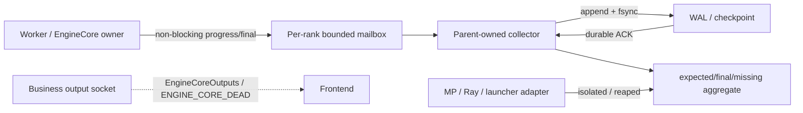
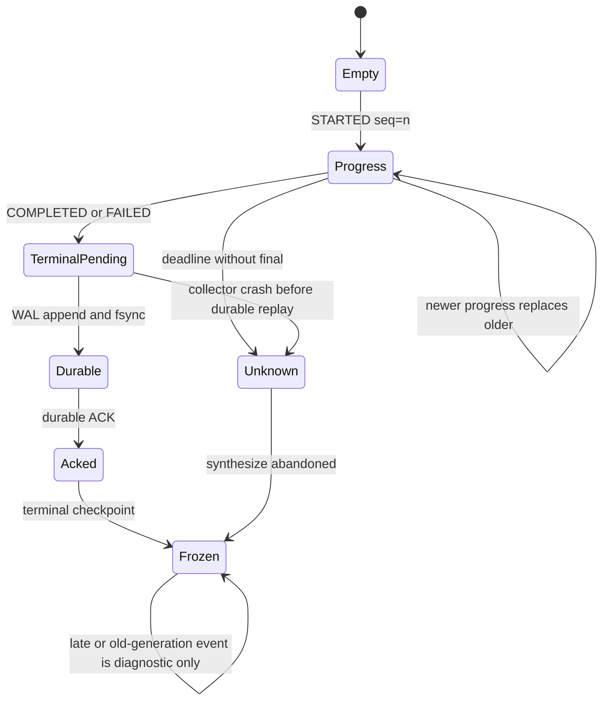

> 本文代码基线为 vLLM [`1fd119de`](https://github.com/vllm-project/vllm/commit/1fd119def5a841ada882fa3f33919b96783f9d50)。该最新提交修改 chunked embedding padding，与本文 shutdown 路径无直接关系。下文把“当前代码/测试事实”和“基于证据的设计推断”分开书写。

## 本篇在课程路线中的位置

上一章把 MP process、Ray actor 与 external-launcher rank 放进同一个证据模型：`cleanup completed` 与 `process isolated/reaped` 是两条正交轴。现在还差一条真实运输线：Worker 已经记录 `device_sync.started`，怎样保证它不会因业务队列拥塞、队列先销毁、child 被 KILL，或 collector 自身崩溃而丢失？

本章只回答这个边界：**ShutdownEvent 应走哪条线，何时才算 durable**。它位于 `Worker/EngineCore cleanup → parent supervisor → terminal aggregate` 之间，是资源事实变成进程外证据的桥。

## 前置知识回顾

- `started` 只证明某 owner 开始清理；没有 `completed` 时必须保留 `completion_unknown`。
- aggregate success 需要覆盖 teardown 前冻结的 `expected ranks`，不能用 `alive_count == 0` 替代。
- 同一事件需先比较 `generation`，再比较该 generation 内单调的 `seq`。
- KILL、actor death 和 exitcode 是 containment evidence，不会补写 cleanup evidence。
- 上一章已定义 late ack gate：只有 terminal checkpoint 前 durable-accepted 的事件才能改变最终结果。

## 本篇要回答的核心问题

1. 为什么现有 Engine output socket 和 Multiproc response MQ 都不能承载 post-cleanup final？
2. bounded sideband 在 progress 洪峰、terminal 事件和 deadline 之间应怎样取舍？
3. Python 与 Rust 如何共享可演进 wire schema，collector crash 后怎样恢复而不伪造成功？

## 组件在全局架构中的位置



虚线是当前业务面；实线是本文推导的控制面。关键不是“再加一个 queue”，而是让 sideband 的 owner 比被观察进程活得更久，并让 terminal evidence 的 durability 不依赖即将被强杀的 child。

## 完整调用链

当前公开入口到清理的路径是：

```text
AsyncLLM.shutdown(timeout)
→ MPClient.shutdown(timeout)
→ CoreEngineProcManager.shutdown(timeout)
→ generic shutdown(processes, timeout)
→ SIGTERM / shared parent deadline / KILL

child:
EngineCoreProc.signal_handler
→ run_busy_loop exits
→ run_engine_core finally
→ EngineCore.shutdown
→ Executor.shutdown / Scheduler.shutdown / cleanup_dist_env_and_memory
```

代码事实一：[`run_engine_core`](https://github.com/vllm-project/vllm/blob/1fd119def5a841ada882fa3f33919b96783f9d50/vllm/v1/engine/core.py) 在 fatal `except` 中先调用 `_send_engine_dead()`，然后才进入 `finally` 执行 `EngineCore.shutdown()`。所以 raw sentinel 只证明 fatal 已被观察，不能证明 cleanup 完成。

代码事实二：[`process_output_sockets`](https://github.com/vllm-project/vllm/blob/1fd119def5a841ada882fa3f33919b96783f9d50/vllm/v1/engine/core.py) 用同一组 PUSH socket 发送普通 `EngineCoreOutputs` 与单帧 `ENGINE_CORE_DEAD`；客户端收到 sentinel 后立即把 engine 标记为 dead，并结束正常 decode 路径。clean shutdown 则没有结构化 final。

代码事实三：[`WorkerProc.shutdown`](https://github.com/vllm-project/vllm/blob/1fd119def5a841ada882fa3f33919b96783f9d50/vllm/v1/executor/multiproc_executor.py) 先关闭 `rpc_broadcast_mq` 和 `worker_response_mq`，再调用真实 `self.worker.shutdown()`。因此 response MQ 从生命周期上就无法携带 post-Worker-cleanup final。

建议链路是在 owner 每个破坏性动作前后写独立 slot：

```text
owner writes STARTED(seq=n)
→ collector accepts latest progress
→ owner performs cleanup
→ owner writes COMPLETED/FAILED(seq=n+1) to terminal slot
→ collector append + fsync
→ collector emits durable ACK
→ parent may count this final in aggregate
→ process exit / adapter confirms containment
```

## 关键类型、字段和状态生命周期

当前代码没有 `ShutdownEvent`；下面是**设计推断**，不是已合入 API。最小 wire tuple 可以是：

```text
[version:u8, generation:u64, global_rank:u32, owner:u16,
 seq:u64, phase:u8, flags:u16, detail_code:u16, elapsed_ns:u64]
```

- `generation`：隔离旧 Engine 的迟到帧；由 parent 创建并冻结。
- `global_rank`：跨 MP/Ray/torchrun 的身份；不能用 external launcher 各进程内都可能为 0 的 `rpc_rank`。
- `owner`：如 `MODEL_RUNNER_DEVICE`、`WORKER`、`EXECUTOR`，防止一个 owner 的 final 替代另一个。
- `seq`：只在同一 `(generation, global_rank, owner)` 内单调。
- `phase`：`STARTED/COMPLETED/FAILED`；containment 仍由 backend adapter 独立记录。
- `detail_code`：有界 numeric code，避免把任意 Python exception、Tensor 或敏感请求内容塞进协议。
- `elapsed_ns`：本地间隔；不跨进程比较裸 `time.monotonic()` 绝对值。

每个 key 只保留一个 latest progress slot 与一个不可被 progress 覆盖的 terminal slot，空间为 `O(ranks × owners)`。wakeup/doorbell 可以丢，parent 必须周期性扫描 slot；事件本身不能只存在于 doorbell 中。

建议接口契约如下。`publish_progress(event)` 的输入必须是单个 owner 的不可变快照；前置条件是 identity 已冻结且 `seq` 大于本 producer 上次成功发布的值；后置条件只承诺“新状态进入 slot 或被更新状态支配”，不承诺落盘。函数必须 non-blocking，返回 `stored/coalesced/rejected_stale`，即使 collector 已死也不能卡住 device cleanup。

`publish_terminal(event)` 只接受 `COMPLETED/FAILED`，同一 key 第一次写入成功后不可由 progress 覆盖。它可以返回 `slot_written`，但这仍不是 durable success。producer 若有剩余预算，可以等待 `await_durable_ack(key, seq, remaining)`；预算到期就继续退出，并让 parent 把证据停在 L0/L1。这里的 `remaining` 是 parent 发下来的相对 duration，而不是另一进程的绝对 monotonic timestamp。

`collector.accept(event)` 先验证 version、generation、rank/owner 是否属于 frozen expected-set，再比较 seq。接受后更新内存 latest view；对 terminal 则编码 bounded record、append、`fdatasync/fsync`，最后发布 ACK。它的输出不是 Python exception，而是 `accepted_duplicate/stale_generation/invalid_identity/durable_failed` 等有界状态，便于 Rust、Python 和监控统一解释。

对象所有权也必须明确：mailbox buffer 与 wakeup fd 由 parent 创建，fork/spawn 后 child 只持 producer handle；WAL fd、expected-set 和 terminal aggregate 只归 collector；backend adapter 只写 containment 轴。child 退出后 producer handle 失效，但 parent 仍可读最后 slot；新 generation 启动前必须更换或清零 slot 并 poison 旧 generation，不能仅把 seq 归零后复用。



## 逐函数源码解读

### `EngineCoreProc._send_engine_dead`

它把固定字节串放入 `output_queue`，并等待 output thread 最多 5 秒。它解决的是“frontend 不要继续等业务输出”，不是“进程外收到了 cleanup census”。把 ShutdownEvent 继续 multiplex 到这里会遇到两个矛盾：sentinel 一到 receiver 就结束；而真正 final 要等 `finally` cleanup 之后才能生成。

### `MPClient.BackgroundResources.validate_alive`

[`validate_alive`](https://github.com/vllm-project/vllm/blob/1fd119def5a841ada882fa3f33919b96783f9d50/vllm/v1/engine/core_client.py) 看到单帧 sentinel 后设置 sticky `engine_dead=True` 并抛 `EngineDeadError`。Rust [`run_output_loop`](https://github.com/vllm-project/vllm/blob/1fd119def5a841ada882fa3f33919b96783f9d50/rust/src/engine-core-client/src/transport.rs) 也做同样判断。这个协议有清晰的 fail-stop 语义，却没有 version、rank、owner、seq 或 durability level。

### `CoreEngineProcManager.shutdown` 与 generic `shutdown`

[`CoreEngineProcManager.shutdown`](https://github.com/vllm-project/vllm/blob/1fd119def5a841ada882fa3f33919b96783f9d50/vllm/v1/engine/utils.py) 调用 [`v1.utils.shutdown`](https://github.com/vllm-project/vllm/blob/1fd119def5a841ada882fa3f33919b96783f9d50/vllm/v1/utils.py)。parent 用一次 monotonic deadline 约束多个 process join，过期后 force kill。它天然适合拥有 collector 和 frozen expected-set；child 只负责非阻塞发布自己实际观察到的 milestone。

### Python/Rust wire 边界

普通输出在 Python 侧由 [`EngineCoreOutputs`](https://github.com/vllm-project/vllm/blob/1fd119def5a841ada882fa3f33919b96783f9d50/vllm/v1/engine/__init__.py) 定义，Rust 侧用 tuple serde 保持顺序兼容。现有 [`python_compat.py`](https://github.com/vllm-project/vllm/blob/1fd119def5a841ada882fa3f33919b96783f9d50/rust/src/engine-core-client/src/tests/python_compat.py) 已提供可复用方式：Python 输出 hex fixture，Rust 解码并比较，再反向编码验证逻辑值。ShutdownEvent 应复用模式，但使用独立 envelope 与版本字段，而非偷偷扩展 raw sentinel。

## 具体示例与 shape/状态演算

设 TP=2，`generation=73`，只观察 `owner=MODEL_RUNNER_DEVICE`。每 rank 的 sideband 容量是 `1 progress + 1 terminal`：

1. rank 0 在循环中产生 `seq=1..1000` 的 progress。mailbox 只保留 `seq=1000`，内存仍为常数；旧 progress 可丢，因为其信息被更新状态支配。
2. rank 0 写 `COMPLETED, seq=1001` 到 terminal slot。collector 写 WAL、`fsync` 后才返回 durable ACK；该 slot 不能被后续 progress 覆盖。
3. rank 1 只留下 `STARTED, seq=7`，随后永久卡在 device synchronize。
4. collector 在 ACK rank 0 后崩溃。重启扫描 WAL，校验 record length/CRC，恢复 rank 0 的最高 durable seq；rank 0 重试 `seq=1001` 被幂等去重。
5. parent deadline 到达，rank 1 被 KILL。aggregate 为：rank 0 `completed_observed`；rank 1 `abandoned_by_deadline/completion_unknown`；containment 另记 rank 1 是否真正 reaped。
6. parent 把 terminal aggregate 作为最后一条 durable record 写入并 `fsync`。此后即使 rank 1 的迟到 final 到达，也只能标记 `late_after_terminal`，不能改写结论。

注意：child 写入 terminal slot 只是 L0；collector 内存接受是 L1；WAL durable ACK 才是 L2。collector 若在 L1 与 L2 之间崩溃，恢复后仍必须把该 rank 视作没有 durable final。

## 为什么这样设计及替代方案

| 方案 | 延迟/吞吐 | 内存与背压 | 正确性与维护成本 |
| --- | --- | --- | --- |
| 复用 output socket | 少一个通道 | 与长输出共享 HWM | sentinel 终止 decoder，cleanup 后 final 无可靠发送点 |
| 复用 Worker response MQ | 实现表面简单 | 受 RPC 堵塞影响 | MQ 在真实 Worker cleanup 前关闭，生命周期不成立 |
| unbounded event queue | 暂时不丢 progress | hang 时可无限增长 | OOM 或 teardown 被反压，最坏情况失去上界 |
| child 每帧同步 fsync | 单帧 durability 强 | 磁盘卡顿直接阻塞 cleanup | durable owner 随 child 死亡，且侵入设备清理路径 |
| bounded mailbox + parent WAL | hot path 无开销；shutdown milestone 才落盘 | `O(R×O)`，progress latest-wins | 需要 collector、replay 和 schema golden，但证据/所有权闭合 |

核心不变量是：progress 可以合并，terminal 不可被 progress 驱逐；producer 不得无限等待；deadline 内拿不到 L2 ACK 时必须保留 unknown，而不是为了“完整报告”拖住强杀。

从第一性原理看，shutdown telemetry 的目标不是“尽量多收日志”，而是在硬截止时间内最大化可证明状态：

```text
maximize durable(owner terminal evidence)
subject to teardown producer wait <= bounded slice
           memory <= O(expected ranks × owners)
           containment deadline never renewed by telemetry
```

这也给出一个明确的重访触发器：若未来证明所有 backend 的 child 都能在 deadline 前可靠完成、且 parent 永不崩溃，WAL 可能过重；在当前允许 native hang、SIGKILL 和 supervisor failure 的前提下，单纯内存 queue 又不足。设计复杂度应集中在一个 collector，而不是散落到每个 Worker 的清理分支。

还有一个容易忽略的公平性问题。假设 rank 0 高频报告十个 owner，而 rank 1 只有一个关键 device final，单 FIFO 即使有总容量也可能被 rank 0 占满。按 `(rank, owner)` 分槽相当于静态隔离，确保每个 expected identity 至少拥有一份最新证据；代价是 rank 数和 owner 枚举必须在 teardown 前冻结。动态新增 owner 应当被拒绝或放入预留扩展槽，不能在 shutdown 中途无界扩容。

## 性能、并发、正确性与边界条件

- **推理 hot path：**sideband 仅在 shutdown/fatal path 激活，不应给每个 token 增加序列化或锁竞争。
- **I/O：**只为 owner milestone/final 做 WAL；高频 heartbeat/progress 在内存 slot 合并，避免 `fsync` flood。
- **并发：**collector 按 `(generation, rank, owner, seq)` 幂等接受；旧 generation、倒序 seq、重复 final 都不改变状态。
- **torn write：**WAL record 需包含版本、长度与 CRC；恢复只重放到首个不完整或 CRC 失败 record。
- **terminal 原子性：**expected-set 与最终 aggregate 要么写为最后一条有校验的 WAL record，要么写临时文件、`fsync` 后 atomic rename；仅 Python 对象赋值不算 checkpoint。
- **collector crash：**parent/supervisor 必须能重启 collector并重放；若 supervisor 本身无人监督，则最多宣称进程内 durability，不能宣称抗主机故障。
- **磁盘故障：**ENOSPC/fsync error 应降级为 `durability_failed` 并继续 containment，不得卡死或把 L1 冒充 L2。

还要区分“mailbox 原子写”与“事件语义原子”。若一个 MessagePack record 跨多个 cache line，reader 可能看到 torn bytes。可用双槽 seqlock：writer 先把 odd generation counter 写入 inactive slot，写 payload 与 CRC，再发布 even counter；reader 两次读取 counter 一致且为 even、CRC 正确时才接受。另一种方案是固定上限的 length-prefixed ring，但必须为 terminal 预留独立容量，不能让 progress flood 把 ring 填满。这里所谓 fixed-size 指 mailbox capacity 有界，不表示 MessagePack 编码长度完全相同。

WAL replay 也不能把“最后一条能 decode 的 record”自动视为可信。恢复顺序应是：验证 file header/schema → 顺序检查 length 与 CRC → 只保留每个 identity 的最高合法 seq → 确认 expected-set record 已 durable → 若存在 terminal-checkpoint record，则冻结其 aggregate。若末尾只剩半条 record，截断到最后 valid offset；若中间出现 CRC 错误，则停止并报告 corruption，不能跳过坏段继续拼接后面的“成功”。

## 测试证据与未覆盖风险

**当前测试事实：**

- [`test_multiproc_executor_worker_termination_timeout`](https://github.com/vllm-project/vllm/blob/1fd119def5a841ada882fa3f33919b96783f9d50/tests/v1/executor/test_executor.py) 用 fake clock 验证 grace→TERM 的升级，但不验证 progress、terminal、ACK 或 KILL 后 reap。
- Rust transport 测试验证 raw `ENGINE_CORE_DEAD` 会把 client 永久置为 unhealthy；它证明 fail-stop latch，不证明 cleanup final。
- [`python_compat.py`](https://github.com/vllm-project/vllm/blob/1fd119def5a841ada882fa3f33919b96783f9d50/rust/src/engine-core-client/src/tests/python_compat.py) 与 Rust client test 已证明普通 output 的双向 fixture 方法可行，但没有 ShutdownEvent schema。
- [`ZmqEventPublisher`](https://github.com/vllm-project/vllm/blob/1fd119def5a841ada882fa3f33919b96783f9d50/vllm/distributed/kv_events.py) 展示 bounded queue、HWM 与内存 replay buffer 的现成模式；其 replay 仍是进程内内存，不能作为 collector crash durability 证据。

**建议新增的 golden matrix：**最小字段、完整字段、未知版本、truncated record、非法 enum、重复/乱序 seq、旧 generation、progress flood 不覆盖 terminal、collector 在 append/fsync/ACK/terminal-checkpoint 每一点崩溃。Python 生成 fixture、Rust 解码；Rust 编码后 Python 再解码，双方比较字段语义而非依赖不稳定的 map 顺序。

测试应分四层，避免一个 happy-path E2E 同时承担所有证明：

1. **Wire unit：**Python/Rust 对最小、最大合法字段双向 round-trip；未知尾字段按版本策略拒绝或忽略；超长 detail、负数 rank、溢出 seq 必须 fail closed。
2. **Mailbox concurrency：**两个 producer 高频交错写 progress，collector 不应读到 CRC 正确但字段混合的事件；写入十万次后空间仍为 `O(R×O)`；terminal 写入后 progress 永远不能覆盖。
3. **Durability crash matrix：**在 record header、payload、CRC、sync、ACK、terminal checkpoint 前后逐点 kill collector。重启结果只能是已 durable 的前缀，绝不凭 ACK 意图或残留 slot 推断完成。
4. **Backend E2E：**MP 的 rank 1 卡住而 rank 0 正常；Ray actor 被 kill；torchrun 某 global rank 消失。三者应得到相同 cleanup aggregate，但 containment 字段和 reap owner 不同。

此外要验证 bounded backpressure 真正“不阻塞”：人为暂停 collector、填满所有 progress slot，再让 Worker 进入 shutdown。Worker 应在常数时间完成 publish 尝试并继续清理；parent 最终可以报告 `progress_dropped/coalesced` 和 missing final，却不能让 telemetry 反过来消耗全部强杀预算。

测试断言也不能只比较最终 JSON。每个 case 应同时检查：producer 调用耗时上界、WAL 中 durable record 前缀、重启后的 highest-seq view、terminal aggregate、后台 child 是否已 join/reap，以及旧 generation mailbox 是否已不可写。只有最终状态正确而过程中曾阻塞 cleanup，仍属于失败；只有进程都消失而 WAL 缺 rank final，也只能得到 containment success。真实设备测试还应在 `torch.accelerator.synchronize()` 前后植入可控 hook，把“Python 抛错”和“native 永久不返回”分成两组，因为前者有机会发送 `FAILED`，后者通常只剩 parent 保存的最后 `STARTED`。

安全性方面，`detail_code` 应映射到静态错误表；若必须附加文本，需限制字节数、去除 prompt/token/path 等请求内容并独立标记 truncated。WAL 权限、轮转和保留期同样属于协议的一部分：durable 不等于永久保存，更不等于允许泄露用户数据。

**PR/计划证据：**已合入 [PR #36964](https://github.com/vllm-project/vllm/pull/36964) 用 sentinel 排空并终止输出，解释了当前业务路径；[PR #36666](https://github.com/vllm-project/vllm/pull/36666) 恢复 shutdown timeout/state，但没有建立新 shutdown pipe。讨论中的 [PR #54553](https://github.com/vllm-project/vllm/pull/54553) 提到 wedged worker、SIGKILL 后未 reap 与 queue teardown hang；它是计划/讨论证据，不等同于当前 `main` 的保证。

仍未覆盖真实 CUDA/NCCL native hang、Ray collector 重启、torchrun supervisor WAL、NFS/本地盘 durability 差异、磁盘满，以及 collector 与 parent 同时崩溃。

## 与前后章节的连接

前一章定义了 backend adapter 和统一 evidence lattice，本章给 cleanup evidence 一条独立、有限且可恢复的运输线。下一章将只下钻 durability 的最小可执行协议：WAL frame、CRC/torn write、`fsync`/ACK 顺序、atomic terminal checkpoint，以及 crash-at-every-write fault injection。

## 本篇结论、知识债、三个理解检查问题和下一章

### 结论

1. 当前 output sentinel 位于 cleanup 之前且会终止 decoder；Worker response MQ 又先于真实 cleanup 关闭，两者都不能承载 post-cleanup final。
2. sideband 必须 bounded 且不反压 teardown：progress latest-wins，terminal 独占 slot；没有 durable ACK 就不能把 final 纳入 aggregate。
3. parent-owned WAL 把证据寿命移出被强杀 child；generation/rank/owner/seq 与 Python/Rust golden 则保证重试、演进和跨实现一致性。

### 知识债

实际 `ShutdownEvent`/`ShutdownMailbox`/collector 尚未进入代码；仍缺 MP/Ray/torchrun adapter、WAL format、CRC 与 repair policy、KILL 后 join/reap、磁盘故障降级、Python/Rust fixture、真实 GPU/NCCL hang E2E，以及敏感 detail 的审计规则。

### 三个理解检查问题

1. 为什么 rank 0 的 durable `completed` 与 rank 1 的 process exit 不能合并成整体 cleanup success？
2. 为什么 progress slot 可以 latest-wins，而 terminal slot 不能与 progress 共用同一个可覆盖位置？
3. collector 在“已收到 final、尚未 fsync”时崩溃，恢复后该 final 应处于 L0、L1 还是 L2，aggregate 应怎样处理？

### 下一章

**一条记录何时算 Durable——WAL Frame、CRC/Torn Write、Atomic Terminal Checkpoint 与 Crash-at-every-write 测试。**

## 课程账本增量

- 章节：第 33 章。
- 源码基线：`1fd119def5a841ada882fa3f33919b96783f9d50`。
- 新覆盖：`_send_engine_dead`、`process_output_sockets`、`BackgroundResources.validate_alive`、Rust `run_output_loop`、`WorkerProc.shutdown`、generic process `shutdown`、Python/Rust output compatibility fixture、`ZmqEventPublisher` bounded/replay pattern。
- 新不变量：业务输出与 cleanup evidence 分通道；progress 可合并但 final 不可被覆盖；只有 durable ACK 后的 final 可改变 aggregate；terminal checkpoint 后迟到事件只作诊断；collector replay 以 generation/rank/owner/seq 幂等收敛。
- 新知识债：实际 schema/mailbox/WAL、三 backend adapter、crash/fault matrix、磁盘失败降级与真实 native hang。
