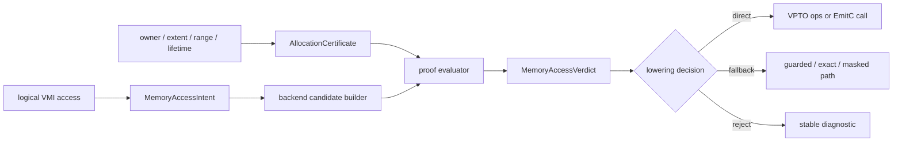
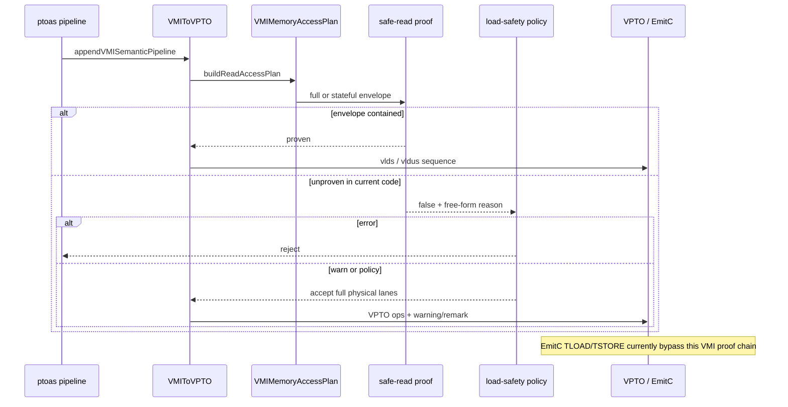

> 源码基线：PTOAS [`fde3b353`](https://github.com/hw-native-sys/PTOAS/commit/fde3b353ecc791861658e5c9a5503f61281553ed)。从上一章的 `64a183e0` 到该提交共有 13 个提交；最新变化主要统一 PTODSL scalar/SIMT 标量接口并在 pipeline 中加入 generic-op lowering，本文涉及的 VMI memory internals、EmitC `TLoad.cpp/TStore.cpp` 与直接测试 blob 未变。因此下面仍以已合入代码为事实基础，但 shared verdict 是设计推导，不冒充现状。

## 本篇在 PTO 课程路线中的位置

上一章把边界切成 `MemoryAccessIntent + AllocationCertificate → BackendAccessCandidate`：intent 说明“逻辑上要访问什么”，certificate 说明“owner 哪段内存可用”，candidate 才说明某个后端“实际会碰哪些字节”。今天只补下一块：candidate 被验证后，怎样得到机器可比较的结论。

位置是：`allocation provenance → shared intent/certificate → backend candidate → proof verdict → direct/fallback/reject`。这不是新增一套地址分析，而是给已有事实一个不含糊的出口。

## 前置知识

`PTOAddressAnalysis` 能给 typed address、offset、range、alignment 等数学事实，却不自动给 allocation owner/extent。VPTO 的 VMI lowering 已有 `VMIMemoryAccessPlan` 和 `VMIMemorySafeReadProof`；EmitC 则从 Tile-level `pto.tload/tstore` 直接生成 `TLOAD/TSTORE`。所以当前两条后端链既没有共同输入，也没有共同 verdict。

还要记住读写不对称：严格读要求 candidate physical read envelope 落在 readable guard 内；写要求 physical write set 精确等于 semantic active set。`load-safety=policy` 可以显式接受未证明的 over-read，但“被 policy 放行”绝不能改名为 `Proven`。

## 今日 1–2 个核心问题

1. `proven=false` 究竟是“已经证明越界”，还是“缺少 extent/range/alignment 事实”？这两者为什么必须分成 `Disproven` 与 `Unknown`？
2. VPTO 与 EmitC 不必生成同样的指令，cross-backend golden 到底应比较什么，才能既守住语义，又允许各自选择 `direct/fallback/reject`？

## PTO 全栈中的位置



`MemoryAccessVerdict` 位于 shared facts 与后端 emission 之间。上游消费者是 VMI/Tile lowering；下游消费者是指令选择、诊断、测试以及未来的 proof invalidation。它不拥有 buffer，也不延长 owner lifetime；任何会改变 address、layout、candidate envelope 或 generation 的 rewrite 都必须使旧 verdict 失效。

## 概念和精确语义

当前 [`VMIToVPTOConversionInternals.cpp`](https://github.com/hw-native-sys/PTOAS/blob/fde3b353ecc791861658e5c9a5503f61281553ed/lib/PTO/Transforms/VMIToVPTO/VMIToVPTOConversionInternals.cpp) 中的核心形态是：

```cpp
struct VMIMemorySafeReadProof {
  bool proven = false;
  std::string reason;
  optional<VMIByteInterval> readableEnvelope;
  optional<VMIByteInterval> candidateReadEnvelope;
};
```

**代码事实**：缺少 constant offset 会得到 `proven=false`；candidate 已知超出 memref 也得到 `proven=false`。自由文本 `reason` 能帮助人读日志，却没有稳定枚举让 pass 或 golden 分辨两类失败。

本文建议的最小结构是：

```cpp
enum class ProofClass { Proven, Disproven, Unknown };
enum class LoweringDecision { Direct, Fallback, Reject };
enum class SafetyMode { Strict, PolicyRelaxed };

struct MemoryAccessVerdict {
  ProofClass proof;
  LoweringDecision decision;
  SafetyMode mode;
  AccessReasonCode reason;
  optional<ByteInterval> guard;
  optional<ByteInterval> physicalEnvelope;
};
```

三类 proof 的定义必须只依赖可复核证据：

- `Proven`：所有 required predicates 成立，例如 `Pread ⊆ guard`、owner generation 有效、write set 精确。
- `Disproven`：已有反例；例如已知 `Pread=[0,512)`，已知 guard `[0,508)`，相差 4 B。
- `Unknown`：既无证明也无反例；例如 raw `!pto.ptr` 没有 allocation extent，或 dynamic offset 尚无有限 range。

`decision` 是后端能力，不等于 proof。`Disproven` 的 full-carrier candidate 可能改走 exact fallback；`Unknown` 在 strict 模式可 reject；在现行 policy 模式甚至可 `Direct + PolicyRelaxed`，但 proof 仍是 `Unknown`，不能洗成安全证明。

稳定 reason code 只描述分类，细节字段保存区间和符号。首批足够小：`NONE`、`READ_ENVELOPE_OUT_OF_GUARD`、`ALLOCATION_EXTENT_UNKNOWN`、`OFFSET_RANGE_UNKNOWN`、`ADDRESS_REMAINDER_UNKNOWN`、`WRITE_FOOTPRINT_INEXACT`、`BACKEND_CANDIDATE_UNAVAILABLE`。测试断言 code 与结构字段，不绑定整句英文。

这个接口的前置条件也要写死。输入 intent 必须已有 direction、element type、semantic coverage 与 layout；certificate 必须注明 owner identity、guard 单位、offset/range 的解释和 generation；candidate 必须给出读 envelope 或写集合，不能只给一个指令名字。输出的后置条件是：`Proven` 必须携带足以重算包含关系的事实，`Disproven` 必须携带一个具体反例，`Unknown` 必须指出缺失事实。若这些条件不满足，verifier 自己应失败，而不是默认归类为安全。

所有权方面，intent、certificate 与 verdict 都只是编译期描述，不取得源 buffer 所有权。并发编译可以为不同 function/backend 独立构造它们，但同一 verdict 不能跨 IR mutation 静默复用。失败方式至少有四类：输入语义非法、证据不足、候选已被反证、后端无可用 candidate；把四类压成一个字符串，会让调用方无法决定是补证明、换 candidate，还是立即拒绝。

## 真实文件、类型、API 或指令逐段解读

### 1. `computeSafeFullReadProof`：两种“不成立”挤进一个 bool

[`computeSafeFullReadProof`](https://github.com/hw-native-sys/PTOAS/blob/fde3b353ecc791861658e5c9a5503f61281553ed/lib/PTO/Transforms/VMIToVPTO/VMIToVPTOConversionInternals.cpp) 先要求 constant offset，再从 static memref 得到 element count、lane map 与 physical footprint，最后检查 readable envelope 是否包含 candidate。没有 constant offset/静态 memref 是证据缺失，应映射为 `Unknown`；已知包含关系失败则是 `Disproven`。现在两者都走 `fail(reason)`。

### 2. stateful proof 与 policy：接受不等于证明

[`computeSafeStatefulReadProof`](https://github.com/hw-native-sys/PTOAS/blob/fde3b353ecc791861658e5c9a5503f61281553ed/lib/PTO/Transforms/VMIToVPTO/VMIToVPTOMemoryInternals.cpp) 还需要 finite offset range、element bytes、32 B address remainder 与 physical footprint。事实齐全后，它比较 stateful sequence 的联合 envelope；超出时已经具备 `Disproven` 的全部数据。

`verifyFullOrSafeReadVRegChunks` 首先尝试 full chunks + 已知 32 B alignment；否则选择 full/stateful proof。证明失败后，`applyLoadSafetyPolicy` 在 `error` 下拒绝，在 `warn/policy` 下仍返回 full physical lanes并发 warning/remark。这里最重要的不变量是：policy 只改变 `decision/mode`，不能改变 `proof`。

普通 partial/tail load 的 generic fallback 目前也没有闭合：源码明确列出 scratch allocation、guarded control flow 与 true masked/non-faulting load 尚未实现。因此 strict `Unknown/Disproven` 常常只能 reject。`expand_load` 的 gather/select 是特定 op 的已有 fallback，不能外推为所有 VMI load 都具备的能力。

### 3. store：精确性已有检查，仍缺结构化结论

`checkStorePhysicalCoverage` 接受 dense lane-stride token、full chunks、contiguous direct 或可物化的 deinterleave；否则以 `LogicalResult + string` 失败。它守的是正确边界——不能把 arbitrary predicate store 偷换成 contiguous-prefix 写——但同样还不能稳定区分 semantic invalid、proof unknown 与 backend unsupported。

读侧和写侧不能共享一个模糊的 `safe` 位。读的 `Disproven` 通常意味着当前 candidate over-read，可以换一个更窄的读法；写的 `WRITE_FOOTPRINT_INEXACT` 则意味着 candidate 会修改语义域外字节，除非换成 masked/exact store，否则不能由 policy 放宽。也就是说 reason code 不只是日志分类，还决定 fallback 搜索空间。

### 4. EmitC：当前没有可比较的 proof 点

[`PTOTLoadToTLOAD`](https://github.com/hw-native-sys/PTOAS/blob/fde3b353ecc791861658e5c9a5503f61281553ed/lib/PTO/Transforms/PTOToEmitC/LoadStore/TLoad.cpp) 处理 `outs(dst)`、GlobalTensor bridge 与可选 `L2Bypass`，随后生成 opaque `TLOAD`。[`PTOTStoreToTSTORE`](https://github.com/hw-native-sys/PTOAS/blob/fde3b353ecc791861658e5c9a5503f61281553ed/lib/PTO/Transforms/PTOToEmitC/LoadStore/TStore.cpp) 根据 phase/atomic/relu/preQuant/fp 选择八类 overload。两者都不读取 VMI plan、allocation certificate 或 physical envelope。

最新 [`ptoas_pipeline.cpp`](https://github.com/hw-native-sys/PTOAS/blob/fde3b353ecc791861658e5c9a5503f61281553ed/tools/ptoas/ptoas_pipeline.cpp) 虽加入 shared generic scalar-op lowering，但 VPTO 仍运行 `appendVMISemanticPipeline`，EmitC 仍消费已成形 Tile ops；这次重构没有自动填平 memory proof seam。

## 对象/Tile/Buffer/IR 生命周期

以一个 logical load 为例：VMI op 与 assigned layout 创建语义输入；`buildReadAccessPlan` 在 `VMIToVPTO` 内生成 pass-local plan；candidate builder依据 alignment/layout 选择 `vlds` 或 stateful sequence；safe-read proof 在 lowering 中短暂存在，随后要么生成 VPTO ops，要么诊断并消失。它从不持有 source allocation。

建议的 shared intent/certificate/verdict 若进入 IR，生命周期应更严格：intent 在 backend fork 前创建；certificate 引用 owner identity、guard 与 generation；每个 backend 生成自己的 candidate 与 verdict；emission 消费 verdict；任何 address/layout/candidate mutation 都清除或重算它。buffer 释放或 generation 变化后，certificate 与 verdict 一起失效。

这里的关键状态转移是 `Unplanned → CandidateBuilt → Evaluated → Consumed`。`Evaluated` 之后只能进入 emission 或 invalidation，不能回头修改 envelope；若成本模型想换 candidate，必须创建新的 candidate/verdict 对。这样 diagnostic 中记录的区间才与最终指令一致，也避免优化 pass 用 A candidate 的证明批准 B candidate。

## 端到端调用链或指令链



从公开入口看，链是 `ptoas → backend pipeline → appendVMISemanticPipeline → VMIToVPTO → OneToNVMILoadOpPattern → verifyFullOrSafeReadVRegChunks → computeSafe*ReadProof → applyLoadSafetyPolicy → pto.vlds/vldus`。EmitC 的对应链是 `ptoas → runEmitCPreparationPipeline → PTOTLoadToTLOAD/PTOTStoreToTSTORE → emitc.call_opaque`，所以 today’s golden gap 是真实架构边界，不是少写了一个 FileCheck。

## 具体 shape、Tile 和状态演算

固定同一个 logical intent：`!pto.vmi.vreg<100xf32, contiguous>`，语义 payload 为 `100×4=400 B`；物理化成两个 `!pto.vreg<64xf32>`，full-carrier candidate 为 `128×4=512 B`。

| certificate | candidate | 当前证据 | 应有 proof | strict decision |
| --- | ---: | --- | --- | --- |
| `memref<128xf32>`, offset 0 | `[0,512)` | guard `[0,512)` | `Proven/NONE` | `Direct` |
| `memref<127xf32>`, offset 0 | `[0,512)` | guard `[0,508)`，短 4 B | `Disproven/READ_ENVELOPE_OUT_OF_GUARD` | exact fallback 或 `Reject` |
| raw `!pto.ptr<f32, ub>` | `[0,512)` | allocation extent 缺失 | `Unknown/ALLOCATION_EXTENT_UNKNOWN` | guarded fallback 或 `Reject` |

第一行已有直接测试：[`vmi_to_vpto_load_safe_tail_memref.pto`](https://github.com/hw-native-sys/PTOAS/blob/fde3b353ecc791861658e5c9a5503f61281553ed/test/lit/vmi_new/vmi_to_vpto_load_safe_tail_memref.pto) 的 `memref<128xf32>` 生成两次 `vlds`；`memref<136xf32>`、offset 4 则生成两次 `vldus`。第二、三行是基于当前算法提出的 same-intent golden，不是现存测试。

逐步看第一行：logical lane 0–99 对应 400 B 有效 payload；type converter 分配两个 64-lane carrier；candidate 因 full-carrier load 覆盖 lane 0–127；static memref 给出恰好 128 个 `f32`，所以 `end=128×4=512`，包含关系成立。第二行只改 owner extent，semantic payload 和 candidate 均不变，但 `127×4=508`，因此不是“也许不安全”，而是已知最后一个 `f32` 越界。第三行连 guard 末端都没有，既不能声称越界，也不能声称安全。

同一表也解释 policy 的位置：第二或第三行在 `load-safety=policy` 下可能仍生成 full-carrier load，但结构化结果应保留原 proof，并额外记录 `mode=PolicyRelaxed`。这样用户可以选择吞吐优先的兼容模式，CI 则可要求 production kernel 中 `PolicyRelaxed` 数量为零；两者不需要篡改 proof 定义。

现有 `Disproven` 锚点是 [`vmi_short_load_alignment_invalid.pto`](https://github.com/hw-native-sys/PTOAS/blob/fde3b353ecc791861658e5c9a5503f61281553ed/test/lit/vmi_new/vmi_short_load_alignment_invalid.pto)：`memref<71xf32>` 共 284 B，offset 1 的 `vreg<8xf32>` stateful candidate 实际 envelope 为 `[0,288)`，因此明确超出 `[0,284)`。同文件的 raw pointer/dynamic offset 则是典型 `Unknown`，但当前两类都只表现为整句 diagnostic。

## 为什么这样设计及替代方案

替代方案一是保留 `bool + string`。实现成本最低，却让测试绑定措辞、policy 容易把 accepted 与 proven 混淆，也无法统计 Unknown 是因为 extent、range 还是 alignment。替代方案二是“证据不足一律 Disproven”。它 fail closed，但会抹掉未来补证与永久非法之间的差别，阻碍 guarded fallback 和优化诊断。

三值 proof + 独立 decision 多一个小型数据结构，却换来三个收益：正确性上防止 policy 漂白；维护上允许 reason 文案变化而 golden 稳定；性能上能统计哪些 Unknown 值得补 range/owner 证明，哪些 Disproven 必须换更窄 candidate。

还有一个看似简单的替代方案：直接把 verifier diagnostic 快照当 golden。它可以防止回归，却把人类文案、MLIR pattern 的失败顺序和真正 contract 绑在一起。一次措辞清理可能造成大量无意义更新；更糟的是，多个 pattern 都失败时最后显示的句子未必代表首要根因。结构化 verdict 应在 pattern 竞争之前形成，diagnostic 只是它的呈现层。

跨后端 parity 也不应要求 verdict 数值总相同。intent 与 certificate 必须相同，但不同 candidate 的 physical envelope 可以不同：416 B bounded candidate 可能 `Proven`，512 B full carrier 同时 `Disproven`。golden 应断言“各 verdict 与其 candidate/guard 自洽、最终语义等价”，而不是强迫两后端生成同样指令或同样 proof。

## 访存、计算、流水、并行和硬件约束

full-carrier direct path 指令少、连续性强、容易进入稳定流水，但 100xf32 示例比语义 payload 多读 112 B。exact gather/scalar fallback 可避免 over-read，却增加地址、predicate、指令与寄存器压力；guarded fallback 还引入 control flow，影响调度与维护成本。EmitC 的 `TLOAD` 可能由后端模板映射到高效 DMA，但在没有 candidate envelope adapter 前，不能仅凭调用名宣称与 VPTO 等价安全。

这些是由 IR/contract 推出的权衡，不是 A5 周期实测。真实取舍仍需 guard-page fault、canary/poison、带宽、cycle、stall 与 register-pressure 矩阵。

## 测试证据与未覆盖风险

**测试事实**：

- safe-tail memref 测试证明 static 512 B guard 可放行两次 `vlds`，非零 offset 的 136xf32 case 可走 `vldus`。
- short-load negative 测试证明已知 `[0,288)` 超出 `[0,284)` 会被拒绝；raw pointer、dynamic offset/base 则证明 missing facts 会导致严格路径失败。
- [`vmi_to_vpto_load_safe_tail_memref_negative_offset.pto`](https://github.com/hw-native-sys/PTOAS/blob/fde3b353ecc791861658e5c9a5503f61281553ed/test/lit/vmi_new/vmi_to_vpto_load_safe_tail_memref_negative_offset.pto) 覆盖 `error/warn/policy/bad-option`，但只检查文本与是否 lower。
- EmitC 的 [`load_store_tile_native.pto`](https://github.com/hw-native-sys/PTOAS/blob/fde3b353ecc791861658e5c9a5503f61281553ed/test/lit/pto/load_store_tile_native.pto)、[`tload_cache_policy.pto`](https://github.com/hw-native-sys/PTOAS/blob/fde3b353ecc791861658e5c9a5503f61281553ed/test/lit/pto/tload_cache_policy.pto) 与 [`tstore_forms_emitc.pto`](https://github.com/hw-native-sys/PTOAS/blob/fde3b353ecc791861658e5c9a5503f61281553ed/test/lit/pto/tstore_forms_emitc.pto) 证明调用/overload/cache hint 生成，不证明 physical footprint。

**建议的 cross-backend golden**：在 backend fork 前固定同一 intent/certificate；分别记录 candidate、proof class、reason code、decision 与 interval；比较 semantic result，并允许 backend-specific decision。至少覆盖 Proven、known 4 B shortage、unknown extent、unknown range、policy-relaxed direct、exact-write failure 与 backend candidate unavailable。

一份可执行 golden 最好分三层。第一层是 evaluator unit test：直接输入 interval/range，验证三值逻辑和 stable code。第二层是 lit：同一 shared fixture 分别请求 VPTO/EmitC candidate，把 verdict 打印成稳定 attribute，断言 candidate-specific 结果。第三层才是 device E2E：guard page 捕捉越界读，destination canary 捕捉越界写，padding poison验证 consumer 没有观察未定义 lane。前两层快且可定位，第三层才证明真实 emitter/device 没有背离声明。

golden 还必须验证不变量，而非只验证字段存在：`Proven` 时重新计算 `Pread ⊆ guard`；`Disproven` 时检查给出的 witness 确实落在 guard 外；`Unknown` 时保证没有伪造 interval；`Fallback` 后重新评价新 candidate，而不是继承旧 proof；`Reject` 不得残留可 emission 的 memory op。这样测试同时约束数据和控制流。

仍未覆盖：shared IR/schema 本身、EmitC envelope adapter、same-intent 双后端 executable golden、reason code 版本兼容、rewrite 后 proof invalidation、owner lifetime/generation，以及真实 A5 fault/poison/performance。

## 与前后章节的连接

第 35 章说明地址不是 ownership proof，第 36 章让 owner/extent 穿过 view/phi/loop，第 37 章切开 shared intent 与 backend candidate；本章终于让结果不再只有“成功/失败”两个模糊出口。下一章将处理时间维度：即使某个 verdict 曾经 `Proven`，address、layout、range、schedule 或 owner generation 变化后，它还能不能继续使用。

## 本篇结论、知识债、三个理解检查问题和下一章

结论只有一句：**`Unknown` 是证据状态，`Reject` 是 lowering 决策；二者不能互相冒充。** `Proven/Disproven/Unknown`、`Direct/Fallback/Reject` 与 `Strict/PolicyRelaxed` 三个轴正交，stable reason code 负责让跨 backend golden 不依赖文案。

知识债：shared `MemoryAccessIntent/AllocationCertificate/MemoryAccessVerdict` IR、ABI extent 导入、EmitC candidate adapter、generic guarded/exact fallback、reason taxonomy 与 schema version、proof invalidation、A5 guard-page/canary/poison及性能矩阵。

理解检查：

1. 为什么 raw pointer 没有 extent 应是 `Unknown`，而 `[0,512)` 对 `[0,508)` 应是 `Disproven`？
2. `load-safety=policy` 放行 full chunk 后，为什么 decision 可以是 `Direct`，proof 却不能变成 `Proven`？
3. 两个 backend 的 candidate envelope 不同时，cross-backend golden 应比较哪些共同不变量，哪些字段允许不同？

下一章：**一份 Proof 能活多久——address/layout/range mutation、owner generation 与 `MemoryAccessVerdict` invalidation。**

## 课程账本增量

- 源码基线：PTOAS `fde3b353`；课程 37 之后 13 个提交未直接改变本文 VMI memory 与 EmitC load/store 文件，generic scalar lowering 不等于 shared memory proof。
- 新覆盖符号：`VMIMemorySafeReadProof`、`computeSafeFullReadProof`、`computeSafeStatefulReadProof`、`verifyFullOrSafeReadVRegChunks`、`applyLoadSafetyPolicy`、`checkStorePhysicalCoverage`、`PTOTLoadToTLOAD`、`PTOTStoreToTSTORE`。
- 新确认不变量：proof class、lowering decision 与 safety mode 三轴正交；policy acceptance 不升级 proof；candidate-specific proof 可以跨 backend 不同，但 intent/certificate、语义结果与 verdict 自洽性必须一致。
- 测试缺口：当前只有 bool/string 与单 backend FileCheck；尚无 structured reason code、same-intent certificate fixture、双 backend verdict golden、proof invalidation 或真实 device fault/perf。
- 下一章：proof invalidation 与 generation/lifetime。
