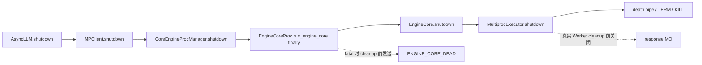
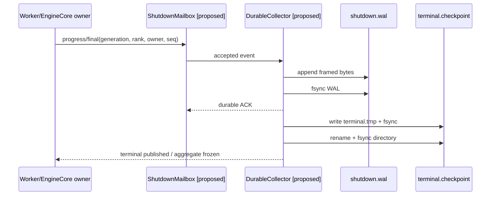

> 本文代码基线为 vLLM [`95f4925c`](https://github.com/vllm-project/vllm/commit/95f4925c3a03df8cfcaa21633ccc9dd5b426c7a4)。该最新提交调整 ROCm modular-kernel 测试，与本文 shutdown 路径无直接关系。必须先说明：vLLM 当前并没有本文所述的 `ShutdownWAL` 或 `TerminalCheckpoint`；下文会把**当前代码事实**、**测试事实**和**建议协议**明确分开。

## 本篇在课程路线中的位置

第 33 章已经把 shutdown 证据从业务 output socket 和 Worker response MQ 中拆出来，得到 `producer mailbox → parent collector → durable ACK`。但“durable”还只是一个名字：`collector.recv()`、`file.write()`、`fsync()` 与 terminal 文件可见，分别能证明什么？如果进程恰好死在 payload、CRC、rename 或 ACK 之后，恢复结果还能否唯一？

本章只回答一个边界：**一条 ShutdownEvent 何时可以被称为 durable，以及多条事件怎样原子收敛为 terminal aggregate。**

## 前置知识回顾

- `cleanup completed` 与 `process isolated/reaped` 是两条正交证据，KILL 不能补写 cleanup final。
- `expected ranks` 必须在 teardown 前冻结；缺失 final 只能合成为 `completion_unknown/abandoned_by_deadline`。
- 事件先按 `generation` 隔离，再按 `(rank, owner, seq)` 去重；terminal freeze 后的 late event 不再改写结果。
- progress 可以 latest-wins，terminal 不能被 progress 洪峰覆盖；证据通道也不能反向阻塞 containment deadline。

## 本篇要回答的核心问题

1. 当前 vLLM shutdown 为什么还没有任何磁盘 durability 边界？
2. 一个可恢复 WAL frame 至少需要哪些字段，CRC 能证明什么、不能证明什么？
3. 如何发布 terminal checkpoint，保证 crash 后看到“旧版本或新版本”，而不是混合版本？
4. `crash-at-every-write` 应验证哪些不变量？

## 组件在全局架构中的位置

当前真实链路是：



[`AsyncLLM.shutdown`](https://github.com/vllm-project/vllm/blob/95f4925c3a03df8cfcaa21633ccc9dd5b426c7a4/vllm/v1/engine/async_llm.py) 把 timeout 交给 client；[`MPClient.shutdown`](https://github.com/vllm-project/vllm/blob/95f4925c3a03df8cfcaa21633ccc9dd5b426c7a4/vllm/v1/engine/core_client.py) 再关闭进程和 IPC 资源。[`CoreEngineProc.run_engine_core`](https://github.com/vllm-project/vllm/blob/95f4925c3a03df8cfcaa21633ccc9dd5b426c7a4/vllm/v1/engine/core.py) 的 fatal sentinel 在 `finally` 中真正执行 `engine_core.shutdown()` **之前**发出；[`MultiprocExecutor.shutdown`](https://github.com/vllm-project/vllm/blob/95f4925c3a03df8cfcaa21633ccc9dd5b426c7a4/vllm/v1/executor/multiproc_executor.py) 则沿 death pipe、TERM、KILL 收敛 Worker。这里没有 WAL、CRC、`fsync` 或 atomic checkpoint。

因此下面的 `ShutdownWalWriter` 和 `TerminalCheckpoint` 是建议的 parent-owned seam，不是已合入类型：



## 完整调用链

当前调用链的关键事实不是“哪里可以塞一个文件写入”，而是**谁活得足够久**。Worker 可能被 KILL，EngineCore child 也可能被 parent 截止时间终止；所以两者都不能拥有唯一的 durable sink。最小接入点应在拥有 generation、expected-rank set 和强制回收权的 parent supervisor：

1. owner 非阻塞写入独立 mailbox；
2. parent collector 校验 identity、seq 与状态迁移；
3. collector 编码 frame，追加到 generation 专属 WAL；
4. WAL 同步成功后才发 durable ACK；
5. deadline 到达后，parent 将 durable prefix、expected/final/missing 与 containment 状态生成 terminal checkpoint；
6. checkpoint 原子发布后冻结 aggregate；随后到达的事件只记为 `late_after_terminal`。

这条链把控制面与证据面分开：磁盘卡顿可以降低证据强度，但不能延长 TERM/KILL 的权威 deadline。

## 关键类型、字段和状态生命周期

建议的 WAL frame 不需要复制所有 Python 对象，只需保存恢复和去重所需的最小事实：

| 字段 | 作用 | 恢复不变量 |
| --- | --- | --- |
| `magic, version, header_len` | 找到并解释 frame | 未知 version fail closed |
| `generation, global_rank, owner` | 隔离实例与资源 owner | 不接受旧 generation |
| `kind, seq` | progress/final 与幂等顺序 | 同 key 的 seq 单调 |
| `payload_len` | 确定 frame 物理边界 | 必须小于配置上限 |
| `payload` | milestone、结果和受控 detail | schema 验证后消费 |
| `crc32c` | 检出短写、撕裂或随机损坏 | 只证明字节完整，不证明语义正确 |

`ShutdownWalFrame` 的生命周期是：collector 从已接受的 event 创建它；编码后成为一段不可变 bytes；append 后仍只算 page-cache evidence；WAL sync 完成后进入 durable index 并允许 ACK；terminal checkpoint 引用其 durable end offset 和 high-water marks；generation 完成、checkpoint 与保留策略满足后，旧 frame 才可 compact 或删除。

CRC 不是身份认证，也不能阻止“合法编码但错误的 rank/seq”。所以校验顺序必须是 `length/CRC → schema → generation → identity → seq/state transition`，不能看到 CRC 正确就升级为 final。

从接口契约看，建议的 `append(event) -> receipt` 输入不是 tensor，没有 shape/dtype/device；它是固定上限的 bytes record，必须在 Host parent 进程内完成。`event` 的所有权在 mailbox accept 后转给 collector；producer 只保留可重发副本，直到收到 `(generation, key, seq, durable_end)` ACK。后置条件也分两类：成功只说明该 frame 落入 durable prefix，不说明整个 generation 已 terminal；失败则必须返回稳定 reason code，且不得把 partially written offset 提升为 high-water。并发假设是单 generation 单 physical writer，多 producer 通过 mailbox 串行化；若允许多个 writer，就必须额外解决 offset reservation、sync 覆盖范围和 ACK 因果关系，收益很小。

`TerminalCheckpoint` 不是“最后一条事件”的别名，而是 parent 对多 owner、多 rank 证据的物化视图。它至少携带：schema version、generation、expected set、每个 key 的 accepted high-water、`completed/failed/unknown` 分类、containment 分类、WAL durable end、checkpoint 自身校验和。恢复时先验证 checkpoint，再确认 WAL 合法前缀覆盖其 `durable_end`；任一条件不满足就回退到旧 checkpoint 或重新从 WAL 聚合，不能相信一个指向未来 offset 的新文件。

## 逐函数源码解读

### 1. `run_engine_core`：fatal 可见不等于 cleanup durable

当前 [`run_engine_core`](https://github.com/vllm-project/vllm/blob/95f4925c3a03df8cfcaa21633ccc9dd5b426c7a4/vllm/v1/engine/core.py) 在异常路径调用 `_send_engine_dead()`，随后才进入 `finally` 做 Core shutdown。Rust output loop 收到 sentinel 后将 client 标为 dead，这能快速传播故障，却不能证明 Executor、Scheduler 或 device cleanup 已完成。它也没有可供重启 collector 重放的磁盘记录。

### 2. `MultiprocExecutor.shutdown`：进程收敛不是记录提交

[`_ensure_worker_termination`](https://github.com/vllm-project/vllm/blob/95f4925c3a03df8cfcaa21633ccc9dd5b426c7a4/vllm/v1/executor/multiproc_executor.py) 先等待 graceful exit，再 TERM、再 KILL；当前 KILL 后没有一次显式 join/reap。即使补上 reap，它仍只形成 containment evidence。WAL writer 必须在 parent 中保存 KILL 前最后 progress，并在 KILL 后由 parent写入 synthetic `abandoned_by_deadline`，不能要求已经死亡的 child 补 final。

### 3. `ZmqEventPublisher`：replayable 不等于 durable

[`ZmqEventPublisher`](https://github.com/vllm-project/vllm/blob/95f4925c3a03df8cfcaa21633ccc9dd5b426c7a4/vllm/distributed/kv_events.py) 提供了很好的反例：它用 `deque(maxlen=buffer_steps)` 保存带 sequence 的 replay buffer，发送后追加到进程内内存。它能处理订阅者短暂落后，但 publisher 进程重启后 buffer 消失；没有 CRC、`fsync` 或恢复扫描。因此“支持 replay”不能直接推导为 crash durability。

## 具体示例与状态演算

设 TP=2、`generation=42`，session header 已 durable，冻结 `expected={0,1}`：

- frame A：rank 0，`seq=10`，`device_cleanup.completed`，物理区间 `[80,164)`；
- frame B：rank 1，`seq=7`，`device_sync.started`，物理区间 `[164,240)`；
- collector 写到 offset 230 时机器崩溃，B 的 CRC 尚未完整落盘。

恢复扫描从 offset 0 顺序进行。header 与 A 的 length、payload、CRC 都完整，所以 durable prefix 到 164；B 在 164 处长度可读但 bytes/CRC 不完整，扫描必须**停在 164**，不能搜索后续 magic 猜测重同步。此时恢复结果为：rank 0 有 completed，rank 1 没有可接受事件；因为 durable session header 仍保存 expected set，rank 1 不会从集合中“消失”。

“停在首个坏 frame”是刻意的 fail-closed 选择。若扫描器跳过坏区继续寻找 magic，payload 中碰巧出现相同字节就可能被误认成新 frame，最终把随机数据升级为 owner final。恢复器应先以只读方式得到 `last_good_offset`，完成 generation/seq 重放并取得 writer 独占权后，才能 `ftruncate(last_good_offset)`；随后还要同步 WAL，保证修复后的文件长度本身持久。若无法取得独占权或 truncate/sync 失败，则保持只读 degraded 状态，不得一边让旧 writer 继续 append、一边发布新 terminal。

session header 同样是协议的一部分：它应先于任何 rank event 持久化，记录 generation identity、expected set 的来源和 schema version。否则 collector crash 后即使找回 rank 0 的 completed，也无法区分“本来只有 rank 0”与“rank 1 的所有事件都丢了”。expected set 只能由拥有拓扑事实的 supervisor 建立；replay 不得根据 WAL 中实际出现过的 ranks 反向推断 expected set。

parent 重新取得 containment 权后，可以在 deadline/KILL 事实成立时写入 rank 1 的 synthetic final。只有该 frame sync 完成，terminal snapshot 才能得到：

```text
expected = {0, 1}
completed = {0}
abandoned_by_deadline = {1}
completion_unknown = {1}
wal_durable_end = 248
high_water = {(0, device): 10, (1, device): 8}
```

如果 sync 已成功但 ACK 前 crash，producer 可能重发同一 `seq=10`。payload/hash 相同则幂等接受；同 key、同 seq、不同 payload 必须标为 conflicting duplicate，而不是 last-write-wins。

还要区分两类 synthetic 事实：`abandoned_by_deadline` 可以由掌握 deadline 与 KILL 结果的 parent 生成；`device_cleanup.completed` 却只能来自真正跨过 device fence 的 owner。parent 不能因为 child 已 reap 就合成 completed。checkpoint 因而不是“尽量填满每个格子”，而是把已知、失败和未知同时固化，使恢复后的诊断强度不高于 crash 前实际证据。

## 为什么这样设计及替代方案

最直接的替代方案是每次覆盖一个 JSON terminal 文件。它简单，但 progress 历史会丢失，覆盖中途崩溃还需要自己解决 torn write。另一个方案是 SQLite：事务、校验和恢复能力更成熟，但增加依赖、锁和运行时治理面。对低频 shutdown evidence，`append-only WAL + compact terminal checkpoint` 的状态更小，也更容易做 byte-level fault injection。

建议的发布顺序是：

1. append terminal-related frames，并 `fsync(WAL)`；
2. 写 `terminal.tmp`，其中包含 generation、expected/final/missing、high-water 和 `wal_durable_end`；
3. `fsync(terminal.tmp)`；
4. `rename(terminal.tmp, terminal.checkpoint)`；
5. `fsync(parent_directory)`；
6. 最后才宣布 terminal durable 并冻结 aggregate。

Linux 的 [`fsync(2)`](https://man7.org/linux/man-pages/man2/fsync.2.html) 明确指出：同步文件并不必然同步包含它的目录；[`rename(2)`](https://man7.org/linux/man-pages/man2/rename.2.html) 保证替换的可见性原子，但不能单独充当 crash durability 证明。因此少一步 directory fsync，就只能宣称“命名原子”，不能宣称“断电后新 checkpoint 必然存在”。

## 性能、并发、正确性与边界条件

- **延迟**：每个 progress 都 `fsync` 会放大尾延迟；可以 group commit，但最大证据损失窗口约等于 commit interval。terminal frame 必须使用剩余预算中的保留 sync 窗口，不能无限等待。
- **吞吐**：latest-wins mailbox 限制生产侧空间；WAL 仍应记录 durable high-water，而不是把每次心跳都落盘。
- **并发**：一个 generation 最好由单 writer 串行分配物理 offset；多 producer 只竞争 mailbox，不直接共享 file offset。
- **正确性**：short write 必须循环补写；`write()` 返回成功仍未形成 durable ACK。`fsync` 的 `EIO/ENOSPC` 必须停止 ACK，并在可用通道中显式报告 `durability_failed`。
- **deadline**：WAL I/O 不能续期 containment deadline。磁盘失败时仍要 TERM/KILL；最终结果可以是“进程已隔离，但 cleanup/durability unknown”。
- **隐私**：payload 只保存稳定 reason code 和受限 detail；fatal dump、prompt 或 tensor 不应顺手进入长期 WAL。

## 测试证据与未覆盖风险

当前 [`test_multiproc_executor_worker_termination_timeout`](https://github.com/vllm-project/vllm/blob/95f4925c3a03df8cfcaa21633ccc9dd5b426c7a4/tests/v1/executor/test_executor.py) 用 fake clock 验证 grace 内退出是否需要 TERM；[`test_forward_error.py`](https://github.com/vllm-project/vllm/blob/95f4925c3a03df8cfcaa21633ccc9dd5b426c7a4/tests/v1/shutdown/test_forward_error.py) 注入 forward error，验证请求收到 `EngineDeadError` 且 GPU memory 回落。[`test_kv_cache_events.py`](https://github.com/vllm-project/vllm/blob/95f4925c3a03df8cfcaa21633ccc9dd5b426c7a4/tests/distributed/test_kv_cache_events.py) 验证 KV event hash/msgpack wire compatibility。它们分别证明 termination policy、fatal E2E 和 wire 编码片段，**都没有**验证 WAL durability。

建议新增 crash-at-every-write harness，在独立子进程中逐点 `os._exit()`：partial header、partial payload、CRC 后但 sync 前、WAL sync 后 ACK 前、checkpoint temp 写后、temp sync 后、rename 后 directory sync 前、directory sync 后 ACK 前。每个点都验证：

1. 恢复只接受完整合法前缀，绝不越过首个坏 frame；
2. durable ACK 从不早于对应 sync；
3. terminal 只可能是旧版本或新版本，不出现字段混合；
4. sync 后 ACK 前的重发可幂等收敛；
5. 同 seq 不同 payload 被拒绝；
6. terminal freeze 后的 late event 不改变 aggregate。

把这些点写成 golden matrix，会更容易发现“可见但不持久”和“持久但未确认”的差异：

| Crash 点 | 恢复后允许看到 | 禁止推导 |
| --- | --- | --- |
| payload/CRC 未完整 | 上一个合法 prefix | 当前 frame durable |
| frame 完整、WAL sync 前 | 旧 prefix，或文件系统偶然保留的新 bytes | 已向 producer 承诺 durable |
| WAL sync 后、ACK 前 | 包含当前 frame 的 prefix | 因没有 ACK 而丢弃 frame |
| temp sync 后、rename 前 | 旧 checkpoint + 新 WAL prefix | 新 terminal 已发布 |
| rename 后、dir sync 前 | 旧或新 checkpoint，依文件系统恢复结果 | 必然得到新名字 |
| dir sync 后、ACK 前 | 新 checkpoint | 重发会生成第二个 authoritative terminal |

这个矩阵必须用真实子进程和真实文件描述符跑；只 mock `write/fsync` 能验证调用顺序，却不能验证进程死亡后 kernel page cache、文件长度与目录项组合出来的恢复状态。反过来，真实 crash 测试也不替代 deterministic fake：short write、`EINTR`、`EIO`、`ENOSPC` 和 directory-fsync failure 仍需可精确注入。

仍未覆盖的风险包括 filesystem/虚拟化是否兑现 flush、WAL rotation 中断、目录损坏、ENOSPC/EIO 降级、collector 与 supervisor 同时崩溃、以及真实 CUDA/NCCL hang 下磁盘 stall 与 KILL deadline 的竞争。

## 与前后章节的连接

上一章定义了独立 sideband 和三层证据；本章把最强一层从抽象“durable ACK”落成 `framed append → WAL fsync → atomic terminal publish`。这使第 28 章的 parent-owned snapshot、第 30–32 章的 deadline/backend adapter 和第 33 章的 mailbox 都有了共同提交点。

下一章继续处理最危险的交叉点：当 `fsync` 遇到 ENOSPC/EIO 或超出 reserved sync budget 时，怎样降级证据而不拖住 TERM/KILL。

## 本篇结论、知识债、三个理解检查问题和下一章

结论只有三条：`write()` 成功不是 durable；CRC 完整不是语义合法；`rename()` 原子可见也不等于断电持久。可接受的 terminal 需要 WAL durable prefix、可验证 checkpoint、目录同步以及 terminal freeze 共同成立。

知识债：vLLM 还没有 `ShutdownEvent/ShutdownWAL/TerminalCheckpoint` 实现、stable reason taxonomy、MP/Ray/torchrun adapter、KILL 后 join/reap、WAL rotation/repair、ENOSPC/EIO 降级、Python/Rust golden 与真实 GPU hang 测试。

理解检查：

1. 为什么 WAL 已 `fsync`、ACK 尚未发送时 crash，恢复后必须接受 producer 的重复 frame？
2. 为什么 frame CRC 正确仍不能把 `completed` 放进 terminal aggregate？
3. 为什么 `rename` 成功后还需要同步 parent directory？

下一章：**Durability 失败不能拖住 KILL——ENOSPC/EIO、Group Commit、Reserved Sync Budget 与 Containment Deadline。**

## 课程账本增量

- 新增证据等级：collector receive、page-cache write、WAL sync、terminal checkpoint publish 不再混为“已记录”。
- 新增恢复不变量：只接受 length/CRC/schema 合法前缀；同 seq 冲突 fail closed；terminal 只引用已同步 offset。
- 新增测试协议：对 frame append、sync、checkpoint write/rename/directory sync 的每个边界注入 crash。
- 新增知识债：实际 WAL/repair/rotation、磁盘错误降级、sync budget 与跨 backend adapter。
