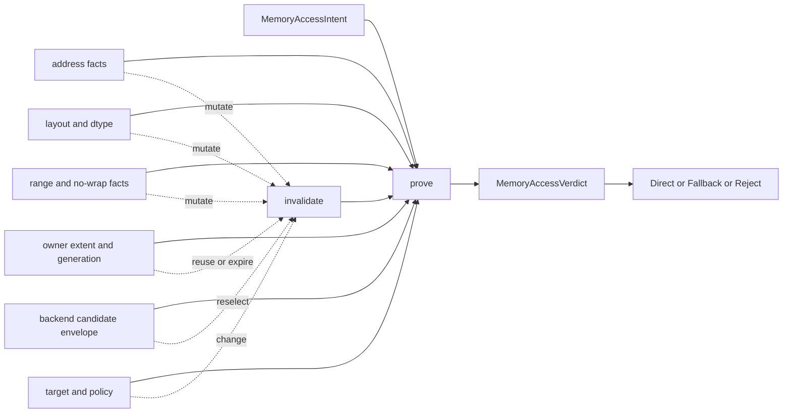
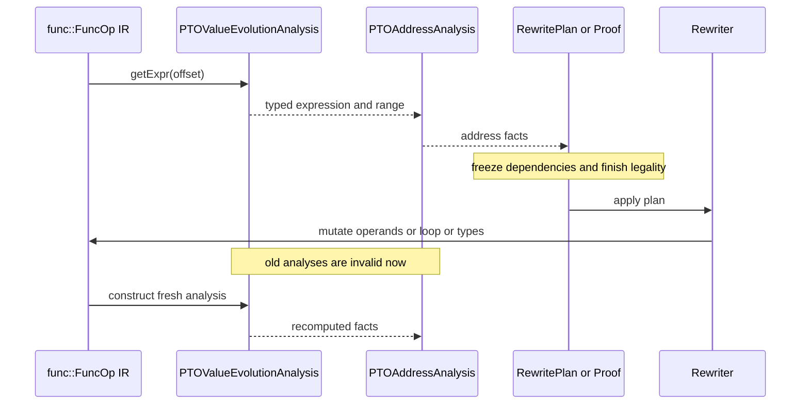

> 源码基线：PTOAS [`8a0a5689`](https://github.com/hw-native-sys/PTOAS/commit/8a0a5689b39c94288a734aeba8d248b5cdb2fa73)。本文只把已合入代码当作事实；`MemoryAccessVerdict` 的 fingerprint、owner generation 与 cross-backend invalidation matrix 是基于这些事实推导出的建议契约，不是当前已实现接口。该基线相对上一章的 `fde3b353` 已前进 16 个提交；最新 `pmode` 重构没有改变本文讨论的 memory proof 语义，`PTOAddressAnalysis.cpp` 的变化也只是把常数命名化。

## 本篇在 PTO 课程路线中的位置

课程 37 把 memory access 拆成 shared `MemoryAccessIntent`、owner certificate 与 backend candidate；课程 38 又把“能否证明”与“采取何种动作”拆成 `Proven / Disproven / Unknown` 和 `Direct / Fallback / Reject`。但还缺一个时间维度：**一次得到 `Proven`，它能活到什么时候？**

本章位于 `shared intent/certificate → proof verdict → invalidation → guarded/exact fallback`。只讲一件事：proof 的依赖集合只要发生语义变化，旧 verdict 就必须失效并重新证明。

## 前置知识

- `Proven` 表示候选物理访问被当前证据完整覆盖；`Unknown` 是证据不足，不是已知越界。
- semantic footprint 与 backend physical envelope 是两件事。`vreg<100xf32>` 的语义数据是 400 B，但两段 64-lane carrier 可读 512 B。
- pointer 数值、allocation identity、可读 extent 与 lifetime 彼此独立；“地址一样”不推出“仍由同一 owner 覆盖”。
- MLIR analysis 依赖 IR 快照。pass 修改了该快照却继续读旧 analysis，本质上是在用旧世界证明新世界。

## 今日 1–2 个核心问题

1. `MemoryAccessVerdict` 的最小依赖集合是什么；address、layout、range、owner 或 policy 哪类变化会让它失效？
2. PTOAS 当前代码如何避免 stale analysis；哪些风险已经被处理，哪些仍只是未来 shared verdict 需要补的契约？

## PTO 全栈中的位置

上游是 VMI/VPTO IR、类型与控制流；中间层由 [`PTOValueEvolutionAnalysis`](https://github.com/hw-native-sys/PTOAS/blob/8a0a5689b39c94288a734aeba8d248b5cdb2fa73/include/PTO/Analysis/PTOValueEvolutionAnalysis.h) 推导 offset/range，由 [`PTOAddressAnalysis`](https://github.com/hw-native-sys/PTOAS/blob/8a0a5689b39c94288a734aeba8d248b5cdb2fa73/include/PTO/Analysis/PTOAddressAnalysis.h) 合成地址事实；下游 VMI→VPTO lowering 或 EmitC backend 选择 direct、fallback 或 reject。若中间发生 rewrite，旧 proof 不得越过这个边界。



## 概念和精确语义

把一次判定写成：

```text
Verdict = prove(Intent, Candidate, Certificate, RangeFacts, Target, Policy)
```

`Verdict` 不是 access 的永久属性，而是上述输入快照的派生值。最小的建议 fingerprint 至少包含：

```text
{intentRev, addressRev, layoutRev, rangeRev, candidateRev,
 ownerId, ownerGeneration, targetProfile, policyMode}
```

这里有五类失效：

1. **address mutation**：base、offset、unit、`pto.addptr` 链、RAUW 或 defining op 改变。
2. **layout/candidate mutation**：dtype、layout、physical arity、lane map、alignment 或 transfer envelope 改变。
3. **range mutation**：loop bound/step、branch predicate、cast preservation、no-wrap 结论改变。
4. **owner mutation**：allocation extent/guard 改变，owner lifetime 结束，或相同数值地址被新 generation 复用。
5. **decision-context mutation**：target 或 `load-safety` policy 改变。它未必改变数学 proof，却会改变完整 verdict 的 disposition，因此仍须重新决策。

后置条件是：只有 fingerprint 完整相等的 verdict 才能复用；任一字段无法比较时降为 `Unknown` 或重新分析，不能沿用旧 `Proven`。`ownerGeneration` 是本章提出的设计要求；当前 PTOAS 尚未建模它。

把关键接口展开后，责任边界更清楚：

| 接口/对象 | 输入 | 输出 | 所有权与有效期 | 失败方式 |
| --- | --- | --- | --- | --- |
| `PTOValueEvolutionAnalysis::getExpr` | 函数内 `Value`、def-use、loop/cast 结构 | host-side `PTOTypedExprRef`，含 bit width、range、recurrence/no-wrap 事实 | analysis cache 持有；仅对当前 `func::FuncOp` 快照有效 | 无法建模时产生 unknown expression；mutation 后复用会 stale |
| `PTOAddressAnalysis::getAddresses` | 实现 `VPTOAddressSemanticsOpInterface` 的 op | root/base、element offset、access/update unit 与 delta | 借用 ValueEvolution 结果；不拥有实际内存 | op 不支持接口、pointer 链无法规范化或 offset 证据不足 |
| `computeSafeStatefulReadProof` | source、offset、`VMIVRegType` | byte envelope、physical footprint、`proven/reason` | 调用栈持有，当前 lowering decision 后销毁 | dynamic extent/alignment/range 缺失，或 candidate 越过 readable envelope |
| 建议的 `MemoryAccessVerdict` | intent、candidate、certificate、range、target、policy | proof class、decision、reason/witness | 必须与完整 fingerprint 同生命周期 | 任一依赖变化但未 invalidate，会把旧许可错误授予新访问 |

shape/dtype/device 也要分开看：这些对象位于 compiler host，不是 device tensor；`VMIVRegType` 的逻辑 shape 与 dtype 决定 400 B semantic payload，backend physical arity 决定 512 B candidate。address space 则决定访问属于哪类 device memory，但 analysis 只描述它，不持有它。并发上，函数 analysis 假设其观察的 IR 不在背后被另一线程修改；若并行 pass 各自拥有不同函数，可分别缓存，但不得共享以 `Value` 为 key 的可变结果。

## 真实文件、类型、API 或指令逐段解读

### 1. `PTOValueEvolutionAnalysis::getExpr`：缓存的是 IR 快照

[`PTOValueEvolutionAnalysis.cpp`](https://github.com/hw-native-sys/PTOAS/blob/8a0a5689b39c94288a734aeba8d248b5cdb2fa73/lib/PTO/Analysis/PTOValueEvolutionAnalysis.cpp) 中，`getExpr(Value)` 先查 `DenseMap<Value, PTOTypedExprRef> expressionCache`，未命中才沿 defining op、cast 与 loop 结构建立 typed expression。输入是函数内 MLIR `Value`；输出是 host memory 中的表达式节点，不是 device tensor。它可能带有限位宽、range、cast-preservation 与 recurrence 事实。

缓存 key 只是 `Value`，不是“Value 加其所有依赖的版本号”。所以若 pass 原地改变 defining op 的 operand、loop bound 或类型，又保留旧 analysis C++ 引用，key 仍相同而 value 已过期。这是 stale proof 的最直接来源。

### 2. `PTOAddressAnalysis::getAddresses`：地址事实依赖 ValueEvolution

[`PTOAddressAnalysis.cpp`](https://github.com/hw-native-sys/PTOAS/blob/8a0a5689b39c94288a734aeba8d248b5cdb2fa73/lib/PTO/Analysis/PTOAddressAnalysis.cpp) 从 `VPTOAddressSemanticsOpInterface` 读取 current base/access，剥离 `pto.addptr`，再调用 `valueEvolution.getExpr(offset)` 生成 `rootOrBase`、typed element offset 与 op-specific unit/delta。它本身没有第二份地址 cache，但持有函数级 ValueEvolution analysis，因此仍继承后者的有效期。

重要的所有权边界是：analysis 拥有编译期事实，绝不拥有被描述的 device allocation。`rootOrBase` 也不是 allocation certificate；它不能单独证明 extent、lifetime 或 generation。

### 3. `VPTOSoftPostUpdate`：当前代码已经承认 stale-cache 边界

真实 consumer [`VPTOSoftPostUpdate.cpp`](https://github.com/hw-native-sys/PTOAS/blob/8a0a5689b39c94288a734aeba8d248b5cdb2fa73/lib/PTO/Transforms/VPTOSoftPostUpdate.cpp) 采用两段式：先为整个函数生成不修改 IR 的 loop rewrite plans，完成 legality 检查，再统一 materialize；顺序 block 场景则为每个 block 新建 `PTOValueEvolutionAnalysis` 与 `PTOAddressAnalysis`。源码注释明确说明，若改写前一个 vecscope 后仍复用函数 analysis，会观察到 stale cached expressions。

设计文档 [`vpto-address-analysis-design-zh.md`](https://github.com/hw-native-sys/PTOAS/blob/8a0a5689b39c94288a734aeba8d248b5cdb2fa73/docs/designs/vpto-address-analysis-design-zh.md) 给出的顺序也是 query → non-mutating plan → 全部 legality → rewrite，并要求不要 preserve 已失效的两项 analysis。跨 pass 时，未调用 `markAnalysesPreserved` 会让 AnalysisManager 丢弃结果；但同一 pass 已握住的 C++ 引用不会在每次 mutation 后自动刷新，因此必须靠 phase separation 或 fresh instance。

### 4. `VMIMemorySafeReadProof`：当前安全之处是“短命”

[`VMIToVPTOConversionInternals.cpp`](https://github.com/hw-native-sys/PTOAS/blob/8a0a5689b39c94288a734aeba8d248b5cdb2fa73/lib/PTO/Transforms/VMIToVPTO/VMIToVPTOConversionInternals.cpp) 中的 `VMIMemorySafeReadProof` 保存 `proven/reason`、constant offset、static element count、lane map、physical footprint 与两个 byte interval。它由 [`VMIToVPTOMemoryInternals.cpp`](https://github.com/hw-native-sys/PTOAS/blob/8a0a5689b39c94288a734aeba8d248b5cdb2fa73/lib/PTO/Transforms/VMIToVPTO/VMIToVPTOMemoryInternals.cpp) 在一次 lowering decision 中栈上构造并立即消费，没有跨 pass cache，也没有写回 IR。

因此当前 VMI safe-read proof 的生命周期是“调用内”：创建 → 比较 `candidateReadEnvelope ⊆ readableEnvelope` → 应用 policy → 析构。它不会自然泄漏到后续 rewrite。未来若把上一章建议的 shared `MemoryAccessVerdict` 存成 IR attribute、analysis cache 或 side table，才必须同时实现 dependency fingerprint 与 invalidation；不能只搬运当前 struct。

## 对象/Tile/Buffer/IR 生命周期



生命周期中的关键对象不是 device Tile，而是编译期 `PTOTypedExprRef`、address facts 与 rewrite plan。analysis 持有表达式 cache；plan 短暂持有将被改写的 op/loop handle；rewriter 消费 plan 后，这些 handle 可能被替换或 erase。后续 consumer 必须从新 IR 重新取 analysis。失败方式包括 use-after-erase、同一 `Value` 命中旧 expression、旧 interval 继续授权更宽的物理读取，以及 owner 已释放但证书仍被复用。

这里还要区分“对象仍可解引用”和“对象表达的事实仍为真”。MLIR `Value` 或 `Operation*` 在某些 in-place mutation 后仍然存活，C++ 层不会报 use-after-free；但其 operand、type 或父控制流已经改变，旧 `PTOTypedExprRef` 仍然是语义悬空。相反，erase 会让 handle 本身失效，是更容易暴露的错误。真正危险的是前者：程序可以正常编译，只有生成的物理访问越界。因此 invalidation test 不能只依赖 ASan 或崩溃，还必须比较 mutation 前后的 proof class、interval witness 与最终 lowering。

`VPTOSoftPostUpdate` 的 loop plan 还隐含一条消费规则：plan 中保存的 operation/loop handle 必须在对应对象被 erase 之前一次性使用，且不同 plan 的改写不能让后续 plan 的前置条件失真。当前实现选择“全部分析完，再进入 apply 阶段”，正是为了避免分析、改写、再读旧 cache 的交错。若未来允许 plan 互相重叠，就需要在 apply 前验证 plan revision，或每次改写后重做剩余计划。

## 端到端调用链或指令链

以 soft post-update 路径为例，真实链条是：

```text
ptoas pipeline
→ VPTOSoftPostUpdatePass::runOnOperation
→ AnalysisManager.getChildAnalysis<PTOAddressAnalysis>(func)
→ PTOAddressAnalysis::getAddresses(op)
→ PTOValueEvolutionAnalysis::getExpr(offset)
→ 生成 LoopRewritePlan / SequentialRun
→ 完成所有 legality checks
→ applyLoopPlan / processSequentialBlock
→ 改写 VPTO base、offset 与 updated_base
→ 丢弃旧 analysis，后续 pass 重新查询
```

公开入口是 `ptoas` pipeline 的 `--enable-soft-post-update` 路径；核心实现是地址分析与 rewrite。输入是 VPTO memory op、index/integer offset 和函数控制流；输出是等价的 post-update IR。前置条件是地址差、单位、range 与控制流结构可证明；后置条件是语义地址不变且旧 analysis 不再被读取。并发假设是单个 MLIR pass 对一个 IR snapshot 串行改写，不涉及 device 并发；失败时 pass 必须保留原 IR 或 signal failure，不能凭 stale fact 继续优化。

## 具体 shape、Tile 和状态演算

直接使用测试 [`vmi_to_vpto_load_safe_tail_memref.pto`](https://github.com/hw-native-sys/PTOAS/blob/8a0a5689b39c94288a734aeba8d248b5cdb2fa73/test/lit/vmi_new/vmi_to_vpto_load_safe_tail_memref.pto)：

- semantic result：`!pto.vmi.vreg<100xf32>`，100×4 = 400 B；
- VPTO carrier：2×`!pto.vreg<64xf32>`，共 128 lanes = 512 B；
- source：`memref<128xf32>`，owner extent = 512 B；
- offset = 0 elements。

此时相对 access pointer：

```text
readableEnvelope = [0, 512)
candidateReadEnvelope = [0, 512)
candidate ⊆ readable  => Proven
```

若 rewrite 只把 offset 改成 1，却错误复用旧 proof：access pointer 前进 4 B，owner 相对新区间变为 `[-4,508)`，而 candidate 仍是 `[0,512)`。末尾 `[508,512)` 的 4 B 越界，正确结果应从 `Proven` 变为 `Disproven`。旧 proof 会把一次真实越界授权成 direct load。

同一测试还有 `memref<136xf32>`、offset=4：extent 544 B，pointer 前进 16 B，readable=`[-16,528)`，仍完整覆盖 512 B candidate，因此是安全的。这个对照说明：offset 变化不能孤立判断；只有重新组合 address 与 owner extent 后才能出 verdict。

再看 owner generation：若 allocator 释放 512 B owner `A@g`，随后把相同数值地址分配给 400 B owner `B@g+1`，pointer bits 没变，旧 certificate 仍必须失效。否则 address equality 会伪装成 lifetime continuity。当前代码没有 generation 字段，这一段是建议契约，不是已合入事实。

## 为什么这样设计及替代方案

**方案 A：每次 query 都重算。** 最简单、正确性强，但复杂 loop/range expression 会重复构建，增加编译时延。

**方案 B：函数级 cache + 粗粒度全失效。** 当前 MLIR AnalysisManager 风格接近此方案。任一相关 rewrite 后整项 analysis 作废，维护成本低；缺点是小改动也会丢失可复用事实。

**方案 C：dependency fingerprint + 增量失效。** 可保留未受影响 verdict，适合大型 IR，但必须版本化 address/layout/range/owner/candidate，处理 RAUW、erase、control-flow mutation 与 owner generation；实现和测试成本最高。

当前阶段应优先 B：proof 计算尚未成为已测量的编译瓶颈，而错误复用一次 `Proven` 会变成静默 OOB。只有 profile 证明全量重算显著占时，且 mutation taxonomy 与 differential tests 完整后，才值得引入 C。无语义 metadata 变化可作为 preservation 的正例，但 pass 必须显式证明并 `markAnalysesPreserved`；不能由“看起来没改地址”推断。

也可以把 verdict 直接写成 IR attribute，似乎能随 SSA 一起传播，但这并不自动解决问题。attribute 不会知道 owner 已换代，也不会因 loop bound 的间接变化自动更新；它只是把 stale cache 变成 stale IR。正确做法仍是记录依赖 revision，并由 verifier 在消费点检查，或把 verdict 作为一次性 lowering token，消费后立即失效。前者适合跨 backend golden 与诊断，后者更简单；在 shared IR 尚未落地前，本课程倾向先采用一次性 token 加粗粒度 invalidation。

## 访存、计算、流水、并行和硬件约束

invalidation 本身不增加 device FLOPs 或 HBM bytes，却决定 backend 能否选择更宽、更规则、可流水的 full-carrier load。保守重算或 fallback 可能增加编译时、指令数与 predicate/exact-tail 成本；错误复用则会触碰 guard 外内存，或把 padding poison 送给 consumer。

对图优化而言，稳定 verdict 有利于 direct candidate 与后续 scheduling；runtime guard 会引入 branch，可能降低 graphability；exact fallback 通常减少越界风险但牺牲 burst 利用率。并行编译时 analysis cache 还必须遵守 IR/context 的线程隔离，不能把某个函数的 `Value` 或 owner certificate 跨函数、跨 module generation 共享。公开代码没有给出具体 A5 memory transaction trace，因此这里不推测硬件会按多少字节 fault；本文只证明 compiler 授权边界。

失效策略还会影响优化窗口。若每个小改写都立即清空全部函数 analysis，编译器可能反复扫描大循环；若为了节省编译时间而延迟失效，后续 pattern 又可能拿旧 range 选择更宽 candidate。一个可维护的折中是把 pass 划成清晰 epoch：epoch 内只查询并生成不可变计划，边界处集中 mutation，随后统一丢弃 analysis。这样 proof 的生命期与 rewrite batch 对齐，既避免每个 op 都重算，也不需要细粒度依赖图。只有当实测显示某个 epoch 的全量重算成为主要编译瓶颈，才引入字段级 revision。

对 device 侧，正确失效也保护流水条件：direct full-carrier read 可以保持规则 burst 和固定寄存器形状，利于调度；一旦 owner/range 不再覆盖，必须切到 guard 或 exact-tail，即使它多出 predicate、分支或小块传输。性能选择只能发生在重新证明之后。否则所谓“保持流水”只是把未定义 padding、相邻 allocation 或 guard page 带入计算，吞吐收益没有正确性意义。

## 测试证据与未覆盖风险

**当前测试事实：**

- [`address_analysis.pto`](https://github.com/hw-native-sys/PTOAS/blob/8a0a5689b39c94288a734aeba8d248b5cdb2fa73/test/lit/vpto/address_analysis.pto) 覆盖 typed recurrence、有限 range、no-wrap、unknown reason、address unit/delta；它验证的是分析结果，不是 mutation 后的失效。
- safe-tail memref 正例覆盖 512 B owner/offset 0 与 544 B owner/offset 4，验证 full 512 B candidate 被 readable envelope 覆盖。
- [`vmi_to_vpto_memory_alignment_safety_invalid.pto`](https://github.com/hw-native-sys/PTOAS/blob/8a0a5689b39c94288a734aeba8d248b5cdb2fa73/test/lit/vmi_new/vmi_to_vpto_memory_alignment_safety_invalid.pto) 覆盖动态 raw pointer alignment unknown、65-element memref offset 1 与不精确 masked store 的拒绝。
- [`vmi_to_vpto_load_safe_tail_memref_negative_offset.pto`](https://github.com/hw-native-sys/PTOAS/blob/8a0a5689b39c94288a734aeba8d248b5cdb2fa73/test/lit/vmi_new/vmi_to_vpto_load_safe_tail_memref_negative_offset.pto) 区分 strict error 与 warn/policy lowering，并拒绝非法 policy 值。

**仍未覆盖：** 没有 direct lit 在同一个 test pass 中先取得 verdict，再分别修改 offset、layout/physical arity、loop bound、owner extent/generation 或 policy，最后确认旧 `Proven` 不可见。建议建立 mutation-differential matrix：`offset 0→1` 必须变为 OOB；`128→136 elements + offset 4` 必须重新证明为安全；layout 导致 carrier footprint 改变必须重算；loop range 扩大必须重算；strict→policy 只能改变 disposition、不能把 proof class 升级；纯 debug attribute 变化应保持相同事实。还要加入“相同 pointer、新 generation”负例，以及真实 guard-page/canary/poison E2E。

建议的最小 golden matrix 如下。它不是当前测试结果，而是由已确认依赖集合推导出的验证协议：

| 只改变一个维度 | 旧事实 | 期望新事实 | 必须观察的不变量 |
| --- | --- | --- | --- |
| offset `0→1`，owner 仍 512 B | `Proven` | `Disproven`，shortage 4 B | 旧 proof 不可命中；不得生成 full direct read |
| owner `128→136xf32` 且 offset `0→4` | `Proven` | 重新 `Proven` | 必须用新 extent 重新构造 readable envelope |
| physical arity `2×64→更宽 candidate` | 旧 512 B 被覆盖 | 依新 footprint 判定 | semantic 400 B 不得被误当 physical footprint |
| loop upper bound 扩大 | range 内 | `Unknown` 或越界 witness | range/no-wrap 依赖必须失效 |
| owner `A@g→B@g+1`，pointer bits 相同 | 旧证书有效 | 旧证书无效 | identity/generation 优先于地址相等 |
| policy `error→policy` | proof 不变 | decision 可变 | `Disproven/Unknown` 不得被改写成 `Proven` |
| 只增 debug attribute | proof 有效 | 可保留 | negative control，防止所有改动都无条件重算 |

事实层次需要保持清晰：当前代码事实是 analysis cache 的 key、`VPTOSoftPostUpdate` 的分阶段策略与 safe-read proof 的调用内生命周期；测试事实是现有 lit 对 range/envelope/policy 的覆盖；设计文档事实是 mutation 后不得 preserve 两项 analysis；owner generation、revision fingerprint 与上述 matrix 则是基于证据的工程推导。公开仓库没有显示 A5 在 4 B 越界时的 fault 粒度，因此不能把 compiler interval 结论外推成具体硬件异常模式。

## 与前后章节的连接

上一章回答 verdict 有哪三类；本章补上它不是常量，而是依赖快照。这样 `Proven` 才不会穿越 rewrite、allocation reuse 或 backend candidate reselection。下一章将处理 `Unknown` 之后的执行策略：runtime guard 的条件由谁生成、exact fallback 如何保持语义，以及 loop 中 guard hoisting 何时安全。

## 本篇结论、知识债、三个理解检查问题和下一章

结论：当前 VMI safe-read proof 因为调用内创建并立即消费，天然短命；函数级 ValueEvolution/AddressAnalysis 则确有 stale-cache 风险，`VPTOSoftPostUpdate` 已用 analyze-then-rewrite 与 fresh per-block analysis 规避。未来 shared `MemoryAccessVerdict` 必须绑定 address、layout、range、candidate、owner identity/generation、target 与 policy；任何依赖变化都先失效再证明。

更精确地说，invalidation 不是“发现 proof 错了以后删除”，而是 mutation 获得写权限之前就冻结或撤销旧许可。consumer 只能读取当前 epoch 的 verdict；rewriter 一旦改变依赖，旧 verdict 立即成为不可消费状态。这个顺序把正确性从调用约定提升为结构化 contract，也为下一章的 runtime guard 留出明确入口：guard 只能弥补当前的 `Unknown`，不能复活已经对旧 owner、旧 layout 或旧 range 失效的 `Proven`。

知识债：shared intent/certificate/verdict IR、ABI owner extent 与 generation 导入、稳定 reason code、依赖 fingerprint、AnalysisManager preservation contract、VPTO/EmitC mutation-differential golden、guarded/exact fallback、真实 A5 guard-page/canary/poison 与编译时成本测量。

理解检查：

1. 为什么 `Value` key 没变，`expressionCache` 中的 range 仍可能已经失效？
2. `memref<128xf32>` 的 offset 从 0 变为 1 时，为什么 semantic 仍是 400 B，却会多出 4 B 物理越界？
3. 相同数值 pointer 为什么不能复用旧 allocation certificate；`ownerGeneration` 解决的是什么问题？

下一章：**Unknown 之后怎么继续——Runtime Guard、Exact Fallback 与 Guard Hoisting 的成本模型。**

## 课程账本增量

- 源码基线：PTOAS `8a0a5689b39c94288a734aeba8d248b5cdb2fa73`。
- 新覆盖文件：`PTOValueEvolutionAnalysis.{h,cpp}`、`PTOAddressAnalysis.{h,cpp}`、`VPTOSoftPostUpdate.cpp`、`VMIToVPTOConversionInternals.cpp`、`VMIToVPTOMemoryInternals.cpp`、address-analysis design 与 safe-tail/alignment tests。
- 新确认不变量：proof 只对依赖快照有效；rewrite 后不得读旧 analysis；当前 VMI safe-read proof 为调用内对象；pointer equality 不等于 owner continuity。
- 新设计推导：shared verdict fingerprint 应覆盖 intent/address/layout/range/candidate/owner generation/target/policy；无法比较就重算或降为 `Unknown`。
- 下一章：runtime guard、exact fallback、guard hoisting 与 direct/fallback 成本边界。
