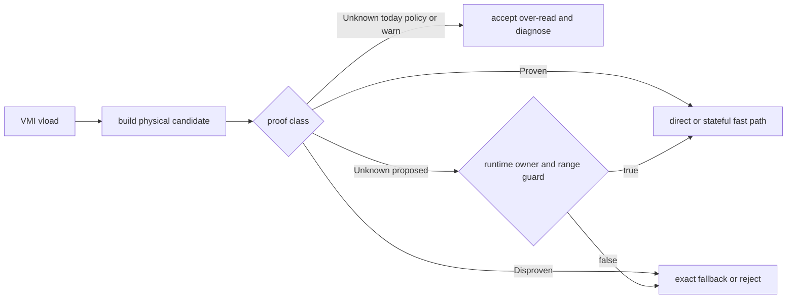
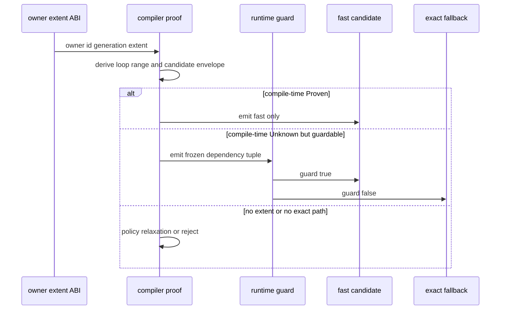

> 源码基线：PTOAS [`9b81c7a9`](https://github.com/hw-native-sys/PTOAS/commit/9b81c7a9614a179b534532a42ec36273b910244f)，默认分支为 `master`。直接相关变化是已合入提交 [`c62ffd96`](https://github.com/hw-native-sys/PTOAS/commit/c62ffd96bae3d8cd3ca8e371f501ed335a25b176)：`PtrType` 的非对齐 contiguous load 可在非 strict policy 下进入 `vldas+vldus`。本文把该 lowering、测试和文档当作代码事实；`RuntimeGuard`、owner extent ABI、exact fallback 与整循环 safety-guard hoisting 是基于这些事实提出的建议契约，当前尚未实现。

## 本篇在 PTO 课程路线中的位置

课程 38 把 proof 与 action 拆成 `Proven / Disproven / Unknown` 和 `Direct / Fallback / Reject`；课程 39 又补上 verdict 的失效边界。本章继续回答最实际的问题：**证据不足时，编译器怎样继续执行，同时不把 Unknown 冒充成安全？**

位置是：`verdict invalidation → Unknown recovery → runtime guard / exact fallback → guard hoisting`。本篇只围绕一条因果链：先看当前 stateful fallback 真正解决了什么，再推导安全 fallback 需要的 guard、slow path 和成本模型。

## 前置知识

- `Unknown` 表示缺少 extent、range、alignment 或 owner 事实；它不是“已知越界”。
- semantic footprint 与 physical envelope 不同。`vreg<100xf32>` 只有 400 B 语义数据，两个 64-lane carrier 却是 512 B。
- A5 vector load 没有通用 predicate；consumer mask 不会缩短 load 的物理读取。
- proof 只对 address、range、candidate、owner generation 与 policy 的同一快照有效。

## 今日 1–2 个核心问题

1. PTOAS 当前的 `vldas+vldus` fallback 为什么能解决非对齐 lowering，却不能被称为 exact memory-safety fallback？
2. 若把 `Unknown` 变成 `RuntimeGuard ? fast : exact`，guard 何时可从每次访问提升到 loop preheader，收益和代价怎样计算？

## PTO 全栈中的位置

上游 VMI 提供逻辑 shape、dtype、layout、UB pointer 与 offset；`VMIToVPTO` 选择 bounded/direct 或 stateful physical sequence；下游 VPTO emitter 生成 A5 访问。缺口位于 proof 与 code selection 之间：raw `!pto.ptr` 没有 allocation extent，编译期无法严格判断 full-carrier envelope 是否仍在 owner 内。



今天的 `R` 是 policy relaxation，不是 proof。建议的 `G` 只有拿到 owner/extent/range 才有意义；它不能从一个裸 pointer 凭空恢复 allocation 边界。

## 概念和精确语义

### Stateful fallback 解决“怎么读”，不自动证明“可以读”

当前 continuous load 有三类路径：

1. 已知 32 B 对齐且形状适合时，用 aligned/bounded 指令；
2. 非对齐时，用 `vldas` 建立 alignment state，再用一个或多个 `vldus` 读取 carrier；
3. 若 candidate 的读取安全无法证明，`load-safety=error` 拒绝；`policy/warn` 仍可接受 full-chunk over-read，并分别发 remark/warning。

因此 stateful 只替代了“不合法的 aligned instruction selection”。它仍可能读取完整 256 B carrier，`vldas` 还会触碰包含起始地址的 32 B 对齐块。它没有把 physical read set 缩到 semantic set。

### Runtime guard 的最小契约

设 owner byte interval 是 `[0,E)`，访问 base 相对 owner 为 `B`，循环内 offset range 为 `[L,H]`，backend candidate 相对每次 effective address 的物理包络为 `[P0,P1)`。一次可 hoist 的 guard 至少应证明：

```text
no_wrap(B + L + P0)
no_wrap(B + H + P1)
0 <= B + L + P0
B + H + P1 <= E
owner_id and owner_generation stay invariant
```

guard 成功只授权这一个 candidate；改变 layout、carrier 宽度、offset range、owner generation 或 target 后都必须重算。失败也不等于语义访问非法：若 semantic envelope 仍在 `[0,E)` 内，可以走 exact fallback；只有 semantic envelope 也越界，或 target 没有 exact 实现时才 reject。

### Exact fallback 的定义

exact 不是某条固定指令，而是后置条件：

```text
physicalReadSet ⊆ semanticReadSet ∪ compilerOwnedDefinedFill
consumerReadSet ⊆ semanticReadSet ∪ definedFill
```

可能实现包括 true masked/non-faulting load、point/gather 组合，或“精确复制 semantic payload 到编译器拥有且已填充的 scratch，再读完整 carrier”。当前 A5 `pto.vlds` surface 没有通用 mask operand，scratch/guarded fallback 的资源规划也没有实现；所以这些仍是设计选项，不是现有能力。

## 真实文件、类型、API 或指令逐段解读

### 1. `computeSafeStatefulReadProof`：静态 strict proof

[`VMIToVPTOMemoryInternals.cpp`](https://github.com/hw-native-sys/PTOAS/blob/9b81c7a9614a179b534532a42ec36273b910244f/lib/PTO/Transforms/VMIToVPTO/VMIToVPTOMemoryInternals.cpp) 的 `getStatefulReadContract` 要求 statically shaped memref、offset range、element bytes、固定 32 B remainder 与 physical footprint。`computeSafeStatefulReadProof` 再构造 readable/candidate byte intervals，并检查 candidate 是否被 allocation envelope 包含。

输入是 compiler-host 上的 MLIR `Value` 与 `VMIVRegType`；输出是短命的 `VMIMemorySafeReadProof`。它不在设备运行，也不持有 UB buffer。raw `!pto.ptr` 缺少 extent，因此 strict proof 得到 Unknown-like failure reason，而不是凭 pointer bits 猜边界。

### 2. `checkSupportedContiguousLoadAddress`：最新 policy seam

提交 `c62ffd96` 给 `PtrType` 增加 early success，但只在 `loadSafety != Error` 时成立。于是同一个 raw-pointer load：

```text
policy/warn: preflight 通过 → stateful lowering
error:       仍要求 safe physical-read proof → 无 extent 时拒绝
```

这条分支非常重要：它明确表示“policy 接受 Unknown”，而不是“PtrType 已被证明安全”。[`VMILoadSafetyPolicy`](https://github.com/hw-native-sys/PTOAS/blob/9b81c7a9614a179b534532a42ec36273b910244f/lib/PTO/Transforms/VMIToVPTO/VMIToVPTOConversionInternals.cpp) 的三个枚举也与此一致。

### 3. `materializeUnalignedContiguousParts`：对象生命周期

[`VMIToVPTOPatternInternals1.cpp`](https://github.com/hw-native-sys/PTOAS/blob/9b81c7a9614a179b534532a42ec36273b910244f/lib/PTO/Transforms/VMIToVPTO/VMIToVPTOPatternInternals1.cpp) 先把 memref/pointer 物化为 buffer pointer，再 `addptr(offset)`；`vldas` 创建 alignment state，随后每个 `vldus` 同时产生 result、`updated_base` 和 `updated_align`。下一 part 消费上一 part 的两个 updated state。

这条 state 生命周期是：effective pointer 创建 → `vldas` 初始化 → `vldus` 读取并推进 → 最后一 part 后失效。它是 lowering-managed physical state，不暴露给 VMI 用户，也没有 owner extent 字段。

### 4. `getUnavailableReadFallbackReason`：现有缺口写在代码里

同一 memory internals 明确列出 partial/tail read 的 scratch、guarded 与 true masked/non-faulting fallback 尚未实现；predicate load 还受限于当前 `pto.vlds` 没有 mask operand。这是“exact fallback 仍是知识债”的直接代码证据。

### 5. `VPTOGuardedLICM`：已有 hoisting 不等于 safety-guard hoisting

[`VPTOGuardedLICM.cpp`](https://github.com/hw-native-sys/PTOAS/blob/9b81c7a9614a179b534532a42ec36273b910244f/lib/PTO/Transforms/VPTO/VPTOGuardedLICM.cpp) 只从 loop 内 `scf.if` 提升可投机的 integer/index/ptr 运算，如 `addi/muli/cmpi/addptr/castptr`。IV-dependent 运算、memory op、vector/container，以及 division、clock、status、vote、shuffle 都留下。

所以它可复用为未来 guard 的地址子表达式优化，但不会自动证明整个 loop 的最大访问范围，也不会移动 side-effecting fast/slow path。

## 对象/Tile/Buffer/IR 生命周期



建议的 guard token 从 ABI owner certificate 创建，绑定 candidate/range/generation，由 branch 消费。它只能覆盖其作用域内未变化的 owner 与 range；loop 结束、buffer reuse、layout rewrite 或 candidate reselection 后失效。exact scratch 若存在，则由 slow path 创建、填充、消费并释放，不能跨 generation 偷用旧 padding。

## 端到端调用链或指令链

当前真实链条是：

```text
pto.vmi.vload
→ VMIToVPTOPass::runOnOperation
→ verifySupportedVMIToVPTOOps
→ checkSupportedContiguousLoadAddress(loadSafety)
→ OneToNVMILoadOpPattern::buildPhysicalPlan
→ verifyFullOrSafeReadVRegChunks
→ applyLoadSafetyPolicy
→ materializeUnalignedContiguousParts
→ pto.addptr → pto.vldas → pto.vldus...
→ verifyNoResidualVMIIR
```

前置条件是 shape/layout 能物理化，且 strict proof 成功或 policy 明确接受未证明读取；后置条件是 VMI op/type 全部消失，result parts 按 layout 交给 consumer。失败模式包括 strict proof 不足、无合法 carrier、无法 materialize pointer，或不存在保持语义的 partial/tail fallback。

建议链条只在 `applyLoadSafetyPolicy` 之前多一层：若是 `Unknown` 且 ABI 提供 extent，则生成 `guard → fast/slow`；否则保留当前 strict reject 或显式 relaxed policy。不能让 guard false 回到同一个 over-read candidate。

## 具体 shape、Tile 和状态演算

先看现有真实 kernel [`vmula-bf16-vl8-unaligned-stateful-load`](https://github.com/hw-native-sys/PTOAS/blob/9b81c7a9614a179b534532a42ec36273b910244f/test/vpto/cases/vmi_new/vmula-bf16-vl8-unaligned-stateful-load/kernel.pto)：三个 `vreg<8xbf16>` 各只有 16 B semantic payload，effective UB address 分别是 `8/2/12 mod 32`。lowering 必须生成三组 `vldas+vldus`，再做 `vmula` 与 aligned store。若每组 stateful candidate 计一个 32 B alignment block 加 256 B carrier，联合 envelope 可达 288 B；三组语义共 48 B，而候选最多触碰 864 B。这个放大说明“能生成指令”与“读取精确”不是一回事。

再演算建议 guard。循环四次读取 `vreg<100xf32>`：

```text
semantic bytes per iteration = 100 × 4 = 400
carrier bytes per iteration  = 2 × 64 × 4 = 512
offset(i) = i × 8 elements = i × 32 B, i in [0,3]
max offset = 96 B
```

整循环 candidate guard 是 `96 + 512 <= E`，即 `E >= 608 B`。semantic safety 只需 `96 + 400 <= E`，即 `E >= 496 B`。

- `E=640`：hoisted guard true，四次走 fast，共读 2048 B；只做一次 guard。
- `E=512`：fast guard false，但 semantic 全部合法；若 exact fallback 存在，共需读 1600 B。
- `E=480`：最后一次 semantic 也越界，必须 reject/fault contract，不能靠 fallback 掩盖。

这里 full-carrier 相比 exact 多读 `4×112=448 B`。但 exact path 可能需要更多 point ops、scratch fill、register shuffle 与 branch；字节少不保证周期少。

## 为什么这样设计及替代方案

**方案 A：维持当前 policy relaxation。** 编译简单、fast path 最稳定，也不会引入动态分支；代价是未证明 over-read 可能 trap/hang，proof 只能记为 Unknown。适合显式信任上游 UB padding 的运行环境，不适合 strict memory-safety contract。

**方案 B：始终 exact。** 正确性最直观，不需要 runtime branch；但可能把一条 vector load 变成多条 point/gather、scratch copy/fill 和重排，增加指令、UB、寄存器压力与 pipeline 延迟。

**方案 C：每次访问 guard。** 对动态 owner/view 最通用，但 N 次 loop 产生 N 次 compare/branch，并削弱 graphability 与 scheduling；分支分歧还可能破坏 stateful stream fusion。

**方案 D：整循环 guard + 双版本 loop。** 在 preheader 用最大 range 检查一次，true 进入 fast loop，false 进入 exact loop。它最适合 owner、extent、trip count、stride、candidate 与 generation 在循环期间不变的情况；代价是 code size、compile time 和 I-cache 增长。

令 `Cg` 为 guard 成本，`Cf/Ce` 为单次 fast/exact 成本，N 次访问且 guard 成功概率为 p：

```text
per-access guard ≈ N*Cg + p*N*Cf + (1-p)*N*Ce
hoisted guard    ≈ Cg   + p*N*Cf + (1-p)*N*Ce + code-size/branch cost
always exact     ≈ N*Ce
```

只有当一条 guard 对全部迭代都充分且必要依赖不变，hoist 才可节省约 `(N-1)*Cg`。如果 offset 非单调、trip count unknown、存在 wrap、phi 合流到不同 owner，或 fast/slow path 的 memory effects 不能等价合并，就必须缩小 guard scope、重新证明或 fail closed。

## 访存、计算、流水、并行和硬件约束

- fast full-carrier path通常指令少、连续性好，更容易形成 stateful stream；瓶颈是 over-read 带宽和 owner 边界。
- exact point/gather path减少无效字节，却可能增加 address generation、vector assemble、mask/permute 与 register pressure。
- scratch path把“不安全读”转换成“精确 copy + defined fill + carrier read”，但会占用 UB、增加写流量和同步，且 scratch lifetime 必须进入 PlanMemory。
- 双版本 loop 对 host graph 是静态 kernel 内控制流，原则上可编译；但真实 A5 branch、I-cache、scheduler 与 stream-fusion收益必须实测，本文不臆测周期。
- 并发上，owner extent/generation必须在 kernel 执行期间稳定；若 allocator 可并行回收同一 UB 区域，任何一次性 guard 都会失效。

## 测试证据与未覆盖风险

**代码/测试事实：**

- [`vmi_short_load_alignment_invalid.pto`](https://github.com/hw-native-sys/PTOAS/blob/9b81c7a9614a179b534532a42ec36273b910244f/test/lit/vmi_new/vmi_short_load_alignment_invalid.pto) 用 `memref<71xf32>`、offset 1、`vreg<8xf32>` 构造 32 B semantic payload；stateful envelope 是 288 B，而 allocation 只有 284 B，`load-safety=error` 必须拒绝。它验证 known-insufficient envelope，不能证明 runtime guard。
- [`vmi_short_vector_load_over_block_f32_invalid.pto`](https://github.com/hw-native-sys/PTOAS/blob/9b81c7a9614a179b534532a42ec36273b910244f/test/lit/vmi_new/vmi_short_vector_load_over_block_f32_invalid.pto) 用 raw pointer、dynamic offset 与 `vreg<16xf32>`，验证生成 `vldas/vldus` 且不生成 `vsldb`。它证明 policy fallback 可达，不证明 allocation safety。
- [`vmi_to_vpto_load_safe_tail_memref_negative_offset.pto`](https://github.com/hw-native-sys/PTOAS/blob/9b81c7a9614a179b534532a42ec36273b910244f/test/lit/vmi_new/vmi_to_vpto_load_safe_tail_memref_negative_offset.pto) 同时验证 strict reject、warn warning、default remark 与非法 policy option。
- unaligned `vmula` simulator case 用三种 remainder 和 sentinel/golden 验证结果位模式；相关提交记录 bf16/f32 140/140 sim 通过。它没有 guard-page，也无法发现读取了正确 payload之外但仍在 UB 中的字节。
- [`vpto_guarded_licm.pto`](https://github.com/hw-native-sys/PTOAS/blob/9b81c7a9614a179b534532a42ec36273b910244f/test/lit/vpto/vpto_guarded_licm.pto) 验证 invariant address chain 可提升，而 IV-dependent、division 和 SIMT-observing op 保留原位；它没有 safety verdict 或 fast/slow loop cloning。

**未覆盖风险：** 当前没有 owner extent ABI、runtime guard IR、guard-false exact path、guard-page fault test、整循环 range guard、owner generation mutation、VPTO/EmitC 同 intent golden，或 guard/scratch/双版本 loop 的 A5 性能矩阵。提交说明里的 simulator 结果属于合入记录，本课程未在设备上独立复测。

## 与前后章节的连接

上一章规定 proof mutation 后必须失效；本章说明重算后仍是 Unknown 时如何处置。它也修正一个容易混淆的词：当前 stateful fallback 是 instruction/legalization fallback，不是 exact safety fallback。

下一章应先补 guard 所需的上游事实：`!pto.ptr` 如何从 function ABI 导入 owner id、extent、alignment 与 generation；view/phi/loop 又如何保持或降级 certificate。没有这一步，runtime guard 只有公式，没有可执行输入。

## 本篇结论、知识债、三个理解检查问题和下一章

结论只有四条：

1. `policy/warn` 接受 Unknown 不会把 proof 升为 Proven；最新 PtrType early-success 也不例外。
2. `vldas+vldus` 解决非对齐物理化，但仍可读取 alignment block 与完整 carrier，不是 exact fallback。
3. runtime guard 必须绑定 owner/extent/range/candidate/generation；guard false 只能进入真正 exact path或 reject。
4. loop guard 只有在其依赖与 owner lifetime 覆盖所有迭代时才能 hoist；现有 `VPTOGuardedLICM` 只提供子表达式移动能力。

知识债：shared intent/certificate/verdict IR、ABI owner extent/generation、guard materialization、exact point/gather或scratch fallback、scratch PlanMemory、fast/slow loop cloning、stable reason code、cross-backend golden、A5 guard-page/canary/poison和性能矩阵。

理解检查：

1. 为什么 `PtrType` 在 default policy 下通过 preflight，仍不能记为 `Proven`？
2. `E=512`、四次 `vreg<100xf32>`、32 B 步长的例子中，为什么 fast candidate 失败而 exact semantic path仍合法？
3. 哪五类依赖必须在 loop 内保持稳定，才能把 safety guard提升到 preheader？

下一章：**Extent 从哪里来——把 owner identity、extent、alignment 与 generation 从 function ABI 导入 AllocationCertificate。**

## 课程账本增量

- 课程 40：闭合 `Unknown → policy relaxation / runtime guard / exact fallback / reject` 的决策边界。
- 新事实：PTOAS `c62ffd96` 使 non-strict PtrType 非对齐 load 进入 stateful path；strict mode仍要求完整 envelope proof。
- 新不变量：stateful alignment fallback不等于 exact safety fallback；hoisted guard必须覆盖整循环最大 physical envelope与稳定 owner generation。
- 新测试缺口：guard true/false 双路径、owner extent ABI、guard-page、exact scratch/point fallback与双版本 loop性能。
- 下一章转向 certificate 输入端：function ABI 的 owner/extent/alignment/generation 导入。
