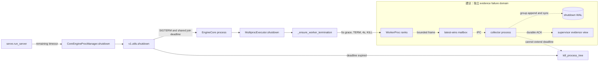

> 源码基线：[`vllm-project/vllm@729ebac4`](https://github.com/vllm-project/vllm/commit/729ebac4983e1510e035bc579142b0fc210a49a3)，提交时间为 2026-09-19。相对上一章的 `95f4925c` 前进了 141 个 commit；直接比较确认，本文涉及的 `serve.py`、EngineCore process manager、通用 process shutdown、Multiproc Worker 退出链和 KV event publisher 均未改变。最新提交只调整 model-initialization 测试的 GPU memory cleanup，不改变本章结论。

## 本篇在课程路线中的位置

第 29–34 章已把 rank 身份、remaining budget、sideband、WAL durable prefix 与 atomic terminal checkpoint 串起来。本章只回答一个边界：**证据持久化自身失败时，谁拥有最后的时间？**

课程位置：

`rank-scoped evidence → WAL durable prefix → durability failure isolation → KILL 后 join/reap`

先划清事实：当前 vLLM 没有 `ShutdownEvent`、`ShutdownWAL` 或 `TerminalCheckpoint`；下面的 WAL、group commit 和 `sync_cutoff` 是基于现有退出链推导的建议协议，不是已合入实现。

## 前置知识回顾

上一章区分四个证据等级：collector 收到、`write()` 返回、WAL `fsync()` 完成、terminal checkpoint 经 `rename + directory fsync` 发布。只有同步成功的 prefix 才能跨进程崩溃；CRC 只能发现字节破损，不能把未同步数据变成 durable。

同时保留两条不变量：terminal 必须保留 shutdown 开始时冻结的 expected-rank 集；缺 final 的 rank 只能标记为 `completion_unknown` 或 `abandoned_by_deadline`。今天增加第三条：**durability 是证据增强路径，不是 containment 的前置条件。**

## 本篇要回答的核心问题

当 `write/fsync/rename` 遇到 `ENOSPC`、`EIO` 或永久阻塞时，如何同时满足：

1. 不伪造 durable ACK，保留最后一个已确认 prefix；
2. group commit 不侵占 TERM、KILL 和 reap 的时间；
3. collector 卡死时，持有 child handles 的 supervisor 仍能按 authoritative deadline 收住进程。

## 组件在全局架构中的位置

实线是当前代码，虚线是建议的独立证据路径：



根本所有权是：supervisor 拥有 monotonic deadline、EngineCore/Worker handles 和 signal 权限；collector 只拥有 WAL fd、pending bytes 与 durable prefix。collector 可以降级或被杀，supervisor 不能因它失效而放弃 containment。

## 完整调用链

从公开入口沿当前实现走一遍：

1. [`serve.run_server`](https://github.com/vllm-project/vllm/blob/729ebac4983e1510e035bc579142b0fc210a49a3/vllm/entrypoints/cli/serve.py) 在收到 shutdown 后计算 `shutdown_by = time.monotonic() + timeout`，给 API server、local engine manager 和 coordinator 传剩余时间。
2. API server 的 [`handle_shutdown`](https://github.com/vllm-project/vllm/blob/729ebac4983e1510e035bc579142b0fc210a49a3/vllm/entrypoints/launchers/launcher.py) 在线程池中调用 `engine_client.shutdown(timeout)`；返回后才让 HTTP server 退出。若控制线程内联一个永久阻塞的 `fsync`，HTTP 收口也会被拖住。
3. [`AsyncLLM.shutdown`](https://github.com/vllm-project/vllm/blob/729ebac4983e1510e035bc579142b0fc210a49a3/vllm/v1/engine/async_llm.py) 进入 [`MPClient.shutdown`](https://github.com/vllm-project/vllm/blob/729ebac4983e1510e035bc579142b0fc210a49a3/vllm/v1/engine/core_client.py)，后者把 timeout 交给 process manager。
4. [`CoreEngineProcManager.shutdown`](https://github.com/vllm-project/vllm/blob/729ebac4983e1510e035bc579142b0fc210a49a3/vllm/v1/engine/utils.py) 选择 process timeout，再调用 [`v1.utils.shutdown`](https://github.com/vllm-project/vllm/blob/729ebac4983e1510e035bc579142b0fc210a49a3/vllm/v1/utils.py)：先广播 `SIGTERM`，以同一 monotonic deadline 逐个 `join(remaining)`，最后 `kill_process_tree`。
5. EngineCore 的 [`MultiprocExecutor.shutdown`](https://github.com/vllm-project/vllm/blob/729ebac4983e1510e035bc579142b0fc210a49a3/vllm/v1/executor/multiproc_executor.py) 关闭 death-pipe writer；Worker 默认自清理 5 秒，之后 `terminate()`，再等 4 秒，仍存活则 `kill()`。

两条真实 KILL 路径都没有在发送 KILL 后显式 `join/reap`。因此未来 collector 不能吃掉 deadline 尾部；那段时间属于 containment owner。

## 关键类型、字段和状态生命周期

下面是**建议接口**：

```python
@dataclass(frozen=True)
class ShutdownBudget:
    generation: int
    contain_deadline_ns: int
    sync_cutoff_ns: int
    reap_reserve_ns: int

@dataclass
class DurabilityState:
    durable_end: int
    pending_end: int
    mode: Literal["healthy", "degraded", "failed"]
    last_errno: int | None
    sync_inflight: bool
```

输入是有上限的 CPU byte frame；没有 tensor shape、dtype 或 accelerator device。collector 独占 fd；supervisor 只消费 ACK、reason 和 `durable_end`。前置条件是 generation、rank/owner identity 与单调 seq 已验证；后置条件是 ACK 只覆盖成功同步的完整 frame prefix。

生命周期是：append 只推进 `pending_end`；group sync 成功才推进 `durable_end` 并批量 ACK；`ENOSPC/EIO` 不推进 durable prefix，而是记录稳定 reason 并降级；terminal 冻结后 late ACK 不能改写结论；最后 collector 自身也必须在 containment deadline 内被隔离和回收。

## 逐函数源码解读

`serve.run_server` 已有共享 monotonic deadline，证明多组件不能各自重开完整 timeout。但 deadline 只是等待策略，不是 syscall cancellation primitive：同线程卡在内核态 `fsync` 时，`max(deadline-now, 0)` 无法发出 KILL。

`v1.utils.shutdown` 把 process 的 join 放在同一 deadline 下，这是正确的总预算形态；缺口是 `kill_process_tree` 后没有再次 join。因此建议预算必须满足：

```text
sync_cutoff <= contain_deadline - reap_reserve
```

`_ensure_worker_termination` 使用 `time.time()`，并重新开启 `5s + 4s` 窗口，没有接收顶层 remaining budget。这里的数字是代码事实，不是推荐常量；真正契约应传剩余 duration，并为 KILL 后 reap 保留尾部。

[`ZmqEventPublisher.shutdown`](https://github.com/vllm-project/vllm/blob/729ebac4983e1510e035bc579142b0fc210a49a3/vllm/distributed/kv_events.py) 最多等待队列 1 秒，随后 bounded join，并用 `linger=0` 关闭 socket。它只有进程内 replay，不提供 crash durability；但它证明当前代码已经采用“telemetry 不能无限阻塞退出”的 liveness 取舍。

## 具体示例与 shape/状态演算

设 TP=2：rank 0 正常完成 device cleanup，rank 1 永久卡在 native synchronize。用一个**建议协议演算**：总 containment 预算 10 秒，沿用当前 Worker 的 5 秒 grace 和 4 秒 TERM wait，最后 1 秒预留给 KILL 后 join/reap，因此 collector 的 `sync_cutoff` 不晚于 `t0+5s`。

rank 0 的 final frame 为 512 B；collector 在 `t=4.5s` 开始 sync，底层设备永久阻塞：

```mermaid
sequenceDiagram
    participant R0 as Worker rank 0
    participant R1 as Worker rank 1
    participant C as Collector process
    participant S as Supervisor
    R0->>C: final seq=8, 512 B
    C->>C: append; pending_end=4096
    C->>C: fsync hangs at t=4.5s
    Note over C: durable_end stays 3584; no ACK
    S->>R1: TERM at t=5s
    S->>R1: KILL at t=9s
    S->>R1: join/reap in t=9..10s
    S->>C: contain collector if still blocked
    S->>S: freeze terminal report
```

结果必须写成：expected ranks 仍是 `{0,1}`；rank 0 的 final 是 `memory_seen`、durability `unknown`；rank 1 是 `abandoned_by_deadline`。不能把 rank 0 标为 durable，也不能因磁盘失败删掉 rank 1。

若 append 遇到 `ENOSPC` 并产生 short write，`pending_end` 只能停在最后一个完整 frame boundary；若 sync 返回 `EIO`，CRC 也不能证明 tail 已落盘，仍只能承认旧的 `durable_end=3584`。

## 为什么这样设计及替代方案

硬约束只有两个：不得伪造 durable evidence；不得让 evidence path 阻止隔离失控进程。

- inline `fsync` 实现最简单，但一次不可中断 I/O 就能阻塞唯一 kill owner，不成立。
- 后台 thread 能隔离 event-loop 等待，却不能可靠取消正在执行的 `fsync`，且仍与 supervisor 共用进程命运，只适合 best-effort sink。
- 独立 collector process 增加 IPC、generation fencing 和 crash recovery 成本，却允许 supervisor 在 cutoff 后直接停止等待并继续 TERM/KILL/reap，是 durable evidence 下最小充分隔离。

group commit 按 `N frames` 或 `Δt` 同步一次，成功后 ACK `offset <= durable_end` 的 frame；它减少 IOPS 与尾延迟，却扩大未同步窗口。terminal 可以在 cutoff 前强制 flush，cutoff 后只能返回 degraded verdict，不能无限重试。`EINTR` 可在 remaining budget 内有限重试；`ENOSPC` 应快速失败，`EIO` 应停止信任受影响 tail。

## 性能、并发、正确性与边界条件

latest-wins progress 加 terminal 独立 slot，把内存限制在 `O(ranks × owners)`；group commit 把同步次数从事件数降到 batch 数。ACK 发布必须晚于 durable prefix 原子推进；同 seq 不同 payload 必须 fail closed；旧 generation 的 ACK 一律丢弃。

`sync_cutoff` 只决定是否开始或继续等待 sync，不能让 syscall 可取消。`reap_reserve` 应由平台测量与 backend contract 给出，不能把例子的 1 秒硬编码为全局常量。需要观测 sync latency、pending bytes/age、last durable seq、last errno、TERM/KILL/reap outcome；指标只能报告，不能反向续期 deadline。

## 测试证据与未覆盖风险

- [`test_multiproc_executor_worker_termination_timeout`](https://github.com/vllm-project/vllm/blob/729ebac4983e1510e035bc579142b0fc210a49a3/tests/v1/executor/test_executor.py) 用 fake wall clock 覆盖“grace 内退出”和“超时后调用 terminate”；fake process 没有 `kill/join`，所以不证明 KILL、reap 或 I/O 阻塞下的顺序。
- [`test_forward_error.py`](https://github.com/vllm-project/vllm/blob/729ebac4983e1510e035bc579142b0fc210a49a3/tests/v1/shutdown/test_forward_error.py) 在 rank 0 注入 forward exception，验证所有请求收到 `EngineDeadError`，并等待 GPU memory 低于阈值；它证明故障传播与一定程度的资源收敛，不证明 durable evidence。
- [`test_engine_core_process_shutdown_timeout`](https://github.com/vllm-project/vllm/blob/729ebac4983e1510e035bc579142b0fc210a49a3/tests/v1/engine/test_startup_watch_processes.py) 覆盖 ROCm immediate-abort 的额外 cleanup grace，并确认正 request timeout 的零剩余预算不能重开窗口；它没有覆盖磁盘故障。

源码搜索没有发现 shutdown 路径的 `ENOSPC`、`ShutdownWAL` 或 crash-at-every-write 测试。应新增 helper process fault matrix：short write、bounded `EINTR`、`ENOSPC`、`EIO`、阻塞 sync、rename/dir-sync failure、ACK loss 与 collector crash。每例都要断言 failed sync 不 ACK、TERM/KILL/reap 不后移、expected ranks 不丢失、cutoff 后无重试风暴。

## 与前后章节的连接

第 34 章回答“何时可以叫 durable”；本章回答“durability 做不到时谁仍推进退出”。下一章处理真实 containment 尾部：区分“KILL 已发送”“process 已退出”“pid 已回收”“descendant tree 已清空”，并补 MP join/reap 的测试协议。

## 第 29–35 章知识图谱回顾

七章主链已经闭合为：

`Worker device final → expected-rank aggregate → native hang escalation → cross-layer remaining budget → backend-specific containment → bounded sideband → WAL durable prefix → durability fail-open`

其中有三组正交结论：cleanup evidence 不等于 process isolation；durable ACK 不等于 terminal completeness；diagnostic failure 不得续期 containment。后续路线因此从“继续加字段”转向验证终态所有权：先补 KILL 后 reap，再把同一 terminal contract 落到 MP、Ray 与 external launcher adapter。

## 本篇结论、知识债、三个理解检查问题和下一章

结论：durability 必须与 containment 分离 failure domain；ACK 只覆盖 successful sync prefix；group commit 只能使用 `sync_cutoff` 之前的预算；`ENOSPC/EIO` 后证据可以降级，但 TERM/KILL/reap 必须继续。

知识债：实际 `ShutdownEvent/ShutdownWAL`、独立 collector、stable durability reason、short-write/EINTR loop、preallocation/rotation、group-commit benchmark、MP/Ray/torchrun adapter、KILL 后 join/reap、Python/Rust wire golden，以及真实 CUDA/NCCL hang 联合磁盘故障 E2E。

理解检查：

1. 为什么 `asyncio.wait_for` 不能取消同线程卡死的 `fsync`？
2. 一批 frame 已 `write()`，但 group sync 返回 `EIO`，哪些 offset 可以 ACK？
3. 为什么 `sync_cutoff` 必须早于 `contain_deadline`，且 reserve 不能照抄示例的 1 秒？

下一章：**KILL 之后谁收尸——join/reap、PID reuse 与 Process Tree Containment Final。**

## 课程账本增量

- 当前阶段：测试、性能与故障诊断；完成 durability failure 与 containment deadline 的隔离边界。
- 新增事实：顶层已有 shared monotonic deadline；Worker 仍使用独立 wall-clock `5s + 4s`；两条 KILL 路径均缺显式 reap；KV event publisher 是 bounded、非 durable 的 fail-open 类比。
- 新增不变量：durability 不得阻塞或续期 containment；ACK 只覆盖 successful sync prefix；sync cutoff 必须给 TERM/KILL/reap 留 reserve；durability verdict 与 containment verdict 正交。
- 下一章：KILL 后 join/reap、PID reuse 与 descendant tree 的可观测终态。
