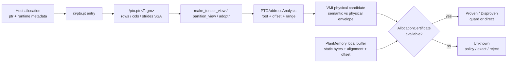
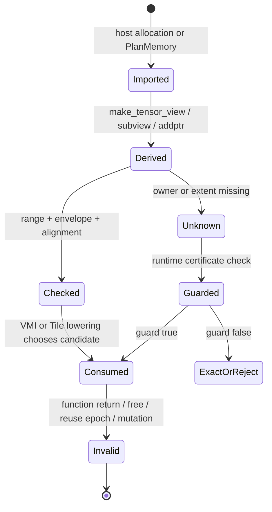

> 源码基线：PTOAS [`9b81c7a9`](https://github.com/hw-native-sys/PTOAS/commit/9b81c7a9614a179b534532a42ec36273b910244f)，默认分支为 `master`。本文以当前 pointer-first ABI、`PtrType`、`PTOAddressAnalysis`、`PTOVPTOPtrBoundary` 和 `PTOPlanMemoryModern` 为代码事实；`AllocationCertificate` 及其导入方式是从现有缺口推导的建议契约，主干尚未实现。直接相关历史事实是提交 [`4f849408`](https://github.com/hw-native-sys/PTOAS/commit/4f849408b76c836e17387e4b8bfa47777b650f01) 明确写下：裸 pointer 没有 allocation length，完整块可读性仍是调用方责任。

## 本篇在 PTO 课程路线中的位置

课程 38–40 已把 `Proven / Disproven / Unknown`、proof invalidation，以及 `RuntimeGuard ? fast : exact` 串成一条决策链。但 runtime guard 若拿不到可信的 owner、extent、alignment 和 generation，只是把编译期的 Unknown 推迟到运行期。

本章只回答一个问题：**这些事实应从哪里进入编译器？** 位置是：

`Unknown recovery → function ABI certificate → runtime guard → exact fallback`。

## 前置知识

- raw pointer 给出地址值，不天然给出 allocation 边界。
- shape/stride 描述 view 的索引映射，不等同于 backing allocation 的真实容量。
- `PTOAddressAnalysis` 能推导 root、offset、range、alignment remainder；它不负责 allocation、alias 或 lifetime。
- 相同 pointer bits 在 free/reuse 后可以属于新 owner generation，旧 proof 必须失效。

## 今日 1–2 个核心问题

1. 当前 PTODSL → PTO IR → VPTO/EmitC 链上，哪些 ABI 事实真实存在，哪些在边界处丢失或从未出现？
2. 外部 GM pointer 与编译器自有 local buffer 应怎样分别产生可信的 `AllocationCertificate`？

## PTO 全栈中的位置



上游 host/runtime 是外部 allocation 的唯一权威；compiler `PlanMemory` 是本地 scratch allocation 的权威。view 和 address analysis 只能派生坐标，不能凭空创造 owner capacity。

## 概念和精确语义

### 当前 ABI 真正携带什么

PTODSL [kernel entry 文档](https://github.com/hw-native-sys/PTOAS/blob/9b81c7a9614a179b534532a42ec36273b910244f/ptodsl/docs/user_guide/03-kernel-entry-and-subkernels.md) 把 host-launchable entry 定义成 pointer-first ABI：显式 GM pointer、runtime scalar、keyword-only `const_expr`。Quick Start 的 `tile_copy` 接口是：

```python
def tile_copy(
    A_ptr: pto.ptr(pto.f32, "gm"),
    O_ptr: pto.ptr(pto.f32, "gm"),
    rows: pto.i32,
    cols: pto.i32,
    *,
    BLOCK: pto.const_expr = 128,
):
    a_view = pto.make_tensor_view(
        A_ptr, shape=[rows, cols], strides=[cols, 1]
    )
```

这里能确认 `A_ptr` 的 element type 与 GM space，也能用 `rows/cols/strides` 计算逻辑索引；不能确认 host 实际分配了多少字节、pointer 是否指向 allocation base、另一个参数是否 alias 同一 allocation，以及该地址是否已被释放后复用。

[`PtrType`](https://github.com/hw-native-sys/PTOAS/blob/9b81c7a9614a179b534532a42ec36273b910244f/include/PTO/IR/PTOTypeDefs.td) 进一步把事实边界写死：它只有 `elementType` 与 `memorySpace` 两个参数。owner、extent、base offset、alignment 与 generation 都不在类型中。

因此必须区分三类对象：

| 对象 | 回答的问题 | 不能回答 |
| --- | --- | --- |
| `PointerValue` | 当前地址是多少、元素类型/空间是什么 | backing allocation 多大、是否仍存活 |
| `ViewDescriptor` | shape/stride 如何把索引映射到 byte offset | 映射末端是否仍在 allocation 内 |
| `AllocationCertificate` | owner、base、guard、alignment、generation 是否覆盖 candidate | 具体 backend 应选哪条指令 |

### 建议的最小 certificate

```text
AllocationCertificate {
  owner_token
  allocation_base
  allocation_bytes
  readable_guard_bytes
  guaranteed_alignment
  generation
  memory_space
}
```

`allocation_bytes` 是语义上归该 owner 的容量；`readable_guard_bytes` 可以更大，例如 allocator 明确提供 padding page，但它不表示 extra bytes 已定义。写仍须满足 semantic write set；读还要单独证明 consumer 不观察未定义 padding。

一个 candidate 在 `[minOffset, maxOffset + physicalEnvelope)` 上安全，至少要求：

$$
0 \le minOffset,\qquad
maxOffset + physicalEnvelope \le readableGuard
$$

$$
(base + minOffset) \bmod requiredAlignment = 0
$$

并且 offset 算术 no-wrap、certificate generation 仍 live。

## 真实文件、类型、API 或指令逐段解读

### 1. `_PtrDescriptor → PtrType`

[`ptodsl/_types.py`](https://github.com/hw-native-sys/PTOAS/blob/9b81c7a9614a179b534532a42ec36273b910244f/ptodsl/ptodsl/_types.py) 中 pointer annotation 最终只构造 `PtrType(elementType, memorySpace)`。这是公开 Python ABI 到 PTO IR 的第一条证据：extent 并未隐藏在 descriptor 里。

### 2. view 产生索引事实，不产生 allocation 事实

`make_tensor_view(A_ptr, shape, strides)` 把 runtime scalar 变成 view state。即使 `shape=[4,100]`，也不能推出 allocation 恰好是 400 个 `f32`；host 可能传入 1600 B、2048 B、一个大 allocation 的 interior pointer，甚至错误地只分配 1596 B。

更重要的是，strided view 的最大 byte end 不是 `numel * elementBytes`。正 stride 下应至少计算：

$$
viewEnd =
\left(\sum_i (shape_i-1)\times stride_i + 1\right)\times elementBytes
$$

它仍只是 view claim，只有与 certificate 交叉验证后才成为可用事实。

### 3. `PTOAddressAnalysis` 的对齐前提

[`PTOAddressAnalysis.h`](https://github.com/hw-native-sys/PTOAS/blob/9b81c7a9614a179b534532a42ec36273b910244f/include/PTO/Analysis/PTOAddressAnalysis.h) 明确声明不做 alias/disjointness/memory-dependence 结论。实现中的 [`getKnownPointerRemainder`](https://github.com/hw-native-sys/PTOAS/blob/9b81c7a9614a179b534532a42ec36273b910244f/lib/PTO/Analysis/PTOAddressAnalysis.cpp) 把 pointer block argument 视为满足 address-space ABI alignment，再组合 `addptr` offset 求 remainder。

代码事实是“存在一个隐式 ABI alignment contract”；公开 `PtrType` 却没有携带可比较的最小 alignment 数值。稳妥做法应是：

```text
requiredAlignment <= certificate.guaranteedAlignment
    ? baseRemainder = 0
    : alignment = Unknown
```

否则“某个 ABI 对齐”容易被错误外推成“任意请求对齐”。

### 4. emission boundary 主动收缩信息

[`PTOVPTOPtrBoundary.cpp`](https://github.com/hw-native-sys/PTOAS/blob/9b81c7a9614a179b534532a42ec36273b910244f/lib/PTO/Transforms/Passes/PTOVPTOPtrBoundary.cpp) 的注释非常直接：VPTO emission boundary 只保留 same-space base pointer，shape/stride state 留在 SSA。它把 `BaseMemRefType` 变成 `PtrType`，也拒绝 memref result。

这不是 bug，而是 codegen ABI 的简化选择；代价是 safety certificate 必须在边界前被消费，或以独立 SSA token/argument 保留，不能期待 raw pointer 在发射时重新找回 extent。

### 5. PlanMemory 为何是另一类 owner

[`PTOPlanMemoryModern.cpp`](https://github.com/hw-native-sys/PTOAS/blob/9b81c7a9614a179b534532a42ec36273b910244f/lib/PTO/Transforms/Passes/PTOPlanMemoryModern.cpp) 已经计算 `slotBytes`、`totalBytes`、`alignmentBytes`、lifetime index 和 planned offset；`computeStaticBufferBytes` 还能处理普通 static shape 与 `RowPlusOne` footprint。

因此 compiler-owned local buffer 无需向 host 索要 extent：

```text
owner = (kernel invocation, address space, reuse group)
base/bytes/alignment = PlanMemory result
generation = invocation or reuse epoch
```

但 reuse group 的物理地址相同不表示 owner generation 永久相同。前一 logical buffer lifetime 结束、slot 被重新分配后，旧 certificate 必须终止。

## 对象 / IR 生命周期



外部参数的 certificate 由 launcher/runtime 创建并拥有；function entry 只借用。view 保留同一 `owner_token/generation`，只更新相对 byte range。phi/loop 若合流不同 owner，必须保存候选集合或降为 Unknown。lowering 消费 proof 后，function return 或 async lease 结束使 certificate 失效。

## 端到端调用链或指令链

`@pto.jit annotation → _PtrDescriptor → !pto.ptr<T,gm> + scalar metadata → make_tensor_view → partition_view/addptr → PTOAddressAnalysis → VMI MemoryAccessPlan → physical candidate → certificate/verdict → VPTO/EmitC emission`。

当前真实链在 `certificate/verdict` 处缺一段：memref static shape 能给部分 envelope，raw `PtrType` 通常只能得到地址/对齐事实，于是 strict path 为 Unknown，默认 policy 可放行。建议链是在 function entry 导入独立 certificate，并在 `PTOVPTOPtrBoundary` 丢掉 descriptor 之前完成或 materialize guard。

## 具体 shape、Tile 和状态演算

沿用前几章的 `vreg<100xf32>`：

- semantic payload：`100 × 4 = 400 B`；
- full-carrier candidate：`2 × 64 × 4 = 512 B`；
- required alignment：32 B；
- base offset：0。

三次调用传入完全相同的 `ptr` 类型与 `N=100`：

| Runtime certificate | semantic exact | 512 B fast candidate | verdict |
| --- | ---: | ---: | --- |
| `guard=512, align=32, gen=7 live` | 安全 | 安全 | fast `Proven` |
| `guard=400, align=32, gen=7 live` | 安全 | 越界 112 B | fast `Disproven`，走 exact |
| 无 extent，仅 raw pointer | 可能安全 | 无法判断 | `Unknown` |

shape `100` 在三行完全相同，所以 shape 不能区分结论。若第三次调用的地址数值恰好与第一次相同，但 runtime 已 free/reallocate，`generation=8`；缓存的 generation 7 proof 也必须失效。

再看 `shape=[4,100], strides=[128,1], f32`：

$$
viewEnd=((4-1)\times128+(100-1)+1)\times4=1936 B
$$

不是 `4×100×4=1600 B`。证书若只有 1800 B，view 本身已非法；若有 2048 B，view 合法，但从某个 interior offset 发起 512 B candidate 仍需重新检查末端，不能复用“整个 view 合法”替代 access proof。

## 为什么这样设计及替代方案

### 方案 A：把所有字段塞进 `PtrType`

优点是类型自描述；缺点是动态 extent/generation 不适合作为编译期 type parameter，所有 pointer cast、call 和 backend ABI 都要改，维护成本最高。

### 方案 B：扩宽 public ABI

把每个 pointer 展开为 `(ptr, extent, alignment, owner, generation)`。它容易生成 runtime guard，也便于跨语言 ABI；但参数数目膨胀，而且不可信 caller 可以伪造 metadata。只有 launcher 从受控 allocator/registry 取得数据时，certificate 才称得上可信。

### 方案 C：raw pointer + 独立 certificate token

host entry 由 runtime registry 导入 opaque certificate；IR 内以 SSA token 传播，codegen 仍保留 raw pointer。PlanMemory 则静态构造 token。这个方案改动集中，能让 VPTO/EmitC 共用 proof，又不强迫所有后端采用 fat pointer，因此是最小可行方向。

代价是 compiler pass 必须维护 token 与 pointer/view 的关联；异步执行还要让 generation/lease 覆盖真实设备访问完成，而非仅覆盖 host launch 返回。

## 访存、计算、流水、并行和硬件约束

- **延迟**：每次 access 做动态 guard 会增加 scalar 指令与分支；loop-invariant certificate 可在 preheader 检查一次。
- **吞吐**：certificate 让 strict 模式保留 full-carrier fast path；没有它只能 policy 放行、exact slow path或拒绝。
- **内存**：fat ABI/token 会增加参数与元数据，但不改变 payload 本身；exact fallback 可能增加 gather、scalar load 或 scratch。
- **流水**：guard 必须先于首个相关 DMA/vector access完成；不能在已发出 over-read 后再补检查。
- **并行**：同一 owner 的多 view 可共享 immutable certificate；generation 更新必须对并发 launch 可见。
- **graphability**：固定地址/extent/generation 有利于 graph replay；若 allocator 在 replay 间换代，旧 guard 和 graph key 一起失效。
- **正确性**：arg index 不能充当 owner identity，因为两个参数可以 alias，同一参数也可以是 interior pointer。

## 测试证据与未覆盖风险

当前直接测试能证明：

- [`address_analysis.pto`](https://github.com/hw-native-sys/PTOAS/blob/9b81c7a9614a179b534532a42ec36273b910244f/test/lit/vpto/address_analysis.pto) 覆盖 typed recurrence、range、no-wrap、unit conversion 与 Unknown reason；它不验证 allocation capacity。
- [`vmi_to_vpto_memory_alignment_safety_invalid.pto`](https://github.com/hw-native-sys/PTOAS/blob/9b81c7a9614a179b534532a42ec36273b910244f/test/lit/vmi_new/vmi_to_vpto_memory_alignment_safety_invalid.pto) 用 raw `PtrType` 与 `memref<65xf32>` 区分缺少 proof 和已知 envelope；strict policy 保留 residual，写侧精确拒绝。
- [`vmi_short_load_alignment.pto`](https://github.com/hw-native-sys/PTOAS/blob/9b81c7a9614a179b534532a42ec36273b910244f/test/lit/vmi_new/vmi_short_load_alignment.pto) 验证动态对齐、base+offset 联合 remainder、static memref envelope，以及 raw pointer 的 stateful lowering。
- [`vmi_short_vector_load_block_boundary_invalid.pto`](https://github.com/hw-native-sys/PTOAS/blob/9b81c7a9614a179b534532a42ec36273b910244f/test/lit/vmi_new/vmi_short_vector_load_block_boundary_invalid.pto) 明确写出 bare `!pto.ptr` 不能提供 whole-register over-read proof。

提交 `4f849408` 还报告了 1883 项 lit、75 项 CTest，以及最终设备矩阵；这是该提交的测试事实，不等同于本章建议的 certificate 已验证。

尚未覆盖：

1. host allocation registry 到 function entry 的真实导入；
2. 两个 ABI 参数 alias 同 owner、interior pointer 与 subview；
3. pointer bits 相同但 generation 改变；
4. forged extent/alignment、整数 `castptr` 与 overflow；
5. PlanMemory reuse epoch 和 async access完成之间的 lifetime；
6. VPTO/EmitC 对同一 certificate 的 verdict golden；
7. A5 guard-page、canary、poison 和 fast/exact 性能矩阵。

## 与前后章节的连接

前章定义了 Unknown 后的 action；本章给 runtime guard 提供事实来源，并把“shape 是 claim、certificate 才是 owner evidence”固定为新不变量。下一章应进一步讨论 ABI certificate 如何穿过 call、cast、subview、phi 和 async launch，并建立 verifier：任何需要读 certificate 的 pass 若看见丢失、冲突或过期 generation，都必须降为 Unknown。

## 本篇结论、知识债、三个理解检查问题和下一章

结论：

1. 当前 `PtrType` 只知道 element type 与 memory space；pointer-first ABI 的 shape/stride 也不能证明 backing allocation。
2. 外部 allocation certificate 必须由可信 runtime/allocator 导入；compiler-owned local buffer 可由 PlanMemory 静态生成。
3. certificate 与 view/address expression 分工：前者给 owner/extent/alignment/generation，后者给 offset/range；两者组合后才能证明 physical candidate。
4. emission boundary 可以继续使用 raw pointer，但 certificate 必须在边界前被消费或转成独立 guard/token。

知识债：shared `AllocationCertificate` IR、host registry/ABI、call/phi传播、PlanMemory reuse generation、async lease、stable reason code、VPTO/EmitC golden、A5 fault/poison/perf。

理解检查：

1. 为什么 `shape=[100]` 不能证明 `vreg<100xf32>` 的 512 B physical carrier 可读？
2. 为什么 function argument 序号不能作为 owner identity？
3. PlanMemory 已知 offset/size/alignment 后，为什么物理 slot reuse 仍需要 generation？

下一章：**Certificate 怎样穿过调用边界——call/cast/subview/phi 的 owner closure、async lease 与 verifier。**

## 课程账本增量

- 章节：41
- 主线：`function ABI → AllocationCertificate → runtime guard`
- 新确认：pointer、view 与 allocation certificate 是三个不同层次；shape/stride 不能冒充 extent；arg index 不能冒充 owner；对齐必须是有上限的 ABI guarantee；PlanMemory reuse 必须换代。
- 新覆盖：PTODSL pointer-first entry、`_PtrDescriptor`、`PtrType`、`PTOAddressAnalysis`、`PTOVPTOPtrBoundary`、`PTOPlanMemoryModern` 与四组 address/memory lit。
- 下一章：call/cast/subview/phi/async 对 certificate 的传播和失效。
