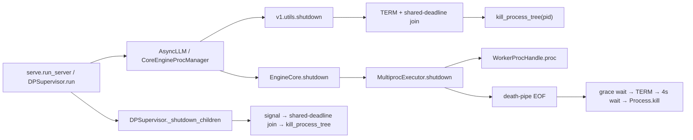
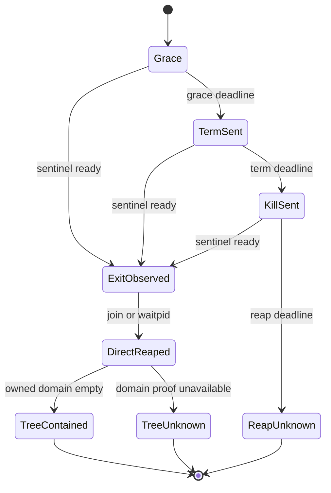

> 源码基线：vLLM [`a7fda4c8`](https://github.com/vllm-project/vllm/commit/a7fda4c88bfc421d31e33acc5e01e86ebe467ad8)，默认分支 `main`，核验日期 2026-09-20。相对上一章的 `729ebac4` 前进 22 个 commit；本文直接分析的进程退出文件未发生变化。

## 本篇在课程路线中的位置

上一章把 durability 与 containment 拆开：即使 WAL 遇到 `ENOSPC`、`EIO` 或永久阻塞的 `fsync`，强杀与回收也不能超出 containment deadline。本章只追最后一段：

`TERM → bounded wait → KILL → exit observed → direct child reaped → owned process tree empty`

核心不是“怎样再发一次 `SIGKILL`”，而是：**谁有资格宣布进程已被收干净，证据究竟覆盖一个 PID、一个直接子进程，还是完整的后代域？**

## 前置知识回顾

前几章已经确认三点：

1. Worker 的 cleanup final 与进程隔离 final 正交；`SIGKILL` 后缺失的 device final 只能记作 unknown。
2. 所有阶段必须消费同一条 monotonic deadline；durability 只能用 deadline 前的预留片段。
3. `SIGTERM` 允许进程运行清理逻辑，`SIGKILL` 只是内核强制终止动作，不会产生应用层 ACK。

现在还差一个常被日志掩盖的边界：**KILL 已发送不等于目标已退出；目标已退出也不等于父进程已 reap；直接子进程已 reap 更不等于它产生的所有后代都消失。**

## 本篇要回答的核心问题

1. 当前 vLLM 的 EngineCore manager、`MultiprocExecutor` 和 `DPSupervisor` 在 KILL 后分别持有什么证据？
2. 为什么裸 `pid` 不是稳定身份，递归快照也不是稳定的 process-tree ownership？
3. 一个有 deadline 的 `ProcessTreeFinal` 至少要记录哪些状态，测试又应证明什么？

## 组件在全局架构中的位置

`BaseProcess`/`multiprocessing.Process` 是父进程持有的直接子进程句柄。本章没有 GPU Tensor，因此没有 shape、dtype 或 device 参数；关键“数据”是 `Process handle / pid / sentinel / exitcode`，关键所有权是“哪个 supervisor 创建并负责回收哪个直接子进程”。



这三条路径共享同一个缺口：KILL 之后没有一段统一的、带剩余预算的 `join/reap + descendant verification`。

## 完整调用链

公开服务入口退出时，`serve.run_server` 进入 `AsyncLLM.shutdown`，再由 `MPClient/CoreEngineProcManager` 关闭 EngineCore。进程管理器最终调用 [`v1.utils.shutdown`](https://github.com/vllm-project/vllm/blob/a7fda4c88bfc421d31e33acc5e01e86ebe467ad8/vllm/v1/utils.py#L610-L658)：先向存活进程发 `SIGTERM`，在一个共享 monotonic deadline 内逐个 `join(remaining)`，然后对仍存活的 PID 调用 `kill_process_tree(pid)`。

EngineCore 内部则走 [`MultiprocExecutor.shutdown`](https://github.com/vllm-project/vllm/blob/a7fda4c88bfc421d31e33acc5e01e86ebe467ad8/vllm/v1/executor/multiproc_executor.py#L451-L535)：父进程先关闭每个 Worker 的 `death_writer`，让子进程从 `death_pipe` 读到 EOF；等待 `VLLM_WORKER_SHUTDOWN_TIMEOUT_SECONDS` 后仍存活才发 `SIGTERM`，再等 4 秒，最后调用 `Process.kill()`。随后代码关闭 response MQ，却没有在 KILL 后再次 `join`。

DP 部署还有第三条链：[`DPSupervisor._shutdown_children`](https://github.com/vllm-project/vllm/blob/a7fda4c88bfc421d31e33acc5e01e86ebe467ad8/vllm/entrypoints/launchers/dp_supervisor.py#L514-L557) 先向每个 DP server 发配置的 shutdown signal，用 [`_join_processes_with_timeout`](https://github.com/vllm-project/vllm/blob/a7fda4c88bfc421d31e33acc5e01e86ebe467ad8/vllm/entrypoints/launchers/dp_supervisor.py#L168-L174) 消费共享 deadline，`finally` 中再对剩余进程调用 `kill_process_tree`，同样没有第二次 join。

## 关键类型、字段和状态生命周期

Worker 的进程对象从 [`WorkerProc.make_worker_process`](https://github.com/vllm-project/vllm/blob/a7fda4c88bfc421d31e33acc5e01e86ebe467ad8/vllm/v1/executor/multiproc_executor.py#L705-L755) 开始生命周期：

1. 父进程创建 `ready pipe`、`death pipe` 和 `multiprocessing.Process`；
2. `proc.start()` 后，`UnreadyWorkerProcHandle` 持有 `proc`、rank、ready reader 和 death writer；
3. Worker READY 后转换成 `WorkerProcHandle`，进入 `self.workers`，Executor 持有它；
4. shutdown 关闭 death writer，消费 `proc.is_alive()/terminate()/kill()`；
5. 当前路径在 KILL 后关闭 MQ 并返回，但没有显式消费最终 `exitcode`、`join` 或 `close`。

Python 官方文档明确：POSIX 子进程结束但未 join 会成为 zombie，并建议显式 join；`join(timeout)` 返回 `None` 时还必须检查 `exitcode` 才能区分“已退出”和“超时”。参见 [`multiprocessing.Process` 文档](https://docs.python.org/3/library/multiprocessing.html#the-process-class)。

为避免混淆，可以把证据拆成四级：

| 等级 | 证据 | 能证明什么 |
| --- | --- | --- |
| S0 | `TERM/KILL sent` | supervisor 发起了动作 |
| S1 | sentinel ready / `exitcode != None` | 直接子进程已终止 |
| S2 | `join/waitpid` 完成 | 直接子进程已被父进程回收，不再是 zombie |
| S3 | owned descendant domain empty/isolated | 该服务拥有的整棵进程域不再运行 |

这四层不能压成一个布尔值。S0 失败时，supervisor 连隔离动作都没有完成；S1 失败时，目标可能仍占用 PID、文件描述符、共享内存或设备上下文；S2 失败时，进程虽不再执行，却仍可能留下 zombie 与未消费的 exit status；S3 失败时，直接 child 已经干净，但 helper、resource tracker 或它在退出窗口产生的后代仍可能持有端口和共享资源。对滚动升级而言，S3 不完整会让新副本遇到端口占用；对故障诊断而言，把 S0 写成 complete 会掩盖“信号送达但内核尚未完成退出”；对资源守恒而言，把 S1 当作 S2 又会让 parent 丢失唯一可回收的 child handle。

同样要注意，Python 的 `Process.is_alive()` 在 POSIX 上可能顺带 join 一个已经完成的进程，这能缩小 zombie 窗口，却不是调用者可审计的终态协议：代码仍没有在 KILL 后遍历 expected handles、固定读取 exitcode 并产出 per-rank final。真正需要的是显式、可测试的后置条件，而不是依赖下一次 `is_alive()`、下一次创建子进程或对象析构“顺便”回收。

当前 KILL 分支同步返回时通常只有 S0。`_SubprocessWrapper` 的 daemon monitor thread 确实会调用 [`proc.wait()`](https://github.com/vllm-project/vllm/blob/a7fda4c88bfc421d31e33acc5e01e86ebe467ad8/vllm/v1/utils.py#L425-L469)，因此它可能稍后异步得到 S2；但 manager 返回前没有 bounded completion evidence，也没有后代域 S3。

## 逐函数源码解读

### `kill_process_tree`：递归快照，不是终态协议

[`kill_process_tree(pid)`](https://github.com/vllm-project/vllm/blob/a7fda4c88bfc421d31e33acc5e01e86ebe467ad8/vllm/utils/system_utils.py#L255-L278) 用 `psutil.Process(pid).children(recursive=True)` 取一次快照，先 `SIGKILL` 所有孩子，再杀 parent。

这是合理的 best-effort 顺序：先杀孩子可减少 parent 先消失造成的重新托管。但它的接口只有裸 PID，返回值也是 `None`，没有返回 killed、missing、exit-observed 或 reaped 集合。由源码可直接确认，它没有 `wait_procs`、`join`、`waitpid` 或 KILL 后重扫。

下面三点是基于实现的系统推断，而不是仓库文档承诺：

- 枚举与发信号之间，后代可以退出、换 PID，或再 fork 新后代；
- `child.pid` 只是数字，快照对象未在 `os.kill` 前核验 `create_time`，存在 PID reuse 竞态；
- 直接子进程被 reap 后，逃逸或被重新托管的孙进程不再能由原父进程用普通 `join` 回收。

Linux 可用 `pidfd` 将信号绑定到进程对象而不是可复用数字，语义见 [`pidfd_open(2)`](https://man7.org/linux/man-pages/man2/pidfd_open.2.html)；但这会降低跨平台性。

### `_ensure_worker_termination`：KILL 是函数最后一个状态

`wait_for_termination` 使用 `time.time()` 轮询 `is_alive()`，而外层 manager 使用 `time.monotonic()`。更关键的是，最后一行状态迁移是 `p.kill()`；函数没有 reserved reap budget，也不检查负信号 exitcode。

2026-01-24 合入的 [PR #32965](https://github.com/vllm-project/vllm/pull/32965) 正确修复了“death pipe 一关就立刻 TERM”的问题，引入 graceful wait；其测试计划证明 TP=2 Worker 能正常清理。它的目标不是 KILL 后终态，因此今天仍保留这个缺口。

### 建议的 `ProcessFinal`

这是课程提出的接口，不是当前 vLLM 类型：

```python
ProcessFinal(
    generation,
    role,
    pid,
    birth_identity,       # create_time or pidfd-backed identity
    signal_sent,
    exit_observed,
    exitcode,
    reaped,
    descendants_contained,
    reason,               # exited | kill_sent_reap_timeout | tree_unknown ...
)
```

`cleanup_completed`、`exit_observed`、`reaped` 与 `descendants_contained` 必须是不同字段；不能用 `exitcode=-9` 反推 device cleanup 成功，也不能用 direct-child join 反推整棵树为空。

### 从动作序列升级为有后置条件的事务

一个可验证的退出协议可以写成下面的状态机。虚线并不表示“可选”，而表示只有超时或证据不足才走降级终态。



协议开始前先冻结 `generation` 和 direct handle 集合，并阻止同一 owner 创建新子进程。然后：

1. Grace/TERM 阶段只处理应用清理；每次等待都从同一个 absolute deadline 计算 remaining。
2. 进入 KILL 前保存 parent-owned snapshot，避免强杀后把缺失证据误写成成功。
3. 对 direct handle 调用 `kill()` 后等待 sentinel；ready 只把状态推进到 `ExitObserved`。
4. 对 ready handle 执行 `join()`，读取 exitcode，并把该 handle 从 owned set 移到 `DirectReaped`。
5. 最后核验进程组、cgroup 或外部 supervisor 的 membership；核验能力不存在时结果必须是 `TreeUnknown`。
6. 到 deadline 仍未观察退出的句柄保留在 terminal 中，reason 写成 `kill_sent_reap_timeout`，不能从 expected set 删除。

前置条件是调用者确实拥有这些 direct handles；后置条件不是“列表为空”，而是每个 expected identity 都有明确 terminal。非法组合包括：`reaped=true` 但 `exit_observed=false`、`descendants_contained=true` 却没有任何 domain proof，以及同一 `generation/role` 出现两个不同 birth identity。这样才能让日志、WAL 与测试消费同一套语义，而不是各自把 “not alive” 解释成不同含义。

## 具体示例与状态演算

设 TP=2，顶层 containment budget 为 10 秒，预留最后 1 秒做 reap：

| 时间 | Rank 0 | Rank 1 | 可得证据 |
| ---: | --- | --- | --- |
| 0.0s | 收到 death-pipe EOF | 卡在 native device call | 仅 shutdown started |
| 5.0s | 已正常退出 | 仍存活，收到 TERM | R0 可观察 exit |
| 5.2s | `join` 完成，`exitcode=0` | 仍卡住 | R0 达到 S2 |
| 9.0s | 已回收 | 收到 KILL | R1 只有 S0 |
| 9.02s | — | sentinel ready，`exitcode=-9` | R1 达到 S1 |
| 9.03s | — | `join` 完成 | R1 达到 S2 |
| 10.0s | 检查 owned domain | 检查 owned domain | 才能冻结 terminal |

现在加入一个边界：Rank 1 的 helper `C` 在递归枚举后、收到 KILL 前 fork 出 `C2`。即使 Worker 本人已经 `join`，`C2` 仍可能存活；因此 aggregate 是：

`direct_reaped={R0,R1}`，但 `descendants_contained=false`。

再看 PID reuse：若快照中的 `C` 已退出，数字 PID 被无关进程复用，之后的 `os.kill(child.pid, SIGKILL)` 可能作用于错误对象。这个窗口通常很小，但终态正确性不能建立在“通常来不及复用”上。

## 为什么这样设计及替代方案

### 方案 A：保留递归 PID 快照，补 KILL 后 join

最小改动是对 direct `Process` 句柄并行 KILL，再用同一 deadline 的剩余预算 `join`，记录 exitcode。它能补齐 S2，成本小、跨平台；但不能消除后代 fork/PID reuse，S3 仍是 unknown。

### 方案 B：POSIX process group/session

每个 Engine/Worker domain 建独立 process group，终止时使用 `killpg`，再等待直接子进程。它比瞬时树快照稳定，也能覆盖稍后 fork 且留在组内的后代；代价是组生命周期、继承和“进程主动换 session 逃逸”都要定义，Windows 还需另一套 adapter。

### 方案 C：Linux pidfd + subreaper/cgroup v2

`pidfd` 解决身份复用；subreaper 可接管孤儿后代；独立 cgroup 可提供更稳定的 membership 与整域 kill。它最接近强 S3，却引入 Linux 版本、权限、容器运行时与部署复杂度。

### 方案 D：外部 supervisor

systemd、Kubernetes runtime 或作业 launcher 负责整域 containment，vLLM 只上报 request cleanup 与 direct-child evidence。这减少应用内平台代码，但必须建立 adapter：外部 “container exited” 也不能冒充每个 Worker 的 device cleanup final。

## 性能、并发、正确性与边界条件

`join/reap` 本身通常很便宜，真正危险的是把 N 个进程各等完整 timeout。正确形式仍是共享 deadline：

`remaining_i = max(0, reap_deadline - monotonic_now)`

可用 `multiprocessing.connection.wait` 一次等待多个 sentinel，再只对 ready 句柄 `join`；这样 TP=8 不会变成 8 倍超时。KILL 前还应先停止新 spawn，冻结 generation-scoped owned set，再执行整域 kill 和终态核验。

若进程卡在内核不可中断睡眠，`SIGKILL` 也可能不能立刻让它消失。此时 deadline 到达后的正确结果不是 “complete”，而是 `kill_sent_reap_timeout`，并把 containment 标记 incomplete/unknown。对 queue/lock 持有者强杀还可能留下共享资源损坏；这正是为什么 KILL 必须是最后手段，且 MQ 关闭不能代替进程终态。

## 测试证据与未覆盖风险

**测试事实：**

- [`test_multiproc_executor_worker_termination_timeout`](https://github.com/vllm-project/vllm/blob/a7fda4c88bfc421d31e33acc5e01e86ebe467ad8/tests/v1/executor/test_executor.py#L59-L89) 的 `_FakeProcess` 只有 `is_alive` 和 `terminate`，验证 grace 超时后是否 TERM；它没有 `kill/join/exitcode`，无法覆盖 KILL→reap。
- [shutdown integration helper](https://github.com/vllm-project/vllm/blob/a7fda4c88bfc421d31e33acc5e01e86ebe467ad8/tests/entrypoints/launchers/test_shutdown.py#L27-L63) 在 shutdown 前拍一组 child PID，并把 `STATUS_ZOMBIE` 排除出 `still_alive`。因此测试证明“预先看到的 PID 不再运行”，不证明 zombie 已被父进程回收，也不覆盖 shutdown 期间新生后代或 PID generation。
- [DP supervisor 单测](https://github.com/vllm-project/vllm/blob/a7fda4c88bfc421d31e33acc5e01e86ebe467ad8/tests/entrypoints/launchers/test_dp_supervisor.py#L250-L281) 验证传给 join helper 的 timeout 是 engine timeout 加 grace，没有验证 finally KILL 后的 join/reap。
- [fault-tolerance E2E](https://github.com/vllm-project/vllm/blob/a7fda4c88bfc421d31e33acc5e01e86ebe467ad8/tests/v1/fault_tolerance/test_fault_tolerance_e2e.py#L191-L199) 会 SIGKILL 单个 Worker 并观察 Engine 故障状态；这验证故障检测，不等于验证 Worker 已被 owner reap。

应新增的最小矩阵：

1. fake process：`kill()` 后 sentinel 延迟 ready，必须在 reserved budget 内 join；
2. KILL 后永不 ready：terminal reason 必须是 `reap_timeout`；
3. zombie 注入：PID 存在且状态 zombie 时测试必须失败，直到 `join/waitpid`；
4. snapshot 后 fork：direct child 已 reap 但 descendant domain 非空时不得 complete；
5. PID generation mismatch：拒绝向仅数字相同的新进程发送旧 generation 的信号；
6. MP、DP supervisor、external launcher 对同一 fixture 产出相同 `ProcessFinal` 语义。

测试断言也要从“最后没有活进程”升级成集合等式。设 `expected={(generation, role, birth_identity)}`，结束时必须满足 `expected = reaped ∪ unreaped_terminal` 且两集合不相交；`TreeContained` 还要求 domain membership 为空。测试应保存每个进程的 birth identity，而不是只保存 PID；否则一个旧进程退出、同号新进程出现时，既可能误判未清理，也可能向无关进程发信号。对 zombie 用例，期望不是等待 `is_running=false`，而是父进程执行 join 后该 child identity 不再出现在可等待集合中。这样测试才真正约束实现，而不是只约束 psutil 的瞬时观察。

## 与前后章节的连接

上一章的 `reap_reserve` 到本章才有具体消费者：它不是“多等一会”，而是 KILL 后收集 S1/S2、核验 S3 并冻结 terminal 的专用预算。本章也反过来限制 WAL terminal：checkpoint 可以记录 `kill_sent`，却不能在 `reaped=false` 时写成 containment complete。

下一章将把这份 contract 接到多 backend owner：MP 父进程可以直接 join，Ray 需要 actor state/kill confirmation，external launcher 则必须依赖 job supervisor；三者应共享 `ProcessFinal` 语义，但不能伪装成同一种回收机制。

## 本篇结论

1. `SIGKILL` 是动作，不是回执；KILL 后必须在剩余预算内观察 exit 并回收直接子进程。
2. `join` 只证明 direct child 的 S2；递归 PID 快照不能稳定证明整棵后代域 S3。
3. PID 数字不是 generation-safe identity；强终态需要 process handle、`create_time` 校验或 pidfd/cgroup 等更强所有权原语。
4. 当前测试覆盖 graceful/TERM 与“非运行 PID”，但把 zombie 视为已清理，尚不能证明 zombie-free terminal。

## 知识债

- 实际 `ProcessFinal` schema、KILL 后 shared-deadline join 与稳定 reason code；
- MP/Ray/external launcher adapter 和 process group/cgroup ownership；
- pidfd 或 `pid+create_time` identity、subreaper 语义与跨平台 fallback；
- zombie、fork race、PID reuse、不可中断睡眠和真实 CUDA/NCCL hang E2E；
- 把 containment final 接入前几章设计的 `ShutdownEvent/WAL/TerminalCheckpoint`。

## 三个理解检查问题

1. 为什么 `exitcode=-9` 能证明进程因 KILL 退出，却不能证明 Worker 的 device cleanup 已完成？
2. 如果 direct Worker 已 join，但它的孙进程仍在运行，`reaped` 与 `descendants_contained` 应分别取什么值？
3. 为什么“shutdown 前记下所有 PID，结束后确认这些 PID 不运行”仍不能排除 PID reuse 和 shutdown 期间新 fork？

## 下一章

**同一个 ProcessFinal，三种 Owner——MP、Ray 与 External Launcher 的 zombie-free adapter 和 golden matrix。**

## 课程账本增量

- 第 36 章；源码基线 `a7fda4c8`。
- 新覆盖：`kill_process_tree`、`v1.utils.shutdown/_shutdown_subprocesses`、`_SubprocessWrapper`、`MultiprocExecutor._ensure_worker_termination`、`WorkerProc.make_worker_process`、`DPSupervisor._shutdown_children`。
- 新不变量：`signal_sent < exit_observed < reaped` 是不同证据；direct-child S2 与 descendant-domain S3 正交；裸 PID 不能充当跨时间的进程身份。
- 下一步：为 MP、Ray、external launcher 定义共享结果、backend-specific ownership 和同构故障测试。
