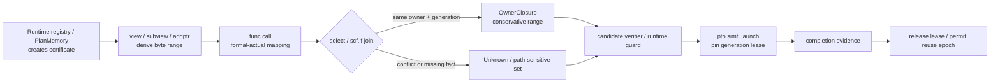
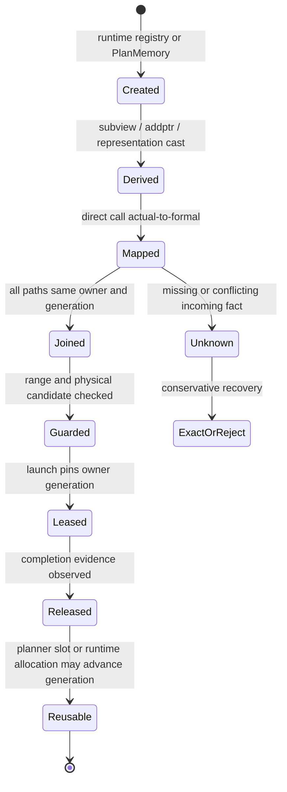
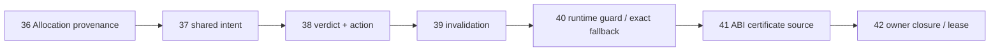

> 源码基线：PTOAS [`61e14673`](https://github.com/hw-native-sys/PTOAS/commit/61e14673eb6b5f040a7cf0c64d5286d755abcdf4)，默认分支为 `master`。与课程 41 的基线 [`9b81c7a9`](https://github.com/hw-native-sys/PTOAS/commit/9b81c7a9614a179b534532a42ec36273b910244f) 相比，主干又前进了 7 个提交；这些提交主要修复 sync、VMI 与代码检查，没有实现 `AllocationCertificate`。本文把现有 IR、analysis、planner 和测试称为**代码事实**；`OwnerClosure`、certificate token、lease 与 verifier 是基于这些事实推导的**建议设计**。

## 本篇在 PTO 课程路线中的位置

课程 41 已回答 certificate 从哪里来：外部 GM allocation 由可信 runtime/allocator 导入，compiler-owned local buffer 可由 `PlanMemory` 生成。本章继续问：certificate 进入 IR 后，能否随着 pointer 穿过 `call/cast/subview/phi`，以及 launch 返回前后它何时仍然有效？

课程位置是：

`function ABI certificate → call/view/phi owner closure → launch lease → verifier`。

这是课程 36–42 的收束点：前六章先拆开地址、owner、intent、candidate、verdict、guard，本章补上跨边界的传播与生命周期。

## 前置知识

- `PointerValue` 只回答“当前地址是什么”；`ViewDescriptor` 回答“索引怎样映射到 offset”；`AllocationCertificate` 才回答“哪个 owner/generation 提供多大可访问 envelope”。
- `PTOAddressAnalysis` 能追踪 `pto.addptr` 的 root、typed offset、range 与 alignment remainder，但头文件明确不承诺 alias、disjointness 或 memory dependence。
- `PlanMemory` 的 liveness/reuse 结论是 planner 局部事实；相同 planned offset 不自动成为 allocation identity。
- proof 只有在 owner、generation、range、candidate、target 和 policy 依赖未变时才有效。

## 今日 1–2 个核心问题

1. 对 `func.call`、临时 cast、subview 与 phi-like join，什么条件下可以保留同一 certificate，什么条件下必须降为 `Unknown`？
2. `pto.simt_launch` 当前只验证 callee 与 operand type；若设备访问可能越过 host 侧作用域，怎样用 generation-scoped lease 防止 slot 提前复用？

## PTO 全栈中的位置



上游输入是可信 owner metadata 与 pointer/view；下游消费者是 VMI/VPTO/EmitC 的 memory candidate、runtime guard 和设备 launch。传播层不能发明事实，只能保持、缩小、合流或丢弃事实。

## 概念和精确语义

### `OwnerClosure` 不是“沿 def-use 抄字段”

建议把一个派生 pointer/view 的证明状态写成：

```text
DerivedCertificate {
  owner_token, generation,
  allocation_base, readable_guard,
  base_delta, accessed_range,
  guaranteed_alignment,
  memory_space
}
```

传播必须保持三个不变量：

1. **身份闭包**：每条可达控制流路径都指向同一 `owner_token + generation`，否则不能压成单一 certificate。
2. **范围闭包**：派生 `base_delta + accessed_range + physicalEnvelope` 必须落在 `readable_guard` 内，并证明整数 no-wrap。
3. **生命周期闭包**：从 proof/guard 到最后一次真实设备访问完成，owner generation 不得结束或复用。

因此“raw pointer bits 相同”只是必要条件之一，既不证明 owner 相同，也不证明 generation 仍 live。

### 四类边界的传播规则

| 边界 | 可保留条件 | 必须改变 | 失败结果 |
| --- | --- | --- | --- |
| direct `func.call` | actual/formal 一一对应，callee 已知，证书 schema 相容 | 建立 caller→callee 映射 | external/indirect/签名缺 token：`Unknown` |
| representation cast | 仅改变表示，memory space、element byte 解释与 base 不冲突 | 重算 typed offset/alignment | integer round-trip、space change、不可识别链：`Unknown` |
| subview/addptr | 同一 owner/generation，offset/stride 可证明 no-wrap | 累加 `base_delta`，收窄 range/alignment | 越界：`Disproven`；动态证据不足：`Unknown` |
| select/phi/region yield | 所有 incoming path 同 owner+generation | range 取安全 join，或保留谓词化集合 | owner/generation 冲突：不能造单一 certificate |

这里的“安全 join”不是简单取一个 incoming。predicate-insensitive verifier 必须证明所有可能分支；若要保留精度，就保存 `cond → certificate` 的 disjunction 并在控制流内消费。

## 真实文件、类型、API 或指令逐段解读

### 1. `func.call` 已是真正的模块边界

PTODSL 的 [kernel entry 与 subkernel 文档](https://github.com/hw-native-sys/PTOAS/blob/61e14673eb6b5f040a7cf0c64d5286d755abcdf4/ptodsl/docs/user_guide/03-kernel-entry-and-subkernels.md) 明确：模块边界落成真实 `func.func → func.call`，C ABI 只允许 `pto.ptr` 与 scalar 穿越，Tile/TensorView 不能作为参数。

[`ExpandTileOp.cpp`](https://github.com/hw-native-sys/PTOAS/blob/61e14673eb6b5f040a7cf0c64d5286d755abcdf4/lib/PTO/Transforms/TileOp/ExpandTileOp.cpp) 展开 TileLib template 时也会创建 `func::CallOp`；caller operand 与 callee argument type 不同则插入 `UnrealizedConversionCastOp` 作为桥。换言之，当前调用链只保证值和类型能过边界，没有 owner/extent/generation 的 hidden contract。

已有 `VMILayoutAssignment` 能为 direct internal call 建立 operand/result 与 callee argument/return 的 layout 等价关系。这是一个可复用模式，但不能把 layout 等价直接当成 owner 等价：certificate verifier 需要自己的 actual/formal closure，并对 external/indirect call 保守失败。

### 2. cast 会消失，证书不能绑死在临时 SSA 上

[`Passes.td`](https://github.com/hw-native-sys/PTOAS/blob/61e14673eb6b5f040a7cf0c64d5286d755abcdf4/include/PTO/Transforms/Passes.td) 中 `VPTOPtrCastCleanup` 会折叠：

```text
!pto.ptr → unrealized_conversion_cast → memref.cast
         → unrealized_conversion_cast → !pto.ptr
```

[`expand_tile_op_tilelang_tadds.pto`](https://github.com/hw-native-sys/PTOAS/blob/61e14673eb6b5f040a7cf0c64d5286d755abcdf4/test/dsl/expand_tile_op_tilelang_tadds.pto) 直接检查最终 VPTO 中不存在 `memref.cast` 和 `builtin.unrealized_conversion_cast`。这证明 bridge 是瞬时表示，不是稳定身份节点。

所以把 certificate 仅作为 cast op 的 attribute 会随 cleanup 丢失。更稳妥的是独立 SSA token、function argument 映射，或由 canonical base/value fingerprint 驱动的 analysis state；每次 rewrite 要么明确 preserve，要么使 analysis invalid。

### 3. subview 保留 owner，但必须重算 envelope

现有 view lowering 会把 `partition_view` 经 `memref.subview/reinterpret_cast` 折回 base pointer，并为非零 offset 产生 `pto.addptr`。[`PTOAddressAnalysis.cpp`](https://github.com/hw-native-sys/PTOAS/blob/61e14673eb6b5f040a7cf0c64d5286d755abcdf4/lib/PTO/Analysis/PTOAddressAnalysis.cpp) 只沿 element-size 相容的 `AddPtrOp` 累加 offset；它不从 shape 猜 allocation extent。

[`subview_dynamic_shape_stride_emitc.pto`](https://github.com/hw-native-sys/PTOAS/blob/61e14673eb6b5f040a7cf0c64d5286d755abcdf4/test/lit/pto/subview_dynamic_shape_stride_emitc.pto) 验证动态 shape marker 和 5D padding 后的四个 runtime stride 都被传入 EmitC。测试证明 descriptor 映射被保留；它没有证明这些 stride 映射出的最后一个 byte 仍在 backing allocation 内。

### 4. `select/phi` 暴露“同地址不等于同 owner”

[`PTOPlanMemoryModern.cpp`](https://github.com/hw-native-sys/PTOAS/blob/61e14673eb6b5f040a7cf0c64d5286d755abcdf4/lib/PTO/Transforms/Passes/PTOPlanMemoryModern.cpp) 会把 `arith.select` 两侧与 `scf.if` yield 的可能 roots 做集合传播，也会记录互斥分支，以便安全复用 local memory。

最新的 [`plan_memory_five_gates_phi_family_select.pto`](https://github.com/hw-native-sys/PTOAS/blob/61e14673eb6b5f040a7cf0c64d5286d755abcdf4/test/lit/pto/plan_memory_five_gates_phi_family_select.pto) 很有代表性：then 分支的 `%a/%b` 分别占 offset `0/512`，else 分支 `%c` 可以复用 offset `0`；`arith.select` 和 `scf.if` 仍保留。测试证明的是：

```text
lifetime(%a) 与 lifetime(%c) 互斥
⇒ physical offset 可相同
```

它不证明：

```text
owner(%a) == owner(%c)
```

逻辑对象即便共享 slot，也必须以不同 reuse epoch/generation 区分。否则 `%a` 的旧 certificate 可能在 else 分支或下一次复用中错误授权 `%c` 的访问。

### 5. `pto.simt_launch` 当前验证到哪里

[`PTOOutlineSIMTSections.cpp`](https://github.com/hw-native-sys/PTOAS/blob/61e14673eb6b5f040a7cf0c64d5286d755abcdf4/lib/PTO/Transforms/Passes/PTOOutlineSIMTSections.cpp) 把 SIMT section 的 captures 变成 helper arguments，再创建 `pto.simt_launch`。[`VPTOSimtLaunch.cpp`](https://github.com/hw-native-sys/PTOAS/blob/61e14673eb6b5f040a7cf0c64d5286d755abcdf4/lib/PTO/IR/VPTO/memop/VPTOSimtLaunch.cpp) 的 verifier 检查：不能嵌套在 `simt_entry` 内、callee 存在并标记为 SIMT entry、callee 无结果、operand 数量和类型完全匹配。

当前 op 无 completion result，也没有 owner/generation/lease operand。代码因此只能证明调用形状合法，不能证明 captured pointer 在设备最后一次访问前保持存活。公开代码也没有表明 `pto.simt_launch` 必然异步；这里严谨的结论是：**若某个 backend 的真实执行可能越过 host/IR 侧 owner scope，就必须额外建立 completion-scoped lease。**这是设计推断，不是当前实现事实。

## 对象 / Certificate 生命周期



所有权仍在 runtime registry 或 `PlanMemory`；callee、view 和 launch 只借用。lease 不转移 owner，只阻止 generation 在使用完成前被回收或复用。

## 端到端调用链或指令链

真实链可以追成：

`@pto.jit helper call → func.call → optional unrealized/memref cast bridge → FoldTileBufIntrinsics/VPTOPtrCastCleanup → partition_view/subview/addptr → PTOAddressAnalysis → PlanMemory root-family/liveness → VMI physical candidate → VPTO/EmitC`。

建议插入的安全链是：

`entry certificate import → actual/formal token mapping → derived range update → phi owner closure → candidate verifier/guard → launch lease acquire → device completion → lease release → generation advance`。

## 具体 shape、Tile 和状态演算

设 runtime 注册：

```text
owner=A, generation=7, base=0x1000,
extent=2048 B, readable_guard=2048 B, alignment=32 B
```

view 为 `f32[4,100]`，physical stride `[128,1]`。第 3 行从元素 offset `3×128=384` 开始，即 `base_delta=1536 B`。该行的 semantic end 是：

$$
1536 + 100\times4 = 1936\text{ B}
$$

若 `vreg<100xf32>` lowering 选择 512 B full-carrier candidate，则 physical end 是：

$$
1536 + 512 = 2048\text{ B}
$$

恰好安全。把这个 pointer 传入 direct helper，只要 actual/formal certificate 映射未丢失，callee 可得到同一 `owner=A, generation=7` 与 `base_delta=1536`。

现在看三个变化：

1. **representation cast**：只在 `f32` pointer 与等价 memref 表示间往返，最终仍回到相同 element byte width/space；owner 可保留，但 cast 消除后 verifier 仍要找到 token。
2. **phi**：then 取 `A/gen7` 第 3 行，else 取 `B/gen2`。即使两者当前 raw address 都是 `0x1600`，单一 certificate 也必须为 `Unknown`；只有谓词化 `{cond→A, !cond→B}` 才能保留精度。
3. **reuse**：launch 尚未完成，runtime 已把 `0x1000` 回收给 `A/gen8`，extent 变为 1936 B。旧 gen7 proof 不能授权新 allocation；512 B 读取会越过新 extent 112 B，而 400 B exact read 仍恰好安全。

因此 lease 的最小语义是：

```text
acquire(owner=A, generation=7, range=[1536,2048), access=read)
launch(..., lease)
observe_completion(lease)
release(lease)
```

没有 completion evidence，就不能把 gen7 的地址重新分配给 gen8。

## 为什么这样设计及替代方案

### 方案 A：在每个 pointer SSA value 上复制 attributes

实现最直观，但 cast cleanup、CSE、block argument、region yield 和 rewrite 很容易漏拷贝；attribute 还无法自然表示 runtime generation。维护成本高，最危险的是静默 stale。

### 方案 B：所有 C ABI pointer 都扩成 fat pointer

`(ptr, owner, extent, alignment, generation)` 显式、跨模块可见，external call 也容易约定；代价是 ABI 膨胀、每个 helper 都受影响，且 untrusted caller 仍可伪造字段。

### 方案 C：独立 certificate SSA token + verifier side table

public codegen ABI 保留 raw pointer，trusted entry 导入 token；direct call 显式映射 token，view op 派生 token，phi 建 join 或 Unknown，launch 获取 lease。它把 correctness 变化集中到少数边界，是较小的可落地设计。

对 phi 还有两种政策：

- **保守 join**：不同 owner 立即 Unknown，IR 和编译成本低，可能损失 fast path；
- **谓词化 disjunction**：保留每条路径的 certificate，精度高，但会增加状态数、guard 与 verifier 复杂度，必须限制集合大小。

## 访存、计算、流水、并行和硬件约束

- **访存**：certificate 不改变 payload；它决定 512 B carrier 能否替代 400 B exact access。错误继承会直接越界，不只是性能问题。
- **计算**：direct call 映射可在编译期完成；动态 owner join 可能增加 compare/branch，循环中应优先在 dominating preheader hoist 稳定 guard。
- **流水**：lease acquisition 与 range guard 必须发生在首个 DMA/vector access 前；release 必须晚于最后一个设备 completion，不能用 host enqueue 返回替代。
- **并行**：多个 SIMT worker 可共享 immutable certificate，但 lease reference count/epoch 更新必须并发安全。
- **资源**：predicate-sensitive certificate 集合会增加 IR/analysis 内存；bounded set 超限时应降为 Unknown，而不是任意挑一个 owner。
- **graphability**：graph key 应包含或依赖 owner generation；地址相同但 generation 改变时，captured guard、buffer binding 和 graph replay 必须一起失效。
- **硬件推断**：公开代码没有给出真实 device queue 的异步时序；因此本文不假设某个 Ascend launch 一定异步，只给出 backend 一旦异步就必须满足的生命周期条件。

## 测试证据与未覆盖风险

当前直接证据分别验证了不同层次：

- `plan_memory_five_gates_phi_family_select.pto`：输入三个 `16×16xf16` GM tile，经 inner `arith.select` 和 outer `scf.if`；检查 then 中 0/512 B 两个 slot 与 else 中 0 B 复用。它验证 root family、分支互斥和地址规划，不验证 owner generation。
- `expand_tile_op_tilelang_tadds.pto`：检查 TileOp 展开后 cast bridge 被清理，证明 certificate 若只挂在 cast 上会丢失。
- `subview_dynamic_shape_stride_emitc.pto`：检查动态 sizes/strides 正确 materialize，验证 view descriptor，不验证 allocation coverage。
- `VPTOSimtLaunch.cpp::verify` 及相关 verifier 测试：验证 callee 标记、无返回值、arity/type；没有 completion、lease 或 generation 条件。
- `PTOAddressAnalysis` 的现有测试覆盖 addptr recurrence/range/no-wrap；`arith.select` 不是其可剥离的同 root 链，当前不会凭空合成同 owner。

仍未覆盖的风险：

1. certificate 的真实 IR/schema 与 trusted runtime registry；
2. direct call、recursive call、external/indirect call 的 token ABI；
3. cast rewrite 的 preservation verifier 和 differential invalidation；
4. same-owner phi、different-owner phi、loop-carried generation 的 golden；
5. PlanMemory slot reuse epoch 与实际设备 completion 的连接；
6. launch cancel、device fault、lost completion、double release 与 stale lease；
7. VPTO/EmitC same-certificate parity，以及 A5 guard-page/canary/poison 测试。

## 与前后章节的连接

前章解决 certificate 的来源，本章定义传播闭包：call 映射身份、cast 只变表示、subview 变范围、phi 合流路径、launch 延长生命周期。这样 `MemoryAccessVerdict` 才能从“单次 lowering 的局部对象”升级为可验证的跨边界契约。

下一章应进入 failure semantics：**lease 的 completion 丢失或 launch 失败时，怎样通过 cancel、quarantine 与 generation fencing 避免迟到设备写污染已复用 slot。**

## 本篇结论、知识债、三个理解检查问题和下一章

结论：

1. certificate 传播不是复制字段，而是证明 identity、range 与 lifetime 三个 closure。
2. direct call 可以显式映射；representation cast 可以继承但必须抗 rewrite；subview 只收窄同一 owner；不同 owner/generation 的 phi 不能伪造单一 certificate。
3. `PlanMemory` 的同 offset 只说明复用合法，不说明 logical owner 相同；reuse epoch 是 generation 的天然边界。
4. 当前 `pto.simt_launch` verifier 只覆盖调用形状。若 backend 访问可越过 owner scope，必须以真实 completion 驱动 lease release。

知识债：shared certificate/token IR、call ABI、predicate-sensitive owner set、rewrite preservation、PlanMemory epoch、completion API、cancel/quarantine、VPTO/EmitC golden 与设备 fault tests。

理解检查：

1. 为什么两个互斥分支 tile 使用相同 planned offset，仍不能共享同一个 generation？
2. 一个 cast 最终被完全删除时，certificate 关联应怎样存活？
3. 为什么 host enqueue 返回不能必然作为 lease release 条件？

下一章：**Completion 丢了怎么办——Async Lease、Cancel、Quarantine 与 Generation Fencing。**

## 第六次七章知识图谱回顾（课程 36–42）



这七章把 memory safety 从“地址能否算出”推进到完整证明链：`owner/capacity → logical intent → backend candidate → verdict/action → dependency lifetime → runtime recovery → cross-boundary closure`。路线下一步不再继续扩字段，而是验证故障时的终态：completion 丢失、cancel 竞态与迟到访问如何 fail closed。

## 课程账本增量

- 章节：42
- 主线：`ABI certificate → call/cast/subview/phi owner closure → launch lease`
- 新确认：PlanMemory 同 offset 不等于同 owner；cast bridge 会被清理；direct call 是真实 ABI 边界；SIMT launch verifier 当前无 lease/completion 语义。
- 新不变量：identity、range、lifetime 三闭包；不同 owner/generation 的 phi 不能生成单一 certificate；generation 复用必须晚于真实 completion。
- 新覆盖：`ExpandTileOp`、`VPTOPtrCastCleanup`、`PTOAddressAnalysis`、`PTOPlanMemoryModern`、`PTOOutlineSIMTSections`、`SimtLaunchOp::verify` 及四组直接测试。
- 下一章：async completion failure、cancel、quarantine、generation fencing 与 fault-injection matrix。
