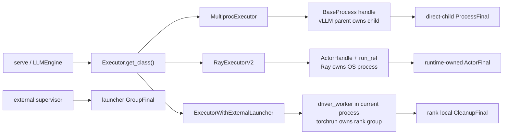
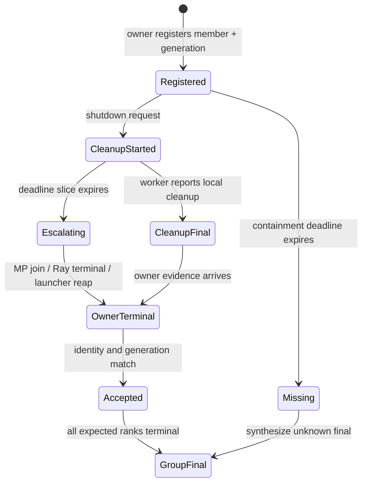

> 源码基线：vLLM [`9b49f923`](https://github.com/vllm-project/vllm/commit/9b49f92344312c41ad61e05282c8e6a2d9bafb7f)，默认分支 `main`，核验日期 2026-09-21。相对上一章的 `a7fda4c8` 前进 29 个 commit；[比较结果](https://github.com/vllm-project/vllm/compare/a7fda4c88bfc421d31e33acc5e01e86ebe467ad8...9b49f92344312c41ad61e05282c8e6a2d9bafb7f)显示本文直接分析的 executor/launcher 退出文件没有变化。

## 本篇在课程路线中的位置

上一章把本地进程终态拆成四级证据：

`signal sent → exit observed → direct child reaped → descendant domain contained`

本章继续回答更难的一问：**同一个 `ProcessFinal` 能否在 MP、Ray 和 external launcher 上都解释为 `join()` 成功？**

答案是否定的。三种 backend 的根本差异不是 API 名字，而是**进程所有权**：

- MP parent 创建并持有 `multiprocessing.Process`，有权 `join()` 直接子进程；
- Ray executor 持有 `ActorHandle/ObjectRef`，OS 进程由 Ray runtime 管理；
- external launcher 中每个 vLLM engine 只持有本进程 Worker，兄弟 rank 属于 torchrun 等外部 supervisor。

因此课程主线从“KILL 后必须 reap”推进到：

`KILL 后 reap → backend-specific owner adapter → cross-backend golden → fault-injection E2E`

## 前置知识回顾

前六章已经建立三条不变量。

1. cleanup 完成与 containment 完成正交：资源释放成功，不代表进程域已经消失。
2. containment deadline 不能被 WAL、telemetry 或设备同步延长。
3. 裸 PID 既不能抵抗 PID reuse，也不能说明调用方是否拥有该进程。

本章只讨论退出证据的生产与聚合，不重复展开 WAL 格式、CRC 或 signal escalation。

## 本篇要回答的核心问题

1. `Executor.get_class()` 选出的三类 backend，分别持有什么 owner handle？
2. MP 的 `Process.join()`、Ray 的 `RayActorError`、external launcher 的 rank exit 能否映射为同一种终态？
3. 怎样定义一个统一但不“抹平证据强度”的 `ProcessFinal`，并用同一组 golden case 验证三种 adapter？

## 组件在全局架构中的位置

公开 serving 入口把 `Executor.get_class(vllm_config)` 交给 EngineCore；[`Executor.get_class()`](https://github.com/vllm-project/vllm/blob/9b49f92344312c41ad61e05282c8e6a2d9bafb7f/vllm/v1/executor/abstract.py)再根据 `distributed_executor_backend` 选择 `MultiprocExecutor`、`RayExecutorV2` 或 `ExecutorWithExternalLauncher`。



图中最后四个 `Final` 是本文推导的建议接口，不是当前仓库已有类型；前三条 owner 关系则是当前代码事实。

## 完整调用链

### 1. MP：vLLM 自己创建，也必须自己 reap

[`WorkerProc.make_worker_process()`](https://github.com/vllm-project/vllm/blob/9b49f92344312c41ad61e05282c8e6a2d9bafb7f/vllm/v1/executor/multiproc_executor.py)通过 multiprocessing context 创建并 `start()` 子进程，把真实 `BaseProcess` 保存进 `WorkerProcHandle.proc`。shutdown 时：

```text
MultiprocExecutor.shutdown
→ close(death_writer)
→ _ensure_worker_termination([handle.proc])
→ grace wait
→ terminate()
→ 4 s wait
→ kill()
→ MessageQueue.shutdown()
```

当前 `_ensure_worker_termination()` 在 KILL 后返回，没有同步 `join()`。但这里最重要的不是缺了一行代码，而是 MP parent **确实拥有** direct-child handle，因此它是唯一能够合法消费 wait status、释放 zombie entry 并读取 `exitcode` 的主体。若交给旁路 collector 仅按 PID 观察 `/proc`，反而会丢失 parent-only 的回收权。

### 2. Ray V2：vLLM 请求终止，Ray runtime 回收

[`RayWorkerHandle`](https://github.com/vllm-project/vllm/blob/9b49f92344312c41ad61e05282c8e6a2d9bafb7f/vllm/v1/executor/ray_executor_v2.py)保存 `actor`、逻辑 rank 与 `run_ref`；`run_ref` 来自长期运行的 `actor.run.remote()`。monitor 线程用 `ray.wait()` 观察 run ref，发现 actor 异常结束后把 executor 标记为失败并触发 shutdown。

`RayExecutorV2.shutdown()` 的当前顺序是：

```text
shutdown_lock: shutting_down = true
→ join monitor thread
→ ray.kill(handle.actor)
→ shutdown request/response MQ
```

这里 vLLM 没有 actor OS 进程的 `multiprocessing.Process`，不能也不该伪造 `waitpid()`。仓库中的 [`test_ray_v2_executor_shutdown`](https://github.com/vllm-project/vllm/blob/9b49f92344312c41ad61e05282c8e6a2d9bafb7f/tests/distributed/test_ray_v2_executor.py)在 TP=2 下保存两个 ActorHandle，调用 shutdown 后，再调用 actor 方法并断言 `ray.get(..., timeout=5)` 抛出 `RayActorError`。这证明 actor 已不可调用、Ray 已观察到 terminal；它**不证明 vLLM driver 回收了一个直接子进程**。

Ray V2 在 [PR #36836](https://github.com/vllm-project/vllm/pull/36836) 引入，并由 [PR #41421](https://github.com/vllm-project/vllm/pull/41421) 默认启用。当前仍保留旧 [`RayDistributedExecutor`](https://github.com/vllm-project/vllm/blob/9b49f92344312c41ad61e05282c8e6a2d9bafb7f/vllm/v1/executor/ray_executor.py)；其 teardown 与 V2 不完全相同，这正说明终态协议应放在 adapter contract，而不能散落为“某个实现调用过 `ray.kill`”。

### 3. External launcher：本 rank 只能证明自己，group final 属于 supervisor

[`ExecutorWithExternalLauncher`](https://github.com/vllm-project/vllm/blob/9b49f92344312c41ad61e05282c8e6a2d9bafb7f/vllm/v1/executor/uniproc_executor.py)继承 `UniProcExecutor`。它从 `env://`、`RANK`、`LOCAL_RANK` 构造 distributed 参数；每个外部启动的 engine 只创建一个本地 `driver_worker`。其 shutdown 继承的是：

```text
if driver_worker:
    driver_worker.shutdown()
```

因此 rank 0 也没有 rank 1 的 `Process`、pidfd 或 ActorHandle。[`torchrun_example_offline.py`](https://github.com/vllm-project/vllm/blob/9b49f92344312c41ad61e05282c8e6a2d9bafb7f/examples/features/torchrun/torchrun_example_offline.py)要求各 rank 创建相同配置、执行相同请求，并用 process group 校验输出一致；进程组的创建、信号、restart 与 reap 均在外部 launcher 一侧。

[`WorkerWrapperBase`](https://github.com/vllm-project/vllm/blob/9b49f92344312c41ad61e05282c8e6a2d9bafb7f/vllm/v1/worker/worker_base.py)明确区分 `rpc_rank` 和 `global_rank`。所以跨进程 final 必须以 `global_rank/RANK` 聚合，不能把每个独立 engine 内可能重复的本地身份当成全局成员编号。

## 关键类型、字段和状态生命周期

基于上述事实，一个最小、可审计的建议 schema 是：

```text
MemberFinal {
  generation,
  global_rank,
  owner_kind,          # mp_parent | ray_runtime | external_supervisor
  cleanup_verdict,     # completed | failed | unknown
  terminal_kind,       # direct_reaped | actor_terminal | launcher_reaped
  terminal_verdict,    # proven | unknown
  evidence_ref,        # process token / actor id+run_ref / launcher attempt id
  reason_code,
  observed_at
}

GroupFinal {
  generation,
  expected_global_ranks,
  accepted_member_finals,
  missing_global_ranks,
  domain_verdict
}
```

对象生命周期如下。



`generation` 与 `evidence_ref` 缺一不可：Ray actor 可被重建，torchrun rank 可进入新 attempt，PID 也可复用。旧实例的迟到 terminal 不能结束新实例。

## 逐函数源码解读

### `Executor.get_class()`：统一的是选择点，不是所有权

这个函数只返回 executor class。它没有承诺各实现共享相同的 OS 进程模型。因此 `Executor.shutdown()` 的抽象语义最多是“请求 backend 收敛”，不能直接等价为“所有 Worker 已由当前进程 reap”。

### `MultiprocExecutor.shutdown()`：handle 足够强，后置条件还不够强

`WorkerProcHandle.proc` 提供 `is_alive/terminate/kill/join/exitcode` 所需的直接所有权。当前缺口是 KILL 后没有在 shared deadline 的 reap reserve 内 `join()`，也没有把 exitcode 与 generation 封装成 final。建议 adapter 的后置条件应是：

\[
\forall r\in expected,\quad joined(r)\lor deadline\_unknown(r)
\]

而不是“已经调用过 `kill()`”。

### `RayExecutorV2.shutdown()`：要等待 owner terminal，而非模拟 join

`ray.kill()` 是命令提交，不是终态本身。现有测试通过后续 RPC 得到 `RayActorError`，已经展示一种可观察证据；更直接的实现可以等待保存的 `run_ref` 进入 terminal，或查询 Ray State API 的 actor terminal 状态。证据必须携带 actor identity，且声明 `owner_kind=ray_runtime`。

需要另行注意 [`CoreEngineActorManager`](https://github.com/vllm-project/vllm/blob/9b49f92344312c41ad61e05282c8e6a2d9bafb7f/vllm/v1/engine/utils.py)：它还管理 EngineCore actors 和 placement groups。Worker actor terminal 与 EngineCore actor domain empty 是两个 owner scope，不能只收一层就发布整棵服务的 `GroupFinal`。

### `ExecutorWithExternalLauncher`：local cleanup 不是 global containment

本 rank 能调用 `driver_worker.shutdown()` 并发布 `CleanupFinal`，但无权证明其他 rank 已退出。最终 `launcher_reaped` 必须来自 torchrun/Slurm/Kubernetes 等 supervisor adapter。若 launcher 没有提供可验证回执，vLLM 只能把 group containment 标为 `unknown`，不能让 rank 0 代签。

## 具体示例与状态演算

设 TP=2，`generation=41`，总 containment budget 为 10 秒，最后 1 秒预留给 owner terminal confirmation。rank 0 正常退出，rank 1 卡在 native device call。

| 时刻 | MP | Ray V2 | External launcher |
|---:|---|---|---|
| 0.0 s | parent 关闭 death pipe | executor 开始 shutdown | 两个 rank 各自开始 local cleanup |
| 2.0 s | rank 0 exit 并 `join` | actor 0 run_ref terminal | rank 0 发布 CleanupFinal |
| 5.0 s | rank 1 收到 TERM | actor 1 收到 `ray.kill` | rank 1 仍卡住；rank 0 无权处理 |
| 8.0 s | rank 1 收到 KILL | Ray runtime 回收 actor 1 | torchrun agent 终止 rank 1 |
| 9.0–9.8 s | parent `join`，记录 exitcode | driver 观察 actor terminal | launcher reap 两个 rank，发布 attempt final |
| 10.0 s | 发布 direct_reaped GroupFinal | 发布 runtime-owned GroupFinal | 只有收到 supervisor final 才能发布 contained |

三条路径都可以得到 `domain_verdict=proven`，但 `terminal_kind` 分别是 `direct_reaped`、`actor_terminal` 与 `launcher_reaped`。这不是实现噪声，而是审计证据的来源。

若 10 秒时 Ray State API 不可用，或 external supervisor 没有回执，正确结果是 `terminal_verdict=unknown` 并列出 `missing={1}`；不能因为发过 KILL 就升级为 proven。

## 为什么这样设计及替代方案

### 方案 A：统一要求 `join()`

优点是表面简单；缺点是 Ray 与 external launcher 根本没有相应 handle。为了满足接口只能轮询 PID 或伪造状态，既破坏所有权又引入 PID reuse 风险，应排除。

### 方案 B：只要求“backend 报成功”

维护成本低，但把 `ray.kill()` 返回、rank-local cleanup 和 direct-child reap 压成一个布尔值，无法回答 zombie、restart、旧 generation 迟到等问题。

### 方案 C：统一语义，保留 backend evidence

本文建议采用这一方案：上层只比较 `expected/missing/domain_verdict`，adapter 保存 owner-specific `terminal_kind/evidence_ref`。它多出少量 schema 和 golden fixture，却能让 MP、Ray、torchrun 各自使用最强、真实可获得的证据。

## 性能、并发、正确性与边界条件

- **延迟：**terminal confirmation 只发生在 shutdown，不影响稳态 token latency；但必须从总 deadline 中预留，不能无限等 Ray state 或 launcher ACK。
- **吞吐与显存：**schema 本身无稳态显存成本。及时确认 terminal 能缩短旧 actor/rank 占用 GPU 的不确定窗口。
- **并发：**`RayExecutorV2` 已用 lock 保证 shutdown check-and-set；MP 与外层 manager 也需要同等的 single-writer finalization，避免双重 kill、双重 join 或 final 覆盖。
- **graphability：**CUDA Graph/torch.compile 路径不因 schema 改变；但 KILL 后不能再等待 graph callback 来证明终态，证据必须来自 owner plane。
- **正确性：**final 的主键至少是 `(generation, owner_scope, global_rank, evidence_ref)`。同 rank 的旧 actor、旧 PID 或旧 launcher attempt 都必须被拒绝。
- **进程树：**MP 的 direct `join()` 只证明直接子进程已回收；若 Worker 能再 fork 后代，仍需 process group、cgroup 或 subreaper 提供 domain-empty 证据。
- **失败模式：**owner 本身崩溃时只能由更上层 owner 接管。Ray driver 不能替 Ray runtime 证明 OS reap，external rank 也不能替 launcher 证明 group reap。

## 测试证据与未覆盖风险

### 当前测试能证明什么

- [`test_multiproc_executor_worker_termination_timeout`](https://github.com/vllm-project/vllm/blob/9b49f92344312c41ad61e05282c8e6a2d9bafb7f/tests/v1/executor/test_executor.py)用 fake clock/process 验证 grace window 前后是否调用 `terminate()`；不覆盖 KILL 后 `join()`、exitcode 或 zombie。
- [`test_ray_v2_executor_shutdown`](https://github.com/vllm-project/vllm/blob/9b49f92344312c41ad61e05282c8e6a2d9bafb7f/tests/distributed/test_ray_v2_executor.py)用 TP=2 验证 shutdown 后 actor RPC 抛 `RayActorError`，并检查 MQ 清空；不覆盖 Ray node 故障、actor restart generation 或 State API 暂时不可用。
- [`test_torchrun_example.py`](https://github.com/vllm-project/vllm/blob/9b49f92344312c41ad61e05282c8e6a2d9bafb7f/tests/distributed/test_torchrun_example.py)验证 rank 间 KV cache 配置、参数数量和输出一致；没有注入 rank hang，也没有检查 launcher reap。
- 当前 external launcher 的 executor 单测只验证继承来的 async scheduling capability，没有 shutdown ownership 测试。

### 建议的 cross-backend golden

同一逻辑 fixture 应至少覆盖：

| Case | 统一期望 | MP evidence | Ray evidence | External evidence |
|---|---|---|---|---|
| all normal | `missing=∅` | joined + exitcode | actor terminal | launcher rank final |
| one native hang | deadline 内收敛 | KILL + join | kill + terminal | supervisor escalation + reap |
| stale generation | reject | old process token | old actor id | old attempt id |
| owner unavailable | `unknown` | parent crash | Ray control plane unavailable | launcher ACK missing |
| duplicate final | idempotent | same wait status | same actor terminal | same attempt/rank |
| same seq, conflict | fail closed | conflicting exit | conflicting actor id | conflicting attempt |

仍未覆盖的风险包括真实 CUDA/NCCL 不可中断挂起、Ray node loss 后的 actor ownership转移、torch elastic restart、cgroup descendant escape，以及 terminal evidence 的持久化与重放。

## 与前后章节的连接

本章把上一章的 `ProcessFinal` 从单机 `multiprocessing.Process` 推广到三种 owner domain，并确认“统一接口”必须统一语义而非统一系统调用。

下一章应继续处理：**Owner 自己死了怎么办——manager/Ray control plane/launcher crash 后，谁接管 terminal evidence，怎样用 generation-scoped takeover 防止双重回收与旧 final 污染。**

## 本篇结论

1. MP、Ray 与 external launcher 可以共享 `ProcessFinal` 语义，但不能共享 `join()` 实现。
2. `ray.kill()`、rank-local cleanup 和 `Process.kill()` 都只是动作；终态必须由实际 owner 以可绑定 identity/generation 的证据确认。
3. 上层 golden 应比较 `cleanup_verdict`、`terminal_verdict`、`expected/missing` 和 deadline；backend-specific `terminal_kind` 必须保留，不能压成布尔值。

### 三个理解检查问题

1. 为什么 Ray actor RPC 抛 `RayActorError` 可以证明 actor terminal，却不能证明 vLLM driver 执行过 direct-child reap？
2. external launcher 下，为什么 rank 0 的 `driver_worker.shutdown()` 不能发布整个 TP group 的 contained final？
3. 如果 MP rank 1 的旧 PID 被系统复用，仅凭 `pid + exited` 为什么可能错误结束新 generation？

## 知识债

- 实际 `ProcessFinal/GroupFinal` schema 与 stable reason taxonomy；
- MP KILL 后 shared-deadline `join()` 和 descendant-domain ownership；
- Ray actor terminal/state confirmation、restart generation 与 placement-group final；
- torchrun/Slurm/Kubernetes supervisor adapter；
- Python/Rust wire golden、durable replay；
- zombie、node loss、launcher crash、native hang 与 restart 联合 E2E。

## 下一章

**Owner 自己死了怎么办——manager、Ray control plane 与 external supervisor 的 takeover、generation fencing 和双重回收防护。**

## 第 37 章课程账本增量

- 源码基线：`9b49f92344312c41ad61e05282c8e6a2d9bafb7f`。
- 已覆盖 backend：MP、Ray V2、external launcher。
- 已覆盖符号：`Executor.get_class`、`MultiprocExecutor.shutdown/_ensure_worker_termination`、`WorkerProcHandle.proc`、`RayWorkerHandle.run_ref`、`RayExecutorV2.start_worker_monitor/shutdown`、`ExecutorWithExternalLauncher._distributed_args`、`UniProcExecutor.shutdown`、`WorkerWrapperBase.global_rank`。
- 新确认不变量：终态证据必须由真实 owner 生产；backend-neutral verdict 与 backend-specific evidence 正交；external launcher 的 group final 只能由 supervisor 发布；final identity 必须包含 generation 与 owner-specific token。
- 测试事实：MP 只测 grace→TERM，Ray V2 测 ActorError terminal，torchrun 只测跨 rank 一致性；尚无统一 shutdown golden。
- 下一章：owner crash 后的 takeover 与 generation fencing。
