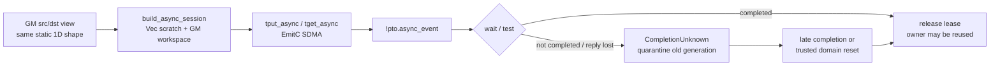
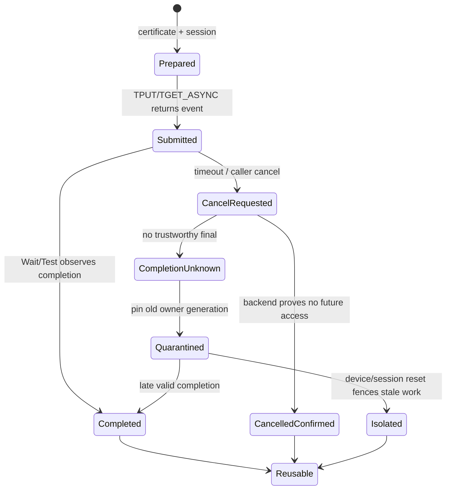

> 源码基线：PTOAS [`85af360e`](https://github.com/hw-native-sys/PTOAS/commit/85af360eed58068801d21c5e2c740e14f47b146b)，默认分支为 `master`。相对课程 42 的 [`61e14673`](https://github.com/hw-native-sys/PTOAS/commit/61e14673eb6b5f040a7cf0c64d5286d755abcdf4) 前进 10 个提交；最新变化集中在 VMI/layout、打包与若干 verifier 修复，没有新增 async cancel、quarantine 或 generation 协议。本文把已经存在的 async SDMA IR、verifier、EmitC lowering 与测试称为**代码/测试事实**；lease 状态机与故障恢复是基于这些事实推导的**建议设计**。

## 本篇在 PTO 课程路线中的位置

课程 41 给出 `AllocationCertificate` 的 ABI 来源，课程 42 又把 certificate 传播拆成 identity、range、lifetime 三个 closure，并指出异步执行必须把 owner 生命周期延长到真实 completion。本章终于落到一条现成的异步链：PTOAS 已有 `AsyncSession`、`TPutAsyncOp/TGetAsyncOp`、`AsyncEvent`、`WaitAsyncEventOp/TestAsyncEventOp`。

课程位置是：

`function ABI certificate → owner closure → async event → completion unknown → quarantine / generation fence`。

## 前置知识

- pointer 地址相同，不代表 allocation owner 或 generation 相同。
- proof 只在 owner、generation、range 与 candidate 都未变化时有效。
- `cancel requested` 是控制意图；只有可信 completion、隔离或执行域 reset 才能证明旧访问不会继续发生。
- `set_flag/wait_flag`、`get_buf/rls_buf` 解决 AICore 内 pipeline/buffer 顺序，不等于 host/runtime 已获得异步 DMA 的终态证据。

## 今日 1–2 个核心问题

1. 当前 async SDMA 对象从 session 创建、事件返回到 `Wait/Test` 的真实生命周期是什么？哪些 shape、dtype、location 与 backend 条件已经由 verifier 固定？
2. 当 `Test` 未完成、调用方超时或 completion 回执丢失时，为什么不能释放并复用 src/dst；怎样用 lease、quarantine 与 generation fencing 避免迟到 DMA 污染新 owner？

## PTO 全栈中的位置



上游是 GM tensor view、Vec scratch 和 GM workspace；中间消费者是 EmitC SDMA API；下游则是 runtime allocator/PlanMemory 能否重新发放 backing。当前仓库实现了前半段 IR 与 lowering，却没有把最后一条“何时允许复用”编码成 owner 协议。

## 概念和精确语义

### 现有四个对象分别回答什么

[`PTOOps.td`](https://github.com/hw-native-sys/PTOAS/blob/85af360eed58068801d21c5e2c740e14f47b146b/include/PTO/IR/PTOOps.td) 定义：

- `BuildAsyncSessionOp(scratch, workspace)` 产生 `!pto.async_session`；
- `TPutAsyncOp(dst, src, session)` 表示 local GM → remote GM 的异步写；
- `TGetAsyncOp(dst, src, session)` 表示 remote GM → local GM 的异步读；
- 两者都返回 `!pto.async_event`；
- `wait_async_event` 阻塞等待，`test_async_event` 非阻塞探测，两者返回 `i1 completed`。

这已经把“提交”和“完成”分开，是正确的第一步。但 `AsyncEvent` 是 opaque handle：类型中没有 src/dst owner、allocation generation、byte range 或 lease id。当前 IR 也没有 cancel op。

### 精确的安全条件

对异步传输 (e)，建议把复用条件写成：

`Reusable(owner, g) iff Terminal(e, owner, g) AND NoFutureAccess(e, owner, g)`

`Test=false` 只证明“观察时尚未得到 completed”；timeout 只证明调用方不再等待；cancel request 只证明请求已发送。三者都不能推出 `NoFutureAccess`。

安全 lease 至少需要键：

`LeaseKey = (owner_id, generation, event_id)`

并记录 src/dst byte interval、direction、session、submit epoch 与终态证据。这里的 generation 不是 pointer bit，也不是 function argument 序号，而是 allocation 每次重新发放时单调变化的身份。

## 真实文件、类型、API 或指令逐段解读

### 1. ODS：异步事件有结果，但没有 owner

[`PTOTypeDefs.td`](https://github.com/hw-native-sys/PTOAS/blob/85af360eed58068801d21c5e2c740e14f47b146b/include/PTO/IR/PTOTypeDefs.td) 把 `AsyncSessionType` 和 `AsyncEventType` 定义为 opaque handle。[异步通信 verifier](https://github.com/hw-native-sys/PTOAS/blob/85af360eed58068801d21c5e2c740e14f47b146b/lib/PTO/IR/PTOPipeline/PTOAsyncCommunicationVerification.cpp) 已经检查：

- scratch 必须是 Vec address space 的静态 rank-1/rank-2 `tile_buf`，至少 8 B；
- workspace 必须是 8-bit element 的 `!pto.ptr`；
- `sync_id∈[0,7]`，`block_bytes/queue_num>0`；
- async src/dst 必须 element type 相同、静态 shape 相同，且都是 flat、contiguous、logical 1D GM view。

因此它证明的是**一次传输的结构合法性**，不证明 backing allocation 在事件完成前一直 live。

### 2. MemoryEffects：能看见读写，不能表达“尚未结束”

[`PTOSimtVerificationAndAsyncEffects.cpp`](https://github.com/hw-native-sys/PTOAS/blob/85af360eed58068801d21c5e2c740e14f47b146b/lib/PTO/IR/PTOPipeline/PTOSimtVerificationAndAsyncEffects.cpp) 将 transfer 标成 dst write、src/session read、event result write；[`PTOCollectivePipelineEffectsAndConvertAssembly.cpp`](https://github.com/hw-native-sys/PTOAS/blob/85af360eed58068801d21c5e2c740e14f47b146b/lib/PTO/IR/PTOPipeline/PTOCollectivePipelineEffectsAndConvertAssembly.cpp) 将 Wait/Test 标成 event/session read 与 completed result write。

这些 effects 可以阻止一部分错误重排，却没有把 `event → src/dst allocation` 的 outstanding lifetime 变成可查询关系。也就是说，pass 能知道“这个 op 写 dst”，但不能仅凭当前接口回答“dst 何时可归还 allocator”。

### 3. EmitC：事件真的被消费，但仅有 Wait/Test

[`AsyncSession.cpp`](https://github.com/hw-native-sys/PTOAS/blob/85af360eed58068801d21c5e2c740e14f47b146b/lib/PTO/Transforms/PTOToEmitC/ScalarMisc/AsyncSession.cpp) 将：

```text
tput_async       → pto::comm::TPUT_ASYNC<SDMA>
tget_async       → pto::comm::TGET_ASYNC<SDMA>
wait_async_event → PTOAS__ASYNC_EVENT_WAIT
test_async_event → PTOAS__ASYNC_EVENT_TEST
```

并把 `i1 completed` 保留下来。相反，[`PTOValidateVPTOIR.cpp`](https://github.com/hw-native-sys/PTOAS/blob/85af360eed58068801d21c5e2c740e14f47b146b/lib/PTO/Transforms/Passes/PTOValidateVPTOIR.cpp) 会明确拒绝这组 op：当前 async SDMA session 只支持 EmitC backend。相关历史提交 [`f4ca9eb8`](https://github.com/hw-native-sys/PTOAS/commit/f4ca9eb8e320c1df35eaa739a6b4b85d53a2b8ed) 还专门保证 session scratch 保持 tile-native，并补上 VPTO fail-closed。

## 对象/Tile/Buffer/IR 生命周期



当前代码真实拥有 `Prepared → Submitted → completed observation`；`CancelRequested/Quarantined/Isolated` 是建议补齐的 runtime 状态。关键不变量是：只有三个可信出口能到 `Reusable`——同 generation 的 completion、backend 确认 cancellation 已阻止未来访问，或执行域 reset/隔离已把旧 DMA 排空。

## 端到端调用链或指令链

以现有 lit 为准：

```text
partition_tensor_view<128xf32> src/dst (GM)
  → alloc_tile<vec, 1×256×i8> scratch
  → build_async_session(scratch, workspace:i8* GM)
  → tput_async(dst, src, session) -> put_event
  → tget_async(src, dst, session) -> get_event
  → wait(put_event, session) -> i1
  → test(get_event, session) -> i1
  → EmitC AsyncSession / AsyncEvent / SDMA calls
```

对象所有权是：src/dst backing 仍由调用方/runtime 拥有；session 引用 scratch/workspace；event 代表一次异步命令。event 完成前，src/dst、session scratch 与必要 workspace 都不得被当作无依赖空闲对象复用。

## 具体 shape、Tile 和状态演算

现有 [`async_put_get_emitc.pto`](https://github.com/hw-native-sys/PTOAS/blob/85af360eed58068801d21c5e2c740e14f47b146b/test/lit/pto/async_put_get_emitc.pto) 使用 `128xf32`：

`128 × 4 = 512 B`

假设 local src 为 owner `S/generation=7`，remote dst 为 `D/generation=11`：

1. `t=0`：提交 `TPUT_ASYNC`，得到 event `E42`，lease 固定为 `(S,7,E42)` 与 `(D,11,E42)`，范围均为 `[0,512)`。
2. `t=2 ms`：`Test(E42)=false`；调用方达到 deadline 并发出 cancel。
3. **错误路径**：allocator 立即把 D 的相同地址发给 generation 12。旧 E42 在 `t=5 ms` 才完成，512 B 迟到写会覆盖 D/12。
4. **安全路径**：D/11 进入 quarantine，不进入 free list；新请求只能拿另一块地址。若 `t=5 ms` 收到与 `E42,D,11` 匹配的 completion，才释放旧 lease。若 session/设备 reset 提供“旧命令不再可能访问”的证据，也可由 `Isolated` 结束 lease。

迟到的 generation 11 ACK 只能关闭 generation 11；即使物理地址相同，也不能释放 generation 12。这就是 generation fencing。

## 为什么这样设计及替代方案

| 方案 | 延迟/吞吐 | 内存占用 | 正确性与维护 |
| --- | --- | --- | --- |
| cancel 后立即复用 | 最快、零隔离容量 | 最低 | completion unknown 时可能被迟到 DMA 污染，不可接受 |
| 每次全设备 synchronize | 高尾延迟、破坏并发 | 低 | 证明简单，但把单 event 故障扩大为全设备 stall |
| per-event lease + quarantine | 正常路径只需 event | 故障时占用隔离池 | 状态较复杂，但故障域最小、并发最好 |
| 直到进程退出都不复用 | 无回收协议 | 泄漏持续增长 | 适合临时诊断，不适合长期服务 |

第一性约束很简单：不能同时要求“旧 DMA 可能仍在飞”和“同一地址已经属于新 owner”。若硬件命令本身不携带 generation tag，就必须靠不复用、隔离或执行域 reset 来实现 fence；在软件表里加一个数字并不能阻止实际迟到写。

## 访存、计算、流水、并行和硬件约束

- async SDMA 的收益是把 512 B 乃至更大 GM 传输与计算/其他传输重叠；过早 `Wait` 会把异步退化为同步。
- `Test` 适合把完成探测放进调度循环，但轮询必须有 backoff/通知机制，否则会占用 host/device 控制资源。
- quarantine 会降低可用 GM/workspace 容量；应按 owner、session 与 generation 计量，并设置上限、告警和 reset 策略，不能静默积累。
- `set_flag/wait_flag` 与 `get_buf/rls_buf` 可以闭合 AICore 内 RAW/WAR；它们没有跨到 runtime allocator，因此不能授权 GM owner 换代。
- graph replay 若固定同一地址，仍必须在 replay 前校验 generation；图地址稳定不等于 backing owner 稳定。
- 公开材料没有给出 SDMA cancellation 的具体硬件机制、late-write 行为或 reset 粒度；上述硬件映射属于保守设计推断，不是设备事实。

## 测试证据与未覆盖风险

**测试事实：**

- [`async_put_get_emitc.pto`](https://github.com/hw-native-sys/PTOAS/blob/85af360eed58068801d21c5e2c740e14f47b146b/test/lit/pto/async_put_get_emitc.pto) 验证 128xf32 的 session、PUT/GET、Wait/Test 被发射为对应 EmitC SDMA API；它验证的是 codegen 形状，不是设备完成时序。
- [`async_put_invalid_non_1d.pto`](https://github.com/hw-native-sys/PTOAS/blob/85af360eed58068801d21c5e2c740e14f47b146b/test/lit/pto/async_put_invalid_non_1d.pto) 用 `4x32xf32` 验证非 flat logical 1D GM view 被拒绝。
- [`async_session_unsupported.pto`](https://github.com/hw-native-sys/PTOAS/blob/85af360eed58068801d21c5e2c740e14f47b146b/test/lit/vpto/async_session_unsupported.pto) 验证 VPTO backend 稳定 fail-closed。

**仍未覆盖：** completion 在 cancel 前/后到达的竞态、回执丢失、重复/冲突 completion、旧 generation ACK、late DMA canary、session reset、registry crash/replay、quarantine 容量耗尽，以及真实 A3/A5 的故障注入。现有 FileCheck 不能证明上述运行时不变量。

最小 golden matrix 应固定六例：

1. normal completion：精确一次 release；
2. `Test=false`：不得 release；
3. cancel-request + completion：按同一 LeaseKey 幂等收敛；
4. cancel-request + no final：进入 quarantine；
5. stale generation completion：拒绝影响新 owner；
6. domain reset：只有 reset 证据覆盖的 session/generation 可解除 quarantine。

## 与前后章节的连接

向前看，课程 42 的 lifetime closure 现在有了真实载体：`AsyncEvent` 是 completion handle，但尚不是 allocation lease。向后看，下一步必须回答 lease registry 由谁持有：compiler 只能生成 token 与静态约束，PlanMemory/runtime allocator 才知道物理 allocation、reuse epoch 与故障恢复。

## 本篇结论、知识债、三个理解检查问题和下一章

结论：

1. PTOAS 已正确分离 async submit 与 completion，并在 EmitC backend 生成真实 Session/Event/Wait/Test；VPTO 对该能力明确拒绝。
2. 当前 event 没有绑定 owner、range 与 generation，MemoryEffects 也不表达 outstanding duration，因此 `completed=false` 或 timeout 后不能据此回收 allocation。
3. cancel 不是 completion。只有同 generation completion、confirmed cancel 或可信 execution-domain isolation 才能让 quarantined owner 回到 free list。

新增知识债：shared `AsyncLeaseToken`、event→owner-range 绑定、cancel/status reason schema、runtime quarantine registry、PlanMemory reuse epoch、device/session reset 证据、VPTO parity，以及 late-write canary/fault/perf matrix。

理解检查：

1. 为什么 `TestAsyncEventOp=false` 不能推出 transfer 已停止？
2. 如果迟到 ACK 携带正确 event id、却携带旧 generation，allocator 应怎样处理？
3. `get_buf/rls_buf` 已证明 UB buffer 的 pipeline 顺序时，为什么 GM allocation 仍可能需要 runtime lease？

下一章：**谁拥有 Lease Registry——PlanMemory reuse epoch、runtime allocation registry、crash recovery 与 backend golden。**

## 课程账本增量

- 主仓：PTOAS `85af360e`；直接相关历史提交：`f4ca9eb8`。
- 新覆盖：async session/event ODS、异步 verifier、MemoryEffects、EmitC SDMA lowering、VPTO fail-closed 与三组直接 lit。
- 新不变量：`timeout ≠ cancel confirmed ≠ completion`；unknown 必须 quarantine；release 必须匹配 owner+generation+event；software generation 不能替代硬件/隔离 fence。
- 下一步：把建议状态机落到 allocation registry 与 PlanMemory epoch，并定义 crash/replay 的 stable golden。
