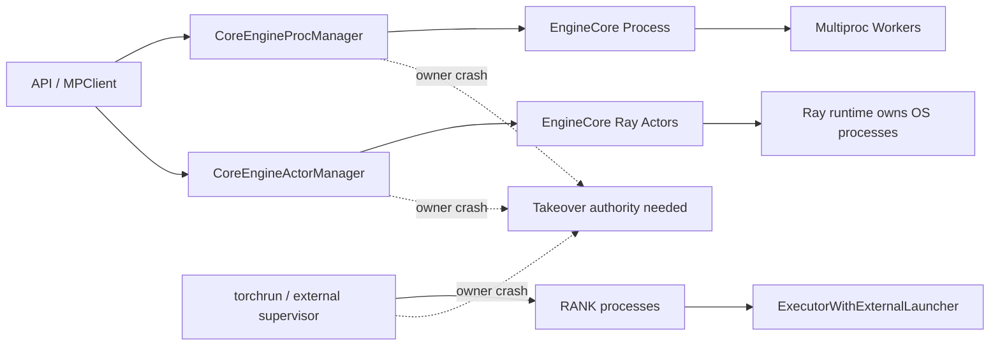
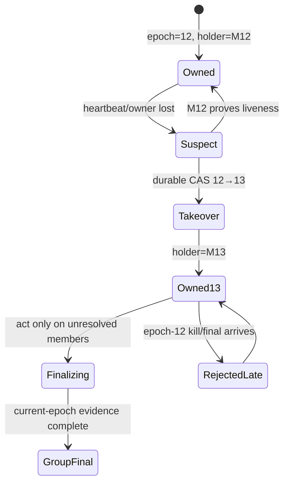

> 源码基线：vLLM [`79468c20`](https://github.com/vllm-project/vllm/commit/79468c20ef23227d4e051f807e10fd54fb24e24f)，默认分支 `main`，核验日期 2026-09-22。相对上一章的 `9b49f923` 前进 63 个 commit；[比较结果](https://github.com/vllm-project/vllm/compare/9b49f92344312c41ad61e05282c8e6a2d9bafb7f...79468c20ef23227d4e051f807e10fd54fb24e24f)显示本文分析的 owner/shutdown 实现没有语义变化。

## 本篇在课程路线中的位置

上一章把 MP、Ray 与 external launcher 的终态统一为 `MemberFinal + GroupFinal`，同时保留 `direct_reaped / actor_terminal / launcher_reaped` 三类 owner-specific evidence。本章只追问一个边界清晰的问题：**生产这些证据的 owner 自己先死了，谁可以接管？**

结论先行：观察到 owner 消失，不等于自动继承它的权限。安全 takeover 至少需要：

`durable member identity + monotonic owner_epoch + compare-and-swap authority + backend-specific terminal proof`

因此课程主线推进为：

`backend owner adapter → owner crash → fenced takeover → crash/restart golden`

## 前置知识回顾

已有三条不变量继续成立：

1. `kill sent`、`exit observed`、`reaped` 与 `domain empty` 是不同证据等级。
2. MP parent、Ray runtime、external supervisor 拥有不同回收权，统一接口不能伪造统一系统调用。
3. final 必须绑定 generation 与 owner-specific identity；裸 PID、rank 或布尔 `done` 都不够。

本章不再讨论 signal escalation 和 WAL frame，而是研究 authority 的创建、转移与失效。

## 本篇要回答的核心问题

1. 当前 `CoreEngineProcManager`、`CoreEngineActorManager` 和 external launcher 在 owner crash 后各留下什么可接管状态？
2. 为什么“启动一个新 manager 再 kill 一遍”可能误杀新 generation，或永远无法完成旧 child 的 reap？
3. 怎样用 `owner_epoch` 与 backend token，使 takeover、迟到 final 和重复 cleanup 同时安全？

## 组件在全局架构中的位置



图中的 takeover authority 是本文建议的协议，不是当前 vLLM 类型。当前代码事实是：MP 的 process handles 只保存在创建它们的 manager 内存里；Ray manager 保存 actor handles、run refs 与 placement groups；external executor 只读取 `RANK/LOCAL_RANK`，rank-group 生命周期在 launcher 外层。

## 完整调用链

### MP：monitor 能处理 child death，不能处理 monitor 自身死亡

[`MPClient`](https://github.com/vllm-project/vllm/blob/79468c20ef23227d4e051f807e10fd54fb24e24f/vllm/v1/engine/core_client.py)创建 `CoreEngineProcManager`，随后后台线程调用 `monitor_engine_liveness()`：

```text
MPClient
→ CoreEngineProcManager.__init__
→ context.Process(... EngineCoreProc.run_engine_core ...)
→ proc.start()
→ monitor_engine_liveness()
→ connection.wait(proc.sentinel)
→ child unexpected exit
→ manager.shutdown()
→ MPClient.shutdown()
```

[`CoreEngineProcManager`](https://github.com/vllm-project/vllm/blob/79468c20ef23227d4e051f807e10fd54fb24e24f/vllm/v1/engine/utils.py)还用 `weakref.finalize` 注册 best-effort shutdown。但若包含 manager 的 OS 进程被 `SIGKILL`，Python finalizer 和 daemon monitor thread 都不会继续执行。当前仓库也没有把 process handle、generation 或 takeover lease 写入独立 supervisor。**这是代码可见边界，不是说操作系统一定留下孤儿；它只说明 vLLM 当前没有可证明的接管协议。**

更关键的是：`waitpid/join` 权限不能随意转移。新启动的普通 manager 不是旧 child 的 parent，拿到旧 PID 也不能等价地消费 direct-child wait status。若系统需要 MP owner takeover，必须在启动时就把进程放到更高层的持久 owner domain，例如 subreaper、service supervisor 或 cgroup；事后仅靠 PID 扫描补不回来。

### Ray：runtime 还活着，不等于 vLLM takeover state 还在

[`CoreEngineActorManager`](https://github.com/vllm-project/vllm/blob/79468c20ef23227d4e051f807e10fd54fb24e24f/vllm/v1/engine/utils.py)创建 actor 后，在本地内存保存：

```text
local_engine_actors / remote_engine_actors
actor_run_ref_dict[actor] = actor.run.remote()
created_placement_groups
```

其 `.options(...)` 设置 placement 与 `runtime_env`，但当前 vLLM 没有在这条路径上写入 stable actor generation、durable owner record 或 takeover epoch；仓库也没有 `max_restarts` 配置。manager 正常退出时调用 `ray.kill(actor)` 并移除自己创建的 placement group；manager 若先崩溃，Ray control plane 可能仍能观察 actor，但替代 manager 缺少一份 vLLM 定义的、可验证的“哪些 actor 属于哪次 service generation”的记录。

所以 Ray takeover 的最小充分方案不是重新扫到几个 actor 就全部 kill，而是先恢复 `(service_generation, actor_id, run_ref/attempt, placement_group_id)`，再以 CAS 获得更高 `owner_epoch`。Ray State 是证据来源之一，但不能替代 vLLM 自己的 generation 绑定。

### External launcher：launcher attempt 才是 generation

[`ExecutorWithExternalLauncher._distributed_args()`](https://github.com/vllm-project/vllm/blob/79468c20ef23227d4e051f807e10fd54fb24e24f/vllm/v1/executor/uniproc_executor.py)只读取 `RANK` 与 `LOCAL_RANK`，并使用 `env://` 初始化。当前仓库没有读取 `TORCHELASTIC_RESTART_COUNT`，也没有把 launcher attempt 纳入 shutdown/final identity。

这意味着 rank 1 在 attempt 7 和 attempt 8 中可以拥有相同 `RANK=1`，但绝不是同一个 member。若旧 attempt 的迟到 `rank_final(1)` 被新 group 接受，就会把仍在运行的 attempt 8 错判为终止。这里真正的 owner 是 torchrun/Slurm/Kubernetes supervisor；vLLM rank 只能发布 local cleanup evidence，takeover 和 group containment 必须由 supervisor attempt fencing 完成。

## 关键类型、字段和状态生命周期

从第一性原理看，takeover 成功标准不是“另一个进程开始做 cleanup”，而是：任何时刻至多一个 authority 可以对同一 generation 发布有效 terminal final。

建议的最小记录为：

```text
OwnerLease {
  service_generation,
  owner_scope,          # mp_tree | ray_actor_group | launcher_attempt
  owner_epoch,
  holder_id,
  lease_deadline,
  expected_members,
  member_tokens,        # process token / actor id+attempt / launcher rank+attempt
  state_revision
}
```

对 final 的接受条件为：

`accept(final) iff final.generation == lease.generation AND final.owner_epoch == lease.owner_epoch AND final.member_token in lease.member_tokens`



生命周期中最容易犯错的是把 failure detector 当成 authority allocator。heartbeat timeout 只能进入 `Suspect`；只有 durable CAS 成功者才能进入 `Takeover`。否则网络分区中的 M12 与 M13 会同时执行 kill、remove placement group 或发布冲突 final。

## 逐函数源码解读

### `CoreEngineProcManager.__init__/shutdown`

`self.processes` 持有真实 `BaseProcess`；`shutdown()` 通过 `_finalizer.detach()` 保证正常路径 single-shot，然后把进程列表交给公共 `shutdown(procs, timeout)`。这个 single-shot 只在同一 Python 对象生命周期内有效，不能跨 owner crash 或新 manager 进程防重。

### `monitor_engine_liveness`

MP 版本等待 sentinel，Ray 版本等待 `actor.run()` 的 refs；两者发现任一成员异常后都收敛到自己的 `shutdown()`。这是“owner 还活着时 sibling fail-stop”的机制，不是 owner takeover。当前没有 `owner_epoch`，也没有从 durable registry 恢复 unresolved member set。

### `EngineCoreSentinel.retry`

[`EngineCoreSentinel`](https://github.com/vllm-project/vllm/blob/79468c20ef23227d4e051f807e10fd54fb24e24f/vllm/v1/fault_tolerance/engine_core_sentinel.py)值得用来划清边界：busy loop 抛异常时，仍存活的 EngineCore 可进入 `UNHEALTHY`，重建 DP group 后 `retry`；若 `model_executor.is_failed`，状态变为 `DEAD`，`retry` 被拒绝。它恢复的是**同一存活 owner 内的执行状态**，并不重建死亡的 process manager、Ray control plane 或 launcher attempt。

## 具体示例与状态演算

设 TP=2，service generation 为 41，当前 owner `M12` 持有 `owner_epoch=12`：

| 时刻 | 事件 | 无 fencing 的危险 | fenced 结果 |
|---:|---|---|---|
| 0.0 s | rank 0 正常退出，M12 尚未落 final | 状态只在 M12 内存 | durable record 仍列 rank 1 unresolved |
| 2.0 s | M12 崩溃 | M13 仅按 PID/rank 猜成员 | detector 标记 `Suspect` |
| 3.0 s | M13 CAS `12→13` 成功 | M12 若是假死可并发 cleanup | epoch 12 authority 立即失效 |
| 4.0 s | M13 对 rank 1 执行 backend-specific containment | 可能误杀已重启的新 rank 1 | token 必须匹配 generation 41 |
| 5.0 s | 旧 M12 的 final 迟到 | 覆盖 M13 状态 | 因 `owner_epoch=12` 被拒绝 |
| 6.0 s | launcher/Ray 新 attempt 使用同 rank | 旧 final 被错误复用 | 新 member token 与 generation 42 不匹配 |

MP 还有额外约束：即使 M13 获得 epoch，也未必获得 direct-child reap 权。此时正确 final 应是 `takeover_acquired + containment_unknown`，除非更高层 supervisor/subreaper 能提供 domain-empty 证据。authority fencing 防止错误动作，但不会凭空创造操作系统权限。

## 为什么这样设计及替代方案

### 方案 A：owner crash 后完全不接管

实现最简单，也避免双杀；代价是 orphan actor/process、GPU 占用和永远缺失的 final。只适合外层编排器保证整 pod/node 销毁的部署。

### 方案 B：新 manager 扫 PID/actor/rank 后 best-effort cleanup

恢复快，但 identity 太弱：PID reuse、Ray actor replacement、torch elastic restart 都能让旧 cleanup 作用于新实例。把 kill 做成“幂等”也无济于事，因为对错误对象重复 kill 仍然错误。

### 方案 C：durable lease + monotonic epoch + backend adapter

这是最小可证明方案。稳态只需低频续租/状态写；故障时才执行 CAS 与 member reconciliation。成本是引入 registry 可用性、lease clock/TTL 设计和 crash-replay 测试，但它同时解决 double final、旧 generation 污染和 split-brain cleanup。

## 性能、并发、正确性与边界条件

- **延迟与吞吐：**takeover 不在 token 热路径；续租不能依赖 GPU stream，也不能把 registry 写入每一步 inference。
- **并发：**single-writer 由 durable CAS 保证，Python lock 或 `_finalizer.detach()` 只能保护单进程内并发。
- **正确性：**member identity 必须是 backend token，而非裸 PID/rank；所有 destructive action 都要携带 current epoch。
- **可用性：**registry 不可用时应停止接管并输出 `unknown`，不能让多个 candidate 自行升级为 owner。
- **Ray 边界：**control plane 不可用时，actor terminal 证据降级；恢复 control plane 后仍需核对 actor attempt 与 placement-group identity。
- **MP 边界：**新 manager 无 direct-child relation 时，不能声称 `reaped`；process group/cgroup 只能证明 containment，不能伪造 wait status。
- **external 边界：**同一 `RANK` 跨 restart 不稳定；group key 至少包含 launcher job/attempt。
- **graphability：**协议不改变 CUDA Graph，但旧 generation 的 Worker/actor 未隔离前不能把其显存地址安全交给新 generation。

## 测试证据与未覆盖风险

### 当前测试事实

- [`test_ray_v2_executor_shutdown`](https://github.com/vllm-project/vllm/blob/79468c20ef23227d4e051f807e10fd54fb24e24f/tests/distributed/test_ray_v2_executor.py)验证 TP=2 正常 shutdown 后 actor RPC 抛 `RayActorError`；另一个测试用 `ray.kill(..., no_restart=True)` 验证 monitor 回调。它们都没有杀死 manager/driver 后再接管。
- [`test_injected_fault_retry_recovers_all_ranks`](https://github.com/vllm-project/vllm/blob/79468c20ef23227d4e051f807e10fd54fb24e24f/tests/v1/fault_tolerance/test_fault_tolerance_e2e.py)注入 rank 1 busy-loop 异常，验证两 rank 进入 `UNHEALTHY`、执行 `retry` 后恢复 serving。
- 同文件的 `test_worker_kill_survivor_unhealthy_and_dead_rejects_retry` 直接 SIGKILL Worker，验证 survivor 为 `UNHEALTHY`、victim 为 `DEAD`，且 DEAD engine 拒绝 `retry`。这证明当前 FT 边界停在“EngineCore 仍活着且 executor 未死”。
- [`test_torchrun_example.py`](https://github.com/vllm-project/vllm/blob/79468c20ef23227d4e051f807e10fd54fb24e24f/tests/distributed/test_torchrun_example.py)只覆盖正常 SPMD 一致性，没有 launcher crash/restart attempt。

### 应补的 takeover golden

1. `owner dies before any cleanup`：仅一个 candidate CAS 成功。
2. `owner dies after kill before final`：新 owner reconcile，不重复作用于新 generation。
3. `old owner returns after lease loss`：所有 destructive action 与 final 均被 epoch 拒绝。
4. `PID/rank reused`：相同数字、不同 member token，旧 final 必须 fail closed。
5. `registry unavailable`：不产生双 owner，最终为 bounded `unknown`。
6. `Ray control plane / launcher also lost`：不能从 action history合成 terminal proof。

仍未覆盖真实 manager `SIGKILL`、subreaper/cgroup、Ray driver 与 GCS 联合故障、torch elastic restart、lease expiry 时钟跳变，以及旧 GPU work 对新 generation 的迟到访问。

## 与前后章节的连接

上一章解决“不同 backend 中谁能证明 terminal”；本章解决“证明者失效后，权限怎样安全转移”。两者合起来才构成可恢复的 `ProcessFinal`：owner adapter 决定证据类型，takeover epoch 决定谁有资格生产该证据。

下一章将进入可执行验证：**Crash-at-every-boundary——在 create/register/kill/reap/final/checkpoint 每个边界注入 owner crash，构造 MP、Ray 与 launcher 的 takeover golden。**

## 本篇结论

1. failure detection 不授予 cleanup authority；takeover 必须由 durable CAS 产生单调 `owner_epoch`。
2. generation fencing 既要拒绝旧 final，也要约束 kill/remove placement group 等 destructive action；只给消息加 epoch 不够。
3. 当前 `EngineCoreSentinel` 能恢复存活 EngineCore 内的 `UNHEALTHY`，但 Worker `DEAD`、manager crash、Ray control plane loss 和 launcher restart 属于更高层 owner 问题。

### 三个理解检查问题

1. 为什么新的 MP manager 即使知道旧 child PID，也不能自然继承 `join()`/reap 权？
2. 为什么 heartbeat timeout 只能进入 `Suspect`，不能直接把 candidate 升级成 owner？
3. torch elastic restart 后 `RANK=1` 不变，为什么旧 `rank_final(1)` 仍必须被拒绝？

## 知识债

- 实际 `OwnerLease/owner_epoch/member_token` schema 与 durable registry；
- MP subreaper/process-group/cgroup adapter；
- Ray stable actor identity、restart attempt 与 placement-group reconciliation；
- torchrun/Slurm/Kubernetes launcher attempt adapter；
- destructive action 的 epoch enforcement，而不仅是 final filtering；
- crash-at-every-boundary、clock jump、registry partition 与 late GPU work E2E。

## 下一章

**Crash-at-every-boundary——create/register/kill/reap/final/checkpoint 的接管 Golden。**

## 第 38 章课程账本增量

- 源码基线：`79468c20ef23227d4e051f807e10fd54fb24e24f`。
- 已覆盖调用链：`MPClient → CoreEngineProcManager → sentinel monitor → shutdown`；`CoreEngineActorManager → actor.run ref → ray.wait → ray.kill`；`torchrun env → ExecutorWithExternalLauncher`。
- 已覆盖符号：`CoreEngineProcManager.__init__/shutdown/monitor_engine_liveness`、`CoreEngineActorManager.__init__/monitor_engine_liveness/shutdown`、`wait_for_completion_or_failure`、`EngineCoreSentinel.on_fault/retry`、`ExecutorWithExternalLauncher._distributed_args`。
- 新确认不变量：检测 owner 失效不等于获得 authority；跨 owner 防重必须依赖 durable monotonic epoch；destructive action 与 final 都要被 generation fence；MP reap 权不能事后由 PID 恢复。
- 测试事实：现有 FT 覆盖 alive EngineCore 的 UNHEALTHY retry 与 DEAD rejection，Ray 覆盖 actor death monitor，尚无 manager/driver/launcher crash takeover。
- 下一章：对 takeover 协议做 crash-at-every-boundary golden。
