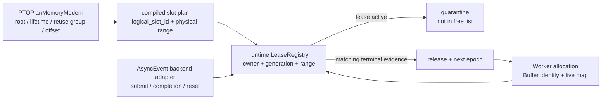
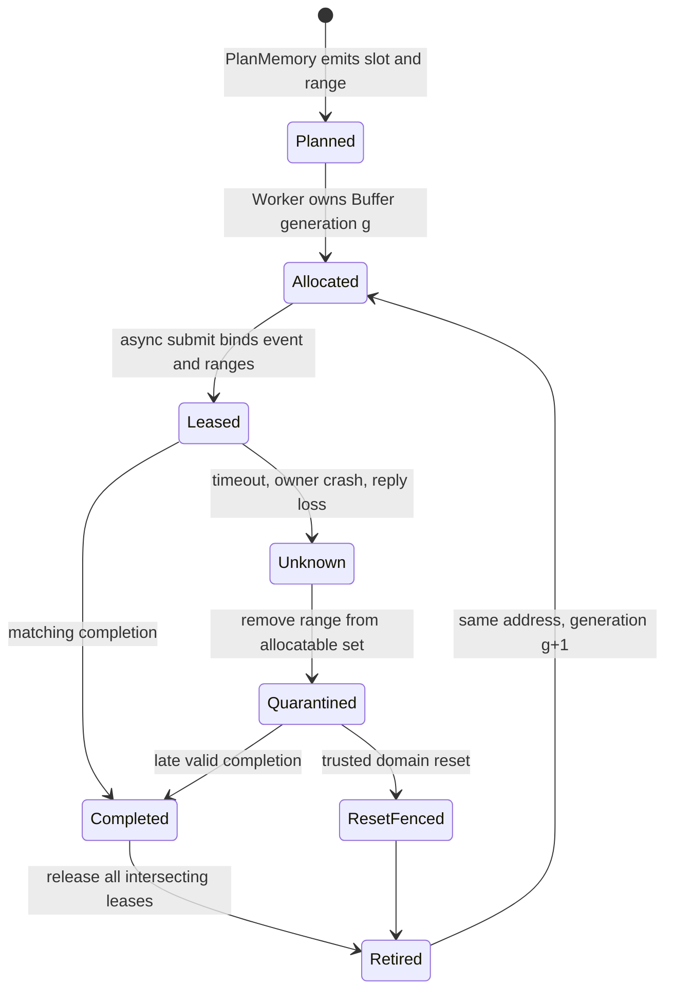

> 源码基线：PTOAS [`66bd855e`](https://github.com/hw-native-sys/PTOAS/commit/66bd855ed4a860df11c14393a6e64219c48aa723)，pypto [`e5927cff`](https://github.com/hw-native-sys/pypto/commit/e5927cff83b0b23dd913b27cc6e6b9a8c4c776a6)。PTOAS 相对课程 43 的 [`85af360e`](https://github.com/hw-native-sys/PTOAS/commit/85af360eed58068801d21c5e2c740e14f47b146b) 前进 6 个提交，改动集中于 VPTO/整数范围优化，并未新增 async lease 或 PlanMemory generation。本文把仓库已有行为标为**代码/测试事实**；跨 compiler/runtime 的 registry、epoch 与恢复协议是基于这些事实推导的**建议设计**。

## 本篇在 PTO 课程路线中的位置

课程 43 已确认：`AsyncEvent` 能表达 submit 与 completion，但没有绑定 allocation owner、byte range 或 generation；`Test=false`、timeout、cancel requested 都不能授权复用。今天只回答紧随其后的一个问题：**谁拥有 Lease Registry，谁才有资格把 quarantined 地址重新放回 free list？**

课程位置是：

`AsyncEvent → outstanding lease → runtime-owned registry → reuse epoch → crash recovery`。

## 前置知识

- `PlanMemory` 证明的是编译期 local root 能否共址，不是设备命令已经完成。
- 相同 pointer bits 不等于相同 allocation owner；地址被重新发放后，旧 handle 必须失效。
- generation 只有与“不复用、隔离或 execution-domain reset”绑定时，才能阻止迟到 DMA；单纯在软件表里加数字不能挡住真实写入。

## 今日 1–2 个核心问题

1. PTOAS `PlanMemory` 与 pypto `Worker` 各自掌握什么事实？为什么 compiler、event handle 或 allocator 单独持有 registry 都不完整？
2. 当 registry 或 owner 进程崩溃时，怎样恢复 `(owner, generation, range, event)`，又怎样在证据丢失时 fail closed？

## PTO 全栈中的位置



上游 compiler 给出静态别名与地址计划；runtime allocator 把计划映射到真实 Buffer；backend adapter 提供 completion/reset 证据。只有三者汇合处，才同时知道“哪一段物理内存、当前属于谁、是否仍可能被旧命令访问”。

## 概念和精确语义

### Registry 不是一张 `event_id → bool` 表

建议最小记录为：

```text
LeaseKey    = (execution_domain, owner_id, generation, event_id)
LeaseRecord = (direction, src_ranges, dst_ranges, session_id,
               submit_epoch, state, terminal_evidence)
SlotKey     = (plan_id, logical_slot_id, reuse_epoch)
```

`generation` 标识 runtime allocation 的一次发放；`reuse_epoch` 标识 compiler 规划槽的一次所有权交接。两者不能合并：同一 runtime Buffer 内可以有多个静态 slot；同一 slot 也可能在下一次 dispatch 映射到新的 Buffer。

释放条件不是“看到任意完成”，而是：

```text
Reusable(range, g) iff
  all leases intersecting range at generation g are terminal
  AND terminal evidence belongs to the same execution domain/generation
  AND no recovery fence leaves an unknown predecessor
```

## 真实文件、类型、API 或指令逐段解读

### 1. PTOAS：`PlanMemory` 有 offset，没有 runtime epoch

[`PTOPlanMemoryModern.cpp`](https://github.com/hw-native-sys/PTOAS/blob/66bd855ed4a860df11c14393a6e64219c48aa723/lib/PTO/Transforms/Passes/PTOPlanMemoryModern.cpp) 的 `RootInfo` 保存 `space`、`slotBytes`、`totalBytes`、`alignmentBytes`、`slotCount`、`allocIndex/freeIndex` 与最终 `offsets`。planner 先用 lifetime、phi/loop、target hazard、semantic no-alias 等闸门决定 `ReuseGroup`，再为 group 分配同一 `offsetBytes`，最后把常量地址写回 `pto.alloc_tile` 或 `pto.multi_buffer_addrs`。

输入是 `!pto.tile_buf`/local memref root 与其 use/effect；输出是每个 root 的编译期 local address，dtype/shape 决定 `slotBytes`，address space 决定独立容量域。它运行在编译进程内，不持有 runtime Buffer、device session 或 `AsyncEvent`，因此不可能知道一次真实 dispatch 是否完成。

这不是缺陷，而是正确的抽象边界：静态 planner 应输出可验证计划，不能冒充 runtime completion oracle。

### 2. `multi_tile_buf`：一个 allocation 内的 slot identity 已经存在

[`multi_tile_n4_planmem_e2e.pto`](https://github.com/hw-native-sys/PTOAS/blob/66bd855ed4a860df11c14393a6e64219c48aa723/test/lit/pto/multi_tile_n4_planmem_e2e.pto) 用 `count=4`、`16×16×f16` 验证每槽 512 B，PlanMemory 物化地址 `[0, 512, 1024, 1536]`，随后 `PTOResolveBufferSelect` 生成四个 addressed `alloc_tile`。

这证明 compiler 已能给出稳定的 slot/range；但这些数字仍只是 local address-space offset。建议为其补 `plan_id/logical_slot_id`，而不是把裸 offset 当跨 dispatch owner identity。

### 3. pypto：同地址的新 Buffer 已被视为新 allocation

[`runtime_base.py`](https://github.com/hw-native-sys/pypto/blob/e5927cff83b0b23dd913b27cc6e6b9a8c4c776a6/python/pypto/runtime/runtime_base.py) 的 `Worker.alloc_tensor()` 通过 `malloc` 创建 `DeviceTensor`，并以 `(worker_id, data_ptr)` 放入 `_owned_tensors`。`free_tensor()` 不只查 key，还要求表中对象 `is t`；若地址已经由另一个 `DeviceTensor` 占据，就报 `stale DeviceTensor`，不会 free 新对象。

[`device_tensor.py`](https://github.com/hw-native-sys/pypto/blob/e5927cff83b0b23dd913b27cc6e6b9a8c4c776a6/python/pypto/runtime/device_tensor.py) 还保留 simpler 的 owning `Buffer`，distributed wire ABI 由 Buffer 派生 descriptor，而不是只传进程本地裸指针。`DistributedWorker` 的 [`malloc/free`](https://github.com/hw-native-sys/pypto/blob/e5927cff83b0b23dd913b27cc6e6b9a8c4c776a6/python/pypto/runtime/distributed_runner.py) 则在 `_device_buffers[(worker_id, ptr)]` 保留 Buffer，并拒绝 interior/foreign pointer。

这是很关键的现有事实：pypto 已经承认“地址相同，allocation identity 仍可不同”。不过当前 identity 主要依赖 Python 对象/Buffer 身份，没有公开单调 generation，也没有关联 PTOAS `AsyncEvent` 与 byte interval。

## 对象/Tile/Buffer/IR 生命周期



`Buffer` 由 runtime 创建并持有；`LeaseRecord` 在 async submit 前原子注册，提交失败则回滚。completion 只消费匹配 record。`free_tensor` 只能把 allocation 标成 `Retiring`；若仍有 active/unknown lease，物理 Buffer 进入 quarantine，不能立即交给下一 generation。

## 端到端调用链或指令链

建议把现有两条真实链连接成：

```text
PTOPlanMemoryModern
  → RootInfo / ReuseGroup / offsets
  → pto.alloc_tile addr 或 pto.multi_buffer_addrs
  → compiled plan_id + slot ranges
  → Worker.alloc_tensor / simpler Buffer
  → registry.issue_generation(Buffer)
  → TPUT/TGET_ASYNC submit
  → registry.bind(event, owner generation, src/dst ranges)
  → Wait/Test/backend completion
  → registry.retire(event)
  → free/quarantine/reuse epoch++
```

当前代码真实覆盖前半段静态地址物化、runtime live allocation identity，以及课程 43 的 async submit/completion；中间的 shared token/registry 仍是建议接口，文章不把它描述成已实现能力。

## 具体 shape、Tile 和状态演算

取两个 `16×16×f16` slot，每个 `16×16×2 = 512 B`。PlanMemory 让不重叠生命周期的逻辑 root A、B 共用 local `[0,512)`；runtime Buffer 物理 base 为 `0x9000`。

1. dispatch 7：A 获得 `(owner=buf17, generation=41, reuse_epoch=8)`，物理区间 `[0x9000,0x9200)`。
2. `TPUT_ASYNC` 返回 `event=E7`；registry 在提交前写入 `E7 → (buf17,41,[0,512),Write)`。
3. 调用方 timeout，completion unknown。A 的 SSA lifetime 已结束，但 E7 的设备 lifetime 没结束；range 被 quarantine。
4. 若只按 PlanMemory 的 `freeIndex` 复用，B 会在同一地址取得 generation 42。E7 迟到写 512 B，完整覆盖 B。
5. 安全路径不把 `[0,512)` 放回 free list。若收到属于 execution domain D、generation 41 的 E7 completion，记录转 terminal，再发放 B：`generation=42, reuse_epoch=9`。
6. 若 registry 进程崩溃且 WAL/快照只恢复到“E7 已提交、终态未知”，必须继续 quarantine。只有能证明 D 已 reset、旧 queue 不可能执行，才能批量把该 domain 的 unknown lease 转成 `ResetFenced`。

空间代价很具体：正常完成时额外常驻仅一条几十字节 metadata；completion unknown 时损失 512 B 可分配容量。与直接复用导致 silent corruption 相比，这是合理的故障成本。

## 为什么这样设计及替代方案

| Registry 所在层 | 优点 | 根本缺口 |
| --- | --- | --- |
| compiler/PlanMemory | 最懂 alias、slot 与静态 range | 看不到实际 Buffer、dispatch generation、设备 completion 与进程崩溃 |
| `AsyncEvent` 对象 | 最靠近单次命令 | event 不拥有 allocation/free list；事件丢失或 owner crash 后无法决定地址能否重发 |
| allocator 单独持有 | 掌握真实 Buffer 与复用 | 若不接 backend completion，只知道有人引用，不知道旧 DMA 是否仍会写 |
| runtime Lease Registry + backend adapter | 同时掌握 allocation identity、range、completion domain | 协议与恢复成本较高，但职责完整 |

推荐最后一项。compiler 只发 immutable plan；runtime registry 是单一 authoritative owner；backend adapter 把设备特定 Wait/Test/reset 翻译成稳定 evidence。这样既不把动态故障语义塞进编译器，也不允许 backend event 越权管理 allocator。

## 访存、计算、流水、并行和硬件约束

- 正常路径不能为每个 event 全局 synchronize；registry 更新应是 O(1) key lookup，range 冲突可按 allocation 内 interval tree 或 slot bitmap 查询。
- register 必须先于 submit 可见，否则命令已飞、进程却在 record 落盘前崩溃，会产生不可追踪写。若无法原子化，可使用 `Prepared → Submitted` 两阶段并在恢复时把 `Prepared/Submitted` 都视为 unknown。
- quarantine 影响容量而非计算量；应按 device/session/owner 计数并设置高水位。容量耗尽时可拒绝新 dispatch 或 reset execution domain，不能偷偷复用。
- `reuse_epoch` 可使 stale completion fail closed，但不能替代硬件 fence。没有 reset 或不复用时，旧 DMA 仍会触碰同一物理字节。
- 公开代码没有给出 SDMA reset 的精确硬件覆盖范围，本文只要求 backend 提供可审计 evidence；具体 session/device 粒度仍是待验证推断。

## 测试证据与未覆盖风险

**现有测试事实：**

- PTOAS [`multi_tile_n4_planmem_e2e.pto`](https://github.com/hw-native-sys/PTOAS/blob/66bd855ed4a860df11c14393a6e64219c48aa723/test/lit/pto/multi_tile_n4_planmem_e2e.pto) 验证四个 512 B slot 的地址物化与 select lowering，但不验证跨 dispatch generation。
- [`plan_memory_reused_tstore_sync_level2.pto`](https://github.com/hw-native-sys/PTOAS/blob/66bd855ed4a860df11c14393a6e64219c48aa723/test/lit/pto/plan_memory_reused_tstore_sync_level2.pto) 用 180224 B pressure 强制复用路径，并验证物理范围重叠时 `TSTORE` 后插入 `PIPE_V` barrier；它证明 compiler 内同步，不证明 host/runtime crash 后的 async quiescence。
- pypto [`test_runtime_base.py`](https://github.com/hw-native-sys/pypto/blob/e5927cff83b0b23dd913b27cc6e6b9a8c4c776a6/tests/ut/runtime/test_runtime_base.py) 与 [`test_distributed_worker.py`](https://github.com/hw-native-sys/pypto/blob/e5927cff83b0b23dd913b27cc6e6b9a8c4c776a6/tests/ut/runtime/test_distributed_worker.py) 都构造“旧、新 Buffer 同为 `0xDEAD0000`”，验证旧 `DeviceTensor` 不能 free 新 allocation；另有 foreign worker resident tensor 在 submit 前被拒绝。

**仍未覆盖：** event→range binding、register-before-submit crash、completion-before-durable-record、registry restart、重复/冲突 terminal、旧 generation ACK、reset 证据范围、quarantine exhaustion，以及真实设备 late-write canary。

建议 cross-backend golden 固定七个边界：`prepare/register`、`register/submit`、`submit/ack`、`ack/retire`、`retire/free`、`free/reallocate`、`checkpoint/restart`。每个边界都 crash 一次；恢复结果只能是“同代终态可释放”或“证据不足继续隔离”，不能靠裸地址猜测。

## 与前后章节的连接

向前，本章给课程 43 的 quarantine 找到了权威 owner：不是 `AsyncEvent` 自己，而是控制 allocation free list 且能消费 backend evidence 的 runtime registry。向后，下一章应把协议变成可验证 schema：定义 `AsyncLeaseToken`、稳定 reason code 与 crash-at-every-boundary golden，并检查 EmitC/未来 VPTO adapter 的一致性。

## 本篇结论、知识债、三个理解检查问题和下一章

结论：

1. PTOAS `PlanMemory` 决定静态 slot 能否共址，却没有 runtime generation；它应产出 plan/range，而不拥有 Lease Registry。
2. pypto 已用 retained Buffer/object identity 阻止“同地址旧 handle free 新 allocation”，证明 owner identity 必须高于裸 pointer；但它尚未绑定 async event/range。
3. Registry 应由 runtime allocation owner 持有，compiler 提供静态计划，backend adapter 提供 terminal/reset evidence。崩溃后无法证明旧 execution domain 已隔离时，只能恢复为 quarantine。

知识债：shared `AsyncLeaseToken` 与 `SlotKey` IR/ABI、单调 generation/reuse epoch、durable register-before-submit、backend reset evidence、interval conflict index、quarantine budget、EmitC/VPTO adapter，以及 A3/A5 late-write/fault/perf matrix。

理解检查：

1. 为什么 `PlanMemory` 已证明 A/B 生命周期不重叠，runtime 仍可能禁止它们复用同一地址？
2. pypto 用对象身份拒绝 stale free，为什么还不足以阻止迟到 DMA？
3. registry 重启后只知道 event 已 submit、不知道是否 completed，为什么 generation++ 仍不能直接放行？

下一章：**一条 Lease 怎样可恢复——`AsyncLeaseToken`、register-before-submit WAL 与 Crash-at-every-boundary Golden。**

## 课程账本增量

- 主仓：PTOAS `66bd855e`；关联仓：pypto `e5927cff`。
- 新覆盖：`RootInfo/ReuseGroup/offsets`、multi-tile slot 地址、`Worker._owned_tensors`、retained simpler `Buffer`、stale/foreign allocation 拒绝测试。
- 新不变量：compiler plan 不能授权 runtime reuse；release 必须等待所有相交 lease 的同域同代终态；registry 证据丢失时默认 quarantine；software epoch 不替代 execution fence。
- 下一步：定义 durable token/WAL schema，并逐边界验证 submit、completion、retire、free、reallocate 与 restart。
