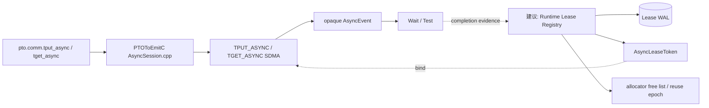
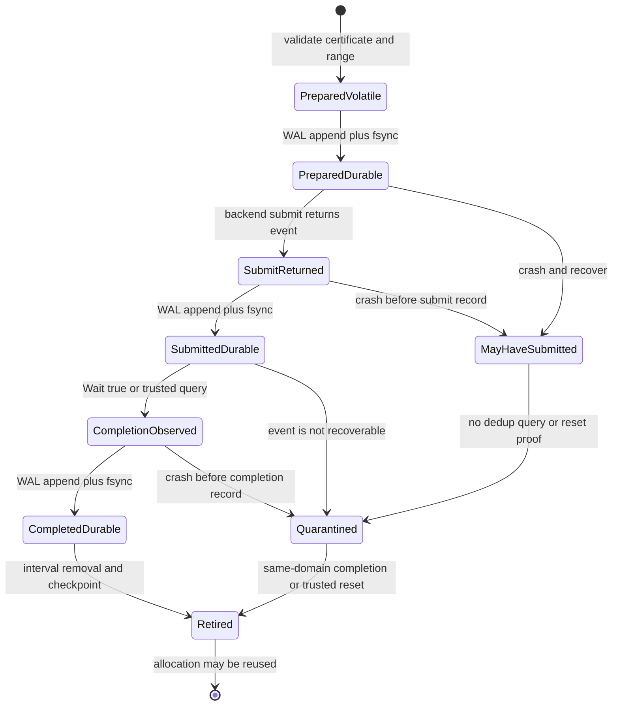

> 源码基线：PTOAS [`0a3e0173`](https://github.com/hw-native-sys/PTOAS/commit/0a3e0173121a21fea61c9580bf4781cbe32f261d)，默认分支 `master`，核验日期 2026-09-24。相对课程 44 的 [`66bd855e`](https://github.com/hw-native-sys/PTOAS/commit/66bd855ed4a860df11c14393a6e64219c48aa723) 前进 6 个提交；[比较结果](https://github.com/hw-native-sys/PTOAS/compare/66bd855ed4a860df11c14393a6e64219c48aa723...0a3e0173121a21fea61c9580bf4781cbe32f261d)显示改动集中在同步与 VMI/reduce，本文分析的 async communication 文件没有语义变化。文中的 PTO/EmitC 行为是**代码与测试事实**；`AsyncLeaseToken`、WAL 与 recovery state machine 是基于事实推导的**建议设计**，当前仓库尚未实现。

## 本篇在 PTO 课程路线中的位置

课程 43 证明了 `Test=false` 不等于 cancel，更不能授权 allocation 复用；课程 44 又把权威 owner 定在同时控制 free list、generation 与 backend completion evidence 的 runtime Lease Registry。本章只推进一个边界：**一条异步 DMA 如何在进程随时崩溃的前提下，被可靠地登记、恢复和退休？**

课程位置是：

`runtime Lease Registry → AsyncLeaseToken → register-before-submit WAL → crash-at-every-boundary golden`。

结论先行：WAL 能消除“DMA 已提交却完全没有记录”，却不能消除“已写 PREPARED，但 DMA 究竟提交没有”的歧义。没有 backend 去重 key、可恢复 event 或可信 execution-domain reset 时，恢复者只能把该 range 判为 `MAY_HAVE_SUBMITTED` 并 quarantine。

## 前置知识

1. pointer、view、allocation certificate 与 async lease 是四层对象；前两者不能证明 backing allocation 的 lifetime。
2. allocation `generation` 用于拒绝 stale evidence，不能阻止真实迟到 DMA；物理安全仍依赖 non-reuse、quarantine 或 reset fence。
3. `completion observed` 与 `completion durable` 不同。进程可能在 `Wait()==true` 后、WAL fsync 前崩溃。
4. compiler 的 `MemoryEffects` 描述 IR 依赖，不是设备完成回执。

## 今日两个紧密关联的核心问题

1. `AsyncLeaseToken` 至少要绑定哪些身份和 byte range，才能让 completion 只释放正确 generation？
2. register-before-submit 应如何排序，逐条 crash 后 recovery oracle 应输出 `safe-to-reuse`、`quarantine` 还是 `reset-required`？

## PTO 全栈中的位置



上游输入是静态、连续的一维 GM view 和 `AsyncSession`；下游消费者是 EmitC SDMA API。编译器能验证 shape/type/location，runtime 才能知道实际 allocation owner、generation、提交是否发生以及何时允许回到 free list。因此 WAL 不应由 `PlanMemory` 或设备 kernel 自己拥有，而应由上一章确定的 runtime registry owner 持有。

## 概念和精确语义

### 当前代码事实：AsyncEvent 只证明“有一个句柄”

依照 [`PTOOps.td`](https://github.com/hw-native-sys/PTOAS/blob/0a3e0173121a21fea61c9580bf4781cbe32f261d/include/PTO/IR/PTOOps.td)：

- `BuildAsyncSessionOp(scratch, workspace) -> !pto.async_session`；
- `TPutAsyncOp(dst, src, session) -> !pto.async_event`，语义是 local GM 到 remote GM 的异步写；
- `TGetAsyncOp(dst, src, session) -> !pto.async_event`，语义是 remote GM 到 local GM 的异步读；
- `WaitAsyncEventOp(event, session) -> i1` 阻塞等待；
- `TestAsyncEventOp(event, session) -> i1` 非阻塞查询。

`AsyncSessionType` 和 `AsyncEventType` 都是 opaque type。尤其是 Wait/Test 没有 verifier 把 event 与创建它的 session、src/dst 或 generation 重新关联；类型正确的 `event + session` 在 IR 层即可通过。这不表示 runtime 一定错误，而是说明 **owner/range/generation lineage 不属于当前 IR contract**。

### 当前操作数约束

[`PTOAsyncCommunicationVerification.cpp`](https://github.com/hw-native-sys/PTOAS/blob/0a3e0173121a21fea61c9580bf4781cbe32f261d/lib/PTO/IR/PTOPipeline/PTOAsyncCommunicationVerification.cpp) 固定了直接可见的合法性：

- src/dst 必须具有相同 element type、相同静态 shape；
- 两端必须是 static、flat、contiguous、logical 1D GM view；
- session scratch 必须位于 VEC，rank 为 1 或 2、shape 静态，容量至少 8 B；
- workspace 必须是 `!pto.ptr<i8, ...>`；
- `sync_id∈[0,7]`，`block_bytes>0`，`comm_block_offset≥0`，`queue_num>0`。

因此 `partition_tensor_view<128xf32>` 合法，总语义传输量为 `128×4=512 B`；`4×32xf32` 虽然也是 512 B，却因不是 flat logical 1D 而非法；动态 `?xf32` 也因 shape 不静态而被拒绝。

### 建议协议：Token 不是 Event 的别名

最小 token 可写成：

```text
AsyncLeaseToken {
  schema_version
  lease_id
  execution_domain_id
  session_generation
  submit_seq
  direction                  // PUT or GET
  src: (owner_id, generation, offset, length, access=READ)
  dst: (owner_id, generation, offset, length, access=WRITE)
  semantic: (dtype, shape, bytes)
  payload_hash
}
```

`lease_id` 用于幂等；`session_generation + submit_seq` 防止旧 event 冒充新 session 的完成；两个 `RangeRef` 让 interval index 知道哪些 allocation 不能 free。wall clock 可以帮助告警，却不能参与正确性判定。

### Token 的前置条件、后置条件与非法组合

创建 token 前，registry 至少要同时持有 src/dst 的可信 allocation certificate，而不是只拿到两个数值地址。certificate 中的 owner、generation、base、extent 必须与实际 allocator 记录一致；`offset + length` 要做 checked arithmetic，不能在整数溢出后重新落回 extent 内。PUT 的 src range 必须可读、dst range 必须可写；GET 虽然通信方向相反，最终仍要按 backend 实际读写角色冻结两端。session 必须属于同一个 execution domain，并且尚未进入 reset 或 teardown。

成功写入 PREPARED 的后置条件不是“DMA 已开始”，而是“两端 range 已进入不可复用集合，后续 submit 即使失去回执也不会成为无主访问”。成功写入 COMPLETED 的后置条件也不是立即 free，而是“存在可被 recovery 重放的完成证据”；只有 RETIRED checkpoint 同时从 interval index 删除 token、推进对应 reuse epoch 后，allocator 才能重新发放地址。

以下组合必须直接拒绝，而不能降级为 warning：

- token 中的 byte length 与 IR 的 `shape×sizeof(dtype)` 不一致；
- src/dst certificate 已换 generation，或 token 指向 allocation extent 之外；
- 相同 `lease_id` 携带不同 owner、range、direction 或 payload hash；
- 旧 session generation 的 event 试图完成新 session 的 submit sequence；
- completion 只覆盖部分 transfer，却被用于退休完整 range；
- registry 已进入 recovery，而调用方绕过 WAL 直接提交新的异步操作。

### WAL frame 与恢复算法

WAL 中不能只存一份会被原地覆盖的“当前状态”，否则崩溃可能同时破坏旧值和新值。建议每次状态推进都追加不可变 frame：

```text
FrameHeader {
  magic, schema_version, frame_length,
  lease_id, transition_seq, payload_crc
}
FramePayload {
  previous_state, next_state,
  token_or_token_hash, evidence
}
```

恢复器从 offset 0 顺序验证 length 与 CRC，在第一条 torn、长度非法或 CRC 不符的 frame 处停止；不能向后搜索下一个 magic，再把破损尾部后的记录拼进 durable prefix。CRC 只能证明字节完整，不能证明状态迁移合法，因此还要验证 `transition_seq` 连续、`previous_state` 匹配、token identity 不变，并拒绝 `COMPLETED→SUBMITTED` 之类回退。

最小恢复过程分四步：

1. 重建每个 lease 的最后完整 durable state，并把冲突 frame 标成 registry corruption。
2. 将所有 PREPARED、SUBMITTED 以及 completion 未 durable 的 lease 加入 interval quarantine；先重建阻塞集合，再开放 allocator。
3. 交给 backend adapter 查询同一 execution domain/session generation 的 terminal evidence。查询不可用不是“未完成”，而是 evidence unavailable。
4. 只对 COMPLETED 或有可信 reset fence 的 lease执行幂等 RETIRE；最后原子发布 registry checkpoint，再允许 WAL rotation。

这套顺序还有一个容易遗漏的启动不变量：allocator 必须晚于 recovery quarantine 建立。若先恢复 free list、后扫描 WAL，即使最终能读出 outstanding lease，中间窗口也可能已经把旧 dst 发给新 generation。

## 真实文件、类型、API 与 lowering 解读

### 1. Session 建立

[`AsyncSession.cpp`](https://github.com/hw-native-sys/PTOAS/blob/0a3e0173121a21fea61c9580bf4781cbe32f261d/lib/PTO/Transforms/PTOToEmitC/ScalarMisc/AsyncSession.cpp) 把 `BuildAsyncSessionOp` lower 成：

```text
BuildAsyncSession<DmaEngine::SDMA>(
    scratch_tile, workspace_gm_i8, session,
    sync_id, SdmaBaseConfig, channel_group_idx)
```

缺省 `SdmaBaseConfig` 是 `blockBytes=32768`、`commBlockOffset=0`、`queueNum=1`。这些值配置 SDMA session，却没有 allocation owner 或 generation 字段。

### 2. 提交与事件

`PTOAsyncTransferToEmitC` 将 PUT/GET 分别变为 `TPUT_ASYNC<DmaEngine::SDMA>` 与 `TGET_ASYNC<DmaEngine::SDMA>`，返回 `pto::comm::AsyncEvent`。然后 `PTOAsyncEventToEmitC` 把 Wait/Test 变成 event 的 `.Wait(session)` / `.Test(session)` 调用。

[`PTOSimtVerificationAndAsyncEffects.cpp`](https://github.com/hw-native-sys/PTOAS/blob/0a3e0173121a21fea61c9580bf4781cbe32f261d/lib/PTO/IR/PTOPipeline/PTOSimtVerificationAndAsyncEffects.cpp) 将 transfer 的 dst 标成 Write、src/session 标成 Read、event 结果标成 Write；[`PTOCollectivePipelineEffectsAndConvertAssembly.cpp`](https://github.com/hw-native-sys/PTOAS/blob/0a3e0173121a21fea61c9580bf4781cbe32f261d/lib/PTO/IR/PTOPipeline/PTOCollectivePipelineEffectsAndConvertAssembly.cpp) 则为 Wait/Test 标记读取 event/session、写 completed result。这能约束 compiler rewrite，但无法表达“异步写在 op 返回后仍可能修改 dst”所要求的跨进程 lease。

### 3. 为什么必须先写 WAL

如果顺序是 `submit → append token`，进程可在 SDMA 接受提交后立即崩溃，registry 中完全没有这条 range；allocator 随后可能把 dst 发给新 generation。register-before-submit 把顺序改为：

```text
append PREPARED(token) → fsync → submit(token) → append SUBMIT_RETURNED → fsync
```

但 PREPARED 恢复时仍有两种 indistinguishable history：崩溃发生在 submit 调用前，或 submit 生效后但 `SUBMIT_RETURNED` 尚未 durable。因此 PREPARED 的 recovery 含义不是 `NOT_SUBMITTED`，而是 `MAY_HAVE_SUBMITTED`。

## AsyncLeaseToken 的生命周期



当前 `AsyncEvent` lower 成 opaque C++ handle，公开代码没有证明它能在进程重启后序列化、重连或查询。因此恢复器不能假设能重建 event；这是**代码事实边界**。若未来 backend 提供持久 operation key/去重查询，则 `MayHaveSubmitted` 可以安全重试；否则只能 quarantine 或 reset execution domain。

### 从 SSA 对象到 runtime range：两条生命周期不能混在一起

当前真实 IR 对象的生命周期很清楚：`pto.alloc_tile` 创建 VEC scratch，`BuildAsyncSessionOp` 消费 scratch 与 GM workspace 并产生 session SSA value；`TPut/TGetAsyncOp` 消费 session 和两个 GM view，产生 event SSA value；Wait/Test 再消费 event 与 session。lowering 后，scratch 成为具体 Tile，session 成为 EmitC variable，event 成为 SDMA API 返回的 opaque C++ 对象。函数结束或进程崩溃时，这些 host/IR handle 可以一起失效。

但被 DMA 引用的 allocation 生命周期不能跟着 SSA handle 一起结束。submit 返回后，src 仍可能被设备读取，dst 仍可能被设备写入；即使 compiler 已经没有后续 SSA use，runtime 也不能据此释放 backing storage。`MemoryEffects::Read/Write` 能阻止某些编译期错误重排，却没有把 ownership 延长到异步 terminal。

`AsyncLeaseToken` 的作用正是把这两条时间线解耦：SSA event 负责当前进程内的快速 Wait/Test，token 用稳定 owner identity 和 byte interval 跨越进程崩溃。正常路径中，event completion 生成 token 的 terminal evidence；异常路径中，event 消失而 token 留在 WAL，range 因此继续被 quarantine。只有 recovery adapter 给出同 session generation 的 completion，或者更强的 domain reset 证明，token 才能退休。

还要注意 session scratch/workspace 与传输 payload 是不同资源。scratch/workspace 支撑 SDMA 控制状态，src/dst 承载用户数据；不能因为 payload range 已完成就提前销毁仍服务其他 event 的 session，也不能因为 session 对象析构就推断全部 payload 已完成。第一版实现应维护 `session → outstanding lease set`，并要求 session close 时该集合为空，或把剩余 lease 全部转入 quarantine。

## 端到端生成链

以现有 lit 的 PUT 为例：

```text
!pto.partition_tensor_view<128xf32> src/dst in GM
  → pto.alloc_tile<1×256xi8, VEC>
  → pto.comm.build_async_session
  → pto.comm.tput_async
  → !pto.async_event
  → pto.comm.wait_async_event
  → EmitC BuildAsyncSession<SDMA>
  → EmitC TPUT_ASYNC<SDMA>
  → event.Wait(session)
```

建议 runtime seam 插在真正的 SDMA submit 之前：compiler 继续生成 transfer intent，host/runtime 将 concrete src/dst allocation certificate 物化为 token，先 durable register，再调用生成代码或 backend adapter。compiler 不能凭静态 SSA 名称伪造 runtime owner。

## 具体 shape、range 与 crash 演算

设：

- src：owner `S`，generation 18，GM 区间 `[0x1000,0x1200)`；
- dst：owner `D`，generation 41，GM 区间 `[0x8000,0x8200)`；
- dtype/shape：`f32[128]`，512 B；
- session generation 7，`submit_seq=23`；
- token 为 `L=(domain=A3-0, session=7, seq=23, S/18, D/41, 512B)`。

逐步演算：

1. registry 验证两端 range 都落在 certificate 内，并把 `L/PREPARED` 写入 WAL；只有 frame length、payload 与 CRC 都完整且 fsync 成功才允许继续。
2. SDMA 接受 PUT，event 已返回；进程在写 `SUBMIT_RETURNED` 前崩溃。
3. recovery 扫描 WAL，只读到 `PREPARED`。它不能重发 PUT：第一次可能已在飞，第二次虽然写相同字节，仍可能跨越 allocator 的后续状态与 ordering。
4. D/41 的 `[0,512)` 被 quarantine；generation 42 不得获得同一物理区间。S/18 也必须保持 readable，直到 terminal，因为 DMA 可能尚未读取完 source。
5. 若 backend 能给出同 session/seq 的 completion，写 `COMPLETED` 并 fsync；若只能 reset 整个 domain，则 reset evidence 必须先证明旧 work 不可能再到达。
6. 完成记录 durable 后，registry 才从 interval index 删除 lease、推进 slot reuse epoch，并把地址交给 generation 42。

如果 dst 先被复用，迟到 PUT 会把 512 B 全部覆盖到 D/42；generation 字段只能让软件拒绝迟到回执，无法撤销真实写入。

## Crash-at-every-boundary Golden

| 故障点 | 恢复可确认的最高状态 | 安全动作 |
| --- | --- | --- |
| PREPARED append/fsync 前 | no durable lease；协议禁止 submit | 丢弃 volatile token |
| PREPARED durable、submit 前或后 | `MAY_HAVE_SUBMITTED` | quarantine；仅在 backend 去重时重试 |
| submit 返回、SUBMITTED fsync 前 | `MAY_HAVE_SUBMITTED` | 同上，不能根据 API 返回的丢失推断未提交 |
| SUBMITTED durable、Wait 前 | submitted，completion unknown | 恢复 query；否则 quarantine/reset |
| Wait true、COMPLETED fsync 前 | WAL 仍只证明 submitted | 不得复用；query/reset 后补 final |
| COMPLETED durable、retire 前 | completion proven | 幂等 retire，冲突 payload fail closed |
| retire/checkpoint torn write | 以最后完整 durable frame 为准 | replay interval removal，不扫描坏 frame 后内容 |

Golden 至少要断言四件事：相同 `lease_id+payload_hash` 重放幂等；同 ID 不同 payload 拒绝；旧 generation completion 不能释放新 allocation；任何 `MAY_HAVE_SUBMITTED` range 都不进入 free list。

测试实现上，不应只在 Python 调用前后加随机 `sleep`。更稳定的做法是给 WAL append、fsync、backend submit-return、Wait-return、retire 与 checkpoint publish 各放一个 test-only failpoint；父进程在命中点后硬杀 runtime，再用同一 WAL 和 allocator snapshot 启动 recovery。每个 failpoint 都运行 before/after 两种崩溃，oracle 同时检查 durable state、quarantine interval、free-list membership、generation 和 canary。这样才能区分“控制进程死了”与“迟到设备写仍在发生”。

## 为什么这样设计及替代方案

### 替代一：submit 后记日志

写放大较低，但存在无记录的 in-flight DMA，是不可恢复的 unsafe window。

### 替代二：所有传输都改同步

最易推理，`TPUT/TGET` 返回即可作为 host 控制流边界；代价是失去 SDMA 与计算/其他搬运重叠，长链路吞吐和尾延迟可能恶化。具体幅度需要真机 trace，公开源码不能给出数字。

### 建议：WAL + backend-specific recovery adapter

保持 async overlap，同时把未知状态显式隔离。若每个 512 B transfer 都单独 fsync，持久化开销可能远大于 DMA 本身；可以对同一 session 的 token 做 bounded group commit，或只在可能发生 runtime address reuse 的管理层启用 durability。但 group commit 只能合并同步，不能倒置 `PREPARED durable before submit`。

三种方案的成本边界也不同。同步传输不需要长期保存 event/token，但把 DMA completion 直接放进关键路径；逐 transfer WAL 的恢复精度最高，却增加持久化 I/O、frame 索引和 quarantine 元数据；group commit 可把多条 PREPARED 合并为一个 durable batch，不过 batch 中任一 submit 前都必须等共同 fsync，窗口过大会增加启动延迟。合理的优化顺序应是先建立无歧义的 reference protocol，再测量 session 内并发数、WAL bytes、fsync latency 与 quarantine 峰值，最后选择 batch 上限；不能先写一个“异步刷盘”线程，再默认日志最终会追上设备提交。

interval index 的空间复杂度与 outstanding lease 数量相关，而不是 allocation 总容量。正常完成后应及时 checkpoint/compact；但 compact 只能处理已经 durable retired 的 token，不能为了压缩 WAL 删除 MAY_HAVE_SUBMITTED。若日志设备故障或 quarantine 达到容量上限，安全退化是停止新 submit、对调用方 backpressure，并尝试可信 reset；继续提交并期待稍后补日志会重新打开 untracked-DMA 窗口。

## 访存、计算、流水、并行与硬件约束

- **访存**：PUT 对 src 是 read lease、对 dst 是 write lease；GET 的本地/远端角色相反，但同样必须冻结两端 range。
- **流水**：async 的收益来自 submit 与其他工作重叠；Wait 过早会退化成同步，Test polling 则不能在 false 时释放资源。
- **并行**：多个不相交 interval 可并行；相交 range 只有在访问模式兼容且 ordering 明确时才能共存。第一版 registry 应保守拒绝 write overlap。
- **资源**：session scratch 在 VEC，workspace 在 GM；token/WAL 属于 host runtime 元数据，不应占用 Tile 或设备寄存器。
- **硬件映射推断**：EmitC 明确选择 `DmaEngine::SDMA`，可推断 transfer 由独立 DMA 路径执行；但公开代码没有证明设备 exactly-once、event 跨进程可恢复或 reset 粒度，因此这些不能写成硬件事实。
- **容量**：quarantine 会减少 allocator 可用空间。容量耗尽时必须 backpressure/reject 或触发可信 reset，不能静默复用 unknown range。

## 测试证据与未覆盖风险

[`async_put_get_emitc.pto`](https://github.com/hw-native-sys/PTOAS/blob/0a3e0173121a21fea61c9580bf4781cbe32f261d/test/lit/pto/async_put_get_emitc.pto) 用 `128xf32`、VEC `1×256xi8` scratch 和 GM byte workspace，检查生成的 Session、PUT、GET、Wait、Test 文本。它证明 lowering 形状，不执行设备 DMA，也不验证 completion 时序。

[`async_put_invalid_non_1d.pto`](https://github.com/hw-native-sys/PTOAS/blob/0a3e0173121a21fea61c9580bf4781cbe32f261d/test/lit/pto/async_put_invalid_non_1d.pto) 以 `4×32xf32` 验证 flat 1D 限制；[`comm_dynamic_async_scope_invalid.pto`](https://github.com/hw-native-sys/PTOAS/blob/0a3e0173121a21fea61c9580bf4781cbe32f261d/test/lit/pto/comm_dynamic_async_scope_invalid.pto) 以 `?xf32` 验证 static-shape 限制。它们都不检查 event/session lineage。

真实 Python 样例 [`tput_async_kernel_impl_like.py`](https://github.com/hw-native-sys/PTOAS/blob/0a3e0173121a21fea61c9580bf4781cbe32f261d/test/samples/AsyncComm/tput_async_kernel_impl_like.py) 为不同 target rank 创建 event 并立即 wait，展示了对象生命周期；仍没有进程崩溃、丢 completion、重复 submit、WAL torn write、旧 generation、late DMA canary 或 reset evidence 测试。

最高风险不是 FileCheck 漏一个函数名，而是：event 已完成但 final 未 durable、PREPARED 恢复后错误重试、source 过早释放、quarantine 耗尽后偷跑复用，以及 session reset 只重置软件对象却没有 fence 真实设备 work。

## 与前后章节的连接

课程 43 定义 completion unknown 的安全出口，课程 44 确定 registry owner；本章把一条 lease 的 identity、WAL 顺序和 recovery oracle闭合。它也反向约束 PlanMemory：静态 reuse group 只有在 runtime token 已 Retired 时，才能推进对应 slot 的 `reuse_epoch`。

下一章将继续解决本章刻意留下的最大缺口：WAL 还在，但 opaque `AsyncEvent` 随进程消失时，A3/A5 backend adapter 怎样提供 query、session reset 或 device reset evidence，并用 late-write canary 证明 reset 之后旧 DMA 不会到达。

## 本篇结论

register-before-submit 的真正含义不是“WAL 中有记录就可以重试”，而是“任何可能提交的 DMA 都有一个可定位、可隔离的 owner-range-generation token”。恢复后的 PREPARED 必须降为 `MAY_HAVE_SUBMITTED`；只有同代 completion、backend 去重查询或可信 execution-domain reset 能解除 quarantine。

### 知识债

- `AsyncLeaseToken/RangeRef` 的真实 schema、版本与 stable reason code；
- runtime WAL、CRC/torn-write recovery、group commit 与 checkpoint；
- event→session→owner-range lineage verifier；
- A3/A5 backend operation key、completion query 和 reset evidence；
- interval conflict index、quarantine budget/backpressure；
- crash-at-every-boundary、late-write canary、旧 generation 与重复 payload Golden；
- VPTO 对 async SDMA 的 parity 或稳定 fail-closed contract。

### 三个理解检查问题

1. 为什么 PREPARED 已 durable、但没有 SUBMITTED 记录时，恢复者仍不能断言 DMA 未提交？
2. 为什么 `Wait()==true` 后 allocation 仍不能立刻复用，而要等 COMPLETED record durable？
3. 为什么 generation 能拒绝 stale completion，却不能单独阻止旧 DMA 写入新 generation？

### 下一章

**WAL 还在，Event 已没了——Backend Recovery Adapter、Session Reset Evidence 与 Late-write Canary。**

## 课程账本增量

- 新覆盖：PTO async op/type、verifier、MemoryEffects、EmitC SDMA lowering与直接 lit/sample。
- 新不变量：register-before-submit 只消除 untracked submit，不消除 prepared/submitted ambiguity；恢复的 PREPARED 必须视为 MAY_HAVE_SUBMITTED。
- 新协议：token 绑定 execution domain、session generation、submit sequence、src/dst owner-generation-range 与 payload hash。
- 新测试路线：WAL append/fsync、submit、completion、retire/checkpoint 每个边界前后崩溃，并验证 quarantine、幂等与旧代拒绝。
