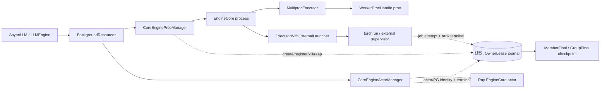
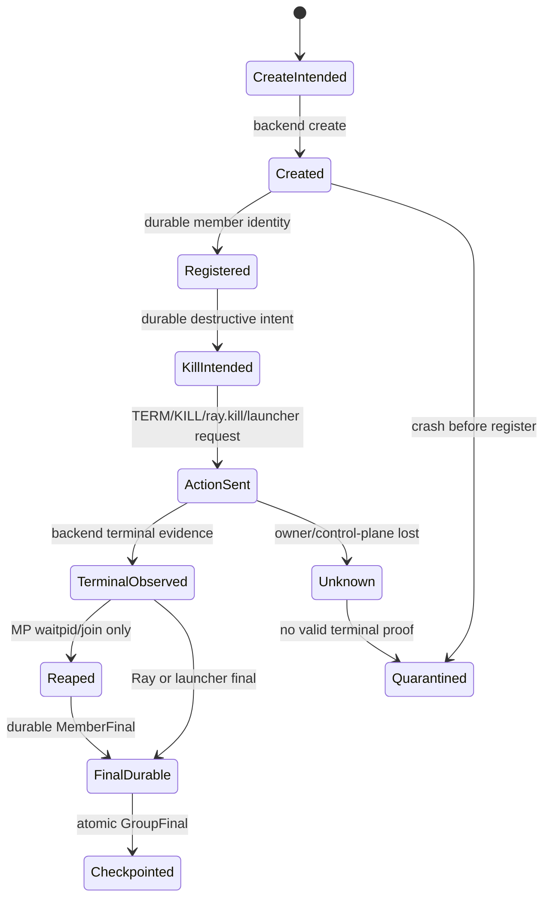

> 源码基线：vLLM [`9ef37771`](https://github.com/vllm-project/vllm/commit/9ef37771beac1c1ce6a8b7ceae1f7ebeb6f51800)，默认分支 `main`，核验日期 2026-09-24。相对上一章的 `79468c20` 前进 116 个 commit；[比较结果](https://github.com/vllm-project/vllm/compare/79468c20ef23227d4e051f807e10fd54fb24e24f...9ef37771beac1c1ce6a8b7ceae1f7ebeb6f51800)中，本章直接分析的 shutdown/owner 路径没有出现改变本文结论的语义变化。

## 本篇在课程路线中的位置

上一章得到的核心结论是：owner 失联只产生 `Suspect`，不能自动授予接管权限；新 owner 必须取得单调 `owner_epoch`，并用 generation-safe member identity 约束 destructive action。本章不继续扩展 schema，而是回答一个更可操作的问题：**怎样证明这套接管协议在任意一条关键语句后崩溃，仍不会漏杀、误杀、重复回收或伪造 terminal？**

课程主线推进为：

`fenced takeover → crash-at-every-boundary → durable terminal convergence → backend fault-injection E2E`

## 前置知识回顾

先保留四条已确认不变量：

1. `signal sent`、`exit observed`、`direct child reaped`、`descendant domain empty` 是四级证据。
2. MP parent、Ray control plane、external launcher 分别拥有不同的终态证明权。
3. `owner_epoch` 不只过滤迟到 final，还必须约束 `kill`、`remove_placement_group` 等破坏性动作。
4. 同一个 PID、rank 或地址可以被复用；成员身份必须包含 group generation 与 backend-specific token。

## 本篇要回答的核心问题

1. `create → register → kill → reap → final → checkpoint` 每一步前后崩溃，各会留下什么可恢复证据？
2. 新 owner 能重试什么、必须拒绝什么，又何时只能报告 `unknown`？
3. 当前 vLLM 测试已经证明了哪些局部不变量，为什么还不足以证明 takeover？

## 组件在全局架构中的位置

当前代码没有 `OwnerLease`、durable registry 或 crash-recovery journal；下图右侧是本文提出的最小验证模型，不是现有实现。



上游输入是用户触发的 shutdown、fatal failure 或 liveness failure；下游消费者不是普通请求路径，而是决定“资源是否可复用、服务是否可安全重启”的 supervisor、allocator 与诊断系统。

## 完整调用链

以 MP 路径为主线，当前真实链路是：

1. [`CoreEngineProcManager.__init__`](https://github.com/vllm-project/vllm/blob/9ef37771beac1c1ce6a8b7ceae1f7ebeb6f51800/vllm/v1/engine/utils.py) 构造 `multiprocessing.Process`，逐个 `proc.start()`；若部分启动后失败，`finally` 会调用 `shutdown()`。
2. `CoreEngineProcManager.shutdown()` 把同一批 `BaseProcess` 交给 [`vllm.v1.utils.shutdown`](https://github.com/vllm-project/vllm/blob/9ef37771beac1c1ce6a8b7ceae1f7ebeb6f51800/vllm/v1/utils.py)。后者先 `terminate()`，在共享 deadline 内 `join(remaining)`，仍存活则 `kill_process_tree(pid)`。
3. EngineCore 内部的 [`MultiprocExecutor.shutdown`](https://github.com/vllm-project/vllm/blob/9ef37771beac1c1ce6a8b7ceae1f7ebeb6f51800/vllm/v1/executor/multiproc_executor.py) 关闭 death pipe，等待 Worker 自退，随后 TERM，4 秒后仍存活则 `p.kill()`。

最后一个分支正是边界：`p.kill()` 返回只证明系统调用已发出，不证明 Worker 退出，更不证明 parent 已 `join()`。外层 `v1.utils.shutdown` 对 TERM 阶段执行 join，但对 `kill_process_tree` 之后没有同步的 KILL→join/reap 收敛。

Ray 路径不同：[`CoreEngineActorManager.shutdown`](https://github.com/vllm-project/vllm/blob/9ef37771beac1c1ce6a8b7ceae1f7ebeb6f51800/vllm/v1/engine/utils.py) 对 actor 执行 `ray.kill()`，再删除 placement group；证明 actor terminal 的权威是 Ray runtime，而不是本地 `waitpid`。External launcher 路径中，[`ExecutorWithExternalLauncher`](https://github.com/vllm-project/vllm/blob/9ef37771beac1c1ce6a8b7ceae1f7ebeb6f51800/vllm/v1/executor/uniproc_executor.py) 每个 rank 只持有本地 `driver_worker`；整个 rank group 的退出只能由 torchrun 等 launcher 证明。

## 关键类型、字段和状态生命周期

当前真实对象 `WorkerProcHandle.proc` 的生命周期是：parent 创建 `BaseProcess` → READY 后装入 `WorkerProcHandle` → shutdown 时关闭 death pipe → grace/TERM/KILL → `is_alive()` 观测。它缺少持久化 generation、operation id 与 final。

为了测试接管，需要给生命周期增加一个最小、可序列化的记录，而不是把更多含义塞进布尔 `is_alive`：

```text
MemberKey = (group_generation, backend, backend_member_token)
OwnerLease = (MemberKey, owner_epoch, owner_id)
KillIntent = (MemberKey, owner_epoch, op_seq, reason)
MemberFinal = (MemberKey, owner_epoch, evidence_level, result)
```

`op_seq` 只在同一 `(MemberKey, owner_epoch)` 内单调。恢复时，同 key、同 seq、同 payload 可以幂等重放；同 seq 不同 payload 必须 fail closed。旧 epoch 的 final 也许能作为诊断附件保存，但不能推进当前 checkpoint。

## 逐函数源码解读

### 1. create 不是 register

`CoreEngineProcManager` 先把多个 `Process` 对象放进 `self.processes`，再逐个 `start()`。因此构造完成、OS child 出现、全组启动完成是三个时刻。当前 `finally` 能清理“部分进程已启动”的普通异常，却没有 durable register；若 manager 在 child 已创建、内存列表尚未来得及被外部 owner 持久化时崩溃，新 owner 不知道该 child 属于哪一代。

最小修复不是“启动后写日志”，而是 create token：先持久化 `CreateIntent(MemberKey, owner_epoch)`，创建动作携带或可反查该 token，成功后再写 `Registered`。否则 create/register 之间永远存在不可发现 orphan gap。

### 2. kill 必须先有可重放 intent

当前 shutdown 直接调用 `terminate()`、`ray.kill()` 或 `kill_process_tree()`。如果进程在动作后、记录前崩溃，接管者无法区分“尚未执行”与“已经执行但 ACK 丢失”。正确顺序是：

`durable KillIntent → backend action → durable ActionObserved`

恢复者可以重放同一 intent，但必须重新核对 `MemberKey + owner_epoch`。MP 不能仅凭旧 PID 重发信号；Ray 不能仅凭同名 actor；external backend 不能仅凭相同 `RANK`。

### 3. reap 与 final 仍是两次提交

`join()/waitpid` 是 MP parent 的回收动作，`MemberFinal` 是跨进程消费者可读的协议状态。parent 可以完成 reap 后、写 final 前崩溃；也可以写下“exit observed”后尚未 reap。两者必须分栏记录。Ray 使用 `actor_terminal`，external launcher 使用 `launcher_reaped`，不能为了统一 schema 把三者都伪装成 `direct_reaped=true`。

### 4. checkpoint 只聚合 durable final

`GroupFinal` 不能从“本轮内存里看起来都结束了”生成。它只能消费 journal 中已持久化、generation 匹配的 `MemberFinal`。checkpoint 发布仍沿用前文的原子边界：temp write、file sync、rename、directory sync；发布后崩溃，重放必须得到同一内容。

## 六个边界的状态机



六个逻辑边界对应的 golden oracle 是：

| 崩溃位置 | 恢复后必须成立 | 不能做 |
| --- | --- | --- |
| create 前后 | 未创建不产生 phantom；已创建未注册进入 discovery/quarantine | 假定“registry 无记录＝不存在” |
| register 前后 | `MemberKey` 只接受一次；重复同值幂等 | 用 PID/rank 补造 generation |
| kill 前后 | durable intent 可重放，旧 epoch 动作被拒绝 | 因 ACK 丢失改杀当前同 PID 成员 |
| reap 前后 | MP 区分 exit 与 waitpid；Ray/launcher保留自己的 proof class | 用 `is_alive=false` 冒充 direct reap |
| final 前后 | 重复 final 同值收敛，冲突 final fail closed | late final 覆盖更高 epoch |
| checkpoint 前后 | 只发布完整 durable member set，恢复结果字节稳定 | 从 volatile cache 拼出 success |

## 具体例子与状态演算

设 TP=2，`group_generation=27`，原 owner 为 `epoch=5`；rank 1 的 MP token 为 `(pid=4102, start_time=t0, parent_token=P5)`，kill 操作为 `op_seq=3`。

1. journal 已持久化 `KillIntent(G27,E5,r1,3)`。
2. owner 向 4102 发送 SIGKILL；内核接受后 owner 立即崩溃，尚未 `join()`，也未写 final。
3. takeover 通过 durable CAS 取得 `epoch=6`，重放 journal。它看到 intent，却不能把 4102 的“当前不存在/不存活”升级成 `direct_reaped`。
4. 若 supervisor 保留了合法 parent/subreaper handle，可消费 wait status，写 `MemberFinal(..., direct_reaped)`；若只剩 PID 快照，只能写 `containment_unknown` 并 quarantine 对应资源域。
5. 即使 OS 很快把 4102 复用给新进程，`start_time`、parent token 与 generation 不匹配，旧 intent 也不能作用于新成员。
6. rank 0、rank 1 final 都 durable 后，才生成 `GroupFinal(G27)`。若在 rename 后、directory sync 前再次崩溃，恢复不能宣称 checkpoint durable，必须按 WAL/checkpoint 规则重新验证。

这里没有 tensor shape；本章对象是进程与控制记录。与设备侧的联系是：若 terminal 仍为 unknown，旧 CUDA/NCCL work 也必须视为可能迟到，显存或 device domain 不得仅凭 host PID 消失而复用。

## 为什么这样设计及替代方案

只写一个大 E2E 最便宜，但 sleep、调度和 CI 负载决定崩溃落点，几乎无法稳定覆盖“动作已生效、ACK 未落盘”这一行。只做 monkeypatch 单测则能精确停在边界，却证明不了 `waitpid`、Ray actor terminal 或 launcher attempt 的真实语义。

更小且充分的方案是两层：

1. 用 deterministic failpoint 在六个持久化边界前后逐点崩溃，配合 replay oracle 验证状态机、幂等与 fencing。
2. 每个 backend 只保留少量真实 subprocess/Ray/torchrun E2E，验证 owner-specific evidence 与 unit model 一致。

failpoint 只在测试构建启用，不进入 token generation 热路径。生产路径真正增加的是最小 intent/final durable write；它位于 shutdown/failure control plane，可通过 group commit 降低同步次数，但不能为了吞吐跳过 register-before-create 或 intent-before-kill 的因果顺序。

## 性能、并发、正确性与边界条件

- **延迟**：正常推理不经过 takeover journal；shutdown 多一次或数次持久化边界，换来崩溃可判定性。
- **并发**：两个 owner 同时恢复时，只有 durable CAS 胜出的 epoch 能执行 destructive action。wall clock 只能用于 timeout，不能替代 fencing token。
- **正确性**：action retry 必须幂等或可去重；同 operation id 的 payload 冲突是 corruption，而不是 last-write-wins。
- **资源**：`unknown` 不是失败的别名，也不是成功的弱版本；它要求 quarantine 或由更强 supervisor/reset evidence 收敛。
- **graphability**：本协议位于控制面，不改变 ModelRunner tensor shape、CUDA Graph capture key 或执行图。
- **维护成本**：统一 journal schema，但保留 `direct_reaped / actor_terminal / launcher_reaped`，比把 backend 差异藏进一个布尔字段更容易审计。

## 测试证据与未覆盖风险

当前直接证据有三组：

1. [`test_engine_core_process_shutdown_timeout`](https://github.com/vllm-project/vllm/blob/9ef37771beac1c1ce6a8b7ceae1f7ebeb6f51800/tests/v1/engine/test_startup_watch_processes.py) 用 fake manager 验证 timeout 选择、`manager_stopped` 与 finalizer 幂等；它不创建真实 child，也不覆盖 manager crash。
2. [`test_multiproc_executor_worker_termination_timeout`](https://github.com/vllm-project/vllm/blob/9ef37771beac1c1ce6a8b7ceae1f7ebeb6f51800/tests/v1/executor/test_executor.py) 用 fake clock 证明 Worker 在 grace 内退出则不 TERM，超时则 TERM；fake process 没有验证 KILL 后 join/reap。
3. [`tests/entrypoints/launchers/test_shutdown.py`](https://github.com/vllm-project/vllm/blob/9ef37771beac1c1ce6a8b7ceae1f7ebeb6f51800/tests/entrypoints/launchers/test_shutdown.py) 轮询 child PID，但明确把 `STATUS_ZOMBIE` 排除在 `still_alive` 之外；因此测试可以在 zombie 尚未 reap 时通过。

Ray 的 [`test_core_engine_actor_manager.py`](https://github.com/vllm-project/vllm/blob/9ef37771beac1c1ce6a8b7ceae1f7ebeb6f51800/tests/v1/engine/test_core_engine_actor_manager.py) 验证 actor/placement-group 创建与正常 cleanup 路径，没有在 `ray.kill` 与 PG removal 之间 crash。External launcher 的现有测试主要验证配置与正常执行，也没有 launcher attempt/restart oracle。

尚未覆盖的最高风险是：create 成功但 register 未 durable 的 orphan、KILL 生效但 owner 未记录的 ACK-loss、reap 后 final 丢失、旧 owner 恢复后执行迟到 destructive action、checkpoint torn write，以及 host terminal 与仍在运行的 device work 同时发生。

## 与前后章节的连接

第 38 章定义“谁有权接管”，本章定义“怎样逐边界证明接管没有空窗”。它也复用第 33–35 章的 durable ACK 与 atomic checkpoint 结论，但把验证对象从 shutdown event 推进到 destructive operation。

下一章将把这张抽象矩阵落到三个 backend：同一套 golden 如何分别驱动 MP subprocess、Ray actor/control plane 与 external launcher，并用统一 replay oracle 比较不同 proof class，而不是强求相同系统调用。

## 本篇结论

Crash recovery 的难点不在“多发一次 kill”，而在动作与证据之间存在不可消除的崩溃窗口。最小可证明方案是：create 前可发现、kill 前有 durable intent、动作受 epoch fencing、reap 与 final 分离、checkpoint 只聚合 durable final，并在每个边界前后确定性注入崩溃。

### 知识债

- 真实 `OwnerLease/KillIntent/MemberFinal` schema 与 durable CAS registry；
- register-before-create 的 backend token 注入与 orphan discovery；
- MP subreaper/pidfd/cgroup、Ray actor attempt/PG identity、launcher job attempt adapter；
- KILL→join、actor terminal、launcher reap 的 backend fault injector；
- WAL torn-write、registry partition、旧 epoch 回归与 late GPU work 联合 E2E。

### 三个理解检查问题

1. 为什么 `kill()` 成功返回后 owner 崩溃，新 owner仍不能直接发布 `MemberFinal`？
2. 为什么 MP 的 `direct_reaped`、Ray 的 `actor_terminal` 不能统一成一个无类型的 `done=true`？
3. create 已成功但 register 尚未持久化时，为什么“registry 查不到成员”不能证明资源不存在？

### 下一章

**同一个 Golden，三种 Backend——MP、Ray 与 External Launcher 的 deterministic failpoint 与 replay oracle。**

## 课程账本增量

- 新覆盖：`CoreEngineProcManager` 的 partial-start cleanup、`v1.utils.shutdown` 的 TERM/join/KILL 边界、`MultiprocExecutor` 的 grace→TERM→KILL、Ray actor/PG cleanup 与 external launcher owner boundary。
- 新不变量：create 不等于 register；destructive action 必须遵守 intent-before-action；exit、reap、final、checkpoint 各自持久化；相同 op id 冲突必须 fail closed。
- 新测试路线：六个 logical boundary × before/after crash × three backends，再用少量真实 E2E 校准 owner-specific evidence。
- 下一步：把建议状态机落成 backend adapter 的 deterministic failpoint 和可复用 replay oracle。
